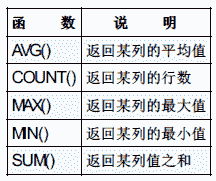

# 网易 2018 校招 Java 开发工程师笔试卷

## 1

下列有关线程的说法正确的是：（ ）

正确答案: D   你的答案: 空 (错误)

```cpp
启动一个线程是调用 start（）方法，是线程所代表的虚拟处理机处于可运行状态，这意味着线程此时就会立即运行。
```

```cpp
notify（）方法可以确切的唤醒某个处于等待状态的线程。
```

```cpp
wait（）方法可以使一个线程处于等待状态，但不会释放所持有对象的锁。
```

```cpp
sleep（）方法使一个正在运行的线程处于睡眠状态，是一个静态方法，调用此方法时，需要捕捉 InterruptedException 异常
```

本题知识点

网易 Java 工程师 Java 工程师 网易 2018

讨论

[迪儿 78](https://www.nowcoder.com/profile/857561136)

线程的几种状态：创建（new） 就绪（ runnable） 运行（running） 阻塞（blocked） timed_waitint(限期等待 )  waiting（无限期等待）消亡（dead）转化过程：1.通过 new 创建线程；2.通过调用 start 方法进入就绪状态（但是不一定会运行）；3.就绪状态通过获得 cpu 的执行时间，进入运行状态；4.运行状态通过进入同步快或者是 io 阻塞，进入到了阻塞状态，阻塞状态通过同步快释放或者是 io 完成，退出阻塞状态，进入就绪状态；运行状态通过 sleep 方法，join 方法（静态方法），wait（seconds）方法进入 time_waiting(限期等待状态)；限期等待通过时间到达进入就绪状态；运行状态通过 wait（），join（）进入无限期等待状态，通过 notify 方法或者是 run 方法执行完毕进入就绪状态；运行状态通过 yield 方法（静态方法）或者是 cpu 时间片用完，进入就绪状态；5.运行状态通过中断或者是执行完毕进入死亡状态。

发表于 2019-08-02 19:25:53

* * *

[叫我皮卡丘](https://www.nowcoder.com/profile/1078265)

A. 当调用 start() 方法时，线程进入**就绪**状态，等待 CPU 分配时间片进入运行状态，并不是直接运行
B. notify() 方法**不能确定**唤醒某个处于等待状态的线程，只能等待 JVM 的安排
C. wait() 方***释放自己所持有对象的锁

发表于 2019-08-01 14:16:31

* * *

[baorant](https://www.nowcoder.com/profile/9958476)

```cpp
wait 是指在一个已经进入了同步锁的线程内，让自己暂时让出同步锁，以便其他正在等待此锁的线程可以得到同步锁并运行，
只有其他线程调用了 notify 方法（notify 并不释放锁，只是告诉调用过 wait 方法的线程可以去参与获得锁的竞争了，但不是马上得到锁， 因为锁还在别人手里，别人还没释放），调用 wait 方法的一个或多个线程就会解除 wait 状态，重新参与竞争对象锁，
程序如果可以再次得到锁，就可以继续向下运行。
```

发表于 2018-07-05 21:33:55

* * *

## 2

如果在一个建立了 TCP 连接的 socket 上调用 recv 函数，返回值为 0，则表示（）

正确答案: B   你的答案: 空 (错误)

```cpp
对端发送了一段长度为 0 的数据
```

```cpp
对端关闭了连接
```

```cpp
还没有收到对端数据
```

```cpp
连接发生错误
```

本题知识点

网易 Java 工程师 2018

讨论

[baorant](https://www.nowcoder.com/profile/9958476)

```cpp
解阻塞与非阻塞 recv 返回值没有区分，都是

1.  <0 出错

2.  =0 连接关闭

3.  >0 接收到数据大小，

```

发表于 2018-07-05 21:35:26

* * *

[叫我皮卡丘](https://www.nowcoder.com/profile/1078265)

1\. 当 recv 返回值小于 0，socket 出错 2\. 当 recv 返回值大于 0，成功，返回值为接受到的数据长度 3\. 当 recv 返回值等于 0，表示当前 connect 已经关闭，没有接受到数据

发表于 2019-08-01 14:20:44

* * *

[迪儿 78](https://www.nowcoder.com/profile/857561136)

1\. 当 recv 返回值小于 0，socket 出错 2\. 当 recv 返回值大于 0，成功，返回值为接受到的数据长度 3\. 当 recv 返回值等于 0，表示当前 connect 已经关闭，没有接受到数据

发表于 2019-08-02 19:33:02

* * *

## 3

如果 C 类子网的掩码为 255.255.255.240，则包含的子网位数、子网数目、每个子网中的主机数目正确的是（ ）

正确答案: C   你的答案: 空 (错误)

```cpp
2 2 2
```

```cpp
3 6 30
```

```cpp
4 14 14
```

```cpp
5 30 6
```

本题知识点

网易 Java 工程师 2018

讨论

[昵称已被占用、](https://www.nowcoder.com/profile/5014683)

子网数：256-240-2=14 子网位数：256-240=16，2⁴ 子网 ip：256/16-2=14

发表于 2018-07-12 20:29:21

* * *

[迪儿 78](https://www.nowcoder.com/profile/857561136)

子网的掩码就是把网络继续向下分，每个子网就是网段，包含某一个范围的 ip 地址。子网位数就是找到不为 255 的数 256-240=16 16 是 2 的 4 次方  子网的位数就是 4 子网的数目就是 2 的 4 次方-2（首尾的 0 和 15）=14 每个子网的主机数目：去掉子网后还有 4 位 2 的 4 次方-2（首尾的 0 和 15）=14

发表于 2019-08-02 20:05:57

* * *

## 4

以下意图那个是用来描述 ADAPTER（适配器）?（      ）

正确答案: B   你的答案: 空 (错误)

```cpp
定义一个用于创建对象的接口，让子类决定实例化哪一个类
```

```cpp
将一个类的接口转换成客户希望的另外一个接口。本模式使得原本由于接口不兼容而不能一起工作的那些类一起工作
```

```cpp
将一个请求封装为一个对象，从而使你可用不同的请求对客户进行参数化；对请求排队或记录请求日志，以及支持可撤销的操作
```

```cpp
表示一个作用于某对象结构中的各元素的操作。它使你可以在不改变各元素的类的前提下作用于这些元素的新操作
```

本题知识点

网易 Java 工程师 2018

讨论

[非止](https://www.nowcoder.com/profile/6451459)

适配器就是一种适配中间件，它存在于不匹配的二者之间，用于连接二者，将不匹配变得匹配，简单点理解就是平常所见的转接头，转换器之类的存在。

适配器模式有两种：类适配器、对象适配器、接口适配器。转自：[`www.cnblogs.com/V1haoge/p/6479118.html`](http://www.cnblogs.com/V1haoge/p/6479118.html)

发表于 2018-07-25 21:17:48

* * *

## 5

某单链表中最常用的操作是在最后一个元素之后插入一个元素和删除链表中给定的元素，则下列选项中正确的是 ________。

正确答案: A   你的答案: 空 (错误)

```cpp
若仅有头指针，则插入操作及删除操作均是 O(n)的
```

```cpp
增加尾指针既能提升插入操作的效率，也能提升删除操作的效率
```

```cpp
既有头指针又有尾指针，则插入操作及删除操作均是 O(1)的
```

```cpp
既有头指针又有尾指针，则插入操作及删除操作均是 O(n)的
```

本题知识点

网易 Java 工程师 2018

讨论

[迪儿 78](https://www.nowcoder.com/profile/857561136)

头指针是指向链表的第一个元素，尾指针是指向链表的最后一个元素。本题中是在尾部插入元素和删除指定的元素：A：如果只有头指针，那么在尾部插入元素要找到最后一个元素，删除的话也要找到某一个元素，时间复杂度是 o（n）B:增加尾指针只能提升插入操作的效率，不用遍历到尾部，不能提升删除操作的效率，还是要遍历到某一个元素 C，D:有头指针和尾指针，插入操作时 O(1)，删除某一元素的操作是（O(n)

发表于 2019-08-02 20:13:35

* * *

[无妄丶](https://www.nowcoder.com/profile/779790078)

区分单链表的查找，插入，删除 1.查找操作和删除操作：都需要遍历链表，移动指针来确定元素位置，所以时间复杂度是 O(n)，此时是否有尾指针没有影响。2.插入操作：有尾指针时，时间复杂度为 O(1)：无尾指针时，因为需要遍历到最后，为 O(n)。故选 A。

发表于 2018-08-10 11:58:43

* * *

[223s](https://www.nowcoder.com/profile/641616950)

删除元素跟有没有头尾指针没关系，都是 O（n）吧？？

发表于 2020-08-07 17:35:41

* * *

## 6

若有 33 个长度不等的初始归并段，做 7 路平衡归并排序，为组织最佳归并树，应增加长度为 0 的初始归并段的个数是 ________。

正确答案: C   你的答案: 空 (错误)

```cpp
0
```

```cpp
2
```

```cpp
4
```

```cpp
6
```

本题知识点

网易 Java 工程师 Java 工程师 网易 2018

讨论

[非止](https://www.nowcoder.com/profile/6451459)

n = 33(初始归并段), m = 7（m 路归并）设度为 0 的节点有 n0(=n)个,度为 m 的节点有 nm 个，则对严格的 m 叉树有 n0 = (m - 1)nm + 1, 由此可以得出 nm = (n0 - 1)/(m - 1)。1）如果（n0-1）%(m-1)=0,则这 n0 个叶节点正好可以构造 m 叉归并树。此时，内节点有 nm 个。(不需要空归并段)2）如果（n0-1）%(m-1)!=0,则对于 n0 个节点有 u（余数）个多余，不能包含在 m 叉归并树中。为构造包含所有 n0 个初始归并段的 m 叉归并树，应在原有 nm 个内结点的基础上再增加一个内结点。它在归并树中代替了一个叶结点位置，被代替的叶结点家伙是哪个刚才多出的 u 个叶结点，再加上 m-u-1 个空归并段，就可以建立归并树。此题,(n0-1) % (m - 1) = 5 ....2 所以空归并段=m - u - 1 = 7 - 2 - 1 = 4

发表于 2018-07-25 22:32:49

* * *

[志明啊](https://www.nowcoder.com/profile/2890097)

(33+2)/7=5;(5+2)/7=1;2+2=4\.

发表于 2018-08-11 12:55:20

* * *

## 7

linux 查看系统 IP 地址以及网卡流量可以使用以下哪个命令

正确答案: B   你的答案: 空 (错误)

```cpp
ipconfig
```

```cpp
ifconfig
```

```cpp
netstat
```

```cpp
ss
```

本题知识点

网易 Java 工程师 Java 工程师 网易 2018

讨论

[迪儿 78](https://www.nowcoder.com/profile/857561136)

ipconfig 是 windows 下的命令 ifconfig 是 Linux 下的命令 查看 IP 地址或者网卡流量**netstat 显示网络连接信息****ss 显示 socket 的状态**

发表于 2019-08-02 20:28:27

* * *

[Wizey](https://www.nowcoder.com/profile/4571996)

Windows 下是 ipconfig，Linux 下是 ifconfig

发表于 2018-10-08 09:28:03

* * *

## 8

如果存在文本文件/tmp/testfile，并且文件行数小于等于 10 行，则输出文件前 3 行，下列脚本正确的是

正确答案: B   你的答案: 空 (错误)

```cpp
<pre>if [[ -n '/tmp/testfile' ]] &amp;&amp; [[ `wc -l /tmp/testfile` -le 10 ]];then
    head -3 /tmp/testfile
fi
</pre>
```

```cpp
<pre>if [[ -f '/tmp/testfile' ]] &amp;&amp; [[ `wc -l /tmp/testfile` -le 10 ]];then
    head -3 /tmp/testfile
fi
</pre>
```

```cpp
<pre>if [[ -n '/tmp/testfile' ]] || [[ `wc -l /tmp/testfile` -le 10 ]];then
    head -3 /tmp/testfile
 fi
</pre>
```

```cpp
<pre>if [[ -f '/tmp/testfile' ]] || [[ `wc -l /tmp/testfile` -le 10 ]];then
    head -3 /tmp/testfile
fi
</pre>
```

本题知识点

网易 Java 工程师 Java 工程师 网易 2018

讨论

[我是如此相信](https://www.nowcoder.com/profile/7988004)

```cpp
[[ -f '/tmp/testfile' ]] 检测文件是否是普通文件（既不是目录，也不是设备文件），
如果是，则返回 true。  
[[ -n '/tmp/testfile' ]] 检测字符串长度是否为 0，不为 0 返回 true
```

```cpp
wc [-clw][--help][--version][文件...]  

-c 或--bytes 或--chars 只显示 Bytes 数 
-l 或--lines 只显示行数
-w 或--words 只显示字数。
```

```cpp
-le 检测左边的数是否小于等于右边的，如果是，则返回 true。
-lt 检测左边的数是否小于右边的，如果是，则返回 true。
```

```cpp
head 命令 https://www.cnblogs.com/chen-cai/p/8044800.html
```

编辑于 2018-11-02 14:35:19

* * *

[迪儿 78](https://www.nowcoder.com/profile/857561136)

首先判断是不是文本文件，并且是否行数小于等于 10，满足的情况下输出前 3 行：<pre>if [[ -f  '/tmp/testfile']] &amp;&amp [[ 'wc -l  /tmp/testfile' -le 10]];thenhead 3 /tmp/testfile fi</pre>解析：-f 表示判断是不是文本文件  &amp;&amp（&&）wc -l 表示的是行数 -le 表示的是小于等于 10 两个条件都满足返回 true 执行：显示文件的前 3 行 fi 表示的是 if 结束

发表于 2019-08-02 20:43:20

* * *

## 9

已知脚本内容如下:

```cpp
    if [ $1 -eq 5 ];then
         echo True
     else:
         echo False
```

以下能达到同等效果的是:

正确答案: A   你的答案: 空 (错误)

```cpp
[[ $1 -eq 5 ]] && echo True || echo False
```

```cpp
[[ $1 -eq 5 ]] && echo True && echo False
```

```cpp
[[ $1 -eq 5 ]] || echo True || echo False
```

```cpp
[[ $1 -eq 5 ]] || echo True && echo False
```

本题知识点

网易 Java 工程师 Java 工程师 网易 2018

讨论

[迪儿 78](https://www.nowcoder.com/profile/857561136)

$1 eq 5 表示方程式的第一个参数等于 5echo 后面跟上要输出的内容意思就是如果第一个参数等于 5，输出 true；否则输出 false。&& 第一个参数为 false 不会执行下一个|| 第一个参数为 true 不会执行下一个

```cpp
[[ $1 -eq 5 ]] && echo True || echo False
```

看做 3 个参数，第一个表达式参数：第一个参数等于 5 不执行第三个参数了，表达式就变为了前两个参数相与；第一个参数不等于 5 不执行第二个参数了，表达是就变为了第一个参数和第二个参数或   输出结果能和原来是一样的

发表于 2019-08-02 20:52:58

* * *

[pi 伟人](https://www.nowcoder.com/profile/3458346)

利用了||的短路原理

发表于 2018-08-10 10:48:08

* * *

[我是如此相信](https://www.nowcoder.com/profile/7988004)

关于&& 如果第一个参数为 false 则第二个参数不会执行关于||    如果第一个参数为 true  则第二个参数不会执行

发表于 2018-11-01 17:01:06

* * *

## 10

有时候因为磁盘空间快满了，我们需要删除一些 log 文件，但是忘记停止程序了，日志删除后，发现磁盘空间并没有释放，这时候我们通常使用以下哪种方式查找已删除文件的进程占用

正确答案: B   你的答案: 空 (错误)

```cpp
ps
```

```cpp
lsof
```

```cpp
top
```

```cpp
df
```

本题知识点

网易 Java 工程师 2018

讨论

[迪儿 78](https://www.nowcoder.com/profile/857561136)

ps 查看当前的进程 lsof 列出当前系统中打开的文件 top 实时显示系统中各个进程的资源的占用情况 df 检查 Linux 服务器中的文件系统的磁盘占用情况

发表于 2019-08-02 20:57:46

* * *

[怪我青丝却华发](https://www.nowcoder.com/profile/368176640)

此时并没有 kill 掉这些进程，lsof | grep deleted 命令查看删除的文件的进程

发表于 2019-05-22 17:52:21

* * *

[叫我皮卡丘](https://www.nowcoder.com/profile/1078265)

A. ps 查看当前进程 B. lsof 列出当前系统打开文件 C. top 实时显示系统中各个进程的资源占用情况 D. df 检查 linux 服务器的文件系统的磁盘空间占用情况

发表于 2019-08-01 19:09:26

* * *

## 11

TCP 三次握手和四次挥手过程中，以下状态分别处于服务端和客户端描述正确的是

正确答案: C   你的答案: 空 (错误)

```cpp
服务端：SYN-SEND，TIME-WAIT 客户端：SYN-RCVD，CLOSE-WAIT
```

```cpp
服务端：SYN-SEND，CLOSE-WAIT 客户端：SYN-RCVD，TIME-WAIT
```

```cpp
服务端：SYN-RCVD，CLOSE-WAIT 客户端：SYN-SEND，TIME-WAIT
```

```cpp
服务端：SYN-RCVD，TIME-WAIT 客户端：SYN-SEND，CLOSE-WAIT
```

本题知识点

网易 Java 工程师 Java 工程师 网易 2018

讨论

[迪儿 78](https://www.nowcoder.com/profile/857561136)

三次握手：客户端为 a，服务端为 b；开始都是 closed 状态；a 主动打开进入到 syn_sent 状态，b 被动打开进入 listen 状态；第一次握手，a 向 b 发送 SYN=1，seq 为 x 的包，b 收到以后进入 syn-rcvd 状态；第二次握手，b 向 a 发送 SYN=1，ACK=1,seq=y，ack=x+1 的包，a 收到后进入 eatablished 状态；第三次握手，a 向 b 发送 ACK=1,seq=x+1，ack=y+1 的包，b 收到以后进入 established 状态。所以在三次握手阶段：客户端是 closed      syn-send   established      服务端是 colsed  listen  syn-rcvd established 四次挥手：客户端是 a，服务端是 b，开始都是 established 状态；a 主动关闭，发送 FIN=1 seq=u，进入 FIN_WAIT_1 状态；b 收到后，发送 ACK=1，seq=v，ack=u+1，进入到 close_wait 状态；a 收到数据进入到 FIN_WAIT_2 状态，，接着进行未传送完数据的传送，b 发送完数据后，发送 FIN=1,seq=w，ack=u+1，进入到 last_ack 状态；a 收到后进入到 time_wait 状态，等待两个 MSL 时间（最大数据报时间），发送 ACK=1，seq=u+1，ack=w+1 进入到 closed 状态；b 收到后进入到 closed 状态。所以在四次挥手过程中：客户端的状态是 established fin_wait_1 fin_wait_2 time_wait closed;服务端的状态是 established close_wait  last_ack closed 总的状态变化是 客户端：closed—syn_sent——established——fin_wait_1——fin_wait_2——time_wait——closed 服务端是 closed——listen——syn_rcvd——eatablished——close_wait——last_ack——closed

发表于 2019-08-03 10:00:13

* * *

[叫我皮卡丘](https://www.nowcoder.com/profile/1078265)

服务端状态：CLOSED -> LISTEN -> SYN_RCVD -> ESTABLISHED -> CLOSE_WAIT -> LAST_ACK -> CLOSED 客户端状态：CLOSED -> SYN_SENT -> ESTABLISHED -> FIN_WAIT_1 -> FIN_WAIT_2 -> TIME_WAIT -> CLOSED

编辑于 2019-08-01 23:02:37

* * *

## 12

对于 SQL 语句 select * from t where a=100 and b=200，哪个索引可以使用到？

正确答案: D   你的答案: 空 (错误)

```cpp
索引 idx_b(b)
```

```cpp
索引 idx_b_a(b,a)
```

```cpp
索引 idx_a_b(a,b)
```

```cpp
都可以
```

本题知识点

网易 Java 工程师 Java 工程师 网易 2018

讨论

[风雪夜之恋](https://www.nowcoder.com/profile/147839944)

根据最左匹配原则：最左优先，以最左边的为起点任何连续的索引都能匹

配上。同时遇到范围查询(>、<、between、like)就会停止匹配。题中没有范围查询，而 sql 语句中会自动调整语句的顺序，所以题中，不管是 a 在前还是 b 在前，效果是一样的，都会根据联合索引的顺序去进行调整，对于联合所以（b,a)来说,sql 会自动调整为 elect * from t where b=200 and a=100，而这条语句当然也是可以使用 b 索引的

发表于 2019-08-01 11:27:36

* * *

[迪儿 78](https://www.nowcoder.com/profile/857561136)

sql 语句会自动调整语句的顺序索引是最左匹配原则 从最左边开始索引匹配  遇到范围查询停止索引

发表于 2019-08-03 10:27:46

* * *

## 13

以下不是 SQL 的聚集操作函数的是？

正确答案: A   你的答案: 空 (错误)

```cpp
HAVING
```

```cpp
SUM
```

```cpp
MAX
```

```cpp
COUNT
```

本题知识点

网易 Java 工程师 Java 工程师 网易 2018

讨论

[昵称已被占用、](https://www.nowcoder.com/profile/5014683)

聚集函数是以一个集合（集或者多重集）为输入、返回单个值的函数。SQL 提供了五个固有聚集函数。
平均值：avg
最小值：min
最大值：max
总和：sum
计数：countHaving 是一个过滤声明，是在查询返回结果集以后对查询结果进行的过滤操作，在 Having 中可以使用聚合函数。

发表于 2018-07-12 21:18:04

* * *

[寂寞包邮](https://www.nowcoder.com/profile/7193579)



发表于 2018-07-06 20:52:53

* * *

## 14

若要在员工信息表 EMP 中增加一列 WANGYI_NO（网易 id），可用（ ）。

正确答案: C   你的答案: 空 (错误)

```cpp
ADD TABLE EMP（WANGYI_NO CHAR（10））
```

```cpp
ADD TABLE EMP ALTER（WANGYI_NO CHAR（10））
```

```cpp
ALTER TABLE EMP ADD（WANGYI_NO CHAR（10））
```

```cpp
ALTER TABLE EMP （ADD WANGYI_NO CHAR（10））
```

本题知识点

网易 Java 工程师 Java 工程师 网易 2018

讨论

[迪儿 78](https://www.nowcoder.com/profile/857561136)

列名和列字段的类型可以扩起来

发表于 2019-08-03 10:28:34

* * *

## 15

小易为了向他的父母表现他已经长大独立了,他决定搬出去自己居住一段时间。一个人生活增加了许多花费: 小易每天必须吃一个水果并且需要每天支付 x 元的房屋租金。当前小易手中已经有 f 个水果和 d 元钱,小易也能去商店购买一些水果,商店每个水果售卖 p 元。小易为了表现他独立生活的能力,希望能独立生活的时间越长越好,小易希望你来帮他计算一下他最多能独立生活多少天。

本题知识点

网易 Java 工程师 模拟 数学 贪心 2018

讨论

[牛客 96654687 号](https://www.nowcoder.com/profile/96654687)

第一次做这种题目，我以为可以不用导入，他会自动识别的，难怪我的声明 scanner 的语句是正确的，但是自行调试的时候老是报这个错误

发表于 2019-07-30 19:20:11

* * *

[ccccchelsea](https://www.nowcoder.com/profile/96431880)

考虑两种情况：1.已有水果还没吃完就交不起房租了；2.已有水果吃完，仍然有剩余的钱付房租买水果。

```cpp

	import java.util.Scanner;

	public class Main{

	    public static void main(String[] args){

	        Scanner sc =new Scanner(System.in);

	        String input = sc.nextLine();

	        String[] cs = input.split(" ");

	        int[] num =new int[cs.length];

	        for(inti=0; i<cs.length; i++){

	            num[i] = Integer.valueOf(cs[i]);

	        }

	        System.out.print(maxDay(num));

	    }

	    public static int maxDay(int[] a){

	        if(a ==null|| a.length ==0){

	            return0;

	        }

	        int max =0;

	        int reminder = a[2];

	        if(a[0] * a[1] >= a[2]){

	            max = a[2] / a[0];

	        }else{

	            reminder -= a[0]*a[1];

	            max = a[1] + reminder / (a[0] + a[3]);

	        }

	        return max;

	    }

	}

```

发表于 2019-07-19 16:46:29

* * *

[hujianbest](https://www.nowcoder.com/profile/8207002)

```cpp

	importjava.util.Scanner;

	publicclassMain {

	    publicstaticvoidmain(String[] args) {

	        Scanner in = newScanner(System.in);

	        intx = in.nextInt();

	        intf = in.nextInt();

	        intd = in.nextInt();

	        intp = in.nextInt();

	        intdays = (d - f*x)>0?(f+(d-f*x)/(x+p)):(d/x);

	        System.out.println(days);

	    }

	}

```

emmm，就酱

发表于 2018-08-10 16:36:17

* * *

## 16

小易将 n 个棋子摆放在一张无限大的棋盘上。第 i 个棋子放在第 x[i]行 y[i]列。同一个格子允许放置多个棋子。每一次操作小易可以把一个棋子拿起并将其移动到原格子的上、下、左、右的任意一个格子中。小易想知道要让棋盘上出现有一个格子中至少有 i(1 ≤ i ≤ n)个棋子所需要的最少操作次数.

本题知识点

网易 Java 工程师 模拟 2018

讨论

[风雪夜之恋](https://www.nowcoder.com/profile/147839944)

```cpp
//最后的重叠点的横坐标是 n 个棋子中的横坐标之一，纵坐标是 n 个棋子中的纵坐标之一，
//因此考虑这 n*n 种情况。从网上得到证明（我也不是很理解）：这方法称为曼哈顿距离，
//即方法关键在于求和的时候可以把 x 和分开，独立分析… import java.util.Arrays;
import java.util.Scanner;

public class Main {
    public static void main(String[] args) {
        Scanner sc = new Scanner(System.in);
        int n = sc.nextInt();
        int[] x = new int[n];
        int[] y = new int[n];
        for (int i = 0; i < n; i++) {
            x[i] = sc.nextInt();
        }
        for (int i = 0; i < n; i++) {
            y[i] = sc.nextInt();
        }

        //记录输入的点到可能出现的点的距离
        int dis[] = new int[n];

        //最优解
        int result[] = new int[n];
        //初始化
        for(int i = 0 ; i < n ; i++){
            result[i] = Integer.MAX_VALUE;
        }

        //前两个循环表示：最终移动的点会落在已有的横纵坐标的组合上
        for(int i = 0;i < n ; i++){
            for(int j = 0 ; j < n ; j++){

                //对输入的点进行遍历，计算每个输入的点到 x[i]y[j]的距离
                for(int k = 0 ; k < n ; k++){
                    //dis[0] 表示输入的第 0 个点到 x[i]y[j]的步数
                    dis[k] = Math.abs(x[i]-x[k])+Math.abs(y[j]-y[k]);
                }
                //采用快排对 dis 进行排序
                Arrays.sort(dis);
                int temp=0;
                for(int t = 0 ; t < n ; t++){
                    //累加 t 个点 移动到 x[i]y[j]的步数
                    temp = temp + dis[t];

                    //result[t] 会在每次不同的 x[i]y[j] 时更新最小值
                    result[t] = Math.min(result[t],temp);
                }

            }
        }
        //最后不能有空格
        System.out.print(result[0]);
        for(int i = 1;i<n;i++){
            System.out.print(" "+result[i]);
        }
    }
}

```

编辑于 2019-08-01 15:28:30

* * *

[ac_q](https://www.nowcoder.com/profile/67500173)

大佬们，题目什么意思呀，看不懂

编辑于 2020-03-12 13:54:18

* * *

[Sunsunsusnusn](https://www.nowcoder.com/profile/510774739)

```cpp
import java.util.Arrays;
import java.util.Scanner; 
public class Main { 
     public static void main(String[] args) {
        Scanner sc = new Scanner(System.in);
        int n = sc.nextInt();
        int[] x = new int[n];
        int[] y = new int[n];
        for (int i = 0; i < n; i++) {
            x[i] = sc.nextInt();
        }
        for (int i = 0; i < n; i++) {
            y[i] = sc.nextInt();
        }
        sc.close();
        int[] dis = new int[n];
        int[] result = new int[n];
        for (int i = 0; i < n; i++) {
            result[i] = Integer.MAX_VALUE;
        }
        for (int i = 0; i < n; i++) {
            for (int j = 0; j < n; j++) {
                for (int k = 0; k < n; k++) {
                    dis[k] = Math.abs(x[k] - x[i]) + Math.abs(y[k] - y[j]);
                }
                Arrays.sort(dis);
                int temp = 0;
                for (int r = 0; r < n; r++) {
                    temp += dis[r];
                    result[r] = Math.min(temp, result[r]);
                }
            }
        }
        for (int i = 0; i < n - 1; i++) {
            System.out.print(result[i] + " ");
            System.out.println(result[n - 1]);
        }
    }

}
```

编辑于 2018-08-11 09:17:41

* * *

## 17

小易非常喜欢拥有以下性质的数列:
1、数列的长度为 n
2、数列中的每个数都在 1 到 k 之间(包括 1 和 k)
3、对于位置相邻的两个数 A 和 B(A 在 B 前),都满足(A <= B)或(A mod B != 0)(满足其一即可)
例如,当 n = 4, k = 7
那么{1,7,7,2},它的长度是 4,所有数字也在 1 到 7 范围内,并且满足第三条性质,所以小易是喜欢这个数列的
但是小易不喜欢{4,4,4,2}这个数列。小易给出 n 和 k,希望你能帮他求出有多少个是他会喜欢的数列。

本题知识点

网易 Java 工程师 动态规划 2018

讨论

[风雪夜之恋](https://www.nowcoder.com/profile/147839944)

```cpp
import java.util.Scanner;

public class Main {
    //动态规划 dp[i][j]表示的含义是前 i 个整数，以 j 结尾的时候，有多少喜欢的数列。
    //转义方程如下
    //dp[i][j]=sum( dp[i-1][1,2,3,…,k] ) - sum(dp[i-1][x] , x>j 且 x%j=0)

    public static final int M = 1000000007;

    public static void main(String[] args) {
        Scanner sc = new Scanner(System.in);
        int n = sc.nextInt();
        int k = sc.nextInt();
        sc.close();
        System.out.println(Count(n, k));
    }
    public static int Count(int n, int k){
        //dp[j][j]表示前 i 个整数以 j 结尾时，有多少喜欢的队列
        //这里数组的下标不从 0 开始
        int [][]dp = new int[n+1][k+1];

        //这个没有意义，只是为了计算 dp[1][k],即当只有一个数时借助前面的状态来计算
        dp[0][1] = 1;
        for(int i = 1 ; i <= n ; i++){

            int sumAll = 0;
            //先算 sum( dp[i-1][1,2,3,…,k] )
           for(int j = 1 ; j<= k; j++){
               //这里的 j 就是上面的 k。 由于 dp[0][1] = 1,当 i=1 时，可以得出正确结果 1
               sumAll = sumAll + dp[i-1][j];
               //这里每次都要跟 M 取模，否则可能会产生整数溢出
               sumAll = sumAll%M;
           }
           //接下来算不符合的部分
            //sum(dp[i-1][x] , x>j 且 x%j=0)
            //当以 j 结尾时，
            for(int j = 1 ; j <= k; j++){
                int sumNo = 0;
                //这里包含两个意思 即 x > j 且 x%j=0
                for(int x = j + j ; x <= k ; x+=j){
                    sumNo += dp[i-1][x];
                    sumNo %= M;
                }
                //dp[i][j]=sum( dp[i-1][1,2,3,…,k] ) - sum(dp[i-1][x]x>j 且 x%j=0)
                dp[i][j] = (sumAll - sumNo + M)%M;

            }

        }
        int result = 0;
        for(int i = 1; i <= k; i++) {
            //计算 n 个数分别以 1-k 结尾的符合数列
            result+=dp[n][i];
             result %= M;
        }
        return  result;

    }
}

```

发表于 2019-08-01 16:35:39

* * *

[猜猜我是谁⊙∀⊙！](https://www.nowcoder.com/profile/697123)

```cpp
# python 代码时间复杂度只能过 90%，哪里还可以改进呢？

# dp[i][j] 代表，长度为 i，以 j 结尾的满足条件的数列的个数
# dp[i][j] = sum(dp[i-1][1~k]) - sum(dp[i-1][x]), 其中 x>j and x%j==0
# ps: 对同一个 i, sum(dp[i-1][1~k]) 是不变的
# 1<=i<=n, 1<=j<=k
def find(n, k):
    MOD = 1000000007
    dp = []
    for i in range( n +1):
        dp.append([0 for j in range( k +1)])
    for i in range(1, n+ 1):
        # i=1 时，dp[1][j] = 1
        if i == 1:
            for j in range(1, k + 1):
                dp[i][j] = 1
        else:
            # 计算对同一个 i，sum1 都相同
            sum1 = 0
            for x in range(1, k + 1):
                sum1 += dp[i - 1][x]
                sum1 %= MOD
            # 计算对每一个 j 都不同的第二个 sum 部分
            for j in range(1, k + 1):
                sum2 = 0
                # 如果不用 while 用下面  for 循环，只能过 40%
                x = 2 * j
                while x <= k:
                    sum2 += dp[i - 1][x]
                    sum2 %= MOD
                    x += j
                # for x in range(j + 1, k + 1):
                #     if x % j == 0:
                #         sum2 += dp[i - 1][x]
                #         sum2 %= MOD

                # 因为前面都对 sum1/sum2 做了 mod 处理，可能 sum1 比 sum2 小
                # 所以先给 sum1 加一个 MOD
                dp[i][j] = (sum1 + MOD - sum2) % MOD
    # 注意结果不是 dp[n][k]，而是 sum(dp[n][1~l])
    res = 0
    for j in range(1, k + 1):
        res += dp[n][j]
        res %= MOD
    return res

if __name__ == "__main__":
    n, k = map(int, input().strip().split(" "))
    print(find(n, k))

```

发表于 2019-08-04 21:07:15

* * *

[offer 快来我这里呀](https://www.nowcoder.com/profile/403283243)

```cpp

```
import java.util.Scanner; public class Main2 { public static void main(String[] args) {
        Scanner scanner = new Scanner(System.in);
        String[] s = scanner.nextLine().split("0t");
        Integer n = Integer.valueOf(s[0]);
        Integer k = Integer.valueOf(s[1]); int[] a= new int[n]; getsum(n,k);
        System.out.println(sum%q);

    } public  static  int q=1000000007; public static int sum=0; public static void getsum(int n,int k){

  int[] a= new int[n]; aa(a,0,n,k);
    } public static void aa(int[] a,int index,int n,int k){  if(index>=n){ //如果已经有 n 个数满足，总数加 1  sum++;

```cpp
 return ;
```

} 

 for(int i=1;i<=k;i++){ //循环从 1-k 中取数

 if(index==0){
                    a[index]=i; 

 aa(a,index+1,n,k);//第一个数不用比较，直接添加 求下一位
                }else{ 

 if(a[index-1]<=i||a[index-1]%i!=0){//满足要求的就 加入，求下一位数
                        a[index]=i; aa(a,index+1,n,k);
                    }
                }
            } return;
    }
} 
```cpp

```

为啥只 ac30%，求解。

发表于 2019-08-03 10:53:39

* * *

## 18

定义字符串 String str = “用户 1|用户 2|用户 3|用户 4”，现在想要对字符串根据字符“|”进行分割解析，下面哪种分割方式是正确的？（）

正确答案: C   你的答案: 空 (错误)

```cpp
str.split("\|")
```

```cpp
str.split("|")
```

```cpp
str.split("\\|")
```

```cpp
str.split("\\\|")
```

本题知识点

网易 Java 工程师 2018 C 语言

讨论

[天才落语°](https://www.nowcoder.com/profile/3204303)

| 属于正则表达式中的一部分，所以要加双斜杠 \\|

发表于 2018-05-31 11:51:17

* * *

[offer 工程师](https://www.nowcoder.com/profile/152439887)

“.”在正则表达式中表示任意字符，如果要通过“.”号做分割，可以写成，split("\\.")或者 split(Pattern.quote(".")) “/”可以写成 split("\\/")或者 split(Pattern.quote("/"))

发表于 2021-03-18 11:32:33

* * *

[烬天玉藻前](https://www.nowcoder.com/profile/195480900)

```cpp
String str = "用户 1|用户 2|用户 3|用户 4";
//A
str.split("\|");
//B
str.split("|");
//C
str.split("\\|");
//D
str.split("\\\|");
```

貌似 C++里没有对应的 split()函数，Java 里有：

```cpp
public String[] split(String regex, int limit);
```

（1）regex 是可选项。字符串或正则表达式对象，它标识了分隔字符串时使用的是一个还是多个字符。如果忽略该选项，返回包含整个字符串的单一元素数组。
（2）limit 也是可选项。该值用来限制返回数组中的元素个数。
**（3）要注意转义字符：“.”和“|”都是转义字符，必须得加"\"。同理：*和+也是如此的。**

发表于 2020-09-21 15:22:49

* * *

## 19

在编程中我们经常需要做一些数据过滤或校验，为了能够精确且方便的匹配数据，可以使用 Java 的正则表达式。现有如下正则表达式：
"^((13[0-9])|(15[⁴])|(18[0-9])|(17[0-8]))\d{8}$"
请问下面哪个值能够被正确匹配？（）

正确答案: B   你的答案: 空 (错误)

```cpp
182217265233
```

```cpp
13855112578
```

```cpp
15417850808
```

```cpp
16808808888
```

本题知识点

网易 Java 工程师 2018

讨论

[梦合九千](https://www.nowcoder.com/profile/6246784)

[`www.cnblogs.com/ytc6/p/8478989.html`](http://www.cnblogs.com/ytc6/p/8478989.html)

**正则表达式中”^”这个字符的用法**

**用法一:**

    匹配输入的开始，如果多行标示被设置成了 true，同时会匹配后面紧跟的字符。     比如：   A/会匹配"An e"中的 A，但是不会匹配"ab A"中的 A

**用法二：**

    当这个字符出现在一个字符集合模式的第一个字符时，他将会有不同的含义。

    **比如：** /[^a-z\s]/会匹配"my 3 sisters"中的"3"  这里的”^”的意思是字符类的否定，上面的正则表达式的意思是匹配不是（a 到 z 和空白字符）的字符。 

**那么：**

什么时候”^”是否定字符，什么时候是匹配开始行

表示限定开头的示例：

```cpp
/[(^\s+)(\s+$)]/g
(^cat)$
(^cat$)
^(cat)$
^(cat$)
```

表示否定的示例：

```cpp
[^a]表示“匹配除了 a 的任意字符”。 [^a-zA-Z0-9]表示“找到一个非字母也非数字的字符”。 [\^abc]表示“找到一个插入符或者 a 或者 b 或者 c”。 
```

经过对比，我发现了只要是”^”这个字符是在中括号”[]”中被使用的话就是表示字符类的否定，如果不是的话就是表示限定开头。我这里说的是直接在”[]”中使用，不包括嵌套使用。 
其实也就是说”[]”代表的是一个字符集，”^”只有在字符集中才是反向字符集的意思。

发表于 2018-06-22 20:17:49

* * *

[我是如此相信](https://www.nowcoder.com/profile/7988004)

首先以 13、15、18 或 17 开头 d 错误 15 开头后面的一个字符不能是 4  c 错误 18 开头后面接一个 0-9 的字符，然后再接 8 个数字 a 错误

发表于 2018-11-02 17:08:39

* * *

[牛客 206597936 号](https://www.nowcoder.com/profile/206597936)

A 正则匹配 11 位，A 选项有 12 位 B 正确 C 15[⁴]  15 后面不能跟 4D 168 不能匹配开头

发表于 2021-01-21 11:49:11

* * *

## 20

如果希望在网络中通过某个类的对象包装数据进行传输，那么这个类需要实现下面哪个接口？（）

正确答案: C   你的答案: 空 (错误)

```cpp
Cloneable
```

```cpp
Comparable
```

```cpp
Serializable
```

```cpp
Runnable
```

本题知识点

网易 Java 工程师 Java 工程师 网易 2018

讨论

[张恨水](https://www.nowcoder.com/profile/41341393)

一个对象序列化的接口。

序列化就是将类的实例持续化保存。

发表于 2019-08-02 17:17:52

* * *

## 21

在多线程编程中我们常常需要考虑到线程安全性，那么在 java 集合中，下面哪些是属于多线程安全的的集合类？（）

正确答案: C   你的答案: 空 (错误)

```cpp
HashMap,  Vector
```

```cpp
LinkedList,  LinkedHashMap
```

```cpp
CurrentHashMap,  Vector
```

```cpp
ArrayList, LinkedHashMap
```

本题知识点

网易 Java 工程师 Java 工程师 网易 2018

讨论

[反三角](https://www.nowcoder.com/profile/705230735)

c

发表于 2018-06-07 18:19:30

* * *

## 22

定义如下程序：

```cpp
Public static void main(String[] args){
    String str1 = “ABCDEFG”;
    System.out.println(str1.substring(2,5));
}
```

程序输出结果是：（）

正确答案: B   你的答案: 空 (错误)

```cpp
&rdquo;BCDE&rdquo;
```

```cpp
&ldquo;CDE&rdquo;
```

```cpp
&ldquo;CDEF&rdquo;
```

```cpp
&ldquo;BCD&rdquo;
```

本题知识点

网易 Java 工程师 2018

讨论

[李道臣](https://www.nowcoder.com/profile/410877049)

这是 Java 的题，不是 C++的啊

发表于 2020-08-17 21:47:11

* * *

[主公 201806072255693](https://www.nowcoder.com/profile/374239559)

取头去尾

发表于 2018-08-11 14:29:32

* * *

[叫我皮卡丘](https://www.nowcoder.com/profile/1078265)

左闭右开

发表于 2019-08-01 10:56:21

* * *

## 23

下列代码的时间复杂度是多少()(^符号是幂的意思)

```cpp
int func(int N)
{
    int cnt = 0;
    for(int i=1;i<=N;i++)
        for(int j=1;j<=N;j+=i)
            cnt+=(i+j);
    return cnt;
}
```

正确答案: B   你的答案: 空 (错误)

```cpp
O(N)
```

```cpp
O(NlogN)
```

```cpp
O(N¹.5)
```

```cpp
O(N²)
```

本题知识点

网易 Java 工程师 Java 工程师 网易 2018

讨论

[全程陪跑](https://www.nowcoder.com/profile/6160535)

j+=i。。。没看到

发表于 2018-08-09 21:25:50

* * *

[Shengtao](https://www.nowcoder.com/profile/285484374)

时间复杂度类似于快排

发表于 2019-08-06 19:52:32

* * *