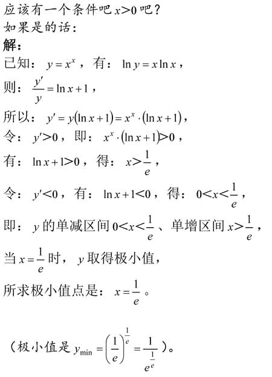
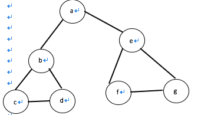

# 网易 2018 实习生招聘笔试题-推荐算法实习生

## 1

某地区每个人的年收入是右偏的，均值为 5000 元，标准差为 1200 元。随机抽取 900 人并记录他们的年收入，则样本均值的分布为()

正确答案: A   你的答案: 空 (错误)

```cpp
近似正态分布，均值为 5000 元，标准差为 40 元
```

```cpp
近似正态分布，均值为 5000 元，标准差为 1200 元
```

```cpp
右偏分布，均值为 5000，标准差为 40
```

```cpp
左偏分布，均值为 5000 元，标准差为 1200 元
```

本题知识点

网易 算法工程师 算法工程师 网易 2018

讨论

[aiaiairs](https://www.nowcoder.com/profile/36767624)

中心极限定理表明，在相当 一般的情况下，当独立随机变量的个数不断增加时，其抽样样本和的分布趋于正态分布（所以样本均值亦趋于正态分布）。同时，抽样均值的方差=原分布方差²/（抽样个数）。

发表于 2019-06-04 09:48:23

* * *

[稻草人 201903052221497](https://www.nowcoder.com/profile/130720221)

中心极限定理，样本量 N 只要越来越大，抽样样本 n 的样本均值会趋近于正态分布，并且这个正态分布以 u 为均值，sigma²/n 为方差。

发表于 2019-04-06 16:51:39

* * *

## 2

函数 y=x^x,(x＞0)的极小值点是 ______

正确答案: D   你的答案: 空 (错误)

```cpp
1
```

```cpp
√2
```

```cpp
(√2)^(√2)
```

```cpp
(1/e)^(1/e)
```

本题知识点

网易 算法工程师 算法工程师 网易 2018

讨论

[adcsuptop](https://www.nowcoder.com/profile/83449723)



发表于 2019-08-03 13:20:56

* * *

## 3

命题 A：随机变量 X 和 Y 独立，命题 B：随机变量 X 和 Y 不相关。A 是 B 的 ______ 条件。

正确答案: A   你的答案: 空 (错误)

```cpp
充分不必要
```

```cpp
必要不充分
```

```cpp
不充分不必要
```

```cpp
充要
```

本题知识点

网易 算法工程师 算法工程师 网易 2018

讨论

[一颗小瓜子](https://www.nowcoder.com/profile/1659497)

独立一定不相关，不相关不一定独立

发表于 2020-08-07 12:18:12

* * *

## 4

关于矩阵的广义逆，下列表述不正确的是 ________

正确答案: D   你的答案: 空 (错误)

```cpp
若矩阵 A 的广义逆为 B，则 A*B*A=A，B*A*B=B
```

```cpp
若矩阵 A 的广义逆为 B，则 A*B 和 B*A 都是对称阵。
```

```cpp
矩阵 A 一定存在确定唯一的广义逆。
```

```cpp
矩阵 A 可能不存在广义逆。
```

本题知识点

网易 算法工程师 算法工程师 网易 2018

讨论

[西二旗菜得抠脚算法工程师](https://www.nowcoder.com/profile/504904300)

答案有问题啊，广义逆矩阵不唯一啊

发表于 2019-09-13 17:33:09

* * *

## 5

关于梯度方向，下列说法正确的是 ______

正确答案: A   你的答案: 空 (错误)

```cpp
给定某定点，沿着梯度方向函数值增加最快
```

```cpp
给定某定点，沿着梯度方向函数值减少最快
```

```cpp
任何函数的定点一定存在梯度方向
```

```cpp
如果函数不是凸函数，则一定存在至少一个点不存在梯度方向
```

本题知识点

网易 算法工程师 算法工程师 网易 2018

## 6

下列哪种不是使用随机森林计算特征重要度的方法 ______

正确答案: D   你的答案: 空 (错误)

```cpp
selection frequency
```

```cpp
gini importance
```

```cpp
permutation importance
```

```cpp
gauss mixture model
```

本题知识点

网易 算法工程师 算法工程师 网易 2018

## 7

对于给定 1000 个训练样本的二分类问题，关于支持向量机的说法，正确的有 _____

正确答案: A   你的答案: 空 (错误)

```cpp
需要构造 1000 个辅助变量，计算它们的非零值对应着支撑向量。
```

```cpp
如果使用高斯核函数，不需要构造 1000 个辅助变量，只需要 100 个。
```

```cpp
如果使用多项式核函数，不需要构造 1000 个辅助变量，只需要 100 个。
```

```cpp
在当前普通计算机上需要约 1 小时才能得到训练模型。
```

本题知识点

网易 算法工程师 算法工程师 网易 2018

讨论

[零葬](https://www.nowcoder.com/profile/75718849)

核函数并不能减少拉格朗日乘子的数量

发表于 2020-11-07 12:53:26

* * *

## 8

下列哪种不是支持向量机的分类类别 _____

正确答案: D   你的答案: 空 (错误)

```cpp
线性可分支持向量机
```

```cpp
线性支持向量机
```

```cpp
非线性支持向量机
```

```cpp
高阶支持向量机
```

本题知识点

网易 算法工程师 算法工程师 网易 2018

## 9

下列关于核函数的表述正确的是 ______

正确答案: C   你的答案: 空 (错误)

```cpp
核函数即特征的映射关系。
```

```cpp
多项式核函数只是将原始特征映射，并没有升维
```

```cpp
高斯核函数将特征映射到无穷维
```

```cpp
使用线性核函数的 SVM 是非线性分类器
```

本题知识点

网易 算法工程师 算法工程师 网易 2018

## 10

下列哪项不是 SVM 的优势 _____

正确答案: C   你的答案: 空 (错误)

```cpp
可以和核函数结合
```

```cpp
通过调参可以往往可以得到很好的分类效果
```

```cpp
训练速度快
```

```cpp
泛化能力好
```

本题知识点

网易 算法工程师 算法工程师 网易 2018

讨论

[一颗小瓜子](https://www.nowcoder.com/profile/1659497)

svm 需要构造核矩阵和样本数量个数的辅助变量

发表于 2020-08-07 12:42:45

* * *

## 11

为了找到自己满意的工作，牛牛收集了每种工作的难度和报酬。牛牛选工作的标准是在难度不超过自身能力值的情况下，牛牛选择报酬最高的工作。在牛牛选定了自己的工作后，牛牛的小伙伴们来找牛牛帮忙选工作，牛牛依然使用自己的标准来帮助小伙伴们。牛牛的小伙伴太多了，于是他只好把这个任务交给了你。

本题知识点

网易 算法工程师 排序 *模拟 贪心 2018* *讨论

[零葬](https://www.nowcoder.com/profile/75718849)

首先，对于相同难度的工作，仅保留报酬高的，因为这两种工作无论能不能做都会选择报酬高的其次，抛弃报酬低，要求还高的工作，因为这种情况下会选择报酬高能力还要求不高的最后，再根据自己的能力来选择能够最大限度发挥自己才能的工作

```cpp
import java.util.Scanner;
import java.util.TreeMap;
import java.util.Map.Entry;

public class Main {
    public static void main(String[] args){
        Scanner sc = new Scanner(System.in);
        int n = sc.nextInt(), m = sc.nextInt();
        // 存储工作难度及其报酬
        TreeMap<Integer, Integer> map1 = new TreeMap<>();
        for(int i = 0; i < n; i++){
            int d = sc.nextInt(), p = sc.nextInt();
            // 如果工作难度相同，只记录报酬多的
            if(map1.containsKey(d)){
                if(p > map1.get(d)) map1.put(d, p);
            }else
                map1.put(d, p);
        }
        // TreeMap 是按 key 排好序的，因此按顺序遍历 key，抛弃能力要求高且报酬比能力要求低的工作还少的工作
        TreeMap<Integer, Integer> map2 = new TreeMap<>();
        Entry<Integer, Integer> preEntry = map1.firstEntry();
        map2.put(preEntry.getKey(), preEntry.getValue());
        for(Entry<Integer, Integer> e: map1.entrySet()){
            if(e.getValue() > preEntry.getValue()){
                map2.put(e.getKey(), e.getValue());
                preEntry = e;
            }
        }
        for(int i = 0; i < m; i++){
            // 获得刚好低于等于自己工作能力的 entry
            Entry<Integer, Integer> floorEntry = map2.floorEntry(sc.nextInt());
            int pout = 0;
            // 获得这个工作的报酬并输出
            if(floorEntry != null) pout = floorEntry.getValue();
            System.out.println(pout);
        }
    }
}
```

 发表于 2020-11-07 22:26:54

* * *

[肥肥的哈哈](https://www.nowcoder.com/profile/60080625)

//不是最优解，但很好理解

```cpp
#include <iostream>
#include <vector>
#include <algorithm>
using namespace std;
class Data{
public:
    int hard;
    int val;
public:
    Data(int hard = 0, int val = 0):hard(hard), val(val){}
};
class comp{
public:
    bool operator()(const Data &d1, const Data &d2)const{
        return d1.hard < d2.hard;
    }
};
int main(){
    //先按照工作的难度排序
    int n, m;
    cin>>n>>m;
    vector<Data> v(n);
    for (int i = 0; i < n; ++i){
        Data d;
        cin>>d.hard>>d.val;
        v[i] = d;
    }
    sort(v.begin(), v.end(), comp());
    //预处理每个位置的最大值
    vector<int> maxs(n);
    maxs[0] = v[0].val;
    for (int i = 1; i < n; ++i){
        maxs[i] = max(v[i].val, maxs[i-1]);
    }
    for (int i = 0; i < m; ++i){
        int able;
        cin>>able;
        //二分查找小于等于他能力值的最右位置
        int l = 0, r = n - 1;
        int index = -1;
        while(l <= r){
            int m = l + ((r - l) >> 1);
            if (v[m].hard > able){
                r = m - 1;
            }else{
                index = m;
                l = m + 1;
            }
        }
        cout<<maxs[index]<<endl;
    }
    return 0;
}
```

发表于 2021-07-16 14:48:33

* * *

## 12

设二叉排序树中关键字由 1 到 999 的整数构成，现要查找关键字为 321 的节点，下面关键字序列中，不可能出现在二叉排序树上的查找序列是：

正确答案: B   你的答案: 空 (错误)

```cpp
2、252、400 、398、300、344、310、321
```

```cpp
888、231、911、244、898、256、362、366
```

```cpp
888、200、666、240、312、330、321
```

```cpp
2、398、387、219、266、283、298、321
```

本题知识点

网易 算法工程师 算法工程师 网易 2018

讨论

[零葬](https://www.nowcoder.com/profile/75718849)

根据二叉搜索树的性质，搜索序列需要满足：一个数大（小）于后面那个数，则这个数大（小）于后面所有的数

发表于 2020-11-07 12:47:04

* * *

[一颗小瓜子](https://www.nowcoder.com/profile/1659497)

有没有大佬解释下 是因为 B 没有查到吗

发表于 2020-08-07 12:52:48

* * *

## 13

若对如下无向图进行遍历，则下列序列中，不是广度优先遍历序列的是（）

正确答案: D   你的答案: 空 (错误)

```cpp
e,a,f,g,b,c,d
```

```cpp
a,b,e,c,d,f,g
```

```cpp
d,b,c,a,e,f,g
```

```cpp
f,e,a,d,a,d,g
```

本题知识点

网易 算法工程师 算法工程师 网易 2018

## 14

在 Java 中，包 com 中定义了类 TestUtil，在 com 的子包 util 中定义了同名类 TestUtil，给定如下 Java 代码，编译运行时，将发生（ ）。

```cpp
package test;
import com.util.TestUtil;
import com.TestUtil;
public class Test {
  public static void main(String[] args)  {
    TestUtil testutil = new TestUtil();
  }
}
```

正确答案: D   你的答案: 空 (错误)

```cpp
创建了一个 com.TestUtil 对象
```

```cpp
创建了一个 com.util.TestUtil 对象
```

```cpp
运行时出现异常
```

```cpp
编译无法通过
```

本题知识点

网易 算法工程师 2018

## 15

给定某 Java 程序的 main 方法如下，该程序编译运行后的结果是（ ）。

```cpp
public static void main(String[] args) {
    String str=null;
    str.concat("abc");
    str.concat("123");
    System.out.println(str);
}
```

正确答案: D   你的答案: 空 (错误)

```cpp
输出：null
```

```cpp
输出：abc123
```

```cpp
编译错误
```

```cpp
运行时出现异常
```

本题知识点

网易 算法工程师 2018

讨论

[agnes_luo](https://www.nowcoder.com/profile/7829174)

null 对象不能连接字符串对象

发表于 2018-09-07 15:25:39

* * *

## 16

想实现用装饰器来计时，空白处应填的代码是？

```cpp
# -*- coding: utf-8 -*-
import time, functools
def metric(fn):
    # 空白处
    def wrapper(*args, **kw):
        startTime = time.time()
        tmp = fn(*args, **kw)
        endTime = time.time()
        print('%s executed in %s s' % (fn.__name__, endTime - startTime ))
        return tmp
    return wrapper

```

正确答案: D   你的答案: 空 (错误)

```cpp
无需填写
```

```cpp
@functools
```

```cpp
@time(fn)
```

```cpp
@functools.wraps(fn)
```

本题知识点

网易 算法工程师 算法工程师 网易 2018

## 17

python 是用 C 语言写成的，根据名字空间特性，以下代码经过 python 编译器编译后，一共得到（）个 PyCodeObject 对象。

```cpp
class A:
    pass
def Fun():
    pass
a = A()
Fun()
```

正确答案: C   你的答案: 空 (错误)

```cpp
= A()<br>Fun()
```

```cpp
1
```

```cpp
2
```

```cpp
3
```

```cpp
4
```

本题知识点

网易 算法工程师 2018

## 18

有 20 个人去看电影，电影票 50 元。其中只有 10 个人有 50 元钱，另外 10 个人都只有一张面值 100 元的纸币，电影院没有其他钞票可以找零，问有多少种找零的方法？

正确答案: A   你的答案: 空 (错误)

```cpp
16796
```

```cpp
16798
```

```cpp
16794
```

```cpp
16792
```

本题知识点

网易 算法工程师 算法工程师 网易 2018

讨论

[牛奶可乐 201809180155732](https://www.nowcoder.com/profile/98304450)

catalan 数  H（10） = (2*10)!  /   (10)!(11)!

发表于 2019-08-02 14:04:50

* * *

[一颗小瓜子](https://www.nowcoder.com/profile/1659497)

将持 5 元者到达视作将 5 元入栈，持 10 元者到达视作使栈中某 5 元出栈

发表于 2020-08-07 12:56:09

* * *

## 19

字符串 zmnzizi 用哈夫曼编码来编码，则共有多少位？

正确答案: B   你的答案: 空 (错误)

```cpp
14
```

```cpp
13
```

```cpp
12
```

```cpp
11
```

本题知识点

网易 算法工程师 算法工程师 网易 2018

讨论

[牛奶可乐 201809180155732](https://www.nowcoder.com/profile/98304450)

参考 [`blog.csdn.net/fx677588/article/details/70767446`](https://blog.csdn.net/fx677588/article/details/70767446)

发表于 2019-08-02 14:20:29

* * *

## 20

已知中序遍历的序列为 abcdef，高度最小的不可能的二叉树的前序遍历是

正确答案: D   你的答案: 空 (错误)

```cpp
dbacfe
```

```cpp
dbacef
```

```cpp
cbaedf
```

```cpp
cabefd
```

本题知识点

网易 算法工程师 算法工程师 网易 2018

## 21

对于线性表（ 13,25,22,35,54,57,63）进行散列存储时，若选用 H （ K ） =K %7 作为散列函数，则散列地址为 1 的元素有（ ）个？

正确答案: C   你的答案: 空 (错误)

```cpp
0
```

```cpp
1
```

```cpp
2
```

```cpp
3
```

本题知识点

网易 算法工程师 算法工程师 网易 2018

## 22

小 Q 得到一个神奇的数列: 1, 12, 123,...12345678910,1234567891011...。

并且小 Q 对于能否被 3 整除这个性质很感兴趣。

小 Q 现在希望你能帮他计算一下从数列的第 l 个到第 r 个(包含端点)有多少个数可以被 3 整除。

本题知识点

网易 算法工程师 数学 2018

讨论

[零葬](https://www.nowcoder.com/profile/75718849)

n=1 1%3=1, n%3=1n=2 12%3=0, n%3=2n=3 123%3=0, n%3=0n=4 1234%3=1, n%3=1n=5 12345%3=0, n%3=2n=6 123456%3=0, n%3=0n=7 1234567%3=1, n%3=1...发现规律，当 项数 n%3=0 或 2 时，对应数字可以被整除

```cpp
import java.util.Scanner;

public class Main{
    public static void main(String[] args){
        Scanner sc = new Scanner(System.in);
        int left = sc.nextInt();
        int right = sc.nextInt();
        int count = 0;
        for(long i = left; i <= right; i++){
            int remain = (int)(i % 3);
            if(remain == 0 || remain == 2) count++;
        }
        System.out.println(count);
    }
}
```

发表于 2020-11-07 22:21:55

* * *

[NewP](https://www.nowcoder.com/profile/8689129)

判断一个数能不能被 3 整除，等价于一个数的每位之和能否被 3 整除。数列中第 i 个数的每位构成等差数列，每位数之和为 Sum = (i*(i + 1)) / 2。#include <iostream>using namespace std;int main() {    long a,b;    std::cin>>a>>b;    long n = 0;    for(longi=a;i<=b;i++){        long m;        m = (i*(i + 1)) / 2;        if(m%3 == 0)            n++;    }    std:cout<<n<<endl;    return 0;}

编辑于 2019-08-03 17:40:48

* * *

[南洋理工大学-LUWEI](https://www.nowcoder.com/profile/686806)

```cpp
lr = raw_input().split()
l = int(lr[0])
r = int(lr[1])
def count(n):
    return n - (n-1)/3 -1
print(count(r)-count(l-1))

```

发表于 2018-09-08 09:26:00

* * *

## 23

平面内有 n 个矩形, 第 i 个矩形的左下角坐标为(x1[i], y1[i]), 右上角坐标为(x2[i], y2[i])。

如果两个或者多个矩形有公共区域则认为它们是相互重叠的(不考虑边界和角落)。

请你计算出平面内重叠矩形数量最多的地方,有多少个矩形相互重叠。

本题知识点

网易 算法工程师 高级结构 数学 穷举 2018

## 24

怎么利用云音乐上用户的各种行为进行用户社交的个性化推荐（推荐你可能感兴趣的用户并产生互动），谈谈你的思路和方法。

你的答案

本题知识点

网易 算法工程师 2018

## 25

在已有音乐推荐算法的背景下，怎么把现有的算法模型和数据上扩展到推荐视频。

你的答案

本题知识点

网易 算法工程师 2018

讨论

[飞鸟木鱼](https://www.nowcoder.com/profile/8595992)

对于用户 A，1\. 推荐与 A 喜欢的音乐相关的视频（电视剧，电影，短视频，动画等）。比如，某首歌是电视剧片尾曲，可以直接推荐此电视剧；2\. 推荐用户 A 喜欢的歌手参与演出的视频 3\. 推荐与用户 A 具有相同音乐爱好的用户喜欢的视频

发表于 2018-07-15 20:28:43

* * **