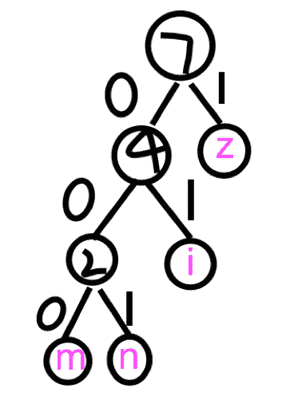
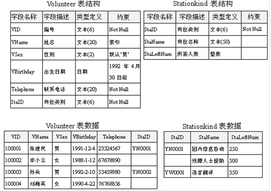

# 网易 2018 实习生招聘笔试题-测试实习生-云音乐

## 1

关于随机测试，以下哪一项说明是正确的？

正确答案: A   你的答案: 空 (错误)

```cpp
随机测试是根据测试的经验在无测试用例的情况下进行的测试。
```

```cpp
随机测试也是需要写一定的测试用例，但可以用例中没有的测试点。
```

```cpp
随机测试不会产生测试冗余。
```

```cpp
随机测试是程序员自已开发时候进行的测试。
```

本题知识点

网易 算法工程师 Java 工程师 C++工程师 iOS 工程师 安卓工程师 运维工程师 前端工程师 PHP 工程师 测试工程师 网易 2018

## 2

手机 APP 测试时，下列哪项说法是错误的？

正确答案: B   你的答案: 空 (错误)

```cpp
因安卓和 IOS 的表现效果以及操作系统不同，应将测试用例分成两个客户端
```

```cpp
都是手机端的操作，测试时不需要考虑屏幕的尺寸问题。
```

```cpp
APP 是否能正常安装需要测试
```

```cpp
APP 中如果有定位功能，需要测试手机定位是否被打开
```

本题知识点

网易 算法工程师 Java 工程师 C++工程师 iOS 工程师 安卓工程师 运维工程师 前端工程师 PHP 工程师 测试工程师 网易 2018

## 3

在对某支持语音聊天的 SDK 进行利用并二次开发后，关于语音功能的测试用例下列哪项是错误的？

正确答案: D   你的答案: 空 (错误)

```cpp
语音聊天功能的测试用例里，应该考虑语音请求发送的测试
```

```cpp
发送音频功能的测试用例里，应考虑语音是否能正常被播放的测试
```

```cpp
语音聊天功能的测试用例里，应考虑不能正常被接通时，对话框内出现的提示信息的测试
```

```cpp
发送音频功能的测试用例里，不需要测试音频未加载成功的测试。
```

本题知识点

网易 算法工程师 Java 工程师 C++工程师 iOS 工程师 安卓工程师 运维工程师 前端工程师 PHP 工程师 测试工程师 网易 2018

## 4

以下哪项能通过软件验收？

正确答案: C   你的答案: 空 (错误)

```cpp
无重大故障，各阶段测试文档及资料完整，有一小部分需求未实现。
```

```cpp
所有需求均已实现，并无重大故障，系统测试还有一小部分未完成。
```

```cpp
有轻微故障，已完成回归测试，文档及资料完整，性能指标基本达成。
```

```cpp
无重大故障，各阶段测试文档及资料完整，性能指标还未达标。
```

本题知识点

网易 算法工程师 Java 工程师 C++工程师 iOS 工程师 安卓工程师 运维工程师 前端工程师 PHP 工程师 测试工程师 网易 2018

## 5

linux 系统中有如下 cron 任务：20,40 */3 * * 1 sh test.sh 下面描述正确的是：

正确答案: A   你的答案: 空 (错误)

```cpp
每周一每 3 小时，20 分，40 分，运行 test.sh
```

```cpp
每月 1 号每 3 小时，20 分，40 分，运行 test.sh
```

```cpp
每周一每 3 小时，每 20 分钟运行 test.sh
```

```cpp
每月 1 号每 3 小时，每 20 分钟运行 test.sh
```

本题知识点

网易 算法工程师 Java 工程师 C++工程师 iOS 工程师 安卓工程师 运维工程师 前端工程师 PHP 工程师 测试工程师 网易 2018

## 6

如何将当前目录下所有 pdf 文件内容转换成 txt 文件内容？

正确答案: B   你的答案: 空 (错误)

```cpp
for *.pdf to *.txt
```

```cpp
for f in `ls *.pdf`; do pdftotext “$f”; done
```

```cpp
do `ls *.pdf` pdftotext `*.txt`
```

```cpp
pdftotext *.pdf *.txt
```

本题知识点

网易 算法工程师 Java 工程师 C++工程师 iOS 工程师 安卓工程师 运维工程师 前端工程师 PHP 工程师 测试工程师 网易 2018

## 7

关于 http 协议以下说法不正确的是：
1.304 表示临时重定向
2.range 请求响应一定是用 http 状态码 206 表示成功
3.http 的 header 分割符是\r
4.请求参数如果包含%，需要进行 encode

正确答案: A   你的答案: 空 (错误)

```cpp
1，3
```

```cpp
1，4
```

```cpp
2，3
```

```cpp
2，4
```

```cpp
3，4
```

本题知识点

网易 算法工程师 Java 工程师 C++工程师 iOS 工程师 安卓工程师 运维工程师 前端工程师 PHP 工程师 测试工程师 网易 2018

## 8

关于计算机网络，以下说法正确的是(1)在向下的过程中，需要添加下层协议所需要的首部或者尾部(2)在向上的过程中不断拆开首部和尾部(3)在向上的过程中，需要添加下层协议所需要的首部或者尾部(4)在向下的过程中不断拆开首部和尾部(5)SMTP 属于 TCP 协议(6)POP3 属于 UDP 协议(7)DNS 属于 TCP 协议(8)Telnet 属于 UDP 协议

正确答案: A   你的答案: 空 (错误)

```cpp
(1)(2)(5)
```

```cpp
(1)(2)(6)
```

```cpp
(1)(2)(8)
```

```cpp
(3)(4)(5)(6)
```

```cpp
(3)(4)(5)(7)
```

本题知识点

网易 算法工程师 Java 工程师 C++工程师 iOS 工程师 安卓工程师 运维工程师 前端工程师 PHP 工程师 测试工程师 网易 2018

## 9

已知一棵树具有 10 个节点，且度为 4，那么：

正确答案: D   你的答案: 空 (错误)

```cpp
该树的高度至少是 6
```

```cpp
该树的高度至多是 6
```

```cpp
该树的高度至少是 7
```

```cpp
该树的高度至多是 7
```

本题知识点

网易 算法工程师 Java 工程师 C++工程师 iOS 工程师 安卓工程师 运维工程师 前端工程师 PHP 工程师 测试工程师 网易 2018

## 10

若对如下无向图进行遍历，则下列序列中，不是广度优先遍历序列的是（）

正确答案: D   你的答案: 空 (错误)

```cpp
e,a,f,g,b,c,d
```

```cpp
a,b,e,c,d,f,g
```

```cpp
d,b,c,a,e,f,g
```

```cpp
f,e,a,d,a,d,g
```

本题知识点

网易 算法工程师 Java 工程师 C++工程师 iOS 工程师 安卓工程师 运维工程师 前端工程师 PHP 工程师 测试工程师 网易 2018

## 11

一组记录的关键字为{15，14，1，10，17，53，68}，用链地址法构造散列表，散列函数为 H(key)=key MOD 13，则散列地址为 1 的链中有（）个记录

正确答案: C   你的答案: 空 (错误)

```cpp
1
```

```cpp
2
```

```cpp
3
```

```cpp
4
```

本题知识点

网易 算法工程师 Java 工程师 C++工程师 iOS 工程师 安卓工程师 运维工程师 前端工程师 PHP 工程师 测试工程师 网易 2018

讨论

[玖拾肆](https://www.nowcoder.com/profile/123608451)

mod 求余，对 13 求余，分别是：1,14,53

发表于 2021-07-14 11:45:38

* * *

## 12

以下哪种情况会使得进程由执行状态转变成阻塞状态

正确答案: D   你的答案: 空 (错误)

```cpp
时间片用完
```

```cpp
进程调度
```

```cpp
I/O 完成
```

```cpp
I/O 请求
```

本题知识点

网易 算法工程师 Java 工程师 C++工程师 iOS 工程师 安卓工程师 运维工程师 前端工程师 PHP 工程师 测试工程师 网易 2018

## 13

假设某分时系统采用时间片轮转法，进程 A，B，C，D 需要运行的时间分别为 20ms，10ms，15ms，5ms，时间片选用 5ms，则平均周转时间是：

正确答案: D   你的答案: 空 (错误)

```cpp
20ms
```

```cpp
35ms
```

```cpp
35.25ms
```

```cpp
36.25ms
```

本题知识点

网易 算法工程师 Java 工程师 C++工程师 iOS 工程师 安卓工程师 运维工程师 前端工程师 PHP 工程师 测试工程师 网易 2018

讨论

[玖拾肆](https://www.nowcoder.com/profile/123608451)

搬运解析：每个进程被分配一个时间段，称作它的时间片，即该进程允许运行的时间。如果在时间片结束时进程还在运行，则 CPU 将被剥夺并分配给另一个进程。如果进程在时间片结束前阻塞或结束，则 CPU 当即进行切换。调度程序所要做的就是维护一张就绪进程列表，当进程用完它的时间片后，它被移到队列的末尾。
系统按照时间片轮转，进程运行顺序为 A B C D A B C A C A，A 执行 4 次，B 执行 2 次，C 执行 3 次，D 执行一次，按执行完的时间算：A 在第 10 个时间片后，B 在第 6 个时间片后，C 在第 9 个时间片后，D 在第 4 个时间片后，平均时间为（10+6+9+4）*5/4 = 36.25    总时间和除以进程数目

发表于 2021-07-14 11:11:10

* * *

## 14

假设某系统为进程在内存中分配了 3 个物理块，进程访问顺序为 0、2、1、3、0、2、4、0、2、1、3、4。已知系统未事先调入任何页面，那么当采用 FIFO 置换算法时，缺页率是：

正确答案: C   你的答案: 空 (错误)

```cpp
33.3%
```

```cpp
25%
```

```cpp
75%
```

```cpp
60%
```

本题知识点

网易 算法工程师 Java 工程师 C++工程师 iOS 工程师 安卓工程师 运维工程师 前端工程师 PHP 工程师 测试工程师 网易 2018

## 15

关于 HTTP1.0 和 HTTP1.1 错误的是()

正确答案: A   你的答案: 空 (错误)

```cpp
HTTP1.0 只能短连接，而 HTTP1.1 只能长连接
```

```cpp
HTTP1.0 通信的时候会占用大量内存，而 HTTP1.1 可以避免这样的情况
```

```cpp
状态码 100 只适用于 HTTP1.1 版本
```

```cpp
HTTP1.1 在 Request 消息头里多了一个 Host 域,HTTP1.0 则没有这个域
```

本题知识点

网易 算法工程师 Java 工程师 C++工程师 iOS 工程师 安卓工程师 运维工程师 前端工程师 PHP 工程师 测试工程师 2018

讨论

[牛客 477013244 号](https://www.nowcoder.com/profile/477013244)

1.  **Host 头处理**，在 HTTP1.0 中认为每台服务器都绑定一个唯一的 IP 地址，因此，请求消息中的 URL 并没有传递主机名（hostname）。但随着虚拟主机技术的发展，在一台物理服务器上可以存在多个虚拟主机（Multi-homed Web Servers），并且它们共享一个 IP 地址。HTTP1.1 的请求消息和响应消息都应支持 Host 头域，且请求消息中如果没有 Host 头域会报告一个错误（400 Bad Request）。

2.  **长连接**，HTTP 1.1 支持长连接（PersistentConnection）和请求的流水线（Pipelining）处理，在一个 TCP 连接上可以传送多个 HTTP 请求和响应，减少了建立和关闭连接的消耗和延迟，在 HTTP1.1 中默认开启 Connection： keep-alive，一定程度上弥补了 HTTP1.0 每次请求都要创建连接的缺点                                                                                                                                                                                                    D 项中，上面知道 HTTP1.0 请求消息中的 URL 并没有传递主机名，有 Host 域？

发表于 2020-09-10 21:53:53

* * *

## 16

下面关于死锁的说法错误的是（）

正确答案: D   你的答案: 空 (错误)

```cpp
死锁是指多个进程因抢占资源而发生的一种阻塞且相互等待的现象
```

```cpp
死锁的产生源于系统资源不足和进程推进顺序不当
```

```cpp
可以通过终止和撤销进程来解除死锁
```

```cpp
银行家算法用在预防死锁策略中
```

本题知识点

网易 算法工程师 Java 工程师 C++工程师 iOS 工程师 安卓工程师 运维工程师 前端工程师 PHP 工程师 测试工程师 网易 2018

## 17

用 1*3 的瓷砖密铺 3*20 的地板有几种方式？

正确答案: A   你的答案: 空 (错误)

```cpp
1278
```

```cpp
872
```

```cpp
595
```

```cpp
406
```

本题知识点

网易 算法工程师 Java 工程师 C++工程师 iOS 工程师 安卓工程师 运维工程师 前端工程师 PHP 工程师 测试工程师 网易 2018

讨论

[不喝奶茶！](https://www.nowcoder.com/profile/32534477)

f（n） = f(n-1)+f(n-3)n*3 大小的地面，铺满的方式是横着铺的方法+竖着铺的方法横着铺的话，前三个肯定是要横着的，所以是 n-3 竖着铺的话，第一个一定是竖着的，所以是 n-1

发表于 2019-08-02 22:41:15

* * *

## 18

字符串 zmnzizi 用哈夫曼编码来编码，则共有多少位？

正确答案: B   你的答案: 空 (错误)

```cpp
14
```

```cpp
13
```

```cpp
12
```

```cpp
11
```

本题知识点

网易 算法工程师 Java 工程师 C++工程师 iOS 工程师 安卓工程师 运维工程师 前端工程师 PHP 工程师 测试工程师 网易 2018

讨论

[littleZzz](https://www.nowcoder.com/profile/2832057)

将 m, n, i, z 按出现频率排序

| m     | n | I | z |
| 1 | 1 | 2 | 3 |

构造 huffman tree
选择 m, n 作为叶子节点，新生成的节点权重为二者之和 2 在选择 i，新生成的节点权重为 4 最后与 z 组合成为根节点 m,n,i,z 的编码分别为 000，001，01，0 构造的哈夫曼树如下：

发表于 2019-03-08 20:38:56

* * *

## 19

以下算法中未用到贪心算法思想的是？

正确答案: D   你的答案: 空 (错误)

```cpp
迪杰斯特拉(Dijkstra)
```

```cpp
库鲁斯卡尔(Kruskal)
```

```cpp
普里姆算法(Prim)
```

```cpp
KMP
```

本题知识点

网易 算法工程师 Java 工程师 C++工程师 iOS 工程师 安卓工程师 运维工程师 前端工程师 PHP 工程师 测试工程师 网易 2018

## 20

对于线性表（ 13,25,22,35,54,57,63）进行散列存储时，若选用 H （ K ） =K %7 作为散列函数，则散列地址为 1 的元素有（ ）个？

正确答案: C   你的答案: 空 (错误)

```cpp
0
```

```cpp
1
```

```cpp
2
```

```cpp
3
```

本题知识点

网易 算法工程师 Java 工程师 C++工程师 iOS 工程师 安卓工程师 运维工程师 前端工程师 PHP 工程师 测试工程师 网易 2018

## 21

牛牛去犇犇老师家补课，出门的时候面向北方，但是现在他迷路了。虽然他手里有一张地图，但是他需要知道自己面向哪个方向，请你帮帮他。

本题知识点

网易 算法工程师 Java 工程师 C++工程师 iOS 工程师 安卓工程师 运维工程师 前端工程师 PHP 工程师 字符串 *模拟 测试工程师 2018* *讨论

[零葬](https://www.nowcoder.com/profile/75718849)

直接模拟，写出在 4 种朝向的情况下，向左或向右转向后的朝向

```cpp
import java.io.BufferedReader;
import java.io.InputStreamReader;
import java.io.IOException;

public class Main {
    public static void main(String[] args) throws IOException {
        BufferedReader br = new BufferedReader(new InputStreamReader(System.in));
        String strN = br.readLine();
        String rotateSeq = br.readLine();
        char curStatus = 'N';
        for(int i = 0; i < rotateSeq.length(); i++)
            curStatus = rotate(curStatus, rotateSeq.charAt(i));
        System.out.println(curStatus);
    }

    /**
      转向方法，输出当前朝向 curstatus 下向 direction 转向后的朝向
    */
    private static char rotate(char curStatus, char direction) {
        if(curStatus == 'N'){
            if(direction == 'L')
                return 'W';
            else
                return 'E';
        }else if(curStatus == 'S'){
            if(direction == 'L')
                return 'E';
            else
                return 'W';
        }else if(curStatus == 'E'){
            if(direction == 'L')
                return 'N';
            else
                return 'S';
        }else{
            if(direction == 'L')
                return 'S';
            else
                return 'N';
        }
    }
}
```

发表于 2020-11-25 11:55:01

* * *

[尘世 0 残破](https://www.nowcoder.com/profile/812443852)

```cpp
num = int(input())
string = input()
l_sum = string.count('L')
r_sum = num - l_sum
res = (r_sum - l_sum)%4
dict = {0:'N',1:'E',2:'S',3:'W'}
print(dict[res])
```

发表于 2019-10-14 17:50:15

* * *

[不喝奶茶！](https://www.nowcoder.com/profile/32534477)

```cpp

	import java.util.*;

	import java.lang.*;

	public class Main{

	  public static void main(String[] args){

	    Scanner sc = new Scanner(System.in);

	    int n = sc.nextInt();

	    String str = sc.next();

	    //分割字符串,统计转的次数

	    char[] arr = str.toCharArray();

	    int L = 0,R = 0;

	    for(int i=0; i<arr.length; i++){

	      if(arr[i] == 'L') L++;

	      else R++;

	    }

	    L %= 4;

	    R -= L;

	    R %= 4;

	    char result = 'N';

	    //开始向左转

	    switch(L){

	      case 0: break;

	      case 1: result='W';break;

	      case 2: result='S';break;

	      case 3: result='E';break;

	    }

	    //开始向右转

	    switch(R){

	      case 0: break;

	      case 1: result='E';break;

	      case 2: result='S';break;

	      case 3: result='W';break;

	    }

	    System.out.println(result);

	  }

	}

```

发表于 2019-08-02 21:51:25

* * *

## 22

牛牛以前在老师那里得到了一个正整数数对(x, y), 牛牛忘记他们具体是多少了。

但是牛牛记得老师告诉过他 x 和 y 均不大于 n, 并且 x 除以 y 的余数大于等于 k。

牛牛希望你能帮他计算一共有多少个可能的数对。

本题知识点

网易 算法工程师 Java 工程师 C++工程师 iOS 工程师 安卓工程师 运维工程师 前端工程师 PHP 工程师 数学 测试工程师 2018

## 23

平面内有 n 个矩形, 第 i 个矩形的左下角坐标为(x1[i], y1[i]), 右上角坐标为(x2[i], y2[i])。

如果两个或者多个矩形有公共区域则认为它们是相互重叠的(不考虑边界和角落)。

请你计算出平面内重叠矩形数量最多的地方,有多少个矩形相互重叠。

本题知识点

网易 算法工程师 Java 工程师 C++工程师 iOS 工程师 安卓工程师 运维工程师 前端工程师 PHP 工程师 高级结构 数学 穷举 测试工程师 2018

## 24

网易云音乐会员分为普通会员和豪华会员两种普通会员权限： 会员曲库歌曲无限听， 下载会员歌曲上限为 300 首等豪华会员权限： 会员曲库歌曲无限听， 下载会员歌曲上限为 500 首， 专属皮肤、电台，折扣电台等购买普通会员时， 可购买 1 个月， 6 个月， 12 个月时长的豪华会员， 购买豪华会员时， 可购买 1 个月， 6 个月， 12 个月时长的豪华会员普通会员通过购买升级包可以升级成豪华会员普通会员、豪华会员及升级包的支付方式： iOS 端： IAP 支付， Android/Web 端：微信支付和支付宝支付购买会员商品后， 会生成订单， 订单状态可分为：待支付订单， 支付成功订单， 支付失败订单。请写出网易云音乐，会员购买逻辑的导图。

你的答案

本题知识点

网易 算法工程师 Java 工程师 C++工程师 iOS 工程师 安卓工程师 运维工程师 前端工程师 PHP 工程师 测试工程师 2018

## 25


（1）世博会筹备组正在招收志愿者，每个人可以报名参加一个岗位的工作。按照如上图中的表结构在数据库中建立世博志愿者表 Volunteer 和岗位类别表 Stationkind，定义各表的主关键字实现实体完整性约束，建立两张表之间的关系实现参照完整性约束，按照表中约束说明实现域完整性约束。（2）创建存储过程 Search_Volunteer，按照岗位名称查询志愿者的姓名、性别和联系电话。（3）在 Volunteer 表上创建一个触发器 tri_Insert，当对 Volunteer 表进行添加志愿者操作时，如果 Stationkind 表中的相应岗位所需人数等于 0，则不允许添加，否则将 Stationkind 表中岗位所需人数减 1。（4）建立交叉表查询 Cross_Volunteer,查询结果中列表示"岗位 "，行表示"性别"，数据值为该岗位指定性别的总人数。

你的答案

本题知识点

网易 算法工程师 Java 工程师 C++工程师 iOS 工程师 安卓工程师 运维工程师 前端工程师 PHP 工程师 测试工程师 2018*