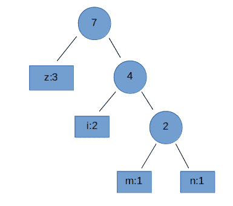

# 网易 2018 实习生招聘笔试题-C 开发实习生-云音乐

## 1

阅读 C++语言代码输出（）

```cpp
int main()
{
    int arr[]={1,2,3,4,5,6,7};
    int *p=arr;
    *(p++)+=89;
    printf("%d,%d\n",*p,*(++p));
    return 0;
}
```

正确答案: A   你的答案: 空 (错误)

```cpp
3 3
```

```cpp
2 2
```

```cpp
2 3
```

```cpp
3 2
```

本题知识点

网易 C++工程师 C++工程师 网易 2018

讨论

[拖拉机嘟嘟嘟](https://www.nowcoder.com/profile/117252758)

进入 printf 之前 p 指向 arr[1], 由于 printf 是栈结构，先执行*(++p), p 指向 arr[2],输出 3，然后执行*p, 再输出 3，printf 是栈结构，所以逆序输出，3，3

发表于 2019-08-03 13:00:57

* * *

[马孔多的苦杏仁](https://www.nowcoder.com/profile/942057869)

printf("%d,%d\n",*p,*(++p));++p 在*p 输出时已经生效；单目运算符优先级结合从右到左。

编辑于 2018-08-10 11:32:13

* * *

[@君不知](https://www.nowcoder.com/profile/144257314)

```cpp
#include<cstdio>
int main()
{
    int arr[]={1,2,3,4,5,6,7};
    int *p=arr;
    *(p++)+=89;
    printf("%d,%d\n",*p,*(++p));
    return 0;
}

程序输出结果：

2,3

 牛客网答案日常出错？？？
```

发表于 2019-05-17 23:23:37

* * *

## 2

阅读 c++代码输出（）

```cpp
class base1{
    private: int a,b;
    public:
    base1 ( int i ) : b(i+1),a(b){}
    base1():b(0),a(b){}
    int get_a(){return a;}
    int get_b(){return b;}
};
int main()
{
    base1 obj1(11);
    cout<<obj1.get_a()<<endl<<obj1.get_b()<<endl;
    return 0;
}
```

正确答案: B   你的答案: 空 (错误)

```cpp
12 12
```

```cpp
随机数 12
```

```cpp
随机数 随机数
```

```cpp
12 随机数
```

本题知识点

网易 C++工程师 C++工程师 网易 2018

讨论

[拖拉机嘟嘟嘟](https://www.nowcoder.com/profile/117252758)

类初始化列表的初始化顺序与类成员变量初始化顺序一致。

发表于 2019-08-03 12:52:46

* * *

[泉 20180408113897](https://www.nowcoder.com/profile/1606640)

任何成员对象的构造函数按照它们声明的顺序调用；如果将 private 中 int a,b;改为 int b,a;结果是 12 12

发表于 2018-08-10 11:41:10

* * *

## 3

64 位电脑 运行 c++结果输出（） 

```cpp
class A
{
    char a[2];
    public:
        virtual void aa(){};
};
class B:public virtual A
{
    char b[2];
    char a[2];
    public:
        virtual void bb(){};
        virtual void aa(){};
};
class C:public virtual B
{
    char a[2];
    char b[2];
    char c[2];
    public:
        virtual void cc(){};
        virtual void aa(){};
        virtual void bb(){};
};
int main()
{
    cout<<sizeof(A)<<endl<<sizeof(B)<<endl<<sizeof(C);
    return 0;
}
```

正确答案: C   你的答案: 空 (错误)

```cpp
8 16 24
```

```cpp
16 32 36
```

```cpp
16 32 48
```

```cpp
8 20 24
```

本题知识点

网易 C++工程师 C++工程师 网易 2018

## 4

以下代码在 64 位的机子上输出是什么：

```cpp
#include <stdio.h>
int getSize(int data[]){
    return sizeof(data);
}

int main(){
    int data1[] = {1,2,3,4,5};
    int size1 = sizeof(data1);

    int* data2 = data1;
    int size2 = sizeof(data2);

    int size3 = getSize(data1);

    printf("%d, %d, %d", size1, size2, size3);
    return 0;
}
```

正确答案: A   你的答案: 空 (错误)

```cpp
20,8, 8
```

```cpp
4, 4, 4
```

```cpp
20, 4, 20
```

```cpp
20, 20, 20
```

本题知识点

网易 C++工程师 2018 C 语言

讨论

[牛客 209804552 号](https://www.nowcoder.com/profile/209804552)

数组名作为形参的时候会被弱化成指针，所以第三个的结果为 8

发表于 2020-08-11 10:05:48

* * *

[NKU_xjh](https://www.nowcoder.com/profile/438291354)

size1 的大小：data1 是存放有 5 个整型数的数组，每个整型占 4 个字节，所以是 4*5=20；size2 的大小：data2 为一个指针，不论指向的是什么类型的数据，存放的都是一个地址，在 64 位系统中的地址是 8 个字节（32 位系统为 4 个字节）size3 的大小：数组名作为函数的形参时，会退化为指针，所以只是一个地址，即 8 字节的大小

发表于 2021-03-09 10:17:43

* * *

## 5

关于 MySQL 索引 ，下面说法正确的是（）(1)B+Tree 索引是大多数 MySQL 存储引擎的默认索引类型(2)在 MySQL 中只有 Memory 引擎显式支持哈希索引(3)哈希索引只包含哈希值和列指针，而不存储字段值(4)MyISAM 存储引擎支持空间索引，可以用于地理数据存储。(5)空间索引使用 MATCH AGAINST，而不是普通的 WHERE(6) 索引将顺序 I/O 变为随机 I/O

正确答案: B   你的答案: 空 (错误)

```cpp
(1)(2)
```

```cpp
(2)(4)
```

```cpp
(2)(5)
```

```cpp
(2)(4)(5)
```

```cpp
(2)(5)(6)
```

```cpp
(4)(5)(6)
```

本题知识点

网易 C++工程师 C++工程师 网易 2018

讨论

[南瓜的囡](https://www.nowcoder.com/profile/677218)

（1）错误，主要的两种搜索引擎有 MyISAM 和 InnoDB，前者大多索引的结构为 B-tree,而后者只有主键索引用 B+tree,非主键索引也用 B-tree,所以，应该默认的索引结构是 B-tree,而不是 B+tree（2）正确（3）错误，哈希索引只包含索引值和行指针，不存储字段值，不是列指针（4）正确，MyISAM 支持空间索引，新版本的 mysql 中 InnoDB 也支持空间索引，只用 R 树来实现。（5）错误，空间索引查询还是用的 WHERE,全文索引查询用的是 MATCH AGATINST（6）错误，索引提高了访问速度，而顺序 I/O 访问速度大于随机 I/O，所以说，索引一定是更多用到了顺序 I/O

发表于 2018-06-23 12:17:15

* * *

## 6

在 Linux 系统中，可以用来查找可执行文件的是？(1)whereis(2)locate(3)which(4)type(5)find

正确答案: D   你的答案: 空 (错误)

```cpp
(1)(2)(3)
```

```cpp
(1)(2)(5)
```

```cpp
(1)(2)(3)(5)
```

```cpp
(1)(2)(3)(4)(5)
```

本题知识点

网易 C++工程师 C++工程师 网易 2018

## 7

运行下面的 c++代码, 关于 ptrX ptrY ptrZ 三个指针下面说法正确的是

```cpp
class BaseX
{
    public:
        virtual ~BaseX(){};
        virtual void FunctionX(){};
};
class ClassY: public BaseX
{
    public:
        virtual void FunctionY(){};
};
class FatherZ :public ClassY
{
    public:
};
int main()
{
    FatherZ aObject;
    BaseX* ptrX=&aObject;
    ClassY* ptrY=&aObject;
    FatherZ* ptrZ=&aObject;
    return 0;
}
```

正确答案: A   你的答案: 空 (错误)

```cpp
ptrX,ptrY,ptrZ 的取值相同.
```

```cpp
ptrZ=ptrX+ptrY
```

```cpp
ptrX 和 ptrY 不相同
```

```cpp
ptrZ 不等于 ptrX 也不等于 ptrY
```

本题知识点

网易 C++工程师 C++工程师 网易 2018

## 8

以下哪种情况会使得进程由执行状态转变成阻塞状态

正确答案: D   你的答案: 空 (错误)

```cpp
时间片用完
```

```cpp
进程调度
```

```cpp
I/O 完成
```

```cpp
I/O 请求
```

本题知识点

网易 C++工程师 C++工程师 网易 2018

## 9

假设某分时系统采用时间片轮转法，进程 A，B，C，D 需要运行的时间分别为 20ms，10ms，15ms，5ms，时间片选用 5ms，则平均周转时间是：

正确答案: D   你的答案: 空 (错误)

```cpp
20ms
```

```cpp
35ms
```

```cpp
35.25ms
```

```cpp
36.25ms
```

本题知识点

网易 C++工程师 2018

讨论

[菜是原罪，难是帮凶ಥ_ಥ](https://www.nowcoder.com/profile/431732435)

统按照时间片轮转，进程运行顺序为 A B C D A B C A C A，A 执行 4 次，B 执行 2 次，C 执行 3 次，D 执行一次，按执行完的时间算：A 在第 10 个时间片后，B 在第 6 个时间片后，C 在第 9 个时间片后，D 在第 4 个时间片后，平均时间为（10+6+9+4）*5/4 = 36.25    总时间和除以进程数目。

发表于 2019-02-28 16:22:41

* * *

## 10

假设某系统为进程在内存中分配了 3 个物理块，进程访问顺序为 0、2、1、3、0、2、4、0、2、1、3、4。已知系统未事先调入任何页面，那么当采用 FIFO 置换算法时，缺页率是：

正确答案: C   你的答案: 空 (错误)

```cpp
33.3%
```

```cpp
25%
```

```cpp
75%
```

```cpp
60%
```

本题知识点

网易 C++工程师 C++工程师 网易 2018

## 11

TCP 建立连接的时候 connect()函数和 accept()函数分别在三次握手第几次后返回（）

正确答案: B   你的答案: 空 (错误)

```cpp
1 , 2
```

```cpp
2 , 3
```

```cpp
1 , 3
```

```cpp
2 , 2
```

本题知识点

网易 C++工程师 C++工程师 网易 2018

## 12

关于 HTTP1.0 和 HTTP1.1 错误的是()

正确答案: A   你的答案: 空 (错误)

```cpp
HTTP1.0 只能短连接，而 HTTP1.1 只能长连接
```

```cpp
HTTP1.0 通信的时候会占用大量内存，而 HTTP1.1 可以避免这样的情况
```

```cpp
状态码 100 只适用于 HTTP1.1 版本
```

```cpp
HTTP1.1 在 Request 消息头里多了一个 Host 域,HTTP1.0 则没有这个域
```

本题知识点

网易 C++工程师 C++工程师 网易 2018

## 13

下面关于三次握手与 connect()函数的关系说法错误的是（）

正确答案: B   你的答案: 空 (错误)

```cpp
客户端发送 SYN 给服务器
```

```cpp
服务器只发送 SYN 给客户端
```

```cpp
客户端收到服务器回应后发送 ACK 给服务器
```

```cpp
connect()函数在三次握手的第二次返回
```

本题知识点

网易 C++工程师 C++工程师 网易 2018

## 14

一个完全二叉树节点数为 200，则其叶子结点个数为？

正确答案: C   你的答案: 空 (错误)

```cpp
98
```

```cpp
99
```

```cpp
100
```

```cpp
101
```

本题知识点

网易 C++工程师 C++工程师 网易 2018

## 15

字符串 zmnzizi 用哈夫曼编码来编码，则共有多少位？

正确答案: B   你的答案: 空 (错误)

```cpp
14
```

```cpp
13
```

```cpp
12
```

```cpp
11
```

本题知识点

网易 C++工程师 C++工程师 网易 2018

讨论

[Lizzylee22](https://www.nowcoder.com/profile/251406092)

链接：[`www.nowcoder.com/questionTerminal/7f6cc302cb7e4bbda21d24f531d7ddd9?orderByHotValue=1&page=1&onlyReference=false`](https://www.nowcoder.com/questionTerminal/7f6cc302cb7e4bbda21d24f531d7ddd9?orderByHotValue=1&page=1&onlyReference=false)

哈夫曼编码的特点是对使用频率高的字符采用短编码，而对使用频率低的字符则采用长编码的方式.

构造哈夫曼树,然后根据哈夫曼树计算树的带权路径长度(WPL),WPL 的值就是最终结果.

**哈夫曼树的构造**:

> 每次从备选节点中挑出两个权值最小的节点进行构造，每次构造完成后会生成新的节点，将构造的节点从备选节点中删除并将新产生的节点加入到备选节点中。新产生的节点权值为参与构造的两个节点权值之和。

首先统计每个字符出现次数:
z:3
i:2
m:1
n:1

构造哈夫曼树如下:



**计算树的带权路径长度**:

从树的根节点到任意结点的路径长度(经过的边数)与该结点上权值的乘积称为该**结点**的带权路径长度.

树中**所有叶结点**的带权路径长度之和称为该**树**的带权路径长度(WPL)

WPL=3x1+2x2+1x3+1x3=13

发表于 2020-08-07 13:07:52

* * *

## 16

已知中序遍历的序列为 abcdef，高度最小的不可能的二叉树的前序遍历是

正确答案: D   你的答案: 空 (错误)

```cpp
dbacfe
```

```cpp
dbacef
```

```cpp
cbaedf
```

```cpp
cabefd
```

本题知识点

网易 C++工程师 C++工程师 网易 2018

## 17

以下算法中未用到贪心算法思想的是？

正确答案: D   你的答案: 空 (错误)

```cpp
迪杰斯特拉(Dijkstra)
```

```cpp
库鲁斯卡尔(Kruskal)
```

```cpp
普里姆算法(Prim)
```

```cpp
KMP
```

本题知识点

网易 C++工程师 C++工程师 网易 2018

## 18

对于线性表（ 13,25,22,35,54,57,63）进行散列存储时，若选用 H （ K ） =K %7 作为散列函数，则散列地址为 1 的元素有（ ）个？

正确答案: C   你的答案: 空 (错误)

```cpp
0
```

```cpp
1
```

```cpp
2
```

```cpp
3
```

本题知识点

网易 C++工程师 C++工程师 网易 2018

讨论

[Lizzylee22](https://www.nowcoder.com/profile/251406092)

只有 22 和 57 除 7 的余数是 1

发表于 2020-08-07 13:19:56

* * *

## 19

基于哈希算法在信息安全中主要应用在？(1)    文件校验(2)    数字签名(3)    鉴权协议

正确答案: D   你的答案: 空 (错误)

```cpp
(1)(2)
```

```cpp
(1)(3)
```

```cpp
(2)(3)
```

```cpp
(1)(2)(3)
```

本题知识点

网易 C++工程师 C++工程师 网易 2018

## 20

下列选项中，不可能是快速排序第 2 趟排序结果的是 （）

正确答案: C   你的答案: 空 (错误)

```cpp
4 14 10 12 8 6 18
```

```cpp
4 6 10 8 12 14 18
```

```cpp
6 4 10 8 14 12 18
```

```cpp
8 4 6 10 12 14 18
```

本题知识点

网易 C++工程师 C++工程师 网易 2018

## 21

小 Q 得到一个神奇的数列: 1, 12, 123,...12345678910,1234567891011...。

并且小 Q 对于能否被 3 整除这个性质很感兴趣。

小 Q 现在希望你能帮他计算一下从数列的第 l 个到第 r 个(包含端点)有多少个数可以被 3 整除。

本题知识点

网易 C++工程师 数学 2018

讨论

[Tendō·Pein](https://www.nowcoder.com/profile/6291542)

```cpp

	#include<bits/stdc++.h>

	usingnamespacestd;

	int main()

	{

	    long longa,b;

	    while(cin>>a>>b)

	    {

	         long long temp=0;

	         long long sum=0;

	        for( long long i=1;i<a;i++)

	        {

	            sum+=i;

	        }

	         for( long long i=a;i<=b;i++)

	        {

	            sum+=i;

	             if(sum%3==0)

	             {

	                temp++;

	             }

	        }

	        cout<<temp<<endl;

	    }

	    return 0;

	}

```

发表于 2018-08-11 09:42:32

* * *

[Lizzylee22](https://www.nowcoder.com/profile/251406092)

能被 3 整除的数特点：该数的各位上数字之和是 3 的倍数

发表于 2020-08-07 13:32:11

* * *

## 22

小 Q 正在给一条长度为 n 的道路设计路灯安置方案。

为了让问题更简单,小 Q 把道路视为 n 个方格,需要照亮的地方用'.'表示, 不需要照亮的障碍物格子用'X'表示。

小 Q 现在要在道路上设置一些路灯, 对于安置在 pos 位置的路灯, 这盏路灯可以照亮 pos - 1, pos, pos + 1 这三个位置。

小 Q 希望能安置尽量少的路灯照亮所有'.'区域, 希望你能帮他计算一下最少需要多少盏路灯。

本题知识点

网易 C++工程师 数组 模拟 字符串 *贪心 2018* *讨论

[菜是原罪，难是帮凶ಥ_ಥ](https://www.nowcoder.com/profile/431732435)

#include <iostream>#include <bits/stdc++.h>

using namespace std;

int main(){
    int test;
    int length;
    string str;
    int res = 0;
    cin >> test;
    while(test--){
        cin >> length;
        cin >> str;
        for(int i = 0; i < length;){
            if(str[i] == 'X')
                i++;
            else 
                i += 3;
                res++;
        }
    }
    cout << res << endl;
    return 0;
}

发表于 2019-02-28 17:20:39

* * *

## 23

牛牛准备参加学校组织的春游, 出发前牛牛准备往背包里装入一些零食, 牛牛的背包容量为 w。牛牛家里一共有 n 袋零食, 第 i 袋零食体积为 v[i]。牛牛想知道在总体积不超过背包容量的情况下,他一共有多少种零食放法(总体积为 0 也算一种放法)。

本题知识点

网易 C++工程师 高级算法 穷举 2018

讨论

[为什么不问问神奇海螺呢](https://www.nowcoder.com/profile/6527132)

用人用 sort 暴力 dfs 都过了= =，拜托能不能数据出用心点。 折半算法+upper_bound

发表于 2018-12-06 20:30:55

* * *

## 24

简单描述一下 C++  单例设计模式以及优缺点？并用 C++代码实现一种单例设计。

你的答案

本题知识点

网易 C++工程师 2018

## 25

C/C++ 中 restrict 修饰符的作用？下面代码用了 restrict 比没用，会少几条执行指令？

                                             int net_add(int *restrict a, int *restrict b)

                                             {

                                                     *a = 10;

                                                     *b = 12;

                                                      return *a + *b;

                                              }

你的答案

本题知识点

网易 C++工程师 2018</iostream>*