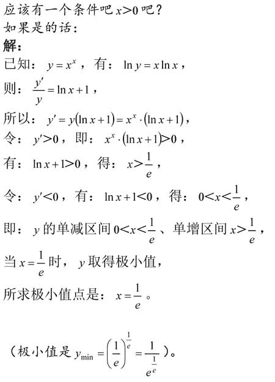
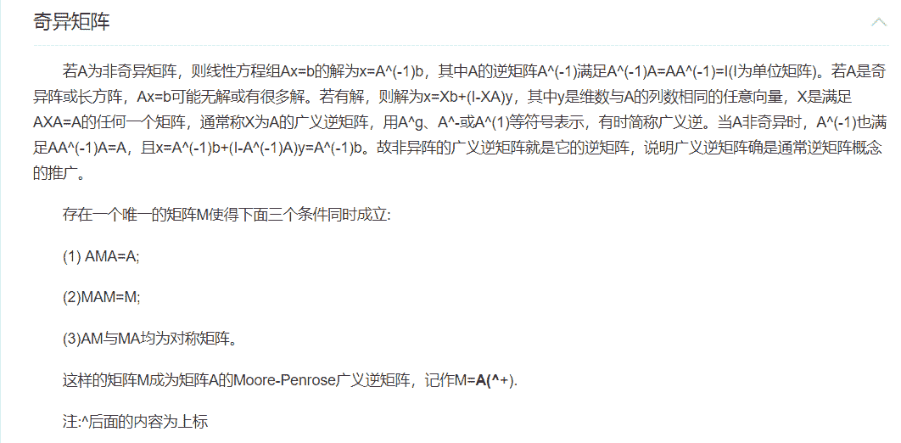
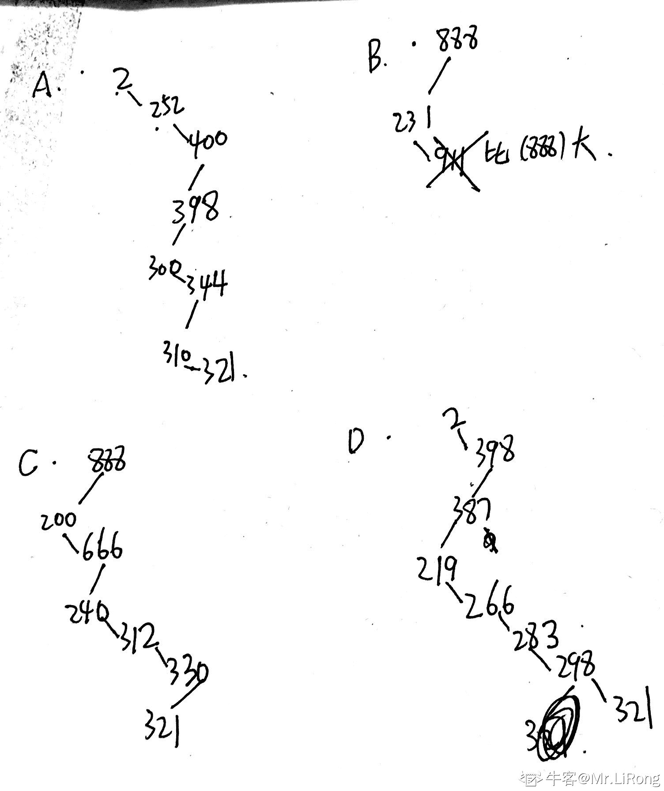

# 网易 2018 实习生招聘笔试题-深度学习算法实习生

## 1

某地区每个人的年收入是右偏的，均值为 5000 元，标准差为 1200 元。随机抽取 900 人并记录他们的年收入，则样本均值的分布为()

正确答案: A   你的答案: 空 (错误)

```cpp
近似正态分布，均值为 5000 元，标准差为 40 元
```

```cpp
近似正态分布，均值为 5000 元，标准差为 1200 元
```

```cpp
右偏分布，均值为 5000，标准差为 40
```

```cpp
左偏分布，均值为 5000 元，标准差为 1200 元
```

本题知识点

网易 算法工程师 2018

讨论

[HDU_ducker](https://www.nowcoder.com/profile/5303747)

中心极限定理，无论原数据分布如何，当取的样本 n 越来越大时，这 n 个数的样本均值会趋近于正态分布，并且这个正态分布以 u 为均值，σ²/n 为方差。

发表于 2019-08-02 15:11:51

* * *

## 2

函数 y=x^x,(x＞0)的极小值点是 ______

正确答案: D   你的答案: 空 (错误)

```cpp
1
```

```cpp
√2
```

```cpp
(√2)^(√2)
```

```cpp
(1/e)^(1/e)
```

本题知识点

网易 算法工程师 算法工程师 网易 2018

讨论

[轨迹&](https://www.nowcoder.com/profile/3445930)

问题有问题，这里答案的意思是极小值，如果是极小值点应该是极小值对应的 x 取值

发表于 2019-08-03 10:42:52

* * *

[HDU_ducker](https://www.nowcoder.com/profile/5303747)

两边取对数求导，令导数为 0

发表于 2019-08-02 15:13:03

* * *

[jjprincess](https://www.nowcoder.com/profile/8914416)



发表于 2018-08-11 10:28:48

* * *

## 3

命题 A：随机变量 X 和 Y 独立，命题 B：随机变量 X 和 Y 不相关。A 是 B 的 ______ 条件。

正确答案: A   你的答案: 空 (错误)

```cpp
充分不必要
```

```cpp
必要不充分
```

```cpp
不充分不必要
```

```cpp
充要
```

本题知识点

网易 算法工程师 算法工程师 网易 2018

讨论

[HDU_ducker](https://www.nowcoder.com/profile/5303747)

独立可推出不相关，不相关不一定独立，充分不必要。相关是指线性相关，不相关变量可能有线性以外的其他关系。但若是二维正态分布的两变量，如果不相关肯定独立，互为充要。

发表于 2019-08-02 15:15:48

* * *

[麦迪文的礼物](https://www.nowcoder.com/profile/5786699)

为什么随机变量 X 和 Y 不相关却不一定独立？[`www.zhihu.com/question/26583332`](https://www.zhihu.com/question/26583332)

发表于 2018-06-29 19:34:22

* * *

## 4

关于矩阵的广义逆，下列表述不正确的是 ________

正确答案: D   你的答案: 空 (错误)

```cpp
若矩阵 A 的广义逆为 B，则 A*B*A=A，B*A*B=B
```

```cpp
若矩阵 A 的广义逆为 B，则 A*B 和 B*A 都是对称阵。
```

```cpp
矩阵 A 一定存在确定唯一的广义逆。
```

```cpp
矩阵 A 可能不存在广义逆。
```

本题知识点

网易 算法工程师 算法工程师 网易 2018

讨论

[HDU_ducker](https://www.nowcoder.com/profile/5303747)



发表于 2019-08-02 15:19:28

* * *

## 5

关于梯度方向，下列说法正确的是 ______

正确答案: A   你的答案: 空 (错误)

```cpp
给定某定点，沿着梯度方向函数值增加最快
```

```cpp
给定某定点，沿着梯度方向函数值减少最快
```

```cpp
任何函数的定点一定存在梯度方向
```

```cpp
如果函数不是凸函数，则一定存在至少一个点不存在梯度方向
```

本题知识点

网易 算法工程师 算法工程师 网易 2018

讨论

[牛客 872779625 号](https://www.nowcoder.com/profile/872779625)

首先，梯度是函数值变化最大的方向，不能说是增加或者减少。其次当然有不存在梯度方向的函数，常数函数就是

发表于 2021-12-19 17:01:09

* * *

## 6

下列哪种不是使用随机森林计算特征重要度的方法 ______

正确答案: D   你的答案: 空 (错误)

```cpp
selection frequency
```

```cpp
gini importance
```

```cpp
permutation importance
```

```cpp
gauss mixture model
```

本题知识点

网易 算法工程师 算法工程师 网易 2018

## 7

对于给定 1000 个训练样本的二分类问题，关于支持向量机的说法，正确的有 _____

正确答案: A   你的答案: 空 (错误)

```cpp
需要构造 1000 个辅助变量，计算它们的非零值对应着支撑向量。
```

```cpp
如果使用高斯核函数，不需要构造 1000 个辅助变量，只需要 100 个。
```

```cpp
如果使用多项式核函数，不需要构造 1000 个辅助变量，只需要 100 个。
```

```cpp
在当前普通计算机上需要约 1 小时才能得到训练模型。
```

本题知识点

网易 算法工程师 算法工程师 网易 2018

讨论

[HDU_ducker](https://www.nowcoder.com/profile/5303747)

拉格朗日乘子法中α要有 1000 个，但是只有支持向量即α>0 对分类有贡献。

发表于 2019-08-02 15:24:19

* * *

## 8

下列哪种不是支持向量机的分类类别 _____

正确答案: D   你的答案: 空 (错误)

```cpp
线性可分支持向量机
```

```cpp
线性支持向量机
```

```cpp
非线性支持向量机
```

```cpp
高阶支持向量机
```

本题知识点

网易 算法工程师 算法工程师 网易 2018

## 9

下列关于核函数的表述正确的是 ______

正确答案: C   你的答案: 空 (错误)

```cpp
核函数即特征的映射关系。
```

```cpp
多项式核函数只是将原始特征映射，并没有升维
```

```cpp
高斯核函数将特征映射到无穷维
```

```cpp
使用线性核函数的 SVM 是非线性分类器
```

本题知识点

网易 算法工程师 算法工程师 网易 2018

讨论

[牛客 397811611 号](https://www.nowcoder.com/profile/397811611)

A 核函数和映射没有关系。核函数只是用来计算映射到高维空间之后的内积的一种简便方法。B 升维了 D 使用线性核函数的 SVM 是线性分类器  

发表于 2020-04-03 18:46:28

* * *

## 10

下列哪项不是 SVM 的优势 _____

正确答案: C   你的答案: 空 (错误)

```cpp
可以和核函数结合
```

```cpp
通过调参可以往往可以得到很好的分类效果
```

```cpp
训练速度快
```

```cpp
泛化能力好
```

本题知识点

网易 算法工程师 算法工程师 网易 2018

## 11

为了找到自己满意的工作，牛牛收集了每种工作的难度和报酬。牛牛选工作的标准是在难度不超过自身能力值的情况下，牛牛选择报酬最高的工作。在牛牛选定了自己的工作后，牛牛的小伙伴们来找牛牛帮忙选工作，牛牛依然使用自己的标准来帮助小伙伴们。牛牛的小伙伴太多了，于是他只好把这个任务交给了你。

本题知识点

网易 算法工程师 排序 *模拟 贪心 2018* *讨论

[零葬](https://www.nowcoder.com/profile/75718849)

贪心

用最朴素的自然智慧可以想清楚这道题 1.相同难度的工作，只保留报酬高的；2.难度高报酬低的工作不要。在以上两个约束下，每个小伙伴都选择自己能力范围内报酬最高的工作

```cpp
import java.io.*;
import java.util.*;
import java.util.Map.Entry;

public class Main {
    public static void main(String[] args) throws IOException {
        BufferedReader br = new BufferedReader(new InputStreamReader(System.in));
        String[] params = br.readLine().split(" ");
        int n = Integer.parseInt(params[0]);
        int m = Integer.parseInt(params[1]);
        TreeMap<Integer, Integer> map1 = new TreeMap<>();     // 难度->报酬
        for(int i = 0; i < n; i++){
            params = br.readLine().split(" ");
            int d = Integer.parseInt(params[0]), p = Integer.parseInt(params[1]);
            map1.put(d, Math.max(p, map1.getOrDefault(d, 0)));      // 相同的难度，只保留报酬高的
        }
        // 把难度高报酬低的工作过滤掉
        TreeMap<Integer, Integer> map2 = new TreeMap<>();
        Entry<Integer, Integer> preEntry = map1.firstEntry();
        map2.put(preEntry.getKey(), preEntry.getValue());
        for(Entry<Integer, Integer> e: map1.entrySet()){
            if(e.getValue() > preEntry.getValue()){
                map2.put(e.getKey(), e.getValue());
                preEntry = e;
            }
        }
        params = br.readLine().split(" ");
        for(int i = 0; i < m; i++){
            int Ai = Integer.parseInt(params[i]);
            int val = 0;
            if(map2.floorEntry(Ai) != null){
                val = map2.floorEntry(Ai).getValue();
            }
            System.out.println(val);
        }
    }
}
```

编辑于 2022-03-17 21:27:13

* * *

## 12

设二叉排序树中关键字由 1 到 999 的整数构成，现要查找关键字为 321 的节点，下面关键字序列中，不可能出现在二叉排序树上的查找序列是：

正确答案: B   你的答案: 空 (错误)

```cpp
2、252、400 、398、300、344、310、321
```

```cpp
888、231、911、244、898、256、362、366
```

```cpp
888、200、666、240、312、330、321
```

```cpp
2、398、387、219、266、283、298、321
```

本题知识点

网易 算法工程师 算法工程师 网易 2018

讨论

[Mr.LiRong](https://www.nowcoder.com/profile/65944734)



发表于 2019-09-09 10:49:51

* * *

[HDU_ducker](https://www.nowcoder.com/profile/5303747)

BST 应该是将 target 与某节点作比较，大于该节点往其右子树继续找，小于往其左子树找，答案 B 最后 362>321 不应该继续找 366

发表于 2019-08-02 15:30:43

* * *

## 13

若对如下无向图进行遍历，则下列序列中，不是广度优先遍历序列的是（）

正确答案: D   你的答案: 空 (错误)

```cpp
e,a,f,g,b,c,d
```

```cpp
a,b,e,c,d,f,g
```

```cpp
d,b,c,a,e,f,g
```

```cpp
f,e,a,d,a,d,g
```

本题知识点

网易 算法工程师 算法工程师 网易 2018

讨论

[HDU_ducker](https://www.nowcoder.com/profile/5303747)

BFS 应当是搜索某节点与其联通的结点之后，再搜索他们各自的子联通节点。

发表于 2019-08-02 15:32:15

* * *

## 14

一组记录的关键字为{15，14，1，10，17，53，68}，用链地址法构造散列表，散列函数为 H(key)=key MOD 13，则散列地址为 1 的链中有（）个记录

正确答案: C   你的答案: 空 (错误)

```cpp
1
```

```cpp
2
```

```cpp
3
```

```cpp
4
```

本题知识点

网易 算法工程师 2018

讨论

[HDU_ducker](https://www.nowcoder.com/profile/5303747)

链地址法，关键字都分别除以 13 余 1 的数有几个

发表于 2019-08-02 15:33:27

* * *

## 15

用 1*3 的瓷砖密铺 3*20 的地板有几种方式？

正确答案: A   你的答案: 空 (错误)

```cpp
1278
```

```cpp
872
```

```cpp
595
```

```cpp
406
```

本题知识点

网易 算法工程师 算法工程师 网易 2018

讨论

[ShawDa](https://www.nowcoder.com/profile/6312101)

f(n) = f(n-1) + f(n-3),n=20,f1=1,f2=1,f3=2,递归得到 406+872=1278

编辑于 2019-04-02 09:14:15

* * *

## 16

已知有 4 个矩阵分别大小为 M1(5*3) M2(3*4) M3(4*2) M4(2*7) 下面组合计算所需要的乘法次数最优的为？

正确答案: D   你的答案: 空 (错误)

```cpp
(M1(M2(M3M4)))
```

```cpp
(M1((M2M3)M4))
```

```cpp
((M1M2)(M3M4))
```

```cpp
((M1(M2M3))M4)
```

```cpp
(((M1M2)M3)M4)
```

本题知识点

网易 算法工程师 算法工程师 网易 2018

讨论

[HDU_ducker](https://www.nowcoder.com/profile/5303747)

1.直接判断减少维度最多的为 M2*M3。2.维度为(p,q) 和(q,r)的两个矩阵相乘，乘法次数为 p×q×r，分别计算。

发表于 2019-08-02 15:39:36

* * *

## 17

一个完全二叉树节点数为 200，则其叶子结点个数为？

正确答案: C   你的答案: 空 (错误)

```cpp
98
```

```cpp
99
```

```cpp
100
```

```cpp
101
```

本题知识点

网易 算法工程师 算法工程师 网易 2018

讨论

[HDU_ducker](https://www.nowcoder.com/profile/5303747)

1+2+4+8+16+32+64=127，最后一层有 200-127=73 个结点，这 73 个结点连在上面一层的(73+1)/2=37 个结点上，叶节点数为 73+（64-37）=100

发表于 2019-08-02 15:46:00

* * *

## 18

已知中序遍历的序列为 abcdef，高度最小的不可能的二叉树的前序遍历是

正确答案: D   你的答案: 空 (错误)

```cpp
dbacfe
```

```cpp
dbacef
```

```cpp
cbaedf
```

```cpp
cabefd
```

本题知识点

网易 算法工程师 算法工程师 网易 2018

## 19

以下算法中未用到贪心算法思想的是？

正确答案: D   你的答案: 空 (错误)

```cpp
迪杰斯特拉(Dijkstra)
```

```cpp
库鲁斯卡尔(Kruskal)
```

```cpp
普里姆算法(Prim)
```

```cpp
KMP
```

本题知识点

网易 算法工程师 算法工程师 网易 2018

## 20

对于线性表（ 13,25,22,35,54,57,63）进行散列存储时，若选用 H （ K ） =K %7 作为散列函数，则散列地址为 1 的元素有（ ）个？

正确答案: C   你的答案: 空 (错误)

```cpp
0
```

```cpp
1
```

```cpp
2
```

```cpp
3
```

本题知识点

网易 算法工程师 算法工程师 网易 2018

## 21

下列选项中，不可能是快速排序第 2 趟排序结果的是 （）

正确答案: C   你的答案: 空 (错误)

```cpp
4 14 10 12 8 6 18
```

```cpp
4 6 10 8 12 14 18
```

```cpp
6 4 10 8 14 12 18
```

```cpp
8 4 6 10 12 14 18
```

本题知识点

网易 算法工程师 算法工程师 网易 2018

讨论

[HDU_ducker](https://www.nowcoder.com/profile/5303747)

快排每一趟至少有一个元素归位，查看所有元素归位情况即可。

发表于 2019-08-02 15:52:35

* * *

## 22

小 Q 得到一个神奇的数列: 1, 12, 123,...12345678910,1234567891011...。

并且小 Q 对于能否被 3 整除这个性质很感兴趣。

小 Q 现在希望你能帮他计算一下从数列的第 l 个到第 r 个(包含端点)有多少个数可以被 3 整除。

本题知识点

网易 算法工程师 数学 2018

讨论

[零葬](https://www.nowcoder.com/profile/75718849)

我们需要依次考察区间**[l,r]**中哪些数可以被 3 整除，被 3 整除的数需要各位数字加起来仍然能被 3 整除。但题中所给的数据范围较大，如果依次将各位进行累加，每个数遍历的长度最大会超过整型的范围，时间复杂度过高。我们可以分析：对于 12345678910，这个数要想知道它是否能被 3 整除，需要计算(1+2+3+4+5+6+7+8+9+1+0)%3 是否能够得到 0，但实际上我们只需要求 1~10 的和就行了，因为即使是加上 10，考虑能不能被 3 整除也同样是计算 1+0 能否被 3 整除，也就是说拆开累加与直接累加是等效的。而直接累加的话根据高斯求和公式，时间复杂度可以达到 O(1)级别，考察区间**[l,r]**上能够被 3 整除的数个数整体上的时间复杂度为 O(r-l)，是一个跟数据规模相关的线性复杂度。

```cpp
import java.io.BufferedReader;
import java.io.InputStreamReader;
import java.io.IOException;

public class Main {
    public static void main(String[] args) throws IOException {
        BufferedReader br = new BufferedReader(new InputStreamReader(System.in));
        String[] params = br.readLine().split(" ");
        int l = Integer.parseInt(params[0]), r = Integer.parseInt(params[1]);
        int count = 0;
        for(int num = l; num <= r; num++){
            long sum = ((1L + num) * num) >> 1;
            if(sum % 3 == 0) count++;
        }
        System.out.println(count);
    }
}
```

编辑于 2021-11-28 11:23:22

* * *

[笔试 A 四道](https://www.nowcoder.com/profile/961067646)

l,r=list(map(int,input().strip().split()))
r=(r//3)*2+(1 if r%3==2 else 0)
l=((l-1)//3)*2+(1 if (l-1)%3==2 else 0)
print(r-l)

发表于 2019-08-03 14:00:06

* * *

[LongJiemin](https://www.nowcoder.com/profile/1478627)

|  
```cpp
n,m =[int(i) fori ininput().split()]
defcount_number(x):
    ifx%3==2:
        return(x//3)*2+1
    else:
        return(x//3)*2
print(count_number(m)-count_number(n-1))
```

 语言：Python 3 运行时间： 22 ms 占用内存：3560K
 |

发表于 2018-08-16 17:50:27

* * *

## 23

电商大促时商品销量会出现远高于平日的峰值，准确预估商品在大促日的销售峰值能够有效提高物流效率，保证用户体验。对于一个参与大促销售的商品，有前三年的销量数据，如何有效利用这些历史销量数据进行建模，预估在下一次大促时能够达到的销量峰值？ 在预测的时间长度上，提前两周预测和提前两个月预测，在建模方面会有什么不同 ？

你的答案

本题知识点

网易 算法工程师 2018

## 24

现在有一个线下零售门店需要做数据化改造，目前已经在店内多个位置布设了传感器来获取用户数据。你认为需要记录哪些数据，你将从哪些方面利用这些数据来帮助门店提升效益 ？ 为什么 ？

你的答案

本题知识点

网易 算法工程师 2018

## 25

假设小易开发了一个 APP，上线一段时间之后有了一定的用户量。这些用户里面有一部分成为了小易的目标用户。现在小易想通过有代价的运营手段来把更多的非目标用户转换为目标用户，请问该如何运用机器学习的手段来操作 ？请从模型的建立、模型的评估、以及模型的使用这几个方面进行阐述。

你的答案

本题知识点

网易 算法工程师 2018*