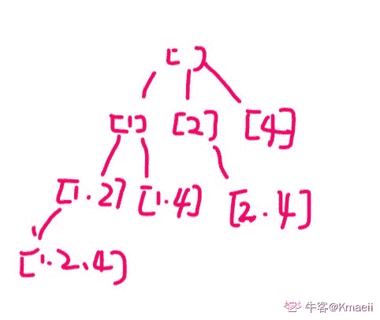

# 网易 2018 实习生招聘笔试题-人机交互算法实习生

## 1

数字图像颜色空间中，常被彩色显像管采用的是哪一种：

正确答案: A   你的答案: 空 (错误)

```cpp
RGB
```

```cpp
YUV
```

```cpp
HIS
```

```cpp
CMYK
```

本题知识点

网易 算法工程师 算法工程师 网易 2018

## 2

如下边缘检测算子中，时间复杂度最高的是：

正确答案: D   你的答案: 空 (错误)

```cpp
Sobel 算子
```

```cpp
Roberts 算子
```

```cpp
Prewitt 算子
```

```cpp
Canny 算子
```

本题知识点

网易 算法工程师 算法工程师 网易 2018

## 3

大津法（OSTU 算法）阈值分割中，阈值自动选择的思路是：

正确答案: C   你的答案: 空 (错误)

```cpp
由直方图灰度分布选择阈值
```

```cpp
双峰法选择阈值
```

```cpp
最大化类间方差法选择阈值
```

```cpp
最大最小灰度值二分迭代逼近法选择阈值
```

本题知识点

网易 算法工程师 算法工程师 网易 2018

## 4

某地区每个人的年收入是右偏的，均值为 5000 元，标准差为 1200 元。随机抽取 900 人并记录他们的年收入，则样本均值的分布为()

正确答案: A   你的答案: 空 (错误)

```cpp
近似正态分布，均值为 5000 元，标准差为 40 元
```

```cpp
近似正态分布，均值为 5000 元，标准差为 1200 元
```

```cpp
右偏分布，均值为 5000，标准差为 40
```

```cpp
左偏分布，均值为 5000 元，标准差为 1200 元
```

本题知识点

网易 算法工程师 算法工程师 网易 2018

## 5

命题 A：随机变量 X 和 Y 独立，命题 B：随机变量 X 和 Y 不相关。A 是 B 的 ______ 条件。

正确答案: A   你的答案: 空 (错误)

```cpp
充分不必要
```

```cpp
必要不充分
```

```cpp
不充分不必要
```

```cpp
充要
```

本题知识点

网易 算法工程师 算法工程师 网易 2018

## 6

关于矩阵的广义逆，下列表述不正确的是 ________

正确答案: D   你的答案: 空 (错误)

```cpp
若矩阵 A 的广义逆为 B，则 A*B*A=A，B*A*B=B
```

```cpp
若矩阵 A 的广义逆为 B，则 A*B 和 B*A 都是对称阵。
```

```cpp
矩阵 A 一定存在确定唯一的广义逆。
```

```cpp
矩阵 A 可能不存在广义逆。
```

本题知识点

网易 算法工程师 算法工程师 网易 2018

## 7

关于梯度方向，下列说法正确的是 ______

正确答案: A   你的答案: 空 (错误)

```cpp
给定某定点，沿着梯度方向函数值增加最快
```

```cpp
给定某定点，沿着梯度方向函数值减少最快
```

```cpp
任何函数的定点一定存在梯度方向
```

```cpp
如果函数不是凸函数，则一定存在至少一个点不存在梯度方向
```

本题知识点

网易 算法工程师 算法工程师 网易 2018

## 8

下列哪种不是支持向量机的分类类别 _____

正确答案: D   你的答案: 空 (错误)

```cpp
线性可分支持向量机
```

```cpp
线性支持向量机
```

```cpp
非线性支持向量机
```

```cpp
高阶支持向量机
```

本题知识点

网易 算法工程师 算法工程师 网易 2018

## 9

下列关于核函数的表述正确的是 ______

正确答案: C   你的答案: 空 (错误)

```cpp
核函数即特征的映射关系。
```

```cpp
多项式核函数只是将原始特征映射，并没有升维
```

```cpp
高斯核函数将特征映射到无穷维
```

```cpp
使用线性核函数的 SVM 是非线性分类器
```

本题知识点

网易 算法工程师 2018

## 10

下列哪项不是 SVM 的优势 _____

正确答案: C   你的答案: 空 (错误)

```cpp
可以和核函数结合
```

```cpp
通过调参可以往往可以得到很好的分类效果
```

```cpp
训练速度快
```

```cpp
泛化能力好
```

本题知识点

网易 算法工程师 2018

## 11

设二叉排序树中关键字由 1 到 999 的整数构成，现要查找关键字为 321 的节点，下面关键字序列中，不可能出现在二叉排序树上的查找序列是：

正确答案: B   你的答案: 空 (错误)

```cpp
2、252、400 、398、300、344、310、321
```

```cpp
888、231、911、244、898、256、362、366
```

```cpp
888、200、666、240、312、330、321
```

```cpp
2、398、387、219、266、283、298、321
```

本题知识点

网易 算法工程师 2018

## 12

用 1*3 的瓷砖密铺 3*20 的地板有几种方式？

正确答案: A   你的答案: 空 (错误)

```cpp
1278
```

```cpp
872
```

```cpp
595
```

```cpp
406
```

本题知识点

网易 算法工程师 2018

讨论

[阳向花开](https://www.nowcoder.com/profile/483336010)

A1278

发表于 2020-07-19 15:44:48

* * *

## 13

已知有 4 个矩阵分别大小为 M1(5*3) M2(3*4) M3(4*2) M4(2*7) 下面组合计算所需要的乘法次数最优的为？

正确答案: D   你的答案: 空 (错误)

```cpp
(M1(M2(M3M4)))
```

```cpp
(M1((M2M3)M4))
```

```cpp
((M1M2)(M3M4))
```

```cpp
((M1(M2M3))M4)
```

```cpp
(((M1M2)M3)M4)
```

本题知识点

网易 算法工程师 算法工程师 网易 2018

## 14

一个完全二叉树节点数为 200，则其叶子结点个数为？

正确答案: C   你的答案: 空 (错误)

```cpp
98
```

```cpp
99
```

```cpp
100
```

```cpp
101
```

本题知识点

网易 算法工程师 算法工程师 网易 2018

## 15

字符串 zmnzizi 用哈夫曼编码来编码，则共有多少位？

正确答案: B   你的答案: 空 (错误)

```cpp
14
```

```cpp
13
```

```cpp
12
```

```cpp
11
```

本题知识点

网易 算法工程师 算法工程师 网易 2018

## 16

已知中序遍历的序列为 abcdef，高度最小的不可能的二叉树的前序遍历是

正确答案: D   你的答案: 空 (错误)

```cpp
dbacfe
```

```cpp
dbacef
```

```cpp
cbaedf
```

```cpp
cabefd
```

本题知识点

网易 算法工程师 算法工程师 网易 2018

## 17

以下算法中未用到贪心算法思想的是？

正确答案: D   你的答案: 空 (错误)

```cpp
迪杰斯特拉(Dijkstra)
```

```cpp
库鲁斯卡尔(Kruskal)
```

```cpp
普里姆算法(Prim)
```

```cpp
KMP
```

本题知识点

网易 算法工程师 算法工程师 网易 2018

## 18

下列选项中，不可能是快速排序第 2 趟排序结果的是 （）

正确答案: C   你的答案: 空 (错误)

```cpp
4 14 10 12 8 6 18
```

```cpp
4 6 10 8 12 14 18
```

```cpp
6 4 10 8 14 12 18
```

```cpp
8 4 6 10 12 14 18
```

本题知识点

网易 算法工程师 算法工程师 网易 2018

## 19

关于控件 TextView 的属性,下列使用正确的是 :

正确答案: A   你的答案: 空 (错误)

```cpp
layout_marginLeft 为控件左边框,距离父容器的距离(外边距), paddingLeft 为控件内部,距离控件左边框的距离(内边距)
```

```cpp
textview 的 scrollY 属性可以用来设置这个 view 在其父 view 里面的相对垂直位置
```

```cpp
inputType 为输入类型,可以选择输入纯符号,或者纯数字等.
```

```cpp
Gravity 为内部文字摆放的位置,可以选择 inside 和 outside.
```

本题知识点

网易 算法工程师 2018

## 20

Objective-c 表达式 c = a ?: b 等价于下面哪项表达式

正确答案: A   你的答案: 空 (错误)

```cpp
c = a != nil ? a : b
```

```cpp
c = a != nil ? b : a
```

```cpp
c = (a != nil) &amp;&amp; (b != nil)
```

```cpp
c = (a != nil) || (b != nil)
```

本题知识点

网易 算法工程师 算法工程师 网易 2018

## 21

牛牛去犇犇老师家补课，出门的时候面向北方，但是现在他迷路了。虽然他手里有一张地图，但是他需要知道自己面向哪个方向，请你帮帮他。

本题知识点

网易 算法工程师 字符串 *模拟 2018* *## 22

牛牛以前在老师那里得到了一个正整数数对(x, y), 牛牛忘记他们具体是多少了。

但是牛牛记得老师告诉过他 x 和 y 均不大于 n, 并且 x 除以 y 的余数大于等于 k。

牛牛希望你能帮他计算一共有多少个可能的数对。

本题知识点

网易 算法工程师 数学 2018

## 23

牛牛准备参加学校组织的春游, 出发前牛牛准备往背包里装入一些零食, 牛牛的背包容量为 w。牛牛家里一共有 n 袋零食, 第 i 袋零食体积为 v[i]。牛牛想知道在总体积不超过背包容量的情况下,他一共有多少种零食放法(总体积为 0 也算一种放法)。

本题知识点

网易 算法工程师 高级算法 穷举 2018

讨论

[Kmaeii](https://www.nowcoder.com/profile/365222092)

python 回溯解法， 80%通过，超时？ 难道所有语言用的一个时间限制？还是我写的有错误？有没有大佬帮忙看一下？。这种题最好先画一下遍历树，我们知道通过递归就能遍历整棵树（也就是查看到所有的情况）。但是有些情况是我们不需要的（剪枝条件：零食体积大于背包容量），所以我们排除这些情况就能得到所有符合条件的情况。（可以去 leetcode 上看看有关回溯的题型）。

```cpp
def main():
    # get input 
    n, w = map(int, input().split())
    v = list(map(int, input().split()))
    assert len(v) == n, "invalid input !"

    # 当全部零食都能装下，也就是不需要剪枝，那么递归耗时太大，可以直接用公式计算
    if sum(v) <= w: 
        print(2 ** n)
        return

    # backtrack function
    global cnt
    cnt = 0
    def backtrack(s=0, res=[]):
        if sum(res[:]) <= w:
            global cnt
            cnt += 1
        for i in range(s,n):
            res.append(v[i])
            backtrack(i+1, res)
            res.pop()
    # get ans
    backtrack()
    print(cnt)

if __name__ == "__main__":
    main()
```

发表于 2020-08-07 10:34:17

* * *

[草帽小子](https://www.nowcoder.com/profile/892244)

a = input().split(' ')
b = input().split(' ')

n = int(a[0])
w = int(a[1])
v = list(map(int, b))
v = sorted(v)

alls = 1
crrw = 0
i = 0

def count(i):
    global crrw,alls

    if i >= n or i<0:
        return
    else:
        if crrw + v[i] <= w: 
            crrw += v[i]
            alls += 1
            count(i+1)
            crrw -= v[i]
            count(i+1)

count(0)
print(alls)
您的代码已保存
运行超时:您的程序未能在规定时间内运行结束，请检查是否循环有错或算法复杂度过大。
case 通过率为 80.00%

发表于 2020-04-08 19:21:32

* * *

[mynamewali](https://www.nowcoder.com/profile/524066618)

深度优先搜索，数组排序后，从小于等于背包容量的第一种零食开始，往前推，尽可能放下最多零食，当放不下后，返回上一步，但一开始只能通过 80%测试用例，后来发现当所有零食总和都小于背包容量时计算了 2^n 次，该情况应该单独考虑

```cpp
#include<iostream>
#include<algorithm>
using namespace std;
void count(long long int v[], int& res, long long int w, int right);
int main(){
    int n;
    long long int w;
    cin>>n>>w;
    long long int v[n];
    for(int i=0;i<n;i++) cin>>v[i];
    int res=1;
    sort(v,v+n);
    long long int sum = 0;
    for(int i=0;i<n;i++) sum += v[i];
    if(sum<=w) res = pow(2,n);
    else count(v,res,w,n);
    cout<<res<<endl;

}
void count(long long int v[], int& res, long long int w, int right){
    //int pos = right;
    //while(v[pos]>w) pos--;
    int pos = upper_bound(v,v+right,w) - v;
    pos--;

    for(int i=pos;i>=0;i--){
        res++;
        if(i-1>=0 && w-v[i]>0) count(v,res,w-v[i],i);
    }
}
```

编辑于 2020-03-14 11:08:59

* * *

## 24

1964 年，美国人道格·恩格尔巴特（Doug Engelbart）发明了鼠标，图形用户界面（Graphical User Interface,GUI）随之出现，才有了计算机的主机时代和个人计算机时代，为此恩格尔巴特也获得了 1997 年的图灵奖。请告诉小易除了鼠标、键盘、触摸屏等常规的人机交互方案之外，你见过的新型人机交互方案，涉及到 AI/AR 算法技术的请简述实现方案。

你的答案

本题知识点

网易 算法工程师 2018

## 25

假设通过人机交互设备的输出信息 T，可以得到五种设备状态 A、B、C、D、E；但是人机交互设备输出信息 T 存在噪声，导致基于简单判断的人机交互方案交互体验差，请发挥你的才智帮小易提高该设备的人机交互体验；

你的答案

本题知识点

网易 算法工程师 2018

## 26

小易手头上有个 intel realSense 的深度摄像头，通过其自带的 SDK，已经能够得到手部的 21 个关节点的位置信息。小易想通过获取的手部节点信息做一些静态（如手语、点赞等）和动态的手势识别（握拳、挥手等）的工作，请从图像处理和机器学习的角度，为小易提供至少一套解决方案。

你的答案

本题知识点

网易 算法工程师 2018

## 27

眼球追踪技术是人机交互中一项比较新的技术，现在有一款 Hololens 的开发机，想通过追踪人眼的运动实现一些简单的 AR 交互（如翻页、前进后退等），请提供一种解决方案，帮小易解决这一问题。

你的答案

本题知识点

网易 算法工程师 2018

讨论

[yifankatty](https://www.nowcoder.com/profile/236371159)

思路一：设置对应按钮，如前进、后退等，通过对按钮进行注视行为，来进行选取。

思路二：设置对应眼势，即眼动轨迹，通过不同的眼动轨迹来触发不同操作。（精度会低）

思路三：通过眼动+自适应界面来实现前后翻页的效果。

发表于 2020-11-22 18:36:24

* * **