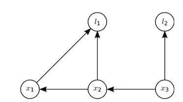

# 网易 2018 实习生招聘笔试题-计算机视觉算法实习生-3D 视觉方向

## 1

如下边缘检测算子中，时间复杂度最高的是：

正确答案: D   你的答案: 空 (错误)

```cpp
Sobel 算子
```

```cpp
Roberts 算子
```

```cpp
Prewitt 算子
```

```cpp
Canny 算子
```

本题知识点

网易 算法工程师 算法工程师 网易 2018

讨论

[半人马气质](https://www.nowcoder.com/profile/469539764)

canny 是二阶的

发表于 2019-09-28 16:14:26

* * *

## 2

大津法（OSTU 算法）阈值分割中，阈值自动选择的思路是：

正确答案: C   你的答案: 空 (错误)

```cpp
由直方图灰度分布选择阈值
```

```cpp
双峰法选择阈值
```

```cpp
最大化类间方差法选择阈值
```

```cpp
最大最小灰度值二分迭代逼近法选择阈值
```

本题知识点

网易 算法工程师 2018

## 3

关于矩阵的广义逆，下列表述不正确的是 ________

正确答案: D   你的答案: 空 (错误)

```cpp
若矩阵 A 的广义逆为 B，则 A*B*A=A，B*A*B=B
```

```cpp
若矩阵 A 的广义逆为 B，则 A*B 和 B*A 都是对称阵。
```

```cpp
矩阵 A 一定存在确定唯一的广义逆。
```

```cpp
矩阵 A 可能不存在广义逆。
```

本题知识点

网易 算法工程师 算法工程师 网易 2018

## 4

关于梯度方向，下列说法正确的是 ______

正确答案: A   你的答案: 空 (错误)

```cpp
给定某定点，沿着梯度方向函数值增加最快
```

```cpp
给定某定点，沿着梯度方向函数值减少最快
```

```cpp
任何函数的定点一定存在梯度方向
```

```cpp
如果函数不是凸函数，则一定存在至少一个点不存在梯度方向
```

本题知识点

网易 算法工程师 算法工程师 网易 2018

## 5

下列关于核函数的表述正确的是 ______

正确答案: C   你的答案: 空 (错误)

```cpp
核函数即特征的映射关系。
```

```cpp
多项式核函数只是将原始特征映射，并没有升维
```

```cpp
高斯核函数将特征映射到无穷维
```

```cpp
使用线性核函数的 SVM 是非线性分类器
```

本题知识点

网易 算法工程师 算法工程师 网易 2018

## 6

下列哪项不是 SVM 的优势 _____

正确答案: C   你的答案: 空 (错误)

```cpp
可以和核函数结合
```

```cpp
通过调参可以往往可以得到很好的分类效果
```

```cpp
训练速度快
```

```cpp
泛化能力好
```

本题知识点

网易 算法工程师 算法工程师 网易 2018

## 7

已知一棵树具有 10 个节点，且度为 4，那么：

正确答案: D   你的答案: 空 (错误)

```cpp
该树的高度至少是 6
```

```cpp
该树的高度至多是 6
```

```cpp
该树的高度至少是 7
```

```cpp
该树的高度至多是 7
```

本题知识点

网易 算法工程师 算法工程师 网易 2018

## 8

设二叉排序树中关键字由 1 到 999 的整数构成，现要查找关键字为 321 的节点，下面关键字序列中，不可能出现在二叉排序树上的查找序列是：

正确答案: B   你的答案: 空 (错误)

```cpp
2、252、400 、398、300、344、310、321
```

```cpp
888、231、911、244、898、256、362、366
```

```cpp
888、200、666、240、312、330、321
```

```cpp
2、398、387、219、266、283、298、321
```

本题知识点

网易 算法工程师 算法工程师 网易 2018

## 9

若对如下无向图进行遍历，则下列序列中，不是广度优先遍历序列的是（）

正确答案: D   你的答案: 空 (错误)

```cpp
e,a,f,g,b,c,d
```

```cpp
a,b,e,c,d,f,g
```

```cpp
d,b,c,a,e,f,g
```

```cpp
f,e,a,d,a,d,g
```

本题知识点

网易 算法工程师 算法工程师 网易 2018

## 10

已知有 4 个矩阵分别大小为 M1(5*3) M2(3*4) M3(4*2) M4(2*7) 下面组合计算所需要的乘法次数最优的为？

正确答案: D   你的答案: 空 (错误)

```cpp
(M1(M2(M3M4)))
```

```cpp
(M1((M2M3)M4))
```

```cpp
((M1M2)(M3M4))
```

```cpp
((M1(M2M3))M4)
```

```cpp
(((M1M2)M3)M4)
```

本题知识点

网易 算法工程师 算法工程师 网易 2018

## 11

有 20 个人去看电影，电影票 50 元。其中只有 10 个人有 50 元钱，另外 10 个人都只有一张面值 100 元的纸币，电影院没有其他钞票可以找零，问有多少种找零的方法？

正确答案: A   你的答案: 空 (错误)

```cpp
16796
```

```cpp
16798
```

```cpp
16794
```

```cpp
16792
```

本题知识点

网易 算法工程师 算法工程师 网易 2018

讨论

[AnimateDeng](https://www.nowcoder.com/profile/224460406)

卡特兰数——Catalan 数

C(2N, N) - C(2N, N+1)[`blog.csdn.net/Hackbuteer1/article/details/7450250`](https://blog.csdn.net/Hackbuteer1/article/details/7450250)

发表于 2018-09-13 17:00:18

* * *

## 12

字符串 zmnzizi 用哈夫曼编码来编码，则共有多少位？

正确答案: B   你的答案: 空 (错误)

```cpp
14
```

```cpp
13
```

```cpp
12
```

```cpp
11
```

本题知识点

网易 算法工程师 算法工程师 网易 2018

## 13

已知中序遍历的序列为 abcdef，高度最小的不可能的二叉树的前序遍历是

正确答案: D   你的答案: 空 (错误)

```cpp
dbacfe
```

```cpp
dbacef
```

```cpp
cbaedf
```

```cpp
cabefd
```

本题知识点

网易 算法工程师 算法工程师 网易 2018

## 14

以下算法中未用到贪心算法思想的是？

正确答案: D   你的答案: 空 (错误)

```cpp
迪杰斯特拉(Dijkstra)
```

```cpp
库鲁斯卡尔(Kruskal)
```

```cpp
普里姆算法(Prim)
```

```cpp
KMP
```

本题知识点

网易 算法工程师 算法工程师 网易 2018

## 15

对于线性表（ 13,25,22,35,54,57,63）进行散列存储时，若选用 H （ K ） =K %7 作为散列函数，则散列地址为 1 的元素有（ ）个？

正确答案: C   你的答案: 空 (错误)

```cpp
0
```

```cpp
1
```

```cpp
2
```

```cpp
3
```

本题知识点

网易 算法工程师 算法工程师 网易 2018

## 16

牛牛去犇犇老师家补课，出门的时候面向北方，但是现在他迷路了。虽然他手里有一张地图，但是他需要知道自己面向哪个方向，请你帮帮他。

本题知识点

网易 算法工程师 字符串 *模拟 2018* *讨论

[零葬](https://www.nowcoder.com/profile/75718849)

模拟

构造个转向映射就行 1）朝向为北时，往左会让朝向变西，往右会让朝向变东 2）朝向为南时，往左会让朝向变东，往右会让朝向变西 3）朝向为西时，往左会让朝向变南，往右会让朝向变北 4）朝向为东时，往左会让朝向变北，往右会让朝向变南

```cpp
n = int(input())
path = input().strip()
m = {"N": {"L": "W", "R": "E"}, 
     "S": {"L": "E", "R": "W"}, 
     "W": {"L": "S", "R": "N"}, 
     "E": {"L": "N", "R": "S"}}
direction = "N"
for c in path:
    direction = m[direction][c]
print(direction)
```

发表于 2022-03-18 09:45:57

* * *

[和雨相拥](https://www.nowcoder.com/profile/83515675)

```cpp
import java.util.Scanner;

public class Main {
    public static void main(String[] args) {
        Scanner in = new Scanner(System.in);
        int n= in.nextInt();
        String dir = in.next();

        int result = 0;
        char[] chars = dir.toCharArray();
        for (char c: chars){
            if (c == 'L') result += 1;
            else if (c == 'R') result += 3;
        }

        switch (result % 4){
            case 0: System.out.println("N");break;
            case 1: System.out.println("W");break;
            case 2: System.out.println("S");break;
            case 3: System.out.println("E");break;
        }
    }
}
```

向左转加 1，向右转加 3

发表于 2020-03-25 12:30:24

* * *

[leelegend](https://www.nowcoder.com/profile/993190465)

```cpp
N = input()
turns = input()

direction = sum([1-2*(turn == "L") for turn in turns])%4

if direction == 0: print("N")
if direction == 1: print("E")
if direction == 2: print("S")
if direction == 3: print("W")
```

答案就要看着简单

发表于 2021-03-16 22:35:45

* * *

## 17

请给出 PnP 的经典解法，任选 ePnP，P3P，P1P 来简要说明(100 字以内)。

你的答案

本题知识点

网易 算法工程师 2018

讨论

[阿🍐的小🐱🐱](https://www.nowcoder.com/profile/152168190)

PnP 问题解决了已知**世界参考系下**地图点以及**相机参考系下**投影点位置时 3D-2D 相机位姿估计问题，不需要使用对极约束（存在初始化，纯旋转和尺度问题，且一般需要 8 对点），可以在较少的匹配点（最少 3 对点，P3P 方法）中获得较好的运动估计，是最重要的一种姿态估计方法。P3P 方法是通过 3 对 3D/2D 匹配点，求解出四种可能的姿态，但是对于相机远离 3D 平面（low parallax）或者视角垂直于 3D 平面的情况下效果不佳**EPnP：**需要 4 对不共面的（对于共面的情况只需要 3 对）3D-2D 匹配点，是目前最有效的 PnP 求解方法。  

发表于 2019-07-06 11:16:19

* * *

## 18

下图中 l 表示 3D landmark，x 表示 6D pose，Pose-pose 为里程计，pose-landmark 的观察为相机投影。请写出 Jacobian 矩阵和 Hessian 矩阵的稀疏性结构(矩阵块结构即可)。其次请总结下你知道的 landmark 的参数化方式(3 种即可)。

你的答案

本题知识点

网易 算法工程师 2018

## 19

请写出 L-M(Levenberg-Marquard)算法的流程并指出其相对于 GN 优化算法的优缺点。

你的答案

本题知识点

网易 算法工程师 2018

## 20

请简单汇总下 ORB-BRISK-FREAK 特征描述子的改进点，HARRIS 角点/FAST 的角点提取方式。列举一些表达图像的 patch 或者是描述子相似度的测度(2 种即可)。

你的答案

本题知识点

网易 算法工程师 2018

讨论

[阿🍐的小🐱🐱](https://www.nowcoder.com/profile/152168190)

在 ORB 的方案中，是采用了 FAST 作为特征点检测算子。特征点的主方向是通过矩（moment）计算而来。BRISK 是也是 BRIEF 描述子的一种改进，相比于 BRIEF 特征，它具有旋转不变性、尺度不变性和对噪声的鲁棒性。 

发表于 2019-07-06 11:28:19

* * *

## 21

请写出 MSCKF 的状态空间，并简单说说 MSCKF2.0 版本的零空间投影的操作方式，以及其线性空间和其零空间的 rank 的关系。

你的答案

本题知识点

网易 算法工程师 2018

讨论

[阿🍐的小🐱🐱](https://www.nowcoder.com/profile/152168190)

MSCKF 是一种基于多状态约束卡尔曼滤波器的双目视觉里程计。其中多状态约束是指将多帧图像的相机位姿加入卡尔曼状态向量中，在进行卡尔曼增益之前通过多帧图像之间的约束进行最小二乘优化来估计特征点的空间位置，然后根据优化后的特征点空间位置来约束状态向量。其中，多帧图像保存在一个按时间排序的滑动窗口序列中，跟踪多个特征点在多帧图像中的坐标，从而建立各帧图像位姿之间的约束。另一个约束是：同一时刻的相机位姿与 IMU 位姿之间是一个已知的约束，这个约束用在状态增广中。在这两种约束下，卡尔曼滤波能够获得一个较好的估计。该方法的优点在于鲁棒性高，计算复杂度低，而缺点是由于其后端是卡尔曼滤波，无法用到全局的信息进行全局的优化，没有回环检测。

发表于 2019-07-06 11:32:00

* * *

## 22

请说明为什么图像的高斯滤波可以分解成横向和纵向的 1 维高斯滤波来实现？还是第二题的图，如果这是个 bayes net，请表达出其联合概率分布函数。

你的答案

本题知识点

网易 算法工程师 2018*