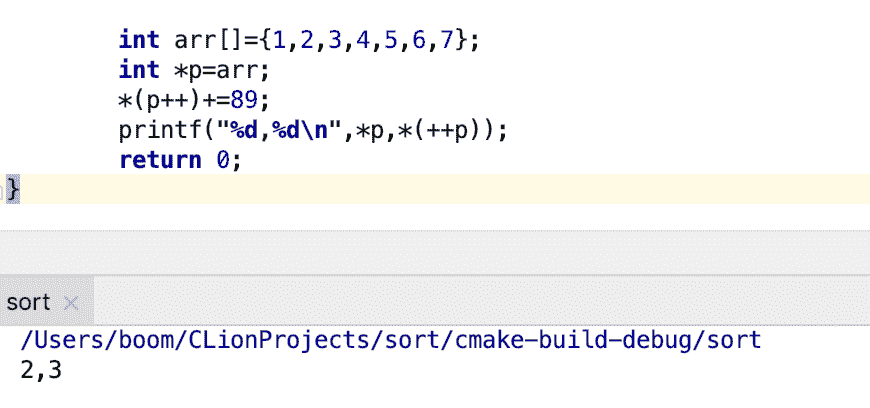
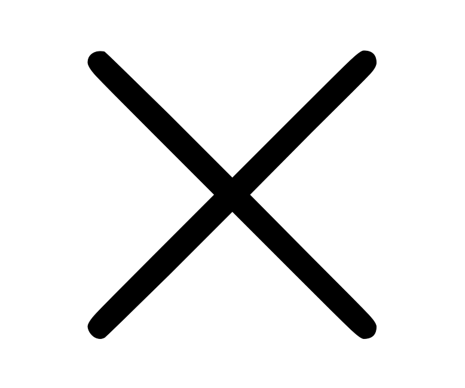
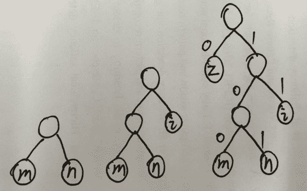
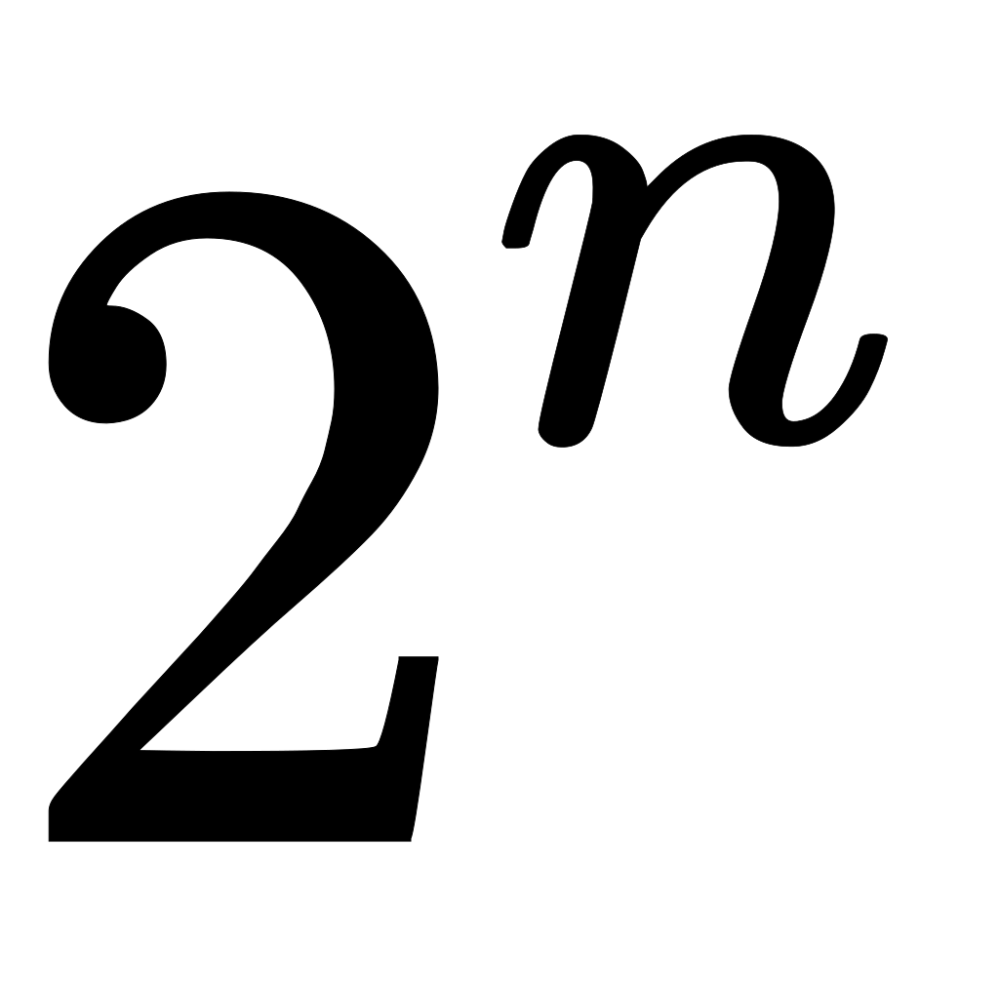

# 网易 2018 实习生招聘笔试题-计算机视觉算法实习生

## 1

数字图像颜色空间中，常被彩色显像管采用的是哪一种：

正确答案: A   你的答案: 空 (错误)

```cpp
RGB
```

```cpp
YUV
```

```cpp
HIS
```

```cpp
CMYK
```

本题知识点

网易 算法工程师 算法工程师 网易 2018

讨论

[枫夜初雨](https://www.nowcoder.com/profile/679872869)

三支电子枪，分别发射红（R）、绿（G）、蓝（B）三条电子束。来自百度词条，显像管，彩色显像管

发表于 2018-08-08 11:02:08

* * *

[菜是原罪，难是帮凶ಥ_ಥ](https://www.nowcoder.com/profile/431732435)

三支电子枪，分别发射红（R）、绿（G）、蓝（B）三条电子束。

发表于 2019-03-19 15:20:13

* * *

[跳羊插大](https://www.nowcoder.com/profile/708285612)

B，Ycbcr 压缩数据量，并兼容黑白电视

发表于 2018-07-04 17:13:47

* * *

## 2

如下边缘检测算子中，时间复杂度最高的是：

正确答案: D   你的答案: 空 (错误)

```cpp
Sobel 算子
```

```cpp
Roberts 算子
```

```cpp
Prewitt 算子
```

```cpp
Canny 算子
```

本题知识点

网易 算法工程师 算法工程师 网易 2018

讨论

[枫夜初雨](https://www.nowcoder.com/profile/679872869)

[`www.nowcoder.com/questionTerminal/4a485681601c4317a09e846c54261d43`](https://www.nowcoder.com/questionTerminal/4a485681601c4317a09e846c54261d43)Robert 算子是一阶微分算子，比较简单，计算量小，对细节反应敏感。Sobel 算子是基于一阶导数的微分算子，其中引入了类似局部平均的运算，对于噪声有平滑作用，能很好地消除噪声的影响，所以计算量变大。Prewitt 算子和 Sobel 一样，图像中的点用 Sobel 的两个卷积核卷积，取最大值作为输出值。也增加了计算量。Canny 算子比较复杂，既要计算多个方向的梯度，又要记录方向和大小，然后又进行 NMS 非极大值抑制，大小阈值，反正很复杂就对了，自己百度一下。里面说的很简单，也可能部分还有错误，请自行查证，增加印象。

编辑于 2018-08-08 11:34:50

* * *

## 3

大津法（OSTU 算法）阈值分割中，阈值自动选择的思路是：

正确答案: C   你的答案: 空 (错误)

```cpp
由直方图灰度分布选择阈值
```

```cpp
双峰法选择阈值
```

```cpp
最大化类间方差法选择阈值
```

```cpp
最大最小灰度值二分迭代逼近法选择阈值
```

本题知识点

网易 算法工程师 算法工程师 网易 2018

讨论

[所谓伊人 sasa](https://www.nowcoder.com/profile/927401922)

大津法(OTSU)是一种确定图像分割阈值的算法，由日本学者大津于 1979 年提出；原理上来讲，该方法又称作最大类间方差法，有时也称之为大津算法；其按照大津法求得的阈值进行图像二值化分割后，前景与背景图像的类间方差最大；其被认为是图像分割中阈值选取的最佳算法，计算简单，不受图像亮度和对比度的影响，因此在数字图像处理上得到了广泛的应用。

发表于 2018-06-30 16:42:14

* * *

## 4

某地区每个人的年收入是右偏的，均值为 5000 元，标准差为 1200 元。随机抽取 900 人并记录他们的年收入，则样本均值的分布为()

正确答案: A   你的答案: 空 (错误)

```cpp
近似正态分布，均值为 5000 元，标准差为 40 元
```

```cpp
近似正态分布，均值为 5000 元，标准差为 1200 元
```

```cpp
右偏分布，均值为 5000，标准差为 40
```

```cpp
左偏分布，均值为 5000 元，标准差为 1200 元
```

本题知识点

网易 算法工程师 算法工程师 网易 2018

讨论

[Farway](https://www.nowcoder.com/profile/5029753)

添个答案，[`www.nowcoder.com/questionTerminal/bd65d728a8f0452593ef66fb879a86b1`](https://www.nowcoder.com/questionTerminal/bd65d728a8f0452593ef66fb879a86b1)

发表于 2019-05-27 21:42:30

* * *

[再不来 offer 就要死了](https://www.nowcoder.com/profile/442940629)

难道不应该选 C 吗，不是说了收入右偏？

发表于 2018-07-23 00:13:10

* * *

## 5

函数 y=x^x,(x＞0)的极小值点是 ______

正确答案: D   你的答案: 空 (错误)

```cpp
1
```

```cpp
√2
```

```cpp
(√2)^(√2)
```

```cpp
(1/e)^(1/e)
```

本题知识点

网易 算法工程师 2018

讨论

[寄奴毓心](https://www.nowcoder.com/profile/517718461)

y=x^x
lny=xlnx
两边分别对 x 求导
y'/y=lnx+1
y'=y*(lnx+1)
把 y=x^x 代入
y'=x^x(lnx+1)
当 x=1/e 时,y'=0
x0
所以函数在 x=1/e 时,取最小值 y=(1/e)^(1/e)

发表于 2018-06-09 21:06:45

* * *

[黄小蕉](https://www.nowcoder.com/profile/4799511)

问题问的有点不严谨：极小值点 x=1/e,极小值为 1/e¹/e

发表于 2018-08-10 21:10:01

* * *

[isRicardo](https://www.nowcoder.com/profile/4570588)

等式两边取 ln

发表于 2018-06-06 21:38:35

* * *

## 6

随机变量 X 和 Y 的 Pearson 相关系数ρ取得最大值的充要条件是 ______

正确答案: C   你的答案: 空 (错误)

```cpp
X 和 Y 独立
```

```cpp
X 和 Y 不相关
```

```cpp
X 和 Y 正相关
```

```cpp
X 等于 Y
```

本题知识点

网易 算法工程师 算法工程师 网易 2018

讨论

[ccyu](https://www.nowcoder.com/profile/639977400)

链接：[`www.nowcoder.com/questionTerminal/87688605e1494c5eb21dc50d66293530?orderByHotValue=1&page=1&onlyReference=false`](https://www.nowcoder.com/questionTerminal/87688605e1494c5eb21dc50d66293530?orderByHotValue=1&page=1&onlyReference=false)
来源：牛客网

1\. 充要条件 排除 d
2. 
相关系数的绝对值越大，相关性越强：相关系数越接近于 1 或-1，相关度越强，相关系数越接近于 0，相关度越弱。
通常情况下通过以下取值范围判断变量的相关强度：
相关系数 0.8-1.0 极强相关
0.6-0.8 强相关
0.4-0.6 中等程度相关
0.2-0.4 弱相关
0.0-0.2 极弱相关或无相关

发表于 2019-07-31 19:04:19

* * *

[huang98778](https://www.nowcoder.com/profile/9966246)

注意是充要条件

发表于 2019-06-09 17:49:53

* * *

## 7

下列关于核函数的表述正确的是 ______

正确答案: C   你的答案: 空 (错误)

```cpp
核函数即特征的映射关系。
```

```cpp
多项式核函数只是将原始特征映射，并没有升维
```

```cpp
高斯核函数将特征映射到无穷维
```

```cpp
使用线性核函数的 SVM 是非线性分类器
```

本题知识点

网易 算法工程师 算法工程师 网易 2018

讨论

[lixuwinter](https://www.nowcoder.com/profile/2736030)

A.核函数即特征的映射关系。通俗理解：核函数和映射没有关系，核函数只是用来计算映射到高维空间之后的内积的一种简便方法。核函数本质上是对应于高维空间中的内积的，从而与生成高维空间的特征映射一一对应。B.多项式核函数只是将原始特征映射，并没有升维，多项式核函数可以将原始维度映射到高维，高斯核函数可以将原始维度映射到无穷维。C.高斯核函数将特征映射到无穷维，对于 x1 和 x2 的内积计算时用到了泰勒级数展开，即高斯核将数据映射到无穷高的维度。D.使用线性核函数的 SVM 是非线性分类器， SVM 在线性分类器上所做的重大改进——核函数。线性不可分时候可以使用核函数，变成线性可分。映射函数是非线性函数时，学习到的含有核函数的 SVM 就是非线性分类模型。 

发表于 2019-08-03 11:05:35

* * *

## 8

下列哪项不是 SVM 的优势 _____

正确答案: C   你的答案: 空 (错误)

```cpp
可以和核函数结合
```

```cpp
通过调参可以往往可以得到很好的分类效果
```

```cpp
训练速度快
```

```cpp
泛化能力好
```

本题知识点

网易 算法工程师 算法工程师 网易 2018

## 9

阅读 C++语言代码输出（）

```cpp
int main()
{
    int arr[]={1,2,3,4,5,6,7};
    int *p=arr;
    *(p++)+=89;
    printf("%d,%d\n",*p,*(++p));
    return 0;
}
```

正确答案: A   你的答案: 空 (错误)

```cpp
3 3
```

```cpp
2 2
```

```cpp
2 3
```

```cpp
3 2
```

本题知识点

网易 算法工程师 算法工程师 网易 2018

讨论

[所谓伊人 sasa](https://www.nowcoder.com/profile/927401922)

第 4 行： *p=arr[0]第 5 行：arr[0]=90;p 自加 1，此时*p=arr[1];第 6 行：先计算*(++p),*p=arr[2],在计算*p=arr[2].原因 prinf 从右到左编译，从左到右输出，符合栈模型

发表于 2018-06-30 19:58:42

* * *

[陈末 cc](https://www.nowcoder.com/profile/670983)



发表于 2019-07-19 21:42:40

* * *

## 10

阅读 c++代码输出（）

```cpp
class base1{
    private: int a,b;
    public:
    base1 ( int i ) : b(i+1),a(b){}
    base1():b(0),a(b){}
    int get_a(){return a;}
    int get_b(){return b;}
};
int main()
{
    base1 obj1(11);
    cout<<obj1.get_a()<<endl<<obj1.get_b()<<endl;
    return 0;
}
```

正确答案: B   你的答案: 空 (错误)

```cpp
12 12
```

```cpp
随机数 12
```

```cpp
随机数 随机数
```

```cpp
12 随机数
```

本题知识点

网易 算法工程师 算法工程师 网易 2018

讨论

[幽灵～](https://www.nowcoder.com/profile/796951)

 C++初始化类成员时，是按照声明的顺序初始化的，而不是按照出现在初始化列表中的顺序。

发表于 2018-07-24 16:02:28

* * *

[lixuwinter](https://www.nowcoder.com/profile/2736030)

在初始化列表中，成员变量的初始化顺序是其在类中声明顺序，而非列表中的顺序。

发表于 2019-08-03 11:10:06

* * *

## 11

想实现用装饰器来计时，空白处应填的代码是？

```cpp
# -*- coding: utf-8 -*-
import time, functools
def metric(fn):
    # 空白处
    def wrapper(*args, **kw):
        startTime = time.time()
        tmp = fn(*args, **kw)
        endTime = time.time()
        print('%s executed in %s s' % (fn.__name__, endTime - startTime ))
        return tmp
    return wrapper

```

正确答案: D   你的答案: 空 (错误)

```cpp
无需填写
```

```cpp
@functools
```

```cpp
@time(fn)
```

```cpp
@functools.wraps(fn)
```

本题知识点

网易 算法工程师 算法工程师 网易 2018

讨论

[chestnut7](https://www.nowcoder.com/profile/8450491)

Python 中使用装饰器对在运行期对函数进行一些外部功能的扩展。但是在使用过程中，由于装饰器的加入导致解释器认为函数本身发生了改变，在某些情况下——比如测试时——会导致一些问题。Python 通过 functool.wraps 为我们解决了这个问题：在编写装饰器时，在实现前加入 @functools.wraps(func) 可以保证装饰器不会对被装饰函数造成影响。

发表于 2018-06-24 17:04:44

* * *

## 12

python 是用 C 语言写成的，根据名字空间特性，以下代码经过 python 编译器编译后，一共得到（）个 PyCodeObject 对象。

```cpp
class A:
    pass
def Fun():
    pass
a = A()
Fun()
```

正确答案: C   你的答案: 空 (错误)

```cpp
= A()<br>Fun()
```

```cpp
1
```

```cpp
2
```

```cpp
3
```

```cpp
4
```

本题知识点

网易 算法工程师 2018

讨论

[chestnut7](https://www.nowcoder.com/profile/8450491)

Python 编译器在对 Python 源码进行编译的时候，对代码中的一个 Code Block，会创建一个 PyCodeObject 对象与这段代码对应。
Python 中确定 Code Block 的规则：当进入一个新的名字空间或作用域时，就算进入了一个新的 Code Block 了。
即：一个名字空间对应一个 Code Block，它会对应一个 PyCodeObject。
现在暂且认为名字空间就是符号的上下文环境，是名字到对象的映射。名字空间以后会详述。
在 Python 中，类、函数和 module 都对应着一个独立的名字空间，因此都会对应一个 PyCodeObject 对象。

发表于 2018-06-24 17:16:11

* * *

## 13

用 1*3 的瓷砖密铺 3*20 的地板有几种方式？

正确答案: A   你的答案: 空 (错误)

```cpp
1278
```

```cpp
872
```

```cpp
595
```

```cpp
406
```

本题知识点

网易 算法工程师 算法工程师 网易 2018

讨论

[寄奴毓心](https://www.nowcoder.com/profile/517718461)

3*n 的区域铺瓷砖为 f(n)，如果第一列竖着，那么就是 f(n-1)，如果横着铺，就是 f(n-3)。f(1) = 1
f(2) = 1 f(3) = 2 f(4) = f(3) + f(1) =3 f(5) = f(4) + f(2) =4 f(n) = f(n-1) + f(n-3)……f(20) = f(19) + f(17)=1278。

发表于 2018-06-09 21:46:00

* * *

[chestnut7](https://www.nowcoder.com/profile/8450491)

动态规划的思想：3*n 的区域铺瓷砖为 f(n)，从左往右铺，如果最后一列竖着，那么就是 f(n-1)，如果最后是横着铺，就是 f(n-3)。
f(n) = f(n-1) + f(n-3),递推结果为 1278。

发表于 2018-06-24 21:05:30

* * *

[InFiNiTeemo](https://www.nowcoder.com/profile/4359368)

枚举横着放的瓷砖个数，利用插板法确定位置
ΣC(i,20-2*i) , i∈【0,6】 =  1278

发表于 2018-06-10 10:04:09

* * *

## 14

已知有 4 个矩阵分别大小为 M1(5*3) M2(3*4) M3(4*2) M4(2*7) 下面组合计算所需要的乘法次数最优的为？

正确答案: D   你的答案: 空 (错误)

```cpp
(M1(M2(M3M4)))
```

```cpp
(M1((M2M3)M4))
```

```cpp
((M1M2)(M3M4))
```

```cpp
((M1(M2M3))M4)
```

```cpp
(((M1M2)M3)M4)
```

本题知识点

网易 算法工程师 算法工程师 网易 2018

讨论

[live&learn](https://www.nowcoder.com/profile/801523168)

矩阵 AB，矩阵 BC，两个相乘所需乘法次数为 ABC 对于 D，((M1(M2M3))M4)计算的乘法次数为 342+532+527=124   最少

发表于 2018-08-14 15:24:38

* * *

[dut_zxy](https://www.nowcoder.com/profile/5597802)

a×b 的矩阵与 b×c 的矩阵相乘，需要的乘法次数为 b×ac

发表于 2018-08-07 13:30:01

* * *

[9384](https://www.nowcoder.com/profile/916295072)

先计算小矩阵，在计算大矩阵

发表于 2018-08-02 05:36:50

* * *

## 15

一个完全二叉树节点数为 200，则其叶子结点个数为？

正确答案: C   你的答案: 空 (错误)

```cpp
98
```

```cpp
99
```

```cpp
100
```

```cpp
101
```

本题知识点

网易 算法工程师 算法工程师 网易 2018

讨论

[chestnut7](https://www.nowcoder.com/profile/8450491)

完全二叉树：
如果二叉树的深度为 k，则除第 k 层外其余所有层节点的度都为 2，且叶子节点从左到右依次存在。也即是，将满二叉树的最后一层从左到右依次删除若干节点就得到完全二叉树。满二叉树是一棵特殊的完全二叉树，但完全二叉树不一定是满二叉树。

假设一个二叉树有 n 个节点：

```cpp
度为 0 的节点个数是 n0
度为 1 的节点个数是 n1
度为 2 的节点个数是 n2 
```

则有如下公式成立：

```cpp
n0 = n2 + 1      (1)
n0 = (n +1) / 2  (2)（完全二叉树） 
```

n = n0 + n1 +n2
因为 n0 = n2 + 1
所以 n = 2 * n0 + n1 - 1

因为是完全二叉树，所以 n1 只能等于 0 或 1
所以 n = 2 *n0 - 1 或 n = 2* n0
也就是 n0 = (n + 1) / 2

发表于 2018-06-22 17:32:57

* * *

[飞翔的傻瓜](https://www.nowcoder.com/profile/8386515)

首先大致计算出这完全二叉树一共有几层，由于其的节点数是 200，其在 127 和 255 之前，也就是 2⁷-1 和 2⁸-1 之间，叶子节点有两部分，一部分是第 8 层暴露出来了，一部分是第 7 层没有子节点的那一部分，暴露出来的是 200-127=73 个，而 73 个节点从（73+1)/2=37 个节点引出来的，那么第 7 层剩下的节点是 2^(7-1)=64,那么 7 层剩下的叶子节点是 64-37=27 27 + 73 = 100

发表于 2018-06-22 21:13:10

* * *

[凹凸慢](https://www.nowcoder.com/profile/590928175)

最后一层是 73 个，占用了上一层 64 个中的 37 个，上一层剩下 27 个，最后 27+73

发表于 2019-08-02 19:17:36

* * *

## 16

字符串 zmnzizi 用哈夫曼编码来编码，则共有多少位？

正确答案: B   你的答案: 空 (错误)

```cpp
14
```

```cpp
13
```

```cpp
12
```

```cpp
11
```

本题知识点

网易 算法工程师 算法工程师 网易 2018

讨论

[live&learn](https://www.nowcoder.com/profile/801523168)

哈夫曼编码：根据字母出现的频率构建带权二叉树来确定每个字母的编码。
z(3)、i(2)、m(1)、n(1)
构造二叉树过程：

对应 zmnzizi 的哈夫曼编码为 0 100 101 0 11 0 11，共 13 位

发表于 2018-08-14 16:04:11

* * *

[chestnut7](https://www.nowcoder.com/profile/8450491)

[字符串"alibaba"的二进制哈夫曼编码有多少位](https://blog.csdn.net/FX677588/article/details/70784470)

发表于 2018-06-24 20:55:58

* * *

## 17

已知中序遍历的序列为 abcdef，高度最小的不可能的二叉树的前序遍历是

正确答案: D   你的答案: 空 (错误)

```cpp
dbacfe
```

```cpp
dbacef
```

```cpp
cbaedf
```

```cpp
cabefd
```

本题知识点

网易 算法工程师 算法工程师 网易 2018

讨论

[我是一座庙](https://www.nowcoder.com/profile/977390630)

1.     d       /   \
    b       f  /    \    /a     c  e2.      d        /  \
      b    e
    /  \       \
 a    c        f3.             c
           /   \
         a      e
           \     /  \           b  d      f4.          c            /  \
          b     e         /       /  \       a       d   f

发表于 2019-08-02 22:56:39

* * *

[秋名湖畔的鱼](https://www.nowcoder.com/profile/7794473)

答案 D。对于 c 做根节点时 ab|c|def，左边 ab 为其左子树，右边 3 个为其右子树，同时根据中序遍历顺序右子树的根节点只能是 d|e|f，也就是说 d 和 f 只能是 d 左 f 右。而 D 选项 d 和 f 反了。

发表于 2020-04-03 21:26:07

* * *

[9384](https://www.nowcoder.com/profile/916295072)

abcdef 共 6 位，根据二叉树的性质，2³-1=7，根据题目，高度为 3，必然有一颗子树是满的。若左子树满，则 d 为根，右子树满，则 c 为根。

发表于 2018-08-02 05:46:39

* * *

## 18

以下算法中未用到贪心算法思想的是？

正确答案: D   你的答案: 空 (错误)

```cpp
迪杰斯特拉(Dijkstra)
```

```cpp
库鲁斯卡尔(Kruskal)
```

```cpp
普里姆算法(Prim)
```

```cpp
KMP
```

本题知识点

网易 算法工程师 算法工程师 网易 2018

讨论

[幽灵～](https://www.nowcoder.com/profile/796951)

KMP 求字符串匹配，应该是属于时空权衡 Prim、Kruskal 求最小生成树，Dijkstra 求最短路径，哈夫曼树均使用贪婪技术

发表于 2018-08-01 19:10:40

* * *

## 19

对于线性表（ 13,25,22,35,54,57,63）进行散列存储时，若选用 H （ K ） =K %7 作为散列函数，则散列地址为 1 的元素有（ ）个？

正确答案: C   你的答案: 空 (错误)

```cpp
0
```

```cpp
1
```

```cpp
2
```

```cpp
3
```

本题知识点

网易 算法工程师 算法工程师 网易 2018

讨论

[请叫我小吴](https://www.nowcoder.com/profile/693269216)

 散列函数的意思是将内容通过一个特定函数计算得到你的数组地址值，比如 a[n]中的 n 值，在把内容放到里面去。这样就可以很方便的将内容与地址建立关系，方便查找。 H （ K ） =K %7 表示除以 7 的余数，根据题目得知，只有 22 和 57 除以 7 余数是 1 的。

编辑于 2020-05-06 20:17:27

* * *

[Mr.Felix](https://www.nowcoder.com/profile/502380464)

 H （ K ） =K %7 表示除以 7 的余数。

发表于 2018-10-11 14:55:46

* * *

## 20

下列选项中，不可能是快速排序第 2 趟排序结果的是 （）

正确答案: C   你的答案: 空 (错误)

```cpp
4 14 10 12 8 6 18
```

```cpp
4 6 10 8 12 14 18
```

```cpp
6 4 10 8 14 12 18
```

```cpp
8 4 6 10 12 14 18
```

本题知识点

网易 算法工程师 算法工程师 网易 2018

讨论

[NowCoder001](https://www.nowcoder.com/profile/2614541)

快排第二趟至少应有 2 个元素就位。

发表于 2018-08-05 21:52:25

* * *

[幽灵～](https://www.nowcoder.com/profile/796951)

快速排序，选取一个基准数，两个指针 i,j 分别从左到右找大于它的，从右往左找小于它的，先 j 开始。一趟排序下来，满足小于该基准数的在左边，大于基准数的在右边。第一趟排序找到一个数，小于它的在左，大于它的在右。第二趟分别看上一趟找到的基准数的左边和右边，是否也呈存在一个一个基准数，使得左边的数小于它右边的数大于它。例如选项 A：原序列 18 14 10 12 8 6 4，第一趟基准数 18，快速排序结果 4 14 10 12 8 6 18，第二趟看 18 的左边，基准数为 4，排序结果 4 14 10 12 8 6 18
选项 B 同 A：原序列 18 6 10 8 12 14 4 选项 D ：原序列 18 4 6 8 12 14 10 个人意见，当多趟看起就有些老火了

发表于 2018-08-03 23:07:12

* * *

## 21

平面内有 n 个矩形, 第 i 个矩形的左下角坐标为(x1[i], y1[i]), 右上角坐标为(x2[i], y2[i])。

如果两个或者多个矩形有公共区域则认为它们是相互重叠的(不考虑边界和角落)。

请你计算出平面内重叠矩形数量最多的地方,有多少个矩形相互重叠。

本题知识点

网易 算法工程师 高级结构 数学 穷举 2018

讨论

[蛟龙吐火球丰](https://www.nowcoder.com/profile/3985756)

```cpp
//用例数字太大……只能这么土了，一不小心就 bad_alloc
#include <iostream>
#include <algorithm>
#include <vector>
#include <limits.h>
using namespace std;
struct pt
{
    long x1,x2;
    long y1,y2;
    pt(long _x1,long _y1,long _x2,long _y2):x1(_x1),y1(_y1),x2(_x2),y2(_y2){};
};
int main()
{
    int n;
    while(cin>>n)
    {
        long x1,y1,x2,y2;    
        vector<long> xs(2*n);
        vector<long> ys(2*n);

        vector<pt> co;
        for(int i=0;i<n;i++)
            co.push_back(pt(0,0,0,0));
        for(int i=0;i<n;i++)
        {
            cin>>xs[i];
            co[i].x1=xs[i];
        }
          for(int i=0;i<n;i++)
        {
            cin>>ys[i];
            co[i].y1=ys[i];
        }
         for(int i=0;i<n;i++)
        {
            cin>>xs[i+n];
            co[i].x2=xs[i+n];
        }
         for(int i=0;i<n;i++)
        {
            cin>>ys[i+n];
            co[i].y2=ys[i+n];
        }

       int out=0;

       for(int i=0;i<2*n;i++)
       {
           for(int j=0;j<2*n;j++)
           {
               int cnt=0;
               for(int p=0;p<n;p++)
               {
                   if(co[p].x1<=xs[i]&&co[p].x2>xs[i]&&
                     co[p].y1<=ys[j]&&co[p].y2>ys[j])
                       cnt++;
               }
               out=max(out,cnt);
           }
       }
       cout<<out<<endl;
    }
} 
```

发表于 2018-06-30 09:26:59

* * *

## 22

牛牛总是睡过头，所以他定了很多闹钟，只有在闹钟响的时候他才会醒过来并且决定起不起床。从他起床算起他需要 X 分钟到达教室，上课时间为当天的 A 时 B 分，请问他最晚可以什么时间起床

本题知识点

网易 算法工程师 2018

讨论

[chestnut7](https://www.nowcoder.com/profile/8450491)

PYTHON:一次遍历

```cpp
n  = int(raw_input())
v=[]
for i in range(n):
    line = raw_input()
    v.append(int(line.split(' ')[0])*60 + int(line.split(' ')[1]))
time = int(raw_input())
line = raw_input()
tar = int(line.split(' ')[0])*60 + int(line.split(' ')[1])
ma = v[0]
for i in range(1, n):
    if v[i] >= ma and (tar-v[i]) >= time:
        ma = v[i]
    else:
        continue
print str(ma/60)+' '+str(ma%60) 
```

发表于 2018-06-27 23:05:42

* * *

[我是一座庙](https://www.nowcoder.com/profile/977390630)

```cpp
 clock_num =int(input())

	clock_time =[]

	fori inrange(clock_num):

	    hour,minute =list(map(int,input().split()))

	    clock_time.append(hour*60+minute)

	clock_time =sorted(clock_time) #记得排序

	X =int(input())

	time =list(map(int,input().split()))

	Time =time[0]*60+time[1]

	latest_time =Time -X

	fori inrange(clock_num-1,-1,-1):

	    ifclock_time[i] <=latest_time:

	        late =clock_time[i]

	        break    # 非常重要，因为找到第一个就要停下来

	hour =int(late/60)

	minute =late%60

	print(str(hour)+' '+str(minute)) 
```

发表于 2019-08-02 22:59:11

* * *

[蛟龙吐火球丰](https://www.nowcoder.com/profile/3985756)

```cpp
#include <iostream>
#include <vector>
#include <algorithm>

using namespace std;
int main()
{
    int n;
    while(cin>>n)
    {
        vector<int> co(n);
        int bg,tm;
        for(int i=0;i<n;i++)
        {
            cin>>bg>>tm;
            co[i]=bg*60+tm;
        }
        int inter;
        cin>>inter;
        cin>>bg>>tm;
        int fin=bg*60+tm;
        sort(co.begin(),co.end());
        reverse(co.begin(),co.end());
        for(int i=0;i<n;i++)
        {
            if(co[i]+inter<=fin)
            {
                cout<<co[i]/60<<' '<<co[i]%60<<endl;
                break;
            }
        }

    }
} 
```

发表于 2018-06-30 09:46:02

* * *

## 23

牛牛准备参加学校组织的春游, 出发前牛牛准备往背包里装入一些零食, 牛牛的背包容量为 w。牛牛家里一共有 n 袋零食, 第 i 袋零食体积为 v[i]。牛牛想知道在总体积不超过背包容量的情况下,他一共有多少种零食放法(总体积为 0 也算一种放法)。

本题知识点

网易 算法工程师 高级算法 穷举 2018

讨论

[零葬](https://www.nowcoder.com/profile/75718849)

记忆化搜索

感觉有点问题，但是 AC 了，当零食总体积不超过背包体积时怎么背都可以，每个零食都可以有两种选择：选与不选。一共种方案。否则就是个背包问题，从左往右进行尝试，用记忆化搜索缓存中间结果。

```cpp
import java.io.*;
import java.util.*;

public class Main {
    public static void main(String[] args) throws IOException {
        BufferedReader br = new BufferedReader(new InputStreamReader(System.in));
        String[] params = br.readLine().split(" ");
        int n = Integer.parseInt(params[0]), w = Integer.parseInt(params[1]);
        params = br.readLine().split(" ");
        int[] v = new int[n];
        long sum = 0;
        for(int i = 0; i < n; i++){
            v[i] = Integer.parseInt(params[i]);
            sum += v[i];
        }
        if(sum <= w){
            System.out.println((int)Math.pow(2, n));
        }else{
            Map<Integer, Integer> dp = new HashMap<>();
            dp.put(0, 1);
            System.out.println(dfs(v, w, 0, dp));
        }
    }

    private static int dfs(int[] v, int rest, int index, Map<Integer, Integer> dp) {
        if(rest < 0){
            return 0;
        }
        if(index == v.length){
            if(!dp.containsKey(rest)){
                dp.put(rest, 1);
            }
        }else{
            if(!dp.containsKey(rest)){
                int cnt = dfs(v, rest, index + 1, dp) + dfs(v, rest - v[index], index + 1, dp);
                dp.put(rest, cnt);
            }
        }
        return dp.get(rest);
    }
}
```

暴力递归

这个应该没有问题，但是复杂度比较高

```cpp
import java.io.*;
import java.util.*;

public class Main {
    private static int count = 0;
    public static void main(String[] args) throws IOException {
        BufferedReader br = new BufferedReader(new InputStreamReader(System.in));
        String[] params = br.readLine().split(" ");
        int n = Integer.parseInt(params[0]), w = Integer.parseInt(params[1]);
        params = br.readLine().split(" ");
        int[] v = new int[n];
        long sum = 0;
        for(int i = 0; i < n; i++){
            v[i] = Integer.parseInt(params[i]);
            sum += v[i];
        }
        if(sum <= w){
            System.out.println((int)Math.pow(2, n));
        }else{
            dfs(v, w, 0);
            System.out.println(count);
        }
    }

    private static void dfs(int[] v, int rest, int index) {
        if(rest < 0){
            return;      // 背包容量不够了，本次尝试无效
        }
        if(index == v.length){
            count++;     // 到头了，生成一种方案
        }else{
            dfs(v, rest, index + 1);      // 不选 index 编号的零食
            dfs(v, rest - v[index], index + 1);     // 选 index 编号的零食
        }
    }
}
```

发表于 2022-03-18 11:45:21

* * *

[dut_zxy](https://www.nowcoder.com/profile/5597802)

```cpp
#include <iostream>
#include <vector>
using namespace std;

class Solution
{
public:     Solution(int n, int w, vector<long long> &v) :_n(n), _w(w), _ans(1)     {         _v.swap(v);     }     int func()     {         for (int i = 0; i < _v.size(); i++)         {             help(_v[i], i + 1);         }         return _ans;     }
private:     int _n;     int _w;     int _ans;     vector<long long> _v;
private:     void help(long long cw, int index)     {         if (cw > _w)         {             return;         }         if (cw <= _w)         {             _ans++;         }         for (int i = index; i < _v.size(); i++)         {             cw += _v[i];             help(cw, i + 1);             cw -= _v[i];         }     }
};

int main()
{     int n, w;     cin >> n >> w;     vector<long long> v(n);     for (int i = 0; i < n; i++)     {         cin >> v[i];     }     Solution s(n, w, v);     cout << s.func() << endl;     return 0;
}

```

发表于 2018-08-07 16:29:13

* * *

[蛟龙吐火球丰](https://www.nowcoder.com/profile/3985756)

```cpp
#include <bits/stdc++.h>
typedef long long LL;
using namespace std;
int cnt,n;
LL w;

void walk(vector<LL>& co,int idx,LL curw)
{
    if(curw>w)return;
    if(idx>=n){cnt++;return;}
    walk(co,idx+1,curw+co[idx]);
    walk(co,idx+1,curw);   
}
int main()
{
    while(cin>>n>>w)
    {
        vector<LL> co(n);
        LL sum=0;
        for(int i=0;i<n;i++)
        {
            cin>>co[i];
            sum+=co[i];
        }
        if(sum<=w){cout<<(1<<n)<<endl;continue;}
        cnt=0;
        walk(co,0,0);
        cout<<cnt<<endl;          
    }
} 
```

编辑于 2018-08-10 09:12:30

* * *

## 24

【问答题任选 2 道作答】假设有一个识别图像中商品 logo 的业务需求，期望输入一张图片判断其中是否带有目标 logo，我们计划借助深度学习分类或检测方法来解决该业务问题。

（1）作为算法同学，请问你想要知道哪些更加详细的业务信息？

（2）实际情况下我们能够收集到的带 logo 图片数据非常少，请问有哪些处理方式可以增加训练样本 或者 减少样本量过少带来的影响？

（3）为了提高线上效果，请问如何做更好的线下算法测试？

你的答案

本题知识点

网易 算法工程师 2018

讨论

[枫夜初雨](https://www.nowcoder.com/profile/679872869)

（1）作为算法同学，请问你想要知道哪些更加详细的业务信息？首先要知道 Logo 的样式，颜色，材质，大小等外观信息是否会变化。然后想要知道 logo 应用的场景，是否会存在遮挡，空间角度上的旋转，在图像上的映射不足。然后想要知道 logo 图片的数据是否充足？等。（2）实际情况下我们能够收集到的带 logo 图片数据非常少，请问有哪些处理方式可以增加训练样本或者减少样本量过少带来的影响？增加训练样本：数据增广： 如果颜色、材质等会发生变化，则尝试改变现有数据的颜色和材质，光照等。如果实际检测情况中有旋转，则可以增加旋转。如果实际情况中存在遮挡的情况，也可以进行裁剪。还可以进行平移等操作。减少样本量过少带来的影响：增加负例，但是要调节权重。（暂时不是很清楚）（3）为了提高线上效果，请问如何做更好的线下算法测试？来自百度。一般项目有调研阶段，主要做数据分析和算法线下小规模测试。算法测试：模型评估：泛化能力,泛化误差，性能度量（Performance Measure）1.Accuracy2.精确率（Precision 针对某一类）,召回率（Recall）,F1 值，ROC 与 AUC   -- 分类算法评价指标 3.MSE（均方误差）,RMSE（均方根误差）,MAE（平均绝对误差）,R-Squared（拟合度）  ---回归算法评价指标算法鲁棒性：在异常状况下的效果。测试方法就是用尽可能多的异常数据来覆盖进行测试。模型安全：攻击方法由：试探性攻击、对抗性攻击两种在试探性攻击中，攻击者的目的通常是通过一定的方法窃取模型，或是通过某种手段恢复一部分训练模型所用的数据来推断用户的某些敏感信息。主要分为 模型窃取 和 训练数据窃取对抗性攻击对数据源进行细微修改，让人感知不到，但模型接受该数据后作出错误的判断。响应速度：响应速度是指从数据输入到模型预测输出结果的所需时间。对算法进行时间的评价。测试方法：定义装饰器。

发表于 2018-08-08 16:28:01

* * *

[牛客 Cver](https://www.nowcoder.com/profile/1897620)

（1）图像的大小、检测目标的定义、数据量有多大、数据集的来源、识别 logo 的最大容忍识别时间是多少，是否要求实时（2）首先可以采用图像增强的方式，比如将图像进行旋转、缩放、平移、剪切等操作丰富图片数据集；另外还可以采用 GAN 生成对抗一些数据图片来丰富数据集；对于数据集比较少的情况下，我们也可以采用迁移学习对小型数据集进行训练和推理。（3）在模型训练完后，可以采用多种模型评估方式和模型验证的方式对当前的模型进行评估和选择，常见的模型评估方式可以采取准确率、精确率和召回率、ROC 曲线、F1 值等方式对模型进行多样化评估；常见的模型验证方式，可以采用 holdout 方式对数据集按照一定比例分割成训练集、测试集和验证集进行验证，另外还有可以采用 k 折交叉验证方式进行检验，如果出现多个模型的评估和验证效果差不多，还可以进一步采用 T-test 或者 F-test 对多个待选模型进行显著性差异分析。

发表于 2020-04-10 21:40:59

* * *

## 25

【问答题任选 2 道作答】
随着深度学习的不断发展，好用的模型越来越多，聊一聊你对模型选择的看法，包括模型规模和数据规模之间的联系。

你的答案

本题知识点

网易 算法工程师 2018

## 26

【问答题任选 2 道作答】
在分类问题中我们往往会提到 ROC，AUC，PRC 等概念，请问如何借助这些指标或其他测试指标判定一个模型在实际场景中的优劣？

你的答案

本题知识点

网易 算法工程师 2018

讨论

[Conleykang](https://www.nowcoder.com/profile/6660355)

这些指标中，AUC 作为一个模型评价指标，主要是二分类模型的评价，指的是曲线下面积（Area under Curve），而这个曲线就是 ROC 曲线。通常 ROC 曲线在 y=x 曲线的上方，若是处于下方，则将模型预测反过来即可。AUC 值越大，表示该模型的分类正确率越高，自然模型性能相对好一些。至于 ROC 曲线怎么绘制，通常模型的输出结果都是以概率形式，输出属于某类别的概率，那么我们需要设定一系列阈值，来将概率转化为类别结果，通过不同的阈值进而计算出多组 True Positive rate 和 False Positive rate 结果，记得到 ROC 曲线。对于 PRC，即 PR 曲线，则是针对于单独一类，也是通过不同的阈值计算出它的精确率 Precision 和召回率 Recall，得到 PR 曲线，PR 曲线越往右上方靠，也可以在一定程度上说明模型对该类的分类效果。但是假如测试集中的正负样本比例，出现不同的变化。我们通过画出不同的 ROC 曲线和 PRC 曲线，就能发现 ROC 曲线可以很好地表征模型性能的好坏，而 PRC 受这个影响比较大。

发表于 2018-08-09 15:52:12

* * *