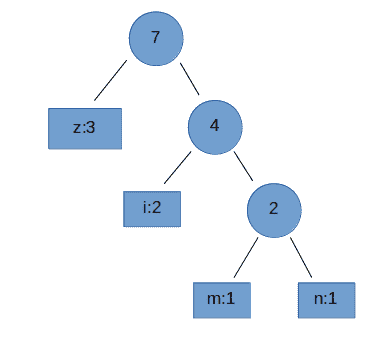

# 网易 2018 实习生招聘笔试题-机器学习算法实习生

## 1

关于矩阵的广义逆，下列表述不正确的是 ________

正确答案: D   你的答案: 空 (错误)

```cpp
若矩阵 A 的广义逆为 B，则 A*B*A=A，B*A*B=B
```

```cpp
若矩阵 A 的广义逆为 B，则 A*B 和 B*A 都是对称阵。
```

```cpp
矩阵 A 一定存在确定唯一的广义逆。
```

```cpp
矩阵 A 可能不存在广义逆。
```

本题知识点

网易 算法工程师 算法工程师 网易 2018

讨论

[HuangZhihao](https://www.nowcoder.com/profile/3773757)

对每一个 mxn 阶矩阵 A，存在一个唯一的 nxm 阶矩阵 M，使得下面三个条件同时成立：(1) AMA = A(2)MAM = M(3)AM 与 MA 均为对称矩阵这样的矩阵 M 成为矩阵 A 的 Moore-Penrose 广义逆矩阵，记作 M=A+当 A 非奇异时,也满足以上 4 个条件,因此 M-P 逆也是通常逆矩阵的推广.

发表于 2018-06-05 12:38:40

* * *

[exec_cyc.](https://www.nowcoder.com/profile/669084697)

（补充 1 楼） 奇异矩阵是行列式为 0 的矩阵，不满秩，是不可逆矩阵，但它可以有广义逆。 非奇异矩阵行列式不为 0，满秩，是可逆矩阵。

发表于 2019-07-04 18:06:05

* * *

[一只会飞的企鹅](https://www.nowcoder.com/profile/6116776)

广义逆阵也称为伪逆矩阵，矩阵 A 的广义逆阵是指另一矩阵具有部分逆矩阵的特性

发表于 2018-05-30 20:48:57

* * *

## 2

关于梯度方向，下列说法正确的是 ______

正确答案: A   你的答案: 空 (错误)

```cpp
给定某定点，沿着梯度方向函数值增加最快
```

```cpp
给定某定点，沿着梯度方向函数值减少最快
```

```cpp
任何函数的定点一定存在梯度方向
```

```cpp
如果函数不是凸函数，则一定存在至少一个点不存在梯度方向
```

本题知识点

网易 算法工程师 算法工程师 网易 2018

讨论

[短发元气 girl](https://www.nowcoder.com/profile/5546713)

B 错，因为是沿着负梯度方向函数值减少最快

发表于 2018-07-22 14:53:38

* * *

[一只会飞的企鹅](https://www.nowcoder.com/profile/6116776)

方向导数变化最快的方向称为梯度

发表于 2018-05-30 20:50:29

* * *

[吃个小熊饼](https://www.nowcoder.com/profile/9007293)

给定某定点，在这点不可导，没梯度呢？？

发表于 2018-08-02 20:20:49

* * *

## 3

假定树根的高度为 0，则高度为 6 的二叉树最多有 _______ 个叶节点。

正确答案: B   你的答案: 空 (错误)

```cpp
32
```

```cpp
64
```

```cpp
128
```

```cpp
256
```

本题知识点

网易 算法工程师 算法工程师 网易 2018

讨论

[Lena 的凝视](https://www.nowcoder.com/profile/299567509)

假定树根的高度为 0,所以高度为 6 的二叉树其实是通常意义上的 7 层二叉树？

发表于 2018-07-07 21:48:28

* * *

[十月顺利！](https://www.nowcoder.com/profile/3175311)

最大就是满树，就是所有节点都有两个子节点，叶子节点=2⁶=64

发表于 2018-08-09 22:29:44

* * *

[Monicar](https://www.nowcoder.com/profile/8570918)

实际是 7 层

发表于 2018-07-09 10:17:27

* * *

## 4

下列哪种不是使用随机森林计算特征重要度的方法 ______

正确答案: D   你的答案: 空 (错误)

```cpp
selection frequency
```

```cpp
gini importance
```

```cpp
permutation importance
```

```cpp
gauss mixture model
```

本题知识点

网易 算法工程师 算法工程师 网易 2018

讨论

[猫呜呜](https://www.nowcoder.com/profile/6635033)

RF 计算特征重要度采用的是基尼指数（Gini index）频率选择、Gini 重要度、排序重要度都可以用 Gini index 计算高斯混合模型采用的是期望最大化（EM）算法

发表于 2018-08-11 11:26:17

* * *

[一只会飞的企鹅](https://www.nowcoder.com/profile/6116776)

使用随机森林是一种常用的衡量特征重要性的方法

发表于 2018-05-30 21:01:04

* * *

## 5

对于给定 1000 个训练样本的二分类问题，关于支持向量机的说法，正确的有 _____

正确答案: A   你的答案: 空 (错误)

```cpp
需要构造 1000 个辅助变量，计算它们的非零值对应着支撑向量。
```

```cpp
如果使用高斯核函数，不需要构造 1000 个辅助变量，只需要 100 个。
```

```cpp
如果使用多项式核函数，不需要构造 1000 个辅助变量，只需要 100 个。
```

```cpp
在当前普通计算机上需要约 1 小时才能得到训练模型。
```

本题知识点

网易 算法工程师 算法工程师 网易 2018

讨论

[萝卜白菜 nkw](https://www.nowcoder.com/profile/5962749)

应该是利用拉格朗日乘子法转化为对偶问题时系数 alpha 要有 1000 个，但最终结果只与支持向量有关因此与支持向量无关的 alpha 为 0，我不知道我解释的对不，还希望各位指正！

发表于 2018-07-08 14:58:42

* * *

[短发元气 girl](https://www.nowcoder.com/profile/5546713)


发表于 2018-07-22 14:59:19

* * *

[cyl586309](https://www.nowcoder.com/profile/1492868)

这里辅助变量指的是拉格朗日乘子，当辅助变量非零时，对应的特征向量在最大间隔边界上，即为支撑向量

发表于 2018-11-08 19:00:39

* * *

## 6

下列哪种不是支持向量机的分类类别 _____

正确答案: D   你的答案: 空 (错误)

```cpp
线性可分支持向量机
```

```cpp
线性支持向量机
```

```cpp
非线性支持向量机
```

```cpp
高阶支持向量机
```

本题知识点

网易 算法工程师 算法工程师 网易 2018

讨论

[HuangZhihao](https://www.nowcoder.com/profile/3773757)

1\. 线性可分支持向量机(硬间隔支持向量机)2\. 线性支持向量机(软间隔支持向量机)3\. 非线性支持向量机(核函数+软间隔)

发表于 2018-06-04 21:21:25

* * *

## 7

下列关于核函数的表述正确的是 ______

正确答案: C   你的答案: 空 (错误)

```cpp
核函数即特征的映射关系。
```

```cpp
多项式核函数只是将原始特征映射，并没有升维
```

```cpp
高斯核函数将特征映射到无穷维
```

```cpp
使用线性核函数的 SVM 是非线性分类器
```

本题知识点

网易 算法工程师 算法工程师 网易 2018

讨论

[Rnanprince](https://www.nowcoder.com/profile/4293215)

A.核函数即特征的映射关系。通俗理解：核函数和映射没有关系，核函数只是用来计算映射到高维空间之后的内积的一种简便方法。核函数本质上是对应于高维空间中的内积的，从而与生成高维空间的特征映射一一对应。B.多项式核函数只是将原始特征映射，并没有升维，，，多项式核函数可以将原始维度映射到高维，高斯核函数可以将原始维度映射到无穷维 C.高斯核函数将特征映射到无穷维，，对于 x1 和 x2 的内积计算时用到了泰勒级数展开，即高斯核将数据映射到无穷高的维度。D.使用线性核函数的 SVM 是非线性分类器， SVM 在线性分类器上所做的重大改进——核函数。，线性不可分时候可以使用核函数，变成线性可分。映射函数是非线性函数时，学习到的含有核函数的 SVM 就是非线性分类模型。 

编辑于 2018-07-07 12:03:33

* * *

[tinanoro](https://www.nowcoder.com/profile/892850475)

线性核函数（linear kernel）就相当于什么操作都不做。K(xi,xj) = (xi * xj)¹。因此，使用线性核函数的 SVM 实际上就是没有使用核技巧的分类器，也就是线性分类器

发表于 2018-08-11 16:20:49

* * *

## 8

下列哪项不是 SVM 的优势 _____

正确答案: C   你的答案: 空 (错误)

```cpp
可以和核函数结合
```

```cpp
通过调参可以往往可以得到很好的分类效果
```

```cpp
训练速度快
```

```cpp
泛化能力好
```

本题知识点

网易 算法工程师 算法工程师 网易 2018

讨论

[Avocador](https://www.nowcoder.com/profile/374789379)

快不快至少有个比较吧，那啥也没有瞎猜快= =

发表于 2020-05-28 23:56:29

* * *

[牛客 936529695 号](https://www.nowcoder.com/profile/936529695)

难道 svm 很慢吗？不是只考虑 a 不为 0 的点吗？

发表于 2019-07-16 22:25:51

* * *

[cyl586309](https://www.nowcoder.com/profile/1492868)

SVM 确实是通过调参后分类效果会比较好，但这同时也是一个缺陷

发表于 2018-11-08 19:04:33

* * *

## 9

下列关于闵可夫斯基(Minkowski)距离的描述，正确的是 ____

正确答案: A   你的答案: 空 (错误)

```cpp
p=2 的闵可夫斯基距离就是经典的欧式距离
```

```cpp
p=1 的闵可夫斯基距离即切比雪夫距离
```

```cpp
p=+∞的闵可夫斯基距离即街区距离、曼哈顿距离
```

```cpp
实践中往往选择 p=1
```

本题知识点

网易 算法工程师 算法工程师 网易 2018

讨论

[HuangZhihao](https://www.nowcoder.com/profile/3773757)

闵可夫斯基距离定义为：该距离最常用的 p 是 2 和 1, 前者是欧几里得距离（Euclidean distance），后者是曼哈顿距离当 p 趋近于无穷大时，闵可夫斯基距离转化成切比雪夫距离

发表于 2018-06-05 15:44:17

* * *

[一只会飞的企鹅](https://www.nowcoder.com/profile/6116776)

P=1 曼哈顿距离，p=∞切比雪夫距离

发表于 2018-05-30 21:05:53

* * *

[newcomer](https://www.nowcoder.com/profile/291053)

上面是闵科夫斯基距离公式，可以看到 p=2 时称为欧式距离；当 p=1 时，称为曼哈顿距离；当 p 为无穷大时，是各个坐标距离的最大值。

发表于 2019-07-04 20:07:35

* * *

## 10

为了找到自己满意的工作，牛牛收集了每种工作的难度和报酬。牛牛选工作的标准是在难度不超过自身能力值的情况下，牛牛选择报酬最高的工作。在牛牛选定了自己的工作后，牛牛的小伙伴们来找牛牛帮忙选工作，牛牛依然使用自己的标准来帮助小伙伴们。牛牛的小伙伴太多了，于是他只好把这个任务交给了你。

本题知识点

网易 算法工程师 排序 *模拟 贪心 2018* *讨论

[zcenao21](https://www.nowcoder.com/profile/5663404)

感谢大神们的答案~~~

做一下解释：如果使用暴力解法，肯定超时，所以不可行。

```cpp
#include <iostream>
#include <map>
#include <algorithm>

using namespace std;

int main(){
    int N,M,D,P,A;
    map<int,int> diffiAndPay;//用来表示工作难度和报酬对。
    //首先输入工作难度和报酬对。
    cin>>N>>M;
    for(int i=0;i<N;i++){
        cin>>D>>P;
        diffiAndPay.insert({D,P});
    }

    //这里是关键！
    //利用 map 的性质，key（工作难度）越小越靠前，如果能力大于当前 key 值，能得到的报酬一定大于等于当前 key 值所对应的报酬。按照这一思想，将小于等于此 key 值最大的报酬找到并设置当前 key 值对应的报酬，再利用 map 的 upper_bound 函数，找到能力所能找到的最大工作难度的工作。
    int pay=0;
    for(map<int,int>::iterator ite=diffiAndPay.begin();ite!=diffiAndPay.end();ite++){
        pay=max(pay,ite->second);
        ite->second=pay;
    }

    //输出对应最大报酬
    map<int,int>::iterator ite;
    for(int i=0;i<M;i++){
        cin>>A;
        ite=diffiAndPay.upper_bound(A);
        ite--;
        cout<<ite->second<<endl;
    }

    return 0;
} 
```

发表于 2018-08-02 21:40:00

* * *

[新鲜菜鸡🐔](https://www.nowcoder.com/profile/3317181)

谁来拯救下这坑爹的输入文件啊？

你为什么这么的空行啊？

你让 python 一个一个试吗？

真是无语啊！！！

python3 ac 代码！

```cpp
N,M = [int(x) for x in input().split()]
import sys
gongzuo = []
while len(gongzuo)!=N:
    line = input()
    if line=='':
        continue
    gongzuo.append([int(x) for x in line.split()])
line = input()
if line=='':
    line = input()
m_list = [int(x) for x in line.split()]
gongzuo.sort()
for i in range(1,len(gongzuo)):
    if gongzuo[i-1][1]>gongzuo[i][1]:
        gongzuo[i][1] = gongzuo[i-1][1]
nengli = [i[0] for i in gongzuo]
import bisect
ans = []
for gongren in m_list:
    index = bisect.bisect_right(nengli,gongren)-1
    if index==-1:
        ans.append(0)
    else:
        ans.append(gongzuo[index][1])
for i in range(len(ans)):
    print(ans[i]) 
```

发表于 2018-07-18 11:13:16

* * *

## 11

在 Java 中，包 com 中定义了类 TestUtil，在 com 的子包 util 中定义了同名类 TestUtil，给定如下 Java 代码，编译运行时，将发生（ ）。

```cpp
package test;
import com.util.TestUtil;
import com.TestUtil;
public class Test {
  public static void main(String[] args)  {
    TestUtil testutil = new TestUtil();
  }
}
```

正确答案: D   你的答案: 空 (错误)

```cpp
创建了一个 com.TestUtil 对象
```

```cpp
创建了一个 com.util.TestUtil 对象
```

```cpp
运行时出现异常
```

```cpp
编译无法通过
```

本题知识点

网易 算法工程师 算法工程师 网易 2018

讨论

[猫呜呜](https://www.nowcoder.com/profile/6635033)

 如果导入多个包，并且读入的多个包中都是（import 包名.*;）类型的，主函数创建重名类实例时直接在自己所在包里找；如果找不到，并且导入的多个包里有两个同名类就会报错。TestUtil 为重名的包，所以编译不通过。不晓得这样理解对不对~~

发表于 2018-08-11 11:45:01

* * *

## 12

给定某 Java 程序的 main 方法如下，该程序编译运行后的结果是（ ）。

```cpp
public class Test {
    int count = 21;
    public void count() {
        System.out.println(++count);
    }
    public static void main(String args[]) {
        new Test().count();
        new Test().count();
    }
}
```

正确答案: C   你的答案: 空 (错误)

```cpp
22 23
```

```cpp
21 22
```

```cpp
22 22
```

```cpp
21 23
```

本题知识点

网易 算法工程师 2018

讨论

[猫呜呜](https://www.nowcoder.com/profile/6635033)

在 main() 中两次调用 Test().count()函数，因为 int  count = 21; 会执行两次，所以输出两个 22。若 int count = 21; 改成 **static i****nt****count = 21;** 那么会输出 **22 23**。是这样吧~~

发表于 2018-08-11 11:48:23

* * *

[关羽同桌](https://www.nowcoder.com/profile/8846951)

两个 Main 对象。

发表于 2018-08-10 21:15:45

* * *

## 13

想实现用装饰器来计时，空白处应填的代码是？

```cpp
# -*- coding: utf-8 -*-
import time, functools
def metric(fn):
    # 空白处
    def wrapper(*args, **kw):
        startTime = time.time()
        tmp = fn(*args, **kw)
        endTime = time.time()
        print('%s executed in %s s' % (fn.__name__, endTime - startTime ))
        return tmp
    return wrapper

```

正确答案: D   你的答案: 空 (错误)

```cpp
无需填写
```

```cpp
@functools
```

```cpp
@time(fn)
```

```cpp
@functools.wraps(fn)
```

本题知识点

网易 算法工程师 算法工程师 网易 2018

讨论

[HuangZhihao](https://www.nowcoder.com/profile/3773757)

我们在使用 Decorator 的过程中，会损失一些原本的功能信息.
functools.wraps 则可以将原函数对象的指定属性复制给包装函数对象, 默认有 **module**、**name**、**doc**,或者通过参数选择。

参考[`python.jobbole.com/86687/`](http://python.jobbole.com/86687/)

编辑于 2018-06-05 00:20:25

* * *

## 14

python 是用 C 语言写成的，根据名字空间特性，以下代码经过 python 编译器编译后，一共得到（）个 PyCodeObject 对象。

```cpp
class A:
    pass
def Fun():
    pass
a = A()
Fun()
```

正确答案: C   你的答案: 空 (错误)

```cpp
= A()<br>Fun()
```

```cpp
1
```

```cpp
2
```

```cpp
3
```

```cpp
4
```

本题知识点

网易 算法工程师 2018

讨论

[养一只狗子](https://www.nowcoder.com/profile/636461917)

这个模块本身不也有一个 PyCodeObject 吗。

发表于 2019-02-26 11:14:30

* * *

[今天也要元气满满](https://www.nowcoder.com/profile/8734269)

Python 编译器在对 Python 源码进行编译的时候，对代码中的一个 Code Block，会创建一个 PyCodeObject 对象与这段代码对应。

Python 中确定 Code Block 的规则：当进入一个新的名字空间或作用域时，就算进入了一个新的 Code Block 了，即一个名字空间对应一个 Code Block，它会对应一个 PyCodeObject。

在 Python 中，**类、函数和 module**都对应着一个独立的名字空间，因此都会对应一个 PyCodeObject 对象。

发表于 2018-07-24 00:09:20

* * *

## 15

已知有 4 个矩阵分别大小为 M1(5*3) M2(3*4) M3(4*2) M4(2*7) 下面组合计算所需要的乘法次数最优的为？

正确答案: D   你的答案: 空 (错误)

```cpp
(M1(M2(M3M4)))
```

```cpp
(M1((M2M3)M4))
```

```cpp
((M1M2)(M3M4))
```

```cpp
((M1(M2M3))M4)
```

```cpp
(((M1M2)M3)M4)
```

本题知识点

网易 算法工程师 2018

讨论

[HuangZhihao](https://www.nowcoder.com/profile/3773757)

**假设矩阵 A 大小为 pxq,矩阵 B 大小为 qxr,则两个矩阵相乘需要数乘次数为 pxqxr.**以 M1(M2(M3M4))为例:先计算 M3M4,需要数乘次数为 4x2x7=56;再计算 M2(M3M4),需要数乘次数为 3x4x7=84;接着计算 M1(M2(M3M4)),需要数乘次数为 5x3x7=105\.总共数乘次数为 56+84+105=245 以((M1M2)M3)M4 为例:先计算 M1M2,需要数乘次数为 5x3x4=60;再计算(M1M2)M3,需要数乘次数为 5x4x2=40;接着计算((M1M2)M3)M4,需要数乘次数为 5x2x7=70\.总共数乘次数为 60+40+70=170

发表于 2018-06-05 08:39:24

* * *

[Rnanprince](https://www.nowcoder.com/profile/4293215)

先计算缩减维数最大的 M2M3——》列为 2，，，，后续当然省事了

编辑于 2018-07-07 12:21:39

* * *

[牛客 793349371 号](https://www.nowcoder.com/profile/793349371)

最笨的办法：M1(5*3) M2(3*4)的相乘次数 = M1 长*M2 长*M2 宽 = 5*3*4 =60；依次类推。。。

发表于 2020-08-11 07:03:46

* * *

## 16

有 20 个人去看电影，电影票 50 元。其中只有 10 个人有 50 元钱，另外 10 个人都只有一张面值 100 元的纸币，电影院没有其他钞票可以找零，问有多少种找零的方法？

正确答案: A   你的答案: 空 (错误)

```cpp
16796
```

```cpp
16798
```

```cpp
16794
```

```cpp
16792
```

本题知识点

网易 算法工程师 2018

讨论

[HuangZhihao](https://www.nowcoder.com/profile/3773757)

考察卡特兰数,设面值 50 为操作 1,面值 100 为操作 0,那么**操作 1 和操作 0 各自的总次数要保证是相等的,且第 j 次操作之前操作 1 的次数不能少于操作 0 的次数**,否则无法找零,所以操作 1 与操作 0 各自总次数为 10,可以用**折线法**计算,参考[`blog.csdn.net/qq_26525215/article/details/51453493`](https://blog.csdn.net/qq_26525215/article/details/51453493)

卡特兰数的典型应用:

1.  有 n 对括号的合法括号序列匹配方案数
2.  1..n 顺次入栈，出栈序列方案数。
3.  边数为 n+2 凸多边形三角划分方案数
4.  n 个节点的二叉树种数。

公式:


发表于 2018-06-05 15:02:31

* * *

[一只会飞的企鹅](https://www.nowcoder.com/profile/6116776)

卡特兰数，假设把 100 设为 1，50 设为 0，只要在前面的 1 多余 0 即可，但这是个递推问题，在 20 个数里面选 10 个 1，填入，其余为 0，一共有 c(20,10)种方案，其中不符合要求的有 c(20,11)

发表于 2018-05-30 22:25:59

* * *

[牛客 793349371 号](https://www.nowcoder.com/profile/793349371)

合法路径数=总路径数-非法路径数=C(2n,n)-C(2n,n+1)=C(20,10)-C(20,11)

发表于 2020-08-11 07:43:16

* * *

## 17

一个完全二叉树节点数为 200，则其叶子结点个数为？

正确答案: C   你的答案: 空 (错误)

```cpp
98
```

```cpp
99
```

```cpp
100
```

```cpp
101
```

本题知识点

网易 算法工程师 算法工程师 网易 2018

讨论

[小冲冲](https://www.nowcoder.com/profile/4754385)

完全二叉树说明除了最后一层之外，其余层全是满状态，如果没有度为 1 的节点，那么根据公式 n0=n2+1 即可以解出 n0 和 n2 的个数，但是用这个公式发现无解，那么就是说存在度为 1 的节点，根据完全二叉树的性质，度为 1 的节点个数只能为一个，所有的条件可以归结为以下几点 n1=1n0=n2+1n0+n1+n2=200 所以就可以轻松解出 n0=100

发表于 2018-06-12 10:53:43

* * *

[HuangZhihao](https://www.nowcoder.com/profile/3773757)

完全二叉树:若设二叉树的深度为 h，除第 h 层外，其它各层 (1～h-1) 的结点数都达到最大个数，第 h 层所有的结点都连续集中在最左边，这就是完全二叉树。**满二叉树**:如果一棵二叉树的结点要么是叶子，要么这个结点有两个孩子结点，这样的树就是满二叉树。
一棵完全二叉树各层最大结点个数:1,2,4,8,16,32,64,128,256...所以结点数为 200 的完全二叉树有 8 层,其中第 8 层全部为叶子结点,第 7 层的部分结点为叶子结点.第 8 层叶子结点数:200-(1+2+4+8+16+32+64)=73 第 7 层叶子结点数:64-(73-1)/2-1 = 2727 + 73 = 100

编辑于 2018-06-05 15:18:53

* * *

[chaoyueyue](https://www.nowcoder.com/profile/3845004)

设完全二叉树的节点数为 n，则叶子节点个数为 n/2 向上取整。

发表于 2018-08-17 14:13:36

* * *

## 18

字符串 zmnzizi 用哈夫曼编码来编码，则共有多少位？

正确答案: B   你的答案: 空 (错误)

```cpp
14
```

```cpp
13
```

```cpp
12
```

```cpp
11
```

本题知识点

网易 算法工程师 算法工程师 网易 2018

讨论

[HuangZhihao](https://www.nowcoder.com/profile/3773757)

参考[`www.cnblogs.com/xidongyu/p/6031518.html`](https://www.cnblogs.com/xidongyu/p/6031518.html)

哈夫曼编码的特点是对使用频率高的字符采用短编码，而对使用频率低的字符则采用长编码的方式.

构造哈夫曼树,然后根据哈夫曼树计算树的带权路径长度(WPL),WPL 的值就是最终结果.

**哈夫曼树的构造**:

> 每次从备选节点中挑出两个权值最小的节点进行构造，每次构造完成后会生成新的节点，将构造的节点从备选节点中删除并将新产生的节点加入到备选节点中。新产生的节点权值为参与构造的两个节点权值之和。

首先统计每个字符出现次数:
z:3
i:2
m:1
n:1

构造哈夫曼树如下:



**计算树的带权路径长度**:

从树的根节点到任意结点的路径长度(经过的边数)与该结点上权值的乘积称为该**结点**的带权路径长度.

树中**所有叶结点**的带权路径长度之和称为该**树**的带权路径长度(WPL)

WPL=3x1+2x2+1x3+1x3=13

编辑于 2018-06-05 20:35:43

* * *

[小叶 10](https://www.nowcoder.com/profile/2156737)

原来题目的意思是求带权路径长度。

发表于 2018-07-07 19:21:30

* * *

## 19

已知中序遍历的序列为 abcdef，高度最小的不可能的二叉树的前序遍历是

正确答案: D   你的答案: 空 (错误)

```cpp
dbacfe
```

```cpp
dbacef
```

```cpp
cbaedf
```

```cpp
cabefd
```

本题知识点

网易 算法工程师 算法工程师 网易 2018

讨论

[水里捞鱼翅](https://www.nowcoder.com/profile/6584732)

愚见：六个元素，至少排三行。要求高度最小，那就确定三行了。所以 c 或 d 为根节点，划分 ab 在左，def 在右。选项里主要是这两部分的次序。中序 ab，所以 b 不是中就是右，若 b 为右则 a 必须是中，矛盾，所以 b 是中，a 为左。则前序必然也是 ba 而非 ab。def 这三个节点只能是 根-左-右 的形状。中序是 def，所以前序只能是 edf。综上 D 选项的遍历是不可能的。

发表于 2018-07-24 21:20:45

* * *

[__sunny__](https://www.nowcoder.com/profile/8774944)

高度最小，要让根节点两边子树尽可能均分，所以根节点选择 c 或者 d

发表于 2018-06-04 15:48:43

* * *

## 20

以下算法中未用到贪心算法思想的是？

正确答案: D   你的答案: 空 (错误)

```cpp
迪杰斯特拉(Dijkstra)
```

```cpp
库鲁斯卡尔(Kruskal)
```

```cpp
普里姆算法(Prim)
```

```cpp
KMP
```

本题知识点

网易 算法工程师 算法工程师 网易 2018

讨论

[猫呜呜](https://www.nowcoder.com/profile/6635033)

```cpp
迪杰斯特拉(Dijkstra)： 找最短路径问题，贪心算法；

```

```cpp
库鲁斯卡尔(Kruskal)，普里姆算法(Prim)：最小生成树算法，贪心法生成。
```

```cpp
KMP： 字符串匹配算法，动态规划思想。
```

发表于 2018-08-11 12:03:12

* * *

[一只会飞的企鹅](https://www.nowcoder.com/profile/6116776)

Kmp 是动态规划，字符串匹配的方法，时间复杂度 O(n)

发表于 2018-05-30 21:11:41

* * *

## 21

下列选项中，不可能是快速排序第 2 趟排序结果的是 （）

正确答案: C   你的答案: 空 (错误)

```cpp
4 14 10 12 8 6 18
```

```cpp
4 6 10 8 12 14 18
```

```cpp
6 4 10 8 14 12 18
```

```cpp
8 4 6 10 12 14 18
```

本题知识点

网易 算法工程师 算法工程师 网易 2018

讨论

[牛客 328948 号](https://www.nowcoder.com/profile/328948)

分析：只需要掌握一点就可以解出这个问题：每趟排序就有一个元素排在了最终的位置上。那么就是说，第 n 趟结束，至少有 n 个元素已经排在了最终的位置上。

发表于 2018-06-06 20:23:29

* * *

[Monicar](https://www.nowcoder.com/profile/8570918)

快排的第 2 次排序至少要有 2 个元素排在正确的位置上

发表于 2018-07-09 11:12:44

* * *

[一只会飞的企鹅](https://www.nowcoder.com/profile/6116776)

快排的思想是首先安置分界点到正确的位置，所以排序后，分界点前的数都小于这个数，分界点后的数都大于这个数

发表于 2018-05-30 21:13:23

* * *

## 22

牛牛以前在老师那里得到了一个正整数数对(x, y), 牛牛忘记他们具体是多少了。

但是牛牛记得老师告诉过他 x 和 y 均不大于 n, 并且 x 除以 y 的余数大于等于 k。

牛牛希望你能帮他计算一共有多少个可能的数对。

本题知识点

网易 算法工程师 数学 2018

讨论

[tinanoro](https://www.nowcoder.com/profile/892850475)

C++的数据溢出问题还真是烦。把 n 的类型设为 long long, 编译时还是会警告 n*n，会有溢出。幸好这里是平方，可以用 pow(n,2)。要是下回真的是两个不算太大的数相乘，还真是没有办法了。哪路大神可以告诉我该怎么解决这个问题#include<bits/stdc++.h>using namespace std;
int main() {
    long int n;
    long int k;
    cin >> n >> k;
    long long count = 0;
    if (k == 0) {
        count += pow(n, 2);
    } 
    else {
        for(long int y = k + 1; y <= n; y++) {
            count += (n/y) * (y - k);
            if (n % y >= k) {
                count += n % y - k + 1;
            }
        }
    }
    cout << count << endl;
}

发表于 2018-08-17 22:49:27

* * *

[abcabcabc](https://www.nowcoder.com/profile/137771703)

n,k = map(int, input().split())
result = 0
if(k == 0):
    print(n*n)
else:
    for chushu in range(k+1, n+1):
        result = result + (chushu - k)*(n // chushu)
        if (n % chushu) >= k:
            result = result + (n % chushu) - k + 1
    print(result)

发表于 2018-08-17 17:15:38

* * *

[鹏 123](https://www.nowcoder.com/profile/4329509)

import sys
if __name__ == '__main__':
    line = sys.stdin.readline().strip()
    values = list(map(int,line.split()))
    n,k = values[0],values[1] # 5  2
    # print(n,k)
    sum_ = 0
    x = k
    while x<n+1:
        y = x+1
        if x >= k:
            sum_ +=  n-x
        y = k
        while y < x+1:
            if x%y >=k:
                sum_ += 1
            y += 1
        x += 1
    print(sum_)

发表于 2018-08-14 10:16:06

* * *

## 23

平面内有 n 个矩形, 第 i 个矩形的左下角坐标为(x1[i], y1[i]), 右上角坐标为(x2[i], y2[i])。

如果两个或者多个矩形有公共区域则认为它们是相互重叠的(不考虑边界和角落)。

请你计算出平面内重叠矩形数量最多的地方,有多少个矩形相互重叠。

本题知识点

网易 算法工程师 高级结构 数学 穷举 2018

讨论

[银子 001](https://www.nowcoder.com/profile/31215412)

n = int(input())
x1 = list(map(int, input().strip().split()))
y1 = list(map(int, input().strip().split()))
x2 = list(map(int, input().strip().split()))
y2 = list(map(int, input().strip().split()))
N = len(x1)
matrix = []
for i in range(n):
    matrix.append([x1[i],y1[i],x2[i],y2[i]])
d = sorted(matrix,key = lambda x : x[0])
d = sorted(d,key = lambda x : x[1])
count = 1
res = 0
for i in range(1,len(d)):
    if (d[i][0] < d[i-1][2] and d[i][1] <= d[i-1][3]) or (d[i][0] <= d[i-1][2] and d[i][1] < d[i-1][3]):
        count +=1
        res = max(count,res)
    else:
        count = 1

if res == 0:
    res = 1
print(res)通过率 50% 为什么呢

发表于 2019-08-02 22:53:17

* * *

[exec_cyc.](https://www.nowcoder.com/profile/669084697)

思想为这篇文章中的 *[`www.nowcoder.com/discuss/70736`](https://www.nowcoder.com/discuss/70736)*换成 python 实现一下，通过率 100%

```cpp

	n = int(input())

	x1 = list(map(int,input().split()))

	y1 = list(map(int,input().split()))

	x2 = list(map(int,input().split()))

	y2 = list(map(int,input().split()))

	# 将所有原矩形的(x1,y1,x2,y2)坐标分别整理为 x 坐标集合 & y 坐标集合

	x_set = x1 + x2

	y_set = y1 + y2

	ans = 0

	# 依次枚举其中任意一对(x,y)所构成的子矩形

	for x in x_set:

	   for y in y_set:

	       cnt = 0

	       for i in range(n):

	           if (x1[i] <=x and y1[i] <=y and x2[i] > x and y2[i] > y): # 统计比这个子矩形大(完全能包裹住该子矩形)的原矩形有多少个

	               cnt += 1

	       ans = max(ans, cnt) # 每检查完一个子矩形，就更新一次当前的计数最大值

	print(ans)

```

没有系统学过算法与数据结构...最开始想的方法是，创建一个全 0 矩阵然后依次遍历每一个矩形，把矩形内部的点在原来的数值上加 1，最后统计矩阵中最大值。但是这种方法太暴力会超内存哈哈，通过率 40%

编辑于 2019-07-08 23:10:33

* * *

## 24

某电商网站现在需要预测用户未来一周内购买哪些商品，请问：

1）可以使用哪些评价指标（至少写出两个）？

2）你会使用或构造哪些特征 （至少写出五个）？

3） 现可供使用的模型有 Logistic 模型 和 GBDT(Gradient Boosting Decison Tree)模型，请简述这两个模型的原理，并比较这两个模型的特点。

4） 训练模型后在线下的离线评价效果很好，但上线使用后发现效果极差，请分析可能的原因及解决方案。

你的答案

本题知识点

网易 算法工程师 2018

讨论

[猫呜呜](https://www.nowcoder.com/profile/6635033)

1） 可以使用的评价指标：F1 值，AUC 值 2） 构造三大类特征：User features，Item features， Cross features。

*   user features：用户历史交易中的 ctr 转化率；用户的点击购买时差；用户在网站上的浏览习惯等。
*   item features：商品在历史交易中的 ctr 转化率；商品的点击热度；商品的点击购买时差；商品在所属种类中的热度排名等。
*   cross features：用户对商品的浏览、购买等行为的计数统计；用户对商品的点击热度、购买热度排序；用户对商品种类的热度排序；用户之间相似度；相似度大的用户之间的商品购买统计等。

3） Logistic 模型是假设数据服从伯努利分布，采用极大似然估计法求参，然后用梯度下降的方法对参数进行优化，最后用求概率的方式对样本实现二分类。GBDT 模型是对多棵决策树采用提升的思想，即每次迭代都是拟合上一棵树残差的近似值，实现分类或回归预测。

*   Logistic 是线性分类模型，GBDT 是非线性的 model。
*   Logistic 采用的是 sigmoid 损失函数，GBDT 的回归用 MSE，分类用对数或者指数损失。
*   Logistic 对所有样本一视同仁，GBDT 每一轮迭代都更加关注分错的样本。

4） 可能原因是模型的泛化能力差，即模型发生了过拟合，解决方案：

*   增加线下的样本规模；
*   减少线下提取的特征数目；
*   增加正则化项；

编辑于 2018-08-11 19:00:17

* * *

[牛客 Cver](https://www.nowcoder.com/profile/1897620)

1) 商品类型、用户浏览商品的浏览率 2) 用户点击某个点击率、停留在某种商品的浏览时间、商品类型、用户购买的商品数量、用户购买商品的价格区间 3）逻辑回归是一种分类模型，损失函数是交叉熵，属于判别模型，基于最大熵的准则对交叉熵进行最小化；GBDT 模型是先用一个初始值学习一棵树，然后在叶子节点处得到预测值和残差，之后的树基于前面的残差不断拟合得到一棵树。特点：逻辑回归是基于最大熵准则，loss 函数是交叉熵，对数据的噪音具有高斯假设，适合大的数据集、特征比较稀疏的场景，但是准确率不是特别高；GBDT 模型采用的 CART 树模型作为基分类器进行负梯度拟合，其是一种对特征样本空间进行划分的策略，适合应用于特征比较稠密的特征的数据集。4）可能的原因：① 可能线上数据集存在过多的噪音数据，训练模型的泛化能力不够好。解决方案：可以继续采样，将训练数据集中添加部分的噪音数据，重新训练，以提高模型的泛化能力；② 数据集本身正负样本不平衡。解决方案：调整正负样本的比例，或者对于数据量少的正样本（负样本）进行过采样或者进行数据增强，丰富数据集，或者将原始的损失函数替换成 focal loss。

发表于 2020-04-10 11:43:19

* * *

## 25

现在需要为一个现存的产品增加文本分类的功能，你决定使用 RadomForest 模型，产品方能提供的训练数据只有 2W，你从外部抓取其它文本相关的分类数据有 5W。

1）请问如何划分你的 training set，validation set, testing set ? 

2）假定人去做文本分类的 Human Error 为 E1， 模型的 Training Error 为 E2, Valid/Testing Error 为 E3，请问依据这些信息如果确定模型的改进方向和优化措施？（请举例说明）

你的答案

本题知识点

网易 算法工程师 2018

讨论

[坚持编程](https://www.nowcoder.com/profile/1339303)

竟然连参考答案都没有。。。。。。

发表于 2018-06-02 09:56:21

* * *

[Queequeg](https://www.nowcoder.com/profile/599551541)

1、2、Human Error E1 可以看做是我们对模型性能是否接受的一个标准。当 Training Error E2 小于 E1 时，这时我们首先考虑使用更好的模型，加入正则化、或使用更好的训练方法来进行改进模型性能，如果这些尝试都效果不佳，问题可能来源于数据的质量，那么需要重新开始，收集更加干净的数据或具有更丰富特征的数据。当 Training Error E2 大于 E1，Valid/Testing Error 小于 E1 时，首先考虑使用更好的模型，加入正则化方法、或使用更好的训练方法来改进模型泛化性能，如果这些尝试都效果不佳，那么收集更多的数据是最有效的解决方法之一。

发表于 2018-09-14 20:00:05

* * *

[明天又是一条好汉](https://www.nowcoder.com/profile/115264140)

E1 通常作为 Bayes error 或 best possible error，通常能达到的最小的误差，E2 和 E3 都不应该超过 E1。如果 E2 与 E1 差距较大，说明模型偏差 bias 比较大，需要改进模型性能如训练更大的神经网络。若 E3 和 E2 差距比较大，说明 variance 较大，需要进行正则化调整过拟合或者利用更多数据来训练模型。见吴恩达 structuring ML projects 课程

发表于 2020-12-05 05:27:47

* * **