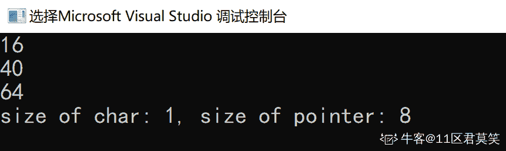
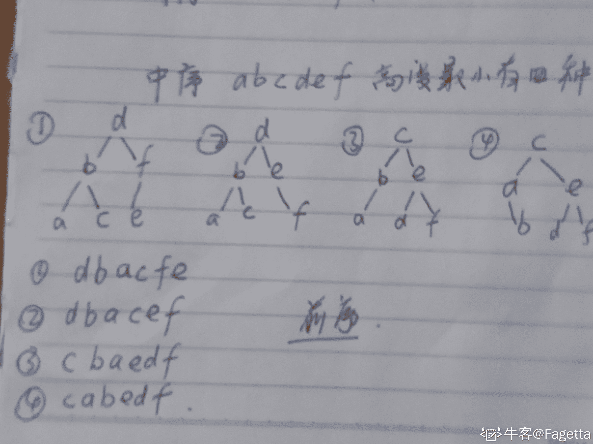
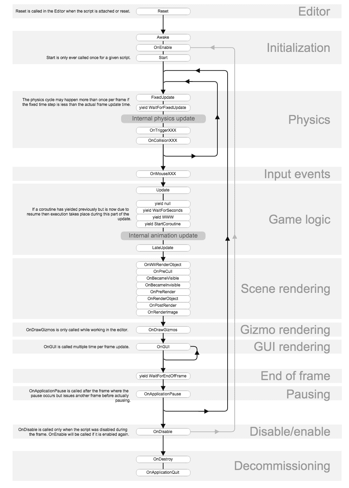

# 网易 2018 实习生招聘笔试题-Unity 开发实习生

## 1

数字图像颜色空间中，常被彩色显像管采用的是哪一种：

正确答案: A   你的答案: 空 (错误)

```cpp
RGB
```

```cpp
YUV
```

```cpp
HIS
```

```cpp
CMYK
```

本题知识点

网易 算法工程师 游戏研发工程师 2018

讨论

[小水 vv](https://www.nowcoder.com/profile/6119589)

[RGB 色彩模式](https://www.baidu.com/s?wd=RGB%E8%89%B2%E5%BD%A9%E6%A8%A1%E5%BC%8F&tn=SE_PcZhidaonwhc_ngpagmjz&rsv_dl=gh_pc_zhidao)是工业界的一种[颜色标准](https://www.baidu.com/s?wd=%E9%A2%9C%E8%89%B2%E6%A0%87%E5%87%86&tn=SE_PcZhidaonwhc_ngpagmjz&rsv_dl=gh_pc_zhidao)，是通过对红(R)、绿(G)、蓝(B)三个[颜色通道](https://www.baidu.com/s?wd=%E9%A2%9C%E8%89%B2%E9%80%9A%E9%81%93&tn=SE_PcZhidaonwhc_ngpagmjz&rsv_dl=gh_pc_zhidao)的变化以及它们相互之间的叠加来得到各式各样的颜色的，RGB 即是代表红、绿、蓝三个通道的颜色，这个标准几乎包括了人类视力所能感知的所有颜色，是目前运用最广的颜色系统之一。

发表于 2018-06-11 22:01:15

* * *

## 2

阅读 C++语言代码输出（）

```cpp
int main()
{
    int arr[]={1,2,3,4,5,6,7};
    int *p=arr;
    *(p++)+=89;
    printf("%d,%d\n",*p,*(++p));
    return 0;
}
```

正确答案: A   你的答案: 空 (错误)

```cpp
3 3
```

```cpp
2 2
```

```cpp
2 3
```

```cpp
3 2
```

本题知识点

网易 算法工程师 游戏研发工程师 网易 2018

讨论

[ya201905291109117](https://www.nowcoder.com/profile/621833535)

这题明显有问题啊，在 primer 里就讲到在同一条语句里执行 p 和 p++操作得到的是未定义的值，在我 MAC 上跑就是 2，3 在 window 下就是 3，3。讲道理没意义这题

发表于 2019-10-22 21:02:47

* * *

[DengJunYuan](https://www.nowcoder.com/profile/1149660)

参数的传递压栈顺序总是从右到左的，即对于函数

```cpp
void __stdcall swap(int& a,int& b) { int c = a;
  a = b;
  b = c;
}
```

其伪代码执行过程如下：

```cpp
push b; //先压入参数 b push a; //再压入参数 a call swap; //调用 swap 函数
```

故 printf("%d,%d\n",*p,*(++p)); 中，第四个参数*(++p)会被先执行，此时 p 已经指向了 3，然后执行第三个参数*p 的压栈过程时，p 已经指向了 3，故结果为 3，3 参考文章《压栈，跳转，执行，返回：从汇编看函数调用》2.3.1 ：[`www.jianshu.com/p/594357dff57e`](https://www.jianshu.com/p/594357dff57e)

发表于 2018-11-13 11:28:04

* * *

## 3

阅读 c++代码输出（）

```cpp
class base1{
    private: int a,b;
    public:
    base1 ( int i ) : b(i+1),a(b){}
    base1():b(0),a(b){}
    int get_a(){return a;}
    int get_b(){return b;}
};
int main()
{
    base1 obj1(11);
    cout<<obj1.get_a()<<endl<<obj1.get_b()<<endl;
    return 0;
}
```

正确答案: B   你的答案: 空 (错误)

```cpp
12 12
```

```cpp
随机数 12
```

```cpp
随机数 随机数
```

```cpp
12 随机数
```

本题知识点

网易 算法工程师 游戏研发工程师 网易 2018

讨论

[cbattle](https://www.nowcoder.com/profile/4947671)

初始化列表是按照成员被定义的顺序执行的。这里 a 比 b 先定义，所以 a 的初始化比 b 的先执行。

发表于 2019-04-26 17:07:14

* * *

[DengJunYuan](https://www.nowcoder.com/profile/1149660)

我猜和函数调用的参数一样，顺序是从后面到前面，即对于 base1 ( int  i ) : b(i+1),a(b){}先执行 a(b)，再执行 b(i+1)。执行 a(b)的时候 b 还未初始化故为随机数。

发表于 2018-11-13 11:35:14

* * *

## 4

64 位电脑 运行 c++结果输出（） 

```cpp
class A
{
    char a[2];
    public:
        virtual void aa(){};
};
class B:public virtual A
{
    char b[2];
    char a[2];
    public:
        virtual void bb(){};
        virtual void aa(){};
};
class C:public virtual B
{
    char a[2];
    char b[2];
    char c[2];
    public:
        virtual void cc(){};
        virtual void aa(){};
        virtual void bb(){};
};
int main()
{
    cout<<sizeof(A)<<endl<<sizeof(B)<<endl<<sizeof(C);
    return 0;
}
```

正确答案: C   你的答案: 空 (错误)

```cpp
8 16 24
```

```cpp
16 32 36
```

```cpp
16 32 48
```

```cpp
8 20 24
```

本题知识点

网易 算法工程师 游戏研发工程师 网易 2018

讨论

[小水 vv](https://www.nowcoder.com/profile/6119589)

类空间大小是成员中内存最大值的最小整数倍。虚函数会占用内存空间，这边 64 位系统，则占用 8Byte。sizeof(A) = 2+8=10，最大成员内存 8，则补齐至 16\.sizeof(B) = 4+8=12，补齐至 16，+sizeof(A)，total=32sizeof(C) = 6+8=14，补齐至 16，+sizeof(B)，total=48

发表于 2018-06-11 22:10:54

* * *

[11 区君莫笑](https://www.nowcoder.com/profile/601814415)

为什么我用 VS2017 在 64 位编译环境下的输出是这个样子的？

发表于 2020-02-28 10:04:47

* * *

## 5

以下代码在 64 位的机子上输出是什么：

```cpp
#include <stdio.h>
int getSize(int data[]){
    return sizeof(data);
}

int main(){
    int data1[] = {1,2,3,4,5};
    int size1 = sizeof(data1);

    int* data2 = data1;
    int size2 = sizeof(data2);

    int size3 = getSize(data1);

    printf("%d, %d, %d", size1, size2, size3);
    return 0;
}
```

正确答案: A   你的答案: 空 (错误)

```cpp
20, 8,  8
```

```cpp
4, 4, 4
```

```cpp
20, 4, 20
```

```cpp
20, 20, 20
```

本题知识点

网易 算法工程师 游戏研发工程师 2018 C++ C 语言

讨论

[TaylorVii](https://www.nowcoder.com/profile/1122033)

size1 的大小是数组中 int 成员总和大小  4 * 5 为 20

size2 的大小为指针大小

size3 因为函数传递 数组指针发生了退化，变成普通指针，没有原数组成员大小的信息了

发表于 2018-08-07 11:46:21

* * *

[babyoflxy](https://www.nowcoder.com/profile/450750311)

不管 32 位还是 64 位机子，int 都是 4 字节 指针在 32 位是 4 字节 64 位是 8 字节

发表于 2021-03-08 00:35:50

* * *

[赵高](https://www.nowcoder.com/profile/123710675)

为什么我电脑运行结果是 20，4，4

发表于 2019-09-16 10:40:06

* * *

## 6

运行下面的 c++代码, 关于 ptrX ptrY ptrZ 三个指针下面说法正确的是

```cpp
class BaseX
{
    public:
        virtual ~BaseX(){};
        virtual void FunctionX(){};
};
class ClassY: public BaseX
{
    public:
        virtual void FunctionY(){};
};
class FatherZ :public ClassY
{
    public:
};
int main()
{
    FatherZ aObject;
    BaseX* ptrX=&aObject;
    ClassY* ptrY=&aObject;
    FatherZ* ptrZ=&aObject;
    return 0;
}
```

正确答案: A   你的答案: 空 (错误)

```cpp
ptrX,ptrY,ptrZ 的取值相同.
```

```cpp
ptrZ=ptrX+ptrY
```

```cpp
ptrX 和 ptrY 不相同
```

```cpp
ptrZ 不等于 ptrX 也不等于 ptrY
```

本题知识点

网易 算法工程师 游戏研发工程师 网易 2018

讨论

[据说名字气得长会有小笨蛋跟着默读](https://www.nowcoder.com/profile/496401257)

实例化 Z 类后，该对象的大小仅仅是一个虚函数表指针的大小。那么该对象的地址就是虚函数表指针的首地址，它是不会变的。

发表于 2019-09-03 16:24:47

* * *

## 7

对于以下关键字{55，26，33，80，70，90，6，30，40，20}，增量取 5 的希尔排序的第一趟的结果是：

正确答案: B   你的答案: 空 (错误)

```cpp
55，33，30，6，80，70，40，20，26，90
```

```cpp
55，6，30，40，20，90，26，33，80，70
```

```cpp
55，6，33，30，40，70，20，26，80，90
```

```cpp
55， 26，6，40，30，90，33，70，80，20
```

本题知识点

网易 算法工程师 游戏研发工程师 网易 2018

讨论

[SouthBegonia](https://www.nowcoder.com/profile/5845064)

待排序列:{55，26，33，80，70，90，6，30，40，20}
按照步长为 5 分割为子序列:

```cpp
子序列 1：55             90
子序列 2：   26             6
子序列 3：      33             30
子序列 4：         80             40
子序列 5:             70             20
```

一趟排序后: {55，6，30，40，20，90，26，33，80，70}

```cpp
子序列 1：55             90
子序列 2：   6             26
子序列 3：      30             33
子序列 4：         40             80
子序列 5:             20             70
```

发表于 2019-09-23 20:01:18

* * *

## 8

假设某计算机系统中有 11 台打印机，有 K 个进程竞争使用，每个进程最多需要 4 台打印机。则要保证该系统不发生死锁的 k 的最大值：

正确答案: C   你的答案: 空 (错误)

```cpp
1
```

```cpp
2
```

```cpp
3
```

```cpp
4
```

本题知识点

网易 算法工程师 游戏研发工程师 网易 2018

讨论

[YY-帆 S](https://www.nowcoder.com/profile/1427645)

考查死锁的条件。
考虑最极端的情况，因为每个进程最多需要 4 台打印机，假设每个进程已经占有了 3 个打印机，那么只要还有多的打印机，总能满足达到 4 台的条件。将 11 台打印机分给 K 个进程，每个进程有 3 台打印机。

极端情况：不死锁需要 3K+1<11，最多支持 3 个进程并发。
发生死锁的最小值为 4。此时，四个进程由于都缺少 x 台打印机而不能继续执行，出现了死锁的状况。

发表于 2018-09-21 23:51:35

* * *

[木直 muzhi](https://www.nowcoder.com/profile/7036893)

如果一个进程有 m 个资源它就能够结束，不会使自己陷入死锁中。因此最差情况是每个进程有 m-1 个资源并且需要另外一个资源。如果留下有一个资源可用，那么其中某个进程就能够结束并释放它的所有资源．使其它进程也能够结束。所以避免死锁的条件是：3k+1<11

发表于 2019-02-27 20:03:28

* * *

[SCurry](https://www.nowcoder.com/profile/7573161)

不是 4 3 2 2 ，4 台么 ？ 怎么算的 3 台？ 

发表于 2018-06-14 15:30:28

* * *

## 9

以下哪种情况会使得进程由执行状态转变成阻塞状态

正确答案: D   你的答案: 空 (错误)

```cpp
时间片用完
```

```cpp
进程调度
```

```cpp
I/O 完成
```

```cpp
I/O 请求
```

本题知识点

网易 算法工程师 游戏研发工程师 网易 2018

讨论

[11 区君莫笑](https://www.nowcoder.com/profile/601814415)

A、时间片用完时，进程只缺 CPU，执行->就绪；B、进程调度是指动态地把 CPU 分配给就绪队列中的某一个进程，就绪->执行；C、I/O 完成时，需要在就绪队列中等待调度；D、请求 I/O 之后，进程只缺 I/O，执行->阻塞。

发表于 2020-02-28 16:05:30

* * *

## 10

下列关于 UDP 通信的说法错误的是（）

正确答案: C   你的答案: 空 (错误)

```cpp
发送数据之前不需要建立连接
```

```cpp
没有拥塞控制
```

```cpp
传输数据的时候对报文长度没有要求
```

```cpp
一般用在数据传输要求不高的场合
```

本题知识点

网易 算法工程师 游戏研发工程师 网易 2018

讨论

[矢量偏移](https://www.nowcoder.com/profile/544648561)

UDP 信息包含的标题很短，只有 8 个字节

发表于 2020-03-05 21:10:51

* * *

## 11

下面关于三次握手与 connect()函数的关系说法错误的是（）

正确答案: B   你的答案: 空 (错误)

```cpp
客户端发送 SYN 给服务器
```

```cpp
服务器只发送 SYN 给客户端
```

```cpp
客户端收到服务器回应后发送 ACK 给服务器
```

```cpp
connect()函数在三次握手的第二次返回
```

本题知识点

网易 算法工程师 游戏研发工程师 网易 2018

## 12

下面关于进程和线程说法错误的是（）

正确答案: B   你的答案: 空 (错误)

```cpp
进程是系统进行资源分配和调度的基本单位，而线程是 CPU 调度和分配的基本单位
```

```cpp
线程也拥有自己的系统资源
```

```cpp
一个线程可以创建和撤销另一个线程
```

```cpp
一个进程中的多个线程共享资源
```

本题知识点

网易 算法工程师 游戏研发工程师 网易 2018

## 13

下面关于线程同步说法错误的是（）

正确答案: D   你的答案: 空 (错误)

```cpp
用户模式和内核模式下同步方式不同
```

```cpp
对于临界区的访问适用于单进程中线程间的同步
```

```cpp
事件对象适用于多个进程间的各线程实现同步
```

```cpp
互斥对象也只适用于单进程中线程间的同步
```

本题知识点

网易 算法工程师 游戏研发工程师 网易 2018

## 14

下面关于死锁的说法错误的是（）

正确答案: D   你的答案: 空 (错误)

```cpp
死锁是指多个进程因抢占资源而发生的一种阻塞且相互等待的现象
```

```cpp
死锁的产生源于系统资源不足和进程推进顺序不当
```

```cpp
可以通过终止和撤销进程来解除死锁
```

```cpp
银行家算法用在预防死锁策略中
```

本题知识点

网易 算法工程师 游戏研发工程师 网易 2018

讨论

[JasperChu](https://www.nowcoder.com/profile/4543506)

“避免”和“预防”的区别能有多大？

发表于 2019-03-15 15:52:34

* * *

[艾草之绿](https://www.nowcoder.com/profile/408629130)

银行家算法用于死锁的避免策略中而不是预防

发表于 2019-08-17 14:33:28

* * *

## 15

用 1*3 的瓷砖密铺 3*20 的地板有几种方式？

正确答案: A   你的答案: 空 (错误)

```cpp
1278
```

```cpp
872
```

```cpp
595
```

```cpp
406
```

本题知识点

网易 算法工程师 游戏研发工程师 网易 2018

讨论

[Fagetta](https://www.nowcoder.com/profile/753784362)

主要考虑三个小 3*1 的绑一个大的 3*3 放不同于其它的方向，20/3=6，加上 0 个大的，一共 7 种大的绑定方法分别为:0 1 2 3 4 5 6，0 个时全部方向一致，一种；1 个时相当于 18 个空里面随机一个大的 C（18 1），2 个时 C（16 2），三个时 C（14 3）以此类推应该有 1+C（18 1）+C（16 2）+C（14 3）+C（12 4）+C（10 5）+C（8 6）=1278

发表于 2019-10-06 11:16:15

* * *

[wq2020](https://www.nowcoder.com/profile/3846221)

是个递归情况 f(n)=f(n-1)+f(n-3)

发表于 2020-03-27 21:47:45

* * *

## 16

一个完全二叉树节点数为 200，则其叶子结点个数为？

正确答案: C   你的答案: 空 (错误)

```cpp
98
```

```cpp
99
```

```cpp
100
```

```cpp
101
```

本题知识点

网易 算法工程师 游戏研发工程师 网易 2018

讨论

[5 年内不买房不改名](https://www.nowcoder.com/profile/186048504)

该树 200 个节点，199 个度 最大层为 7 层 第 6 层一共 128 个节点 199-128=71 而且第 6 层剩下的节点也是叶子节点 所以 2 的 6 次方 - 71/2 =29 二者想加 71+29=100

发表于 2019-06-20 23:48:54

* * *

## 17

字符串 zmnzizi 用哈夫曼编码来编码，则共有多少位？

正确答案: B   你的答案: 空 (错误)

```cpp
14
```

```cpp
13
```

```cpp
12
```

```cpp
11
```

本题知识点

网易 算法工程师 游戏研发工程师 网易 2018

讨论

[SouthBegonia](https://www.nowcoder.com/profile/5845064)

Z：0i：10m：110n：1110 110 111 0 10 0 10

发表于 2019-11-03 10:03:47

* * *

[艾草之绿](https://www.nowcoder.com/profile/408629130)

哈夫曼编码原理 https://blog.csdn.net/qq_37959401/article/details/82626724

发表于 2019-08-17 15:21:26

* * *

## 18

已知中序遍历的序列为 abcdef，高度最小的不可能的二叉树的前序遍历是

正确答案: D   你的答案: 空 (错误)

```cpp
dbacfe
```

```cpp
dbacef
```

```cpp
cbaedf
```

```cpp
cabefd
```

本题知识点

网易 算法工程师 游戏研发工程师 网易 2018

讨论

[Fagetta](https://www.nowcoder.com/profile/753784362)

D:cabedf

发表于 2019-10-06 11:36:05

* * *

## 19

对于线性表（ 13,25,22,35,54,57,63）进行散列存储时，若选用 H （ K ） =K %7 作为散列函数，则散列地址为 1 的元素有（ ）个？

正确答案: C   你的答案: 空 (错误)

```cpp
0
```

```cpp
1
```

```cpp
2
```

```cpp
3
```

本题知识点

网易 算法工程师 游戏研发工程师 网易 2018

## 20

基于哈希算法在信息安全中主要应用在？(1)    文件校验(2)    数字签名(3)    鉴权协议

正确答案: D   你的答案: 空 (错误)

```cpp
(1)(2)
```

```cpp
(1)(3)
```

```cpp
(2)(3)
```

```cpp
(1)(2)(3)
```

本题知识点

网易 算法工程师 游戏研发工程师 网易 2018

## 21

小 Q 得到一个神奇的数列: 1, 12, 123,...12345678910,1234567891011...。

并且小 Q 对于能否被 3 整除这个性质很感兴趣。

小 Q 现在希望你能帮他计算一下从数列的第 l 个到第 r 个(包含端点)有多少个数可以被 3 整除。

本题知识点

网易 算法工程师 数学 游戏研发工程师 2018

讨论

[tt3t](https://www.nowcoder.com/profile/388831)

根据序列找规律发现是否能被 3 整除的结果为：不能，能，能，不能，能，能。。。可知，项的索引 % 3 的余数为 0 和 2 时即可被整除

```cpp
#include<iostream>
using namespace std;

int main()
{
	int left = 0, right = 0, count = 0;
	cin >> left >> right;

    for(int i = left; i <= right; i++)
    {
        if(i % 3 == 0)
            count++;
        else if(i % 3 == 2)
            count ++;
    }

	cout << count << endl;
	return 0;
}
```

发表于 2020-02-13 12:46:02

* * *

[道可道非常道嘤](https://www.nowcoder.com/profile/646612786)

3 的倍数有个特点就是各个位数相加的和仍为 3 的倍数

```cpp
#include<stdio.h>
#include<iostream>
 using namespace std;
int main(){
    long start,end;
    long count=0;
    cin>>start>>end;
    for(long i=start;i<=end;i++){
        if((i*(i+1)/2)%3==0){
            count++;
        }
    }
    cout<<count;
    return 0;
}

```

发表于 2019-09-06 17:03:34

* * *

[MonoKelvin](https://www.nowcoder.com/profile/946777261)

```cpp
#include <iostream>
using namespace std;

int main()
{
    int l,r;
    int count = 0;
    while (cin >> l>> r) {
        count = (r / 3 - l / 3) * 2;
        if (l % 3 == 0) {
            count++;
        }
        if (r % 3 == 2) {
            count++;
        }
        cout << count;
    }
    return 0;
}
```

编辑于 2019-09-27 17:07:00

* * *

## 22

牛牛以前在老师那里得到了一个正整数数对(x, y), 牛牛忘记他们具体是多少了。

但是牛牛记得老师告诉过他 x 和 y 均不大于 n, 并且 x 除以 y 的余数大于等于 k。

牛牛希望你能帮他计算一共有多少个可能的数对。

本题知识点

网易 算法工程师 数学 游戏研发工程师 2018

讨论

[牛客 745599318 号](https://www.nowcoder.com/profile/745599318)

```cpp
n,k = map(int, input().split(' '))
if k == 0:
    print(n*n)
else:
    ans = 0
    for j in range(k+1,n+1):
        repeat = (n-j+1) // j
        ans += repeat * (j-k)
        diff = (n-j+1) % j
        ans += 0 if diff <= k else diff - k
        ans += j - k
    print(ans)
```

发表于 2020-07-23 17:22:08

* * *

[家君 9786](https://www.nowcoder.com/profile/242141474)

#include <iostream>using namespace std;

void find_xy()
{
    long y, n, k;
    long count = 0;

    cin >> n >> k;

    if (k != 0)
    {
        // 1.1 当 x<y 时，对于 y，有对应的(y-k)个 x，则共有 K + (k+1) + (k+2) + ... + (n) - (n+1) * k，即 1 + 2 + .. + n-k
        if (n > k)
            count += (n - k) * (n - k + 1) * 0.5;

        // 1.2 当 x>y 时，x=(iy+j)，只有 y>k 时才合理，并且这时对应的每个 x 为：1*y+k, 1*y+k+1, ..., 1*y+2*y-1, 2*y+k, ... , 2*y+3*y-1, ...
        //        对于每个 iy，有 y-k 个
        //        对于最后一个 iy，有 1+2+...n-iy 个
        for (y = k + 1; y <= n; y++)
        {
            long temp = y - k;

            long iy = 2 * y, i = 2;
            for (; iy <= n; iy = (++i) * y)
            {
                count += temp;
            }

            //加上最后一个不满的 iy
            long lastiy = (i - 1) * y;
            if (n + 1 >= lastiy + k)
                count += n + 1 - (lastiy + k);
        }
    }
    // 2\. k == 0 时，任何(x,y)都符合
    else
    {
        count = n * n;
    }

    cout << count << endl;
}

int main()
{
    find_xy();
}

发表于 2020-07-23 12:39:06

* * *

## 23

牛牛总是睡过头，所以他定了很多闹钟，只有在闹钟响的时候他才会醒过来并且决定起不起床。从他起床算起他需要 X 分钟到达教室，上课时间为当天的 A 时 B 分，请问他最晚可以什么时间起床

本题知识点

网易 算法工程师 游戏研发工程师 2018

讨论

[AAA 光](https://www.nowcoder.com/profile/2918411)

```cpp
using System;
public class Program{
    static void Main(){
        int line=int.Parse(Console.ReadLine().Trim());
        if(line==0){
            Console.WriteLine("0");
            return;
        }
        int[] intAlarms=new int[line];
        for(int i=0;i<line;i++){
            string[] temp=Console.ReadLine().Trim().Split(' ');
            intAlarms[i]=int.Parse(temp[0])*60+int.Parse(temp[1]);
        }
        int time=int.Parse(Console.ReadLine().Trim());
        string[] classTime=Console.ReadLine().Trim().Split(' ');
        int finalTime=int.Parse(classTime[0])*60+int.Parse(classTime[1])-time;
        int max=0;
        for(int i=line-1;i>=0;i--){
            if(intAlarms[i]<=finalTime){
                max=intAlarms[i]>max?intAlarms[i]:max;
            }
        }
        Console.WriteLine(max/60+" "+max%60);
    }
}
```

发表于 2020-05-25 10:36:40

* * *

[SaebaHWT](https://www.nowcoder.com/profile/457810810)

```cpp
#include<stdio.h>

int main(int argc, char const *argv[])
{
    int clocks, tempH, tempM, tempRes1, tempRes2, res;
    scanf("%d", &clocks);
    int clock[100] = {0};
    for (int i = 0; i < clocks; i++) {
        scanf("%d%d", &tempH, &tempM);
        clock[i] = tempH * 60 + tempM;
    }
    int cost;
    scanf("%d", &cost);
    scanf("%d%d", &tempH, &tempM);
    int school = tempH * 60 + tempM - cost;
    int latest = 0;
    for (int i = 0; i < clocks; i++) {
        if (school >= clock[i]) {
            if (clock[i] > latest) {
                latest = clock[i];
            }
        }
    }
    printf("%d %d", latest/60, latest % 60);
    return 0;
}
```

发表于 2020-03-25 16:02:27

* * *

[曾思哲](https://www.nowcoder.com/profile/380518016)

usingSystem;classTest{    staticvoidMain(string[] args)    {        intcount =int.Parse(Console.ReadLine());        int[] a =newint[count * 2 + 1];        for(inti = 0; i < count; i++)        {            strings = Console.ReadLine();            a[2 * i] =int.Parse(s.Split(' ')[0]);            a[2 * i + 1] =int.Parse(s.Split(' ')[1]);        }        intneedTime =int.Parse(Console.ReadLine());        stringss = Console.ReadLine();        intclass1 =int.Parse(ss.Split(' ')[0]);        intclass2 =int.Parse(ss.Split(' ')[1]);        Test t =newTest();        t.Do(count, a, needTime, class1, class2);    }    voidDo(intcount,int[] a,intneedTime,intclass1,intclass2)    {        inth = 0;        intm = 0;        for(inti = 0; i < count; i++)        {            if(class1 >= a[2 * i])            {                intmm = a[2 * i + 1] + needTime;                inthh = a[2 * i] + mm / 60;                mm = mm % 60;                if((hh<class1)||(hh==class1 &&mm<=class2))                {                    if(a[2 * i] > h)                    {                        h = a[2 * i];                        m = a[2 * i + 1];                    }                    elseif((a[2 * i] == h) && (m <= a[2 * i + 1]))                    {                        h = a[2 * i];                        m = a[2 * i + 1];                    }                }            }        }        Console.Write($"{h} {m}");    }}

发表于 2020-02-21 21:27:23

* * *

## 24

请对下列 Unity 事件的执行顺序排序，并说明每个事件的作用。

   - OnGUI()

   - OnDestroy()

   - Update()

   - LateUpdate()

   - OnApplicationQuit()

   - OnDisable()

   - Awake()

   - Start()

   - OnEnable()

   - FixedUpdate()

你的答案

本题知识点

网易 算法工程师 游戏研发工程师 2018

讨论

[橘子烤被炉](https://www.nowcoder.com/profile/142517319)

附上官方文档的生命周期图：Awake：对象被激活时调用，只调用一次，初始化组件->OnEable：脚本由非激活状态变成激活状态时调用，常用来处理激活后的逻辑->Start：脚本被激活时调用，只调用一次，可以用来初始化依赖组件的变量->FixedUpdate：每帧可能调用多次，常用来处理与运动有关（不依赖帧率）的逻辑->Update：每帧调用一次，处理一般逻辑->LaterUpdate：每帧一次，常用来处理依赖 update 的逻辑（所以在 update 后执行）->OnGUI：每帧多次，处理 GUI 事件->OnDisable：与 OnEable 对应，激活转为非激活时调用，处理非激活的逻辑->OnDestroy：对象销毁时调用，处理垃圾->OnApplicationQuit：程序退出时调用感觉作用并不是固定的，靠平时的用法大致是这样吧

发表于 2018-12-12 22:17:50

* * *

[白白的小小白哦](https://www.nowcoder.com/profile/3764514)

Awake()->OnEnable()->Start()->FixUpdate()->Update()->LateUpdate()->OnGUI()->OnDisable()->OnDestroy()->OnApplicartionQuit();作用分别为：在 MonoBehavior 创建后的第一时间调用，只执行一次在游戏对象被启用的时候调用用于时间间隔相同的逻辑处理 每帧调用一次（物理操作，物理计算）用于游戏基本的逻辑处理 每帧调用一次用于游戏的渲染或相机操作的处理 每帧调用一次，在 Update 执行在每帧更新是调用多次，多用于绘制界面，现在更多的被 U/NGUI 禁用游戏物体时执行当销毁游戏物体时执行，只执行一次当应用程序退出时执行

发表于 2018-07-27 19:40:20

* * *

## 25

假如某个 Unity 射击游戏中需要用到大量的子弹，请你设计一个子弹管理类 BulletPool，该类的主要功能是：

- 提供一个 public GameObject GetBullet ()方法，为调用者返回一个子弹实例

- 提供一个 public void ResetBullet (GameObject bullet)方法，回收一个子弹实例

请简述设计该类的思路，并写出 BulletPool 的关键代码。

你的答案

本题知识点

网易 算法工程师 游戏研发工程师 2018

讨论

[YE_wolf](https://www.nowcoder.com/profile/737599)

```cpp
using UnityEngine;
using System.Collections.Generic;

public class BulletPool
{
    private static BulletPool _instance = new BulletPool();

    public static BulletPool Instance
    {
        get {
            if (_instance == null)
            {
                _instance = new BulletPool();
            }
            return _instance;
        }
    }

    Queue<GameObject> pool = new Queue<GameObject>();
    GameObject PoolRoot;

    public GameObject GetBullet()
    {
        GameObject result =null;

        if (pool.Count == 0)
        {
            GameObject prefab = Resources.Load<GameObject>("Prefabs/Bullet");

            if (prefab != null)
            {
                result = GameObject.Instantiate(prefab);
                result.SetActive(false);//false
                pool.Enqueue(result);
            }
            else
            {
                Debug.LogError("load >Prefabs/Bullet< failed!");
            }
        }
        else
        {
            result = pool.Dequeue();
        }

        //激活
        result.SetActive(true);
        return result;
    }

    public void ResetBullet(GameObject bullet)
    {
        bullet.SetActive(false);
        PoolRoot = GameObject.Find("PoolRoot");
        if (PoolRoot == null)
        {
            PoolRoot = new GameObject("PoolRoot");
        }
        bullet.transform.SetParent(PoolRoot.transform);
        pool.Enqueue(bullet);
    }
}

```

发表于 2018-08-15 10:44:00

* * *

[人生有三乐](https://www.nowcoder.com/profile/423022776)

1.为子弹管理类 BulletPool 定义一个子弹的预制体 bulletPrefab，作为生成子弹实例时的预制体 2. 在 GetBullet ()方法中使用 Instantiate 生成一个子弹实例 3.ResetBullet (GameObject bullet)方法中调用 Destroy（）方法销毁子弹实例来达到回收子弹的目的 ```cpp
using UnityEngine;

public class BulletPool:Monobehavior{
    public GameObject bulletPrefab;

    public GameObject GetBullet(){
        return Instantiate(bulletPrefab);
    }

    public void ResetBullet(GameObject bullet){
        Destroy(bullet);
    }
}
``` 

发表于 2019-09-08 17:49:11

* * *</iostream>