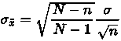

# 网易 2018 实习生招聘笔试题-NLP 算法实习生

## 1

某地区每个人的年收入是右偏的，均值为 5000 元，标准差为 1200 元。随机抽取 900 人并记录他们的年收入，则样本均值的分布为()

正确答案: A   你的答案: 空 (错误)

```cpp
近似正态分布，均值为 5000 元，标准差为 40 元
```

```cpp
近似正态分布，均值为 5000 元，标准差为 1200 元
```

```cpp
右偏分布，均值为 5000，标准差为 40
```

```cpp
左偏分布，均值为 5000 元，标准差为 1200 元
```

本题知识点

网易 算法工程师 算法工程师 网易 2018

讨论

[wafer](https://www.nowcoder.com/profile/3870576)

，为标准差，n 为人数
当 900 人和某地区人数相比差距很大时可以默认前一项的值为 1，于是 1200/sqrt(900) = 1200 / 30 = 40

发表于 2018-07-02 09:37:41

* * *

## 2

函数 y=x^x,(x＞0)的极小值点是 ______

正确答案: D   你的答案: 空 (错误)

```cpp
1
```

```cpp
√2
```

```cpp
(√2)^(√2)
```

```cpp
(1/e)^(1/e)
```

本题知识点

网易 算法工程师 算法工程师 网易 2018

讨论

[牛客 6553333 号](https://www.nowcoder.com/profile/6553333)

令    
解得：由于 ln 函数是递增函数，因此所以：


发表于 2018-08-08 09:38:41

* * *

[Will213](https://www.nowcoder.com/profile/6476053)

等式两边取 ln，求导得 0 即得极小值点。

发表于 2018-08-08 08:43:29

* * *

## 3

随机变量 X 和 Y 的 Pearson 相关系数ρ取得最大值的充要条件是 ______

正确答案: C   你的答案: 空 (错误)

```cpp
X 和 Y 独立
```

```cpp
X 和 Y 不相关
```

```cpp
X 和 Y 正相关
```

```cpp
X 等于 Y
```

本题知识点

网易 算法工程师 2018

讨论

[__bert](https://www.nowcoder.com/profile/2472421)

1\. 充要条件 排除 d2. 相关系数的绝对值越大，相关性越强：相关系数越接近于 1 或-1，[相关度](https://baike.baidu.com/item/%E7%9B%B8%E5%85%B3%E5%BA%A6)越强，相关系数越接近于 0，相关度越弱。通常情况下通过以下[取值范围](https://baike.baidu.com/item/%E5%8F%96%E5%80%BC%E8%8C%83%E5%9B%B4)判断变量的相关强度：相关系数 0.8-1.0 极强相关 0.6-0.8 强相关 0.4-0.6 中等程度相关 0.2-0.4 弱相关 0.0-0.2 极弱相关或无相关

发表于 2018-07-04 13:08:54

* * *

## 4

命题 A：随机变量 X 和 Y 独立，命题 B：随机变量 X 和 Y 不相关。A 是 B 的 ______ 条件。

正确答案: A   你的答案: 空 (错误)

```cpp
充分不必要
```

```cpp
必要不充分
```

```cpp
不充分不必要
```

```cpp
充要
```

本题知识点

网易 算法工程师 算法工程师 网易 2018

讨论

[乔戈里峰](https://www.nowcoder.com/profile/624205030)

独立一定不相关，不相关不一定独立，不相关就是两者没有线性关系，不代表没有其他关系。

发表于 2019-08-03 10:35:54

* * *

## 5

关于矩阵的广义逆，下列表述不正确的是 ________

正确答案: D   你的答案: 空 (错误)

```cpp
若矩阵 A 的广义逆为 B，则 A*B*A=A，B*A*B=B
```

```cpp
若矩阵 A 的广义逆为 B，则 A*B 和 B*A 都是对称阵。
```

```cpp
矩阵 A 一定存在确定唯一的广义逆。
```

```cpp
矩阵 A 可能不存在广义逆。
```

本题知识点

网易 算法工程师 算法工程师 网易 2018

讨论

[徐国海](https://www.nowcoder.com/profile/9960541)

矩阵的广义逆存在且唯一

发表于 2018-07-30 17:07:26

* * *

## 6

关于梯度方向，下列说法正确的是 ______

正确答案: A   你的答案: 空 (错误)

```cpp
给定某定点，沿着梯度方向函数值增加最快
```

```cpp
给定某定点，沿着梯度方向函数值减少最快
```

```cpp
任何函数的定点一定存在梯度方向
```

```cpp
如果函数不是凸函数，则一定存在至少一个点不存在梯度方向
```

本题知识点

网易 算法工程师 算法工程师 网易 2018

讨论

[Eleanor_zz](https://www.nowcoder.com/profile/7041474)

沿梯度反方向减少最快

发表于 2019-06-25 08:09:56

* * *

[bigVV](https://www.nowcoder.com/profile/463686057)

这题答案不对吧

发表于 2019-06-03 10:17:37

* * *

## 7

假定树根的高度为 0，则高度为 6 的二叉树最多有 _______ 个叶节点。

正确答案: B   你的答案: 空 (错误)

```cpp
32
```

```cpp
64
```

```cpp
128
```

```cpp
256
```

本题知识点

网易 算法工程师 算法工程师 网易 2018

讨论

[sunyongliang](https://www.nowcoder.com/profile/2382181)

叶子结点 2⁶ 全部是 2⁷

发表于 2018-06-14 19:35:06

* * *

## 8

下列哪种不是使用随机森林计算特征重要度的方法 ______

正确答案: D   你的答案: 空 (错误)

```cpp
selection frequency
```

```cpp
gini importance
```

```cpp
permutation importance
```

```cpp
gauss mixture model
```

本题知识点

网易 算法工程师 2018

讨论

[给我一个 offer 叭！！！](https://www.nowcoder.com/profile/1409891)

基尼指数袋外数据高斯混合模型 A 是什么呢

发表于 2020-04-05 17:39:21

* * *

## 9

对于给定 1000 个训练样本的二分类问题，关于支持向量机的说法，正确的有 _____

正确答案: A   你的答案: 空 (错误)

```cpp
需要构造 1000 个辅助变量，计算它们的非零值对应着支撑向量。
```

```cpp
如果使用高斯核函数，不需要构造 1000 个辅助变量，只需要 100 个。
```

```cpp
如果使用多项式核函数，不需要构造 1000 个辅助变量，只需要 100 个。
```

```cpp
在当前普通计算机上需要约 1 小时才能得到训练模型。
```

本题知识点

网易 算法工程师 2018

讨论

[deepthinkliu](https://www.nowcoder.com/profile/1961208)

辅助变量的个数与核函数的类型无关

发表于 2018-08-04 20:43:44

* * *

[hi 杨宗](https://www.nowcoder.com/profile/710173604)

此处辅助变量即拉格朗日乘子，由于有 1000 个样本，即有 1000 个约束条件，则有 1000 个辅助变量。SVM 的划分超平面只由支持向量决定，要求 alpha 不等零。

发表于 2018-08-31 20:17:29

* * *

## 10

下列哪种不是支持向量机的分类类别 _____

正确答案: D   你的答案: 空 (错误)

```cpp
线性可分支持向量机
```

```cpp
线性支持向量机
```

```cpp
非线性支持向量机
```

```cpp
高阶支持向量机
```

本题知识点

网易 算法工程师 2018

## 11

下列关于闵可夫斯基(Minkowski)距离的描述，正确的是 ____

正确答案: A   你的答案: 空 (错误)

```cpp
p=2 的闵可夫斯基距离就是经典的欧式距离
```

```cpp
p=1 的闵可夫斯基距离即切比雪夫距离
```

```cpp
p=+∞的闵可夫斯基距离即街区距离、曼哈顿距离
```

```cpp
实践中往往选择 p=1
```

本题知识点

网易 算法工程师 2018

讨论

[阿岳 y](https://www.nowcoder.com/profile/5254813)

p=1,曼哈顿距离/街区距离 p=2,欧式距离 p->+,切比雪夫距离

发表于 2018-07-21 22:30:40

* * *

## 12

为了找到自己满意的工作，牛牛收集了每种工作的难度和报酬。牛牛选工作的标准是在难度不超过自身能力值的情况下，牛牛选择报酬最高的工作。在牛牛选定了自己的工作后，牛牛的小伙伴们来找牛牛帮忙选工作，牛牛依然使用自己的标准来帮助小伙伴们。牛牛的小伙伴太多了，于是他只好把这个任务交给了你。

本题知识点

网易 算法工程师 排序 *模拟 贪心 2018* *讨论

[201806100058262](https://www.nowcoder.com/profile/807440362)

```cpp
为什么自己的编译器都可以通过，牛客网却不行，还有我用的 python3.6 会不会是版本问题
```

发表于 2018-08-01 11:19:51

* * *

[꧁꫞꯭꯭꯭̨̞̞̘̻̬̞C꫞꧂](https://www.nowcoder.com/profile/8596787)

测试用例内含空白行

发表于 2018-08-11 13:39:06

* * *

## 13

已知有 4 个矩阵分别大小为 M1(5*3) M2(3*4) M3(4*2) M4(2*7) 下面组合计算所需要的乘法次数最优的为？

正确答案: D   你的答案: 空 (错误)

```cpp
(M1(M2(M3M4)))
```

```cpp
(M1((M2M3)M4))
```

```cpp
((M1M2)(M3M4))
```

```cpp
((M1(M2M3))M4)
```

```cpp
(((M1M2)M3)M4)
```

本题知识点

网易 算法工程师 算法工程师 网易 2018

讨论

[201906201759268](https://www.nowcoder.com/profile/141506099)

矩阵 M_{n*k}和矩阵 S_{k*v}相乘，乘法次数为 n * v * k。贪心的进行选择

发表于 2019-08-02 19:23:06

* * *

## 14

有 20 个人去看电影，电影票 50 元。其中只有 10 个人有 50 元钱，另外 10 个人都只有一张面值 100 元的纸币，电影院没有其他钞票可以找零，问有多少种找零的方法？

正确答案: A   你的答案: 空 (错误)

```cpp
16796
```

```cpp
16798
```

```cpp
16794
```

```cpp
16792
```

本题知识点

网易 算法工程师 算法工程师 网易 2018

讨论

[孤独相望](https://www.nowcoder.com/profile/1736221)

[`blog.csdn.net/dddxxy/article/details/100159789`](https://blog.csdn.net/dddxxy/article/details/100159789)

卡特兰数：
1—>1
2—>2
3—>5
4—>14
5—>42
6—>132
7—>429
8—>1430
9—>4862
10—>16796

公式:C(n,2n)/(n+1)=C(10,20)/11=16796

发表于 2020-04-03 20:48:47

* * *

## 15

已知中序遍历的序列为 abcdef，高度最小的不可能的二叉树的前序遍历是

正确答案: D   你的答案: 空 (错误)

```cpp
dbacfe
```

```cpp
dbacef
```

```cpp
cbaedf
```

```cpp
cabefd
```

本题知识点

网易 算法工程师 算法工程师 网易 2018

讨论

[阿刷不过](https://www.nowcoder.com/profile/675116827)

高度最小为 3 中序遍历为左根右 前序遍历为根左右

发表于 2021-10-23 20:49:16

* * *

## 16

以下算法中未用到贪心算法思想的是？

正确答案: D   你的答案: 空 (错误)

```cpp
迪杰斯特拉(Dijkstra)
```

```cpp
库鲁斯卡尔(Kruskal)
```

```cpp
普里姆算法(Prim)
```

```cpp
KMP
```

本题知识点

网易 算法工程师 算法工程师 网易 2018

讨论

[꧁꫞꯭꯭꯭̨̞̞̘̻̬̞C꫞꧂](https://www.nowcoder.com/profile/8596787)

KMP 算法的关键是利用匹配失败后的信息，尽量减少模式串与主串的匹配次数以达到快速匹配的目的。

发表于 2018-08-11 13:40:52

* * *

[乔戈里峰](https://www.nowcoder.com/profile/624205030)

KMP 用到的思想是回溯和动态规划

发表于 2019-08-03 10:44:12

* * *

## 17

对于线性表（ 13,25,22,35,54,57,63）进行散列存储时，若选用 H （ K ） =K %7 作为散列函数，则散列地址为 1 的元素有（ ）个？

正确答案: C   你的答案: 空 (错误)

```cpp
0
```

```cpp
1
```

```cpp
2
```

```cpp
3
```

本题知识点

网易 算法工程师 算法工程师 网易 2018

## 18

基于哈希算法在信息安全中主要应用在？(1)    文件校验(2)    数字签名(3)    鉴权协议

正确答案: D   你的答案: 空 (错误)

```cpp
(1)(2)
```

```cpp
(1)(3)
```

```cpp
(2)(3)
```

```cpp
(1)(2)(3)
```

本题知识点

网易 算法工程师 2018

## 19

下列选项中，不可能是快速排序第 2 趟排序结果的是 （）

正确答案: C   你的答案: 空 (错误)

```cpp
4 14 10 12 8 6 18
```

```cpp
4 6 10 8 12 14 18
```

```cpp
6 4 10 8 14 12 18
```

```cpp
8 4 6 10 12 14 18
```

本题知识点

网易 算法工程师 算法工程师 网易 2018

讨论

[旋转木驴](https://www.nowcoder.com/profile/7596327)

快速排序的特点，每 n 趟排序后至少有 n 个元素已经在其正确的位置上

发表于 2018-06-02 21:22:39

* * *

[请叫我小吴](https://www.nowcoder.com/profile/693269216)

四个选项都是同样的数组元素，若完全有序，应为 4 6 8 10 12 14 18 每经过一趟快排，轴点元素都必然就位，也就是说，一趟下来至少有 1 个元素在其最终位置，那么第二趟至少应有 2 个元素就位。所以考察各个选项，看有几个元素就位即可。A：4   18
B：4    6   12  14  18
C：18
D：10  12  14 18
第二趟至少应有 2 个元素就位，所以 C 不对。

发表于 2020-05-06 15:52:52

* * *

[稳住我们能赢 2333](https://www.nowcoder.com/profile/693313142)

参考前面的解析快速排序的特点，每 n 趟排序后至少有 n 个元素已经在其正确的位置上其他选项第一趟被选择的元素是 12，第 2 趟时 12 的左边都比 12 小，右边都比 12 大。

发表于 2019-03-31 18:47:17

* * *

## 20

小 Q 正在给一条长度为 n 的道路设计路灯安置方案。

为了让问题更简单,小 Q 把道路视为 n 个方格,需要照亮的地方用'.'表示, 不需要照亮的障碍物格子用'X'表示。

小 Q 现在要在道路上设置一些路灯, 对于安置在 pos 位置的路灯, 这盏路灯可以照亮 pos - 1, pos, pos + 1 这三个位置。

小 Q 希望能安置尽量少的路灯照亮所有'.'区域, 希望你能帮他计算一下最少需要多少盏路灯。

本题知识点

网易 算法工程师 数组 模拟 字符串 *贪心 2018* *讨论

[零葬](https://www.nowcoder.com/profile/75718849)

贪心

从左往右遍历，遇到"X"就跳过一个格子，遇到"."就安装灯，由于一个灯可以管三个位置的照明，所以安装完灯之后往后跳 3 格（灯安装在下一个位置，坑点：“X”上可以安装灯）。宗旨就是不走回头路，每来到一个位置，说明该位置之前的所有该照亮的地方已经照亮了。

```cpp
import java.io.*;
import java.util.*;

public class Main {
    public static void main(String[] args) throws IOException {
        BufferedReader br = new BufferedReader(new InputStreamReader(System.in));
        int t = Integer.parseInt(br.readLine());
        while(t-- > 0){
            int n = Integer.parseInt(br.readLine());
            char[] road = br.readLine().toCharArray();
            int count = 0;
            for(int i = 0; i < n; ){
                if(road[i] == 'X'){
                    i++;
                }else{
                    if(i < n - 1){
                        count++;
                        i += 3;
                    }else{
                        if(road[i] == '.'){
                            count++;
                        }
                        i++;
                    }
                }
            }
            System.out.println(count);
        }
    }
}
```

发表于 2022-03-18 12:20:02

* * *

[牛客 777503987 号](https://www.nowcoder.com/profile/777503987)

import mathinstance_num = int(input())for _ in range(instance_num):    length = int(input())    instance = (input()).strip()
    charlist = instance.split('X')    ans = sum([math.ceil(len(x)/3) for x in charlist])
    print(min((math.ceil(length/3),ans)))

发表于 2020-04-01 16:42:21

* * *

[牛客 7760634 号](https://www.nowcoder.com/profile/7760634)

java:

```cpp
    public static void main(String[] args){
        // 只用关注不能被整除的地方
        //剩下一个可以和下下个需要照亮的地方共用一个 因为不论如何这个灯泡都要拿出来
        // 如果剩下超过两个就不存在公用的情况 这个灯泡必然要先加上 再处理后面的
        Scanner in = new Scanner(System.in);
        while(in.hasNext()){
            int n = in.nextInt();
            int m;
            for (int i = 0; i < n; i++) {
                m = in.nextInt();
                int continue_black = 0;
                String road = in.next();
                int bulbs = 0;
                for (int j = 0; j < m; j++) {
                    if(road.charAt(j) == '.' || continue_black % 3 == 1){  //  给 X 一次纳入考虑机会
                        continue_black ++;
                    }else{
                        bulbs += continue_black / 3;
                        if(continue_black % 3 != 0){
                            bulbs ++;
                        }
                        continue_black = 0;
                    }
                }
                bulbs += continue_black / 3;
                if(continue_black % 3 != 0) {
                    bulbs++;
                }
                System.out.println(bulbs);
            }
        }
    }
```

python：

```cpp
    while True:
        n = int(input().strip())  # 测试用例
        for i in range(n):
            road_len = int(input().strip())
            road_signal = input().strip()
            light_count = 0
            black_continue_count = 0
            for j in range(road_len):
                if road_signal[j] == "." or black_continue_count % 3 == 1:  # 给 X 一次纳入考虑的机会
                    black_continue_count += 1
                else:
                    light_count += black_continue_count // 3
                    light_count += 0 if black_continue_count % 3 == 0 else 1
                    black_continue_count = 0
            light_count += black_continue_count // 3
            light_count += 0 if black_continue_count % 3 == 0 else 1
            print(light_count)
```

发表于 2019-08-08 18:04:48

* * *

## 21

平面内有 n 个矩形, 第 i 个矩形的左下角坐标为(x1[i], y1[i]), 右上角坐标为(x2[i], y2[i])。

如果两个或者多个矩形有公共区域则认为它们是相互重叠的(不考虑边界和角落)。

请你计算出平面内重叠矩形数量最多的地方,有多少个矩形相互重叠。

本题知识点

网易 算法工程师 高级结构 数学 穷举 2018

## 22

NLP 技术在许多应用常见中都有广泛的应用，请拿一个你熟悉的应用场景为例：

（1） 简略描述一下这个场景技术所解决问题（100 字左右）（10 分）

（2）画出这个应用场景下解决问题的系统流程。（10 分）

（3） 选择系统中一个技术模块，详细描述。（要求包括 目前所用方法，选择该方法的原因，存在的问题和可能解决方案）（20 分）

你的答案

本题知识点

网易 算法工程师 2018**