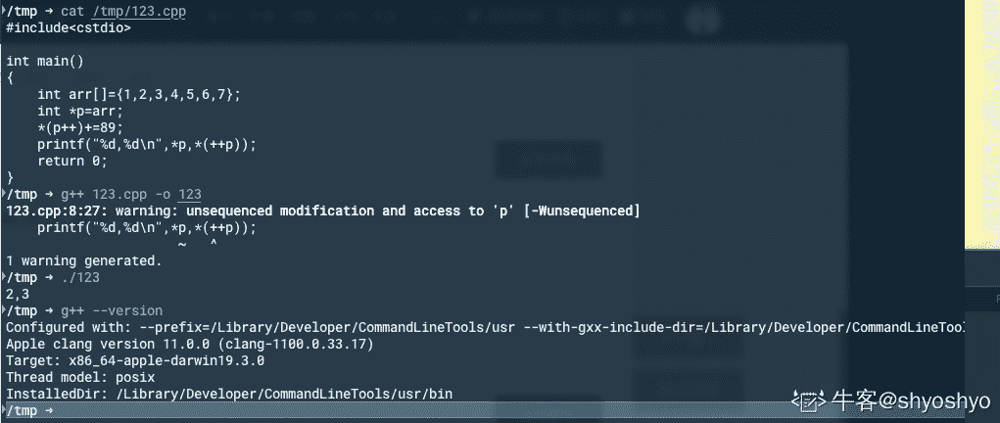

# 网易 2018 实习生招聘笔试题-游戏客户端开发实习生

## 1

阅读 C++语言代码输出（）

```cpp
int main()
{
    int arr[]={1,2,3,4,5,6,7};
    int *p=arr;
    *(p++)+=89;
    printf("%d,%d\n",*p,*(++p));
    return 0;
}
```

正确答案: A   你的答案: 空 (错误)

```cpp
3 3
```

```cpp
2 2
```

```cpp
2 3
```

```cpp
3 2
```

本题知识点

网易 iOS 工程师 安卓工程师 iOS 工程师 安卓工程师 网易 2018

讨论

[弹吉他的小刘鸭](https://www.nowcoder.com/profile/1620006)

++p 先于执行语句

发表于 2018-06-22 10:40:46

* * *

[shyoshyo](https://www.nowcoder.com/profile/397288350)



发表于 2020-03-28 19:56:29

* * *

[哈楼沃旳](https://www.nowcoder.com/profile/813349323)

*(p++)+=89 等同于*(p++)=*p+89printf("%d,%d\n",*p,*(++p))运算顺序从右向左 

发表于 2019-03-08 20:13:25

* * *

## 2

阅读 c++代码输出（）

```cpp
class base1{
    private: int a,b;
    public:
    base1 ( int i ) : b(i+1),a(b){}
    base1():b(0),a(b){}
    int get_a(){return a;}
    int get_b(){return b;}
};
int main()
{
    base1 obj1(11);
    cout<<obj1.get_a()<<endl<<obj1.get_b()<<endl;
    return 0;
}
```

正确答案: B   你的答案: 空 (错误)

```cpp
12 12
```

```cpp
随机数 12
```

```cpp
随机数 随机数
```

```cpp
12 随机数
```

本题知识点

网易 iOS 工程师 安卓工程师 iOS 工程师 安卓工程师 网易 2018

讨论

[宽少](https://www.nowcoder.com/profile/879209)

c++初始化类成员时，是按照声明的顺序初始化，而不是按照出现在初始化列表中的顺序

发表于 2019-11-20 11:50:57

* * *

[Code.DJC](https://www.nowcoder.com/profile/386322430)

带参数构造函数初始化 a 和 b，先调用 get_a 函数返回 a 时，初始化是 a=b，此时 b 未知，所以 a 为随机数，后调用 get_b 返回 b=i+1，则 b=12

发表于 2018-07-06 08:40:55

* * *

## 3

64 位电脑 运行 c++结果输出（） 

```cpp
class A
{
    char a[2];
    public:
        virtual void aa(){};
};
class B:public virtual A
{
    char b[2];
    char a[2];
    public:
        virtual void bb(){};
        virtual void aa(){};
};
class C:public virtual B
{
    char a[2];
    char b[2];
    char c[2];
    public:
        virtual void cc(){};
        virtual void aa(){};
        virtual void bb(){};
};
int main()
{
    cout<<sizeof(A)<<endl<<sizeof(B)<<endl<<sizeof(C);
    return 0;
}
```

正确答案: C   你的答案: 空 (错误)

```cpp
8 16 24
```

```cpp
16 32 36
```

```cpp
16 32 48
```

```cpp
8 20 24
```

本题知识点

网易 iOS 工程师 安卓工程师 iOS 工程师 安卓工程师 网易 2018

讨论

[谜摆](https://www.nowcoder.com/profile/92022022)

**首先 A****的字节数等于 2+8->16****B 继承自 A,故字节大小起始就是 16,因为 B 自己又有个 4 个 1 字节的 char 和一个虚指针,故为 16+2+8->32****C 继承自 A,故字节大小起始就是 32,因为 C 自己有 6 个 1 字节 char 和一个虚指针,故为 32+6+8->48**

发表于 2019-08-04 13:15:25

* * *

[Arkish](https://www.nowcoder.com/profile/517663843)

这道题实际运行之后发现答案是 16、40、64，我计算了一下好像确实是 16、40、64 以类 B 来说，首先因为有虚函数，那么就会有虚函数表指针 vfptr，其次虚继承自 A，那么就会有虚基类指针 vbptr，这里是 8+8=16 个字节。接着是两个 char 数组的 b 和 a（这个 a 不同于 A 类的 a），因此是 4 个字节。接下来考虑继承自 A 类的成员变量，同理有虚函数就会有 vfptr，这里是 8 个字节，然后是 char 数组的 a，共 2 个字节。在内存上的分布就是 B:    vfptr(8)
    vbptr(8)
    b2
    a2
    A:
        vfptr(8)
        A2
最后考虑字节对齐问题，那么就是 8+8+2+2+4（字节对齐）+8+2+6（字节对齐）=40 字节 _(:з)∠)_ 码了好多字也不知道对不对，如果错了就尴尬了。希望大佬指正

发表于 2019-03-08 20:04:15

* * *

[wufu-cch](https://www.nowcoder.com/profile/976905192)

类空间大小是成员中内存最大的值的最小整数倍。比如类 a,char 数组的大小是 2byte，虚函数占用的空间是 8byte 所以类 a 的空间大小为 8*2=16\.

发表于 2019-03-08 19:03:37

* * *

## 4

以下代码在 64 位的机子上输出是什么：

```cpp
#include <stdio.h>
int getSize(int data[]){
    return sizeof(data);
}

int main(){
    int data1[] = {1,2,3,4,5};
    int size1 = sizeof(data1);

    int* data2 = data1;
    int size2 = sizeof(data2);

    int size3 = getSize(data1);

    printf("%d, %d, %d", size1, size2, size3);
    return 0;
}
```

正确答案: A   你的答案: 空 (错误)

```cpp
20,8, 8
```

```cpp
4, 4, 4
```

```cpp
20, 4, 20
```

```cpp
20, 20, 20
```

本题知识点

网易 iOS 工程师 安卓工程师 2018 C 语言

讨论

[wufu-cch](https://www.nowcoder.com/profile/976905192)

64 位机子上指针占用的空间是 8Byte.对于 size3，getSizeof(data1),数组作为参数时，实际上传进去的是指向这个数组的指针。

发表于 2019-03-08 20:01:11

* * *

[薯条和番茄](https://www.nowcoder.com/profile/657289721)

sizeof(data1)代表整个数组的大小，所以是 20 字节 data2 是一个指针，64 位下是 8 个字节 getSize(data1)实际上是一个指针，所以为 8 个字节

发表于 2021-07-09 01:50:51

* * *

[进阶中的牛客人](https://www.nowcoder.com/profile/450066322)

32 位系统中，指针占 4 个字节；64 位系统中，指针占 8 个字节；函数 getSize 是将数组名作为参数，实际上得到的是指针

发表于 2021-04-20 13:50:19

* * *

## 5

为了找到自己满意的工作，牛牛收集了每种工作的难度和报酬。牛牛选工作的标准是在难度不超过自身能力值的情况下，牛牛选择报酬最高的工作。在牛牛选定了自己的工作后，牛牛的小伙伴们来找牛牛帮忙选工作，牛牛依然使用自己的标准来帮助小伙伴们。牛牛的小伙伴太多了，于是他只好把这个任务交给了你。

本题知识点

网易 iOS 工程师 安卓工程师 排序 *模拟 贪心 2018* *讨论

[凛 lyx](https://www.nowcoder.com/profile/9737182)

感觉输入有空行

发表于 2018-08-09 23:53:02

* * *

## 6

关于 http 协议以下说法不正确的是：
1.304 表示临时重定向
2.range 请求响应一定是用 http 状态码 206 表示成功
3.http 的 header 分割符是\r
4.请求参数如果包含%，需要进行 encode

正确答案: A   你的答案: 空 (错误)

```cpp
1，3
```

```cpp
1，4
```

```cpp
2，3
```

```cpp
2，4
```

```cpp
3，4
```

本题知识点

网易 iOS 工程师 安卓工程师 iOS 工程师 安卓工程师 网易 2018

讨论

[wufu-cch](https://www.nowcoder.com/profile/976905192)

307 状态码是临时重定向 http 的 header 分割符是\r\n

发表于 2019-03-08 20:07:13

* * *

## 7

关于计算机网络，以下说法正确的是(1)在向下的过程中，需要添加下层协议所需要的首部或者尾部(2)在向上的过程中不断拆开首部和尾部(3)在向上的过程中，需要添加下层协议所需要的首部或者尾部(4)在向下的过程中不断拆开首部和尾部(5)SMTP 属于 TCP 协议(6)POP3 属于 UDP 协议(7)DNS 属于 TCP 协议(8)Telnet 属于 UDP 协议

正确答案: A   你的答案: 空 (错误)

```cpp
(1)(2)(5)
```

```cpp
(1)(2)(6)
```

```cpp
(1)(2)(8)
```

```cpp
(3)(4)(5)(6)
```

```cpp
(3)(4)(5)(7)
```

本题知识点

网易 iOS 工程师 安卓工程师 iOS 工程师 安卓工程师 网易 2018

讨论

[wufu-cch](https://www.nowcoder.com/profile/976905192)

smtp.pop3,telnet 都是 TCP 协议，DNS 使用了 udp 和 TCP 两种协议。

发表于 2019-03-08 20:08:49

* * *

## 8

在 Linux 系统中，可以用来查找可执行文件的是？(1)whereis(2)locate(3)which(4)type(5)find

正确答案: D   你的答案: 空 (错误)

```cpp
(1)(2)(3)
```

```cpp
(1)(2)(5)
```

```cpp
(1)(2)(3)(5)
```

```cpp
(1)(2)(3)(4)(5)
```

本题知识点

网易 iOS 工程师 安卓工程师 iOS 工程师 安卓工程师 网易 2018

## 9

阅读下面的 C++ 代码，关于 ptrX，ptrY，ptrZ 三个指针，下面说法正确的是（）

```cpp
#include <iostream>
using namespace std;

class BaseX {
public:
    virtual ~BaseX() {};
    virtual void FunctionX() {};
};

class ClassY : public BaseX {
public:
    virtual void FunctionY() {};
};

class FatherZ :public ClassY {
};

int main() {
    FatherZ aObject;
    BaseX* ptrX = &aObject;
    ClassY* ptrY = &aObject;
    FatherZ* ptrZ = &aObject;
    return 0;
}
```

正确答案: A   你的答案: 空 (错误)

```cpp
ptrX，ptrY，ptrZ 的取值相同
```

```cpp
ptrZ = ptrX + ptrY
```

```cpp
ptrX 和 ptrY 不相同
```

```cpp
ptrZ 不等于 ptrX 也不等于 ptrY
```

本题知识点

网易 iOS 工程师 安卓工程师 2018 C++

讨论

[Achou.Wang](https://www.nowcoder.com/profile/646468779)

考指针，指针本身的值是执行对应的对象的地址，他本身的地址是&ptrZ 这里说的

```cpp
ptrX,ptrY,ptrZ 是指它们指向的内容，因此都相等
```

发表于 2021-02-06 23:26:39

* * *

[谜摆](https://www.nowcoder.com/profile/92022022)

三个单继承,指针位置无偏移,地址全部相同

发表于 2019-08-04 13:26:45

* * *

[牛客 350501657 号](https://www.nowcoder.com/profile/350501657)

意思是 3 个指针都赋的&aObject 的首地址，所以与虚表指针动态联编无关是吗。如果去掉&aObject 前的&就不一样了？

发表于 2021-03-17 09:28:43

* * *

## 10

设二叉排序树中关键字由 1 到 999 的整数构成，现要查找关键字为 321 的节点，下面关键字序列中，不可能出现在二叉排序树上的查找序列是：

正确答案: B   你的答案: 空 (错误)

```cpp
2、252、400 、398、300、344、310、321
```

```cpp
888、231、911、244、898、256、362、366
```

```cpp
888、200、666、240、312、330、321
```

```cpp
2、398、387、219、266、283、298、321
```

本题知识点

网易 iOS 工程师 安卓工程师 iOS 工程师 安卓工程师 网易 2018

讨论

[SCurry](https://www.nowcoder.com/profile/7573161)

B 选项 ： 看最后 两个数，321 和 362 比较以后，明显 321< 362 ，必然寻找 362 的左子树，此时左子树 366 大于 362 明显出错。

编辑于 2018-06-14 11:32:38

* * *

[盖子 Brush](https://www.nowcoder.com/profile/250003971)

888 接下来查找的是 231，231 为左子树，231 下一个节点 911>888，不可能在其左子树上，所以错误

发表于 2021-12-19 16:30:23

* * *

## 11

以下哪种情况会使得进程由执行状态转变成阻塞状态

正确答案: D   你的答案: 空 (错误)

```cpp
时间片用完
```

```cpp
进程调度
```

```cpp
I/O 完成
```

```cpp
I/O 请求
```

本题知识点

网易 iOS 工程师 安卓工程师 iOS 工程师 安卓工程师 网易 2018

## 12

下列关于 UDP 通信的说法错误的是（）

正确答案: C   你的答案: 空 (错误)

```cpp
发送数据之前不需要建立连接
```

```cpp
没有拥塞控制
```

```cpp
传输数据的时候对报文长度没有要求
```

```cpp
一般用在数据传输要求不高的场合
```

本题知识点

网易 iOS 工程师 安卓工程师 iOS 工程师 安卓工程师 网易 2018

## 13

关于 HTTP1.0 和 HTTP1.1 错误的是()

正确答案: A   你的答案: 空 (错误)

```cpp
HTTP1.0 只能短连接，而 HTTP1.1 只能长连接
```

```cpp
HTTP1.0 通信的时候会占用大量内存，而 HTTP1.1 可以避免这样的情况
```

```cpp
状态码 100 只适用于 HTTP1.1 版本
```

```cpp
HTTP1.1 在 Request 消息头里多了一个 Host 域,HTTP1.0 则没有这个域
```

本题知识点

网易 iOS 工程师 安卓工程师 iOS 工程师 安卓工程师 网易 2018

## 14

下面关于进程和线程说法错误的是（）

正确答案: B   你的答案: 空 (错误)

```cpp
进程是系统进行资源分配和调度的基本单位，而线程是 CPU 调度和分配的基本单位
```

```cpp
线程也拥有自己的系统资源
```

```cpp
一个线程可以创建和撤销另一个线程
```

```cpp
一个进程中的多个线程共享资源
```

本题知识点

网易 iOS 工程师 安卓工程师 iOS 工程师 安卓工程师 网易 2018

讨论

[没有 offer 的人生索然无味](https://www.nowcoder.com/profile/311721028)

进程是系统资源调度的最小单位，线程是执行最小单位

发表于 2019-07-07 09:59:36

* * *

## 15

下面关于线程同步说法错误的是（）

正确答案: D   你的答案: 空 (错误)

```cpp
用户模式和内核模式下同步方式不同
```

```cpp
对于临界区的访问适用于单进程中线程间的同步
```

```cpp
事件对象适用于多个进程间的各线程实现同步
```

```cpp
互斥对象也只适用于单进程中线程间的同步
```

本题知识点

网易 iOS 工程师 安卓工程师 iOS 工程师 安卓工程师 网易 2018

## 16

下面关于死锁的说法错误的是（）

正确答案: D   你的答案: 空 (错误)

```cpp
死锁是指多个进程因抢占资源而发生的一种阻塞且相互等待的现象
```

```cpp
死锁的产生源于系统资源不足和进程推进顺序不当
```

```cpp
可以通过终止和撤销进程来解除死锁
```

```cpp
银行家算法用在预防死锁策略中
```

本题知识点

网易 iOS 工程师 安卓工程师 iOS 工程师 安卓工程师 网易 2018

讨论

[wufu-cch](https://www.nowcoder.com/profile/976905192)

银行家算法是死锁避免；

发表于 2019-03-08 20:10:07

* * *

## 17

用 1*3 的瓷砖密铺 3*20 的地板有几种方式？

正确答案: A   你的答案: 空 (错误)

```cpp
1278
```

```cpp
872
```

```cpp
595
```

```cpp
406
```

本题知识点

网易 iOS 工程师 安卓工程师 iOS 工程师 安卓工程师 网易 2018

讨论

[wufu-cch](https://www.nowcoder.com/profile/976905192)

f(n)表示用 1*3 的瓷砖密铺 3*n 的地板的方案数。用递推的思维想。

想铺好 3*n，可以先铺 3*(n-1)，最后一列竖着铺一块 3*****1；也可以先铺好 f(n-3)，最后的三快横着铺。那么 f(n) = f(n-1)+f(n-3)。需要确定一下发，f(0),f(1),f(2)的值，容易知道，f(0)=f(1)=f(2)=1。接下来可以令 n=20，用递推的方式求出 f(20)=1278。

发表于 2019-03-08 20:11:41

* * *

## 18

有 20 个人去看电影，电影票 50 元。其中只有 10 个人有 50 元钱，另外 10 个人都只有一张面值 100 元的纸币，电影院没有其他钞票可以找零，问有多少种找零的方法？

正确答案: A   你的答案: 空 (错误)

```cpp
16796
```

```cpp
16798
```

```cpp
16794
```

```cpp
16792
```

本题知识点

网易 iOS 工程师 安卓工程师 iOS 工程师 安卓工程师 网易 2018

讨论

[Magic_Conch000](https://www.nowcoder.com/profile/681519531)

深搜，一共要收 20 张票，five 是已收 50 元的数量，step 是现在到第几个人。

```cpp
#include using namespace std;
int ans=0;
void dps(int step,int five) {
    if (five == 10) {
        ++ans;
        return;
    }
    dps(step + 1,five+1);
    if (step < five * 2) {
        dps(step + 1,five);
    }
}
int main() {
    dps(0, 0);
    cout << ans << endl;
}
```

发表于 2022-01-05 17:59:47

* * *

## 19

一个完全二叉树节点数为 200，则其叶子结点个数为？

正确答案: C   你的答案: 空 (错误)

```cpp
98
```

```cpp
99
```

```cpp
100
```

```cpp
101
```

本题知识点

网易 iOS 工程师 安卓工程师 iOS 工程师 安卓工程师 网易 2018

讨论

[没有 offer 的人生索然无味](https://www.nowcoder.com/profile/311721028)

200=127+73，倒数第二层有 64-（73+1）/2=27 叶结点，共 73+27=100

发表于 2019-07-07 10:14:18

* * *

## 20

对于线性表（ 13,25,22,35,54,57,63）进行散列存储时，若选用 H （ K ） =K %7 作为散列函数，则散列地址为 1 的元素有（ ）个？

正确答案: C   你的答案: 空 (错误)

```cpp
0
```

```cpp
1
```

```cpp
2
```

```cpp
3
```

本题知识点

网易 iOS 工程师 安卓工程师 iOS 工程师 安卓工程师 网易 2018

## 21

下列选项中，不可能是快速排序第 2 趟排序结果的是 （）

正确答案: C   你的答案: 空 (错误)

```cpp
4 14 10 12 8 6 18
```

```cpp
4 6 10 8 12 14 18
```

```cpp
6 4 10 8 14 12 18
```

```cpp
8 4 6 10 12 14 18
```

本题知识点

网易 iOS 工程师 安卓工程师 iOS 工程师 安卓工程师 网易 2018

讨论

[#$$](https://www.nowcoder.com/profile/8818093)

快排每一趟会让关键元素在结束时候在他最终排序应该处于的位置。排序完应该是 4 6 8 10 12 14 18，C 选项只有一个处于应在的位置。

发表于 2020-03-28 00:06:18

* * *

## 22

小 Q 得到一个神奇的数列: 1, 12, 123,...12345678910,1234567891011...。

并且小 Q 对于能否被 3 整除这个性质很感兴趣。

小 Q 现在希望你能帮他计算一下从数列的第 l 个到第 r 个(包含端点)有多少个数可以被 3 整除。

本题知识点

网易 iOS 工程师 安卓工程师 数学 2018

讨论

[寒江雪 17190](https://www.nowcoder.com/profile/908024932)

等差数列求和#include <iostream>using namespace std;
int main(){
    long long l, r;
    cin >> l >> r;
    long long sum = (l-1) + (l-1)*(l - 2) / 2;
    long long cnt = 0;
    for (long long i = l; i <= r; i++) {
        sum += i;
        if (sum % 3 == 0) {
            cnt++;
        }
    }
    cout << cnt << endl;
    return 0;
}

发表于 2020-03-23 01:54:22

* * *

[漂泊远方](https://www.nowcoder.com/profile/180595324)

 ```cpp
#include <iostream>
using namespace std;

int main() {
    long long l, r;
    cin >> l >> r;

    int count = 0;
    for (long long  j = l; j <= r; j++) {
        if (j%3==0||j%3==2) {
            count++;
        }
    }
    cout << count << endl;
    return 0;
}
```

发表于 2019-08-07 23:50:36

* * *

[嘟嘟嘟嘟噜](https://www.nowcoder.com/profile/3385548)

import java.util.Scanner;

public class Main {
public static void main(String[] args) {

Scanner scanner = new Scanner(System.in);
int l = scanner.nextInt();
int r = scanner.nextInt();
System.out.println(function(r)-function(l-1));
}

private static int function(int x) {
return x / 3 * 2 + (x % 3 == 0 ? 0 : x % 3 == 1 ? 0 : 1);
}
}通过所有测试用例

编辑于 2019-04-07 00:36:31

* * *

## 23

小 Q 正在给一条长度为 n 的道路设计路灯安置方案。

为了让问题更简单,小 Q 把道路视为 n 个方格,需要照亮的地方用'.'表示, 不需要照亮的障碍物格子用'X'表示。

小 Q 现在要在道路上设置一些路灯, 对于安置在 pos 位置的路灯, 这盏路灯可以照亮 pos - 1, pos, pos + 1 这三个位置。

小 Q 希望能安置尽量少的路灯照亮所有'.'区域, 希望你能帮他计算一下最少需要多少盏路灯。

本题知识点

网易 iOS 工程师 安卓工程师 数组 模拟 字符串 *贪心 2018* *讨论

[Magic_Conch000](https://www.nowcoder.com/profile/681519531)

```cpp
#include<iostream>

using namespace std;
int n, m,num;
char s[1001];
int main() {
	scanf("%d", &n);
	for (int i = 0; i < n; i++) {
		scanf("%d", &m);
		getchar();
		scanf("%[^\n]", s);
		num = 0;
		for (int j = 0; j < m; j++) {
			if (s[j] == '.') {
				++num;
				j += 2;
			}
		}
		printf("%d\n", num);
	}
}
```

 发表于 2022-01-05 19:07:59

* * *

## 24

请描述下 TCP 协议和 HTTP 协议，以及两者的区别和关系？

你的答案

本题知识点

网易 iOS 工程师 安卓工程师 2018

讨论

[菜是原罪，难是帮凶ಥ_ಥ](https://www.nowcoder.com/profile/431732435)

**TPC/IP 协议是传输层协议，主要解决数据如何在网络中传输，而 HTTP 是应用层协议，主要解决如何包装数据。**关于 TCP/IP 和 HTTP 协议的关系，网络有一段比较容易理解的介绍：“我们在传输数据时，可以只使用（传输层）TCP/IP 协议，但是那样的话，如果没有应用层，便无法识别数据内容，如果想要使传输的数据有意义，则必须使用到应用层协议，应用层协议有很多，比如 HTTP、FTP、TELNET 等，也可以自己定义应用层协议。WEB 使用 HTTP 协议作应用层协议，以封装 HTTP 文本信息，然后使用 TCP/IP 做传输层协议将它发到网络上。”

发表于 2019-02-28 20:49:02

* * *

## 25

对于一款网络游戏，游戏服务器和游戏客户端是如何分工的？以及各自核心的关注点在什么地方？

你的答案

本题知识点

网易 iOS 工程师 安卓工程师 2018**