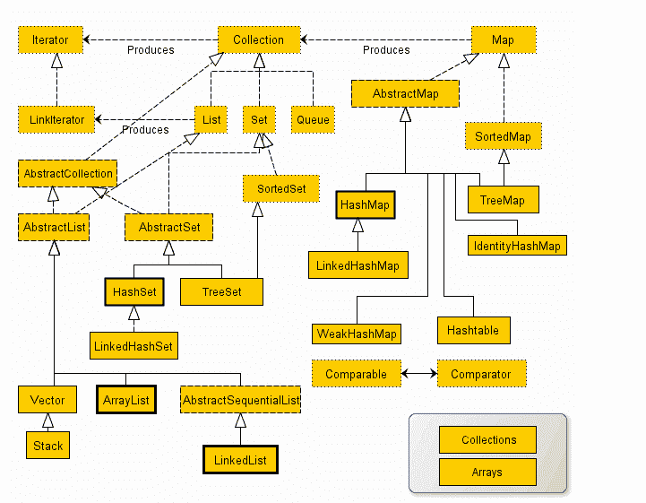
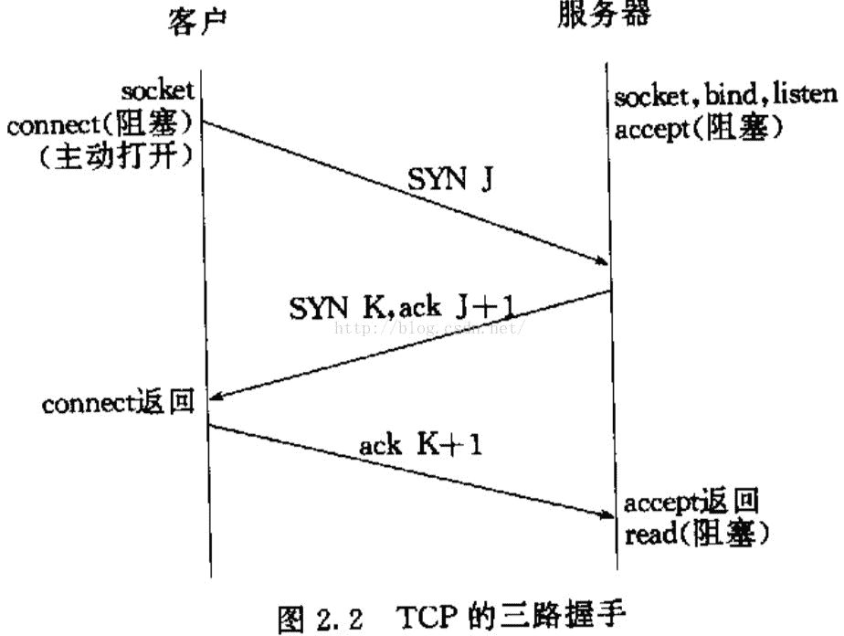

# 网易 2018 实习生招聘笔试题-游戏服务器开发实习生

## 1

linux 系统中有如下 cron 任务：20,40 */3 * * 1 sh test.sh 下面描述正确的是：

正确答案: A   你的答案: 空 (错误)

```cpp
每周一每 3 小时，20 分，40 分，运行 test.sh
```

```cpp
每月 1 号每 3 小时，20 分，40 分，运行 test.sh
```

```cpp
每周一每 3 小时，每 20 分钟运行 test.sh
```

```cpp
每月 1 号每 3 小时，每 20 分钟运行 test.sh
```

本题知识点

网易 Java 工程师 C++工程师 iOS 工程师 安卓工程师 运维工程师 前端工程师 算法工程师 PHP 工程师 游戏研发工程师 网易 2018

讨论

[听风吹的声音](https://www.nowcoder.com/profile/706826)

contab 基本格式 : *　　*　　*　　*　　*　　command 分    时    日    月    周     要执行的命令，表示列举要执行的时刻- 用范围表示列举*/  表示每隔多久执行 0 23 * * 6 /usr/local/etc/rc.d/lighttpd restart 上面的例子表示每星期六的 11 : 00 pm 重启 apache。 0 */1 * * 6 /usr/local/etc/rc.d/lighttpd restart 上面的例子表示每星期六的每隔一小时重启 

发表于 2018-08-03 13:42:20

* * *

## 2

如何从有数字规律的网址抓取网页并保存在当前目录？假设网址为 [`test/0.xml`](http://test/0.xml)，其中这个数字可以递增到 100。

正确答案: D   你的答案: 空 (错误)

```cpp
for(int i=0; i&lt;100;++i)<br>wget http://test/$i.xml;
```

```cpp
wget http://test/{$0-$100}.xml
```

```cpp
wget http://test/`[0-100]`.xml
```

```cpp
for((i=0;i&lt;100;++i));<br>do<br>wget http://test/$i.xml;<br>done
```

本题知识点

网易 Java 工程师 C++工程师 iOS 工程师 安卓工程师 运维工程师 前端工程师 算法工程师 PHP 工程师 游戏研发工程师 网易 2018

## 3

关于 http 协议以下说法不正确的是：
1.304 表示临时重定向
2.range 请求响应一定是用 http 状态码 206 表示成功
3.http 的 header 分割符是\r
4.请求参数如果包含%，需要进行 encode

正确答案: A   你的答案: 空 (错误)

```cpp
1，3
```

```cpp
1，4
```

```cpp
2，3
```

```cpp
2，4
```

```cpp
3，4
```

本题知识点

网易 Java 工程师 C++工程师 iOS 工程师 安卓工程师 运维工程师 前端工程师 算法工程师 PHP 工程师 游戏研发工程师 网易 2018

讨论

[听风吹的声音](https://www.nowcoder.com/profile/706826)

200:访问成功（表示一切正常，返回的是正常请求结果）
302：临时重定向（指出被请求的文档已被临时移动到别处，此文档的新的 URL 在 Location 响应头中给出）
304：未修改（表示客户机缓存的版本是最新的，客户机应该继续使用它。）
404：访问的文件不存在（服务器上不存在客户机所请求的资源）
500：内部服务器错误（服务器端的 CGI、ASP、JSP 等程序发生错误）对于 range:    Range: 请求资源的部分内容（不包括响应头的大小），单位是 byte，即字节，从 0 开始.如果服务器能够正常响应的话，服务器会返回 206 Partial Content 的状态码及说明.如果不能处理这种 Range 的话，就会返回整个资源以及响应状态码为 200 OK .（这个要注意，要分段下载时，要先判断这个）Range: bytes=start-end 例如：Range: bytes=10- ：第 10 个字节及最后个字节的数据 Range: bytes=40-100 ：第 40 个字节到第 100 个字节之间的数据.可用于多线程分段下载一个资源。先用 head 请求从 head 响应中知道资源的总大小，然后多个线程去请求，range 的范围不同。完成下载。 http 的 header 分割符是/r/n 请求参数如果包含&，需要进行 encode 

发表于 2018-08-03 14:05:39

* * *

## 4

关于计算机网络，以下说法正确的是(1)在向下的过程中，需要添加下层协议所需要的首部或者尾部(2)在向上的过程中不断拆开首部和尾部(3)在向上的过程中，需要添加下层协议所需要的首部或者尾部(4)在向下的过程中不断拆开首部和尾部(5)SMTP 属于 TCP 协议(6)POP3 属于 UDP 协议(7)DNS 属于 TCP 协议(8)Telnet 属于 UDP 协议

正确答案: A   你的答案: 空 (错误)

```cpp
(1)(2)(5)
```

```cpp
(1)(2)(6)
```

```cpp
(1)(2)(8)
```

```cpp
(3)(4)(5)(6)
```

```cpp
(3)(4)(5)(7)
```

本题知识点

网易 Java 工程师 C++工程师 iOS 工程师 安卓工程师 运维工程师 前端工程师 算法工程师 PHP 工程师 游戏研发工程师 网易 2018

讨论

[听风吹的声音](https://www.nowcoder.com/profile/706826)

计算机网络中，应用之间的消息传递从上往下封装，每次添加相应的头部或尾部。 收到消息的一方再层层去掉头部尾部，剥开得到消息 TCP 面向连接的服务（例如 Telnet、FTP、rlogin、X Windows 和 SMTP，SMTP, POP3,HTTP）需要高度的可靠性，所以它们使用了 TCP。DNS 在某些情况下使用 TCP（发送和接收域名数据库），但使用 UDP 传送有关单个主机的信息。UDP 不被应用于那些使用虚电路的面向连接的服务，UDP 主要用于那些面向查询---应答的服务，例如 NFS。相对于 FTP 或 Telnet，这些服务需要 交换的信息量较小。使用 UDP 的服务包括 NTP（网落时间协议）和 DNS（DNS 也使用 TCP）TFTP。基于 UDP 的协议主要有 DNS, TFTP, SNMPDNS 使用了 TCP，UDP

发表于 2018-08-03 14:09:05

* * *

## 5

在 Linux 系统中，可以用来查找可执行文件的是？(1)whereis(2)locate(3)which(4)type(5)find

正确答案: D   你的答案: 空 (错误)

```cpp
(1)(2)(3)
```

```cpp
(1)(2)(5)
```

```cpp
(1)(2)(3)(5)
```

```cpp
(1)(2)(3)(4)(5)
```

本题知识点

网易 Java 工程师 C++工程师 iOS 工程师 安卓工程师 运维工程师 前端工程师 算法工程师 PHP 工程师 游戏研发工程师 网易 2018

## 6

以下哪种情况会使得进程由执行状态转变成阻塞状态

正确答案: D   你的答案: 空 (错误)

```cpp
时间片用完
```

```cpp
进程调度
```

```cpp
I/O 完成
```

```cpp
I/O 请求
```

本题知识点

网易 Java 工程师 C++工程师 iOS 工程师 安卓工程师 运维工程师 前端工程师 算法工程师 PHP 工程师 游戏研发工程师 网易 2018

## 7

在 Java 中，包 com 中定义了类 TestUtil，在 com 的子包 util 中定义了同名类 TestUtil，给定如下 Java 代码，编译运行时，将发生（ ）。

```cpp
package test;
import com.util.TestUtil;
import com.TestUtil;
public class Test {
  public static void main(String[] args)  {
    TestUtil testutil = new TestUtil();
  }
}
```

正确答案: D   你的答案: 空 (错误)

```cpp
创建了一个 com.TestUtil 对象
```

```cpp
创建了一个 com.util.TestUtil 对象
```

```cpp
运行时出现异常
```

```cpp
编译无法通过
```

本题知识点

网易 Java 工程师 C++工程师 iOS 工程师 安卓工程师 运维工程师 前端工程师 算法工程师 PHP 工程师 游戏研发工程师 网易 2018

讨论

[听风吹的声音](https://www.nowcoder.com/profile/706826)

编译器会报错，不知道用的到底是哪个 TestUtil。 如果一个类中同时使用了不同包名的同名类，可以在使用时带上全包名，比如：com.TestUtil testutil = new  com.TestUtil();

发表于 2018-08-03 14:13:01

* * *

## 8

给定 Java 代码如下所示，则编译运行后，输出结果是（ ）。

```cpp
public class Test {
    static int a;
    int b;
    static int c;

    public int aMethod() {
        a++;
        return a;
    }

    public int bMethod() {
        b++;
        return b;
    }

    public static int cMethod() {
        c++;
        return c;
    }

    public static void main(String args[]) {
        Test test1 = new Test();
        test1.aMethod();
        System.out.println(test1.aMethod());
        Test test2 = new Test();
        test2.bMethod();
        System.out.println(test2.bMethod());
        Test test3 = new Test();
        test3.cMethod();
        System.out.println(test3.cMethod());
    }
}
```

正确答案: D   你的答案: 空 (错误)

```cpp
1 0 2
```

```cpp
2 1 2
```

```cpp
0 0 2
```

```cpp
2 2 2
```

本题知识点

网易 Java 工程师 C++工程师 iOS 工程师 安卓工程师 运维工程师 前端工程师 算法工程师 PHP 工程师 游戏研发工程师 网易 2018

## 9

给定某 Java 程序的 main 方法如下，该程序编译运行后的结果是（ ）。

```cpp
public static void main(String[] args) {
    String str=null;
    str.concat("abc");
    str.concat("123");
    System.out.println(str);
}
```

正确答案: D   你的答案: 空 (错误)

```cpp
输出：null
```

```cpp
输出：abc123
```

```cpp
编译错误
```

```cpp
运行时出现异常
```

本题知识点

网易 Java 工程师 C++工程师 iOS 工程师 安卓工程师 运维工程师 前端工程师 算法工程师 PHP 工程师 游戏研发工程师 网易 2018

讨论

[听风吹的声音](https://www.nowcoder.com/profile/706826)

String 类型也是对象类型，调用一个空对象的方法，运行时会报空指针异常

发表于 2018-08-03 14:16:08

* * *

## 10

给定某 Java 程序的 main 方法如下，该程序编译运行后的结果是（ ）。

```cpp
public class Test {
    int count = 21;
    public void count() {
        System.out.println(++count);
    }
    public static void main(String args[]) {
        new Test().count();
        new Test().count();
    }
}
```

正确答案: C   你的答案: 空 (错误)

```cpp
22 23
```

```cpp
21 22
```

```cpp
22 22
```

```cpp
21 23
```

本题知识点

网易 Java 工程师 C++工程师 iOS 工程师 安卓工程师 运维工程师 前端工程师 算法工程师 PHP 工程师 游戏研发工程师 网易 2018

讨论

[听风吹的声音](https://www.nowcoder.com/profile/706826)

count 是普通成员变量，一个对象中的修改其他对象不可见

发表于 2018-08-03 14:17:10

* * *

## 11

在 JDK1.8 中，HashMap 没有实现哪个接口（ ）。

正确答案: B   你的答案: 空 (错误)

```cpp
Map
```

```cpp
AbstractMap
```

```cpp
Serializable
```

```cpp
Cloneable
```

本题知识点

网易 Java 工程师 C++工程师 iOS 工程师 安卓工程师 运维工程师 前端工程师 算法工程师 PHP 工程师 游戏研发工程师 网易 2018

讨论

[听风吹的声音](https://www.nowcoder.com/profile/706826)

java 集合继承体系中，带 abstract 的是实现了相应接口，或者继承自上层抽象类的抽象类

发表于 2018-08-03 14:24:28

* * *

[(-.-)201809102159663](https://www.nowcoder.com/profile/339339724)

HashMap 继承于 AbstractMap 可以实现 Map，Clonable，Serialzable 接口

发表于 2018-11-21 17:19:50

* * *

## 12

下列关于 UDP 通信的说法错误的是（）

正确答案: C   你的答案: 空 (错误)

```cpp
发送数据之前不需要建立连接
```

```cpp
没有拥塞控制
```

```cpp
传输数据的时候对报文长度没有要求
```

```cpp
一般用在数据传输要求不高的场合
```

本题知识点

网易 Java 工程师 C++工程师 iOS 工程师 安卓工程师 运维工程师 前端工程师 算法工程师 PHP 工程师 游戏研发工程师 网易 2018

讨论

[听风吹的声音](https://www.nowcoder.com/profile/706826)

UDP 包的大小应该是 1500 - IP 头(20) - UDP 头(8) = 1472(Bytes)TCP 包的大小应该是 1500 - IP 头(20) - TCP 头(20) = 1460 (Bytes)

发表于 2018-08-03 14:42:48

* * *

## 13

TCP 建立连接的时候 connect()函数和 accept()函数分别在三次握手第几次后返回（）

正确答案: B   你的答案: 空 (错误)

```cpp
1 , 2
```

```cpp
2 , 3
```

```cpp
1 , 3
```

```cpp
2 , 2
```

本题知识点

网易 Java 工程师 C++工程师 iOS 工程师 安卓工程师 运维工程师 前端工程师 算法工程师 PHP 工程师 游戏研发工程师 网易 2018

讨论

[听风吹的声音](https://www.nowcoder.com/profile/706826)

connect 在第二次握手，accept 在第三次握手后返回。第一次握手时，创建连接，connect 处于阻塞状态，等待服务器 accept，第二次握手成功，connect 从阻塞返回，accept 同样的需要收到客户端 ack 以后才从阻塞返回，连接建立完成

发表于 2018-08-03 14:47:36

* * *

## 14

下面关于三次握手与 connect()函数的关系说法错误的是（）

正确答案: B   你的答案: 空 (错误)

```cpp
客户端发送 SYN 给服务器
```

```cpp
服务器只发送 SYN 给客户端
```

```cpp
客户端收到服务器回应后发送 ACK 给服务器
```

```cpp
connect()函数在三次握手的第二次返回
```

本题知识点

网易 Java 工程师 C++工程师 iOS 工程师 安卓工程师 运维工程师 前端工程师 算法工程师 PHP 工程师 游戏研发工程师 网易 2018

## 15

下面关于线程同步说法错误的是（）

正确答案: D   你的答案: 空 (错误)

```cpp
用户模式和内核模式下同步方式不同
```

```cpp
对于临界区的访问适用于单进程中线程间的同步
```

```cpp
事件对象适用于多个进程间的各线程实现同步
```

```cpp
互斥对象也只适用于单进程中线程间的同步
```

本题知识点

网易 Java 工程师 C++工程师 iOS 工程师 安卓工程师 运维工程师 前端工程师 算法工程师 PHP 工程师 游戏研发工程师 网易 2018

## 16

下面关于死锁的说法错误的是（）

正确答案: D   你的答案: 空 (错误)

```cpp
死锁是指多个进程因抢占资源而发生的一种阻塞且相互等待的现象
```

```cpp
死锁的产生源于系统资源不足和进程推进顺序不当
```

```cpp
可以通过终止和撤销进程来解除死锁
```

```cpp
银行家算法用在预防死锁策略中
```

本题知识点

网易 Java 工程师 C++工程师 iOS 工程师 安卓工程师 运维工程师 前端工程师 算法工程师 PHP 工程师 游戏研发工程师 网易 2018

## 17

有 20 个人去看电影，电影票 50 元。其中只有 10 个人有 50 元钱，另外 10 个人都只有一张面值 100 元的纸币，电影院没有其他钞票可以找零，问有多少种找零的方法？

正确答案: A   你的答案: 空 (错误)

```cpp
16796
```

```cpp
16798
```

```cpp
16794
```

```cpp
16792
```

本题知识点

网易 Java 工程师 C++工程师 iOS 工程师 安卓工程师 运维工程师 前端工程师 算法工程师 PHP 工程师 游戏研发工程师 网易 2018

讨论

[三翼黑崎](https://www.nowcoder.com/profile/906268221)

自行百度卡特兰数

发表于 2019-09-12 18:10:10

* * *

## 18

一个完全二叉树节点数为 200，则其叶子结点个数为？

正确答案: C   你的答案: 空 (错误)

```cpp
98
```

```cpp
99
```

```cpp
100
```

```cpp
101
```

本题知识点

网易 Java 工程师 C++工程师 iOS 工程师 安卓工程师 运维工程师 前端工程师 算法工程师 PHP 工程师 游戏研发工程师 网易 2018

## 19

字符串 zmnzizi 用哈夫曼编码来编码，则共有多少位？

正确答案: B   你的答案: 空 (错误)

```cpp
14
```

```cpp
13
```

```cpp
12
```

```cpp
11
```

本题知识点

网易 Java 工程师 C++工程师 iOS 工程师 安卓工程师 运维工程师 前端工程师 算法工程师 PHP 工程师 游戏研发工程师 网易 2018

## 20

已知中序遍历的序列为 abcdef，高度最小的不可能的二叉树的前序遍历是

正确答案: D   你的答案: 空 (错误)

```cpp
dbacfe
```

```cpp
dbacef
```

```cpp
cbaedf
```

```cpp
cabefd
```

本题知识点

网易 Java 工程师 C++工程师 iOS 工程师 安卓工程师 运维工程师 前端工程师 算法工程师 PHP 工程师 游戏研发工程师 网易 2018

## 21

牛牛以前在老师那里得到了一个正整数数对(x, y), 牛牛忘记他们具体是多少了。

但是牛牛记得老师告诉过他 x 和 y 均不大于 n, 并且 x 除以 y 的余数大于等于 k。

牛牛希望你能帮他计算一共有多少个可能的数对。

本题知识点

网易 Java 工程师 C++工程师 iOS 工程师 安卓工程师 运维工程师 前端工程师 算法工程师 PHP 工程师 数学 游戏研发工程师 2018

讨论

[灬未来不是梦灬](https://www.nowcoder.com/profile/80496928)

import java.util.Scanner;

public class Test2 {

 public static void main(String[] args) {
  Scanner s=new Scanner(System.in);
  int n=s.nextInt();
  int k=s.nextInt();
  int count=0;
  for(int i=1;i<=n;i++) {
   for(int j=1;j<=n;j++) {
    if(i%j>=k)
     count++;
   }
  }
  System.out.println(count);
 }

}

发表于 2020-04-05 16:46:45

* * *

## 22

平面内有 n 个矩形, 第 i 个矩形的左下角坐标为(x1[i], y1[i]), 右上角坐标为(x2[i], y2[i])。

如果两个或者多个矩形有公共区域则认为它们是相互重叠的(不考虑边界和角落)。

请你计算出平面内重叠矩形数量最多的地方,有多少个矩形相互重叠。

本题知识点

网易 Java 工程师 C++工程师 iOS 工程师 安卓工程师 运维工程师 前端工程师 算法工程师 PHP 工程师 高级结构 数学 穷举 游戏研发工程师 2018

## 23

牛牛准备参加学校组织的春游, 出发前牛牛准备往背包里装入一些零食, 牛牛的背包容量为 w。牛牛家里一共有 n 袋零食, 第 i 袋零食体积为 v[i]。牛牛想知道在总体积不超过背包容量的情况下,他一共有多少种零食放法(总体积为 0 也算一种放法)。

本题知识点

网易 Java 工程师 C++工程师 iOS 工程师 安卓工程师 运维工程师 前端工程师 算法工程师 PHP 工程师 高级算法 穷举 游戏研发工程师 2018

## 24

请描述下 TCP 协议和 HTTP 协议，以及两者的区别和关系？

你的答案

本题知识点

网易 Java 工程师 C++工程师 iOS 工程师 安卓工程师 运维工程师 前端工程师 算法工程师 PHP 工程师 游戏研发工程师 2018

## 25

对于一款网络游戏，游戏服务器和游戏客户端是如何分工的？以及各自核心的关注点在什么地方？

你的答案

本题知识点

网易 Java 工程师 C++工程师 iOS 工程师 安卓工程师 运维工程师 前端工程师 算法工程师 PHP 工程师 游戏研发工程师 2018