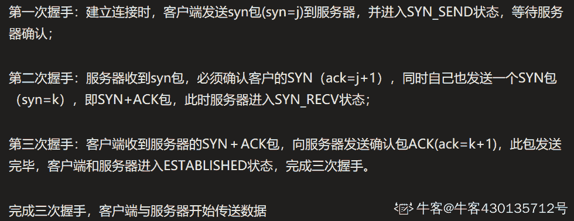

# 网易 2018 实习生招聘笔试题-系统运维实习生

## 1

linux 系统中有如下 cron 任务：20,40 */3 * * 1 sh test.sh 下面描述正确的是：

正确答案: A   你的答案: 空 (错误)

```cpp
每周一每 3 小时，20 分，40 分，运行 test.sh
```

```cpp
每月 1 号每 3 小时，20 分，40 分，运行 test.sh
```

```cpp
每周一每 3 小时，每 20 分钟运行 test.sh
```

```cpp
每月 1 号每 3 小时，每 20 分钟运行 test.sh
```

本题知识点

网易 运维工程师 运维工程师 网易 2018

讨论

[乡宁大窝](https://www.nowcoder.com/profile/380461641)

cron 时间表的格式如下所示：min hour dayofmonth month dayofweek commandcron 时间表允许你用特定值、取值范围（1-5）或者通配符（*）来制定条目。20,40             */3            *                       *                   1                          sh test.shmin             hour    dayofmonth         month          dayofweek                command   对应格式以后就可以得到每周一每三小时，20,40 分，运行 test.sh

发表于 2018-08-10 20:36:49

* * *

## 2

如何将当前目录下所有 pdf 文件内容转换成 txt 文件内容？

正确答案: B   你的答案: 空 (错误)

```cpp
for *.pdf to *.txt
```

```cpp
for f in `ls *.pdf`; do pdftotext “$f”; done
```

```cpp
do `ls *.pdf` pdftotext `*.txt`
```

```cpp
pdftotext *.pdf *.txt
```

本题知识点

网易 运维工程师 运维工程师 网易 2018

## 3

如何从有数字规律的网址抓取网页并保存在当前目录？假设网址为 [`test/0.xml`](http://test/0.xml)，其中这个数字可以递增到 100。

正确答案: D   你的答案: 空 (错误)

```cpp
for(int i=0; i&lt;100;++i)<br>wget http://test/$i.xml;
```

```cpp
wget http://test/{$0-$100}.xml
```

```cpp
wget http://test/`[0-100]`.xml
```

```cpp
for((i=0;i&lt;100;++i));<br>do<br>wget http://test/$i.xml;<br>done
```

本题知识点

网易 运维工程师 运维工程师 网易 2018

## 4

统计当前目录和里面递归目录的.cpp 文件和.h 文件行数

正确答案: B   你的答案: 空 (错误)

```cpp
wc -l $(find ./ -name&quot;*.cpp&quot; &quot;*.h&quot;)
```

```cpp
wc -l $(find ./ -name&quot;*.cpp&quot;;find ./ -name&quot;*.h&quot;)
```

```cpp
find ./ -name &quot;*.cpp&quot; &quot;*.h&quot; | wc -l
```

```cpp
wc -l $(find ./ -name&quot;*.cpp&quot; &amp;&amp; &quot;*.h&quot;)
```

本题知识点

网易 运维工程师 2018

## 5

关于计算机网络，以下说法正确的是(1)在向下的过程中，需要添加下层协议所需要的首部或者尾部(2)在向上的过程中不断拆开首部和尾部(3)在向上的过程中，需要添加下层协议所需要的首部或者尾部(4)在向下的过程中不断拆开首部和尾部(5)SMTP 属于 TCP 协议(6)POP3 属于 UDP 协议(7)DNS 属于 TCP 协议(8)Telnet 属于 UDP 协议

正确答案: A   你的答案: 空 (错误)

```cpp
(1)(2)(5)
```

```cpp
(1)(2)(6)
```

```cpp
(1)(2)(8)
```

```cpp
(3)(4)(5)(6)
```

```cpp
(3)(4)(5)(7)
```

本题知识点

网易 运维工程师 2018

## 6

关于电子邮件协议，下面说法正确的是？(1)POP3 的特点是只要用户从服务器上读取了邮件，就把该邮件删除(2)IMAP 协议不支持创建自定义的文件夹(3)IMAP 协议中客户端和服务器上的邮件保持同步(4)SMTP 能发送 ASCII 码和二进制文件

正确答案: C   你的答案: 空 (错误)

```cpp
(1)(3)(4)
```

```cpp
(1)(2)(3)
```

```cpp
(1)(3)
```

```cpp
(1)(4)
```

```cpp
(2)(3)
```

```cpp
(1)(2)(3)(4)
```

本题知识点

网易 运维工程师 2018

## 7

在 Linux 系统中，可以用来查找可执行文件的是？(1)whereis(2)locate(3)which(4)type(5)find

正确答案: D   你的答案: 空 (错误)

```cpp
(1)(2)(3)
```

```cpp
(1)(2)(5)
```

```cpp
(1)(2)(3)(5)
```

```cpp
(1)(2)(3)(4)(5)
```

本题知识点

网易 运维工程师 2018

## 8

关于 Linux 下/etc 目录下的文件，下面说法正确的是？

正确答案: C   你的答案: 空 (错误)

```cpp
host.conf 记录主机静态信息
```

```cpp
hosts 决定如何解析域名
```

```cpp
fstab 文件系统的静态信息，系统初始化时需要挂接多个文件系统时需要
```

```cpp
mtab 本机的标识信息，远程登录时确认你当前控制的是本机还是远程计算机
```

本题知识点

网易 运维工程师 运维工程师 网易 2018

## 9

对于以下关键字{55，26，33，80，70，90，6，30，40，20}，增量取 5 的希尔排序的第一趟的结果是：

正确答案: B   你的答案: 空 (错误)

```cpp
55，33，30，6，80，70，40，20，26，90
```

```cpp
55，6，30，40，20，90，26，33，80，70
```

```cpp
55，6，33，30，40，70，20，26，80，90
```

```cpp
55， 26，6，40，30，90，33，70，80，20
```

本题知识点

网易 运维工程师 运维工程师 网易 2018

## 10

设二叉排序树中关键字由 1 到 999 的整数构成，现要查找关键字为 321 的节点，下面关键字序列中，不可能出现在二叉排序树上的查找序列是：

正确答案: B   你的答案: 空 (错误)

```cpp
2、252、400 、398、300、344、310、321
```

```cpp
888、231、911、244、898、256、362、366
```

```cpp
888、200、666、240、312、330、321
```

```cpp
2、398、387、219、266、283、298、321
```

本题知识点

网易 运维工程师 运维工程师 网易 2018

讨论

[Mirror20190304142951](https://www.nowcoder.com/profile/801851875)

二叉树查询，如果当前对比叶子值大于关键字的值，下一次对比值肯定会小于当前叶子值，如果当前对比叶子值小于关键词的值，下一次对比值肯定会大于当然叶子值

发表于 2019-07-24 11:28:48

* * *

## 11

假设某计算机系统中有 11 台打印机，有 K 个进程竞争使用，每个进程最多需要 4 台打印机。则要保证该系统不发生死锁的 k 的最大值：

正确答案: C   你的答案: 空 (错误)

```cpp
1
```

```cpp
2
```

```cpp
3
```

```cpp
4
```

本题知识点

网易 运维工程师 2018

## 12

以下哪种情况会使得进程由执行状态转变成阻塞状态

正确答案: D   你的答案: 空 (错误)

```cpp
时间片用完
```

```cpp
进程调度
```

```cpp
I/O 完成
```

```cpp
I/O 请求
```

本题知识点

网易 运维工程师 2018

讨论

[许小哥](https://www.nowcoder.com/profile/345138269)

执行-->就绪：时间片完；就绪-->执行：被调度；执行-->阻塞：等待事件，io 请求；阻塞->就绪：io 完成

发表于 2019-09-06 14:22:09

* * *

## 13

假设某系统为进程在内存中分配了 3 个物理块，进程访问顺序为 0、2、1、3、0、2、4、0、2、1、3、4。已知系统未事先调入任何页面，那么当采用 FIFO 置换算法时，缺页率是：

正确答案: C   你的答案: 空 (错误)

```cpp
33.3%
```

```cpp
25%
```

```cpp
75%
```

```cpp
60%
```

本题知识点

网易 运维工程师 2018

## 14

有一条 TCP 连接，它的最大报文段长度为 4KB，TCP 拥塞窗口为 24KB，这时候发生超时，那么该拥塞窗口变为了（）

正确答案: B   你的答案: 空 (错误)

```cpp
2KB
```

```cpp
4KB
```

```cpp
6KB
```

```cpp
8KB
```

本题知识点

网易 运维工程师 运维工程师 网易 2018

讨论

[许小哥](https://www.nowcoder.com/profile/345138269)

TCP 报文中，当发生超时事件，阈值被设置成当前拥塞窗口的一半，而拥塞窗口被设为一个最大报文段，也就是 4KB。

发表于 2019-09-06 14:21:14

* * *

## 15

下列关于 UDP 通信的说法错误的是（）

正确答案: C   你的答案: 空 (错误)

```cpp
发送数据之前不需要建立连接
```

```cpp
没有拥塞控制
```

```cpp
传输数据的时候对报文长度没有要求
```

```cpp
一般用在数据传输要求不高的场合
```

本题知识点

网易 运维工程师 运维工程师 网易 2018

讨论

[Mirror20190304142951](https://www.nowcoder.com/profile/801851875)

UDP 包头有 16 位表示数据报长度，数据报长度不得大于 65535

发表于 2019-07-24 11:37:50

* * *

## 16

TCP 建立连接的时候 connect()函数和 accept()函数分别在三次握手第几次后返回（）

正确答案: B   你的答案: 空 (错误)

```cpp
1 , 2
```

```cpp
2 , 3
```

```cpp
1 , 3
```

```cpp
2 , 2
```

本题知识点

网易 运维工程师 运维工程师 网易 2018

## 17

下面关于三次握手与 connect()函数的关系说法错误的是（）

正确答案: B   你的答案: 空 (错误)

```cpp
客户端发送 SYN 给服务器
```

```cpp
服务器只发送 SYN 给客户端
```

```cpp
客户端收到服务器回应后发送 ACK 给服务器
```

```cpp
connect()函数在三次握手的第二次返回
```

本题知识点

网易 运维工程师 2018

讨论

[牛客 430135712 号](https://www.nowcoder.com/profile/430135712)



发表于 2020-09-09 16:02:03

* * *

## 18

下面关于线程同步说法错误的是（）

正确答案: D   你的答案: 空 (错误)

```cpp
用户模式和内核模式下同步方式不同
```

```cpp
对于临界区的访问适用于单进程中线程间的同步
```

```cpp
事件对象适用于多个进程间的各线程实现同步
```

```cpp
互斥对象也只适用于单进程中线程间的同步
```

本题知识点

网易 运维工程师 运维工程师 网易 2018

## 19

有 20 个人去看电影，电影票 50 元。其中只有 10 个人有 50 元钱，另外 10 个人都只有一张面值 100 元的纸币，电影院没有其他钞票可以找零，问有多少种找零的方法？

正确答案: A   你的答案: 空 (错误)

```cpp
16796
```

```cpp
16798
```

```cpp
16794
```

```cpp
16792
```

本题知识点

网易 运维工程师 运维工程师 网易 2018

## 20

已知中序遍历的序列为 abcdef，高度最小的不可能的二叉树的前序遍历是

正确答案: D   你的答案: 空 (错误)

```cpp
dbacfe
```

```cpp
dbacef
```

```cpp
cbaedf
```

```cpp
cabefd
```

本题知识点

网易 运维工程师 运维工程师 网易 2018

## 21

小 Q 得到一个神奇的数列: 1, 12, 123,...12345678910,1234567891011...。

并且小 Q 对于能否被 3 整除这个性质很感兴趣。

小 Q 现在希望你能帮他计算一下从数列的第 l 个到第 r 个(包含端点)有多少个数可以被 3 整除。

本题知识点

网易 运维工程师 数学 2018

## 22

小 Q 正在给一条长度为 n 的道路设计路灯安置方案。

为了让问题更简单,小 Q 把道路视为 n 个方格,需要照亮的地方用'.'表示, 不需要照亮的障碍物格子用'X'表示。

小 Q 现在要在道路上设置一些路灯, 对于安置在 pos 位置的路灯, 这盏路灯可以照亮 pos - 1, pos, pos + 1 这三个位置。

小 Q 希望能安置尽量少的路灯照亮所有'.'区域, 希望你能帮他计算一下最少需要多少盏路灯。

本题知识点

网易 运维工程师 数组 模拟 字符串 *贪心 2018* *讨论

[中秋之前拿 offer](https://www.nowcoder.com/profile/9573407)

```cpp
# python 3.5.3
class Solution(object):
    def lights(self, num, _str):
        if num == 0:
            return 0
        pos = 0
        light = 0
        while pos < len(_str):
            if _str[pos] == '.':
                light += 1
                pos += 3
                if pos >= len(_str):
                    break
            if _str[pos] == 'X':
                pos += 1
        return light

def main():
    s = Solution()
    n = int(input())
    instance = []
    if n == 0:
        print(0)
    else:
        for i in range(n):
            num = input()
            _str = input()
            instance.append([num,_str])
        for i in instance:
            print(s.lights(i[0],i[1]))

if __name__ == "__main__":
    main()

```

编辑于 2018-08-30 14:42:58

* * *

## 23

牛牛去犇犇老师家补课，出门的时候面向北方，但是现在他迷路了。虽然他手里有一张地图，但是他需要知道自己面向哪个方向，请你帮帮他。

本题知识点

网易 运维工程师 2018

讨论

[kobbe](https://www.nowcoder.com/profile/653410323)

```cpp
if __name__ == '__main__':
    num = int(input())
    string = input()
    numl = string.count('L')
    numr = string.count('R')
    x = numl - numr  # 一对 LR 的操作会抵消
    dict1 = {0: 'N', 1: 'W', 2: 'S', 3: 'E'}
    dict2 = {0: 'N', 1: 'E', 2: 'S', 3: 'W'}
    tmp = x % 4  # 取 4 的余数，因为 4 个操作又回到原方向
    if tmp > 0:
        print(dict1[tmp])
    else:
        print(dict2[tmp])
```

发表于 2019-08-12 13:55:25

* * *

[脚本学生](https://www.nowcoder.com/profile/2847249)

```cpp
 let reader=require('readline');

	let r1=reader.createInterface({

	    input:process.stdin,

	    output:process.stdout

	});

	let table=[];

	let check=newMap();

	check.set('N',{'L':'W','R':'E'}).set('S',{'L':'E','R':'W'})

	.set('E',{'L':'N','R':'S'}).set('W',{'L':'S','R':'N'})

	r1.on('line',line=>{

	    table.push(line);

	    if(table.length==2)

	    {

	        let ptr='N';

	        let temp=table[1];

	        for(let i=0;i<temp.length;i++)

	            ptr=check.get(ptr)[temp[i]];

	        console.log(ptr);

	        r1.close();

	    }

	}); 
```

发表于 2018-06-22 16:37:29

* * *

## 24

IP 地址是互联网中一种常用资源，关于 IP 地址请回答以下问题（仅针对 IPv4）：（1） 子网掩码的作用是什么？地址为 10.10.32.0/19 的网络共包含多少个 IP 地址？（2） 保留的 IP 专用地址（内网地址）包括哪些？（3） 写出能匹配所有 IP 地址的正则表达式，请尽可能精确。

你的答案

本题知识点

网易 运维工程师 2018

讨论

[牛客 206597936 号](https://www.nowcoder.com/profile/206597936)

1、子网掩码的作用是  通过划分子网段，划分多个子网，有利于充分利用 ip 地址 19 位 网段   剩下 13 位分配给子网  包含 2¹³ 次方个 ip 地址 2、127.0.0.1  环回地址，发送 http 不会进入外网  0.0.0.0 本地地址  1.1.1.1  广播地址 3、/^((\d|[1-9]\d|1\d{2}|2[0-4]\d|25[0-5])\.){3}(\d|[1-9]\d|1\d{2}|2[0-4]\d|25[0-5])/

发表于 2021-01-21 11:46:29

* * *

## 25

1）软件的使用和管理，是运维的主要工作之一，请列举你常用的包管理工具和主要的使用方法；2）如果你平时有使用过开源软件，请列举你见过、了解过的常用开源软件名称，用途，代码托管地址（可选），授权方式（可选）；3）如果你使用过版本管理工具，请列举你使用的版本管理工具名称，常用命令（包括但不限于提交、回退、合并、冲突解决、分支，标签）。

你的答案

本题知识点

网易 运维工程师 2018*