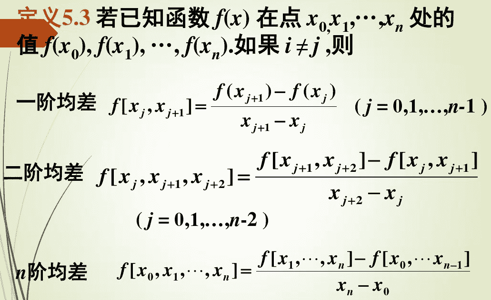
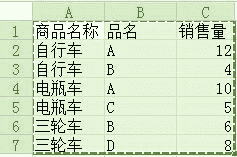
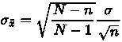
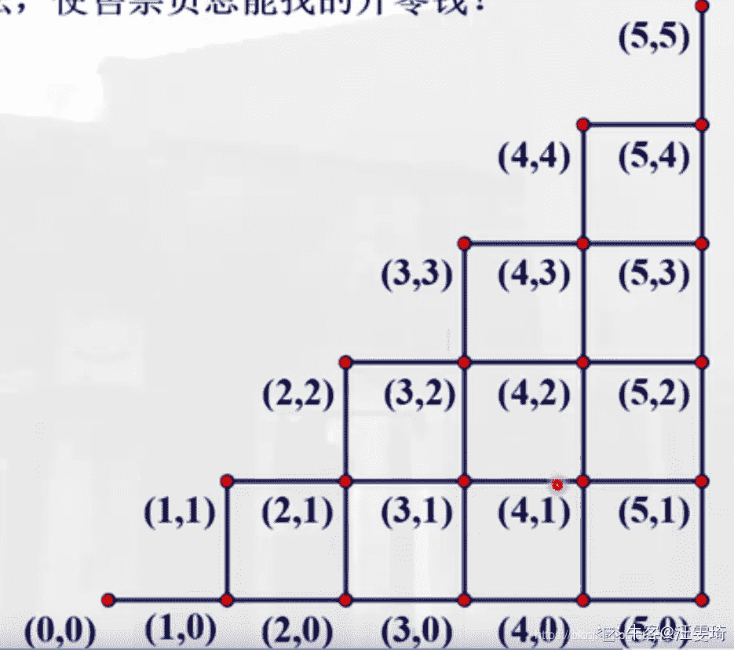
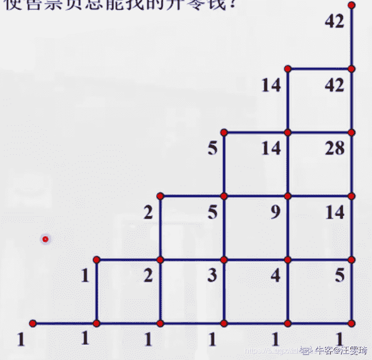
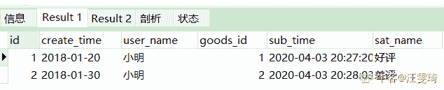
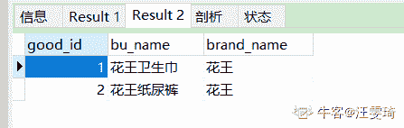
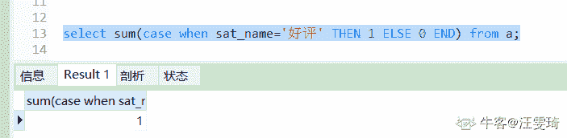
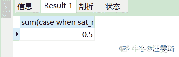
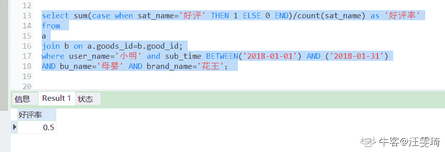

# 网易 2018 实习生招聘笔试题-数据分析实习生

## 1

有 2 堆宝石，A 和 B 一起玩游戏，假设俩人足够聪明，规则是每个人只能从一堆选走 1 个或 2 个或 3 个宝石，最后全部取玩的人获胜，假设 2 堆宝石的数目为 12 和 13，请问 A 怎么可以必胜？

正确答案: A   你的答案: 空 (错误)

```cpp
让 A 先取
```

```cpp
让 B 先取
```

```cpp
没有策略能够让 A 必胜
```

```cpp
说法都不正确
```

本题知识点

网易 运维工程师 Java 工程师 C++工程师 iOS 工程师 安卓工程师 前端工程师 算法工程师 PHP 工程师 数据分析师 网易 2018

讨论

[小龙 201804131543518](https://www.nowcoder.com/profile/2758444)

A 只要取完宝石后给 B 留 4 的倍数就能赢，留下 4 的倍数，B 就没有办法取完。而 A 每次都可以按照 B 取的数量来修正，保证每次留给 B 的是 4 的倍数。到最后 B 没有办法一次取完 4 个，而且必须要取，剩下的 A 取完就赢了

发表于 2018-06-16 22:38:14

* * *

[Justry](https://www.nowcoder.com/profile/2806303)

A 先选 13 中的 1 个，让两堆都是 12。然后当 B 选任意一堆的 1，A 选相同堆的 3；B 选 2，A 选 2；B 选 3，A 选 1。

发表于 2018-06-04 20:46:32

* * *

[风来了呜呜呜](https://www.nowcoder.com/profile/3646354)

A 只要保证取完宝石时占据 1,5,9,13,17,21,25 就能赢

发表于 2018-05-31 10:47:26

* * *

## 2

从数字集合{1,2,3,4,… ,20}中选出 4 个数字的子集，如果不允许两个相连的数字出现在同一集合中，那么能够形成多少个这种子集？

正确答案: A   你的答案: 空 (错误)

```cpp
2380
```

```cpp
816
```

```cpp
330
```

```cpp
1220
```

本题知识点

网易 运维工程师 Java 工程师 C++工程师 iOS 工程师 安卓工程师 前端工程师 算法工程师 PHP 工程师 数据分析师 2018

讨论

[奔跑的小强](https://www.nowcoder.com/profile/1421210)

数学中的插空法，20 个数取不相邻的 4 个，可以转换为在 16 个数形成的序列中插入 4 个数，16 个数的序列共有 17 个空，所以结果为：C（17,4）=2380.

编辑于 2018-06-14 00:09:10

* * *

[有青](https://www.nowcoder.com/profile/234225543)

**分组用插板、相邻用捆绑、不邻用插空**

发表于 2019-09-27 23:57:37

* * *

[一颗斯特拉](https://www.nowcoder.com/profile/530810509)

这道题用逆向做比较麻烦，用插空法做比较容易。
思路：20 个数字中选 4 个还剩 16 个，16 个数字依序排列有 17 个空。在这 17 个空里插入 4 个数字，这 4 个数字所在位置表示的数字就是满足条件的子集，即。

发表于 2020-03-31 08:47:44

* * *

## 3

将 4 个不一样的球随机放入 5 个杯子中，则杯子中球的最大个数为 3 的概率是?

正确答案: B   你的答案: 空 (错误)

```cpp
9/16
```

```cpp
16/125
```

```cpp
16/25
```

```cpp
9/25
```

本题知识点

网易 运维工程师 Java 工程师 C++工程师 iOS 工程师 安卓工程师 前端工程师 算法工程师 PHP 工程师 数据分析师 2018

讨论

[瓦哈哈](https://www.nowcoder.com/profile/3282491)

从 4 个球里取出三个放进 5 个杯子中的任意一个，剩下的一个球放入剩下的四个杯子里的任意一个（C43 * C51* C41）/5⁴

发表于 2018-06-25 10:09:27

* * *

[让我上岸吧~](https://www.nowcoder.com/profile/859487454)

4 个球，每个球有 5 种放法，共 5⁴ 种；有 3 个球放进 1 个杯中，先从 4 个球里选 3 个 C（4,3），选一个杯子 C（5,1），再为剩下的一个球选一个杯子，此时剩下 4 个杯子没用 C（4,1）

发表于 2019-03-31 10:33:45

* * *

[Ciel_ 力子](https://www.nowcoder.com/profile/433889625)

可是杯子没有说是不一样的。这里有漏洞。如果杯子是一样的。总共的放法就没有这么多了。

发表于 2019-08-28 22:28:55

* * *

## 4

已知 y=f(x)的均差 f(x0, x1, x2)=14/3，f(x1, x2, x3)=15/3，f(x2, x3,x4)=91/15，f(x0, x2, x3)=18/3，那么均差 f(x4, x2, x3)=（       ）

正确答案: D   你的答案: 空 (错误)

```cpp
18/3
```

```cpp
14/3
```

```cpp
15/3
```

```cpp
91/15
```

本题知识点

网易 运维工程师 Java 工程师 C++工程师 iOS 工程师 安卓工程师 前端工程师 算法工程师 PHP 工程师 数据分析师 2018

讨论

[流苏狂花](https://www.nowcoder.com/profile/5351140)



发表于 2018-08-10 23:04:25

* * *

[diu](https://www.nowcoder.com/profile/6529901)

均差 f(x4, x2, x3)＝f(x2, x3,x4)=91/15

发表于 2018-06-24 14:37:01

* * *

[大萌 201808100927516](https://www.nowcoder.com/profile/806974273)

(对称性)差商  与插值节点的顺序无关

发表于 2018-08-11 13:14:08

* * *

## 5

一个快递公司对同一年龄段的员工，进行汽车，三轮车，二轮车平均送件量的比较，结果给出 sig.=0.034，说明

正确答案: D   你的答案: 空 (错误)

```cpp
三类交通工具送件量有差别的可能性是 0.034
```

```cpp
三类交通工具送件量没有差别的可能性是 0.034
```

```cpp
交通工具对送件量没影响。
```

```cpp
按照 0.05 显著性水平，拒绝 H0，说明三类交通工具送件量有显著差异。
```

本题知识点

网易 运维工程师 Java 工程师 C++工程师 iOS 工程师 安卓工程师 前端工程师 算法工程师 PHP 工程师 数据分析师 网易 2018

讨论

[奔跑的小强](https://www.nowcoder.com/profile/1421210)

1.  在[SPSS 软件](https://www.baidu.com/s?wd=SPSS%E8%BD%AF%E4%BB%B6&tn=SE_PcZhidaonwhc_ngpagmjz&rsv_dl=gh_pc_zhidao)统计结果中，不管是回归分析还是其它分析，都会看到“SIG”，SIG=significance，意为“显著性”，后面的值就是统计出的 P 值，如果 P 值 0.01<P<0.05,则为差异显著，如果 P<0.01,则差异极显著。

2.  F 值是方差检验量，是整个模型的整体检验，看你拟合的方程有没有意义 t 值是对每一个自变量（logistic 回归）的逐个检验，看它的[beta 值](https://www.baidu.com/s?wd=beta%E5%80%BC&tn=SE_PcZhidaonwhc_ngpagmjz&rsv_dl=gh_pc_zhidao)β即回归系数有没有意义 T 的数值表示的是对回归参数的显著性检验值，它的绝对值大于等于 ta/2(n-k)（这个值表示的是根据你的置信水平，自由度得出的数值）时，就拒绝原假设，即认为在其他解释变量不变的情况下，解释变量 X 对[被解释变量](https://www.baidu.com/s?wd=%E8%A2%AB%E8%A7%A3%E9%87%8A%E5%8F%98%E9%87%8F&tn=SE_PcZhidaonwhc_ngpagmjz&rsv_dl=gh_pc_zhidao)Y 的影响是显著的。

3.  F 的值是[回归方程](https://www.baidu.com/s?wd=%E5%9B%9E%E5%BD%92%E6%96%B9%E7%A8%8B&tn=SE_PcZhidaonwhc_ngpagmjz&rsv_dl=gh_pc_zhidao)的显著性检验，表示的是模型中[被解释变量](https://www.baidu.com/s?wd=%E8%A2%AB%E8%A7%A3%E9%87%8A%E5%8F%98%E9%87%8F&tn=SE_PcZhidaonwhc_ngpagmjz&rsv_dl=gh_pc_zhidao)与所有解释变量之间的线性关系在总体上是否显著做出推断。若 F>Fa([k-1](https://www.baidu.com/s?wd=k-1&tn=SE_PcZhidaonwhc_ngpagmjz&rsv_dl=gh_pc_zhidao),n-k),则拒绝原假设，即认为列入模型的各个解释变量联合起来对[被解释变量](https://www.baidu.com/s?wd=%E8%A2%AB%E8%A7%A3%E9%87%8A%E5%8F%98%E9%87%8F&tn=SE_PcZhidaonwhc_ngpagmjz&rsv_dl=gh_pc_zhidao)有显著影响，反之，则无显著影响。

发表于 2018-06-14 00:17:01

* * *

[一颗斯特拉](https://www.nowcoder.com/profile/530810509)

👉【题目 5】值检验
1.「显著性水平」
在 SPSS 软件中，不管是回归分析还是其它分析，都会看到`Sig.`(Sig=significance)，意为“显著性”，后面的值就是检验的 p 值。

2.「检验的值」
在一个假设检验问题中，利用样本观察值能够做出拒绝原假设的最小显著性水平称为「检验的值」。

由检验的值与人们心目中的显著性水平比较可以很容易做出检验的结论：

*   如果，则在显著性水平为下拒绝。
*   如果，则在显著性水平为下接受。

值在实际中很有用，如今的统计软件中对检验问题一般都会给出检验的值。

发表于 2020-03-31 09:45:49

* * *

[TRAVELERZK](https://www.nowcoder.com/profile/306233501)

在 SPSS 软件统计结果中，不管是回归分析还是其它分析，都会看到“SIG”，SIG=significance，意为“显著性”，后面的值就是统计出的 P 值，如果 P 值 0.01<P<0.05,则为差异显著，如果 P<0.01,则差异极显著。

F 值是方差检验量，是整个模型的整体检验，看你拟合的方程有没有意义 t 值是对每一个自变量（logistic 回归）的逐个检验，看它的 beta 值β即回归系数有没有意义 T 的数值表示的是对回归参数的显著性检验值，它的绝对值大于等于 ta/2(n-k)（这个值表示的是根据你的置信水平，自由度得出的数值）时，就拒绝原假设，即认为在其他解释变量不变的情况下，解释变量 X 对被解释变量 Y 的影响是显著的。

F 的值是回归方程的显著性检验，表示的是模型中被解释变量与所有解释变量之间的线性关系在总体上是否显著做出推断。若 F>Fa(k-1,n-k),则拒绝原假设，即认为列入模型的各个解释变量联合起来对被解释变量有显著影响，反之，则无显著影响。

发表于 2021-04-01 02:46:26

* * *

## 6

小明在一次班干部二人竞选中，支持率为百分之五十五，而置信水平 0.95 以上的置信区间为百分之五十到百分之六十，请问小明未当选的可能性有可能是

正确答案: D   你的答案: 空 (错误)

```cpp
40%
```

```cpp
50%
```

```cpp
5%
```

```cpp
3%
```

本题知识点

网易 运维工程师 Java 工程师 C++工程师 iOS 工程师 安卓工程师 前端工程师 算法工程师 PHP 工程师 数据分析师 2018

讨论

[Justry](https://www.nowcoder.com/profile/2806303)

95%落在百分之五十到六十，落在百分之 50 以下和百分之 60 以上的概率分别为 2.5%，所以不当选的概率（落在百分之 50 以下）为 2.5%约等于 3%

发表于 2018-06-04 20:44:22

* * *

[一颗斯特拉](https://www.nowcoder.com/profile/530810509)

👉【题目 6】置信区间
1.[「置信区间的定义」](https://max.book118.com/html/2018/0414/161542234.shtm)
置信区间展现的是这个参数的真实值有一定概率落在测量结果周围的程度。置信区间给出的是被测量参数的测量值的可信程度，即前面所要求的“一定概率”。这个概率被称为置信水平。

这里小明在一次班干部二人竞选中，支持率为 55%（真实支持率），而置信水平 0.95 以上的置信区间为 50%到 60%。也就是说他的真实支持率只有 95%的几率落在 50%到 60%，因此它的真实支持率不足一半的可能性小于 5%。这里是两人竞选，未当选也就是支持率不足一半，因此小明未当选的可能性是小于 5%的，可能是 3%。

发表于 2020-03-31 10:30:09

* * *

[Cruisin87](https://www.nowcoder.com/profile/133862815)

我想说支持率都 55%了，不是 100%入选了吗。。

发表于 2020-04-03 23:38:45

* * *

## 7

某销售车辆公司某一时间段各类商品的销售量如下图， 销售员需统计以下公式所示数据=SUM(SUMIF(C2:C9,{"<10","<6"})*{1,-1})请问，该公式返回值为

正确答案: C   你的答案: 空 (错误)

```cpp
23
```

```cpp
9
```

```cpp
14
```

```cpp
22
```

本题知识点

网易 运维工程师 Java 工程师 C++工程师 iOS 工程师 安卓工程师 前端工程师 算法工程师 PHP 工程师 数据分析师 2018

讨论

[poppyzz](https://www.nowcoder.com/profile/4143969)

小于 10 的乘以 1，小于 6 的乘以-1，再求和。（4+5+6+8）*1+（4+5）*1=14

发表于 2018-08-11 13:51:40

* * *

[一颗斯特拉](https://www.nowcoder.com/profile/530810509)

👉【题目 7】SUMIF 函数
1.SUMIF 函数解析
①作用：对单元格区域中，满足条件的单元格求和。
②语法：SUMIF（区域，条件，[求和区域]）。其中
第 1 个参数：要判断条件的单元格区域
第 2 个参数：条件表达式
第 3 个参数：求和区域（如果省略，则对参数 1 区域求和）

2.按数字区间求和
本题中，`公式:= SUM(SUMIF(C2:C9,{"<10","<6"})*{1,-1})`，求的是满足[6,10)的销售量的和，即 6+8=14。

因为大于等于 6，小于 10 的区间可以用小于 10 的区间除去小于 5 的区间，所以先分别计算小于 10 的区间和小于 5 的区间的和{23,9}。`SUMIF()*{1,-1}`这是数组与数组的计算，因为最终结果为两数相减，所以这里的数组将第 2 个数变为负数{23,-9}。这样在后面用 SUM 求和时就可以让这两个数相减了。

发表于 2020-03-31 11:02:40

* * *

[Etisan](https://www.nowcoder.com/profile/1748273)

小于 10 且大于等于 6

发表于 2018-07-04 15:13:41

* * *

## 8

SQL 语句执行的顺序是

正确答案: C   你的答案: 空 (错误)

```cpp
1.SELECT<br>2.JOIN ON<br>3.FROM<br>4.WHERE<br>5.GROUP BY<br>6.HAVING<br>7.ORDER BY
```

```cpp
1.SELECT<br>2.FROM<br>3.JOIN ON<br>4.WHERE<br>5.GROUP BY<br>6.HAVING<br>7.ORDER BY
```

```cpp
1.FROM<br>2.JOIN ON<br>3.WHERE<br>4.GROUP BY<br>5.HAVING<br>6.SELECT<br>7.ORDER BY
```

```cpp
1.JOIN ON<br>2.WHERE<br>3.GROUP BY<br>4.HAVING<br>5.SELECT<br>6.FROM<br>7.ORDER BY
```

本题知识点

网易 运维工程师 Java 工程师 C++工程师 iOS 工程师 安卓工程师 前端工程师 算法工程师 PHP 工程师 数据分析师 2018

讨论

[EdwinShii](https://www.nowcoder.com/profile/9735562)

SQL 语句的执行顺序跟其语句的语法顺序并不一致一般而言 SQL 语句的语法顺序是：

1.  SELECT[DISTINCT]

2.  FROM

3.  WHERE

4.  GROUP BY

5.  HAVING

6.  UNION

7.  ORDER BY

其执行顺序为：

1.  FROM

2.  WHERE

3.  GROUP BY

4.  HAVING

5.  SELECT

6.  DISTINCT

7.  UNION

8.  ORDER BY

需要注意的是： 1、 **FROM 才是 SQL 语句执行的第一步**。数据库在执行 SQL 语句的第一步是将数据从硬盘加载到数据缓冲区中，以便对这些数据进行操作。

2、**SELECT 是在大部分语句执行了之后才执行的**，严格的说是在 FROM 和 GROUP BY 之后执行的。这就是你不能在 WHERE 中使用在 SELECT 中设定别名的字段作为判断条件的原因。3、**并非所有 SQL 都按照上述的顺序进行。** 

发表于 2018-07-03 16:41:44

* * *

[一颗斯特拉](https://www.nowcoder.com/profile/530810509)

参考：[`www.php.cn/sql/421993.html`](https://www.php.cn/sql/421993.html)

发表于 2020-03-31 11:11:31

* * *

[TRAVELERZK](https://www.nowcoder.com/profile/306233501)

SQL 语句的执行顺序跟其语句的语法顺序并不一致 一般而言

SQL 语句的语法顺序是： SELECT[DISTINCT]

FROM

WHERE

GROUP BY

HAVING

UNION

ORDER BY

其执行顺序为：

FROM

WHERE

GROUP BY

HAVING

SELECT

DISTINCT

UNION

ORDER BY

需要注意的是：

1、 FROM 才是 SQL 语句执行的第一步。数据库在执行 SQL 语句的第一步是将数据从硬盘加载到数据缓冲区中，以便对这些数据进行操作。

2、SELECT 是在大部分语句执行了之后才执行的，严格的说是在 FROM 和 GROUP BY 之后执行的。这就是你不能在 WHERE 中使用在 SELECT 中设定别名的字段作为判断条件的原因。

3、并非所有 SQL 都按照上述的顺序进行。

发表于 2021-04-01 02:55:14

* * *

## 9

随机地掷一骰子两次，则两次出现的点数之和等于 8 的概率为：

正确答案: C   你的答案: 空 (错误)

```cpp
3/36
```

```cpp
4/36
```

```cpp
5/36
```

```cpp
2/36
```

本题知识点

网易 运维工程师 Java 工程师 C++工程师 iOS 工程师 安卓工程师 前端工程师 算法工程师 PHP 工程师 数据分析师 网易 2018

讨论

[思考 _ 行动](https://www.nowcoder.com/profile/683581)

2 63 54 45 36 25 次

发表于 2018-07-03 09:35:24

* * *

[牛客 357289429 号](https://www.nowcoder.com/profile/357289429)

44 和 26 两种 1/6*1/6+2/6*2/6

发表于 2020-04-07 16:35:49

* * *

## 10

设随机变量 X 和 Y 都服从正态分布,且它们不相关，则（ ）

正确答案: C   你的答案: 空 (错误)

```cpp
X 与 Y 一定独立
```

```cpp
(X, Y)服从二维正态分布
```

```cpp
X 与 Y 未必独立
```

```cpp
X + Y 服从一维正态分布
```

本题知识点

网易 运维工程师 Java 工程师 C++工程师 iOS 工程师 安卓工程师 前端工程师 算法工程师 PHP 工程师 数据分析师 网易 2018

讨论

[KeepGoingOn](https://www.nowcoder.com/profile/685229685)

**独立**是指 E(XY) = E(X)E(Y)**不相关**是指相关系数 R 不为 0，即**无线性关系****独立一定不相关，****但不相关不一定独立*****不相关只是无线性关系，有可能有其他函数关系***，如二次函数关系 y=x²

发表于 2019-03-16 09:56:23

* * *

[奔跑的小强](https://www.nowcoder.com/profile/1421210)

A．只有当（X，Y） 服从二维正态分布时，X 与 Y 不相关⇔X 与 Y 独立，本题仅仅已知 X 和 Y 服从正态分布，因此，由它们不相关推不出 X 与 Y 一定独立，故 A 错误； 
B．若 X 和 Y 都服从正态分布且相互独立，则（X，Y）服从二维正态分布，但题设并不知道 X，Y 是否独立，故 B 错误；
C．由 A、B 分析可知 X 与 Y 未必独立，故 C 正确；
D．需要求 X 与 Y 相互独立时，才能推出 X+Y 服从一维正态分布，故 D 错误．
故选：C

发表于 2018-06-14 00:25:38

* * *

## 11

某地区每个人的年收入是右偏的，均值为 5000 元，标准差为 1200 元。随机抽取 900 人并记录他们的年收入，则样本均值的分布为()

正确答案: A   你的答案: 空 (错误)

```cpp
近似正态分布，均值为 5000 元，标准差为 40 元
```

```cpp
近似正态分布，均值为 5000 元，标准差为 1200 元
```

```cpp
右偏分布，均值为 5000，标准差为 40
```

```cpp
左偏分布，均值为 5000 元，标准差为 1200 元
```

本题知识点

网易 运维工程师 Java 工程师 C++工程师 iOS 工程师 安卓工程师 前端工程师 算法工程师 PHP 工程师 数据分析师 网易 2018

讨论

[爱吃狗骨头的猫](https://www.nowcoder.com/profile/3734132)

中心极限定理，样本量 N 只要越来越大，抽样样本 n 的样本均值会趋近于正态分布，并且这个正态分布以 u 为均值，sigma²/n 为方差。

发表于 2018-08-05 16:01:01

* * *

[IAMZn](https://www.nowcoder.com/profile/838453272)

，为标准差，n 为人数
当 900 人和某地区人数相比差距很大时可以默认前一项的值为 1，于是 1200/sqrt(900) = 1200 / 30 = 40

发表于 2018-06-18 15:54:44

* * *

[kyan](https://www.nowcoder.com/profile/2191538)

中心极限定理

中心极限定理： 多个独立同分布的变量之和（求个均值后肯定一样是服从的）近似服从正态分布

发表于 2018-07-19 22:06:06

* * *

## 12

抽取 30 个手机用户，计算出他们通话时间的方差。要用样本方差推断总体方差，假定前提是所有用户的通话时间应服从()

正确答案: B   你的答案: 空 (错误)

```cpp
χ2 分布
```

```cpp
正态分布
```

```cpp
t 分布
```

```cpp
F 分布
```

本题知识点

网易 运维工程师 Java 工程师 C++工程师 iOS 工程师 安卓工程师 前端工程师 算法工程师 PHP 工程师 数据分析师 网易 2018

讨论

[poppyzz](https://www.nowcoder.com/profile/4143969)

一个总体的方差的区间估计其前提条件是总体服从正态分布，在置信水平下的置信区间服从卡方分布

发表于 2018-08-10 15:17:13

* * *

[SZHH_luckyyy](https://www.nowcoder.com/profile/820933416)

抽样分布定理。在总体服从正态的条件下，样本方差乘个系数服从开方分布，样本方差是方差的无偏估计。

发表于 2020-04-10 11:15:16

* * *

## 13

把黑桃、红桃、方片、梅花四种花色的扑克牌按黑桃 10 张、红桃 9 张、方片 7 张、梅花 5 张的顺序循环排列。问第 2015 张扑克牌是什么花色？

正确答案: C   你的答案: 空 (错误)

```cpp
黑桃
```

```cpp
红桃
```

```cpp
梅花
```

```cpp
方片
```

本题知识点

网易 运维工程师 Java 工程师 C++工程师 iOS 工程师 安卓工程师 前端工程师 算法工程师 PHP 工程师 数据分析师 网易 2018

讨论

[鼠标点点点点](https://www.nowcoder.com/profile/3583470)

2015/31 = 65  所以最后一张应该是梅花

发表于 2018-06-14 16:14:51

* * *

## 14

命题 A：随机变量 X 和 Y 独立，命题 B：随机变量 X 和 Y 不相关。A 是 B 的 ______ 条件。

正确答案: A   你的答案: 空 (错误)

```cpp
充分不必要
```

```cpp
必要不充分
```

```cpp
不充分不必要
```

```cpp
充要
```

本题知识点

网易 运维工程师 Java 工程师 C++工程师 iOS 工程师 安卓工程师 前端工程师 算法工程师 PHP 工程师 数据分析师 网易 2018

讨论

[丫酱 123](https://www.nowcoder.com/profile/179710621)

对于二维正态分布来说，不相关<=>独立，互为充分必要条件，这是定理；对于一维变量，不相关不能推出独立，但是，独立一定不相关。

发表于 2020-04-04 12:06:57

* * *

[strawberryrabit2020](https://www.nowcoder.com/profile/8551318)

独立=不相关+二维正态分布

发表于 2018-08-03 16:16:33

* * *

## 15

假定树根的高度为 0，则高度为 6 的二叉树最多有 _______ 个叶节点。

正确答案: B   你的答案: 空 (错误)

```cpp
32
```

```cpp
64
```

```cpp
128
```

```cpp
256
```

本题知识点

网易 运维工程师 Java 工程师 C++工程师 iOS 工程师 安卓工程师 前端工程师 算法工程师 PHP 工程师 数据分析师 2018

讨论

[带领世界来看你](https://www.nowcoder.com/profile/268847)

```cpp
2**6 
#  =64
```

发表于 2018-06-22 16:59:37

* * *

[流苏狂花](https://www.nowcoder.com/profile/5351140)

一棵树当中没有子结点（即度为 0）的结点称为叶子结点。所以 2⁶=64

发表于 2018-08-11 09:12:50

* * *

[YuSheng11](https://www.nowcoder.com/profile/508726820)

2**（7-1）=64

发表于 2020-08-08 11:27:49

* * *

## 16

已知一棵树具有 10 个节点，且度为 4，那么：

正确答案: D   你的答案: 空 (错误)

```cpp
该树的高度至少是 6
```

```cpp
该树的高度至多是 6
```

```cpp
该树的高度至少是 7
```

```cpp
该树的高度至多是 7
```

本题知识点

网易 运维工程师 Java 工程师 C++工程师 iOS 工程师 安卓工程师 前端工程师 算法工程师 PHP 工程师 数据分析师 网易 2018

讨论

[蓝月之虹](https://www.nowcoder.com/profile/8193018)

树的度为 4，说明树的节点中最高度为 4，树一共 10 个节点，最多的可能就是前面都是一个节点连着一个节点，最后一共节点连 4 个节点。但本题答案最多为 7，貌似是将根节点的高度看做 1，其实应该在题目中提一下，不然根节点高度为 0，就选 B 了

发表于 2018-06-15 16:19:27

* * *

[流苏狂花](https://www.nowcoder.com/profile/5351140)

1、本题依据给出的答案说明：根节点算 1 层，即高度算作 12、结点所拥有的子树的个数称为该  结点的度(Degree);   树中各结点度的最大值称为该  树的度； 称度为 m 的树为  m 叉树。

发表于 2018-08-11 09:21:49

* * *

[让我上岸吧~](https://www.nowcoder.com/profile/859487454)

高度是从下往上数，深度是从上往下数，度是节点拥有的子树的个数，度为 0 的节点称之为叶子节点

编辑于 2019-03-31 11:39:08

* * *

## 17

对于以下关键字{55，26，33，80，70，90，6，30，40，20}，增量取 5 的希尔排序的第一趟的结果是：

正确答案: B   你的答案: 空 (错误)

```cpp
55，33，30，6，80，70，40，20，26，90
```

```cpp
55，6，30，40，20，90，26，33，80，70
```

```cpp
55，6，33，30，40，70，20，26，80，90
```

```cpp
55， 26，6，40，30，90，33，70，80，20
```

本题知识点

网易 运维工程师 Java 工程师 C++工程师 iOS 工程师 安卓工程师 前端工程师 算法工程师 PHP 工程师 数据分析师 网易 2018

讨论

[Etisan](https://www.nowcoder.com/profile/1748273)

{55，26，33，80，70，90，6，30，40，20} 增量为 5， 从 55 开始每隔 5 个距离取值分为 1 组，共分为 5 组，分别为{55，90} {26,6}{33,30}{80,40}{70,20}先组内排序取最小值：55，6，30，40，20， 后取剩余值：90，26，33，80，70

发表于 2018-08-10 20:41:10

* * *

[带领世界来看你](https://www.nowcoder.com/profile/268847)

{55，26，33，80，70，90，6，30，40，20} 增量为 5， 则分为 5 组，分别为{55，90} {26,6}{33,30}{80,40}{70,20}各组内排序，调换位置    得到

```cpp
55，6，30，40，20，90，26，33，80，70
``` 

发表于 2018-06-22 17:14:24

* * *

[让我上岸吧~](https://www.nowcoder.com/profile/859487454)

**希尔排序是把记录按下标的一定增量分组，对每组使用直接插入排序算法排序；随着增量逐渐减少，每组包含的关键词越来越多，当增量减至 1 时，整个文件恰被分成一组，算法便终止。**

发表于 2019-03-31 11:45:39

* * *

## 18

设二叉排序树中关键字由 1 到 999 的整数构成，现要查找关键字为 321 的节点，下面关键字序列中，不可能出现在二叉排序树上的查找序列是：

正确答案: B   你的答案: 空 (错误)

```cpp
2、252、400 、398、300、344、310、321
```

```cpp
888、231、911、244、898、256、362、366
```

```cpp
888、200、666、240、312、330、321
```

```cpp
2、398、387、219、266、283、298、321
```

本题知识点

网易 运维工程师 Java 工程师 C++工程师 iOS 工程师 安卓工程师 前端工程师 算法工程师 PHP 工程师 数据分析师 网易 2018

讨论

[Shelvee](https://www.nowcoder.com/profile/1329377)

> 二叉排序树的特点就是

*   若左子树不空，则左子树上所有结点的值均小于或等于它的根结点的值

*   若右子树不空，则右子树上所有结点的值均大于或等于它的根结点的值

*   左、右子树也分别为二叉排序树

> 看 B 选项的最后两个数，321 和 362 比较以后，明显 321< 362 ，必然会去寻找 362 的左子树，此时应该去寻找 362 的左子树，但是 366 大于 362 肯定不是左子树

二叉排序树的算法就是

> 首先将待查关键字 key 与根节点关键字 t 进行比较： 
> a.如果 key = t, 则返回根节点指针。 
> b.如果 key < t,则进一步查找左子书。 
> c.如果 key > t,则进一步查找右子树。

发表于 2018-07-05 21:14:10

* * *

[小橙汁](https://www.nowcoder.com/profile/158654105)

我以为是因为 b 选项没有 321

发表于 2020-10-07 13:24:04

* * *

[NPP](https://www.nowcoder.com/profile/544115681)

B 答案根节点为 888,321<888 在左子树寻找，左子树的所有值均小于根节点，911 大于根节点，属于右子树，不可能在对根节点的左子树查找中出现

发表于 2019-04-02 09:10:11

* * *

## 19

用 1*3 的瓷砖密铺 3*20 的地板有几种方式？

正确答案: A   你的答案: 空 (错误)

```cpp
1278
```

```cpp
872
```

```cpp
595
```

```cpp
406
```

本题知识点

网易 运维工程师 Java 工程师 C++工程师 iOS 工程师 安卓工程师 前端工程师 算法工程师 PHP 工程师 数据分析师 网易 2018

讨论

[产品🐶](https://www.nowcoder.com/profile/2396012)

一共可能有 2，5，8，11，14，17 块砖头竖着放（（20-2）%3==0 其余数字同理。）#竖着放代表长度为 3 的边刚好接触。A6,6 代表 6！也等于 6 的阶乘
当有 2 块竖着放，一共有 8（2+（20-2）/3=8）块转，其中 6 块为竖着放，2 块横着。A8,8/(A6,6*A2,2)=28;当有 5 块竖着放，一共有 10 块转，其中 5 块为竖着放，5 块横着。A10,10/(A5,5*A5,5)=252;当有 8 块竖着放，一共有 12 块转，其中 8 块为竖着放，4 块横着。A12,12/(A8,8*A4,4)=495;当有 11 块竖着放，一共有 14 块转，A14,14/(A11,11*A3,3)=364;当有 14 块竖着放，一共有 16 块转，A16,16/(A14,14*A2,2)=120;当有 17 块竖着放，一共有 18 块转，A18,18/(A17,17*A1,1)=18;当有 20 块竖着放，结果为 1;以上加总为 1278;

发表于 2018-06-17 16:09:07

* * *

[蓝月之虹](https://www.nowcoder.com/profile/8193018)

假设 3*n 的区域铺瓷砖为 f(n)，如果第一列竖着，那么需要的方法是 f(n-1)，如果横着铺，就是 f(n-3)。f(n) = f(n-1) + f(n-3),递推结果为 1278，本题利用编程实现会更快

发表于 2018-06-15 16:21:28

* * *

[云剪月](https://www.nowcoder.com/profile/134811490)

f(n)表示用 1*3 的瓷砖密铺 3*n 的地板的方案数。用递推的思维想。想铺好 3*n，可以先铺 3*(n-1)，最后一列竖着铺一块 3*1；也可以先铺好 f(n-3)，最后的三快横着铺。那么 f(n) = f(n-1)+f(n-3)。需要确定一下发，f(0),f(1),f(2)的值，容易知道，f(0)=f(1)=f(2)=1。接下来可以令 n=20，用递推的方式求出 f(20)=1278。链接：[`www.zhihu.com/question/279344915/answer/463832633`](https://www.zhihu.com/question/279344915/answer/463832633)来源：知乎

发表于 2019-08-18 09:26:49

* * *

## 20

有 20 个人去看电影，电影票 50 元。其中只有 10 个人有 50 元钱，另外 10 个人都只有一张面值 100 元的纸币，电影院没有其他钞票可以找零，问有多少种找零的方法？

正确答案: A   你的答案: 空 (错误)

```cpp
16796
```

```cpp
16798
```

```cpp
16794
```

```cpp
16792
```

本题知识点

网易 运维工程师 Java 工程师 C++工程师 iOS 工程师 安卓工程师 前端工程师 算法工程师 PHP 工程师 数据分析师 网易 2018

讨论

[小水滴真的是太可爱了吧](https://www.nowcoder.com/profile/742091450)

这 20 个人不是一起的
**所以第一个人必须是 50 元**
要想后续每次都找的开，那么在每一次收钱的时候，收银员已经收过的 50 元的个数要大于已经收过的 100 元的个数。

从(0,0)开始记录收银员已经收银的状态，左边代表 50 元的个数，右边代表 100 元的个数，用**（a,b）记录，则 a>=b**

第一次必须为(1,0)
第二次可以为(2,0)也可以为(1,1)
第三次：(3,0) 或者 (2,1)
以此类推，我们可以用画图的方法来表示：

这里以 5 个 50，5 个 100 举例：

用数字将到达每一种状态时的可能性标出，则最后可以看出，有 42 种可能到达的方法。

然后我们发现 1,2，5,14，。。。是卡特兰数

卡特兰数：
1—>1
2—>2
3—>5
4—>14
5—>42
6—>132
7—>429
8—>1430
9—>4862
10—>16796

公式:C(2n,n)/(n+1)=C(10,20)/11=16796

发表于 2020-04-06 00:20:49

* * *

[王首强](https://www.nowcoder.com/profile/951866413)

卡特兰数问题，公式为 C(n,2n)–C(n–1,2n)

发表于 2018-06-24 20:23:15

* * *

[薰『梦』](https://www.nowcoder.com/profile/2841808)

卡特兰数问题 C(n,2n)/(n+1)=C(10,20)/11=16796

发表于 2018-06-11 21:30:01

* * *

## 21

好评率是会员对平台评价的重要指标。现在需要统计 2018 年 1 月 1 日到 2018 年 1 月 31 日，用户'小明'提交的母婴类目"花王"品牌的好评率（好评率=“好评”评价量/总评价量）:用户评价详情表：a 字段：id（评价 id，主键），create_time（评价创建时间，格式'2017-01-01'）， user_name(用户名称)，goods_id(商品 id，外键) ，sub_time（评价提交时间，格式'2017-01-01 23:10:32'），sat_name（好评率类型，包含：“好评”、“中评”、“差评”）商品详情表：b 字段：good_id（商品 id，主键），bu_name（商品类目）, brand_name(品牌名称)

你的答案

本题知识点

网易 运维工程师 Java 工程师 C++工程师 iOS 工程师 安卓工程师 前端工程师 算法工程师 PHP 工程师 数据分析师 2018

讨论

[风从哪里来 201809061527699](https://www.nowcoder.com/profile/868172909)

SELECT SUM(CASE

           WHEN sat_time = '好评' THEN 1

           ELSE 0

           END)/COUNT(sat_time) AS "好评率"

FROM a JOIN b ON a.good_id = b.good_id

WHERE user_name = '小明' AND sub_time BETWEEN ('2017-1-1') AND ('2017-1-31')

      AND bu_name ='母婴' AND brand_name = '花王';

发表于 2018-09-26 21:51:26

* * *

[带领世界来看你](https://www.nowcoder.com/profile/268847)

select sum(casewhen sat_name ='好评'then count(sat_name) end ) / count(sat_name)  as "好评率"from a,bwhere a.good_id = b.good_idand a.user_name ='小明'and a.sub_time between to_date('2018-1-1','yyyy-mm-dd') and to_date('2018-1-31','yyyy-mm-dd')and b.bu_name = '母婴'and b.brand_name ='花王'

编辑于 2018-06-22 17:19:21

* * *

[小水滴真的是太可爱了吧](https://www.nowcoder.com/profile/742091450)

```cpp
select * from a;
```



```cpp
select * from b;
```

**复习一下 case when 的用法：**

```cpp
select sum(case when sat_name='好评' THEN 1 ELSE 0 END) from a;
# 这句代码就是统计出了好评数
```


**好评率的计算：**

```cpp
select sum(case when sat_name='好评' THEN 1 ELSE 0 END)/count(sat_name) from a;
```



**后面我们再加上时间、小明、品牌等限定，最终的代码为：**

```cpp
select sum(case when sat_name='好评' THEN 1 ELSE 0 END)/count(sat_name) as '好评率'
from 
a
join b on a.goods_id=b.good_id;
where user_name='小明' and sub_time BETWEEN('2018-01-01') AND ('2018-01-31')
AND bu_name='母婴' AND brand_name='花王'；
```



发表于 2020-04-06 15:01:53

* * *

## 22

考拉运营"小明"负责多个品牌的销售业绩，请完成：（1）请统计小明负责的各个品牌，在 2017 年销售最高的 3 天，及对应的销售额。销售表 a:字段：logday（日期，主键组），SKU_ID（商品 SKU，主键组），sale_amt(销售额)商品基础信息表 b:字段：SKU_ID（商品 SKU，主键）,bu_name（商品类目），brand_name(品牌名称)，user_name（运营负责人名称）（2）请统计小明负责的各个品牌，在 2017 年连续 3 天增长超过 50%的日期，及对应的销售额。

你的答案

本题知识点

网易 运维工程师 Java 工程师 C++工程师 iOS 工程师 安卓工程师 前端工程师 算法工程师 PHP 工程师 数据分析师 2018

讨论

[yyysmate](https://www.nowcoder.com/profile/765769133)

```cpp
Create view brand_day_sale as(
Select b.brand_name As brand_name, a.logday As logday, Sum(a.sale_amt) As sale
From a join b on a.SKU_ID=b.SKU_ID
Where b.user_name='小明'
And Year(a.logday) = 2017
Group by b.brand_name, a.logday);

Select t.brand_name, t.logday, t.sale
From
(Select brand_name, logday, Row_Number() Over(Partition by brand_name Order by sale DESC) As rank, sale
From brand_day_sale
Order by brand_name, sale DESC) t
Where rank <= 3;

Select t1.brand_name, t1.logday, t1.sale
From
(Select brand_name, logday, sale, lead(sale,1) Over(Partition by brand_name Order by logday) As sale1, lead(sale,2) Over(Partition by brand_name Order by logday) As sale2, lead(sale,3) Over(Partition by brand_name Order by logday) As sale3
From brand_day_sale
Order by brand_name, logday) t1
Where sale1/sale > 1.5
And sale2/sale1 > 1.5
And sale3/sale2 > 1.5;
```

 发表于 2019-08-03 05:19:31

* * *

[天麒爸爸](https://www.nowcoder.com/profile/603572593)

对于第一问，先计算每天各品牌的销量，然后使用开窗函数，对 brand_name 分组排序，最后取出分组排序中前三个(1)  select brand_name,logday,sale_amt from (select row_number() over( brand_name order by sale_amt) ,brand_name,sale_amt_by_day,logday from (select brand_name,logday,sum(sales_amt) as sale_amt from  a left join bon a.sku_id=b.sku_idwhere year(logday)=2017and user_name="小明"group by brand_name,logday)s)t where row_number <=3 groupy by brand_name 对于第二问，先创建临时表，计算小明负责的品牌每天的销售额。然后使用自联接，对应相同品牌和日期递推，使得后一天，后两天的销售额在同一行。这样再使用 case when 进行判断取出符合的数据(2) select brand_name,logday,sum(sale_amt) as brand_sale into #test1  from a left join b on a.sku_id=b.sku_idwhere year(logday)=2017and user_name="小明"group by brand_name,logdayselect * from (select brand_name,brand_sale，case when (b.brand_sale-a.brand_sale)/a.brand_sale>0.5 and (c.brand_sale-b.brand_sale)/b.brand_sale>0.5 then 1else 0 end as sale_over_half from # test1 a left join # test1 b on a.brand_name=b.brand_name and DATEADD(day,1,a.logday)=b.logdayleft join #test2 c on a.brand_name=c.brand_name and dataadd(day,2,a.logday)=b.logyday)t 

发表于 2019-09-27 15:54:19

* * *

[crazy_orange](https://www.nowcoder.com/profile/2320897)

我觉得第一题的销售额是那三天的销售额，并不是这个品牌的总销售额

不知道经过降序排列后，可不可以用 top 3 来选

发表于 2018-08-08 19:28:09

* * *

## 23

考拉海购始终以用户为中心，为用户提供高品质的商品，帮助用户“用更少的钱，过更好的生活”。为了满足不同用户的需求（比如新客户的要求可能跟老客户不同，流失客户需要特殊的关怀） ，请你设计一套具体的方案，合理划分不同用户，并能给出相应的建议。

你的答案

本题知识点

网易 运维工程师 Java 工程师 C++工程师 iOS 工程师 安卓工程师 前端工程师 算法工程师 PHP 工程师 数据分析师 2018

讨论

[Yahoo🐷](https://www.nowcoder.com/profile/5608921)

从以下三个维度划分用户，即每个用户都将被打上以下三种标签 1、新老客标签用户设备 ID 是否第一次出现来区分用户是新客还是老客，对于新客可进行新客指引及提供新客首单优惠活动等 2、人群标签枚举值：男性、70 后及 70 前女性、80 后女性、90 后女性此标签数据来源于用户个人填写信息及其行为各大人群偏好品牌及品类不同，可进行个性化推荐，如给男性推荐男装、运动品牌，给 70 后女性推荐家居品类，给 80 后女性推荐母婴产品，90 后女性推荐化妆品等，当然这个运营人群标签可根据用户浏览/购买历史进行细化，如有女性用户浏览或购买过母婴品类，即可将其归于 80 后女性-已婚-有小孩 3、活跃状态标签根据用户购买情况确定其活跃状态，如 30 天内有订单视为活跃用户，80 天内有订单为高危用户，160 天内无订单而有历史订单为流失用户等枚举值：活跃、高危、沉睡、流失、注册未购买对于活跃及高危人群可根据其行为推荐偏好品牌以刺激消费对于沉睡、流失用户可进行 push 或短信推送优惠券及活动预告对于注册未购买的用户则可进行相关提示，如购买首单优惠等信息

发表于 2018-08-10 21:44:53

* * *

[郭小迪](https://www.nowcoder.com/profile/891741479)

利用 K-MEANS 聚类方法对用户进行聚类划分，需要的特征是用户注册时间，用户购买次数，用户购买金额，用户浏览次数，用户浏览时长，用户最后一次登录等等，将用户分成四大类：一类用户是核心用户，粘性大，不易流失，购买频率高，这样的用户需要显著推送办理会员其购买的商品会节省多少资金的信息，促使其购买会员。二类用户是不易流失的用户，虽然购买率不如核心用户，但是会时不时进行浏览，寻求购买机会，这种用户看重优惠力度，因此推送相关的组合购买满减活动，以及下订单送优惠券的活动。三类用户是较易流失的用户，购买频率低，浏览次数少，这类用户只有需要相关商品时才会打开考拉进行搜索，可以发送小金额的优惠券吸引这类用户的关注。四类用户是流失用户。注册完从没进行购买的用户或者最后一次登陆距离现在时间很久，这样的用户需要发短信或者 push，推荐最大优惠的活动或者一元换购类型的活动，促使用户的小订单购买。

发表于 2019-08-27 10:29:08

* * *

[KeepGoingOn](https://www.nowcoder.com/profile/685229685)

先划分用户层，消费频数划分中 1、按照历史最大消费金额，消费频数，将用户划分为高消费，中消费，低消费用户 2.按照最近消费日期，消费频数，商品浏览数目，点击量将用户划分为高活跃用户，一般活跃用户，流失边缘用户。针对 1，统计分析各用户的平均消费金额，常购买的消费品类，为不同阶级用户推荐适合他们的商品。针对 2，对一般活跃用户和流失边缘用户采取激励方案，如发放优惠券，完成购买任务获得现金奖励等措施。对高活跃用户，即稳定购买用户，可以推出分享或晒单活动，通过他们吸引更多新用户

发表于 2019-03-16 09:44:47

* * *