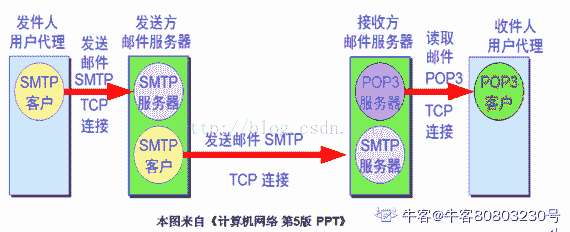
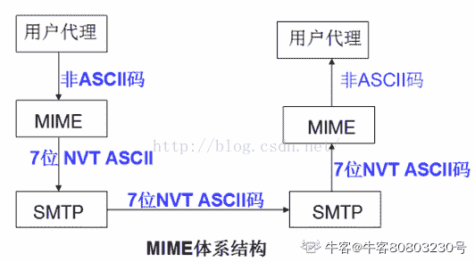
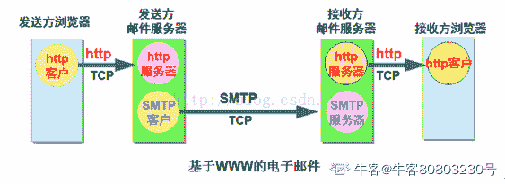
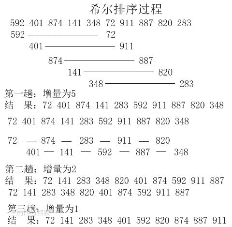
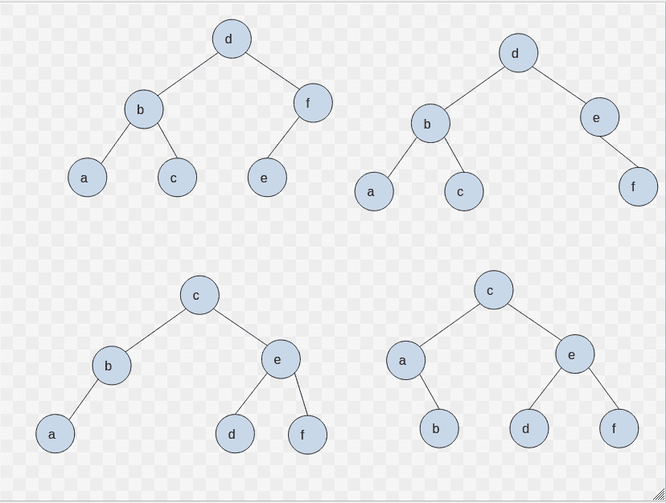
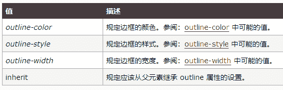
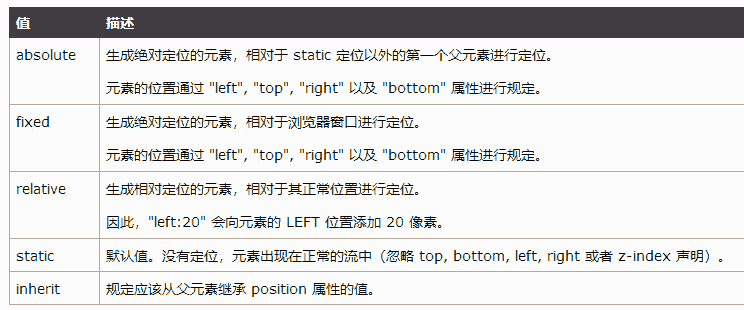

# 网易 2018 实习生招聘笔试题-前端开发实习生

## 1

已知 a 为不为空的数组，且变量 b===a. 以下哪些方式可以清空数组, 使得 a.length 与 b.length 都为 0; 

正确答案: C   你的答案: 空 (错误)

```cpp
b.len(0)
```

```cpp
a = []
```

```cpp
a.splice(0, a.length)
```

```cpp
a = a.slice(a.length)
```

本题知识点

网易 前端工程师 2018

讨论

[offer 收割机吧](https://www.nowcoder.com/profile/3532165)

A.数组没有 len()方法 B.变量 a,b 只是指向数组的指针，a=[]相当于改变了 a 指向的对象而已，a.length=0,b 还是指向原来的数组，所以 b.length 不为 0；C.数组的 splice(0，a.length)方法执行后返回的是被删除的项，执行后删除了数组的每一项，原数组发生改变。D.数组的 slice(a.length)方法执行后返回空数组，赋值给 a,但是这个方法对原数组不会产生影响，所以 b.length 不为 0。个人见解，欢迎指正。

编辑于 2018-06-01 20:55:39

* * *

[QQ 群](https://www.nowcoder.com/profile/968354)

B 选项：相当于 a 指向了一个新的数组，新数组为空数组。结果是：a.length=0; b.length!=0C 选项：从数组的 index=0 开始删除元素，删除 a.length 个元素。自然 a、b 所指向的这个共同数组变成了空数组。结果：a.length=b.length=0D 选项：a 指向了空数组，但是 b 指向的原来数组并没有发生变化。结果：a.length=0; b.length!=0\.splice(0,4)：从数组的 index=0 开始删除元素，删除 4 个元素。splice(0,4,2,3,4)：从数组的 index=0 开始删除元素，删除 4 个元素。然后在当前位置插入元素：2，3，4
slice(0,4)：从数组的 index=0 位置开始，index=3 结束，选取该子数组的内容放入新的数组。

发表于 2018-07-22 16:15:54

* * *

[给蹭过车的老司机递烟解乏](https://www.nowcoder.com/profile/7480872)

splice() 接受三个参数  会改变原数组 返回的是被删除的项

slice() 接受 2 个参数 截取 不会改变原数组 返回的是截取的区间

发表于 2018-06-20 09:44:07

* * *

## 2

关于 http 协议以下说法不正确的是：
1.304 表示临时重定向
2.range 请求响应一定是用 http 状态码 206 表示成功
3.http 的 header 分割符是\r
4.请求参数如果包含%，需要进行 encode

正确答案: A   你的答案: 空 (错误)

```cpp
1，3
```

```cpp
1，4
```

```cpp
2，3
```

```cpp
2，4
```

```cpp
3，4
```

本题知识点

网易 前端工程师 前端工程师 网易 2018

讨论

[♂☆＊很＆;简单＇£](https://www.nowcoder.com/profile/2046864)

HTTP 304 未改变说明无需再次传输请求的内容,也就是说可以使用缓存的内容 301 永久重定向、302 暂时重定向 http 请求字段 range:    格式： Range: bytes=start-end
    请求资源的部分内容（不包括响应头的大小），单位是 byte，即字节，从 0 开始.

    如果服务器能够正常响应的话，服务器会返回 206 Partial Content 的状态码及说明.

    如果不能处理这种 Range 的话，就会返回整个资源以及响应状态码为 200 OK .http 的 header 分割符：\r\n 

编辑于 2018-05-31 02:06:00

* * *

[社会你山哥](https://www.nowcoder.com/profile/966385720)

1.  HTTP304 表示客户端发送附带条件请求时，服务器端允许请求访问资源，HTTP **304**** 未改变**说明无需再次传输请求的内容，也就是说可以使用缓存的内容。这通常是在一些安全的方法（[safe](https://developer.mozilla.org/en-US/docs/Glossary/safe)），例如[GET](https://developer.mozilla.org/zh-CN/docs/Web/HTTP/Methods/GET) 或[HEAD](https://developer.mozilla.org/zh-CN/docs/Web/HTTP/Methods/HEAD) 或在请求中附带了头部信息： [If-None-Match](https://developer.mozilla.org/zh-CN/docs/Web/HTTP/Headers/If-None-Match) 或[If-Modified-Since](https://developer.mozilla.org/zh-CN/docs/Web/HTTP/Headers/If-Modified-Since)。304 与重定向无关.表示临时重定向的是 302
2.  HTTP **206 Partial Content** 成功状态响应代码表示请求已成功，并且主体包含所请求的数据区间，该数据区间是在请求的 [Range](https://developer.mozilla.org/zh-CN/docs/Web/HTTP/Headers/Range) 首部指定的。
3.  HTTP 报文首部与报文主体，即 header 与 body 的分隔符为 CR+LF，即\r\n

4.  当请求参数包含 ASCII 标点时，需要通过 encodeURIComponent()进行编码

发表于 2018-08-10 16:15:51

* * *

[小野市](https://www.nowcoder.com/profile/9391147)

```cpp
A: 301 永久重定向，302 暂时重定向
B: 请求资源的部分内容（不包括响应头的大小），单位是 byte，即字节，从 0 开始.
   如果服务器能够正常响应的话，服务器会返回 206 Partial Content 的状态码及说明.
   如果不能处理这种 Range 的话，就会返回整个资源以及响应状态码为 200 OK.
C: http 的 header 分割符：\r\n
D: encodeURI()函数：该方法不会对 ASCII 字母和数字进行编码，也不会对这些 ASCII 标点符号进行编码： - _ . ! ~ * ' ( ) 。
   该方法的目的是对 URI 进行完整的编码，因此对以下在 URI 中具有特殊含义的 ASCII 标点符号，encodeURI() 函数是不会进行转义的：;/?:@&=+$,#
encodeURIComponent() 函数：该方法不会对 ASCII 字母和数字进行编码，也不会对这些 ASCII 标点符号进行编码： - _ . ! ~ * ' ( ) 。
其他字符（比如 ：;/?:@&=+$,# 这些用于分隔 URI 组件的标点符号），都是由一个或多个十六进制的转义序列替换的。

```

发表于 2018-07-07 10:29:34

* * *

## 3

关于电子邮件协议，下面说法正确的是？(1)POP3 的特点是只要用户从服务器上读取了邮件，就把该邮件删除(2)IMAP 协议不支持创建自定义的文件夹(3)IMAP 协议中客户端和服务器上的邮件保持同步(4)SMTP 能发送 ASCII 码和二进制文件

正确答案: C   你的答案: 空 (错误)

```cpp
(1)(3)(4)
```

```cpp
(1)(2)(3)
```

```cpp
(1)(3)
```

```cpp
(1)(4)
```

```cpp
(2)(3)
```

```cpp
(1)(2)(3)(4)
```

本题知识点

网易 前端工程师 前端工程师 网易 2018

讨论

[徐帅武](https://www.nowcoder.com/profile/6080182)

这里应该说的都是原始版本的协议，因为扩展和改进后的协议都跟答案不太符合。**POP3**：POP 支持离线邮件处理。其具体过程是：邮件发送到服务器上，电子邮件客户端调用邮件客户机程序以连接服务器，并下载所有未阅读的电子邮件。这种离线访问模式是一种存储转发服务，将邮件从邮件服务器端送到个人终端机器上，一般是 PC 机或 MAC。一旦邮件发送到 PC 机或 MAC 上，邮件服务器上的邮件将会被删除。但目前的 POP3 邮件服务器大都可以“只下载邮件，服务器端并不删除”，也就是改进的 POP3 协议。**SMTP**：SMTP 是一个相对简单的基于文本的协议。在其之上指定了一条消息的一个或多个接收者（在大多数情况下被确认是存在的），然后消息文本会被传输。由于这个协议开始是基于纯 ASCII 文本的，它在二进制文件上处理得并不好。诸如 MIME 的标准被开发来编码二进制文件以使其通过 SMTP 来传输。今天，大多数 SMTP 服务器都支持 8 位 MIME 扩展，它使二进制文件的传输变得几乎和纯文本一样简单。**IMAP**：IMAP 由 Mark Crispin 设计，对于邮件访问提供了相对于广泛使用的 POP3 邮件协议的另外一种选择。基本上，两者都允许一个邮件客户端访问邮件服务器上存储的信息。一些只在 IMAP 中存在的重要方面包括：
> + 支持连接和断开两种操作模式。当使用 POP3 时，客户端只会在一段时间内连接到服务器，直到它下载完所有新信息，客户端即断开连接。在 IMAP 中，只要用户界面是活动的和下载信息内容是需要的，客户端就会一直连接服务器。对于有很多或者很大邮件的用户来说，使用 IMAP4 模式可以获得更快的响应时间。> + 支持多个客户同时连接到一个邮箱。POP3 协议假定邮箱当前的连接是唯一的连接。相反，IMAP4 协议允许多个用户同时访问邮箱同时提供一种机制让客户能够感知其他当前连接到这个邮箱的用户所做的操作。> + 支持访问消息中的 MIME 部分和部分获取。几乎所有的 Internet 邮件都是以 MIME 格式传输的。MIME 允许消息包含一个树型结构，这个树型结构的叶子节点都是单一内容类型而非叶子节点都是多块类型的组合。IMAP4 协议允许客户端获取任何独立的 MIME 部分和获取信息的一部分或者全部。这些机制使得用户无需下载附件就可以浏览消息内容或者在获取内容的同时浏览。> + 支持在服务器保留消息状态信息。通过使用在 IMAP4 协议中定义的标志客户端可以跟踪消息状态，例如邮件是否被读取，回复，或者删除。这些标识存储在服务器，所以多个客户在不同时间访问一个邮箱可以感知其他用户所做的操作。> + 支持在服务器上访问多个邮箱。IMAP4 客户端可以在服务器上创建，重命名，或删除邮箱（**通常以文件夹形式显现给用户**）。支持多个邮箱还允许服务器提供对于共享和公共文件夹的访问。> + 支持服务器端搜索。IMAP4 提供了一种机制给客户使客户可以要求服务器搜索匹配多个标准的信息。在这种机制下客户端就无需下载邮箱中所有信息来完成这些搜索。> + 支持一个定义良好的扩展机制。吸取早期 Internet 协议的经验，IMAP 的扩展定义了一个明确的机制。很多对于原始协议的扩展已被提议并广泛使用。无论使用 POP3 还是 IMAP4 来获取消息，客户端均使用 SMTP 协议来发送消息。邮件客户端可能是 POP 客户端或者 IMAP 客户端，但都会使用 SMTP。

发表于 2018-05-31 09:29:08

* * *

[牛客 80803230 号](https://www.nowcoder.com/profile/80803230)

邮件的发送和接收过程——STMP、POP、IMAP、MIME

电子邮件发送协议 是一种基于“ 推 ”的协议，主要包括 SMTP ； 邮件接收协议 则是一种基于“ 拉 ”的协议，主要包括 POP 协议 和 IMAP 协议 ，在正式介绍这些协议之前，我们先给出邮件收发的体系结构：

 

 从上图可以看出邮件收发的整个过程大致如下：

       （1）发件人调用用户代理编辑要发送的邮件。

       （2）发件人点击屏幕上的”发送邮件“按钮，把发送邮件的 工作全部交给用户代理来完成。用户代理通过 SMTP 协议将邮件发送给发送方的邮件服务器（在这个过程中，用户代理充当 SMTP 客户，而发送方的邮件服务器则充当 SMTP 服务器）。

       （3）发送方的邮件服务器收到用户代理发来的邮件后，就把收到的邮件临时存放在邮件缓存队列中，等待时间成熟的时候再发送到接收方的邮件服务器（等待时间的长短取决于邮件服务器的处理能力和队列中待发送的信件的数量 ）。

       （4）若现在时机成熟了，发送方的邮件服务器则向接收方的邮件服务器发送邮件缓存中的邮件。在发送邮件之前，发送方的邮件服务器的 SMTP 客户与接收方的邮件服务器的 SMTP 服务器需要事先建立 TCP 连接，之后再将队列中 的邮件发送出去。值得注意的是，邮件不会在因特网中的某个中间邮件服务器落地 。

       （5）接收邮件服务器中的 SMTP 服务器进程在收到邮件后，把邮件放入收件人的用户邮箱中，等待收件人进行读取。

       （6）收件人在打算收信时，就运行 PC 机中的用户代理，使用 POP3（或 IMAP）协议读取发送给自己的邮件。 注意，在这个过程中，收件人是 POP3 客户，而接收邮件服务器则是 POP3 客户，箭头的方向是从邮件服务器指向接收用户，因为这是一个“拉 ”的操作 。

       下面我们根据上面的总体过程介绍下各个组件。

        1.用户代理

        用户代理 UA （ User Agent ）是一个软件包（程序），它的功能是：撰写、阅读、回复和转发报文，还能处理邮箱（如创建收信箱和发信箱）。共有两种类型的用户代理： 命令驱动 和 GUI 。 命令驱动 属于早期的电子邮件，通过命令发送和接收邮件，而 GUI 则是包含图形界面，允许用户使用键盘和鼠标与软件进行交互。

       2\. SMTP 协议

        SMTP 协议 服务器的熟知端口号为 25 ，与之前总结过的 telnet 协议和 FTP 协议类似的地方是，SMTP 协议的客户端和服务器端都是通过命令和响应的形式进行交互 ，即 SMTP 客户通过命令向 SMTP 服务器发送操作请求，而服务器则通过 3 位的数字对响应的请求作出响应。SMTP 规定了 14 条命令和 21 中应答信息，每条命令有 4 个字母组成，而每一种应答一般只有一行信息，有一个 3 位数字的代码开始，后面附上很简单的附加说明。

  邮件传送主要包括 3 个阶段： 建立连接 、 邮件传送 和 终止连接 。

       建立连接阶段：

       1.当 SMTP 客户端每隔一定时间对邮件缓存扫描一次，如发现有邮件，就使用 SMTP 的熟知端口号 25 与接收方的邮件服务器的 SMTP 服务器建立 TCP 连接。

       2.接收方 SMTP 服务器发出“220 Service ready"告诉客户端它已经准备好接收邮件。若服务器未就绪，它就发送代码 421（服务器不可用）。

       3.客户发送 HELO 报文，并使用它的域名地址标志自己。目的是：用来把客户的域名通知服务器，值得注意的是， 在 TCP 的连接建立阶段，发送方和接收方都是通过它们的 IP 地址来告诉对方的 。（HELO 报文是最初的，用户名和密码都不加密。现在改为 EHLO，用户名和密码都进行 base64 编码发送）

       4.服务器响应代码 250（请求命令完成）或根据情况的其他一些代码。

      报文传送阶段：

       在 SMTP 客户与服务器之间建立连接后，发件人就可以与一个或多个收件人交换单个的报文了。若收件人超过一个，则下面步骤 3 和步骤 4 将重复进行。

        1.客户发送 MAIL FROM 报文介绍报文的发送者。它包括发送人的邮件地址（邮箱名和域名，如 house@qq）。这个步骤是必要的：因为可以给服务器在返回差错或报文时的返回邮件地址 。

        2.服务器响应代码 250（请求命令完成）或其他适当的代码。

        3.客户发送 RCPT（收件人）报文，包括收件人的邮件地址，RCPT 命令的作用是 ： 先弄清接收方系统是否已经准备好接收邮件的准备，然后才发送邮件，这样做视为了避免浪费通信资源，不至于发送了很长的邮件以后才知道是因地址错误 。

        4.服务器响应代码 250 或其他适当的代码。

        5.客户发送 DATA 报文对报文的传送进行初始化，DATA 命令表示要开始传送邮件的内容了。

        6.服务器响应代码"354 Start mail input: end with <CRLF>.<CRLF>"或其他适当的报文（如 421 服务器不可用，500 命令无法识别）。

        7.客户用连续的行发送报文的内容。每一行的行结束时输入 <CRLF>.<CRLF> ，即回车换行.回车换行，表示邮件内容结束。

        8.服务器响应代码（250 请求命令完成）或其他适当的代码。

        值得注意的是：虽然 SMTP 使用 TCP 连接试图使邮件的传送可靠，但它并不能保证不丢失邮件。也就是说，使用 SMTP 传送邮件只能说可以可靠地传送接收方的邮件服务器，在往后的情况就不知道了。接收方的邮件服务器也许会出故障，使收到的服务器全部丢失（在收件人读取信件之前）。

        终止连接

        在报文传送成功后，客户就终止连接。包括如下步骤：

        1.客户发送 QUIT 命令。

        2.服务器响应 221（服务关闭）或其他代码。

        在连接终止阶段后，TCP 连接必须关闭。

        3.POP 协议

        POP 协议， Post office Protocal 。邮件交付的第一阶段和第二阶段使用 SMTP，而第三阶段则使用邮件读取协议。SMTP 是一个 push 协议,而第三阶段则使用 pull 协议，包括 POP 和 IMAP 协议，POP 主要使用 POP3，而 IMAP 协议则主要使用 IMAP4 。

        POP3 采用 C/S 的工作方式。在接收邮件的用户 PC 机中的用户代理 UA 必须运行 POP3 的客户程序，而在收件人所连接的 ISP 的邮件服务器中则运行 POP 的服务器程序。POP 服务器只有在用户输入鉴别信息（用户名+密码）后，才允许对方对邮箱进行读取 。

        POP3 有 两种工作方式 ：删除方式和保存方式。删除方式 就在每一次读取邮件后就把邮箱中的这个邮件删除， 保存方式 就是在读取邮件后仍然在邮箱中保存这个邮件，该方式是通过对之前的 POP3 工作方式（即删除）的缺点进行弥补，对功能进行扩充。

         4\. IMAP 协议

        IMAP 协议， Internet Mail Access Protocal （因特网邮件读取协议）。 IMAP 协议比 POP3 协议复杂的多，也是按照 C/S 的工作方式，现在较新的版本是 IMAP4。

        在使用 IMAP 时，用户的 PC 机上运行 IMAP 客户程序，然后与接收方的邮件服务器上的 IMAP 服务器程序建立 TCP 连接。 POP3 不允许用户在邮件服务器上整理自己的邮件，用户在服务器上不能不同的文件夹，POP3 也不允许用户在下载邮件之前读取邮件的部分内容，而 IMAP 则克服了这些 POP3 的缺点，说白了就是 POP3 协议不太愿意让用户直接操作服务器，而 IMAP 正好客户了这些缺点 。

        IMAP4 提供了以下功能（ 这些功能 POP3 则没有 ）：

        1.用户在下载邮件之前可以检查邮件的首部。

        2.用户在下载邮件之前可以用特定的字符串搜索电子邮件的内容。

        3.用户可以部分地下载电子邮件。

        4.用户可以在邮件服务器上创建、删除邮箱，或对邮箱重命名。（IMAP 是双向的，可以同步本地修改到服务端；POP 只能同步服务端到本地）

        5.为了存放电子邮件，用户可以在文件夹中创建分层次的邮箱。

        注意 ：不用把邮件的发送协议 SMTP 协议与邮件的读取协议 POP 或 IMAP 协议弄混淆了。发送人的 UA 向发送邮件服务器发送邮件，以及发送方的邮件服务器向接受方的邮件服务器发送邮件都是采用 SMTP 协议，而收件人的 UA 从邮件接收服务器中接收文件则采用的是 POP 协议或 IMAP 协议。

       5\. MIME

        MIME 协议( Multipurpose Internet Mail Extensions )，通用因特网邮件扩充协议 ，作为 SMTP 的一种辅助协议，其引入是为了克服 SMTP 的如下不足：

        1.SMTP 只能发送使用 NVT（ 虚拟网络终端 ） 7 位 ASCII 码格式的报文，它不能使用 NVT 7 位 ASCII 码不支持的语言（如汉语，日语，德语等）。

        2.SMTP 不能传送可执行文件或其他二进制对象（如图像文件）。

        3.SMTP 不支持音频或视频文件。

        4.SMTP 发送的邮件的长度受到限制。

        为了克服以上的不足，便引入了 MIME 协议，MIME 协议是一种扩展协议性的辅助协议，“扩充”指的是只是对原来协议的扩展，而不是取代。它允许非 ASCII 码数据能够通过电子邮件传送。MIME 在发送方把非 ASCII 码数据转换为 NVT ASCII 数据，之后的工作再交给 SMTP 完成，在接收方再将 NVT ASCII 数据还原成原来的数据。MIME 的体系结构如下：

 

MIME 定义了 5 种首部，用来加在原始的电子邮件部分以定义参数的转换，这五种首部分别是： MIME-Version(MIME 版本 )、 Constent-Type ( 内容类型 )、 Content-Transfer-Encoding （ 内容-传送-编码 ）、 Content-Id ( 内容-标识 ）和 Content-Description ( 内容描述 )。

        MIME 版本 ：定义了 MIME 使用的版本。

       内容-类型 ：定义报文主体使用的数据类型和子类型，用<数据类型/子类型>表示。

        内容-传送-编码 ：定义了邮件的主体在传送时是如何编码的。

        内容-标识 ：在多报文的环境中唯一地标识报文。

        内容描述 ：定义了主体是否为图像、音频或视频。

        6\. 基于 WWW 的邮件

        基于 WWW 的邮件收发系统的体系结构与普通的电子邮件收发系统不同，基于 WWW 的邮件收发系统的整个过程描述如下：

        1.从发送者的浏览器传送到发送方邮件服务器是通过 HTTP 协议（而一般的则是通过 SMTP 协议）。

        2.从发送方服务器到接收方邮件服务器是通过 SMTP 协议（与一般的相同）。

        3.从接收方到接收者是通过 HTTP 协议（而一般的则是 POP3 协议或 IMAP 协议）。

        具体如下图所示：

 

发表于 2020-04-05 17:17:33

* * *

## 4

已知一棵树具有 10 个节点，且度为 4，那么：

正确答案: D   你的答案: 空 (错误)

```cpp
该树的高度至少是 6
```

```cpp
该树的高度至多是 6
```

```cpp
该树的高度至少是 7
```

```cpp
该树的高度至多是 7
```

本题知识点

网易 前端工程师 前端工程师 网易 2018

讨论

[颖小瑶🐼](https://www.nowcoder.com/profile/1957600)

树的基本术语：节点：表示树中的元素，包括数据项及若干指向某子树的分支节点的度：节点拥有的子树数叶子：度为 0 的节点，又称为终端节点孩子：节点子树的根称为该节点的孩子，该节点称为其孩子节点的双亲兄弟：同一双亲的孩子树的度：一棵树中各节点的度的最大值节点的层次：从根节点算起，根为第一层，它的孩子为第二层......深度：树中节点的最大层次森林：m(m>=0)棵互不相交的树的集合度为 4 说明有一个节点有 4 个孩子，并且其它节点的孩子不可能大于 4，因此该树的高度至少为 3，至多为 7

发表于 2018-08-10 16:34:39

* * *

[你把你 offer 给我交了](https://www.nowcoder.com/profile/7815107)

度为四就是至少要有一个结点有四个孩子，然后其他都一个孩子的话就能求出最大层数了

发表于 2018-06-26 20:00:01

* * *

[QQ 群](https://www.nowcoder.com/profile/968354)

度：父节点的最大子节点数目。此题目，就假设有一个节点的子节点数目为 4，其它的节点的子节点数目都为 1，可以计算出高度为 7。此时为最大高度。

发表于 2018-05-31 14:51:30

* * *

## 5

对于以下关键字{55，26，33，80，70，90，6，30，40，20}，增量取 5 的希尔排序的第一趟的结果是：

正确答案: B   你的答案: 空 (错误)

```cpp
55，33，30，6，80，70，40，20，26，90
```

```cpp
55，6，30，40，20，90，26，33，80，70
```

```cpp
55，6，33，30，40，70，20，26，80，90
```

```cpp
55， 26，6，40，30，90，33，70，80，20
```

本题知识点

网易 前端工程师 2018

讨论

[颖小瑶🐼](https://www.nowcoder.com/profile/1957600)

增量为 5，即步长为 5[0]55 [5]90  排序后为 [0]55 [5]90[1]26 [6]6   排序后为  [1]6   [6]26[2]33 [7]30 排序后为  [2]30 [7]33[3]80 [8]40 排序后为  [3]40 [8]80[4]70 [9]20 排序后为  [4]20 [9]70 即 55，6，30，40，20，90，26，33，80，70

发表于 2018-08-10 18:21:42

* * *

[小野市](https://www.nowcoder.com/profile/9391147)

每一次增量 >>1

发表于 2018-07-07 10:54:49

* * *

[QQ 群](https://www.nowcoder.com/profile/968354)

增量为 5，则每 5 个数分为一组，组与组之间的数字一一对比，然后排序。

发表于 2018-05-31 14:54:09

* * *

## 6

设二叉排序树中关键字由 1 到 999 的整数构成，现要查找关键字为 321 的节点，下面关键字序列中，不可能出现在二叉排序树上的查找序列是：

正确答案: B   你的答案: 空 (错误)

```cpp
2、252、400 、398、300、344、310、321
```

```cpp
888、231、911、244、898、256、362、366
```

```cpp
888、200、666、240、312、330、321
```

```cpp
2、398、387、219、266、283、298、321
```

本题知识点

网易 前端工程师 前端工程师 网易 2018

讨论

[NIGRUM](https://www.nowcoder.com/profile/8817195)

以 A 选项为例：第一步找到 2,2 小于 321，所以要找比 2 大的，找到 252,252 小于 321，所以继续找比 252 大的，找到 400，400 比 321 大，所以接下来要找比 400 小的，以此类推，直至找到 321。B 选项错在 362 至 366 处，找到 362 比 321 大，所以应该找比 362 小的，但是找的 366 更大，所以是错的。

发表于 2018-06-27 16:24:00

* * *

[QQ 群](https://www.nowcoder.com/profile/968354)

二叉排序树：左子树的所有节点值小于根节点，右子树的所有节点值大于根节点。B 选项：231 小于 888，所以肯定在 888 的左边，911 大于 888，那么 911 在 888 的右边。那么，接下来的数字应该都在 888 的右边，所以不应该出现小于 888 的数。

发表于 2018-05-31 14:57:14

* * *

[小野市](https://www.nowcoder.com/profile/9391147)

当前节点比 321 大，则接下来的结点比当前节点都小。当前节点比 321 小，则接下来的结点比当前节点都大。

发表于 2018-07-07 10:59:58

* * *

## 7

下列关于 UDP 通信的说法错误的是（）

正确答案: C   你的答案: 空 (错误)

```cpp
发送数据之前不需要建立连接
```

```cpp
没有拥塞控制
```

```cpp
传输数据的时候对报文长度没有要求
```

```cpp
一般用在数据传输要求不高的场合
```

本题知识点

网易 前端工程师 前端工程师 网易 2018

讨论

[小野市](https://www.nowcoder.com/profile/9391147)

TCP 的优点： 可靠，稳定 TCP 的可靠体现在 TCP 在传递数据之前，会有三次握手来建立连接，而且在数据传递时，有确认、窗口、重传、拥塞控制机制，在数据传完后，还会断开连接用来节约系统资源。 TCP 的缺点： 慢，效率低，占用系统资源高，易被攻击 TCP 在传递数据之前，要先建连接，这会消耗时间，而且在数据传递时，确认机制、重传机制、拥塞控制机制等都会消耗大量的时间，而且要在每台设备上维护所有的传输连接，事实上，每个连接都会占用系统的 CPU、内存等硬件资源。 而且，因为 TCP 有确认机制、三次握手机制，这些也导致 TCP 容易被人利用，实现 DOS、DDOS、CC 等攻击。
UDP 的优点： 快，比 TCP 稍安全 UDP 没有 TCP 的握手、确认、窗口、重传、拥塞控制等机制，UDP 是一个无状态的传输协议，所以它在传递数据时非常快。没有 TCP 的这些机制，UDP 较 TCP 被攻击者利用的漏洞就要少一些。但 UDP 也是无法避免攻击的，比如：UDP Flood 攻击…… UDP 的缺点： 不可靠，不稳定 因为 UDP 没有 TCP 那些可靠的机制，在数据传递时，如果网络质量不好，就会很容易丢包。 基于上面的优缺点，那么： 什么时候应该使用 TCP： 当对网络通讯质量有要求的时候，比如：整个数据要准确无误的传递给对方，这往往用于一些要求可靠的应用，比如 HTTP、HTTPS、FTP 等传输文件的协议，POP、SMTP 等邮件传输的协议。 在日常生活中，常见使用 TCP 协议的应用如下： 浏览器，用的 HTTP FlashFXP，用的 FTP Outlook，用的 POP、SMTP Putty，用的 Telnet、SSH QQ 文件传输 ………… 什么时候应该使用 UDP： 当对网络通讯质量要求不高的时候，要求网络通讯速度能尽量的快，这时就可以使用 UDP。 比如，日常生活中，常见使用 UDP 协议的应用如下： QQ 语音 QQ 视频 TFTP ……TCP 与 UDP 区别总结：1、TCP 面向连接（如打电话要先拨号建立连接）;UDP 是无连接的，即发送数据之前不需要建立连接
2、TCP 提供可靠的服务。也就是说，通过 TCP 连接传送的数据，无差错，不丢失，不重复，且按序到达;UDP 尽最大努力交付，即不保证可靠交付
3、TCP 面向字节流，实际上是 TCP 把数据看成一连串无结构的字节流;UDP 是面向报文的
UDP 没有拥塞控制，因此网络出现拥塞不会使源主机的发送速率降低（对实时应用很有用，如 IP 电话，实时视频会议等）
4、每一条 TCP 连接只能是点到点的;UDP 支持一对一，一对多，多对一和多对多的交互通信
5、TCP 首部开销 20 字节;UDP 的首部开销小，只有 8 个字节
6、TCP 的逻辑通信信道是全双工的可靠信道，UDP 则是不可靠信道

发表于 2018-07-07 11:03:24

* * *

[NIGRUM](https://www.nowcoder.com/profile/8817195)

UDP 提供了无连接通信，且不对传送数据包进行可靠性保证，适合于一次传输少量数据

发表于 2018-06-27 16:26:28

* * *

[浩瀚书海](https://www.nowcoder.com/profile/576968606)

1

发表于 2018-08-11 11:03:24

* * *

## 8

关于 HTTP1.0 和 HTTP1.1 错误的是()

正确答案: A   你的答案: 空 (错误)

```cpp
HTTP1.0 只能短连接，而 HTTP1.1 只能长连接
```

```cpp
HTTP1.0 通信的时候会占用大量内存，而 HTTP1.1 可以避免这样的情况
```

```cpp
状态码 100 只适用于 HTTP1.1 版本
```

```cpp
HTTP1.1 在 Request 消息头里多了一个 Host 域,HTTP1.0 则没有这个域
```

本题知识点

网易 前端工程师 前端工程师 网易 2018

讨论

[小野市](https://www.nowcoder.com/profile/9391147)

1、HTTP 1.1 支持长连接（PersistentConnection）和请求的流水线（Pipelining）处理

HTTP 1.0 规定浏览器与服务器只保持短暂的连接，浏览器的每次请求都需要与服务器建立一个 TCP 连接，服务器完成请求处理后立即断开 TCP 连接，服务器不跟踪每个客户也不记录过去的请求。

HTTP 1.1 则支持持久连接 Persistent Connection, 并且默认使用 persistent  connection. 在同一个 tcp 的连接中可以传送多个 HTTP 请求和响应. 多个请求和响应可以重叠，多个请求和响应可以同时进行. 更加多的请求头和响应头(比如 HTTP1.0 没有 host 的字段).

在 1.0 时的会话方式：
 1\. 建立连接
 2\. 发出请求信息
 3\. 回送响应信息
 4\. 关掉连接

 HTTP 1.1 的持续连接，也需要增加新的请求头来帮助实现，例如，Connection 请求头的值为 Keep-Alive 时，客户端通知服务器返回本次请求结果后保持连接；Connection 请求头的值为 close 时，客户端通知服务器返回本次请求结果后关闭连接。HTTP 1.1 还提供了与身份认证、状态管理和 Cache 缓存等机制相关的请求头和响应头。

请求的流水线（Pipelining）处理，在一个 TCP 连接上可以传送多个 HTTP 请求和响应，减少了建立和关闭连接的消耗和延迟。例如：一个包含有许多图像的网页文件的多个请求和应答可以在一个连接中传输，但每个单独的网页文件的请求和应答仍然需要使用各自的连接。  HTTP 1.1 还允许客户端不用等待上一次请求结果返回，就可以发出下一次请求，但服务器端必须按照接收到客户端请求的先后顺序依次回送响应结果，以保证客户端能够区分出每次请求的响应内容。

2.HTTP 1.1 增加 host 字段

在 HTTP1.0 中认为每台服务器都绑定一个唯一的 IP 地址，因此，请求消息中的 URL 并没有传递主机名（hostname）。但随着虚拟主机技术的发展，在一台物理服务器上可以存在多个虚拟主机（Multi-homed Web Servers），并且它们共享一个 IP 地址。

 HTTP1.1 的请求消息和响应消息都应支持 Host 头域，且请求消息中如果没有 Host 头域会报告一个错误（400 Bad Request）。此外，服务器应该接受以绝对路径标记的资源请求。

3、100(Continue) Status(节约带宽)

HTTP/1.1 加入了一个新的状态码 100（Continue）。客户端事先发送一个只带头域的请求，如果服务器因为权限拒绝了请求，就回送响应码 401（Unauthorized）；如果服务器接收此请求就回送响应码 100，客户端就可以继续发送带实体的完整请求了。100 (Continue) 状态代码的使用，允许客户端在发 request 消息 body 之前先用 request header 试探一下 server，看 server 要不要接收 request body，再决定要不要发 request body。

4、HTTP/1.1 中引入了 Chunked transfer-coding 来解决上面这个问题，发送方将消息分割成若干个任意大小的数据块，每个数据块在发送时都会附上块的长度，最后用一个零长度的块作为消息结束的标志。这种方法允许发送方只缓冲消息的一个片段，避免缓冲整个消息带来的过载。

5、HTTP/1.1 在 1.0 的基础上加入了一些***的新特性，当缓存对象的 Age 超过 Expire 时变为 stale 对象，***不需要直接抛弃 stale 对象，而是与源服务器进行重新激活（revalidation）。

发表于 2018-07-07 11:12:48

* * *

[刘飞奇侠](https://www.nowcoder.com/profile/69869616)

HTTP1.1 一般是长连接，不是只能长连接

发表于 2018-06-02 00:42:16

* * *

## 9

下面关于进程和线程说法错误的是（）

正确答案: B   你的答案: 空 (错误)

```cpp
进程是系统进行资源分配和调度的基本单位，而线程是 CPU 调度和分配的基本单位
```

```cpp
线程也拥有自己的系统资源
```

```cpp
一个线程可以创建和撤销另一个线程
```

```cpp
一个进程中的多个线程共享资源
```

本题知识点

网易 前端工程师 前端工程师 网易 2018

讨论

[小野市](https://www.nowcoder.com/profile/9391147)

进程与线程区别 1) 简而言之,一个程序至少有一个进程,一个进程至少有一个线程.2) 线程的划分尺度小于进程，使得多线程程序的并发性高。
3) 另外，进程在执行过程中拥有独立的内存单元，而多个线程**共享**内存，从而极大地提高了程序的运行效率。
4) 线程在执行过程中与进程还是有区别的。每个独立的线程有一个程序运行的入口、顺序执行序列和程序的出口。但是线程不能够独立执行，必须依存在应用程序中，由应用程序提供多个线程执行控制。
5) 从逻辑角度来看，多线程的意义在于一个应用程序中，有多个执行部分可以同时执行。**但操作系统并没有将多个线程看做多个独立的应用，来实现进程的调度和管理以及资源分配**。这就是进程和线程的重要区别。C: **一般情况下，线程在其主体函数退出的时候会自动终止，但同时也可以因为接收到另一个线程发来的终止（取消）请求而强制终止。****    同时，一个线程可以创建另一个线程。**线程是不分父子线程的，一个线程创建另一个线程，尽管第一个线程已经结束，第二个线程还是可以照常运行。线程的属性：①轻型实体。它不拥有系统资源，只是有一点必不可少的、能保证独立运行的资源。
②独立调度和分派的基本单位。在多线程 OS 中，线程是独立运行的基本单位，因而也是独立调度和分派的基本单位，但由于线程很轻，故线程的切换非常迅速且开销小。
③可并发执行。在一个进程中的多个线程之间可以并发执行，甚至允许在一个进程中的所有线程都能并发执行；同样，不同进程中的线程也能并发执行。
④共享进程资源。

发表于 2018-07-07 11:24:08

* * *

[QQ 群](https://www.nowcoder.com/profile/968354)

线程自己拥有：状态和计数器同一个进程内的线程共享这个进程的资源所有线程是没有自己的系统资源的，多个线程是交替使用其进程的资源

发表于 2018-05-31 15:02:40

* * *

## 10

已知中序遍历的序列为 abcdef，高度最小的不可能的二叉树的前序遍历是

正确答案: D   你的答案: 空 (错误)

```cpp
dbacfe
```

```cpp
dbacef
```

```cpp
cbaedf
```

```cpp
cabefd
```

本题知识点

网易 前端工程师 前端工程师 网易 2018

讨论

[～~_~～](https://www.nowcoder.com/profile/5569912)

1\. 高度最小=>3 层；6 < 2³ - 1 2\. 中序遍历=>得到以下 4 种情况；
3\. 前序遍历=>dbacfe/dbacef/cbaedf/cabedf；
4\. D 不对。有不对的地方望指正。

发表于 2018-06-12 08:52:13

* * *

[Olivia_dtt](https://www.nowcoder.com/profile/232985383)

D 应该是 cabedf 才对，不然弄不到，高度最小，6 个节点 < 2 ³ - 1 = 7，所以树的高度是 3caenull b d f

发表于 2020-07-21 14:37:12

* * *

[蓝几米](https://www.nowcoder.com/profile/7807669)

没看太懂。一脸懵

发表于 2019-10-04 14:01:43

* * *

## 11

基于哈希算法在信息安全中主要应用在？(1)    文件校验(2)    数字签名(3)    鉴权协议

正确答案: D   你的答案: 空 (错误)

```cpp
(1)(2)
```

```cpp
(1)(3)
```

```cpp
(2)(3)
```

```cpp
(1)(2)(3)
```

本题知识点

网易 前端工程师 前端工程师 网易 2018

讨论

[小野市](https://www.nowcoder.com/profile/9391147)

Hash 算法在信息安全方面的应用主要体现在以下的 3 个方面：
（1)文件校验
我们比较熟悉的校验算法有奇偶校验和 CRC 校验，这 2 种校验并没有抗数据篡改的能力，它们一定程度上能检测并纠正数据传输中的信道误码，但却不能防止对数据的恶意破坏。
MD5 Hash 算法的"数字指纹"特性，使它成为目前应用最广泛的一种文件完整性校验和(Checksum)算法，不少 Unix 系统有提供计算 md5 checksum 的命令。
（2)数字签名
Hash 算法也是现代密码体系中的一个重要组成部分。由于非对称算法的运算速度较慢，所以在数字签名协议中，单向散列函数扮演了一个重要的角色。对 Hash 值，又称"数字摘要"进行数字签名，在统计上可以认为与对文件本身进行数字签名是等效的。而且这样的协议还有其他的优点。
（3) 鉴权协议
如下的鉴权协议又被称作挑战--认证模式：在传输信道是可被侦听，但不可被篡改的情况下，这是一种简单而安全的方法。以上就是一些关于 hash 以及其相关的一些基本预备知识。

发表于 2018-07-07 11:25:35

* * *

[刘飞奇侠](https://www.nowcoder.com/profile/69869616)

哈希算法在信息安全的应用主要是文件校验、数字签名、鉴权协议

发表于 2018-06-02 00:44:55

* * *

## 12

下列选项中，不可能是快速排序第 2 趟排序结果的是 （）

正确答案: C   你的答案: 空 (错误)

```cpp
4 14 10 12 8 6 18
```

```cpp
4 6 10 8 12 14 18
```

```cpp
6 4 10 8 14 12 18
```

```cpp
8 4 6 10 12 14 18
```

本题知识点

网易 前端工程师 前端工程师 网易 2018

讨论

[小野市](https://www.nowcoder.com/profile/9391147)

**两趟排序后至少有两个数在正确的位置上。**       快速排序是由东尼·霍尔所发展的一种排序算法。在平均状况下，排序 n 个元素要 O(nlogn)次比较。在最坏状况下则需要 O(n²)次比较，但这种状况并不常见。事实上，快速排序通常明显比其他 O(nlogn)算法更快，因为它的内部循环可以在大部分的架构上很有效率地被实现出来。
       快速排序使用分治策略(Divide and Conquer)来把一个序列分为两个子序列。步骤为：
①从序列中挑出一个元素，作为"基准"(pivot).
②把所有比基准值小的元素放在基准前面，所有比基准值大的元素放在基准的后面（相同的数可以到任一边），这个称为分区(partition)操作。
③对每个分区递归地进行步骤 1~2，递归的结束条件是序列的大小是 0 或 1，这时整体已经被排好序了。

发表于 2018-07-07 11:28:14

* * *

[waitforuwen](https://www.nowcoder.com/profile/3076139)

```cpp
排序后 4  6  8  10  12  14  18
    A 4  14 10 12  8   6   18     //4、18 在正确位置
    B 4  6  10 8   12  14  18    //4、6、12、14、18
    C 6  4  10 8   14  12  18         //18
    D 8  4  6  10  12  14  18   //10、12、14、18
```

两趟排序后**至少有两个数**在正确的位置上
C 选项只有 18 在正确位置上，所以一定不是两趟排序后的

编辑于 2018-07-07 00:44:23

* * *

[chenmonkey](https://www.nowcoder.com/profile/3119026)

每趟排序就有一个元素排在最终的位置上 C 选项：  最终结果：4 6 8 10 12 15 18 现阶段：     6 4 10 8 14 12 18 只有最后一个数对上（18 与 18）

发表于 2018-06-12 20:12:03

* * *

## 13

下列关于 CSS 设置链接样式正确的是（）

正确答案: C   你的答案: 空 (错误)

```cpp
a:hover 可以在 a:visited 之前生效
```

```cpp
a:hover 可以在 a:link 之前生效
```

```cpp
a:active 必须位于 a:hover 之后
```

```cpp
a:active 链接被点击后的样式
```

本题知识点

网易 前端工程师 2018 CSS

讨论

[徐帅武](https://www.nowcoder.com/profile/6080182)

解析：a:link,a:visited,a:hover,a:active 分别是什么意思?1. link:连接平常的状态 2. visited:连接被访问过之后 3. hover:鼠标放到连接上的时候 4. active:连接被按下的时候
正确顺序：“爱恨原则”（LoVe/HAte），即四种伪类的首字母:LVHA。再重复一遍正确的顺序：a:link、a:visited、a:hover、a:active .
因为当鼠标经过未访问的链接，会同时拥有 a:link、a:hover 两种属性，a:link 离它最近，所以它优先满足 a:link，而放弃 a:hover 的重复定义。当鼠标经过已经访问过的链接，会同时拥有 a:visited、a:hover 两种属性，a:visited 离它最近，所以它优先满足 a:visited，而放弃 a:hover 的重复定义。究其原因，是 css 的就近原则“惹的祸”。

发表于 2018-05-31 10:46:11

* * *

[墨沫漠茉](https://www.nowcoder.com/profile/149300444)

可以这样记忆 驴哈（LVHA）

发表于 2020-10-27 19:07:42

* * *

[你把你 offer 给我交了](https://www.nowcoder.com/profile/7815107)

LoVe/HAte 爱恨原则

发表于 2018-06-26 20:49:45

* * *

## 14

下列哪些关于 cookies、localStorage 的描述是正确的？

正确答案: C   你的答案: 空 (错误)

```cpp
cookie 和 localStorage 都可以随请求头发送到后端
```

```cpp
localStorage 较 cookie 的优势之一是不受同域限制
```

```cpp
localStorage 无法通过设置失效时间来自动失效
```

```cpp
localStorage 可以存储数组等对象类型
```

本题知识点

网易 前端工程师 2018

讨论

[若即若离 2524](https://www.nowcoder.com/profile/4038639)

localStorage 作为 H5 的新添特征，与 cookie 的区别在于：只存储在客户端本地，而不会随 http 请求发送到服务器端并且只能通过手动删除缓存来清除，不能设置失效时间 sessionStorage 和 localStorage 两者虽然对存储的内容比 cookie（4k 左右）大得多（5M 左右），但是存入的东西都被转换成了字符串，也就是说无法存入数组或者对象，就算存入了也会被转化为字符串。 

发表于 2018-06-24 11:16:05

* * *

[Marsorsun](https://www.nowcoder.com/profile/970328)

《js 高程》Storage 类型只能存储字符串 非字符串数据在存储之前会被转换成字符串要访问同一个 localStorage 对象页面必须来自同一个域名（子域名无效）同一协议 同一端口

发表于 2018-08-10 13:44:04

* * *

[小野市](https://www.nowcoder.com/profile/9391147)

离线 Web 应用和客户端存储数据的能力对未来的 Web 应用越来越重要。浏览器已经能够检测到用户是否离线，并触发 JavaScript 事件以便用做出处理。可以指定在应用缓存中保存哪些文件以便离线时使用。以前，这种存储只能使用 cookie 完成， **cookie** **是一小块可以客户端设置也可以在服务器端设置****的信息**，每次发起请求时都会传送它。   cookie 的限制使其可以存储少量数据，然而对于大量数据效率很低 。Web Storage 定义了两种用于存储数据的对象： sessionStorage 和 localStorage。前者严格用于在一个浏览器会话中存储数据，因为数据在浏览器关闭后会立即删除；后者用于跨会话持久化数据并遵循跨域安全策略。
 在客户端机器上使用 JavaScript 存储大量数据

发表于 2018-07-07 12:21:38

* * *

## 15

有关 CSS 外边距 margin 说法错误的是（）

正确答案: B   你的答案: 空 (错误)

```cpp
围绕在元素边框的空白区域是外边距
```

```cpp
margin 设置为 auto 相当于设置为 0
```

```cpp
设置外边距会在元素外创建额外的「空白」
```

```cpp
设置外边距使用 margin 属性，可以接受任何长度单位、百分数值甚至负值。
```

本题知识点

网易 前端工程师 2018 CSS

讨论

[若即若离 2524](https://www.nowcoder.com/profile/4038639)

margin auto 是自动根据剩余的长度居中对齐，并不是 0

发表于 2018-06-24 11:17:58

* * *

[益阳雷佳音](https://www.nowcoder.com/profile/549218159)

围绕在元素边框的空白区域不能是内边距，把我 padding 当什么了

发表于 2020-08-10 21:21:39

* * *

[还剩 3 天](https://www.nowcoder.com/profile/980562181)

感觉 A 选项可以理解为 border 外层的空白区域 一般来说就是 margin 了

发表于 2021-11-18 10:44:07

* * *

## 16

下列关于 CSS2 中轮廓 outline 说法错误的是（）

正确答案: C   你的答案: 空 (错误)

```cpp
轮廓是绘制于元素周围的一条线
```

```cpp
轮廓位于边框边缘的外围，可起到突出元素的作用
```

```cpp
CSS outline 可以设置内外边距样式
```

```cpp
CSS outline 属性可以设置元素轮廓的颜色和宽度
```

本题知识点

网易 前端工程师 2018 CSS

讨论

[小野市](https://www.nowcoder.com/profile/9391147)

outline （轮廓）是绘制于元素周围的一条线，位于边框边缘的外围，可起到突出元素的作用。
注释：轮廓线不会占据空间，也不一定是矩形。

发表于 2018-07-07 12:26:43

* * *

[QQ 群](https://www.nowcoder.com/profile/968354)

设置内边距：padding 设置外边距：magin

发表于 2018-05-31 15:10:08

* * *

[闫坤来咯](https://www.nowcoder.com/profile/248625027)

outline （轮廓）是绘制于元素周围的一条线，位于边框边缘的外围，可起到突出元素的作用。
注释：轮廓线不会占据空间，也不一定是矩形

发表于 2021-08-05 20:00:48

* * *

## 17

有关 JSON 描述错误的是（）

正确答案: C   你的答案: 空 (错误)

```cpp
JSON 指的是 JavaScript 对象表示法
```

```cpp
JSON 是存储和交换文本信息的语法。类似 XML。
```

```cpp
JSON 比 XML 体积稍大，但是更快，更易解析。
```

```cpp
JSON 是轻量级的文本数据交换格式
```

本题知识点

网易 前端工程师 2018

讨论

[QQ 群](https://www.nowcoder.com/profile/968354)

JSON：js 的对象表示法（JS Object Notation）JSON：存储和交换文本信息的语法，类似 XMLJSON 比 XML 更小、更快、更易解析
附赠：JSON & XML 可读性：差不多，XML 可读性更好一些可扩展性：差不多编码难度：JSON 更容易解析（码）难度：XML 很难，JSON 难度几乎为 0 流行度：XML 更流行。不过，在 Ajax 中，几乎都用 JSON 数据体积：JSON 体积更小，传输速度更快数据交互：JSON 和 JS 的交互更加方便，更容易解析处理，更好的数据交互数据描述：XML 对数据的描述更好传输速度：JSON 的速度远远快于 XML

发表于 2018-05-31 15:19:43

* * *

[小野市](https://www.nowcoder.com/profile/9391147)

**JSON** **是一个轻量级的数据格式**，可以简化表示复杂数据结构的工作量。 JSON 使用 JavaScript 语法的子集表示对象、数组、字符串、数值、布尔值和 null。即使 XML 也能表示同样复杂的数据结果，但 JSON 没有那么烦琐，而且在 JavaScript 中使用更便利。 **ECMAScript 5** **定义了一个原生的** **JSON** **对象**，可以用来将对象序列化为 JSON 字符串或者将 JSON 数据解析为 JavaScript  象**JSON.stringify()****和** **JSON.parse()**方法分别用来实现上述两项功能。这两个方法都有一些选项，通过它们可以改变过滤的方式，或者改变序列化的过程。

发表于 2018-07-07 12:30:04

* * *

## 18

有关数组操作说法不正确的是（）

正确答案: D   你的答案: 空 (错误)

```cpp
数组有使用 sort() 从字面上对数组进行排序
```

```cpp
join() 方法将数组的所有元素组成一个字符串
```

```cpp
concat() 方法来合并两个数组
```

```cpp
使用 unshift() 方法可向数组的开头添加一个或多个元素，并返回该元素
```

本题知识点

网易 前端工程师 2018

讨论

[QQ 群](https://www.nowcoder.com/profile/968354)

unshift()：向数组的开头添加一个／多个元素，并返回数组的“”长度“”

发表于 2018-05-31 15:20:53

* * *

[小野市](https://www.nowcoder.com/profile/9391147)

shift():移除第一项并返回该项
unshift(移除的项，可以是多项)：在数组的前端添加任意项，并返回数组的长度。push(添加的项，可以是多项)：返回修改后数组的长度。
pop()：返回移除的项。

发表于 2018-07-07 12:32:38

* * *

[chenmonkey](https://www.nowcoder.com/profile/3119026)

```cpp
unshift() 方法可向数组的开头添加一个或多个元素，并返回新的长度
```

发表于 2018-06-12 20:20:30

* * *

## 19

下列有关 SVG 矢量图形描述错误的是（）

正确答案: A   你的答案: 空 (错误)

```cpp
SVG 是 CSS 语言下面的一个分支
```

```cpp
SVG 使用 XML 格式定义图形
```

```cpp
SVG 图像在放大或改变尺寸的情况下其图形质量不会有损失
```

```cpp
SVG 是万维网联盟的标准
```

本题知识点

网易 前端工程师 2018 HTML CSS

讨论

[小野市](https://www.nowcoder.com/profile/9391147)

什么是 SVG? SVG 指可伸缩矢量图形 (Scalable Vector Graphics)SVG 用来定义用于网络的基于矢量的图形
SVG 使用 XML 格式定义图形
SVG 图像在放大或改变尺寸的情况下其图形质量不会有所损失
SVG 是万维网联盟的标准
SVG 与诸如 DOM 和 XSL 之类的 W3C 标准是一个整体(SVG 是 HTML 下的一个分支)

发表于 2018-07-07 12:35:31

* * *

[刘飞奇侠](https://www.nowcoder.com/profile/69869616)

SVG 是 HTML 下的一个分支

发表于 2018-06-02 00:48:50

* * *

[吴晓晨 88](https://www.nowcoder.com/profile/623821770)

不是 css 的分支 是 HTML 的分支

发表于 2020-10-05 23:37:33

* * *

## 20

下列有关定位说法错误的是（）

正确答案: A   你的答案: 空 (错误)

```cpp
absolute 可以基于 static 定位
```

```cpp
fixed 固定悬浮在视口内
```

```cpp
若无显示说明，定位 positon 不会继承到子元素
```

```cpp
relative 相对于其正常位置进行定位
```

本题知识点

网易 前端工程师 2018 CSS

讨论

[小野市](https://www.nowcoder.com/profile/9391147)



发表于 2018-07-07 12:38:52

* * *

[xc_silence](https://www.nowcoder.com/profile/204319422)

relative 和 absolute 都可以基于（相对于）relative、absolute、fixed 定位，而且层级也是默认叠加的，不仅仅只局限于我们所熟知的“子绝父相”。flxed：只基于窗口定位。

发表于 2020-09-01 15:43:07

* * *

[须臾 Yy](https://www.nowcoder.com/profile/851584348)

absoulte 的定义是基于非 static 的父元素的，可是 relative 也是根据自身位置定位的啊，有没有人解释一下为什么 D 是正确的🤔

发表于 2020-08-24 16:08:27

* * *

## 21

小 Q 得到一个神奇的数列: 1, 12, 123,...12345678910,1234567891011...。

并且小 Q 对于能否被 3 整除这个性质很感兴趣。

小 Q 现在希望你能帮他计算一下从数列的第 l 个到第 r 个(包含端点)有多少个数可以被 3 整除。

本题知识点

网易 前端工程师 数学 2018

讨论

[你把你 offer 给我交了](https://www.nowcoder.com/profile/7815107)

```cpp
//对于 1,12,123,1234,12345,123456......1234567891011
//   011 011 011 011  发现没 3 个数字为一个循环，每个循环有 2 个能被 3 整除
//题目说的是第 l 到第 r，所以是从 1 开始的，而不是 0 开始
var line = readline().split(' ');
var l = parseInt(line[0]);
var r = parseInt(line[1]);
//代入右端点，求得的是定死右端点时，能被 3 整除的最多个数,包括右端点，所以下面是 l-1
function isThree(r) {
    var res = 0;
    if (r % 3 != 0) { 
     //这里 r/3 就是求得有多少个循环.2 是每个循环有 2 个能被 3 整除
     //不能被 3 整除，可以把余数理解为是最后一个不完全循环中的数字的个数，
     //那么-1 就是因为循环中的第一个数字是 0，代表不能被 3 整除
        res = Math.floor(r / 3) * 2 + (r % 3 - 1);
    } else {            //能被 3 整除
        res = Math.floor(r / 3) * 2;
    }
     return res;
}
//之所以要减去 isThree(i-1)，是因为左端点还没固定
console.log(isThree(r) - isThree(l - 1));

```

编辑于 2018-07-17 10:21:45

* * *

[乌啦啦啦了](https://www.nowcoder.com/profile/3123550)

var line = readline().split(' ');
var l = parseInt(line[0]);
var r = parseInt(line[1]);
function f(l,r){
    var a = [];
    a[0] = 0;
    a[1]=1
    var k = 0;
    for(var i = 2;i<=r;i++){
        a[i] = a[i-1]+""+i;
    }
    for(var j = l;j<=r;j++){
        if(0===a[j]%3){
            k++;
        }
    }
    return k;
}
console.log(f(l,r))求解答，这样写为什么错的

发表于 2018-07-02 20:46:42

* * *

[blitha](https://www.nowcoder.com/profile/312681099)

```cpp
//计算指定数列能被 3 整除数的个数
```

var calNum=function(num) {
if (num%3===0) {
return num/3*2;
}else{
//取被 3 整除后多余的个数
var rest=num%3-1;
return Math.floor(num/3)*2+rest;
}
};

(function() {
//输入区间
var input=readline().split(' ');
var start=parseInt(input[0]);
var end=parseInt(input[1]);
//var start=10,end=110;

//每 3 个数有两个能被 3 整除
//var count=calNum(end)-calNum(start);
//判断首位是否需要
var count=calNum(end)-(start%3==1? calNum(start): calNum(start)-1);
//console.log(count);
print(count);
})();

编辑于 2019-04-24 10:19:02

* * *

## 22

牛牛去犇犇老师家补课，出门的时候面向北方，但是现在他迷路了。虽然他手里有一张地图，但是他需要知道自己面向哪个方向，请你帮帮他。

本题知识点

网易 前端工程师 字符串 *模拟 2018* *讨论

[Leslie1114](https://www.nowcoder.com/profile/1620797)

```cpp
(function main(){
    var str = readline();
    var count = 0;
    var len = str.length;
    for(var i =0; i<len; i++){
        if(count==0&&str[i]=='L'){
            count = 3;
        }else if(count ==3&&str[i]=="R"){
            count = 0;
        }else if(str[i]=="L"){
            count --;
        }else if(str[i]=="R"){
            count ++;
        }
    }
    var res ;
    switch(count){
        case 0: res ="N"; break;
        case 1: res ="E"; break;
        case 2: res ="S"; break;
        case 3: res ="W"; break;
    }
    print(res);
})();

```

编辑于 2019-08-02 09:14:06

* * *

[深海少女](https://www.nowcoder.com/profile/4479191)

var a=readline();
var countl=0,countr=0,count;
var array=['N','E','S','W'];
var line=readline();
while(a--){
if(line[a]=='L'){
countl++;
}else{
countr++;
}
}
count=countr-countl;
if(count%4>=0){
console.log(array[count%4]);
}else{
console.log(array[count%4+4]);
}

编辑于 2018-08-08 12:50:42

* * *

[旺仔牛奶真甜](https://www.nowcoder.com/profile/8341058)

简单粗暴版本...

```cpp
const directionCache = {
            'N': {
                'L': 'W',
                'R': 'E'
            },
            'E': {
                'L': 'N',
                'R': 'S'
            },
            'S': {
                'L': 'E',
                'R': 'W'
            },
            'W': {
                'L': 'S',
                'R': 'N'
            }
};
while(line=readline()) {
    let currentDirection = 'N';
    if(line == 0) {
        console.log(currentDirection);
        continue;
    };
    /*
       北
     西  东
       南
    */
    const directionArr = readline().split('');
    directionArr.forEach(c => {
        currentDirection = directionCache[currentDirection][c];
    });
    console.log(currentDirection);
}
```

发表于 2019-08-02 08:52:45

* * *

## 23

牛牛以前在老师那里得到了一个正整数数对(x, y), 牛牛忘记他们具体是多少了。

但是牛牛记得老师告诉过他 x 和 y 均不大于 n, 并且 x 除以 y 的余数大于等于 k。

牛牛希望你能帮他计算一共有多少个可能的数对。

本题知识点

网易 前端工程师 数学 2018

讨论

[你把你 offer 给我交了](https://www.nowcoder.com/profile/7815107)

```cpp
var line = readline().split(" ");
var n = parseInt(line[0]);
var k = parseInt(line[1]);
function main(n, k) {
    var res = 0;
    if(k===0){
        res = n*n;
    }else{
     //余数大于 k，则除数也就是 y 要大于 k，而余数是从 0 到 y-1 循环的
    for(var y=k+1;y<=n;y++){
       //对于每个 y 值，因为 x 要去除 y，x 从 1 到 n 包含 n/y 个余数循环,
       //每个余数循环中只有 y-k 个符合条件的。因为 y>k
        res+=(Math.floor(n/y))*(y-k);
        if(n%y>=k){  //>=k 表示还有不完整余数循环，余数为该循环的数字个数
            res+=n%y-k+1;
        }
      }
    }
    print(res)
}
main(n, k)
```

编辑于 2018-07-17 10:07:14

* * *

[青柚 _](https://www.nowcoder.com/profile/4577841)

```cpp
#include<cstdio>
#include<iostream>
using namespace std;

// 按照题目要求，可以得出以下条件：
// 1 <= x, y <= n  
// 因为 x%y >= k ，可得出 y >= (k+1) 
// 找找规律，假设 n = 6， k = 2 ，取 y = 3 
/*
    1 % 3 = 1
    2 % 3 = 2
    3 % 3 = 0
    4 % 3 = 1
    5 % 3 = 2
    6 % 3 = 0
    ...
*/ 
// 可看出每三个为一个周期，每个周期 余数 >= k 的有（y - k）= 1 个 

int main(){

    int n, k;
    cin >> n >> k;

    if(k == 0){   //x,y 都为 1 的情况也包含在这里面
        cout << n *n << endl;
        return 0;  
    }

    long long int count = 0;

    for(int y = (k+1); y <= n; ++y){

        count = count + (n / y) * (y - k);

        //处理不足一个周期的数 
        if(n%y >= k) count = count + (n % y) - (k - 1);  
    }

    cout << count << endl;

    return 0;
} 
```

发表于 2018-08-28 21:48:43

* * *

[33445](https://www.nowcoder.com/profile/6636329)

while(line=readline()){
    var lines = line.split(' ');
    var a = parseInt(lines[0]);
    var b = parseInt(lines[1]);

}
var cou = 0;
for (var x = b;x<=a;x++){
        for (var y =b;y<=a;y++){
            if(x<=a && y<= a && (x%y>=b)){
                cou++;
            }
        }
    }
  print(cou);

发表于 2018-06-29 16:47:26

* * *

## 24

请列举下你在日常学习工作中，实际使用过的前端性能优化的方案，描述下场景并做下介绍。

你的答案

本题知识点

网易 前端工程师 2018

讨论

[青空 i](https://www.nowcoder.com/profile/341887311)

1、首屏加载时减少 HTTP 请求        等待首页传送数据完成页面较完整地显示后，再利用 AJAX 异步请求更多数据。
2、图片与组件懒加载        监听视口与 HTML 文档高度之间的偏差然后进行 AJAX 异步请求后台数据
3、图片等静态资源合并        在页面中有多个小图时，压缩成一张雪碧图，让多张图片请求变为一次请求，根据 background-position 定位其中的图片
4、压缩 JS 和 CSS 代码        减少请求的 JS 和 CSS 文件大小
5、减少 DOM 操作        将 DOM 查询、DOM 操作的代码分别放在一起，能有效减少 DOM 的操作成本，以及使用文档碎片。
6、通过 webpack+vue 进行项目构建        利用 webpack 的代码分割和合并功能，进行高效的组件化加载数据，浏览即加载相应数据；利用 vue 的虚拟 DOM 特性，使用 diff 算法计算出相应所需要更新的 DOM，最大化的减少不必要的 DOM 操作。

发表于 2018-09-07 20:02:37

* * *

[给蹭过车的老司机递烟解乏](https://www.nowcoder.com/profile/7480872)

1\. 如果页面有大量的 DOM 操作,在同一个地方同时操作,防止页面不断的重排重绘.2.使用打包工具,例如 webpack3.减少 url 请求数量,尽量使用 cdn4.使用前端框架,例如 React

发表于 2018-06-20 09:36:52

* * *

[北冥一鲲](https://www.nowcoder.com/profile/9251760)

1.  使用 zip 等进行图片压缩
2.  CSS、JavaScript 代码压缩合并
3.  使用 CSS Sprint，雪碧图
4.  使用 CND
5.  使用独立的图片服务器域名

总而言之，减少 http 请求数量，缩短 http 请求时间

发表于 2018-06-11 23:40:38

* * *

## 25

公司放映系统最近要上线一个『预定随机推荐电影』功能，每天用户通过系统预定名额，由系统每日推荐一部电影，按时推送到用户。现在，在系统已有如下异步方法封装的前提下
•    getTodayUsers ( callback ): 获取今日预定的用户 id 列表，使用如下 `getTodyUsers(userIds=>{ console.log(userIds )})`, 即回调中拿到用户 id 列表
•    getTodayMovie(callback): 获取今日推荐的电影 id, 使用如下 `getTodayMovie( movieId=> {console.log(movieId )})` ，即回调中拿到今日的电影 id
•    bookMovieForUsers(userIds, movieId, callback): 使用用户 id 列表预定某部电影，使用如下 bookMovieForUsers([1,2,3], 1000, ()=>{console.log(‘预定成功了')})
请封装一个 bookTodayMovieForTodayUser()的方法，它的作用是为今天预定的用户订阅今天系统推荐的电影。它返回一个 promise, 这个 promise 在请求后被 resolve. 使用方式如下
bookTodayMovieForTodayUser().then( ()=> console.log('预定成功’) )
注: 简单起见，所有情况都不需要考虑失败情况

你的答案

本题知识点

网易 前端工程师 2018

讨论

[waitforuwen](https://www.nowcoder.com/profile/3076139)

```cpp
function bookTodayMovieForTodayUser() {
    let u = new Promise((resolve, reject) => {
        getTodyUsers(userIds => {
            resolve(userIds)
        })
    })
    let m = new Promise((resolve, reject) => {
        getTodayMovie(movieId => {
            resolve(movieId)
        })
    })
    return Promise.all([u, p]).then((result) => {
        bookMovieForUsers(...result, resolve);
    })
} 
```

编辑于 2018-07-07 00:52:20

* * *

[菏妹](https://www.nowcoder.com/profile/8181085)

function bookMovieForUsers() {var a = new Promise((resolve, reject) => {getTodayUsers(userId => {resolve(userId);})});var b = new Promise((resolve, reject) => {getTodayMovie(movieId => {resolve(movieId);})});Promise.all([a, b]).then(function(res) {bookMovieForUsers(res[0], res[1], resolve);})}

发表于 2018-09-11 16:41:26

* * *

[找呀找朋友](https://www.nowcoder.com/profile/8174627)

```cpp
function bookTodayMovieForTodayUser(){
    return new Promise((resolve, reject) => {
        getTodayUsers(userIds => {
            resolve(userIds)
        })
    }).then(values => {
        return new Promise((resolve, reject) => {
            getTodayMovie(movieId => {
                resolve({userIds: values,movieId: movieId})
            })
        })
    }).then(values =>{
        return new Promise((resolve, reject) => {
            bookMovieForUsers(values.userIds, values.movieId, () => {
                              resolve("ok")
        })
    })
})
}
```

发表于 2020-08-07 11:48:43

* * **