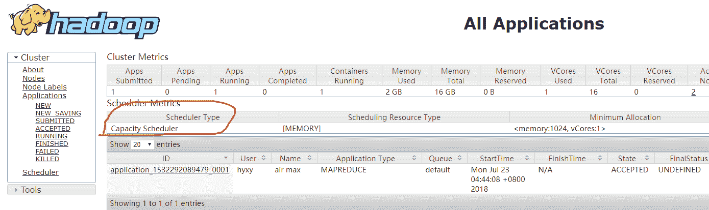

# 网易 2018 实习生招聘笔试题-大数据开发实习生

## 1

以下关于 Hadoop 中反序列化说法错误的是

正确答案: A   你的答案: 空 (错误)

```cpp
Hadoop 中对象的反序列化直接使用了 Java Serialization
```

```cpp
Hadoop 中对象序列化的接口为 org.apache.hadoop.io.Writable
```

```cpp
Writable 机制和 java.io.Serializable 不同，Writable 接口不是一个说明性接口, 包含了两个方法，分别为 write 和 readFields
```

```cpp
大部分的 MapReduce 程 序 都 使 用 Writable 键 – 值 对 作 为 输 入 和 输 出， 但 这 并 不 是 Hadoop 的 API 指定的， 其他序列化机制也能和 Hadoop 配合，并应用于 MapReduce 中
```

本题知识点

网易 Java 工程师 C++工程师 iOS 工程师 安卓工程师 运维工程师 前端工程师 算法工程师 PHP 工程师 大数据开发工程师 2018

讨论

[别做梦了醒一醒](https://www.nowcoder.com/profile/9392620)

并没有使用 java 的序列化方式，自己的 Writable 没有比较功能，所以结合 java 中的 Comparable 合并的比较方式

发表于 2018-06-11 11:03:19

* * *

[戴一](https://www.nowcoder.com/profile/2234564)

 在 Hadoop 中，它使用自己的序列化框架 Writable

发表于 2018-11-14 20:15:39

* * *

## 2

以下关于 HDFS 中 Block 的说法正确的是：

正确答案: C   你的答案: 空 (错误)

```cpp
一个磁盘有自己的块大小，一般为 512 个字节，HDFS 中的块大小与本地磁盘保持一致
```

```cpp
为了容错，一般 Block 的默认备份 1 份，并且会尽量考虑到网络拓扑进行分布式存储
```

```cpp
由于分布式文件系统中使用 Block 来抽象数据存储，由于文件的分块不需要存储在同一个机器上，所以 HDFS 的文件可以大于每个单独的磁盘大小
```

```cpp
数据文件的各个 Block 主要存储在 namenode 上
```

本题知识点

网易 Java 工程师 C++工程师 iOS 工程师 安卓工程师 运维工程师 前端工程师 算法工程师 PHP 工程师 大数据开发工程师 网易 2018

讨论

[够钟 201907071025862](https://www.nowcoder.com/profile/533808884)

一个块默认 128M,默认三备份，block 存储在 datanode 中

发表于 2019-08-01 20:01:09

* * *

## 3

以下哪个是 hadoop 默认的作业调度器

正确答案: C   你的答案: 空 (错误)

```cpp
Capacity schedular
```

```cpp
Fair scheduler
```

```cpp
FIFO
```

```cpp
LATE（Longest Approximate Time to End）
```

本题知识点

网易 Java 工程师 C++工程师 iOS 工程师 安卓工程师 运维工程师 前端工程师 算法工程师 PHP 工程师 大数据开发工程师 网易 2018

讨论

[KnightChess](https://www.nowcoder.com/profile/3501359)

这道题目不严谨，2.X 的默认是 Capacity schedular，1.X 的才是 FIFO，如图，我是 hadoop 2.7.3

编辑于 2018-07-22 21:17:38

* * *

## 4

统计当前目录和里面递归目录的.cpp 文件和.h 文件行数

正确答案: B   你的答案: 空 (错误)

```cpp
wc -l $(find ./ -name&quot;*.cpp&quot; &quot;*.h&quot;)
```

```cpp
wc -l $(find ./ -name&quot;*.cpp&quot;;find ./ -name&quot;*.h&quot;)
```

```cpp
find ./ -name &quot;*.cpp&quot; &quot;*.h&quot; | wc -l
```

```cpp
wc -l $(find ./ -name&quot;*.cpp&quot; &amp;&amp; &quot;*.h&quot;)
```

本题知识点

网易 Java 工程师 C++工程师 iOS 工程师 安卓工程师 运维工程师 前端工程师 算法工程师 PHP 工程师 大数据开发工程师 网易 2018

讨论

[zzd007](https://www.nowcoder.com/profile/4948858)

&quot;在网页中表示一个分号”

 Wc：**递归**统计文件里面有多少单词，多少行，多少字符。

选项与参数：

-l ：仅列出行；

-w ：仅列出多少字(英文单字)；

-m ：多少字符；

 Find ./ -name “*.cpp”;find ./ -name “*.h”

 根据文件名查找，查找 cpp 和 h 结尾的，要用分号引上，linux 间多个命令用;分割 **$获取值**

C 选项 find ./ -name "*.log";find ./ -name "*.txt" |wc –l 分两步执行

先执行 find ./ -name "*.log";  打印出.cpp 结尾的

然后执行 find ./ -name "*.txt" |wc –l 假设 find ./ -name "*.txt"返回

./a.txt

./b.txt

传到 wc –l 结果返回 2 因为没有使用$获取值，所以把 find ./ -name "*.txt"的返回发当成字符串文本了，所以 C 选项的返回为

./a.log

./b.log

./logs/c.log

2

发表于 2018-07-31 17:57:59

* * *

[luckyxue](https://www.nowcoder.com/profile/8982802)

```cpp
# 统计当前目录和里面递归目录的.cpp 文件和.h 文件行数
wc -l $(find ./ -name "*.cpp"; find ./ -name "*.h")
(find ./ -name "*.cpp"; find ./ -name "*.h") | xargs wc -l 
```

发表于 2018-06-07 19:47:42

* * *

## 5

关于 http 协议以下说法不正确的是：
1.304 表示临时重定向
2.range 请求响应一定是用 http 状态码 206 表示成功
3.http 的 header 分割符是\r
4.请求参数如果包含%，需要进行 encode

正确答案: A   你的答案: 空 (错误)

```cpp
1，3
```

```cpp
1，4
```

```cpp
2，3
```

```cpp
2，4
```

```cpp
3，4
```

本题知识点

网易 Java 工程师 C++工程师 iOS 工程师 安卓工程师 运维工程师 前端工程师 算法工程师 PHP 工程师 大数据开发工程师 网易 2018

讨论

[song111](https://www.nowcoder.com/profile/1119061)

http 的 header 与 body 分割符是\r\n\r\n

发表于 2018-07-26 23:01:51

* * *

[haiz](https://www.nowcoder.com/profile/8351764)

307 临时重定向，304 未修改

发表于 2018-09-16 13:28:11

* * *

[寻找 offer](https://www.nowcoder.com/profile/6035108)

**304（未修改）**：

自从上次请求后，请求的网页未修改过。服务器返回此响应时，不会返回网页内容。

如果网页自请求者上次请求后再也没有更改过，您应将服务器配置为返回此响应（称为 If-Modified-Since HTTP 标头）。服务器可以告诉 Googlebot 自从上次抓取后网页没有变更，进而节省带宽和开销。

**哪些字符是需要转化的呢？**
1\. ASCII 的控制字符
这些字符都是不可打印的，自然需要进行转化。
2\. 一些非 ASCII 字符
这些字符自然是非法的字符范围。转化也是理所当然的了。
3\. 一些保留字符
很明显最常见的就是“&”了，这个如果出现在 url 中了，那你认为是 url 中的一个字符呢，还是特殊的参数分割用的呢？
4\. 就是一些不安全的字符了。
例如：空格。为了防止引起歧义，需要被转化为“+”。
明白了这些，也就知道了为什么需要转化了，而转化的规则也是很简单的。

按照每个字符对应的字符编码，不是符合我们范围的，统统的转化为%的形式也就是了。自然也是 16 进制的形式。= =而这里面最不需要转化的就是 **%**
.

发表于 2018-05-29 22:59:08

* * *

## 6

关于计算机网络，以下说法正确的是(1)在向下的过程中，需要添加下层协议所需要的首部或者尾部(2)在向上的过程中不断拆开首部和尾部(3)在向上的过程中，需要添加下层协议所需要的首部或者尾部(4)在向下的过程中不断拆开首部和尾部(5)SMTP 属于 TCP 协议(6)POP3 属于 UDP 协议(7)DNS 属于 TCP 协议(8)Telnet 属于 UDP 协议

正确答案: A   你的答案: 空 (错误)

```cpp
(1)(2)(5)
```

```cpp
(1)(2)(6)
```

```cpp
(1)(2)(8)
```

```cpp
(3)(4)(5)(6)
```

```cpp
(3)(4)(5)(7)
```

本题知识点

网易 Java 工程师 C++工程师 iOS 工程师 安卓工程师 运维工程师 前端工程师 算法工程师 PHP 工程师 大数据开发工程师 网易 2018

讨论

[Stream201908251425680](https://www.nowcoder.com/profile/749234001)

正确答案应该是:(1)(2)(5)(1)(2)由上往下的过程是添加首部和尾部，而向上的过程需要不断拆除头部和尾部。 TCP 包含的协议：

   FTP：文件传输协议，定义了端口为 21

  Telent:用邮件传输于远程登录的端口，默认 23 端口，用户可以以自己的身份远程连接到计算机上，可提供基于 DOS 模式下的通信服务。

  SMTP：邮件传输协议，用于发送邮件。服务器开放的是 25 端口。

  POP3：用于接收邮件，和 SMTP 对应，POP3 协议所用的是 110 端口。

  HTTP：是从 web 服务器传输超文本到本地浏览器的传送协议。

UDP 对应的协议：

 DNS：用于域名解析服务，将域名地址转换为 IP 地址。DNS 用的是 53 号端口。

 SNMP：简单网络管理协议，使用 161 号端口，是用来管理网络设备的。由于网络设备很多，无连接的服务就体现出其优势。

TFTP(Trival File Tran 敏感词 er Protocal)，简单文件传输协议，该协议在熟知端口 69 上使用 UDP 服务。 

发表于 2019-08-26 20:17:48

* * *

[尼克叔叔](https://www.nowcoder.com/profile/959983301)

DNS 即使用 tcp，又使用 udp；不过是分情况的： 区域传输的时候用 tcp，其它时候用 udp； 区域传输：dns 的规范规定了 2 种类型的 dns 服务器，一个叫主 dns 服务器，一个叫辅助 dns 服务器。在一个区中主 dns 服务器从自己本机的数据文件中读取该区的 dns 数据信息，而辅助 dns 服务器则从区的权威 dns 服务器中读取该区的 dns 数据信息。当一个辅助 dns 服务器启动时，它需要与主 dns 服务器通信，并加载数据信息，这就叫做区传送（zone transfer）.

发表于 2018-06-22 09:35:46

* * *

## 7

在 Linux 系统中，可以用来查找可执行文件的是？(1)whereis(2)locate(3)which(4)type(5)find

正确答案: D   你的答案: 空 (错误)

```cpp
(1)(2)(3)
```

```cpp
(1)(2)(5)
```

```cpp
(1)(2)(3)(5)
```

```cpp
(1)(2)(3)(4)(5)
```

本题知识点

网易 Java 工程师 C++工程师 iOS 工程师 安卓工程师 运维工程师 前端工程师 算法工程师 PHP 工程师 大数据开发工程师 网易 2018

讨论

[GRR 呀](https://www.nowcoder.com/profile/461761388)

我记得 type 看类型，难道是看一个文件里的各个内容的类型恰好找到那个要的？

发表于 2019-08-03 14:08:51

* * *

[&pipemm](https://www.nowcoder.com/profile/840557736)

type.....???

发表于 2019-08-03 12:11:32

* * *

[lovepeacemoney 顺利毕业-好好工作](https://www.nowcoder.com/profile/1888327)

type 命令其实不能算查找命令，它是用来区分某个命令到底是由 shell 自带的，还是由 shell 外部的独立二进制文件提供的。

发表于 2018-08-28 13:58:33

* * *

## 8

关于 Linux 下/etc 目录下的文件，下面说法正确的是？

正确答案: C   你的答案: 空 (错误)

```cpp
host.conf 记录主机静态信息
```

```cpp
hosts 决定如何解析域名
```

```cpp
fstab 文件系统的静态信息，系统初始化时需要挂接多个文件系统时需要
```

```cpp
mtab 本机的标识信息，远程登录时确认你当前控制的是本机还是远程计算机
```

本题知识点

网易 Java 工程师 C++工程师 iOS 工程师 安卓工程师 运维工程师 前端工程师 算法工程师 PHP 工程师 大数据开发工程师 网易 2018

讨论

[luckyxue](https://www.nowcoder.com/profile/8982802)

hosts 记录主机的静态信息；host.conf 主机名和 IP 配置文件；resolv.conf 域名解析配置文件；motd 本机的标识信息，可以显示控制的是本机还是远程计算机 fstab 文件系统的静态信息，系统初始化时挂载文件系统 mtab 记录现在系统已经装载的文件系统[`www.cnblogs.com/losbyday/p/5860666.html`](https://www.cnblogs.com/losbyday/p/5860666.html)
[`blog.csdn.net/sukhoi27smk/article/details/47805705`](https://blog.csdn.net/sukhoi27smk/article/details/47805705)

发表于 2018-06-07 20:09:05

* * *

## 9

已知一棵树具有 10 个节点，且度为 4，那么：

正确答案: D   你的答案: 空 (错误)

```cpp
该树的高度至少是 6
```

```cpp
该树的高度至多是 6
```

```cpp
该树的高度至少是 7
```

```cpp
该树的高度至多是 7
```

本题知识点

网易 Java 工程师 C++工程师 iOS 工程师 安卓工程师 运维工程师 前端工程师 算法工程师 PHP 工程师 大数据开发工程师 网易 2018

讨论

[goldlone](https://www.nowcoder.com/profile/2446045)

至多 7 层，因为至少有一个节点下有 4 个子节点。

编辑于 2018-08-10 20:56:03

* * *

## 10

设二叉排序树中关键字由 1 到 999 的整数构成，现要查找关键字为 321 的节点，下面关键字序列中，不可能出现在二叉排序树上的查找序列是：

正确答案: B   你的答案: 空 (错误)

```cpp
2、252、400 、398、300、344、310、321
```

```cpp
888、231、911、244、898、256、362、366
```

```cpp
888、200、666、240、312、330、321
```

```cpp
2、398、387、219、266、283、298、321
```

本题知识点

网易 Java 工程师 C++工程师 iOS 工程师 安卓工程师 运维工程师 前端工程师 算法工程师 PHP 工程师 大数据开发工程师 网易 2018

讨论

[寻找 offer](https://www.nowcoder.com/profile/6035108)

应该根据序列的递增递减规律去确定数据应该出现的范围：

A：

> 2、252、400 、398、300、344、310、321

递增递减序列为：

> 2、252、400 、398

所以数据范围应该都在 [2,400]

B:

> 888、231、911、244、898、256、362、366

序列为：

> 888、231

所以数据应该都在[231, 888]之间，出现了 911 所以错误

C,D 同理

发表于 2018-05-29 23:15:46

* * *

[午夜阳光 1](https://www.nowcoder.com/profile/2973766)

二叉排序树的左子树发表于 2018-08-11 09:49:47

* * *

[luckyxue](https://www.nowcoder.com/profile/8982802)

[`blog.csdn.net/u011240016/article/details/52860653`](https://blog.csdn.net/u011240016/article/details/52860653)

发表于 2018-06-07 19:05:14

* * *

## 11

在 Java 中，包 com 中定义了类 TestUtil，在 com 的子包 util 中定义了同名类 TestUtil，给定如下 Java 代码，编译运行时，将发生（ ）。

```cpp
package test;
import com.util.TestUtil;
import com.TestUtil;
public class Test {
  public static void main(String[] args)  {
    TestUtil testutil = new TestUtil();
  }
}
```

正确答案: D   你的答案: 空 (错误)

```cpp
创建了一个 com.TestUtil 对象
```

```cpp
创建了一个 com.util.TestUtil 对象
```

```cpp
运行时出现异常
```

```cpp
编译无法通过
```

本题知识点

网易 Java 工程师 C++工程师 iOS 工程师 安卓工程师 运维工程师 前端工程师 算法工程师 PHP 工程师 大数据开发工程师 网易 2018

讨论

[G 凯 learlove](https://www.nowcoder.com/profile/4792384)

异常指的是逻辑上的错误，可以通过异常处理来捕捉处理编译无法通过是无法通过逻辑处理捕捉异常来处理的。

发表于 2019-07-25 17:57:53

* * *

## 12

给定 Java 代码如下所示，则编译运行后，输出结果是（ ）。

```cpp
public class Test {
    static int a;
    int b;
    static int c;

    public int aMethod() {
        a++;
        return a;
    }

    public int bMethod() {
        b++;
        return b;
    }

    public static int cMethod() {
        c++;
        return c;
    }

    public static void main(String args[]) {
        Test test1 = new Test();
        test1.aMethod();
        System.out.println(test1.aMethod());
        Test test2 = new Test();
        test2.bMethod();
        System.out.println(test2.bMethod());
        Test test3 = new Test();
        test3.cMethod();
        System.out.println(test3.cMethod());
    }
}
```

正确答案: D   你的答案: 空 (错误)

```cpp
1 0 2
```

```cpp
2 1 2
```

```cpp
0 0 2
```

```cpp
2 2 2
```

本题知识点

网易 Java 工程师 C++工程师 iOS 工程师 安卓工程师 运维工程师 前端工程师 算法工程师 PHP 工程师 大数据开发工程师 网易 2018

## 13

给定某 Java 程序的 main 方法如下，该程序编译运行后的结果是（ ）。

```cpp
public static void main(String[] args) {
    String str=null;
    str.concat("abc");
    str.concat("123");
    System.out.println(str);
}
```

正确答案: D   你的答案: 空 (错误)

```cpp
输出：null
```

```cpp
输出：abc123
```

```cpp
编译错误
```

```cpp
运行时出现异常
```

本题知识点

网易 Java 工程师 C++工程师 iOS 工程师 安卓工程师 运维工程师 前端工程师 算法工程师 PHP 工程师 大数据开发工程师 网易 2018

讨论

[在等 offercall](https://www.nowcoder.com/profile/281873591)

对 null 调用 concat 连接后会抛出 nullPointerException 即空指针异常

编辑于 2018-09-02 23:21:55

* * *

## 14

给定某 Java 程序的 main 方法如下，该程序编译运行后的结果是（ ）。

```cpp
public class Test {
    int count = 21;
    public void count() {
        System.out.println(++count);
    }
    public static void main(String args[]) {
        new Test().count();
        new Test().count();
    }
}
```

正确答案: C   你的答案: 空 (错误)

```cpp
22 23
```

```cpp
21 22
```

```cpp
22 22
```

```cpp
21 23
```

本题知识点

网易 Java 工程师 C++工程师 iOS 工程师 安卓工程师 运维工程师 前端工程师 算法工程师 PHP 工程师 大数据开发工程师 网易 2018

讨论

[以后别做朋友](https://www.nowcoder.com/profile/2564726)

这是两个不同的对象

发表于 2018-07-22 15:42:58

* * *

## 15

下面关于进程和线程说法错误的是（）

正确答案: B   你的答案: 空 (错误)

```cpp
进程是系统进行资源分配和调度的基本单位，而线程是 CPU 调度和分配的基本单位
```

```cpp
线程也拥有自己的系统资源
```

```cpp
一个线程可以创建和撤销另一个线程
```

```cpp
一个进程中的多个线程共享资源
```

本题知识点

网易 Java 工程师 C++工程师 iOS 工程师 安卓工程师 运维工程师 前端工程师 算法工程师 PHP 工程师 大数据开发工程师 网易 2018

讨论

[Spur-at](https://www.nowcoder.com/profile/618635861)

进程是系统进行资源分配和调度的一个独立单位. 线程是进程的一个实体,是 CPU 调度和分派的基本单位,它是比进程更小的能独立运行的基本单位.线程自己基本上不拥有系统资源，只拥有一点在运行中必不可少的资源(如程序计数器,一组寄存器和栈),但是它可与同属一个进程的其他的线程共享进程所拥有的全部资源.一个线程可以创建和撤销另一个线程;同一个进程中的多个线程之间可以并发执行. 相对进程而言，线程是一个更加接近于执行体的概念，它可以与同进程中的其他线程共享数据，但拥有自己的栈空间，拥有独立的执行序列。 进程和线程的主要差别在于它们是不同的操作系统资源管理方式。进程有独立的地址空间，一个进程崩溃后，在保护模式下不会对其它进程产生影响，而线程只是一个进程中的不同执行路径。线程有自己的堆栈和局部变量，但线程之间没有单独的地址空间，一个线程死掉就等于整个进程死掉，所以多进程的程序要比多线程的程序健壮，但在[进程切换](https://www.baidu.com/s?wd=%E8%BF%9B%E7%A8%8B%E5%88%87%E6%8D%A2&tn=24004469_oem_dg&rsv_dl=gh_pl_sl_csd)时，耗费资源较大，效率要差一些。但对于一些要求同时进行并且又要共享某些变量的并发操作，只能用线程，不能用进程。 

发表于 2019-03-06 09:22:33

* * *

## 16

下面关于线程同步说法错误的是（）

正确答案: D   你的答案: 空 (错误)

```cpp
用户模式和内核模式下同步方式不同
```

```cpp
对于临界区的访问适用于单进程中线程间的同步
```

```cpp
事件对象适用于多个进程间的各线程实现同步
```

```cpp
互斥对象也只适用于单进程中线程间的同步
```

本题知识点

网易 Java 工程师 C++工程师 iOS 工程师 安卓工程师 运维工程师 前端工程师 算法工程师 PHP 工程师 大数据开发工程师 网易 2018

## 17

用 1*3 的瓷砖密铺 3*20 的地板有几种方式？

正确答案: A   你的答案: 空 (错误)

```cpp
1278
```

```cpp
872
```

```cpp
595
```

```cpp
406
```

本题知识点

网易 Java 工程师 C++工程师 iOS 工程师 安卓工程师 运维工程师 前端工程师 算法工程师 PHP 工程师 大数据开发工程师 网易 2018

讨论

[饭稀稀 7](https://www.nowcoder.com/profile/8261286)

由于一条边为 3，满足的方式为 3 个 1*3 或者未 1 个 3*1，这两个方式为各为一个单位的话，实际上就是组合的问题。C^m[n，]例如要组成 20，则一种情况为 6 个 3*1 和 2 个 1*3，组合结果为 C²[8]=28，所以总的结果为：C²[8]+C⁵[10]+C⁸[12]+C¹¹[14]+C¹⁴[16]+C¹⁷[18]+C¹⁸[18]=1278。

发表于 2018-07-01 11:39:54

* * *

[☆未完待续](https://www.nowcoder.com/profile/938035129)

f(n) = f(n-1) + f(n-3)

发表于 2019-08-02 14:46:10

* * *

## 18

已知中序遍历的序列为 abcdef，高度最小的不可能的二叉树的前序遍历是

正确答案: D   你的答案: 空 (错误)

```cpp
dbacfe
```

```cpp
dbacef
```

```cpp
cbaedf
```

```cpp
cabefd
```

本题知识点

网易 Java 工程师 C++工程师 iOS 工程师 安卓工程师 运维工程师 前端工程师 算法工程师 PHP 工程师 大数据开发工程师 网易 2018

讨论

[zzd007](https://www.nowcoder.com/profile/4948858)

根据前序和中序画图，只有 D 画不出来

发表于 2018-08-02 09:24:58

* * *

## 19

以下算法中未用到贪心算法思想的是？

正确答案: D   你的答案: 空 (错误)

```cpp
迪杰斯特拉(Dijkstra)
```

```cpp
库鲁斯卡尔(Kruskal)
```

```cpp
普里姆算法(Prim)
```

```cpp
KMP
```

本题知识点

网易 Java 工程师 C++工程师 iOS 工程师 安卓工程师 运维工程师 前端工程师 算法工程师 PHP 工程师 大数据开发工程师 网易 2018

讨论

[NewGuests](https://www.nowcoder.com/profile/826847924)

kmp 算法使用的是动态规划

发表于 2019-03-13 14:59:42

* * *

## 20

对于线性表（ 13,25,22,35,54,57,63）进行散列存储时，若选用 H （ K ） =K %7 作为散列函数，则散列地址为 1 的元素有（ ）个？

正确答案: C   你的答案: 空 (错误)

```cpp
0
```

```cpp
1
```

```cpp
2
```

```cpp
3
```

本题知识点

网易 Java 工程师 C++工程师 iOS 工程师 安卓工程师 运维工程师 前端工程师 算法工程师 PHP 工程师 大数据开发工程师 网易 2018

讨论

[一只小星星](https://www.nowcoder.com/profile/4705227)

22 and 57  , 除 7 的余数

发表于 2019-08-02 10:49:50

* * *

## 21

牛牛去犇犇老师家补课，出门的时候面向北方，但是现在他迷路了。虽然他手里有一张地图，但是他需要知道自己面向哪个方向，请你帮帮他。

本题知识点

网易 Java 工程师 C++工程师 iOS 工程师 安卓工程师 运维工程师 前端工程师 算法工程师 PHP 工程师 字符串 *模拟 大数据开发工程师 2018* *讨论

[howoo](https://www.nowcoder.com/profile/339093224)

```cpp
#include <bits/stdc++.h>
using namespace std;

int main() {
    int n;
    const string status = "NESW";
    while (cin >> n) {
        string s;
        cin >> s;
        int i = 0;
        for (char &c : s) {
            if (c == 'L')
                i--;
            else
                i++;
            if (i == -1 || i == 4)
                i = (i + 4) % 4;
        }        
        cout << status[i] << endl;
    }
    return 0;
}
```

编辑于 2019-03-31 16:13:31

* * *

[尘世 0 残破](https://www.nowcoder.com/profile/812443852)

```cpp
num = int(input())
string = input()
L_count = string.count('L')
R_count = num - L_count
result = 'NESW'
print(result[(R_count - L_count)%4])
```

发表于 2019-10-16 14:04:40

* * *

[Stream201908251425680](https://www.nowcoder.com/profile/749234001)

```cpp
import java.util.Scanner; public class Main { public static void main(String[] args) {
        Scanner scanner = new Scanner(System.in); int i = scanner.nextInt();
        String next = scanner.next(); char[] dict={'W','E','S','N'}; char[] chars = next.toCharArray(); //System.out.println(i);  //System.out.println(chars);  int a=0; for (int j = 0; j < chars.length; j++) { if (chars[j] == 'L') {
                a-=1;
            } else {
                a+=1;
            }
        }
        System.out.println(a); if (a%4 <0) {
            System.out.println(dict[(a%4)+4]);
        }else {
            System.out.println(dict[(a%4)]);
        } //     }
}
```

发表于 2019-08-27 01:24:06

* * *

## 22

牛牛以前在老师那里得到了一个正整数数对(x, y), 牛牛忘记他们具体是多少了。

但是牛牛记得老师告诉过他 x 和 y 均不大于 n, 并且 x 除以 y 的余数大于等于 k。

牛牛希望你能帮他计算一共有多少个可能的数对。

本题知识点

网易 Java 工程师 C++工程师 iOS 工程师 安卓工程师 运维工程师 前端工程师 算法工程师 PHP 工程师 数学 大数据开发工程师 2018

讨论

[GooHub](https://www.nowcoder.com/profile/332625)

```cpp
if __name__ == '__main__':
    # 解析参见 https://blog.csdn.net/anlian523/article/details/79763170
    # 输入
    n, k = list(map(int, input().split()))
    if k == 0:
        print(n * n)
    else:
        count = 0
        for y in range(k+1,n+1):
            # 分出完整循环部分和不完整循环部分
            count += (n // y) * (y - k)
            # 这部分是最后一部分（最后一部分一定要出现余数大于等于 k 的情况才会统计）
            if n % y >= k:
                count += (n % y) - k + 1
        print(count)

```

发表于 2018-08-05 11:48:50

* * *

[Stream201908251425680](https://www.nowcoder.com/profile/749234001)

```cpp
* 思路 x<=n ；y<=n ；x%y>=k 
```

```cpp
public class dataque { public static void main(String[] args) {
        Scanner scanner = new Scanner(System.in); long n= scanner.nextLong(); long k= scanner.nextLong(); int dataqueNum=0; if (1 <= n&&n <= 10*10*10*10*10&&k>=0&&k<=n-1) { for (int x = 1; x <= n; x++) { for (int y= 1; y <= n; y++) { if (x%y >=k) {
                        dataqueNum+=1;
                    }
                }
            }
            System.out.println(dataqueNum);
        }

    }
}
```

发表于 2019-08-27 01:52:39

* * *

[&pipemm](https://www.nowcoder.com/profile/840557736)

x%y 的余数，x 的范围必定为[0,y-1]，为了满足余数大于等于 k，y 必须为 k+1 或者更大，x%y 的余数才可能出现 k。每个长度为 y 的段中，都有 k 个数（[my+1,my+k)）除以 y 的余数是小于 k 的，则这一段中余数大于等于 k 的有 y-k 个。 完整循环次数为 n/i ， 非完成循环次数为 n%i

编辑于 2019-08-13 20:44:47

* * *

## 23

牛牛准备参加学校组织的春游, 出发前牛牛准备往背包里装入一些零食, 牛牛的背包容量为 w。牛牛家里一共有 n 袋零食, 第 i 袋零食体积为 v[i]。牛牛想知道在总体积不超过背包容量的情况下,他一共有多少种零食放法(总体积为 0 也算一种放法)。

本题知识点

网易 Java 工程师 C++工程师 iOS 工程师 安卓工程师 运维工程师 前端工程师 算法工程师 PHP 工程师 高级算法 穷举 大数据开发工程师 2018

讨论

[Roee](https://www.nowcoder.com/profile/2085010)

python3 代码,DFS 去遍历

```cpp
def wx(v, x):
    return sum([v[i] * x[i] for i in range(len(v))])

def dfs(v, p, f, x, w):
    if p == len(v) - 1:
        k = wx(v, x + [f])
        if k > w:
            return 0
        else:
            return 1
    temp = wx(v, (x+[f]+[0]*len(v))[:len(v)])
    if temp > w:
        return 0
    elif temp == w:
        return 1
    else:
        return dfs(v, p+1, 0, x+[f], w) + dfs(v, p+1, 1, x+[f], w)

n, w = list(map(int, input().split()))
v = sorted(list(map(int, input().split())))
v.reverse()
if sum(v) <= w:
    print(2**n)
else:
    print(dfs(v, 0, 0, [], w) + dfs(v, 0, 1, [], w)) 
```

发表于 2018-08-10 02:54:36

* * *

[求 offer 砸到我](https://www.nowcoder.com/profile/228353042)

```cpp
import java.util.*;
public class Main{

   static long w;
   static long ans=0;//计数器
   static long sum=0;
   static  int n;
   static int[] weight;
    public static void main(String[] args) {

       Scanner sc=new Scanner(System.in);
       n=sc.nextInt();//物品的件数
       w=sc.nextInt();//背包的体积
        weight=new int[n];
        for(int i=0;i<n;i++){
//            存储物品的体积
            weight[i]=sc.nextInt();
            sum+=weight[i];
        }
//        如果背包能全部存下物品
        if(sum<w){
            ans =(int)Math.pow(2,n);
        }else{
            Arrays.sort(weight);
            dfs(0,0);
        }
        System.out.println(ans);

    }
    public static void dfs(long  sum,int index){
        if(sum>w)
            return;
        if(sum<w)
            ans++;
        for(int i=index;i<n;i++){
            dfs(sum+weight[i],i+1);
        }
    }
}
```

发表于 2019-09-05 13:26:55

* * *

[jieg](https://www.nowcoder.com/profile/391097463)

运行超时:您的程序未能在规定时间内运行结束，请检查是否循环有错或算法复杂度过大。
case 通过率为 80.00%

```cpp
import java.util.Scanner;
public class Main {
    private static int cnt = 1;
    private static int[] v;
    public static void main(String[] args) {
        Scanner s = new Scanner(System.in);
        int n = s.nextInt();
        int w = s.nextInt();
        v = new int[n];
        for (int i = 0; i < n; i++) {
            v[i] = s.nextInt();
        }
        search(w, 0);
        System.out.println(cnt);
    }
    public static void search(int w, int i) {
        if (i >= v.length) {
            return;
        }
        if (v[i] <= w) {
            cnt++;
            search(w - v[i], i + 1);
        }
        search(w, i + 1);
    }
}

```

发表于 2019-05-03 20:27:13

* * *

## 24

在当今数据爆炸的时代，人们使用、产生的数据已经远远超过了单台商用服务器的存储容量。请大开脑洞，设计一个由多台服务器组成的分布式文件系统，使系统满足以下功能：

1\. 高可用，单一服务器宕机不影响服务使用

2\. 支持数据的增删改查操作

3\. 高吞吐，支持海量数据访问

你的答案

本题知识点

网易 Java 工程师 C++工程师 iOS 工程师 安卓工程师 运维工程师 前端工程师 算法工程师 PHP 工程师 大数据开发工程师 2018

讨论

[阿雨呀](https://www.nowcoder.com/profile/621032390)

HDFS

发表于 2021-04-10 15:45:00

* * *

[小红茶呀](https://www.nowcoder.com/profile/360897436)

首先，该分布式文件系统包含一个目录，目录存于 1-3 台服务器，称为主服务器，客户端访问主服务器获取所需的目录信息，再通过目录信息去所在的服务器上获取所需的内容。主服务器之间通过 zookeeper 实现数据一致性，其他服务器定时向主服务器汇报存储的信息让主服务器更新目录信息，同时进行数据的多备份，备份存在于不同的从服务器节点上。当服务器宕机时，进行数据备份的恢复。这样可以保证服务器的高可用，即使由一台主服务器挂了，也有其他的主服务器继续服务，即使从服务器挂了，也不会丢失数据。可以专门设计一个存储增删改操作的服务器，主服务器接收客户端请求的时候，先去增删改服务器上获取增删改的信息，根据增删改的信息与自己的目录信息进行合并之后，返回增删改之后的信息给用户。通过多台的主服务器和从服务器和增删改服务器的相互配合，即可实现高吞吐，支持海量的数据访问。

发表于 2021-04-10 11:11:40

* * *

## 25

请用文字描述 Hadoop 的 MapReduce 计算模型，可以从任务的提交、运行、交互、结束等阶段详细描述。根据你所描述的过程模型，是否有可以优化的空间？如果有，可以罗列一些 hadoop 已经实现的优化点，同时提出你自己的优化方案。

你的答案

本题知识点

网易 Java 工程师 C++工程师 iOS 工程师 安卓工程师 运维工程师 前端工程师 算法工程师 PHP 工程师 大数据开发工程师 2018

讨论

[牛客 869498429 号](https://www.nowcoder.com/profile/869498429)

首先客户端收集 job 的运行信息，并检验环境是否合法，比如 mapClass、reduceClass，map，reduce 组件的 key，value 是否合法，在检测过程中，如果出现问题，则会直接报错，终止 job 的提交。检测通过，则客户端会为 job 向 ResourceManager 申请一个 ID，并且向 HDFS 服务器提交 job 的参数信息、切片数量以及组件代码 jar 包等等。ResourceManager 返回一个 ID 后客户端向 ResoueceManager 提交 job，以及 job 在 HDFS 提交运行信息的路径。ResoueceManager 初始化后，根据资源路径在 HDFS 中获取 job 的切片数以便确定 mapTask 任务数量。NodeManager 向 ResoueceManager 发送心跳以获得任务，此时符合本地化策略，尽量减少带宽的使用。为了确保程序出错时不至于使 NodeManager 出错宕机，NodeManager 启动一个 jvm 子程序（worker），来运行 mapTask 和 ReduceTask。根据 split 的数量 mapreduce 开启相等数量的 maptask。此时 mapTask 按行开始按行读取 split 的数据，形成（k1,v1）k1 是每行首字符起始位置，此时触发 map 方法，按照自定义格式对数据进行处理形成（k2，v2），k2 是切分的字符，v2 是字符在该行出现的次数。此时进入 shuffle 洗牌阶段，将 k2，v2 写入溢写缓冲区中，溢写缓冲区默认大小为 100M，从优化角度可调大缓冲区大小，减小磁盘的 IO 次数。此时为了调优性能可以引入 partition 对数据进行分区，默认分区为 key 的哈希值取正数取模，还可引入 combiner 对数据进行提前合并，此时进入 reduce 组件的数据量就会减小，溢写缓冲区的数据有序且分好区。当缓冲区数据达到 80%发生溢写操作（可调节但是最好不要设置成 100%），将数据写入溢写文件中。数据处理完毕会进行合并操作，将多个溢写文件合并成一个结构化文件。注意 combiner 中间过程一定发生在缓冲区中，但是当溢写文件>=3 时，会在合并时发生 combiner 中间过程。shuffle 阶段完成，会形成有序分区的结构化文件，文件里是（k3，v3）k3 和 k2 一样，v3 是 itertor 类型的迭代数据。之后执行 reduceTask 任务，reduceTask 创建 fetch 线程抓取数据，从优化角度 fetch 应略大于 mapTask 数，以便于实现并行。获取到（k3，v3），执行 reduce 方法根据自定义的归并方式，对数据进行处理，最后得到想要的数据进行输出。

发表于 2022-03-01 21:54:50

* * *

[小红茶呀](https://www.nowcoder.com/profile/360897436)

首先是 Map 阶段：MapReduce 先将待处理的数据进行逻辑切片，在任务提交之前，先根据数据的信息进行任务的分配和规划，然后把相关的信息提交给 Yarn 的 ResourceManage，ResourceManage 计算出所需的资源并进行分配 container 启动应用，客户端通过 InputFormat 进行一个逻辑的切分然后通过 RecorderReader 转化成键值对的形式提交给 map 任务进行逻辑计算之后。在 map 后 reduce 前的阶段成为 shuffle 数据洗牌阶段：通过 outputcontroller 写到 100M 大小的环形缓冲区中，进行双向写入一边写索引一边写数据，当环形缓冲区到达 80%时，对数据进行分区、快速排序然后溢写磁盘、进行归并排序、之后可以进行 combine 合并操作、再进行一次归并排序。进入 Reduce 阶段：在所有 MapReduce 任务完成后，启动 ReduceTask 任务，并把数据分区的信息提交给 ReduceTask 去处理这些数据。ReduceTask 读取磁盘文件进行分组 Reduce 任务操作通过 outputformat 写回磁盘。

发表于 2021-04-10 11:23:08

* * **