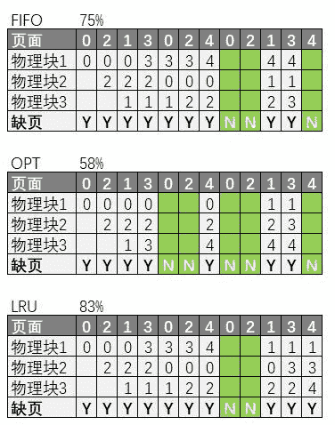
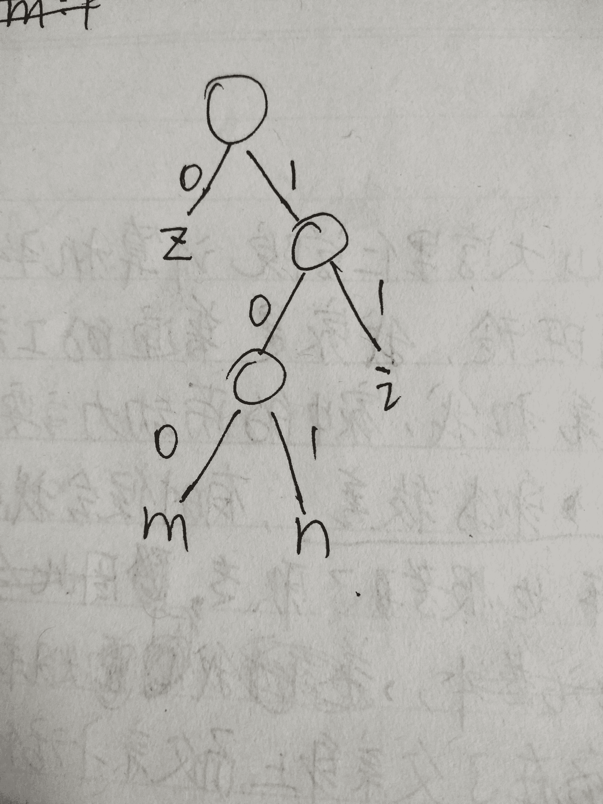

# 网易 2018 实习生招聘笔试题-测试实习生

## 1

关于随机测试，以下哪一项说明是正确的？

正确答案: A   你的答案: 空 (错误)

```cpp
随机测试是根据测试的经验在无测试用例的情况下进行的测试。
```

```cpp
随机测试也是需要写一定的测试用例，但可以用例中没有的测试点。
```

```cpp
随机测试不会产生测试冗余。
```

```cpp
随机测试是程序员自已开发时候进行的测试。
```

本题知识点

网易 Java 工程师 C++工程师 iOS 工程师 安卓工程师 运维工程师 前端工程师 算法工程师 PHP 工程师 测试工程师 2018

讨论

[coco_gift](https://www.nowcoder.com/profile/7445971)

随机测试没有测试用例，是测试者根据自己的经验对软件进行功能和性能的测试

发表于 2018-07-06 14:32:20

* * *

## 2

手机 APP 测试时，下列哪项说法是错误的？

正确答案: B   你的答案: 空 (错误)

```cpp
因安卓和 IOS 的表现效果以及操作系统不同，应将测试用例分成两个客户端
```

```cpp
都是手机端的操作，测试时不需要考虑屏幕的尺寸问题。
```

```cpp
APP 是否能正常安装需要测试
```

```cpp
APP 中如果有定位功能，需要测试手机定位是否被打开
```

本题知识点

网易 Java 工程师 C++工程师 iOS 工程师 安卓工程师 运维工程师 前端工程师 算法工程师 PHP 工程师 测试工程师 2018

讨论

[一场痴梦锁红楼](https://www.nowcoder.com/profile/785038480)

需要考虑手机屏幕大小，因为 APP 显示的内容会因为屏幕的大小而排列不一

发表于 2019-09-20 18:58:59

* * *

## 3

在对某支持语音聊天的 SDK 进行利用并二次开发后，关于语音功能的测试用例下列哪项是错误的？

正确答案: D   你的答案: 空 (错误)

```cpp
语音聊天功能的测试用例里，应该考虑语音请求发送的测试
```

```cpp
发送音频功能的测试用例里，应考虑语音是否能正常被播放的测试
```

```cpp
语音聊天功能的测试用例里，应考虑不能正常被接通时，对话框内出现的提示信息的测试
```

```cpp
发送音频功能的测试用例里，不需要测试音频未加载成功的测试。
```

本题知识点

网易 Java 工程师 C++工程师 iOS 工程师 安卓工程师 运维工程师 前端工程师 算法工程师 PHP 工程师 测试工程师 2018

## 4

以下哪项能通过软件验收？

正确答案: C   你的答案: 空 (错误)

```cpp
无重大故障，各阶段测试文档及资料完整，有一小部分需求未实现。
```

```cpp
所有需求均已实现，并无重大故障，系统测试还有一小部分未完成。
```

```cpp
有轻微故障，已完成回归测试，文档及资料完整，性能指标基本达成。
```

```cpp
无重大故障，各阶段测试文档及资料完整，性能指标还未达标。
```

本题知识点

网易 Java 工程师 C++工程师 iOS 工程师 安卓工程师 运维工程师 前端工程师 算法工程师 PHP 工程师 测试工程师 2018

讨论

[💦Carrie](https://www.nowcoder.com/profile/3604497)

*   软件验收测试合格通过准则：
    *   软件需求分析说明书中定义的所有功能已全部实现，性能指标全部达到要求
    *   所有测试项没有残余的一级二级三级错误
    *   立项审批表、需求分析文档、设计文档和编码实现一致
    *   验收测试工件齐全（测试计划、测试用例、测试日志、测试通知单、测试分析报告）

发表于 2018-06-25 11:50:26

* * *

## 5

linux 系统中有如下 cron 任务：20,40 */3 * * 1 sh test.sh 下面描述正确的是：

正确答案: A   你的答案: 空 (错误)

```cpp
每周一每 3 小时，20 分，40 分，运行 test.sh
```

```cpp
每月 1 号每 3 小时，20 分，40 分，运行 test.sh
```

```cpp
每周一每 3 小时，每 20 分钟运行 test.sh
```

```cpp
每月 1 号每 3 小时，每 20 分钟运行 test.sh
```

本题知识点

网易 Java 工程师 C++工程师 iOS 工程师 安卓工程师 运维工程师 前端工程师 算法工程师 PHP 工程师 测试工程师 网易 2018

讨论

[kemon](https://www.nowcoder.com/profile/6888928)

每项工作有六个字段分别是：分钟 小时 日期 月份 周 指令 0-59 0-23 1-31 1-12 0-7 指令 #0 和 7 都代表星期天辅助特殊字符：* （星号）代表任何时刻，（逗号）代表分隔时候。如 20 分 40 分 就是 20,40-（减号）代表一段时间范围内。如：3 点到 6 点 就是 3-6/n（斜线）n 代表数字，即每隔 n 单位。如每隔五分钟，/5

发表于 2018-06-02 15:21:46

* * *

[狐狸的奶酪](https://www.nowcoder.com/profile/499082733)

 可用 crontab -e 命令来编辑,编辑的是/var/spool/cron 下对应用户的 cron 文件,也可以直接修改/etc/crontab 文件

具体格式如下：

      Minute Hour Day Month Dayofweek    command

      分钟     小时   天     月        天每星期        命令

每个字段代表的含义如下：

    Minute             每个小时的第几分钟执行该任务

     Hour                每天的第几个小时执行该任务

     Day                 每月的第几天执行该任务

     Month              每年的第几个月执行该任务

     DayOfWeek     每周的第几天执行该任务

     Command        指定要执行的程序

    在这些字段里，除了“Command”是每次都必须指定的字段以外，其它字段皆为可选字段，可视需要决定。对于不指定的字段，要用“*”来填补其位置。

举例如下：

5       *        *           *      *     ls              指定每小时的第 5 分钟执行一次 ls 命令

30     5       *           *      *     ls              指定每天的 5:30 执行 ls 命令

30     7       8          *      *      ls              指定每月 8 号的 7：30 分执行 ls 命令

30     5       8          6     *      ls              指定每年的 6 月 8 日 5：30 执行 ls 命令

30     6       *           *     0      ls              指定每星期日的 6:30 执行 ls 命令[注：0 表示星期天，1 表示星期 1，以此类推，也可以用英文来表示，sun 表示星期天，mon 表示星期一等。]

30     3      10,20     *     *      ls     每月 10 号及 20 号的 3：30 执行 ls 命令[注：“，”用来连接多个不连续的时段]

25     8-11 *            *     *      ls       每天 8-11 点的第 25 分钟执行 ls 命令[注：“-”用来连接连续的时段]

*/15   *        *            *     *      ls          每 15 分钟执行一次 ls 命令 [即每个小时的第 0 15 30 45 60 分钟执行 ls 命令 ]

30    6      */10         *      *      ls       每个月中，每隔 10 天 6:30 执行一次 ls 命令[即每月的 1、11、21、31 日是的 6：30 执行一次 ls 命令。 ]

每天 7：50 以 root 身份执行/etc/cron.daily 目录中的所有可执行文件

50    7       *             *      *     root      run-parts      /etc/cron.daily   [ 注：run-parts 参数表示，执行后面目录中的所有可执行文件。 ]

发表于 2018-08-10 13:41:54

* * *

[大橘已定](https://www.nowcoder.com/profile/6994957)

[Cron 表达式详解](https://www.cnblogs.com/sgh1023/p/10246893.html)

发表于 2019-03-28 19:53:13

* * *

## 6

如何将当前目录下所有 pdf 文件内容转换成 txt 文件内容？

正确答案: B   你的答案: 空 (错误)

```cpp
for *.pdf to *.txt
```

```cpp
for f in `ls *.pdf`; do pdftotext “$f”; done
```

```cpp
do `ls *.pdf` pdftotext `*.txt`
```

```cpp
pdftotext *.pdf *.txt
```

本题知识点

网易 Java 工程师 C++工程师 iOS 工程师 安卓工程师 运维工程师 前端工程师 算法工程师 PHP 工程师 测试工程师 网易 2018

讨论

[努力就能咸鱼变锦鲤](https://www.nowcoder.com/profile/148333331)

是 linux 系统中的语句

发表于 2019-10-13 16:11:17

* * *

## 7

关于 http 协议以下说法不正确的是：
1.304 表示临时重定向
2.range 请求响应一定是用 http 状态码 206 表示成功
3.http 的 header 分割符是\r
4.请求参数如果包含%，需要进行 encode

正确答案: A   你的答案: 空 (错误)

```cpp
1，3
```

```cpp
1，4
```

```cpp
2，3
```

```cpp
2，4
```

```cpp
3，4
```

本题知识点

网易 Java 工程师 C++工程师 iOS 工程师 安卓工程师 运维工程师 前端工程师 算法工程师 PHP 工程师 测试工程师 网易 2018

讨论

[lyle19](https://www.nowcoder.com/profile/4152638)

304 对应的是：服务端的资源未改变，可直接使用本地缓存。 临时重定向是：302

发表于 2018-06-06 16:54:43

* * *

[九千七 201910171027572](https://www.nowcoder.com/profile/495884849)

304 对应的是未修改。临时重定向是 307

发表于 2019-10-18 15:57:26

* * *

[牛客 2244462 号](https://www.nowcoder.com/profile/2244462)

4 post 不需要重新 encode

发表于 2018-05-29 21:04:54

* * *

## 8

关于计算机网络，以下说法正确的是(1)在向下的过程中，需要添加下层协议所需要的首部或者尾部(2)在向上的过程中不断拆开首部和尾部(3)在向上的过程中，需要添加下层协议所需要的首部或者尾部(4)在向下的过程中不断拆开首部和尾部(5)SMTP 属于 TCP 协议(6)POP3 属于 UDP 协议(7)DNS 属于 TCP 协议(8)Telnet 属于 UDP 协议

正确答案: A   你的答案: 空 (错误)

```cpp
(1)(2)(5)
```

```cpp
(1)(2)(6)
```

```cpp
(1)(2)(8)
```

```cpp
(3)(4)(5)(6)
```

```cpp
(3)(4)(5)(7)
```

本题知识点

网易 Java 工程师 C++工程师 iOS 工程师 安卓工程师 运维工程师 前端工程师 算法工程师 PHP 工程师 测试工程师 网易 2018

讨论

[Weightmin](https://www.nowcoder.com/profile/3648021)

SMTP、POP3、Telnet 属于 TCP 协议 DNS 属于 UDP 协议

发表于 2018-08-09 10:00:22

* * *

## 9

已知一棵树具有 10 个节点，且度为 4，那么：

正确答案: D   你的答案: 空 (错误)

```cpp
该树的高度至少是 6
```

```cpp
该树的高度至多是 6
```

```cpp
该树的高度至少是 7
```

```cpp
该树的高度至多是 7
```

本题知识点

网易 Java 工程师 C++工程师 iOS 工程师 安卓工程师 运维工程师 前端工程师 算法工程师 PHP 工程师 测试工程师 网易 2018

讨论

[陈仔仔](https://www.nowcoder.com/profile/168452284)

4 个度，说明有一个结点，连了 4 个子结点。那么还剩 10-（4+1）=5 个父结点，连在这个结点上，所以最大度是 7，如图所示（额，app 端好像发不了）

编辑于 2019-03-27 11:35:43

* * *

[coco_gift](https://www.nowcoder.com/profile/7445971)

一棵树的度指的是树种最大度值

发表于 2018-07-06 14:36:20

* * *

## 10

若对如下无向图进行遍历，则下列序列中，不是广度优先遍历序列的是（）

正确答案: D   你的答案: 空 (错误)

```cpp
e,a,f,g,b,c,d
```

```cpp
a,b,e,c,d,f,g
```

```cpp
d,b,c,a,e,f,g
```

```cpp
f,e,a,d,a,d,g
```

本题知识点

网易 Java 工程师 C++工程师 iOS 工程师 安卓工程师 运维工程师 前端工程师 算法工程师 PHP 工程师 测试工程师 网易 2018

讨论

[蓝齐儿](https://www.nowcoder.com/profile/674273)

深度优先搜索：类似于树的先根遍历广度优先搜索：类似于树的按层次遍历。假设从某顶点 v 出发，在访问了 v 之后，依次访问 v 的各个未曾访问过得邻接点，然后分别从这些邻接点出发依次访问它们的邻接点，并使先被访问的顶点的邻接点先于后被访问的顶点的邻接点被访问，直到图中所有已被访问的顶点的邻接点都被访问到。（所以可以为很多组。）但是 D 既然从 f e 开始，则应该为：f    e    g    a    b    c    d

发表于 2018-06-02 19:05:32

* * *

## 11

一组记录的关键字为{15，14，1，10，17，53，68}，用链地址法构造散列表，散列函数为 H(key)=key MOD 13，则散列地址为 1 的链中有（）个记录

正确答案: C   你的答案: 空 (错误)

```cpp
1
```

```cpp
2
```

```cpp
3
```

```cpp
4
```

本题知识点

网易 Java 工程师 C++工程师 iOS 工程师 安卓工程师 运维工程师 前端工程师 算法工程师 PHP 工程师 测试工程师 网易 2018

讨论

[专苎](https://www.nowcoder.com/profile/388762215)

14 ，1,   53 他们和 13 的模就是 1（余数）  1/13=0......1

发表于 2018-09-03 21:40:01

* * *

## 12

以下哪种情况会使得进程由执行状态转变成阻塞状态

正确答案: D   你的答案: 空 (错误)

```cpp
时间片用完
```

```cpp
进程调度
```

```cpp
I/O 完成
```

```cpp
I/O 请求
```

本题知识点

网易 Java 工程师 C++工程师 iOS 工程师 安卓工程师 运维工程师 前端工程师 算法工程师 PHP 工程师 测试工程师 网易 2018

讨论

[高桥一生的小女友](https://www.nowcoder.com/profile/5425042)

阻塞状态和等待状态实际上是同一种状态。进程的三种基本状态分别为就绪，执行，阻塞(又称等待或封锁)。时间片用完使进程由执行态转为就绪态，进程调度使进程由就绪态变为执行态。I/O 完成使进程由进程由阻塞态变为就绪态。

发表于 2018-08-05 12:33:01

* * *

[lyle19](https://www.nowcoder.com/profile/4152638)

时间片用完或调度应该是处于等待状态

发表于 2018-06-06 16:56:47

* * *

## 13

假设某分时系统采用时间片轮转法，进程 A，B，C，D 需要运行的时间分别为 20ms，10ms，15ms，5ms，时间片选用 5ms，则平均周转时间是：

正确答案: D   你的答案: 空 (错误)

```cpp
20ms
```

```cpp
35ms
```

```cpp
35.25ms
```

```cpp
36.25ms
```

本题知识点

网易 Java 工程师 C++工程师 iOS 工程师 安卓工程师 运维工程师 前端工程师 算法工程师 PHP 工程师 测试工程师 网易 2018

讨论

[coco_gift](https://www.nowcoder.com/profile/7445971)

周转时间：进程从开始到结束的时间平均周转时间：所有进程的周转时间/进程个数[`blog.csdn.net/hyqsong/article/details/51878374`](https://blog.csdn.net/hyqsong/article/details/51878374)

编辑于 2018-07-06 14:48:22

* * *

[努力就能咸鱼变锦鲤](https://www.nowcoder.com/profile/148333331)

周转图：AAAAABBBBBCCCCCDDDDDAAAAABBBBBCCCCCAAAAACCCCCAAAAAD=20，C=45，B=30，A=50 所有进程的周转时间：A+B+C+D=145 进程个数：4145/4=36.25

发表于 2019-10-14 11:06:59

* * *

[letterfly](https://www.nowcoder.com/profile/5625222)

画出周转图 用周转时间除以运行时间得到各个带权周转时间。 W=T/R 答案是 36.25=各个进程的周转时间相加÷进程数

发表于 2018-05-31 19:42:31

* * *

## 14

假设某系统为进程在内存中分配了 3 个物理块，进程访问顺序为 0、2、1、3、0、2、4、0、2、1、3、4。已知系统未事先调入任何页面，那么当采用 FIFO 置换算法时，缺页率是：

正确答案: C   你的答案: 空 (错误)

```cpp
33.3%
```

```cpp
25%
```

```cpp
75%
```

```cpp
60%
```

本题知识点

网易 Java 工程师 C++工程师 iOS 工程师 安卓工程师 运维工程师 前端工程师 算法工程师 PHP 工程师 测试工程师 网易 2018

讨论

[Jackstin](https://www.nowcoder.com/profile/80848221)



发表于 2019-08-02 22:05:50

* * *

[瓯江小黄鱼](https://www.nowcoder.com/profile/475313140)

缺页率：8/12=75%

发表于 2019-07-31 18:09:53

* * *

[offercall 快点来好嘛](https://www.nowcoder.com/profile/4107414)

总是淘汰最先进入内存的页面，即选择在内存中驻留时间最长的页面予以淘汰

发表于 2018-07-30 17:00:05

* * *

## 15

关于 HTTP1.0 和 HTTP1.1 错误的是()

正确答案: A   你的答案: 空 (错误)

```cpp
HTTP1.0 只能短连接，而 HTTP1.1 只能长连接
```

```cpp
HTTP1.0 通信的时候会占用大量内存，而 HTTP1.1 可以避免这样的情况
```

```cpp
状态码 100 只适用于 HTTP1.1 版本
```

```cpp
HTTP1.1 在 Request 消息头里多了一个 Host 域,HTTP1.0 则没有这个域
```

本题知识点

网易 Java 工程师 C++工程师 iOS 工程师 安卓工程师 运维工程师 前端工程师 算法工程师 PHP 工程师 测试工程师 网易 2018

讨论

[瓯江小黄鱼](https://www.nowcoder.com/profile/475313140)

HTTP1.0 需要使用 keep-alive 参数来告知服务器端要建立一个长连接，而 HTTP1.1 默认支持长连接。

发表于 2019-07-31 17:30:28

* * *

[哆啦 Z 梦](https://www.nowcoder.com/profile/1883944)

HTTP/1.1 默认使用持久连接(然而,HTTP/1.1 协议的客户机和服务器可以配置成使用非持久连接)。

发表于 2018-08-10 22:38:06

* * *

## 16

下面关于死锁的说法错误的是（）

正确答案: D   你的答案: 空 (错误)

```cpp
死锁是指多个进程因抢占资源而发生的一种阻塞且相互等待的现象
```

```cpp
死锁的产生源于系统资源不足和进程推进顺序不当
```

```cpp
可以通过终止和撤销进程来解除死锁
```

```cpp
银行家算法用在预防死锁策略中
```

本题知识点

网易 Java 工程师 C++工程师 iOS 工程师 安卓工程师 运维工程师 前端工程师 算法工程师 PHP 工程师 测试工程师 网易 2018

讨论

[专苎](https://www.nowcoder.com/profile/388762215)

银行家算法应该用在避免死锁策略中

发表于 2018-09-03 22:33:41

* * *

[高桥一生的小女友](https://www.nowcoder.com/profile/5425042)

银行家算法用来避免死锁。

发表于 2018-08-05 13:01:41

* * *

[coco_gift](https://www.nowcoder.com/profile/7445971)

死锁是由于两个或两个以上的进程在执行过程中，由于进程之间资源竞争或彼此通信而造成的阻塞现象

发表于 2018-07-06 14:54:49

* * *

## 17

用 1*3 的瓷砖密铺 3*20 的地板有几种方式？

正确答案: A   你的答案: 空 (错误)

```cpp
1278
```

```cpp
872
```

```cpp
595
```

```cpp
406
```

本题知识点

网易 Java 工程师 C++工程师 iOS 工程师 安卓工程师 运维工程师 前端工程师 算法工程师 PHP 工程师 测试工程师 网易 2018

讨论

[天才落语°](https://www.nowcoder.com/profile/3204303)

```cpp
public  class Main{

    public static void main(String a[]) {
        int[] arr = new int[21];
        arr[1] = 1;
        arr[2] = 1;
        arr[3] = 2;
        for (int i = 1; i <18 ; i++) {
            arr[i+3] = arr[i+2]+arr[i];
        }
        System.out.println(arr[20]);
    }
}

```

发表于 2018-06-21 15:50:31

* * *

[流浪打工人](https://www.nowcoder.com/profile/8803600)

#include <iostream>using namespace std;
int sum1 = 0;
void recurssion(int n)
{
    if (n < 0) return;
    if (n == 0) sum1++;
    if (n > 0)
    {
        recurssion(n - 1);
        recurssion(n - 3);
    }
}
int main()
{
    recurssion(20);
    cout << sum1 << endl;
    system("pause");
    return 0;
}

发表于 2018-07-04 11:53:46

* * *

## 18

字符串 zmnzizi 用哈夫曼编码来编码，则共有多少位？

正确答案: B   你的答案: 空 (错误)

```cpp
14
```

```cpp
13
```

```cpp
12
```

```cpp
11
```

本题知识点

网易 Java 工程师 C++工程师 iOS 工程师 安卓工程师 运维工程师 前端工程师 算法工程师 PHP 工程师 测试工程师 网易 2018

讨论

[专苎](https://www.nowcoder.com/profile/388762215)

各字符出现的次数：z:3,m:1,n:1,i:2 画出的哈夫曼二叉树如图，所以 z=0,i=11,m=100,n=101 字符串的编码则为：0100101011011   所以是 13 位

发表于 2018-09-03 22:50:34

* * *

## 19

以下算法中未用到贪心算法思想的是？

正确答案: D   你的答案: 空 (错误)

```cpp
迪杰斯特拉(Dijkstra)
```

```cpp
库鲁斯卡尔(Kruskal)
```

```cpp
普里姆算法(Prim)
```

```cpp
KMP
```

本题知识点

网易 Java 工程师 C++工程师 iOS 工程师 安卓工程师 运维工程师 前端工程师 算法工程师 PHP 工程师 测试工程师 网易 2018

讨论

[努力就能咸鱼变锦鲤](https://www.nowcoder.com/profile/148333331)

1.  迪杰斯特拉(Dijkstra)贪心策略是每次选可达的点中距离源点最近的点进行扩展，即贪心选取最短距离的点
2.  库鲁斯卡尔(Kruskal)贪心策略是每次选最短的边（刨除成环的边）来作为最小生成树，即贪心最短
3.  普里姆算法(Prim)贪心策略是每次选可达的点中距离曾经扩展过的点中任意点的最短距离，类似 Dij，只是不是找距离源点的最短距离
4.  KMP 不是贪心是动态规划，动态规划的是当前状态失败之后上一次匹配的位置（求的是最长的与前缀子串匹配的左子串）

发表于 2019-10-14 14:16:53

* * *

## 20

对于线性表（ 13,25,22,35,54,57,63）进行散列存储时，若选用 H （ K ） =K %7 作为散列函数，则散列地址为 1 的元素有（ ）个？

正确答案: C   你的答案: 空 (错误)

```cpp
0
```

```cpp
1
```

```cpp
2
```

```cpp
3
```

本题知识点

网易 Java 工程师 C++工程师 iOS 工程师 安卓工程师 运维工程师 前端工程师 算法工程师 PHP 工程师 测试工程师 网易 2018

讨论

[请叫我小吴](https://www.nowcoder.com/profile/693269216)

链接：[`www.nowcoder.com/questionTerminal/7bd04d4c093b4b46900d495605405827?source=relative&toCommentId=6082342`](https://www.nowcoder.com/questionTerminal/7bd04d4c093b4b46900d495605405827?source=relative&toCommentId=6082342)
来源：牛客网

散列函数的意思是将内容通过一个特定函数计算得到你的数组地址值，比如 a[n]中的 n 值，在把内容放到里面去。这样就可以很方便的将内容与地址建立关系，方便查找。     

    H （ K ） =K %7 表示除以 7 的余数，根据题目得知，只有 22 和 57 除以 7 余数是 1 的。

发表于 2020-05-06 20:34:38

* * *

[c++爱上 java](https://www.nowcoder.com/profile/9128621)

这个题主要是考察散列函数的，而不是说最后存储在 1 位置的元素有几个。

发表于 2018-06-15 09:58:30

* * *

## 21

牛牛去犇犇老师家补课，出门的时候面向北方，但是现在他迷路了。虽然他手里有一张地图，但是他需要知道自己面向哪个方向，请你帮帮他。

本题知识点

网易 Java 工程师 C++工程师 iOS 工程师 安卓工程师 运维工程师 前端工程师 算法工程师 PHP 工程师 字符串 *模拟 测试工程师 2018* *讨论

[专苎](https://www.nowcoder.com/profile/388762215)

```cpp
N=int(input("please input a number:"))
str=input("please input a string include L and N:")
if len(str)==N: 
    current='N'   
    for i in str: 
       d={'N': 0,'W':1,'S':2,'E':3} 
       m=[['W','E'],['S','N'],['E','W'],['N','S']] 
       j=d[current] 
       if i=='L': 
           a=0   
       else: 
           a=1   
       current=m[j][a] 
    print(current)  
else:  
    print("the str's length must equle N")
```

编辑于 2018-09-03 16:46:01

* * *

[xixii](https://www.nowcoder.com/profile/1933851)

```cpp
#include <iostream>
using namespace std;
int main(){
    int N;
    string s,index="NESW";
    while(cin>>N>>s){
        if(N>1000||N<=0){
            cout<<"error input!"<<endl;
            return 1;
        }
        int num=4000;
        for(int i=0;i<s.size();++i){
            if(s[i]=='L') --num;
            else if(s[i]=='R') ++num;
            else{
                cout<<"error input!"<<endl;
                return 1;
            }
        }
        cout<<index[num%4]<<endl;
    }
    return 0;
}

```

发表于 2018-08-10 00:31:29

* * *

[为啥要起名字](https://www.nowcoder.com/profile/1833472)

n=int(raw_input().strip())
turns=raw_input().strip()
l,r=turns.count('L'),turns.count('R')
direction=r-l
if direction<0:
    print('NWSE'[(-direction)%4])
else:
    print('NESW'[direction%4])

发表于 2018-06-01 09:54:14

* * *

## 22

牛牛以前在老师那里得到了一个正整数数对(x, y), 牛牛忘记他们具体是多少了。

但是牛牛记得老师告诉过他 x 和 y 均不大于 n, 并且 x 除以 y 的余数大于等于 k。

牛牛希望你能帮他计算一共有多少个可能的数对。

本题知识点

网易 Java 工程师 C++工程师 iOS 工程师 安卓工程师 运维工程师 前端工程师 算法工程师 PHP 工程师 数学 测试工程师 2018

讨论

[xixii](https://www.nowcoder.com/profile/1933851)

```cpp
#include <iostream>
using namespace std;
int main(){
    int n,k;
    while(cin>>n>>k){
        if(n>100000||n<1||k<0||k>n-1){
            cout<<"error input!"<<endl;
            return 1;
        }
        if(k==0){
            long long int count=n;
            cout<<count*count<<endl;
            continue;
        }
        long long int count=0;
        for(int j=k+1;j<=n;++j){
            int div=n/j;
            int mod=n%j;
            int num=(mod-k+1)>0?(mod-k+1):0;
            count=count+div*(j-k)+num;
        }
        cout<<count<<endl;
    }
    return 0;
}

```

发表于 2018-08-10 00:33:18

* * *

[mmyzxmy](https://www.nowcoder.com/profile/177101835)

```cpp
n, k = list(map(int,input().split()))
if k == 0:
    print(n**2)
else:
    count = (1 + n - k)*(n - k)//2
    for y in range(k+1, n):
        count += (n-y+1)// y * (y - k) + ((n-y+1) % y - k  if (n-y+1) % y - 1 >= k else 0)
    print(count)

```

发表于 2019-08-02 17:51:17

* * *

[专苎](https://www.nowcoder.com/profile/388762215)

n,k=map(int,input().split())
number=0
for x in range(1,n+1):
    for y in range(1,n+1):
        if x%y>=k:
            number=number+1
print(number)

编辑于 2018-09-03 20:24:01

* * *

## 23

平面内有 n 个矩形, 第 i 个矩形的左下角坐标为(x1[i], y1[i]), 右上角坐标为(x2[i], y2[i])。

如果两个或者多个矩形有公共区域则认为它们是相互重叠的(不考虑边界和角落)。

请你计算出平面内重叠矩形数量最多的地方,有多少个矩形相互重叠。

本题知识点

网易 Java 工程师 C++工程师 iOS 工程师 安卓工程师 运维工程师 前端工程师 算法工程师 PHP 工程师 高级结构 数学 穷举 测试工程师 2018

## 24

网易云音乐 app 播放列表功能如下：规则 1：歌曲列表有三种播放模式：单曲循环、随机播放、顺序播放规则 2：歌曲存在有版权和无版权的情况，有版权的歌曲可播放，可在线听，可下载，无版权的置灰不可点击，不可播放，不可下载规则 3：可对播放列表中歌曲进行批量下载和删除请根据以上规则设计测试用例。

你的答案

本题知识点

网易 Java 工程师 C++工程师 iOS 工程师 安卓工程师 运维工程师 前端工程师 算法工程师 PHP 工程师 测试工程师 2018

讨论

[恋 lian 不忘](https://www.nowcoder.com/profile/338700679)

我需要 5 首歌，2 首无版权，3 首有版权，都放在一个列表里面播放方式：单曲循环：不停的播放歌曲，是否能够单曲循环                                          随机循环：不停点击下一首，是否会跳转到随机的歌曲
                  顺序播放：不停点击下一首，是否会跳转到列表下一首                  组合：单曲循环点击下一首，需要顺序播放下一首
                            随机循环到一首好听的，再切换成单曲循环，应该单曲循环当前的
                            顺序播放切换单曲循环，应该单曲循环当前的
                            随机播放切换成列表播放，点击下一首应该按照列表播放
                            顺序播放切换成随机，点击下一首应该随机播放

发表于 2018-07-29 10:45:10

* * *

## 25

网易邮箱登录时，如果输入帐号和密码，点击登录后无响应，请从测试的角度分析可能的原因。

你的答案

本题知识点

网易 Java 工程师 C++工程师 iOS 工程师 安卓工程师 运维工程师 前端工程师 算法工程师 PHP 工程师 测试工程师 2018

讨论

[我不想起名字 xll](https://www.nowcoder.com/profile/6302526)

1、人为原因：登录的账号或者密码有错误，其中存在字母的大小写区分等问题 2、浏览器问题：若使用浏览器登录，浏览器的网页版本比较低使得登录失败；3、网络问题：网络断开，防火墙阻止本次登录行为 4、服务器问题：服务器端出现问题，DNS 劫持等

发表于 2018-06-30 10:33:18

* * **</iostream>