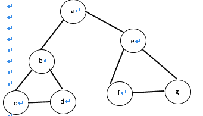

# 网易 2018 实习生招聘笔试题-测试开发实习生

## 1

关于随机测试，以下哪一项说明是正确的？

正确答案: A   你的答案: 空 (错误)

```cpp
随机测试是根据测试的经验在无测试用例的情况下进行的测试。
```

```cpp
随机测试也是需要写一定的测试用例，但可以用例中没有的测试点。
```

```cpp
随机测试不会产生测试冗余。
```

```cpp
随机测试是程序员自已开发时候进行的测试。
```

本题知识点

网易 Java 工程师 C++工程师 iOS 工程师 安卓工程师 运维工程师 前端工程师 算法工程师 PHP 工程师 测试开发工程师 网易 2018

讨论

[弓不晓长](https://www.nowcoder.com/profile/43865079)

随机测试：软件测试中除了根据测试用例和测试说明书进行测试之外，还需要进行随机测试，主要是根据测试者的经验，对软件进行功能和性能抽查，是保证测试覆盖完整性的有效方式和过程。随机测试又称为探索性测试。随机测试中所有输入数据都是随机产生的，其目的是为模拟用户的真是操作。

发表于 2019-09-16 16:40:45

* * *

[只想划水](https://www.nowcoder.com/profile/743029166)

随机测试：是指测试中的所有的输入数据都是随机产生的，其他的目的是模拟用户的真是操作，并发现一些边缘性的问题。 随机性的测试可以发现一些隐蔽的错误，但是也有很多缺点，例如测试不统计、无法统计代码覆盖率和需求盖率、发现的问题难以重现。一般是在放下测试的最后执行，随机测试更专业的升级版本叫做探索性测试。

发表于 2019-08-21 10:43:24

* * *

## 2

在对某支持语音聊天的 SDK 进行利用并二次开发后，关于语音功能的测试用例下列哪项是错误的？

正确答案: D   你的答案: 空 (错误)

```cpp
语音聊天功能的测试用例里，应该考虑语音请求发送的测试
```

```cpp
发送音频功能的测试用例里，应考虑语音是否能正常被播放的测试
```

```cpp
语音聊天功能的测试用例里，应考虑不能正常被接通时，对话框内出现的提示信息的测试
```

```cpp
发送音频功能的测试用例里，不需要测试音频未加载成功的测试。
```

本题知识点

网易 Java 工程师 C++工程师 iOS 工程师 安卓工程师 运维工程师 前端工程师 算法工程师 PHP 工程师 测试开发工程师 网易 2018

## 3

如何将当前目录下所有 pdf 文件内容转换成 txt 文件内容？

正确答案: B   你的答案: 空 (错误)

```cpp
for *.pdf to *.txt
```

```cpp
for f in `ls *.pdf`; do pdftotext “$f”; done
```

```cpp
do `ls *.pdf` pdftotext `*.txt`
```

```cpp
pdftotext *.pdf *.txt
```

本题知识点

网易 Java 工程师 C++工程师 iOS 工程师 安卓工程师 运维工程师 前端工程师 算法工程师 PHP 工程师 测试开发工程师 2018

讨论

[不服输的南瓜](https://www.nowcoder.com/profile/6088319)

# shell 脚本编程 for f in `ls *.pdf`   # 倒引号表示 shell 执行这条语句，并将执行结果作为这个表达式的值 do     pdftotext     “$f”                  # shell 在碰到“$”的变量时会自动将其替换为这个变量的值 done

发表于 2019-08-02 17:00:33

* * *

## 4

如何从有数字规律的网址抓取网页并保存在当前目录？假设网址为 [`test/0.xml`](http://test/0.xml)，其中这个数字可以递增到 100。

正确答案: D   你的答案: 空 (错误)

```cpp
for(int i=0; i&lt;100;++i)<br>wget http://test/$i.xml;
```

```cpp
wget http://test/{$0-$100}.xml
```

```cpp
wget http://test/`[0-100]`.xml
```

```cpp
for((i=0;i&lt;100;++i));<br>do<br>wget http://test/$i.xml;<br>done
```

本题知识点

网易 Java 工程师 C++工程师 iOS 工程师 安卓工程师 运维工程师 前端工程师 算法工程师 PHP 工程师 测试开发工程师 2018

讨论

[不服输的南瓜](https://www.nowcoder.com/profile/6088319)

# <br>表示换行 for(i=0;i<100;++i)do    wget http://test/$i.xmldone

发表于 2019-08-02 17:08:04

* * *

## 5

统计当前目录和里面递归目录的.cpp 文件和.h 文件行数

正确答案: B   你的答案: 空 (错误)

```cpp
wc -l $(find ./ -name&quot;*.cpp&quot; &quot;*.h&quot;)
```

```cpp
wc -l $(find ./ -name&quot;*.cpp&quot;;find ./ -name&quot;*.h&quot;)
```

```cpp
find ./ -name &quot;*.cpp&quot; &quot;*.h&quot; | wc -l
```

```cpp
wc -l $(find ./ -name&quot;*.cpp&quot; &amp;&amp; &quot;*.h&quot;)
```

本题知识点

网易 Java 工程师 C++工程师 iOS 工程师 安卓工程师 运维工程师 前端工程师 算法工程师 PHP 工程师 测试开发工程师 网易 2018

## 6

在 Linux 系统中，可以用来查找可执行文件的是？(1)whereis(2)locate(3)which(4)type(5)find

正确答案: D   你的答案: 空 (错误)

```cpp
(1)(2)(3)
```

```cpp
(1)(2)(5)
```

```cpp
(1)(2)(3)(5)
```

```cpp
(1)(2)(3)(4)(5)
```

本题知识点

网易 Java 工程师 C++工程师 iOS 工程师 安卓工程师 运维工程师 前端工程师 算法工程师 PHP 工程师 测试开发工程师 网易 2018

讨论

[蓝齐儿](https://www.nowcoder.com/profile/674273)

在 linux 要查找某个文件，可以使用下面的一些命令来搜索： 

      which  查看可执行文件的位置。

      whereis 查看文件的位置。 

      locate   配合数据库查看文件位置。

      find   实际搜寻硬盘查询文件名称

发表于 2018-06-04 09:29:01

* * *

## 7

对于以下关键字{55，26，33，80，70，90，6，30，40，20}，增量取 5 的希尔排序的第一趟的结果是：

正确答案: B   你的答案: 空 (错误)

```cpp
55，33，30，6，80，70，40，20，26，90
```

```cpp
55，6，30，40，20，90，26，33，80，70
```

```cpp
55，6，33，30，40，70，20，26，80，90
```

```cpp
55， 26，6，40，30，90，33，70，80，20
```

本题知识点

网易 Java 工程师 C++工程师 iOS 工程师 安卓工程师 运维工程师 前端工程师 算法工程师 PHP 工程师 测试开发工程师 网易 2018

讨论

[蓝齐儿](https://www.nowcoder.com/profile/674273)

以 5 位增量或者说步长来比较大小。比如，55 和 90 比较，位置保持不变；26 和 6 比较，位置调换。。以此类推

发表于 2018-06-04 09:30:56

* * *

## 8

设二叉排序树中关键字由 1 到 999 的整数构成，现要查找关键字为 321 的节点，下面关键字序列中，不可能出现在二叉排序树上的查找序列是：

正确答案: B   你的答案: 空 (错误)

```cpp
2、252、400 、398、300、344、310、321
```

```cpp
888、231、911、244、898、256、362、366
```

```cpp
888、200、666、240、312、330、321
```

```cpp
2、398、387、219、266、283、298、321
```

本题知识点

网易 Java 工程师 C++工程师 iOS 工程师 安卓工程师 运维工程师 前端工程师 算法工程师 PHP 工程师 测试开发工程师 网易 2018

讨论

[蓝齐儿](https://www.nowcoder.com/profile/674273)

通过二叉排序树查找，不可能出现像 B 一样 888 231 911 一样先比 888 小的 231，接着又出现比 888 大的 911\.一定是无论从某个数开始，后面的数都比该数小或者大。

发表于 2018-06-04 09:33:59

* * *

[守望麦田](https://www.nowcoder.com/profile/2115381)

二叉排序树（Binary Sort Tree），又称二叉查找树（Binary Search Tree），亦称二叉搜索树。二叉排序树或者是一棵空树，或者是具有下列性质的[二叉树](https://baike.sogou.com/v111776.htm)： （1）若左子树不空，则左子树上所有结点的值均小于或等于它的[根结点](https://baike.sogou.com/v66940455.htm)的值；

（2）若右子树不空，则右子树上所有结点的值均大于或等于它的根结点的值；

（3）左、右子树也分别为二叉排序树； 

发表于 2018-06-11 16:47:59

* * *

[卷十二](https://www.nowcoder.com/profile/305473019)

从第 0 个数向后遍历，如果当前数大于（小于）下一个数，则当前数应大于（小于）后面所有数。

发表于 2019-08-03 14:11:54

* * *

## 9

若对如下无向图进行遍历，则下列序列中，不是广度优先遍历序列的是（）

正确答案: D   你的答案: 空 (错误)

```cpp
e,a,f,g,b,c,d
```

```cpp
a,b,e,c,d,f,g
```

```cpp
d,b,c,a,e,f,g
```

```cpp
f,e,a,d,a,d,g
```

本题知识点

网易 Java 工程师 C++工程师 iOS 工程师 安卓工程师 运维工程师 前端工程师 算法工程师 PHP 工程师 测试开发工程师 网易 2018

讨论

[蓝齐儿](https://www.nowcoder.com/profile/674273)

深度优先搜索：类似于树的先根遍历广度优先搜索：类似于树的按层次遍历。假设从某顶点 v 出发，在访问了 v 之后，依次访问 v 的各个未曾访问过得邻接点，然后分别从这些邻接点出发依次访问它们的邻接点，并使先被访问的顶点的邻接点先于后被访问的顶点的邻接点被访问，直到图中所有已被访问的顶点的邻接点都被访问到。（所以可以为很多组。）举例：以题目无向图为例：深度遍历 DFS：a    b    c    d    e    f    g 广度遍历 BFS：a    b    e    c    d    f    g 但是 D 应该为：f    e    g    a    b    c    d

发表于 2018-06-04 09:34:59

* * *

## 10

假设某分时系统采用时间片轮转法，进程 A，B，C，D 需要运行的时间分别为 20ms，10ms，15ms，5ms，时间片选用 5ms，则平均周转时间是：

正确答案: D   你的答案: 空 (错误)

```cpp
20ms
```

```cpp
35ms
```

```cpp
35.25ms
```

```cpp
36.25ms
```

本题知识点

网易 Java 工程师 C++工程师 iOS 工程师 安卓工程师 运维工程师 前端工程师 算法工程师 PHP 工程师 测试开发工程师 网易 2018

讨论

[QZL78](https://www.nowcoder.com/profile/6203513)

在掌握了时间片轮转法概念的基础上，我们可以用一个执行时间图来形象地表示作进程的执行情况，帮助我们理解此题。具体如下：

 

根据执行时间图就可以计算各个进程的带权周转时间和平均带权周转时间了。这里要注意的是，要记住带权周转时间和平均带权周转时间的算术公式：

带权周转时间 W，即：

 W = T/R

其中 T 为周转时间，R 为实际运行时间。

平均带权周转时间为：

 

解：采用时间片轮转法进行调度，算法的性能指标如下：

| 到达时间 | 进程名 | 到达时间 | 运行时间 | 开始时间 | 完成时间 | 周转时间 | 带权周转时间 |
| 时间片=1 | A | 0 | 20 | 0 | 50 | 50 | 2.5 |
| B | 0 | 10 | 1 | 34 | 34 | 3.4 |
| C | 0 | 15 | 2 | 45 | 45 | 3.0 |
| D | 0 | 5 | 3 | 20 | 20 | 4.0 |
| 平均周转时间=37.25      平均带权周转时间=3.225 |
| 时间片=5 | A | 0 | 20 | 0 | 50 | 50 | 2.5 |
| B | 0 | 10 | 5 | 30 | 30 | 3.0 |
| C | 0 | 15 | 10 | 45 | 45 | 3.0 |
| D | 0 | 5 | 15 | 20 | 20 | 4.0 |
| 平均周转时间=36.25      平均带权周转时间=3.125 |

平均周转时间=（50+30+45+20）/4=36.25

发表于 2018-06-14 21:04:57

* * *

[牛客 1121560 号](https://www.nowcoder.com/profile/1121560)

个人觉得这个题目不是很严谨，没有说明 A、B、C、D 进程是否同时到达。

发表于 2018-05-30 15:45:50

* * *

[乔➿](https://www.nowcoder.com/profile/243742463)

先入先出原则排成队列。如果在时间片结束时进程还在运行，则 CPU 将被剥夺并分配给另一个进程。即进程运行顺序：A B C D A B C A C A 按照执行完的时间计算：（10+6+9+4）*5/4=36.25

发表于 2018-07-25 20:17:21

* * *

## 11

想实现用装饰器来计时，空白处应填的代码是？

```cpp
# -*- coding: utf-8 -*-
import time, functools
def metric(fn):
    # 空白处
    def wrapper(*args, **kw):
        startTime = time.time()
        tmp = fn(*args, **kw)
        endTime = time.time()
        print('%s executed in %s s' % (fn.__name__, endTime - startTime ))
        return tmp
    return wrapper

```

正确答案: D   你的答案: 空 (错误)

```cpp
无需填写
```

```cpp
@functools
```

```cpp
@time(fn)
```

```cpp
@functools.wraps(fn)
```

本题知识点

网易 Java 工程师 C++工程师 iOS 工程师 安卓工程师 运维工程师 前端工程师 算法工程师 PHP 工程师 测试开发工程师 网易 2018

## 12

python 是用 C 语言写成的，根据名字空间特性，以下代码经过 python 编译器编译后，一共得到（）个 PyCodeObject 对象。

```cpp
class A:
    pass
def Fun():
    pass
a = A()
Fun()
```

正确答案: C   你的答案: 空 (错误)

```cpp
= A()<br>Fun()
```

```cpp
1
```

```cpp
2
```

```cpp
3
```

```cpp
4
```

本题知识点

网易 Java 工程师 C++工程师 iOS 工程师 安卓工程师 运维工程师 前端工程师 算法工程师 PHP 工程师 测试开发工程师 2018

讨论

[resolvewang](https://www.nowcoder.com/profile/345776)

3 个 PyCodeObject 对象。PyCodeObject 的计算方式是看当前环境有多少个名字空间(或者称为作用域)，每当进入一个新的名字空间时，都会产生一个 PyCodeObject.回到这个题目，对应一个是当前 py 文件（或模块）的 PyCodeObject,一个是对应 Class A 的 PyCodeObject,还有一个则是 def Fun 对应的 PyCodeObject.

如果我的解释还未让你懂的话，可以读读陈儒写的那本《Python 源码剖析》，上面有更详细的解释

编辑于 2018-07-31 21:01:33

* * *

[TimsXH](https://www.nowcoder.com/profile/761686980)

```cpp

	class A:

	pass

	def Fun():

	  pass

	a = A()

	Fun()

	定义 A 类生成了一个类对象，定义 Fun()函数生成了一个函数对象，a=A()实例化了一个 A 类的实例对象。

	故选 C

```

发表于 2019-06-20 02:22:34

* * *

[sawatari](https://www.nowcoder.com/profile/93696828)

d

发表于 2019-07-29 09:44:48

* * *

## 13

下列关于 UDP 通信的说法错误的是（）

正确答案: C   你的答案: 空 (错误)

```cpp
发送数据之前不需要建立连接
```

```cpp
没有拥塞控制
```

```cpp
传输数据的时候对报文长度没有要求
```

```cpp
一般用在数据传输要求不高的场合
```

本题知识点

网易 Java 工程师 C++工程师 iOS 工程师 安卓工程师 运维工程师 前端工程师 算法工程师 PHP 工程师 测试开发工程师 网易 2018

讨论

[蓝齐儿](https://www.nowcoder.com/profile/674273)

（1） UDP 是一个[无连接协议](https://baike.baidu.com/item/%E6%97%A0%E8%BF%9E%E6%8E%A5%E5%8D%8F%E8%AE%AE)，传输数据之前源端和终端不建立连接，当UDP 它想传送时就简单地去抓取来自应用程序的数据，并尽可能快地把它扔到网络上。在发送端，UDP 传送数据的速度仅仅是受应用程序生成数据的速度、计算机的能力和传输带宽的限制；在接收端，UDP 把每个消息段放在队列中，应用程序每次从队列中读一个消息段。（2） 由于传输数据不建立连接，因此也就不需要维护连接状态，包括收发状态等，因此一台服务机可同时向多个客户机传输相同的消息。（3） UDP 信息包的标题很短，只有 8 个字节，相对于 TCP 的 20 个字节信息包的额外开销很小。（4） 吞吐量不受拥挤控制算法的调节，只受[应用软件](https://baike.baidu.com/item/%E5%BA%94%E7%94%A8%E8%BD%AF%E4%BB%B6)生成数据的速率、传输带宽、源端和终端主机性能的限制。（5）UDP 使用尽最大努力交付，即不保证可靠交付，因此主机不需要维持复杂的链接状态表（这里面有许多参数）。（6）UDP 是面向报文的。发送方的 UDP 对应用程序交下来的报文，在添加首部后就向下交付给 IP 层。既不拆分，也不合并，而是保留这些报文的边界，因此，应用程序需要选择合适的报文大小。虽然 UDP 是一个不可靠的协议，但它是分发信息的一个理想协议。例如，在屏幕上报告股票市场、在屏幕上显示航空信息等等。UDP 也用在[路由信息协议](https://baike.baidu.com/item/%E8%B7%AF%E7%94%B1%E4%BF%A1%E6%81%AF%E5%8D%8F%E8%AE%AE)RIP（Routing Information Protocol）中修改路由表。在这些应用场合下，如果有一个消息丢失，在几秒之后另一个新的消息就会替换它。UDP 广泛用在多媒体应用中，例如，Progressive Networks 公司开发的 RealAudio[软件](https://baike.baidu.com/item/%E8%BD%AF%E4%BB%B6)，它是在[因特网](https://baike.baidu.com/item/%E5%9B%A0%E7%89%B9%E7%BD%91)上把预先录制的或者现场音乐实时传送给客户机的一种软件，该软件使用的 RealAudio audio-on-demand protocol 协议就是运行在 UDP 之上的协议，大多数因特网电话软件产品也都运行在 UDP 之上。

发表于 2018-06-04 09:39:33

* * *

## 14

关于 HTTP1.0 和 HTTP1.1 错误的是()

正确答案: A   你的答案: 空 (错误)

```cpp
HTTP1.0 只能短连接，而 HTTP1.1 只能长连接
```

```cpp
HTTP1.0 通信的时候会占用大量内存，而 HTTP1.1 可以避免这样的情况
```

```cpp
状态码 100 只适用于 HTTP1.1 版本
```

```cpp
HTTP1.1 在 Request 消息头里多了一个 Host 域,HTTP1.0 则没有这个域
```

本题知识点

网易 Java 工程师 C++工程师 iOS 工程师 安卓工程师 运维工程师 前端工程师 算法工程师 PHP 工程师 测试开发工程师 网易 2018

讨论

[张张张远方](https://www.nowcoder.com/profile/9138688)

HTTP 1.0 需要使用 keep-alive 参数来告知服务器端要建立一个长连接，而 HTTP1.1 默认支持长连接。HTTP1.0 是没有 host 域的，HTTP1.1 才支持这个参数。

编辑于 2018-06-08 10:31:06

* * *

## 15

下面关于进程和线程说法错误的是（）

正确答案: B   你的答案: 空 (错误)

```cpp
进程是系统进行资源分配和调度的基本单位，而线程是 CPU 调度和分配的基本单位
```

```cpp
线程也拥有自己的系统资源
```

```cpp
一个线程可以创建和撤销另一个线程
```

```cpp
一个进程中的多个线程共享资源
```

本题知识点

网易 Java 工程师 C++工程师 iOS 工程师 安卓工程师 运维工程师 前端工程师 算法工程师 PHP 工程师 测试开发工程师 网易 2018

讨论

[蓝齐儿](https://www.nowcoder.com/profile/674273)

进程有独立的地址空间，线程没有。线程是共享进程的地址空间。所以 B 错。进程是 操作系统进行资源分配和调度的一个独立单位，而线程只是 CPU 调度和分派的基本单位进程是具有一定独立功能的程序关于某个数据集合上的一次运行活动，是操作系统进行资源分配和调度的一个独立单位；线程是进程的一个实体，一个进程中包含多个线程。是 CPU 调度和分派的基本单位，是比进程更小的能独立运行的基本单位主线程 CreateThread 创建新线程 

发表于 2018-06-04 09:43:40

* * *

## 16

下面关于死锁的说法错误的是（）

正确答案: D   你的答案: 空 (错误)

```cpp
死锁是指多个进程因抢占资源而发生的一种阻塞且相互等待的现象
```

```cpp
死锁的产生源于系统资源不足和进程推进顺序不当
```

```cpp
可以通过终止和撤销进程来解除死锁
```

```cpp
银行家算法用在预防死锁策略中
```

本题知识点

网易 Java 工程师 C++工程师 iOS 工程师 安卓工程师 运维工程师 前端工程师 算法工程师 PHP 工程师 测试开发工程师 网易 2018

讨论

[亲爱的暴躁的热心网友皮皮文](https://www.nowcoder.com/profile/3496468)

语文学不好我以为 避免死锁就是预防死锁

发表于 2018-07-02 19:35:46

* * *

[浅笑 201803271435779](https://www.nowcoder.com/profile/5187504)

银行家算法通过控制资源分配避免死锁

发表于 2018-06-04 19:35:49

* * *

## 17

用 1*3 的瓷砖密铺 3*20 的地板有几种方式？

正确答案: A   你的答案: 空 (错误)

```cpp
1278
```

```cpp
872
```

```cpp
595
```

```cpp
406
```

本题知识点

网易 Java 工程师 C++工程师 iOS 工程师 安卓工程师 运维工程师 前端工程师 算法工程师 PHP 工程师 测试开发工程师 网易 2018

讨论

[守望麦田](https://www.nowcoder.com/profile/2115381)

a=(1:1:20);
a(1)=1;
a(2)=1;
a(3)=2;
for i=4:20

```cpp
a(i)=a(i-1)+a(i-3);
```

end
sprintf('%d',a(20))

发表于 2018-06-11 16:06:58

* * *

[DarKLancer](https://www.nowcoder.com/profile/8638298)

分两种情况：如果第 i 个位置，是竖着放的，那么个数就是 a[i-1]；如果第 i 个位置是横着放的，那么个数就是 a[i-3]。所以相加就是总数。

发表于 2018-06-17 17:08:35

* * *

## 18

一个完全二叉树节点数为 200，则其叶子结点个数为？

正确答案: C   你的答案: 空 (错误)

```cpp
98
```

```cpp
99
```

```cpp
100
```

```cpp
101
```

本题知识点

网易 Java 工程师 C++工程师 iOS 工程师 安卓工程师 运维工程师 前端工程师 算法工程师 PHP 工程师 测试开发工程师 网易 2018

讨论

[易也](https://www.nowcoder.com/profile/5688454)

n 层满二叉树的节点总数是 2^n-1，200 个结点，7 层满二叉树，再添加剩余结点(200-127 = 73)构成完全二叉树,8 层，第 7 层有 64 个节点，其中 36 个节点上有子节点（36*2 = 72），一个结点上有一个子节点，所以共有 72+(64-36) = 100

发表于 2018-08-09 15:22:24

* * *

[蓝齐儿](https://www.nowcoder.com/profile/674273)

假设一个二叉树有 n 个节点：
度为 0 的节点个数是 n0
度为 1 的节点个数是 n1
度为 2 的节点个数是 n2
则有如下公式成立：
n0 = n2 + 1    (1)
n0 = (n +1) / 2  (2)（完全二叉树）
n = n0 + n1 +n2 
因为 n0 = n2 + 1 
所以 n = 2 * n0 + n1 - 1

因为是完全二叉树，所以 n1 只能等于 0 或 1 
所以 n = 2 * n0 - 1 或 n = 2 * n0 
也就是 n0 = (n + 1) / 2

发表于 2018-06-04 09:21:29

* * *

## 19

基于哈希算法在信息安全中主要应用在？(1)    文件校验(2)    数字签名(3)    鉴权协议

正确答案: D   你的答案: 空 (错误)

```cpp
(1)(2)
```

```cpp
(1)(3)
```

```cpp
(2)(3)
```

```cpp
(1)(2)(3)
```

本题知识点

网易 Java 工程师 C++工程师 iOS 工程师 安卓工程师 运维工程师 前端工程师 算法工程师 PHP 工程师 测试开发工程师 网易 2018

## 20

下列选项中，不可能是快速排序第 2 趟排序结果的是 （）

正确答案: C   你的答案: 空 (错误)

```cpp
4 14 10 12 8 6 18
```

```cpp
4 6 10 8 12 14 18
```

```cpp
6 4 10 8 14 12 18
```

```cpp
8 4 6 10 12 14 18
```

本题知识点

网易 Java 工程师 C++工程师 iOS 工程师 安卓工程师 运维工程师 前端工程师 算法工程师 PHP 工程师 测试开发工程师 网易 2018

讨论

[守望麦田](https://www.nowcoder.com/profile/2115381)

每经过一趟快排，轴点元素都必然就位，也就是说，一趟下来至少有 1 个元素在其最终位置
所以考察各个选项，看有几个元素就位即可。

发表于 2018-06-11 21:08:19

* * *

[wudikky](https://www.nowcoder.com/profile/36744047)

直接手工排序，比对一下，至少两个数已经在正确位置上。

发表于 2019-10-30 11:14:13

* * *

## 21

小 Q 得到一个神奇的数列: 1, 12, 123,...12345678910,1234567891011...。

并且小 Q 对于能否被 3 整除这个性质很感兴趣。

小 Q 现在希望你能帮他计算一下从数列的第 l 个到第 r 个(包含端点)有多少个数可以被 3 整除。

本题知识点

网易 Java 工程师 C++工程师 iOS 工程师 安卓工程师 运维工程师 前端工程师 算法工程师 PHP 工程师 数学 测试开发工程师 2018

讨论

[亲爱的暴躁的热心网友皮皮文](https://www.nowcoder.com/profile/3496468)

```cpp
# coding=utf-8
while 1:
    try:
        start,end=map(int,raw_input().split())
        count=0
        #left=0
        def count_3(num):
            if num%3==0:
                count=(num/3)*2
            elif num%3==1:
                count=(num/3)*2
            elif num%3==2:
                count=(num/3)*2+1
            return count
        print count_3(end)-count_3(start-1)
        break
    except:
        break
做了很久最后发现蠢是原罪，找规律就好了，三个数中，×√√，所以就不会超出内存。刚开始做的时候一直往求和能否被 3 整除上面想，即是每逢 3 清零重新 count 还是会超出内存只通过百分之七十

```

发表于 2018-07-02 21:26:14

* * *

[chenkun0402](https://www.nowcoder.com/profile/5617486)

核心思想

*   第一步：所有位上的数字之和能够被 3 整除，则这个数能够被 3 整除。
*   第二步：所有位数之和能被 3 整除的这个验证过程再简化，我们能够发现：

```cpp
1            
     1%3 = 1     
     1%3 = 1
12            
    (1+2)%3 = 0  
    ((1%3)+2%3)%3 = 0
123  
   (1+2+3)%3 = 0
    (((1%3)+2%3)%3+3%3)%3 = 0;
.....
......

// 这样是为了避免数字过大而超出了 int 范围。 
```

```cpp
import java.util.*;
public class Main{
    public static void main(String[] args){
        Scanner sc = new Scanner(System.in);
        int count = 0;
        int start = sc.nextInt();
        int end = sc.nextInt();
        int pre = 0;
        int i = 0;
        //这里用等差数列的求和公式会超出 int 范围
        for(;i<start;i++){
            pre+=i%3;
            pre%=3;
        }
        for(;i<=end;i++){
            int tempMod = i%3;
            pre+=tempMod;
            if(pre%3==0){
                count++;
            }
            pre = pre%3;
        }
        System.out.println(count);
    }
} 
```

编辑于 2018-06-13 00:48:40

* * *

[Roee](https://www.nowcoder.com/profile/2085010)

```cpp
import sys

def num(x):
    return x - (x+2)/3

l, r = [int(x) for x in sys.stdin.readline().split()]
print num(r)-num(l-1) 
```

发表于 2018-08-10 04:12:46

* * *

## 22

平面内有 n 个矩形, 第 i 个矩形的左下角坐标为(x1[i], y1[i]), 右上角坐标为(x2[i], y2[i])。

如果两个或者多个矩形有公共区域则认为它们是相互重叠的(不考虑边界和角落)。

请你计算出平面内重叠矩形数量最多的地方,有多少个矩形相互重叠。

本题知识点

网易 Java 工程师 C++工程师 iOS 工程师 安卓工程师 运维工程师 前端工程师 算法工程师 PHP 工程师 高级结构 数学 穷举 测试开发工程师 2018

讨论

[VectorYSH](https://www.nowcoder.com/profile/332263)

```cpp
#include<iostream>
#include<algorithm>
#include<vector>
using namespace std;

int main() {
    int n;
    cin>>n;
    vector<int> x1(n),x2(n),y1(n),y2(n);
    for (int i = 0; i < n; ++i)
        cin >> x1[i];
    for (int i = 0; i < n; ++i)
        cin >> y1[i];
    for (int i = 0; i < n; ++i)
        cin >> x2[i];
    for (int i = 0; i < n; ++i)
        cin >> y2[i];
    vector<int> x(x1), y(y1);
    for (int i = 0; i != n; ++i) 
    {
        x.push_back(x2[i]);
        y.push_back(y2[i]);
    }
    int result = 0;
    for (int m = 0; m < 2*n; ++m) 
    {
        for (int k = 0; k < 2 * n; ++k) 
        {
            int count = 0;
            for (int i = 0; i < n; ++i) 
            {
                if (x[m]>x1[i] && y[k] > y1[i] && x[m] <= x2[i] && y[k] <= y2[i])
                    count++;
            }
            result = max(count, result);
        }
    }
    cout << result << endl;
}

```

编辑于 2018-08-08 21:57:02

* * *

[LeslieZ](https://www.nowcoder.com/profile/9955535)

```cpp
def solve(x1,x2,y1,y2,k,xa,ya,xb,yb):
    if k==len(x1):
        return 0
    else:
        if x1[k]>=xb or y1[k]>=yb or xa>=x2[k] or ya>=y2[k]:
            return solve(x1,x2,y1,y2,k+1,xa,ya,xb,yb)
        else:
            xa1=max(xa,x1[k])
            ya1=max(ya,y1[k])
            xb1=min(xb,x2[k])
            yb1=min(yb,y2[k])
            return max(solve(x1,x2,y1,y2,k+1,xa,ya,xb,yb),\
                      solve(x1,x2,y1,y2,k+1,xa1,ya1,xb1,yb1)+1)
if __name__=='__main__':
    import sys
    n=int(input())
    a=[]
    m=4
    while m:
        ss=sys.stdin.readline()
        if ss.strip():
            line=ss.strip().split()
            a.append([int(x) for x in line])
            m-=1
    x1,y1,x2,y2=a[0],a[1],a[2],a[3]
    ans=1
    for i in range(len(x1)):
        num=solve(x1,x2,y1,y2,i,x1[i],y1[i],x2[i],y2[i])
        ans=max(num,ans)
    print(ans)

```

搜索第 i 个矩形为基准最多重叠个数

发表于 2018-08-13 21:38:12

* * *

[Roee](https://www.nowcoder.com/profile/2085010)

```cpp
import sys

def num(x, y, x1, y1, x2, y2, n):
    r = 0
    for i in range(n):
        if x > x1[i] and x < x2[i] and y > y1[i] and y < y2[i]:
            r += 1
    return r

def X(i, j, x1, y1, x2, y2, n):
    l = [[x1[i], y1[j]],
         [x1[i], y2[j]],
         [x2[i], y1[j]],
         [x2[i], y2[j]],
         [x1[j], y1[i]],
         [x1[j], y2[i]],
         [x2[j], y1[i]],
         [x2[j], y2[i]],
         [x1[i], y1[i]],
         [x1[i], y2[i]],
         [x2[i], y1[i]],
         [x2[i], y2[i]],
         [x1[j], y1[j]],
         [x1[j], y2[j]],
         [x2[j], y1[j]],
         [x2[j], y2[j]]]
    return l

n = int(sys.stdin.readline())
x1 = [int(x) for x in sys.stdin.readline().split()]
y1 = [int(x) for x in sys.stdin.readline().split()]
x2 = [int(x) for x in sys.stdin.readline().split()]
y2 = [int(x) for x in sys.stdin.readline().split()]
r = 0
for i in range(n):
    for j in range(i+1, n):
        for x, y in X(i, j, x1, y1, x2, y2, n):
            r = max(r, num(x+0.1, y+0.1, x1, y1, x2, y2, n))
            r = max(r, num(x-0.1, y+0.1, x1, y1, x2, y2, n))
            r = max(r, num(x+0.1, y-0.1, x1, y1, x2, y2, n))
            r = max(r, num(x-0.1, y-0.1, x1, y1, x2, y2, n))
print r 
```

发表于 2018-08-10 04:12:05

* * *

## 23

牛牛总是睡过头，所以他定了很多闹钟，只有在闹钟响的时候他才会醒过来并且决定起不起床。从他起床算起他需要 X 分钟到达教室，上课时间为当天的 A 时 B 分，请问他最晚可以什么时间起床

本题知识点

网易 Java 工程师 C++工程师 iOS 工程师 安卓工程师 运维工程师 前端工程师 算法工程师 PHP 工程师 测试开发工程师 2018

讨论

[我要上岸！！](https://www.nowcoder.com/profile/149866270)

```cpp
n = int(input())
arr = []
for i in range(n):
    arr.append([int(n) for n in input().split()])
arr = sorted(arr)
x = int(input())
ab = [int(n) for n in input().split()]

need = []
need.append(x // 60)
need.append(x % 60)
time = list(map(lambda x: x[0]-x[1], zip(ab, need)))
if time[1] < 0:
    time[0] -= 1
    time[1] = 60 + time[1]
for i in range(n-1, -1, -1):
    if arr[i][0] < time[0] or (arr[i][0] == time[0] and arr[i][1] <= time[1]):
        for item in arr[i]:
            print(item, end=" ")
        break
    continue
```

发表于 2019-08-13 09:16:10

* * *

[天启 ddd](https://www.nowcoder.com/profile/5436924)

```cpp
#include <bits/stdc++.h>
using namespace std;
struct alm{
    int h;
    int m;
    void showalm(void){
        cout<<h<<" "<<m<<endl;
    }
};
bool comp(int h1,int m1,int h2,int m2){
    if(h1>h2) return true;
    if(h1==h2){
        if(m1>m2) return true;
    }
    return false;
}
int main(void){
    int n=0,i=0,j=0;
    int h,m,time,hclass,mclass;
    struct alm temp;
    vector<alm> avec;
    cin>>n;
    for(i=0;i<n;++i){
        cin>>h>>m;
        temp.h=h;
        temp.m=m;
        avec.push_back(temp);
    }
    cin>>time;
    cin>>hclass>>mclass;
    if(time<=mclass){
        mclass=mclass-time;
    }
    else if(time>mclass){
        time=time-mclass-1;
        mclass=59;
        hclass--;
        if(time<=59){
            mclass=mclass-time;
        }
        if(time>59){
            time=time-mclass-1;
            hclass--;
            mclass=59-time;
        }
    }

    temp.h=avec[0].h;
    temp.m=avec[0].m;
    for(i=0;i<n;++i){
        h=avec[i].h;
        m=avec[i].m;
        if(comp(h,m,hclass,mclass)) continue;
        if(comp(h,m,temp.h,temp.m)){
            temp.h=h;
            temp.m=m;
        }
    }

    temp.showalm();
    return 0;
}

```

发表于 2019-06-25 10:36:03

* * *

[惜兮 0122](https://www.nowcoder.com/profile/4838030)

  var N = parseInt(readline()); //闹钟个数
  var arrAlarm = [];  //闹钟数组
  var arrMin = [];    //转换为分钟的闹钟数组
  for(var i = 0; i < N; i++){
      arrAlarm[i] = readline().split(' ');
      arrMin[i] = parseInt(arrAlarm[i][0]) * 60 + parseInt(arrAlarm[i][1]);
  }        arrMin.sort();
        //print(arrMin);
  var time = parseInt(readline());  //路上需要的时间
  var classTime = readline().split(' ');

  var classTime1 = parseInt(classTime[0]) * 60 + parseInt(classTime[1]);  //上课时间

  var wakeup = 0;
        for(var j = 0; j < N; j++){
      if(arrMin[j] + time <= classTime1){
                if(wakeup < arrMin[j]){
                    wakeup = arrMin[j];
                }
      }
  }
  print(parseInt(wakeup/60),parseInt(wakeup%60));

发表于 2019-08-11 22:14:03

* * *

## 24

目前有一个商品表，包含商品 id，商品名称，商品价格。请问：如何查询价格大于 100，小于 500 的商品 id 以及名称？

你的答案

本题知识点

网易 Java 工程师 C++工程师 iOS 工程师 安卓工程师 运维工程师 前端工程师 算法工程师 PHP 工程师 测试开发工程师 2018

讨论

[QNN](https://www.nowcoder.com/profile/8912129)

SELECT id, product_name from puoduct_list where product_price > 100 and product_price < 500;

发表于 2018-08-11 11:00:46

* * *

[牛客 8906951 号](https://www.nowcoder.com/profile/8906951)

SELECT id, product_name FROM Product WHERE id > 100 AND id < 500;

发表于 2018-08-10 14:21:06

* * *

[佛性求求 offer](https://www.nowcoder.com/profile/1818608)

| SELECT id ,product_name FROM Product WHERE product_price > 100AND product_price < 500; |

发表于 2018-06-28 11:01:05

* * *

## 25

随着商品类型的增加，在第 1 题的基础上商品增加 sku 属性，新增一张 sku 表，包含商品 id ，skuid，sku 名字，sku 价格请问：如何查询最低价大于 100 的商品 id 以及名称？

你的答案

本题知识点

网易 Java 工程师 C++工程师 iOS 工程师 安卓工程师 运维工程师 前端工程师 算法工程师 PHP 工程师 测试开发工程师 2018

讨论

[牛客 8906951 号](https://www.nowcoder.com/profile/8906951)

SELECT 

发表于 2018-08-10 14:21:00

* * *

[佛性求求 offer](https://www.nowcoder.com/profile/1818608)

```cpp
SELECT id ,product_name FROM Sku WHERE sku_price > 100;
```

发表于 2018-06-28 11:02:03

* * *

## 26

考拉的一个基本购物流程如下：1、用户选择商品 G1...GN(假设有 N 个商品)2、判断 N 个商品是否参加活动 A1（活动有时间周期），参加则按照活动价 PAn 购买，未参加则按照正常价 Pn 购买请作答：（1）请用熟悉的语言编写实现以上流程，数据库相关可简单设计（2）针对编写的代码，设计测试用例覆盖测试点

你的答案

本题知识点

网易 Java 工程师 C++工程师 iOS 工程师 安卓工程师 运维工程师 前端工程师 算法工程师 PHP 工程师 测试开发工程师 2018