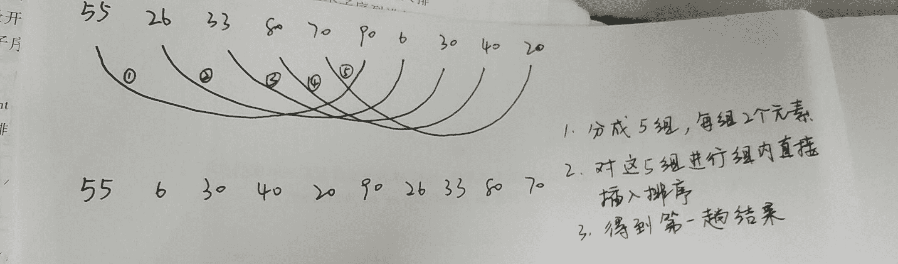

# 网易 2018 实习生招聘笔试题-iOS 开发实习生

## 1

MyClass *ref1 = [MyClass new];
__weak MyClass *ref2 = ref1;
MyClass *ref3 = ref1;
__unsafe_unretained MyClass *ref4 = ref1;
ref2 = nil;
以上代码执行完 MyClass 实例的引用计数是几？

正确答案: C   你的答案: 空 (错误)

```cpp
0
```

```cpp
1
```

```cpp
2
```

```cpp
3
```

本题知识点

网易 iOS 工程师 2018

## 2

以下哪个布局方式不是 iOS 原生支持的

正确答案: B   你的答案: 空 (错误)

```cpp
AutoresizingMasks
```

```cpp
BoxLayout
```

```cpp
AutoLayout
```

```cpp
view.frame
```

本题知识点

网易 iOS 工程师 2018

## 3

Xcode Instruments 不包含以下哪个工具

正确答案: D   你的答案: 空 (错误)

```cpp
Leaks
```

```cpp
Time Profiler
```

```cpp
Core Animation
```

```cpp
Core Text
```

本题知识点

网易 iOS 工程师 2018

## 4

关于 UIView 和 CALayer 下列说法错误的是:

正确答案: D   你的答案: 空 (错误)

```cpp
UIView 内部会自动创建一个图层(即 CALayer 对象) 。
```

```cpp
通过 UIView 的 layer 属性可以访问 UIView 中的 Root Layer（根层）。
```

```cpp
CALayer 不能直接使用 UIImage、UIColor，只能使用 CGImageRef、CGColorRef。
```

```cpp
CALayer 可以处理用户的触摸事件。
```

本题知识点

网易 iOS 工程师 2018

## 5

为了找到自己满意的工作，牛牛收集了每种工作的难度和报酬。牛牛选工作的标准是在难度不超过自身能力值的情况下，牛牛选择报酬最高的工作。在牛牛选定了自己的工作后，牛牛的小伙伴们来找牛牛帮忙选工作，牛牛依然使用自己的标准来帮助小伙伴们。牛牛的小伙伴太多了，于是他只好把这个任务交给了你。

本题知识点

网易 iOS 工程师 排序 *模拟 贪心 2018* *讨论

[Gray 皓白](https://www.nowcoder.com/profile/153115062)

```cpp
正确答案是要用 Map 做，我试过用快速排序只能通过 70%的测试用例
```

发表于 2019-03-14 19:53:03

* * *

## 6

关于 http 协议以下说法不正确的是：
1.304 表示临时重定向
2.range 请求响应一定是用 http 状态码 206 表示成功
3.http 的 header 分割符是\r
4.请求参数如果包含%，需要进行 encode

正确答案: A   你的答案: 空 (错误)

```cpp
1，3
```

```cpp
1，4
```

```cpp
2，3
```

```cpp
2，4
```

```cpp
3，4
```

本题知识点

网易 iOS 工程师 iOS 工程师 网易 2018

## 7

关于计算机网络，以下说法正确的是(1)在向下的过程中，需要添加下层协议所需要的首部或者尾部(2)在向上的过程中不断拆开首部和尾部(3)在向上的过程中，需要添加下层协议所需要的首部或者尾部(4)在向下的过程中不断拆开首部和尾部(5)SMTP 属于 TCP 协议(6)POP3 属于 UDP 协议(7)DNS 属于 TCP 协议(8)Telnet 属于 UDP 协议

正确答案: A   你的答案: 空 (错误)

```cpp
(1)(2)(5)
```

```cpp
(1)(2)(6)
```

```cpp
(1)(2)(8)
```

```cpp
(3)(4)(5)(6)
```

```cpp
(3)(4)(5)(7)
```

本题知识点

网易 iOS 工程师 iOS 工程师 网易 2018

## 8

已知一棵树具有 10 个节点，且度为 4，那么：

正确答案: D   你的答案: 空 (错误)

```cpp
该树的高度至少是 6
```

```cpp
该树的高度至多是 6
```

```cpp
该树的高度至少是 7
```

```cpp
该树的高度至多是 7
```

本题知识点

网易 iOS 工程师 iOS 工程师 网易 2018

## 9

对于以下关键字{55，26，33，80，70，90，6，30，40，20}，增量取 5 的希尔排序的第一趟的结果是：

正确答案: B   你的答案: 空 (错误)

```cpp
55，33，30，6，80，70，40，20，26，90
```

```cpp
55，6，30，40，20，90，26，33，80，70
```

```cpp
55，6，33，30，40，70，20，26，80，90
```

```cpp
55， 26，6，40，30，90，33，70，80，20
```

本题知识点

网易 iOS 工程师 iOS 工程师 网易 2018

讨论

[桥下的风](https://www.nowcoder.com/profile/988590)

希尔排序的算法思想：首先将待排序序列分割成若干个较稀疏的子序列，分别进行直接插入排序。此时整个序列中的记录已经基本有序，然后再对全部序列进行一次直接插入排序。

发表于 2018-06-02 21:46:40

* * *

## 10

设二叉排序树中关键字由 1 到 999 的整数构成，现要查找关键字为 321 的节点，下面关键字序列中，不可能出现在二叉排序树上的查找序列是：

正确答案: B   你的答案: 空 (错误)

```cpp
2、252、400 、398、300、344、310、321
```

```cpp
888、231、911、244、898、256、362、366
```

```cpp
888、200、666、240、312、330、321
```

```cpp
2、398、387、219、266、283、298、321
```

本题知识点

网易 iOS 工程师 iOS 工程师 网易 2018

## 11

若对如下无向图进行遍历，则下列序列中，不是广度优先遍历序列的是（）

正确答案: D   你的答案: 空 (错误)

```cpp
e,a,f,g,b,c,d
```

```cpp
a,b,e,c,d,f,g
```

```cpp
d,b,c,a,e,f,g
```

```cpp
f,e,a,d,a,d,g
```

本题知识点

网易 iOS 工程师 iOS 工程师 网易 2018

## 12

一组记录的关键字为{15，14，1，10，17，53，68}，用链地址法构造散列表，散列函数为 H(key)=key MOD 13，则散列地址为 1 的链中有（）个记录

正确答案: C   你的答案: 空 (错误)

```cpp
1
```

```cpp
2
```

```cpp
3
```

```cpp
4
```

本题知识点

网易 iOS 工程师 iOS 工程师 网易 2018

## 13

以下哪种情况会使得进程由执行状态转变成阻塞状态

正确答案: D   你的答案: 空 (错误)

```cpp
时间片用完
```

```cpp
进程调度
```

```cpp
I/O 完成
```

```cpp
I/O 请求
```

本题知识点

网易 iOS 工程师 iOS 工程师 网易 2018

## 14

假设某分时系统采用时间片轮转法，进程 A，B，C，D 需要运行的时间分别为 20ms，10ms，15ms，5ms，时间片选用 5ms，则平均周转时间是：

正确答案: D   你的答案: 空 (错误)

```cpp
20ms
```

```cpp
35ms
```

```cpp
35.25ms
```

```cpp
36.25ms
```

本题知识点

网易 iOS 工程师 iOS 工程师 网易 2018

## 15

假设某系统为进程在内存中分配了 3 个物理块，进程访问顺序为 0、2、1、3、0、2、4、0、2、1、3、4。已知系统未事先调入任何页面，那么当采用 FIFO 置换算法时，缺页率是：

正确答案: C   你的答案: 空 (错误)

```cpp
33.3%
```

```cpp
25%
```

```cpp
75%
```

```cpp
60%
```

本题知识点

网易 iOS 工程师 iOS 工程师 网易 2018

## 16

下列关于 UDP 通信的说法错误的是（）

正确答案: C   你的答案: 空 (错误)

```cpp
发送数据之前不需要建立连接
```

```cpp
没有拥塞控制
```

```cpp
传输数据的时候对报文长度没有要求
```

```cpp
一般用在数据传输要求不高的场合
```

本题知识点

网易 iOS 工程师 iOS 工程师 网易 2018

## 17

下面关于进程和线程说法错误的是（）

正确答案: B   你的答案: 空 (错误)

```cpp
进程是系统进行资源分配和调度的基本单位，而线程是 CPU 调度和分配的基本单位
```

```cpp
线程也拥有自己的系统资源
```

```cpp
一个线程可以创建和撤销另一个线程
```

```cpp
一个进程中的多个线程共享资源
```

本题知识点

网易 iOS 工程师 iOS 工程师 网易 2018

## 18

有 20 个人去看电影，电影票 50 元。其中只有 10 个人有 50 元钱，另外 10 个人都只有一张面值 100 元的纸币，电影院没有其他钞票可以找零，问有多少种找零的方法？

正确答案: A   你的答案: 空 (错误)

```cpp
16796
```

```cpp
16798
```

```cpp
16794
```

```cpp
16792
```

本题知识点

网易 iOS 工程师 iOS 工程师 网易 2018

## 19

已知中序遍历的序列为 abcdef，高度最小的不可能的二叉树的前序遍历是

正确答案: D   你的答案: 空 (错误)

```cpp
dbacfe
```

```cpp
dbacef
```

```cpp
cbaedf
```

```cpp
cabefd
```

本题知识点

网易 iOS 工程师 iOS 工程师 网易 2018

## 20

关于 iOS 常用组件 UILabel 以下说法错误的是：

正确答案: D   你的答案: 空 (错误)

```cpp
UILabel 继承于 UIView
```

```cpp
UILabel 可以显示多行文本
```

```cpp
可以通过 UIFont 来设置 UILabel 中的字体大小
```

```cpp
UILabel 仅可以展示文字，不能响应用户的触摸事件
```

本题知识点

网易 iOS 工程师 2018

## 21

Objective-c 表达式 c = a ?: b 等价于下面哪项表达式

正确答案: A   你的答案: 空 (错误)

```cpp
c = a != nil ? a : b
```

```cpp
c = a != nil ? b : a
```

```cpp
c = (a != nil) &amp;&amp; (b != nil)
```

```cpp
c = (a != nil) || (b != nil)
```

本题知识点

网易 iOS 工程师 2018

讨论

[汪检峰](https://www.nowcoder.com/profile/9577524)

这个题其实在考运算符的优先级。
A 选项实际上可看成

```cpp
 c = ((a != nil) ? a : b ) 
```

B 同理，C 没看白（~_~），D 很明显错误

发表于 2018-06-02 23:42:12

* * *

## 22

小 Q 得到一个神奇的数列: 1, 12, 123,...12345678910,1234567891011...。

并且小 Q 对于能否被 3 整除这个性质很感兴趣。

小 Q 现在希望你能帮他计算一下从数列的第 l 个到第 r 个(包含端点)有多少个数可以被 3 整除。

本题知识点

网易 iOS 工程师 数学 2018

讨论

[Pdw2007](https://www.nowcoder.com/profile/514575869)

这题就是考数学

发表于 2018-06-29 15:24:07

* * *

[pcshao](https://www.nowcoder.com/profile/2046278)

这题表示考点不明确..

发表于 2018-06-29 00:08:03

* * *

[笑话 At](https://www.nowcoder.com/profile/1087715)

```cpp
找规律，第 1 个数不能被 3 整除，第 2、3 个可以；第 4 个数不能被 3 整除，第 5、6 个可以。。。。。。。。。。。。。。
```

发表于 2018-06-28 16:13:09

* * *

## 23

牛牛去犇犇老师家补课，出门的时候面向北方，但是现在他迷路了。虽然他手里有一张地图，但是他需要知道自己面向哪个方向，请你帮帮他。

本题知识点

网易 iOS 工程师 字符串 *模拟 2018* *讨论

[开心超人 129267](https://www.nowcoder.com/profile/7923543)

```cpp
import java.io.BufferedReader;
import java.io.IOException;
import java.io.InputStreamReader;

public class Main {
    public static void main(String[] args) throws IOException{
        BufferedReader reader = new BufferedReader(new InputStreamReader(System.in));
        int n = Integer.parseInt(reader.readLine().trim());
        String str = reader.readLine().trim();

        String[] d = {"N", "W", "S", "E", "N"};
        int res = 0;
        for(int i=0;i<n;++i) {
            if(str.charAt(i) == 'L') {
                ++res;
            }else {
                --res;
            }
        }

        if(res >= 0) {
            System.out.println(d[res%4]);
        }else {
            res = -res;
            System.out.println(d[4-res%4]);
        }
    }
} 
```

发表于 2018-09-08 13:35:51

* * *

[Disconnect](https://www.nowcoder.com/profile/4864974)

```cpp
#默认为北方，北，东，南，西
outstr = 'NESW'
point = 0
n = input()
n = int(n)
letter = input()
for i in letter:
    if i=='L':
        point-=1
    else:
        point+=1
    if point>0 and point ==4:
        point = 0
    elif point<0 and point==-5:
        point = 3
print(outstr[point])
```

发表于 2018-12-26 11:44:25

* * *

[teksab](https://www.nowcoder.com/profile/6165349)

```cpp
if __name__ == '__main__':
    count = int(input())  
    string1 = input()
    countl=0
    countr=0
    for i in range(count):
        if string1[i]=='L':
            countl+=1
        else:countr+=1
    if countl>=countr:
        flag=1
    else:flag=0

    if abs(countl-countr)%4==0:
        print('N')
    elif abs(countl-countr)%4==2:
        print('S')
    else:
        pnum=(abs(countl-countr)%4)//2
        flag=(1-flag)*pnum+flag*(1-pnum)
        print('%s'%('W'*flag+'E'*(1-flag)))
```

发表于 2018-09-03 23:59:24

* * *

## 24

简述 UIViewController 的生命周期

你的答案

本题知识点

网易 iOS 工程师 2018

## 25

简述 iOS 系统中的触屏事件分发及响应流程

你的答案

本题知识点

网易 iOS 工程师 2018**