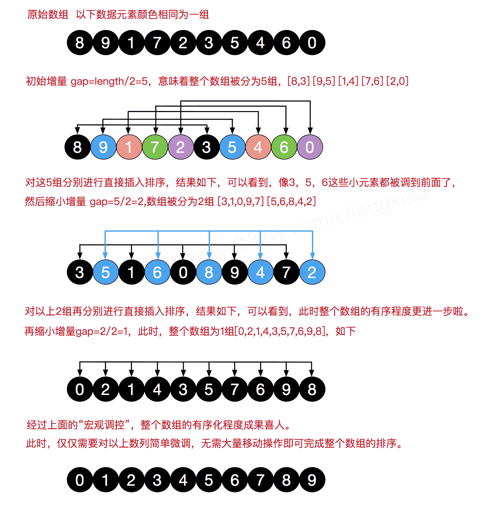

# 网易 2018 实习生招聘笔试题-Android 开发实习生

## 1

关于 http 协议以下说法不正确的是：
1.304 表示临时重定向
2.range 请求响应一定是用 http 状态码 206 表示成功
3.http 的 header 分割符是\r
4.请求参数如果包含%，需要进行 encode

正确答案: A   你的答案: 空 (错误)

```cpp
1，3
```

```cpp
1，4
```

```cpp
2，3
```

```cpp
2，4
```

```cpp
3，4
```

本题知识点

网易 安卓工程师 安卓工程师 网易 2018

讨论

[字节跳动 Android 工程师](https://www.nowcoder.com/profile/361998)

HTTP 304 未改变说明无需再次传输请求的内容,也就是说可以使用缓存的内容 301 永久重定向、302 暂时重定向
http 请求字段 range:    格式： Range: bytes=start-end
    请求资源的部分内容（不包括响应头的大小），单位是 byte，即字节，从 0 开始.

    如果服务器能够正常响应的话，服务器会返回 206 Partial Content 的状态码及说明.

    如果不能处理这种 Range 的话，就会返回整个资源以及响应状态码为 200 OK .http 的 header 分割符：\r\n

发表于 2018-08-29 20:15:23

* * *

[Shirley_BHU](https://www.nowcoder.com/profile/6055089)

| 304（未修改） | 自从上次请求后，请求的网页未修改过。服务器返回此响应时，不会返回网页内容。如果网页自请求者上次请求后再也没有更改过，您应将服务器配置为返回此响应（称为 If-Modified-Since HTTP 标头）。服务器可以告诉 Googlebot 自从上次抓取后网页没有变更，进而节省带宽和开销。 |

发表于 2018-05-29 22:29:17

* * *

## 2

关于计算机网络，以下说法正确的是(1)在向下的过程中，需要添加下层协议所需要的首部或者尾部(2)在向上的过程中不断拆开首部和尾部(3)在向上的过程中，需要添加下层协议所需要的首部或者尾部(4)在向下的过程中不断拆开首部和尾部(5)SMTP 属于 TCP 协议(6)POP3 属于 UDP 协议(7)DNS 属于 TCP 协议(8)Telnet 属于 UDP 协议

正确答案: A   你的答案: 空 (错误)

```cpp
(1)(2)(5)
```

```cpp
(1)(2)(6)
```

```cpp
(1)(2)(8)
```

```cpp
(3)(4)(5)(6)
```

```cpp
(3)(4)(5)(7)
```

本题知识点

网易 安卓工程师 安卓工程师 网易 2018

讨论

[喜茶妹妹在欧洲读硕士](https://www.nowcoder.com/profile/7342598)

POP3 属于 TCP。[`zhidao.baidu.com/question/342279792.html`](https://zhidao.baidu.com/question/342279792.html)。所以带 6 的不选。DNS 在进行区域传输的时候使用 TCP 协议，其它时候则使用 UDP 协议。所以带 7 的也是错的。只剩下 125 和 128.
Telnet 是 TCP，所以 8 不对，剩下第一个。

编辑于 2018-08-11 01:10:13

* * *

## 3

已知一棵树具有 10 个节点，且度为 4，那么：

正确答案: D   你的答案: 空 (错误)

```cpp
该树的高度至少是 6
```

```cpp
该树的高度至多是 6
```

```cpp
该树的高度至少是 7
```

```cpp
该树的高度至多是 7
```

本题知识点

网易 安卓工程师 安卓工程师 网易 2018

讨论

[压住自己的情绪](https://www.nowcoder.com/profile/725983762)

画图，度为 4 一棵树最高 4 个节点，而看高度可以从任意节点开始数，最高高度则为 7

发表于 2019-09-20 09:53:08

* * *

[NickelFox](https://www.nowcoder.com/profile/3737495)

树的度为 4，说明至少有一个节点拥有四个孩子。因此，树的高度最多只能是 7（画个图一下子就看懂啦）

发表于 2018-08-06 22:08:15

* * *

## 4

对于以下关键字{55，26，33，80，70，90，6，30，40，20}，增量取 5 的希尔排序的第一趟的结果是：

正确答案: B   你的答案: 空 (错误)

```cpp
55，33，30，6，80，70，40，20，26，90
```

```cpp
55，6，30，40，20，90，26，33，80，70
```

```cpp
55，6，33，30，40，70，20，26，80，90
```

```cpp
55， 26，6，40，30，90，33，70，80，20
```

本题知识点

网易 安卓工程师 安卓工程师 网易 2018

讨论

[Shirley_BHU](https://www.nowcoder.com/profile/6055089)



发表于 2018-05-29 22:34:19

* * *

## 5

设二叉排序树中关键字由 1 到 999 的整数构成，现要查找关键字为 321 的节点，下面关键字序列中，不可能出现在二叉排序树上的查找序列是：

正确答案: B   你的答案: 空 (错误)

```cpp
2、252、400 、398、300、344、310、321
```

```cpp
888、231、911、244、898、256、362、366
```

```cpp
888、200、666、240、312、330、321
```

```cpp
2、398、387、219、266、283、298、321
```

本题知识点

网易 安卓工程师 安卓工程师 网易 2018

讨论

[不二先生 _yang](https://www.nowcoder.com/profile/9059309)

很直观啊，B 选项中没有出现 321 这个数字！！！

发表于 2018-06-21 10:35:46

* * *

[浊雨落沧桑](https://www.nowcoder.com/profile/8965652)

911 比 888 和 231 都大了

发表于 2018-07-31 16:46:09

* * *

## 6

若对如下无向图进行遍历，则下列序列中，不是广度优先遍历序列的是（）

正确答案: D   你的答案: 空 (错误)

```cpp
e,a,f,g,b,c,d
```

```cpp
a,b,e,c,d,f,g
```

```cpp
d,b,c,a,e,f,g
```

```cpp
f,e,a,d,a,d,g
```

本题知识点

网易 安卓工程师 安卓工程师 网易 2018

讨论

[梧梓棋](https://www.nowcoder.com/profile/591032979)

广度优先搜索：从某个顶点开始，先访问该顶点，再依次访问该顶点的每一个未被访问过的邻结点，并且遵循“先被访问的顶点，其邻结点就先被访问”。

深度优先搜索：类似于树的先根遍历，是树的先根遍历的推广。

发表于 2018-09-01 00:10:45

* * *

## 7

一组记录的关键字为{15，14，1，10，17，53，68}，用链地址法构造散列表，散列函数为 H(key)=key MOD 13，则散列地址为 1 的链中有（）个记录

正确答案: C   你的答案: 空 (错误)

```cpp
1
```

```cpp
2
```

```cpp
3
```

```cpp
4
```

本题知识点

网易 安卓工程师 安卓工程师 网易 2018

讨论

[梧梓棋](https://www.nowcoder.com/profile/591032979)

14%13=11%13=153%13=1

发表于 2018-09-01 00:08:41

* * *

## 8

以下哪种情况会使得进程由执行状态转变成阻塞状态

正确答案: D   你的答案: 空 (错误)

```cpp
时间片用完
```

```cpp
进程调度
```

```cpp
I/O 完成
```

```cpp
I/O 请求
```

本题知识点

网易 安卓工程师 安卓工程师 网易 2018

讨论

[Shirley_BHU](https://www.nowcoder.com/profile/6055089)

 执行→阻塞
正在执行的进程因等待某种事件发生而无法继续执行时，便从执行状态变成阻塞状态。知识点： (1) 就绪→执行
处于就绪状态的进程，当进程调度程序为之分配了处理机后，该进程便由就绪状态转变成执行状态。

(2) 执行→就绪
处于执行状态的进程在其执行过程中，因分配给它的一个时间片已用完而不得不让出处理机，于是进程从执行状态转变成就绪状态。

(3) 执行→阻塞
正在执行的进程因等待某种事件发生而无法继续执行时，便从执行状态变成阻塞状态。

(4) 阻塞→就绪
处于阻塞状态的进程，若其等待的事件已经发生，于是进程由阻塞状态转变为就绪状态。

1：就绪->执行， 当前运行进程阻塞，调度程序选一个优先权最高的进程占有处理机；
2：执行->就绪， 当前运行进程时间片用完；
3：执行->阻塞，当前运行进程等待键盘输入，进入了睡眠状态。
4：阻塞->就绪，I/O 操作完成，被中断处理程序唤醒。 

发表于 2018-05-29 22:39:44

* * *

## 9

给定 Java 代码如下所示，则编译运行后，输出结果是（ ）。

```cpp
public class Test {
    static int a;
    int b;
    static int c;

    public int aMethod() {
        a++;
        return a;
    }

    public int bMethod() {
        b++;
        return b;
    }

    public static int cMethod() {
        c++;
        return c;
    }

    public static void main(String args[]) {
        Test test1 = new Test();
        test1.aMethod();
        System.out.println(test1.aMethod());
        Test test2 = new Test();
        test2.bMethod();
        System.out.println(test2.bMethod());
        Test test3 = new Test();
        test3.cMethod();
        System.out.println(test3.cMethod());
    }
}
```

正确答案: D   你的答案: 空 (错误)

```cpp
1 0 2
```

```cpp
2 1 2
```

```cpp
0 0 2
```

```cpp
2 2 2
```

本题知识点

网易 安卓工程师 安卓工程师 网易 2018

讨论

[Mr.倪](https://www.nowcoder.com/profile/1469609)

初始值都是 0 吗

发表于 2020-05-19 11:11:08

* * *

[～z](https://www.nowcoder.com/profile/58064788)

创建对象后执行一次++，输出前一次++，因此输出 2

发表于 2018-11-29 18:01:20

* * *

[天降之物~](https://www.nowcoder.com/profile/420657659)

静态方法中不能访问非静态的成员方法和非静态的成员变量，但是在非静态的成员方法中是可以访问静态成员方法/变量的。

发表于 2018-11-29 13:47:09

* * *

## 10

在 JDK1.8 中，HashMap 没有实现哪个接口（ ）。

正确答案: B   你的答案: 空 (错误)

```cpp
Map
```

```cpp
AbstractMap
```

```cpp
Serializable
```

```cpp
Cloneable
```

本题知识点

网易 安卓工程师 安卓工程师 网易 2018

讨论

[踏沙而行*](https://www.nowcoder.com/profile/9401145)

HashMap 继承于 AbstractMap，实现了 Map、Cloneable、java.io.Serializable 接口。Cloneable 接口没有定义成员。它通常用于指明被创建的一个允许对对象进行位复制（也就是对象副本）的类。

发表于 2018-06-01 21:39:21

* * *

## 11

下面关于进程和线程说法错误的是（）

正确答案: B   你的答案: 空 (错误)

```cpp
进程是系统进行资源分配和调度的基本单位，而线程是 CPU 调度和分配的基本单位
```

```cpp
线程也拥有自己的系统资源
```

```cpp
一个线程可以创建和撤销另一个线程
```

```cpp
一个进程中的多个线程共享资源
```

本题知识点

网易 安卓工程师 安卓工程师 网易 2018

讨论

[不二先生 _yang](https://www.nowcoder.com/profile/9059309)

线程自己基本上不拥有系统资源，但是它可与同属一个进程的其他的线程共享进程所拥有的全部资源。

发表于 2018-06-21 10:38:44

* * *

## 12

下面关于线程同步说法错误的是（）

正确答案: D   你的答案: 空 (错误)

```cpp
用户模式和内核模式下同步方式不同
```

```cpp
对于临界区的访问适用于单进程中线程间的同步
```

```cpp
事件对象适用于多个进程间的各线程实现同步
```

```cpp
互斥对象也只适用于单进程中线程间的同步
```

本题知识点

网易 安卓工程师 安卓工程师 网易 2018

讨论

[踏沙而行*](https://www.nowcoder.com/profile/9401145)

用户模式下的同步构造不涉及 cpu 模式切换，速度快，但是仅限于单个进程。内核对象同步会导致 cpu 模式切换，代价比较大，但是支持多个进程间的同步。 只要把临界区置于 P(sem)和 V(sem)之间，即可实现进程间的互斥。

发表于 2018-06-01 21:51:49

* * *

## 13

下面关于死锁的说法错误的是（）

正确答案: D   你的答案: 空 (错误)

```cpp
死锁是指多个进程因抢占资源而发生的一种阻塞且相互等待的现象
```

```cpp
死锁的产生源于系统资源不足和进程推进顺序不当
```

```cpp
可以通过终止和撤销进程来解除死锁
```

```cpp
银行家算法用在预防死锁策略中
```

本题知识点

网易 安卓工程师 安卓工程师 网易 2018

讨论

[Shirley_BHU](https://www.nowcoder.com/profile/6055089)

[银行家算法](https://baike.baidu.com/item/%E9%93%B6%E8%A1%8C%E5%AE%B6%E7%AE%97%E6%B3%95)（Banker's Algorithm）是一个避免死锁（Deadlock）的著名算法

发表于 2018-05-29 22:42:34

* * *

## 14

用 1*3 的瓷砖密铺 3*20 的地板有几种方式？

正确答案: A   你的答案: 空 (错误)

```cpp
1278
```

```cpp
872
```

```cpp
595
```

```cpp
406
```

本题知识点

网易 安卓工程师 安卓工程师 网易 2018

讨论

[字节跳动 Android 工程师](https://www.nowcoder.com/profile/361998)

3*n 的区域铺瓷砖为 f(n)，如果第一列竖着，那么就是 f(n-1)，如果横着铺，就是 f(n-3)。转移方程：f(n) = f(n-1) + f(n-3)，结果为 1278。参考《剑指 offer》斐波那契数列相关题目。

发表于 2018-08-29 20:30:30

* * *

[Aleck_](https://www.nowcoder.com/profile/1497923)

求解释啊，没明白

发表于 2018-06-25 12:56:51

* * *

## 15

关于控件 TextView 的属性,下列使用正确的是 :

正确答案: A   你的答案: 空 (错误)

```cpp
layout_marginLeft 为控件左边框,距离父容器的距离(外边距), paddingLeft 为控件内部,距离控件左边框的距离(内边距)
```

```cpp
textview 的 scrollY 属性可以用来设置这个 view 在其父 view 里面的相对垂直位置
```

```cpp
inputType 为输入类型,可以选择输入纯符号,或者纯数字等.
```

```cpp
Gravity 为内部文字摆放的位置,可以选择 inside 和 outside.
```

本题知识点

网易 安卓工程师 安卓工程师 网易 2018

讨论

[黄小咸 201903171507745](https://www.nowcoder.com/profile/803106807)

```cpp
 ```

```cpp
textview 的 scrollY 属性设置滚动条的吧 inputType 设置文本的类型，用于帮助输入法显示合适的键盘类型 Gravity 为内部文字的对齐方式，没有 inside 和 outside
```

```cpp 
```

发表于 2019-04-19 21:31:26

* * *

[coder-x](https://www.nowcoder.com/profile/3683863)

？？？inside....

发表于 2018-12-20 18:30:34

* * *

## 16

关于控件 ImageView,下列说法使用正确的是:

正确答案: B   你的答案: 空 (错误)

```cpp
当一个 imageview 设置了 background 背景图片后,此背景尺寸并不会受控件大小影响.
```

```cpp
设置 imageview 的图片资源一般使用 src,当遇到某些特殊场景时,一般会和 scaleType 一起使用,表示了图片资源的伸缩,以及裁剪规则
```

```cpp
imageview 如果设置了 layout_width=10dp,那么在 activity 的 oncreate 里面调用 imageview.getWidth 就可以拿到这个值
```

```cpp
fuzzy 属性用来设置 imageview 的图片模糊程度,如果设置为 0,则表示完全不做模糊处理.
```

本题知识点

网易 安卓工程师 2018

讨论

[NickelFox](https://www.nowcoder.com/profile/3737495)

ImageView 有 fuzzy 这个属性？

发表于 2018-08-06 22:39:50

* * *

## 17

关于 listview 说法下列错误的是:

正确答案: B   你的答案: 空 (错误)

```cpp
如果希望使用 listview,则必须有对应的适配器 Adapter 才能使其正常工作
```

```cpp
listview 经常使用的 Adapter 有一个 notifyDataSetChanged()方法,当数据有更新时一般会调用此方法通知 listview 重新渲染 ,此方法的缺陷是会导致 listview 视图重新回到最上面.
```

```cpp
ListView 内部有缓存实现机制，但 Adapter 的 getView 实现还是需要自己判断 convertView 是否是 null 来做分支处理
```

```cpp
在 getView 方法内是不允许做耗时操作的.
```

本题知识点

网易 安卓工程师 2018

讨论

[熊仙森](https://www.nowcoder.com/profile/253683496)

 使用**notifyDataSetChanged()**会记住你划到的位置,重新加载数据的时候不会改变位置,只是改变了数据;
 使用**notifyDataSetInvalidated()** 时,数据改变的同时,自动滑到顶部第 0 条的位置.

发表于 2019-07-30 21:58:58

* * *

[黄小咸 201903171507745](https://www.nowcoder.com/profile/803106807)

在使用 simpleAdapter 作为 listView 的适配器做分页和刷新的时候，发现当 simpleAdapter 的数据源数量减少时调用 notifyDataSetChanged（）方法无法刷新界面（加载了更多后再刷新）

发表于 2019-04-19 21:51:57

* * *

## 18

关于布局容器,下列说法错误的是

正确答案: D   你的答案: 空 (错误)

```cpp
orientation 属性只有 LinearLayout 才会用到,标识了子控件的摆放顺序.(横向还是纵向)
```

```cpp
ViewGroup 是绝大多数布局容器的父类,一般复杂的自定义容器都会继承 ViewGroup 来做特殊修改.
```

```cpp
一般情况下,子容器的大小是不可以超过父容器的,但是当属性 clipChildren 设置成 false 的时候除外.
```

```cpp
当某一个子 view 被成功创建后,是可用通过 addview 方法被添加到多个不同的布局容器中去的.
```

本题知识点

网易 安卓工程师 2018

讨论

[IFlipped](https://www.nowcoder.com/profile/858115101)

子 View 被创建后并未说明它已经被 measure，还需要设置 LayoutParams 才能添加，addView 的参数之一便是 LayoutParams

发表于 2019-08-01 22:59:39

* * *

## 19

关于 EditText 的使用,下列说法错误的是:

正确答案: D   你的答案: 空 (错误)

```cpp
可以通过 setTypeface 方法设置文字的字体
```

```cpp
addTextChangedListener 方法可以为 EditText 设置输入过程的监听.
```

```cpp
android:digits 属性限制 EditText 的输入字符,所有输入的字符必须在 digits 给出的范围内,否则无法输入到 EditText 文本框.
```

```cpp
EditText 可以使用 setEllipsize 方法设置 MARQUEE 效果
```

本题知识点

网易 安卓工程师 2018

讨论

[万水千山 1](https://www.nowcoder.com/profile/6490669)

MARQUEE：创建一个滚动的文本字幕。EditText 不支持该效果。

发表于 2018-07-02 20:55:52

* * *

[0.m](https://www.nowcoder.com/profile/312459845)

EditText 不支持 MARQUEE

发表于 2018-07-01 20:12:08

* * *

## 20

Android 工程大部分使用 gradle 进行构建.下列关于 gradle 脚本相关说法错误的是

正确答案: C   你的答案: 空 (错误)

```cpp
一般在 dependencies 内添加各种三方引用,包括 jar,module,aar,maven 等.
```

```cpp
signingConfigs 内用来配置签名文件,一般分 release 和 debug 两种配置.
```

```cpp
gradle 的主体打包 apk 流程是：编译代码和资源，生成 dex，生成 apk，zipalign，签名
```

```cpp
defaultConfig 内用来指定 APP 的版本号,最低运行版本,等
```

本题知识点

网易 安卓工程师 2018

讨论

[irat_1997](https://www.nowcoder.com/profile/7402696)

先签名再 zipalign 打包流程：1、打包资源文件，生成 R.java 文件 2、处理 aidl 文件，生成相应 java 文件
3、编译工程源代码，生成相应 class 文件
4、转换所有 class 文件，生成 classes.dex 文件
5、打包生成 apk
6、对 apk 文件进行签名
7、对签名后的 apk 文件进行对其处理

发表于 2018-07-18 09:28:12

* * *

[棒棒小糖](https://www.nowcoder.com/profile/321838913)

1.用 AAPT 编译 R.java 文件
2.编译 AIDL 的 java 文件
3.把 java 文件编译成 class 文件
4.apkbuilder 工具将.dex 文件和编译后的资源文件生成未经签名对齐的 apk 文件。5.由 Jarsigner 对 apk 文件进行签名。6.由 zipalign 对 apk 文件进行对齐，生成最终的 apk 文件。所以这一题后面是先签名，之后再 zipalign。

发表于 2019-08-02 15:28:07

* * *

[减肥一个月也不会变成小田切让](https://www.nowcoder.com/profile/7662098)

我认为是先签名再生成 APK，C 顺序错了，就好比打包一个正式的签名包，肯定要先进行签名，然后再打包。

发表于 2018-08-10 10:01:24

* * *

## 21

小 Q 正在给一条长度为 n 的道路设计路灯安置方案。

为了让问题更简单,小 Q 把道路视为 n 个方格,需要照亮的地方用'.'表示, 不需要照亮的障碍物格子用'X'表示。

小 Q 现在要在道路上设置一些路灯, 对于安置在 pos 位置的路灯, 这盏路灯可以照亮 pos - 1, pos, pos + 1 这三个位置。

小 Q 希望能安置尽量少的路灯照亮所有'.'区域, 希望你能帮他计算一下最少需要多少盏路灯。

本题知识点

网易 安卓工程师 数组 模拟 字符串 *贪心 2018* *讨论

[-chips](https://www.nowcoder.com/profile/888702082)

```cpp
import java.util.Scanner;
public class Main {
    public static void main(String[] args) {
        Scanner in = new Scanner(System.in);
        int testNum = in.nextInt();
        for (int i=0; i<testNum; i++) {
            int len = in.nextInt();
            String path = in.next();
            System.out.println(solution(path.toCharArray(), 0, len));
        }
    }

    public static int solution(char[] array, int start, int len) {
        // 递归终止条件
        if (start >= len) return 0;
        for (int i=start; i<len; i++) {
            if (array[i] == '.') {
                // 遇到. 安装一个路灯，并将起始点+3
                return 1+solution(array, i+3, len);
            }
        }
        return 0;
    }
}

```

发表于 2019-11-28 11:37:58

* * *

[🎧关键词、](https://www.nowcoder.com/profile/9897585)

```cpp
import java.util.Scanner;
public class Main {
    public static void main(String[] args) {
             Scanner in = new Scanner(System.in);
             int count = Integer.valueOf(in.nextLine().replace(" ", ""));
             while (count-- != 0) {
             int number = 0;
             String roadLength = in.nextLine();
             char[] road = in.nextLine().toCharArray();
             for (int i = 0; i < road.length; i++) {
             if (String.valueOf(road[i]).equals(".")) {
                         number++;
                         i += 2;
                         }
                 }
                 System.out.println(number);
         }
    }
} 
```

发表于 2018-06-02 21:24:47

* * *

[愤窦罢](https://www.nowcoder.com/profile/9457115)

import java.util.Scanner;

public class Main {
public static void main(String[] args) {
Scanner scanner = new Scanner(System.in);
int scanInt = Integer.parseInt(scanner.nextLine());
char[] chars = scanner.nextLine().substring(0,scanInt).toCharArray();

```cpp
 int cnt = 0;
        int index = 0;
        while (index < scanInt) {
            if(chars[index] == '.') {
                cnt++;
                index += 3;
            }else {
                index++;
            }
        }
        System.out.println(cnt);
} 
```

}

发表于 2018-06-02 13:45:20

* * *

## 22

牛牛总是睡过头，所以他定了很多闹钟，只有在闹钟响的时候他才会醒过来并且决定起不起床。从他起床算起他需要 X 分钟到达教室，上课时间为当天的 A 时 B 分，请问他最晚可以什么时间起床

本题知识点

网易 安卓工程师 2018

讨论

[琐忆](https://www.nowcoder.com/profile/6113728)

```cpp
#include <iostream>

using namespace std;
const int N = 110;
int n, a[N], b, c, x, y, ans;

int main()
{
    cin >> n;
    for (int i = 0; i < n; i++)
    {
        cin >> x >> y;
        a[i] = x * 60 + y;
    }
    cin >> b >> x >> y;
    c = x * 60 + y;
    for (int i = 0; i < n; i++)
        if (a[i] + b <= c && a[i] > ans)
            ans = a[i];
    cout << ans / 60 << ' ' << ans % 60;
    return 0;
}
```

编辑于 2018-07-12 22:49:50

* * *

[🎧关键词、](https://www.nowcoder.com/profile/9897585)

```cpp
import java.util.ArrayList;
import java.util.List;
import java.util.Scanner;
public class Main {
    public static void main(String[] args) {
        Scanner in = new Scanner(System.in);
        int count = Integer.valueOf(in.nextLine().replace(" ",""));
        List<Integer> timeslist = new ArrayList(count);
        while(count--!=0){
            int h = in.nextInt();
            int m = in.nextInt();
            int min = h*60+m;
            timeslist.add(min);
        }
        int to_school_time = in.nextInt();
        int h = in.nextInt();
        int m = in.nextInt();
        int lean_time = h*60+m;
        int last_time = lean_time - to_school_time;
        int max = 0;
        for(int t : timeslist){
            if(t<=last_time && t>=max){
                max = t;
            }
        }
        int h_last = max/60;
        int m_last = max%60;
        System.out.println(h_last+" "+m_last);
    }
} 
```

发表于 2018-06-02 21:00:11

* * *

[无言以对 201907111205843](https://www.nowcoder.com/profile/108348304)

```cpp
import java.util.*;

public class Main {
    public static void main(String[] args) {

         Scanner scan = new Scanner(System.in);
        int N = scan.nextInt();
        int []total=new int[N];
        for (int i = 0; i < N; i++) {
           // alarms.add(new Alarm(scan.nextInt(), scan.nextInt()));
            total[i]=scan.nextInt()*60+ scan.nextInt();
        }
        int X = scan.nextInt();
        int A = scan.nextInt(), B = scan.nextInt();
        int time = (A * 60 + B) - X;
        int max=0;
        for (int i = 0; i < N; i++) {

           if (total[i]<=time&&total[i]>max){
               max=total[i];
           }
        }

        System.out.println(max/60 + " " + max%60);

    }

}
```

发表于 2019-08-12 00:25:14

* * *

## 23

牛牛准备参加学校组织的春游, 出发前牛牛准备往背包里装入一些零食, 牛牛的背包容量为 w。牛牛家里一共有 n 袋零食, 第 i 袋零食体积为 v[i]。牛牛想知道在总体积不超过背包容量的情况下,他一共有多少种零食放法(总体积为 0 也算一种放法)。

本题知识点

网易 安卓工程师 高级算法 穷举 2018

讨论

[🎧关键词、](https://www.nowcoder.com/profile/9897585)

```cpp
import java.util.*;
public class Main{
    static int count = 0;
    public static void main(String[] args) {
        Scanner sc = new Scanner(System.in);
        int n = sc.nextInt();
        int w = sc.nextInt();
        int[] v = new int[n];
        long sum = 0;
        count = 0;
        for (int i = 0;i < n;i ++){
            v[i] = sc.nextInt();
            sum += v[i];
        }
        if (sum <= w){
            System.out.println((int)Math.pow(2,n));
        }else {
            dfs(0,0,n,v,w);
            System.out.println(count + 1);
        }
    }
    public static void dfs(long cursum,int index,int n,int[] v,int w){
        if (index < n){
            if (cursum > w){
                return;
            }
            //不包含当前零食
            dfs(cursum,index + 1,n,v,w);
            if (cursum + v[index] <= w){
                //包含当前零食，计数+1，当前总数增加
                count ++;
                dfs(cursum + v[index],index + 1,n,v,w);
            }
        }
    }
} 
```

发表于 2018-08-11 00:07:22

* * *

[王文涛 201808042222668](https://www.nowcoder.com/profile/165101920)

```cpp
/*

 */
package main

import "fmt"
import "math"
var count=1
func main() {
    var n,w int
    fmt.Scan(&n,&w)
    data:=make([]int,n)
    for i:=0;i<n;i++{
        fmt.Scan(&data[i])
    }
    maxSum:=0
    for i:=0;i<n;i++{
        maxSum+=data[i]
    }
    if maxSum<w{
        fmt.Println(int(math.Pow(2,float64(n))))
        return 
    }
    robot(0,n,w,data)
    fmt.Println(count)
}
func robot(idx int,n int,w int,data[]int){
    if idx>=n{
        return
    }
    robot(idx+1,n,w,data)
    if(w-data[idx]>0){
        count++
        robot(idx+1,n,w-data[idx],data)
    }

}
```

发表于 2019-02-23 15:42:30

* * *

[Vexo](https://www.nowcoder.com/profile/8799155)

package p2;

import java.util.HashMap;
import java.util.Map;
import java.util.Scanner;

public class BackPack {
 //
    //记录下 w 下的子问题的值，以便下次遇到直接使用，而不用再算一次
    private static Map<Long, Long> flag = new HashMap<>();
    public static long find(int n,long w,long[] v,long all){

        if(n<0)
            return 1;
        Long temp=flag.get(w);
        if(temp!=null){

            return temp;

        }

        long tem1 = 0;
        long tem2=0;
        if(w+v[n]<=all){
        tem1=find(n-1,w+v[n],v,all); //要么放 w+相应体积
        }

        tem2=find(n-1,w,v,all);//要么不放

        flag.put(w, (tem1+tem2));
        return flag.get(w);

    }
    public static void main(String[] arg){

        Scanner scan=new Scanner(System.in);
        int num=scan.nextInt();long all=scan.nextInt();

        long[] v=new long[num];
        long x=0;
        for(int i=0;i<num;i++){

        v[i]=scan.nextInt();
            x=v[i]+x;
        }
        //如果零食总和加起来还没有背包重，那么算法就是问题下面的示例那种算法
        if(x<all){
            x=1;
            for(int i=0;i<num;i++)
                x=2*x;
        System.out.println(x);
        }else
        System.out.println(find(num-1,0,v,all));

    }
}

发表于 2018-06-03 19:05:25

* * *

## 24

列举一下 Android 的 Drawable 子类，并简单描述下他的功能。再列举下 Drawable 这个类里面你所了解的方法，并也简单描述下他的功能

你的答案

本题知识点

网易 安卓工程师 2018

讨论

[Lexie_MIZUKI](https://www.nowcoder.com/profile/663068490)

1）Drawable 的子类包括：**ColorDrawable**（是一个专门用来使用指定的颜色来填充画布的 Drawable）、**GradientDrawable**（表示一个渐变区域，可以实现线性渐变、发散渐变和平铺渐变效果）、BitmapDrawable（对 bitmap 的一种包装，可以设置它包装的 bitmap 在 BitmapDrawable 区域内的绘制方式，如平铺、拉伸填充或者保持图片原始尺寸）、NinePatchDrawable、**InsetDrawable**（表示一个 drawable 根据指定的距离嵌入到另外一个 drawable 内部）、**ClipDrawable**（一种可以根据当前的 level 值来裁剪出另一个 Drawable 的 Drawable）、**ScaleDrawable**（是对一个 Drawable 进行缩放操作）、**RotateDrawable**（用来控制 drawable 的旋转）、**AnimationDrawable**（用来实现 Android 帧动画的）、**LayerDrawable**（它表示一种层次化的 Drawable 集合）、**StateListDrawable**（可以根据 view 的不同状态来展示不同的 drawable）、**TransitionDrawable**（可以实现两个 drawable 资源之间淡入淡出的效果）、VectorDrawable、ShapeDrawable。2）核心是 draw 函数的实现，在绘制调用 draw 函数之前必须要先指定绘制的区域，这个区域也是 Canvas 中要绘制的区域。一旦用户改变了绘制区域时会激发 onBoundsChange 方法，派生类可以重载 onBoundsChange 来实现区域变更的处理。参考链接：[`blog.csdn.net/qunqunstyle99/article/details/97801998`](https://blog.csdn.net/qunqunstyle99/article/details/97801998)；[`www.cnblogs.com/Ricardoldc/p/10268638.html`](https://www.cnblogs.com/Ricardoldc/p/10268638.html)

发表于 2019-08-02 17:48:57

* * *

## 25

网易云音乐的音频播放器是放在单独的一个进程实现的，需要和 UI 进程通讯，现在要实现以下功能：
1.控制播放器播放暂停（play，pause）
2.从播放器拉取播放信息（getInfo）
请设计一个方案。

你的答案

本题知识点

网易 安卓工程师 2018*