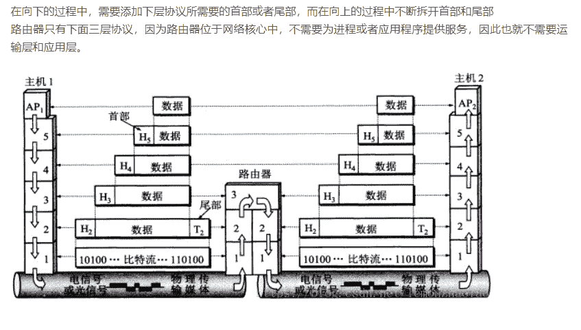
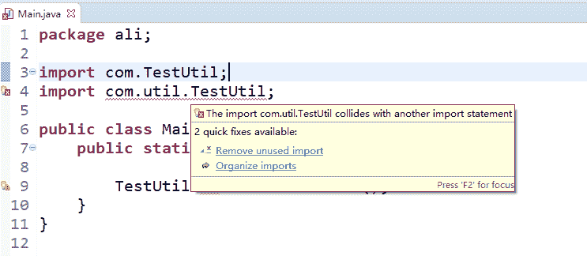
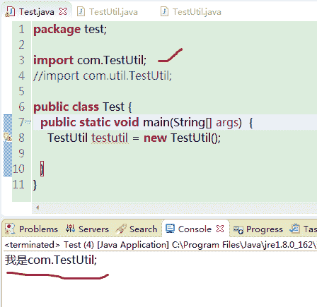
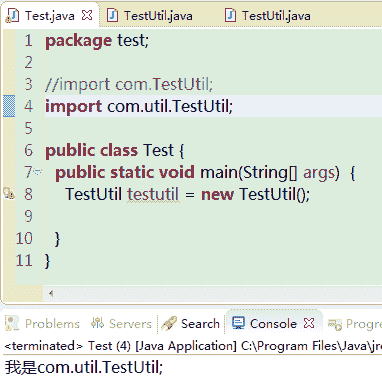
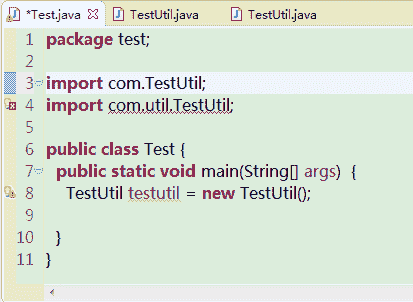
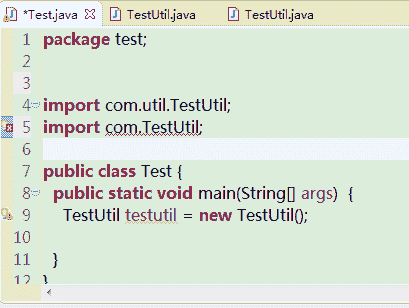
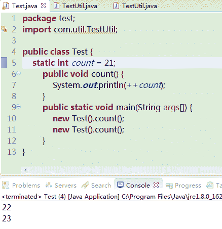
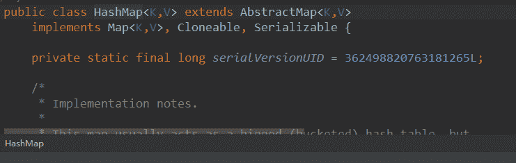
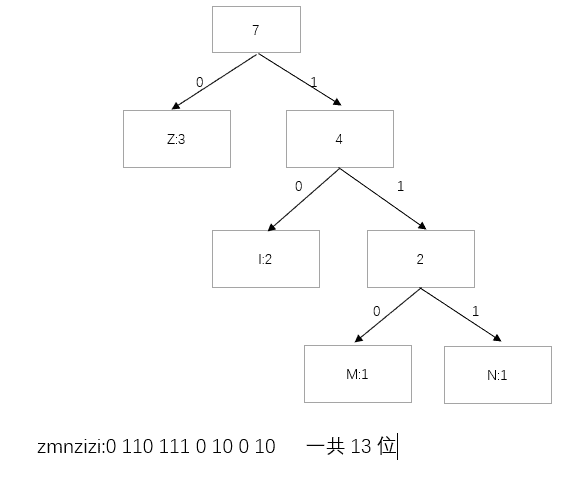
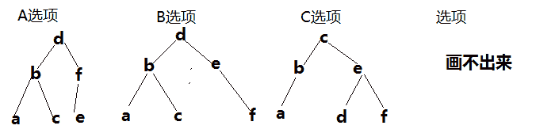

# 网易 2018 实习生招聘笔试题-JAVA 开发实习生

## 1

如何从有数字规律的网址抓取网页并保存在当前目录？假设网址为 [`test/0.xml`](http://test/0.xml)，其中这个数字可以递增到 100。

正确答案: D   你的答案: 空 (错误)

```cpp
for(int i=0; i&lt;100;++i)<br>wget http://test/$i.xml;
```

```cpp
wget http://test/{$0-$100}.xml
```

```cpp
wget http://test/`[0-100]`.xml
```

```cpp
for((i=0;i<100;++i));do  wget http://test/$i.xml; done
```

本题知识点

网易 Java 工程师 Java 工程师 网易 2018

讨论

[Air 张](https://www.nowcoder.com/profile/4168182)

1）这题考察的是 Linux wget 命令（大厂都很喜欢考 Linux）；2）Linux wget 是一个下载文件的工具，它用在命令行下。对于 Linux 用户是必不可少的工具，尤其对于网络管理员，经常要下载一些软件或从远程服务器恢复备份到本地服务器。
3）可以理解为下载动态变化的网页；

发表于 2018-06-22 15:36:15

* * *

[ZunPiau](https://www.nowcoder.com/profile/6721580)

还有一种方式是

```cpp
wget http://test/{1..100}.xml 
```

发表于 2018-08-10 11:04:23

* * *

[饿死的寄生虫](https://www.nowcoder.com/profile/3128925)

编辑于 2018-06-05 21:57:05

* * *

## 2

为了找到自己满意的工作，牛牛收集了每种工作的难度和报酬。牛牛选工作的标准是在难度不超过自身能力值的情况下，牛牛选择报酬最高的工作。在牛牛选定了自己的工作后，牛牛的小伙伴们来找牛牛帮忙选工作，牛牛依然使用自己的标准来帮助小伙伴们。牛牛的小伙伴太多了，于是他只好把这个任务交给了你。 None

讨论

[求天求地求 Offer](https://www.nowcoder.com/profile/2947048)

import java.util.*;
public class Main{
        public static void main(String[] args){
            Scanner sc=new Scanner(System.in);
            TreeMap<Integer,Integer> map=new TreeMap<>();
            int m=sc.nextInt();
            int n=sc.nextInt();
            int [][]work=new int[m][2];
            for(int i=0;i<m;i++){
                work[i][0]=sc.nextInt();//工作难度
                work[i][1]=sc.nextInt();//钱
            }
            Arrays.sort(work,new Comparator<int[]>(){//按工作难度来排序
                @Override
                public int compare(int[] num1,int []num2){
                    return num1[0]-num2[0];
                }
            });
            //dp 来使相应的工作难度获利最大
            //并且把结果存入 map 中
            for(int i=1;i<m;i++){
                work[i][1]=Math.max(work[i-1][1],work[i][1]);
                map.put(work[i-1][0],work[i-1][1]);
            }
            map.put(work[m-1][0],work[m-1][1]);//最后一项加入（避免出现异常）
            for(int i=0;i<n;i++){//根据难度来找工作
                int dif=sc.nextInt();
                Integer index=map.floorKey(dif);
                if(index!=null)
                    System.out.println(map.get(index));
                else
                    System.out.println(0);
            }

        }              
} 

发表于 2018-06-01 15:20:57

* * *

[昵称已被占用、](https://www.nowcoder.com/profile/5014683)

按照工作难度对工作数组排序后，遍历有序数组，更新报酬为当前难度下的最大报酬。而后，对每个伙伴只需二分搜索确定其胜任的最大工作难度即可获取当下最大报酬。

```cpp
public class FindJob {

    public static void main(String[] args) {

        Scanner in = new Scanner(System.in);
        int jobNum = in.nextInt();
        int friendNum = in.nextInt();
        int[][] jdArray = new int[jobNum][2];
        for (int x = 0; x < jobNum; x++) {
            jdArray[x][0] = in.nextInt();
            jdArray[x][1] = in.nextInt();
        }
        int[] ability = new int[friendNum];
        for (int x = 0; x < friendNum; x++) {
            ability[x] = in.nextInt();
        }
        process2(jdArray, ability);

    }

    public static void process2(int[][] jdArray, int[] ability) {
        // 按照工作难度升序排序
        Arrays.sort(jdArray, (int[] jd1, int[] jd2) -> {return jd1[0] - jd2[0];});

        // 更新每个工作的报酬为当前难度所能获取的最大报酬
        for (int i = 0; i < jdArray.length - 1; i++) {
            if (jdArray[i][1] > jdArray[i + 1][1]) {
                jdArray[i + 1][1] = jdArray[i][1];
            }
        }

        // 二分查找确定能胜任的最大工作难度及其最大报酬
        for (int i = 0; i < ability.length; i++) {
            int index = Arrays.binarySearch(jdArray, new int[] {ability[i], 0}, (int[] jd1, int[] jd2) ->{
                return jd1[0] - jd2[0];});
            index = index < 0 ? -(index + 1) - 1: index;
            System.out.println(index >= 0 ? jdArray[index][1] : 0);
        }

    }
}
```

编辑于 2018-07-10 19:40:12

* * *

[打代码的砖头](https://www.nowcoder.com/profile/197452990)

```cpp
//非原创，借鉴楼上求天求地求 offer 解析，将 TreeMap 的使用改为二分查找
import java.util.*;
public class Main{
    static int n,m;
    public static void main(String[] args){
        Scanner sc = new Scanner(System.in);
        n = sc.nextInt();
       m = sc.nextInt();
        int[][] t = new int[n][2];
        for(int i=0;i<n;i++){
            t[i][0] = sc.nextInt();
            t[i][1] = sc.nextInt();
        }
        //自定义排序
        Arrays.sort(t,new Comparator<int[]>(){
            @Override
            public int compare(int[] a,int[] b){
                return a[0]-b[0];
            }
        });
        //dp 使得对应的工作难度获得最大酬劳
        for(int i=1;i<n;i++){
            t[i][1] = max(t[i-1][1],t[i][1]);
        }
        for(int i=0;i<m;i++){
            int a = sc.nextInt();
            int index = find(a,t);
            if(index==-1)
                System.out.println(0);
            else
                System.out.println(t[index][1]);
        }
    }
    //二分查找
    public static int find(int a,int[][] s){
        int mid = (0+n)/2;
        int lo=0,hi=n-1;
        while(lo<=hi){
            mid = (lo+hi)/2;
            if(a<s[mid][0]){
                hi=mid-1;
            } else if(a>s[mid][0]){
                lo=mid+1;
            } else if(a==s[mid][0]){
                return mid;
            }
        }
        return hi;
    }
    public static int max(int a,int b){
        if(a>b)
            return a;
        return b;
    }
}

```

发表于 2019-08-01 21:10:15

* * *

## 3

关于计算机网络，以下说法正确的是(1)在向下的过程中，需要添加下层协议所需要的首部或者尾部(2)在向上的过程中不断拆开首部和尾部(3)在向上的过程中，需要添加下层协议所需要的首部或者尾部(4)在向下的过程中不断拆开首部和尾部(5)SMTP 属于 TCP 协议(6)POP3 属于 UDP 协议(7)DNS 属于 TCP 协议(8)Telnet 属于 UDP 协议

正确答案: A   你的答案: 空 (错误)

```cpp
(1)(2)(5)
```

```cpp
(1)(2)(6)
```

```cpp
(1)(2)(8)
```

```cpp
(3)(4)(5)(6)
```

```cpp
(3)(4)(5)(7)
```

本题知识点

网易 Java 工程师 Java 工程师 网易 2018

讨论

[Air 张](https://www.nowcoder.com/profile/4168182)

1）TCP (Transmission Control Protocol)和 UDP(User Datagram Protocol)协议属于[传输层](https://baike.baidu.com/item/%E4%BC%A0%E8%BE%93%E5%B1%82)协议。2）其中 TCP 提供 IP 环境下的数据[可靠传输](https://baike.baidu.com/item/%E5%8F%AF%E9%9D%A0%E4%BC%A0%E8%BE%93)，它提供的服务包括[数据流](https://baike.baidu.com/item/%E6%95%B0%E6%8D%AE%E6%B5%81)传送、可靠性、有效流控、全双工操作和多路复用。通过面向连接、端到端和可靠的[数据包](https://baike.baidu.com/item/%E6%95%B0%E6%8D%AE%E5%8C%85)发送。通俗说，它是事先为所发送的数据开辟出连接好的通道，然后再进行数据发送；一般来说，TCP 对应的是可靠性要求高的应用。3）而 UDP 则不为 IP 提供可靠性、流控或差错恢复功能。UDP 对应的则是可靠性要求低、传输经济的应用。4）TCP 支持的应用协议主要有：Telnet、FTP、SMTP 等；5）

TCP 对应的协议：

（1） FTP：定义了文件传输协议，使用 21 端口。

（2） Telnet：一种用于远程登陆的端口，使用 23 端口，用户可以以自己的身份远程连接到计算机上，可提供基于 DOS 模式下的通信服务。

（3） SMTP：邮件传送协议，用于发送邮件。服务器开放的是 25 号端口。

（4） POP3：它是和 SMTP 对应，POP3 用于接收邮件。POP3 协议所用的是 110 端口。

（5）HTTP：是从 Web 服务器传输超文本到本地浏览器的传送协议。

UDP 对应的协议：

（1） DNS：用于域名解析服务，将域名地址转换为 IP 地址。DNS 用的是 53 号端口。

（2） SNMP：简单网络管理协议，使用 161 号端口，是用来管理网络设备的。由于网络设备很多，无连接的服务就体现出其优势。

（3） TFTP(Trival File Tran 敏感词 er Protocal)，简单文件传输协议，该协议在熟知端口 69 上使用 UDP 服务。 

发表于 2018-06-22 15:54:25

* * *

[酒馆打烊了](https://www.nowcoder.com/profile/2131755)



发表于 2018-06-02 10:09:53

* * *

[javazhangyi](https://www.nowcoder.com/profile/9014597)

[`blog.csdn.net/qq100440110/article/details/50908992`](https://blog.csdn.net/qq100440110/article/details/50908992)DNS 两种都有

发表于 2018-06-12 21:02:01

* * *

## 4

关于 MySQL 索引 ，下面说法正确的是（）(1)B+Tree 索引是大多数 MySQL 存储引擎的默认索引类型(2)在 MySQL 中只有 Memory 引擎显式支持哈希索引(3)哈希索引只包含哈希值和列指针，而不存储字段值(4)MyISAM 存储引擎支持空间索引，可以用于地理数据存储。(5)空间索引使用 MATCH AGAINST，而不是普通的 WHERE(6) 索引将顺序 I/O 变为随机 I/O

正确答案: B   你的答案: 空 (错误)

```cpp
(1)(2)
```

```cpp
(2)(4)
```

```cpp
(2)(5)
```

```cpp
(2)(4)(5)
```

```cpp
(2)(5)(6)
```

```cpp
(4)(5)(6)
```

本题知识点

网易 Java 工程师 Java 工程师 网易 2018

讨论

[大荣 qhr](https://www.nowcoder.com/profile/8857287)

(1)B Tree 索引是 大多数 MySQL 存储引擎的默认索引类型

(2)对的

(3)哈希索引只包含哈希值和行指针，而不存储字段值，所以不能使用索引中的值来避 免读取行。

(4)对的

(5)Mysql 全文搜索 match against

(6) 索引将 随机 I/O 变为 顺序 I/O

编辑于 2018-08-11 13:57:46

* * *

[Air 张](https://www.nowcoder.com/profile/4168182)

1）B+Tree 和 BTree 不是一个概念，大多数 MySQL 存储引擎的默认索引类型是 BTree


B 树

```cpp
即二叉搜索树：

   1.所有非叶子结点至多拥有两个儿子（Left 和 Right）；

   2.所有结点存储一个关键字；

   3.非叶子结点的左指针指向小于其关键字的子树，右指针指向大于其关键字的子树；

   如：
```


B+树

```cpp
B+树是 B-树的变体，也是一种多路搜索树：

   1.其定义基本与 B-树同，除了：

   2.非叶子结点的子树指针与关键字个数相同；

   3.非叶子结点的子树指针 P[i]，指向关键字值属于[K[i], K[i+1])的子树（B-树是开区间）；

   5.为所有叶子结点增加一个链指针；

   6.所有关键字都在叶子结点出现；

   如：（M=3）
```


2） 哈希索引（hash index)基于哈希表实现，只有精确匹配索引所有列的査询才有效， 在 My SQL 中，**只有 Memory 引擎显式支持哈希索引**。这也是 Memory 引擎表的默认索 引类型，Memory 引擎同时也支持 B-Tree 索引。3）因为索引自身只需存储对应的哈希值，所以索引的结构十分紧凑，这也让哈希索引査找的速度非常快。然而，哈希索引也有它的限制：
哈希索引只包含**哈希值和行指针**，而不存储字段值，所以不能使用索引中的值来避 免读取行。

4）MyISAM 为 MySQL5.5 之前版本默认存储引擎。**（这里我也不是很明白，也没找到好的资料解释）**

数据类型和方法在 MyISAM, InnoDB, NDB, and ARCHIVE 中可用。至于空间索引， MyISAM and InnoDB 支持空间和非空间索引，其他引擎支持非空间索引。**geographic feature（地理特性）  **是指世界上的所有东西都有一个 location（位置）。这个特性可以是：

*   一个实体，例如一座山，一个池塘，一个城市 An entity. For example, a mountain, a pond, a city.

*   一个空间，例如城区，热带地区 A space. For example, town district, the tropics.

*   一个确定的位置。例如一个特定两条街交叉的十字路口 A definable location. For example, a crossroad, as a particular place where two streets intersect. 

地理定义为一个点 point，或者由点聚合起来表示的任意东西的位置。【[`www.mamicode.com/info-detail-1305774.html`](http://www.mamicode.com/info-detail-1305774.html)】有兴趣的可以自己看下~
5）不懂，主要是空间索引的概念不懂。6）1、索引的定义
索引是一个单独的、物理的数据库结构，它是某个表中一列或若干列值的集合和相应的指向表中物理标识这些值的数据页的逻辑指针清单。
简单地说，索引是对数据库表中一列或多列的值进行排序的一种结构。

2、索引的优缺点
优点：
1.大大加快数据的检索速度，这也是创建索引的最主要的原因；
2.可以创建唯一性索引，保证数据库表中每一行数据的唯一性；
3.可以将表的外键制作为索引，加速表和表之间的连接，特别是在实现数据的参考完整性方面特别有意义；
4.**将随机 I/O 变为顺序 I/O，帮助服务器避免排序和临时表，在使用分组和排序子句进行数据检索时，可以显著减少查询中分组和排序的时间；**
5.通过使用索引，可以在查询的过程中，使用优化隐藏器，提高系统的性能。
缺点：
1.创建索引和维护索引要耗费时间，这种时间随着数据量的增加而增加；
2.索引需要占物理空间，除了数据表占数据空间之外，每一个索引还要占一定的物理空间；
3.当对表中的数据进行增加、删除和修改的时候，索引也要动态的维护，这样就降低了数据的维护速度。

一般做类似的题目时，通过确定的知识点结合选项选择。

发表于 2018-06-22 19:17:03

* * *

[张大大大炮](https://www.nowcoder.com/profile/5500574)

mysql innodb 的默认索引不是 b+树嘛？

发表于 2018-07-02 00:59:27

* * *

## 5

在 Linux 系统中，可以用来查找可执行文件的是？(1)whereis(2)locate(3)which(4)type(5)find

正确答案: D   你的答案: 空 (错误)

```cpp
(1)(2)(3)
```

```cpp
(1)(2)(5)
```

```cpp
(1)(2)(3)(5)
```

```cpp
(1)(2)(3)(4)(5)
```

本题知识点

网易 Java 工程师 Java 工程师 网易 2018

讨论

[逸扬](https://www.nowcoder.com/profile/2214852)

whereis 命令用来定位指令的二进制程序、源代码文件和 man 手册页等相关文件的路径。    
    whereis 命令只能用于程序名的搜索，而且只搜索二进制文件（参数-b）、man 说明文件（参数-m）和源代码文件（参数-s）。如果省略参数，则返回所有信息。    
    和 find 相比，whereis 查找的速度非常快，这是因为 linux 系统会将 系统内的所有文件都记录在一个数据库文件中，当使用 whereis 和下面即将介绍的 locate 时，会从数据库中查找数据，而不是像 find 命令那样，通 过遍历硬盘来查找，效率自然会很高。 但是该数据库文件并不是实时更新，默认情况下时一星期更新一次，因此，我们在用 whereis 和 locate 查找文件时，有时会找到已经被删除的数据，或者刚刚建立文件，却无法查找到，原因就是因为数据库文件没有被更新。

    locate 命令和 slocate 命令都用来查找文件或目录。
    locate 命令其实是 find -name 的另一种写法，但是要比后者快得多，原因在于它不搜索具体目录，而是搜索一个数据库/var/lib/locatedb，这个数据库中含有本地所有文件信息。Linux 系统自动创建这个数据库，并且每天自动更新一次，所以使用 locate 命令查不到最新变动过的文件。为了避免这种情况，可以在使用 locate 之前，先使用 updatedb 命令，手动更新数据库。

    which 命令用于查找并显示给定命令的绝对路径，环境变量 PATH 中保存了查找命令时需要遍历的目录。which 指令会在环境变量$PATH 设置的目录里查找符合条件的文件。也就是说，使用 which 命令，就可以看到某个系统命令是否存在，以及执行的到底是哪一个位置的命令。

    type 命令用来显示指定命令的类型，判断给出的指令是内部指令还是外部指令。
    命令类型：
    alias：别名。
    keyword：关键字，Shell 保留字。
    function：函数，Shell 函数。
    builtin：内建命令，Shell 内建命令。
    file：文件，磁盘文件，外部命令。
    unfound：没有找到。

    find 命令用来在指定目录下查找文件。任何位于参数之前的字符串都将被视为欲查找的目录名。如果使用该命令时，不设置任何参数，则 find 命令将在当前目录下查找子目录与文件。并且将查找到的子目录和文件全部进行显示。

发表于 2018-06-05 14:55:04

* * *

[Air 张](https://www.nowcoder.com/profile/4168182)

(1)whereis：**    whereis 命令**用来定位指令的二进制程序、源代码文件和[man](http://man.linuxde.net/man)手册页等相关文件的路径。    whereis 命令只能用于程序名的搜索，而且只搜索二进制文件（参数-b）、man 说明文件（参数-m）和源代码文件（参数-s）。如果省略参数，则返回所有信息。(2)locate：**    locate 命令**和**slocate 命令**都用来查找文件或目录。

    locate 命令其实是[find](http://man.linuxde.net/find) -name 的另一种写法，但是要比后者快得多，原因在于它不搜索具体目录，而是搜索一个数据库/var/lib/locatedb，这个数据库中含有本地所有文件信息。Linux 系统自动创建这个数据库，并且每天自动更新一次，所以使用 locate 命令查不到最新变动过的文件。为了避免这种情况，可以在使用 locate 之前，先使用[updatedb](http://man.linuxde.net/updatedb)命令，手动更新数据库。

(3)which：**    which 命令**用于查找并显示给定命令的绝对路径，环境变量 PATH 中保存了查找命令时需要遍历的目录。which 指令会在环境变量$PATH 设置的目录里查找符合条件的文件。也就是说，使用 which 命令，就可以看到某个系统命令是否存在，以及执行的到底是哪一个位置的命令。(4)type：**    type 命令**用来显示指定命令的类型，判断给出的指令是内部指令还是外部指令。

命令类型：

*   [alias](http://man.linuxde.net/alias)：别名。
*   keyword：关键字，Shell 保留字。
*   function：函数，Shell 函数。
*   [builtin](http://man.linuxde.net/builtin)：内建命令，Shell 内建命令。
*   [**file**](http://man.linuxde.net/file)**：文件，磁盘文件，外部命令。**
*   unfound：没有找到。

```cpp
-t：输出“file”、“alias”或者“builtin”，分别表示给定的指令为“外部指令”、“命令别名”或者“内部指令”；
-p：如果给出的指令为外部指令，则显示其绝对路径；
-a：在环境变量“PATH”指定的路径中，显示给定指令的信息，包括命令别名。
```

```cpp
root[@localhost ~]# type [date](http://man.linuxde.net/date) date is /bin/date root[@localhost ~]# type [mysql](http://man.linuxde.net/mysql) mysql is /usr/bin/mysql
```

因为显示的是路径，可以理解为找到了这个文件（个人理解）。
(5)find：**find 命令**用来在指定目录下查找文件。任何位于参数之前的字符串都将被视为欲查找的目录名。如果使用该命令时，不设置任何参数，则 find 命令将在当前目录下查找子目录与文件。并且将查找到的子目录和文件全部进行显示。（非常标准的查找指令~）

发表于 2018-06-22 19:28:43

* * *

[大荣 qhr](https://www.nowcoder.com/profile/8857287)

 type 命令用来显示指定命令的类型，判断给出的指令是内部指令还是外部指令。 感觉答案错了吧  我选的 C

发表于 2018-06-12 14:27:49

* * *

## 6

有一条 TCP 连接，它的最大报文段长度为 4KB，TCP 拥塞窗口为 24KB，这时候发生超时，那么该拥塞窗口变为了（）

正确答案: B   你的答案: 空 (错误)

```cpp
2KB
```

```cpp
4KB
```

```cpp
6KB
```

```cpp
8KB
```

本题知识点

网易 Java 工程师 Java 工程师 网易 2018

讨论

[大程子](https://www.nowcoder.com/profile/5964917)

TCP 报文中，当发生超时事件，阈值被设置成当前拥塞窗口的一半，而拥塞窗口被设为一个最大报文段，也就是 4KB。

发表于 2018-06-04 16:32:07

* * *

[fullish](https://www.nowcoder.com/profile/839736237)

实际上，慢开始、拥塞避免算法、快重传和快恢复几种算法应该是同时应用在拥塞控制中的，当发送方检测到超时的时候就采用慢开始和拥塞避免，当发送方接收到冗余 ACK 时就采用快重传和快恢复。因此超时应采用慢开始拥塞避免算法，拥塞窗口的值被设为 1 个单位；即拥塞窗口的大小为 1*4KB=4KB。

编辑于 2019-09-06 10:50:01

* * *

[Bruno.Mars](https://www.nowcoder.com/profile/8934267)

TCP 报文中，当发生 timeOut 事件，阈值就会被设置为当前拥塞窗口的一半，而拥塞窗口被设置为一个最大报文段，也就是此时的 4Kb

发表于 2018-07-04 20:38:46

* * *

## 7

在 Java 中，包 com 中定义了类 TestUtil，在 com 的子包 util 中定义了同名类 TestUtil，给定如下 Java 代码，编译运行时，将发生（ ）。

```cpp
package test;
import com.util.TestUtil;
import com.TestUtil;
public class Test {
  public static void main(String[] args)  {
    TestUtil testutil = new TestUtil();
  }
}
```

正确答案: D   你的答案: 空 (错误)

```cpp
创建了一个 com.TestUtil 对象
```

```cpp
创建了一个 com.util.TestUtil 对象
```

```cpp
运行时出现异常
```

```cpp
编译无法通过
```

本题知识点

网易 Java 工程师 Java 工程师 网易 2018

讨论

[奔跑的蛋蛋](https://www.nowcoder.com/profile/1175063)



发表于 2018-06-02 15:25:56

* * *

[Bruno.Mars](https://www.nowcoder.com/profile/8934267)

new 在进行申请空间的时候，会“瞄”一眼后面的类，看看需要申请多大的空间，之后会调用其对应的构造器，填充各个域，最终完成初始化。构造方法返回后，一个对象创建完毕，会把他的引用（地址）发布到外部，供外部调用，而外部就是通过操作这个类来操作哦这个对 I 象。而前面的 TestUtil testutil 是声明，在栈空间中，对象初始化的检查的时候，发现不是自己初始化类的类型，不开心了谁都别想好过，所以编译都别想过。

发表于 2018-07-04 20:45:55

* * *

[Air 张](https://www.nowcoder.com/profile/4168182)

导入的包与顺序有关，从上到下执行，谁在前面导的是谁。



发表于 2018-06-22 20:00:51

* * *

## 8

给定 Java 代码如下所示，则编译运行后，输出结果是（ ）。

```cpp
public class Test {
    static int a;
    int b;
    static int c;

    public int aMethod() {
        a++;
        return a;
    }

    public int bMethod() {
        b++;
        return b;
    }

    public static int cMethod() {
        c++;
        return c;
    }

    public static void main(String args[]) {
        Test test1 = new Test();
        test1.aMethod();
        System.out.println(test1.aMethod());
        Test test2 = new Test();
        test2.bMethod();
        System.out.println(test2.bMethod());
        Test test3 = new Test();
        test3.cMethod();
        System.out.println(test3.cMethod());
    }
}
```

正确答案: D   你的答案: 空 (错误)

```cpp
1 0 2
```

```cpp
2 1 2
```

```cpp
0 0 2
```

```cpp
2 2 2
```

本题知识点

网易 Java 工程师 Java 工程师 网易 2018

讨论

[Air 张](https://www.nowcoder.com/profile/4168182)

1）静态变量 a 在类加载时初始化，仅初始化一次，int 默认值 0，所以 a=2
 Test test1 = newTest();        test1.aMethod();        System.out.println(test1.aMethod());--------------------------------------------------------------------------------2）实例对象 test2 创建时，初始化成员变量 b，默认值 0，两次调用方法均为对实例对象 test2 的成员变量 b 进行操作，b=2
        Test test2 = newTest();        test2.bMethod();        System.out.println(test2.bMethod());
-------------------------------------------------------------------------------- 3）静态变量 c 在类加载时初始化，仅初始化一次，int 默认值 0，所以 c=2        Test test3 = newTest();        test3.cMethod();        System.out.println(test3.cMethod());

发表于 2018-06-22 19:52:12

* * *

[天才落语°](https://www.nowcoder.com/profile/3204303)

成员变量在实例化之后，如果没初始化值，那么为默认值。

发表于 2018-06-04 15:58:58

* * *

[wanku520](https://www.nowcoder.com/profile/3377472)

关于类的成员变量若没有赋值，都存在默认值的，对于基本类型，都存在对应值，int ： 0 对于引用类型，为 null

发表于 2018-06-04 22:34:49

* * *

## 9

给定某 Java 程序的 main 方法如下，该程序编译运行后的结果是（ ）。

```cpp
public static void main(String[] args) {
    String str=null;
    str.concat("abc");
    str.concat("123");
    System.out.println(str);
}
```

正确答案: D   你的答案: 空 (错误)

```cpp
输出：null
```

```cpp
输出：abc123
```

```cpp
编译错误
```

```cpp
运行时出现异常
```

本题知识点

网易 Java 工程师 Java 工程师 网易 2018

讨论

[张小哥](https://www.nowcoder.com/profile/1199844)

```cpp
打个比方吧，一个不是空的字符串好比一个人，这个人可以吃饭睡觉工作等等，null 相当于什么都没有，然后你去让什么都没有的东西 去吃饭 睡觉 工作 你觉得可能吗？~！所以 String s = null;他就空的，什么都没有，然后你让什么都没有的东西去调方法 就会报错
```

发表于 2018-05-31 19:19:35

* * *

[^O^平淡生活^O^](https://www.nowcoder.com/profile/512191123)

任何未初始化的对象变量，不能将此类型的对象的方法应用于这个变量上，否则将产生编译错误。
null 是任何引用类型的默认值，局部变量不会自动地初始化为 null，而必须通过调用 new 或将它们设置为 null 进行初始化。
如果将一个方法应用于一个值为 null 的对象上，将产生运行时错误。

发表于 2018-07-23 16:04:27

* * *

[🎶人生若只如初见💧😂](https://www.nowcoder.com/profile/7570428)

1.字符串连接的时候链接一个新的字符串对象来保存新的连接成的字符串 2.或者写成不用在原字符串是你的改变，在连接时用字符串原始值

```cpp
 "cares".concat("s") returns "caress"
 "to".concat("get").concat("her") returns "together"

```

编辑于 2018-05-29 21:28:56

* * *

## 10

给定某 Java 程序的 main 方法如下，该程序编译运行后的结果是（ ）。

```cpp
public class Test {
    int count = 21;
    public void count() {
        System.out.println(++count);
    }
    public static void main(String args[]) {
        new Test().count();
        new Test().count();
    }
}
```

正确答案: C   你的答案: 空 (错误)

```cpp
22 23
```

```cpp
21 22
```

```cpp
22 22
```

```cpp
21 23
```

本题知识点

网易 Java 工程师 Java 工程师 网易 2018

讨论

[Air 张](https://www.nowcoder.com/profile/4168182)

1）匿名对象也是在堆中开辟新的空间；2）不同的对象拥有各自的成员变量；3）如果写成 static int count = 21；因为静态变量在类加载时初始化，仅一次，所有实例对象共享。

发表于 2018-06-22 20:05:54

* * *

[秋枫艳梦](https://www.nowcoder.com/profile/5884695)

++C 是先将变量 C 进行加一操作，是“先赋值，后使用”，所以调用方法输出的结果是 22。而 main()方法中 new 出来的是两块空间，所以结果都是 22。

发表于 2018-05-29 21:57:25

* * *

## 11

在 JDK1.8 中，HashMap 没有实现哪个接口（ ）。

正确答案: B   你的答案: 空 (错误)

```cpp
Map
```

```cpp
AbstractMap
```

```cpp
Serializable
```

```cpp
Cloneable
```

本题知识点

网易 Java 工程师 Java 工程师 网易 2018

讨论

[niuke888](https://www.nowcoder.com/profile/1794277)

叫 AbstractXX 的多半是抽象类，而不是接口，接口不需要强调抽象，他不可能不抽象

发表于 2018-06-06 01:33:22

* * *

[Bruno.Mars](https://www.nowcoder.com/profile/8934267)

实现了 Map<K,V>，Cloneable,Serializable 接口，继承了 AbstractMap<K,V>抽象类

发表于 2018-07-04 20:57:44

* * *

[天才落语°](https://www.nowcoder.com/profile/3204303)

Abstract = 抽象  AbstractMap 是抽象类 叫 继承  不叫 实现

发表于 2018-06-04 16:02:25

* * *

## 12

下面关于进程和线程说法错误的是（）

正确答案: B   你的答案: 空 (错误)

```cpp
进程是系统进行资源分配和调度的基本单位，而线程是 CPU 调度和分配的基本单位
```

```cpp
线程也拥有自己的系统资源
```

```cpp
一个线程可以创建和撤销另一个线程
```

```cpp
一个进程中的多个线程共享资源
```

本题知识点

网易 Java 工程师 2018

讨论

[A 名前のない怪物](https://www.nowcoder.com/profile/8320926)

线程是指进程内的一个执行单元,也是进程内的可调度实体.与进程的区别:
(1)地址空间:进程内的一个执行单元;进程至少有一个线程;它们共享进程的地址空间;而进程有自己独立的地址空间;
(2)资源拥有:进程是资源分配和拥有的单位,同一个进程内的线程共享进程的资源
(3)线程是处理器调度的基本单位,但进程不是.
4)二者均可并发执行.进程和线程都是由操作系统所体会的程序运行的基本单元，系统利用该基本单元实现系统对应用的并发性

发表于 2018-06-03 15:00:21

* * *

[知名大佬](https://www.nowcoder.com/profile/7424359)

线程共享所属进程的系统资源，讲道理是进程拥有自己的系统资源，而不是线程。

发表于 2018-08-04 19:51:47

* * *

[格拉摩根键圣](https://www.nowcoder.com/profile/335405317)

小明和妹妹小红都有自己的零花钱（程序计数器、虚拟机栈、本地方法栈），而且不会让对方花（线程私有的），但实际上他们的零花钱都是来自于爸爸妈妈（进程），所以实际上小明和小红并没有经济收入

发表于 2020-03-06 00:25:34

* * *

## 13

下面关于线程同步说法错误的是（）

正确答案: D   你的答案: 空 (错误)

```cpp
用户模式和内核模式下同步方式不同
```

```cpp
对于临界区的访问适用于单进程中线程间的同步
```

```cpp
事件对象适用于多个进程间的各线程实现同步
```

```cpp
互斥对象也只适用于单进程中线程间的同步
```

本题知识点

网易 Java 工程师 Java 工程师 网易 2018

讨论

[沃鱼 95](https://www.nowcoder.com/profile/1781936)

1.临界区（Critical Section）：适合一个进程内的多线程访问公共区域或代码段时使用。2.互斥量 (Mutex)：适合不同进程内多线程访问公共区域或代码段时使用，与临界区相似。 3.事件（Event）：通过线程间触发事件实现同步互斥。4.信号量（Semaphore）：与临界区和互斥量不同，可以实现多个线程同时访问公共区域数据，原理与操作系统中 PV 操作类似，先设置一个访问公共区域的线程最大连接数，每有一个线程访问共享区资源数就减一，直到资源数小于等于零。 

发表于 2018-06-29 21:13:45

* * *

[飞翔的键盘](https://www.nowcoder.com/profile/9852631)

他是内核对象，不同进程的多个线程可以访问单个互斥对象，这样可以确保多个线程同时访问内存块，内存块中数据不会遭到破坏。

发表于 2018-06-04 12:07:46

* * *

[嘟嘟嘟嘟噜](https://www.nowcoder.com/profile/3385548)

临界区只能用于单个进程内多线程的同步；互斥量还能用于多个进程间多线程的同步

发表于 2019-08-03 11:33:25

* * *

## 14

下面关于死锁的说法错误的是（）

正确答案: D   你的答案: 空 (错误)

```cpp
死锁是指多个进程因抢占资源而发生的一种阻塞且相互等待的现象
```

```cpp
死锁的产生源于系统资源不足和进程推进顺序不当
```

```cpp
可以通过终止和撤销进程来解除死锁
```

```cpp
银行家算法用在预防死锁策略中
```

本题知识点

网易 Java 工程师 Java 工程师 网易 2018

讨论

[寻找 offer](https://www.nowcoder.com/profile/6035108)

银行家算法（Banker's Algorithm）是一个避免死锁（Deadlock）的著名算法，是由艾兹格·迪杰斯特拉在 1965 年为 T.H.E 系统设计的一种避免死锁产生的算法。它以银行借贷系统的分配策略为基础，判断并保证系统的安全运行。

避免和预防这名词有差异？这是跟我玩文字游戏呢？

发表于 2018-05-29 22:41:37

* * *

[OrangeXXL](https://www.nowcoder.com/profile/7660488)

按照死锁解决时机的不同分为，预防死锁、避免死锁、检测并解除死锁三个阶段。银行家算法是用在避免死锁阶段的。

发表于 2018-08-11 10:12:19

* * *

[上帝爱吃苹果｀](https://www.nowcoder.com/profile/5203982)

网易的水平也就这样了

发表于 2018-08-10 19:39:14

* * *

## 15

用 1*3 的瓷砖密铺 3*20 的地板有几种方式？

正确答案: A   你的答案: 空 (错误)

```cpp
1278
```

```cpp
872
```

```cpp
595
```

```cpp
406
```

本题知识点

网易 Java 工程师 Java 工程师 网易 2018

讨论

[我信异想才会天开](https://www.nowcoder.com/profile/4254864)

3*n 的区域铺瓷砖为 f(n)，如果第一列竖着，那么就是 f(n-1)，如果横着铺，就是 f(n-3)。f(n) = f(n-1) + f(n-3),递推结果为 1278。

发表于 2018-06-03 11:09:32

* * *

[奔跑的蛋蛋](https://www.nowcoder.com/profile/1175063)

动态规划，转移方程为：f[i] = 2*f[i-3] + f[i-4] + f[i-5];

```cpp
public class Main {
    public static void main(String[] args) {
        int[] a = new int[20 + 5];
        a[0] = 1;
        a[1] = 1;
        a[2] = 1;
        a[3] = 2;
        a[4] = 3;
        for (int i = 5; i <= 20; i++) {
            a[i] = (a[i-3] << 1) + a[i-4] + a[i-5];
            System.out.println(i + "  " + a[i]);
        }
    }
}

```

> 运行结果如下：
> 5  4
> 6  6
> 7  9
> 8  13
> 9  19
> 10  28
> 11  41
> 12  60
> 13  88
> 14  129
> 15  189
> 16  277
> 17  406
> 18  595
> 19  872
> 20  1278

发表于 2018-06-02 15:32:57

* * *

[你猜鸭](https://www.nowcoder.com/profile/291859415)

问题是，正常考的时候，屏幕都不准跳出，你用什么去运行代码？

发表于 2019-08-03 14:45:09

* * *

## 16

已知有 4 个矩阵分别大小为 M1(5*3) M2(3*4) M3(4*2) M4(2*7) 下面组合计算所需要的乘法次数最优的为？

正确答案: D   你的答案: 空 (错误)

```cpp
(M1(M2(M3M4)))
```

```cpp
(M1((M2M3)M4))
```

```cpp
((M1M2)(M3M4))
```

```cpp
((M1(M2M3))M4)
```

```cpp
(((M1M2)M3)M4)
```

本题知识点

网易 Java 工程师 Java 工程师 网易 2018

讨论

[汪礼浩](https://www.nowcoder.com/profile/1833120)

根据矩阵相乘的原理得知，m1*n 的矩阵和 n*m2 的矩阵相乘， 需要做 m1*n*m2 次乘法运算，因此需要优先计算 n 更大的矩阵，这样会最大地减少乘法运算的次数。本题中，优先计算 n 为 4 的两个矩阵，然后是 n 为 3，最后是 n 为 2 的

发表于 2019-04-09 10:40:01

* * *

[现在感觉挺好](https://www.nowcoder.com/profile/9935790)

矩阵 乘法运算。m*n 的矩阵乘以 n*p 的矩阵得到 m*p 的矩阵。其中元素个数为 m*p 个，每个元素需要 n 次乘法运算，n-1 次加法运算。所以先将矩阵的运算次数降（n）下来，更有利于快速计算。

编辑于 2018-12-29 18:35:47

* * *

[不问出处](https://www.nowcoder.com/profile/8468593)

笨方法，每个选项都计算一遍乘法次数：A 次数：4*2*7+3*4*7+5*3*7.........都计算一遍，不过发现总共有 2 3 4 5 7 五个数，先让乘积最小的结合，即 2 3 4 结合，就是 M2M3，然后剩下 2 3 5 7，再让 2 3 5 结合，即 M1（M2M3），最后(M1(M2M3))M4

发表于 2018-06-16 16:23:05

* * *

## 17

一个完全二叉树节点数为 200，则其叶子结点个数为？

正确答案: C   你的答案: 空 (错误)

```cpp
98
```

```cpp
99
```

```cpp
100
```

```cpp
101
```

本题知识点

网易 Java 工程师 2018

讨论

[A 名前のない怪物](https://www.nowcoder.com/profile/8320926)

完全二叉树(Complete Binary Tree)定义：若设二叉树的深度为 h，除第 h 层外，其它各层 (1～h-1) 的结点数都达到最大个数，第 h 层所有的结点都连续集中在最左边，这就是完全二叉树。完全二叉树是由[满二叉树](https://baike.baidu.com/item/%E6%BB%A1%E4%BA%8C%E5%8F%89%E6%A0%91)而引出来的。对于深度为 K 的，有 n 个结点的二叉树，当且仅当其每一个结点都与深度为 K 的满二叉树中编号从 1 至 n 的结点一一对应时称之为完全二叉树。一棵二叉树至多只有最下面的一层上的结点的度数可以小于 2，并且最下层上的结点都集中在该层最左边的若干位置上，而在最后一层上，右边的若干结点缺失的二叉树，则此二叉树成为完全二叉树。完全二叉树的特点是：1）只允许最后一层有空缺结点且空缺在右边，即叶子结点只能在层次最大的两层上出现；2）对任一结点，如果其右子树的深度为 j，则其左子树的深度必为 j 或 j+1。 即度为 1 的点只有 1 个或 0 个解析：这里总结点 200 个，这里是偶数，可以判断度为 1 的结点是 1 个。根据二叉树性质 n0 = n2 + 1;[叶子结点](https://www.baidu.com/s?wd=%E5%8F%B6%E5%AD%90%E7%BB%93%E7%82%B9&tn=SE_PcZhidaonwhc_ngpagmjz&rsv_dl=gh_pc_zhidao)数量等于度为 2 的结点数+1n0 + n1 + n2 = 200∴n0 + n1 + n0 -1 =200;∴2n0 = 201-n1 = 200 （完全二叉树度为 1 的结点个数要么 1，要么 0\. [叶子结点](https://www.baidu.com/s?wd=%E5%8F%B6%E5%AD%90%E7%BB%93%E7%82%B9&tn=SE_PcZhidaonwhc_ngpagmjz&rsv_dl=gh_pc_zhidao)数为整数，这里也可以推断出度为 1 的结点个数是 1）∴n0 = 100[叶子结点](https://www.baidu.com/s?wd=%E5%8F%B6%E5%AD%90%E7%BB%93%E7%82%B9&tn=SE_PcZhidaonwhc_ngpagmjz&rsv_dl=gh_pc_zhidao)数是 100.

发表于 2018-06-03 14:39:29

* * *

[ZB 美丽人生](https://www.nowcoder.com/profile/5648916)

必定为满二叉树+最后一层：满二叉树计算：2^n-1 当 n=7 的时候 2⁷-1=127，200-127=73 。且第 7 层有 2⁶=64 个结点，2*36+1=73，故叶子结点为 64-36+72=100

发表于 2018-05-30 20:42:30

* * *

[必胜！！](https://www.nowcoder.com/profile/9046753)

n0 = (n + 1) / 2

发表于 2018-06-30 19:25:16

* * *

## 18

字符串 zmnzizi 用哈夫曼编码来编码，则共有多少位？

正确答案: B   你的答案: 空 (错误)

```cpp
14
```

```cpp
13
```

```cpp
12
```

```cpp
11
```

本题知识点

网易 Java 工程师 Java 工程师 网易 2018

讨论

[想要 offer 天真了吧](https://www.nowcoder.com/profile/44858762)



发表于 2018-08-09 12:04:19

* * *

[A 名前のない怪物](https://www.nowcoder.com/profile/8320926)

首先要明白赫夫曼编码的具体方法：先按出现的概率大小排队，把两个最小的概率相加，作为新的概率 和剩余的概率重新排队，再把最小的两个概率相加，再重新排队，直到最后变成 1。每次相 加时都将“0”和“1”赋与相加的两个概率，读出时由该符号开始一直走到最后的“1”， 将路线上所遇到的“0”和“1”按最低位到最高位的顺序排好，就是该符号的赫夫曼编码。解答： 各个字母出现的概率 z:3/7   n:1/7        m:1/7        i:2/7 编码：z 0   i 11     m 100    n 101alibaba：0 100 101 0 11 0 11 一共 13 位

发表于 2018-06-03 14:27:07

* * *

[必胜！！](https://www.nowcoder.com/profile/9046753)

[`blog.csdn.net/xgf415/article/details/52628073`](https://blog.csdn.net/xgf415/article/details/52628073)

发表于 2018-06-30 19:41:18

* * *

## 19

已知中序遍历的序列为 abcdef，高度最小的不可能的二叉树的前序遍历是

正确答案: D   你的答案: 空 (错误)

```cpp
dbacfe
```

```cpp
dbacef
```

```cpp
cbaedf
```

```cpp
cabefd
```

本题知识点

网易 Java 工程师 Java 工程师 网易 2018

讨论

[朋友，快来我给你个神马鬼](https://www.nowcoder.com/profile/445922354)

这个题解题我们需要结合前序遍历和中序这个点来画出可能的二叉树图解：基本如图：
前序遍历：遵循的是：根节点    左子节点   右子节点          root    left    right 中序遍历：遵循的是：左子节点   根节点     右子节点        left       root   right 所以我们看出来：前序遍历的第一个节点就是最上面那个节点，其在中序遍历中充当分界线的作用，左右分离便是二叉树的原型。然后我们在根据同样的规律将左子节点和右子节点补充完整。可以得出完整的二叉树。上面是我画出来的情况。D 图无法绘制，所以 D 选项不是二叉树。至于高度最小这个条件求大神讲解。

发表于 2018-06-07 21:11:49

* * *

[现在感觉挺好](https://www.nowcoder.com/profile/9935790)

中序遍历可以看作是二叉树的投影。也就是说 bcde 可以作为父节点。因为高度最小，总结点 6 个。最小高度要求最多有三层。所以只能选择 c 和 d 作为根节点。选 c 做根节点，ab 的顺序无关紧要，因为是两层。需要考虑 def 的位置关系，必须保证这三个节点只有两层，即一个父节点有两个孩子节点。所以只存在 e 为根节点的情况，所以前序遍历只能是 edf。同理选 d 为根节点

发表于 2018-06-07 19:16:05

* * *

## 20

基于哈希算法在信息安全中主要应用在？(1)    文件校验(2)    数字签名(3)    鉴权协议

正确答案: D   你的答案: 空 (错误)

```cpp
(1)(2)
```

```cpp
(1)(3)
```

```cpp
(2)(3)
```

```cpp
(1)(2)(3)
```

本题知识点

网易 Java 工程师 Java 工程师 网易 2018

讨论

[crabman](https://www.nowcoder.com/profile/820357752)

涉及到现代密码学的哈希算法和消息认证，哈希算法也就主要是这三个功能

发表于 2018-06-26 23:47:19

* * *

## 21

下列选项中，不可能是快速排序第 2 趟排序结果的是 （）

正确答案: C   你的答案: 空 (错误)

```cpp
4 14 10 12 8 6 18
```

```cpp
4 6 10 8 12 14 18
```

```cpp
6 4 10 8 14 12 18
```

```cpp
8 4 6 10 12 14 18
```

本题知识点

网易 Java 工程师 Java 工程师 网易 2018

讨论

[寻找 offer](https://www.nowcoder.com/profile/6035108)

只需要掌握一点就可以解出这个问题：每趟排序就有一个元素排在了最终的位置上。那么就是说，第 n 趟结束，**至少**有 n 个元素已经排在了最终的位置上。

所以我们把最终排序结果写出来：然后计算在最终位置上的个数就可以

发表于 2018-05-29 22:45:54

* * *

[0ffff](https://www.nowcoder.com/profile/8742322)

参考 链接：[`www.nowcoder.com/questionTerminal/0e322ea03d0d4b318403c7119a18e5a1`](https://www.nowcoder.com/questionTerminal/0e322ea03d0d4b318403c7119a18e5a1)
四个选项都是同样的数组元素，若完全有序，应为  4 6 8 10 12 14 18
每经过一趟快排，轴点元素都必然就位，也就是说，一趟下来至少有 1 个元素在其最终位置
所以考察各个选项，看有几个元素就位即可。
A：4 、18
B：4、6、12、14、18
C：18
D：10、12、14、18
第二趟至少应有 2 个元素就位，所以 C 不对。

发表于 2019-08-02 19:31:45

* * *

[睶](https://www.nowcoder.com/profile/5291894)

1）.n 趟后至少有 n 个是处在正确位置，故先把最终排序结果排好，再挨个比较哪些是满足此条件的不足 n 个的肯定不可能是快速排序第 n 趟排序结果 2）.在 1）的基础，找到 n 个处在正确位置的，必须满足左小右大（如果题目是求升序）或者左大右小（如果题目是求降序），如果找不到至少 n 个这样的位置，那么肯定不可能是快速排序第 n 趟排序结果

编辑于 2020-03-08 11:48:51

* * *

## 22

牛牛以前在老师那里得到了一个正整数数对(x, y), 牛牛忘记他们具体是多少了。

但是牛牛记得老师告诉过他 x 和 y 均不大于 n, 并且 x 除以 y 的余数大于等于 k。

牛牛希望你能帮他计算一共有多少个可能的数对。

本题知识点

网易 Java 工程师 数学 2018

讨论

[求天求地求 Offer](https://www.nowcoder.com/profile/2947048)

import java.util.*;  
public class Main { public static void main(String[] args) {
        Scanner sc = new Scanner(System.in);  
        long n=sc.nextLong();
        long k=sc.nextLong();
        if(k == 0){
            System.out.println(n*n);
            return ;
                }

        long count = 0;  //记录找到的整数对个数
        long temp;
                //思路：固定 y，找 x
        for (long y = k + 1; y <= n; y++) {    //  x/y>=k,说明 y>k
            // 假设 n = a*y +b；在每个长度为 y 的区间里只有（y-k）个数模 y 余数>=k。
            count += n/y*(y-k);    
            temp = n%y;
            if(temp >= k) {                    //再考虑余数 b 是否>=k
                count += temp-k+1;
            }
        }        
        System.out.println(count);  
    }
}

发表于 2018-06-01 16:13:07

* * *

[WuLiuQi](https://www.nowcoder.com/profile/8019282)

package test;
import java.util.*;
//循环嵌套是绝对的超时啦！！
public class Test{
    public static void main(String[] args) {
        Scanner scanner = new Scanner(System.in);
        long n = scanner.nextLong();
        long k = scanner.nextLong();
        int count = 0; 
        if(k==0){
            System.out.print(n*n);
        }
        for (long y = k+1; y <= n; y++) {
            /*把所有 x 可以分成若干区间，区间长度等于 y 值得大小，利用遍历 y 值 来寻找符合要求能使得余数大于 k 的 x 的个数
            例如：用例中 n=5，k=2 那么 先确定 y 值可以取 3/4/5
            首先先看 y=3 时：把所有符合题目范围但是不一定全部符合题目要求的 x 值罗列出来并分组： 1,2,3 | 4,5            可知所有 x 值除以 y 值所得的余数应为（上下对应）                           1 2 0 | 1 2 
            可以看出在一个区间内的余数是有规律的 只是在范围内的 x 不一定刚好就是 y 的整数倍，也就是划分的区间不一定刚好
            全部是完整的，那么可以分为两部分来计算 把完整区间的符合余数要求的 x 加起来，再把不是完整区间的符合余数要求的 x 加上来就是所需总数*/
            count += (n/y)/*区间数*/*(y-k);//余数大于等于 k 但是余数一定是小于除数的；
            //下面就是把不是完整区间的的加上，如果 n 除以 y 的余数小于 k 那么最后一个区间一定没有符合要求的 x 因为 n 值是最大的 余数还小
            //于 k,不过如果 n 除以 y 的余数大于等于 k 啦那么一定在最后一个区间内还有符合要求的 x，
            //而此时符合要求的个数就是 n%y-（k-1）如果余数要求是大于 k 不是大于等于这里就是-k
            if(n%y>=k)
                count+=n%y-(k-1);
        }
        System.out.println(count);
    }
}

发表于 2018-08-10 16:34:58

* * *

[Rnanprince](https://www.nowcoder.com/profile/4293215)

package niukeshuati;
import java.util.Scanner;
public class DoubleNumber {

    public static void main(String[] args) {
        Scanner sc = new Scanner(System.in);
        long n = sc.nextLong();
        long k = sc.nextLong();
        if (k == 0) {
            System.out.println(n * n);
            return;
        }

        long count = 0;
        for (long y = k + 1; y <= n; y++) {
            long m = n / y; // x=0+b,x=1y+b,x=2y+b,...,x=(n/y)y+b
            count += m * (y - k);
            // 再考虑余数 b 是否>=k,即最后一个区间是否有解
            long temp = n % y;
            if (temp >= k) {
                count += n % y - k + 1;
            }

        }
        System.out.println(count);
    }

}

发表于 2018-07-07 15:47:05

* * *

## 23

平面内有 n 个矩形, 第 i 个矩形的左下角坐标为(x1[i], y1[i]), 右上角坐标为(x2[i], y2[i])。

如果两个或者多个矩形有公共区域则认为它们是相互重叠的(不考虑边界和角落)。

请你计算出平面内重叠矩形数量最多的地方,有多少个矩形相互重叠。

本题知识点

网易 Java 工程师 高级结构 数学 穷举 2018

讨论

[南洋理工大学-LUWEI](https://www.nowcoder.com/profile/686806)

```cpp
n = int(input())
x1 = [int(i) for i in input().split()]
y1 = [int(i) for i in input().split()]
x2 = [int(i) for i in input().split()]
y2 = [int(i) for i in input().split()]

result = 0;
for x in x1+x2:
    for y in y1+y2:
        count = 0
        for i in range(n):
            if x >= x1[i] and y >= y1[i] and x < x2[i] and y < y2[i]:
                count += 1
        result = max(result, count)
print(result)

```

发表于 2018-09-08 08:49:30

* * *

[XH！](https://www.nowcoder.com/profile/8132871)

方法一

1.  初始标记每个矩形区域重叠计数为 1
2.  遍历所有矩形，若两个矩形有重叠，则将重叠矩形加入集合，并记录重叠计数为两者之和
    不足：若 50 个矩形都重叠，newRec 长度会达到千亿级别

    ```cpp
    import java.util.ArrayList;
    import java.util.LinkedList;
    import java.util.List;
    import java.util.Scanner;
    public class Main {
    private static int n;
    private static int[][] rec; //0 下标记录重叠计数
    private static List newRec;
    private static long res = 1;
    public static void main(String[] args){
        int loop = 1;
        //System.setIn(No2.class.getResourceAsStream("2.txt"));
        Scanner scanner = new Scanner(System.in);
        //loop = scanner.nextInt();
        for (int i = 0; i < loop; ++i) {
            n = scanner.nextInt();
            rec = new int[n][5];
            newRec = new ArrayList();
            for (int j = 1; j <= 4; j++) {
                for (int k = 0; k < n; k++) {
                    rec[k][j] = scanner.nextInt();
                }
            }
            for (int k = 0; k < n; k++) {
                rec[k][0] = 1;
            }
            solve();
            output();
        }
        scanner.close();
    }
    private static void solve() {
        for (int i = 1; i < n; i++) {
            int[] cover;
            for (int j = 0, len = newRec.size(); j < len; ++j) {
                if((cover = getCover(newRec.get(j), rec[i])) != null) {
                    newRec.add(cover);
                }
            }
            for (int j = 0; j < i; j++) {
                if((cover = getCover(rec[j], rec[i])) != null) 
                    newRec.add(cover);
            }
        }
    }
    private static int[] getCover(int[] a, int[] b) {
        int x1 = Math.max(a[1], b[1]);
        int y1 = Math.max(a[2], b[2]);
        int x2 = Math.min(a[3], b[3]);
        int y2 = Math.min(a[4], b[4]);
        if(x1 < x2 && y1 < y2) {
            res = Math.max(res, a[0] + b[0]);
            return new int[]{a[0] + b[0], x1, y1, x2, y2};
        }
        return null;
    }
    private static void output() {
        System.out.println(res);
    }
    } 
    ```

方法二
点计数法，重叠后的矩形左下角坐标一定是{x1[0]~x1[50], y1[0]~y1[50]}这 2500 个点中产生，只要分别判断这些点在多少矩形中即可

```cpp
import java.util.Scanner;
public class Main {
    private static int n;
    private static int[][] rec;
    private static long res = 1;
    public static void main(String[] args){
        int loop = 1;
        //System.setIn(No2.class.getResourceAsStream("2.txt"));
        Scanner scanner = new Scanner(System.in);
        //loop = scanner.nextInt();
        for (int i = 0; i < loop; ++i) {
            n = scanner.nextInt();
            rec = new int[n][4];
            for (int j = 0; j < 4; j++) {
                for (int k = 0; k < n; k++) {
                    rec[k][j] = scanner.nextInt();
                }
            }
            solve();
            output();
        }
        scanner.close();
    }
    private static void solve() {
        int x, y, count;
        for (int i = 0; i < n; i++) {
            for (int j = i + 1; j < n; j++) {
                x = Math.max(rec[i][0], rec[j][0]);
                y = Math.max(rec[i][1], rec[j][1]);
                count = 0;
                for (int k = 0; k < n; k++) {
                    if(x >= rec[k][0] && y >= rec[k][1] && x < rec[k][2] && y < rec[k][3])
                        ++count;
                }
                res = Math.max(count, res);
            }
        }
    }
    private static void output() {
        System.out.println(res);
    }
} 
```

编辑于 2018-07-05 00:06:28

* * *

[VMatrix](https://www.nowcoder.com/profile/7183872)

曾经做过一维的区间重叠问题，用的是线段树。不过这题拓展到二维了，有时间想一想解决方案。

发表于 2018-07-06 18:16:04

* * *

## 24

Java 常用的数据结构中，请描述 Vector, ArrayList, LinkedList 的不同场景下的性能差别。

你的答案

本题知识点

网易 Java 工程师 2018

讨论

[伍马](https://www.nowcoder.com/profile/3840117)

LinkedList 是一个双向链表结构.线程不安全.适合于中间部位添加和删除. ArrayList 是一个数组结构.线程不安全.适合于查询和修改，以及尾部的添加和删除. Vector 是一个数组结构。但是关键的添加，删除等方法都已经用 synchronized 修饰，是线程安全的.适合于查询，以及尾部的添加和删除.建议读读源码，比较简单。

发表于 2018-06-10 20:49:08

* * *

[敲代码的咸鱼](https://www.nowcoder.com/profile/3624642)

Vector 和 ArrayList 底层都是数组实现，所以在进行查找时比 LinkedList 更快，然后在进行增删这方面 Linkedlist 底层实现是链表，然后就更快，vector，是线程安全的，扩容方式为 2 倍，Arraylist，初始值是 16，然后扩容 1.5 倍，扩容需要消耗更大的空间，最好在初始的时候指定大小。

发表于 2018-06-13 12:17:58

* * *

[Maori](https://www.nowcoder.com/profile/7896174)

Vector 适用于线程同步的情况；ArrayList 的底层是由数组构成，有索引，当查询一个元素的时候使用这个集合会提升速率，支持随机访问 LinkList 的底层是是由链表构成的，插入删除元素的时候速率比较快但不适用于随机查询

发表于 2018-06-09 16:20:50

* * *

## 25

Java 服务器网络开发时， 请说明通讯中阻塞（blocking）/非阻塞（non-blocking 与 同步/异步 IO 的区别。

你的答案

本题知识点

网易 Java 工程师 2018

讨论

[QZL78](https://www.nowcoder.com/profile/6203513)

同步／异步主要针对客户端：

        同步：就是当客户端发出一个功能调用时，在没有得到结果之前，该调用就不返回。也就是说必须一件一件的事情去做，等一件做完了才能去做下一件。

         异步：就是当客户端发出一个功能调用时，调用者不用等接收方发出响应。实际处理这个调用的部件在完成后，会通过状态，通知和回调来通知调用者。客户端可以接着去做 后面的事情。

        虽然主要是针对客户端，但是服务器端不是完全没有关系的，同步／异步必须配合服务器端才能实现。同步／异步是由客户端自己控制，但是服务器端是否阻塞/非阻塞，客户端完全不需要关心。

阻塞／非阻塞主要是针对服务器端：

        阻塞：阻塞调用是指服务器端被调用者调用结果返回之前，当前线程会被挂起。调用线程只有在得到结果之后才会返回。

        非阻塞：指在不能立即得到结果之前，该调用不会阻塞当前线程。

发表于 2018-06-14 10:37:49

* * *

[那我回去等通知了](https://www.nowcoder.com/profile/426624)

堵塞与非堵塞通常用来形容多线程间 的相互影响。当一个线程占用了临界区的资源，那么其它同样需要此资源的线程必须要当占有资源的线程释放资源后才能获取资源，这导致了其它线程被挂起。非堵塞指没有一个线程可以妨碍到其他线程执行。而同步和异步通常是用来形容一次方法调用。同步方法一旦调用开始，调用者必须等到该方法执行返回后，才能继续后续的操作 i。而异步方法通常会在另外一个线程中“真实”地执行，整个过程，不会影响调用者的工作，一旦异步方法调用开始，方法调用会立即反不会，调用者可以继续后续的操作。

发表于 2018-08-11 14:19:46

* * *

[*☃拂袖清风笑☃*](https://www.nowcoder.com/profile/735132930)

同步/异步主要针对客户端：同步：就是当客户端发出一个功能调用时，在没有得到结果之前，该调用就不返回。也就是说必须一件一件的的事情去做，等一件做完了才能去做下一件。异步：就是当客户端发出一个功能调用时，调用者不用等接收方发出响应。实际处理这个调用的部件在完成后，会通过状态，通知和回调来通知调用者。客户端可以接着去做后面的事情。虽然主要是针对客户端，但是服务器端不是完全没有关系的，同步/异步必须配合服务器端才能实现。同步/异步是由客户端自己控制，但是服务器端是否阻塞/非阻塞，客户端完全不用关心。阻塞/非阻塞主要针对服务器端：阻塞：阻塞调用是指服务器端被调用者调用结果返回之前，当前线程会被挂起。调用线程只有在得到结果之后才会返回。非阻塞：指不能立即得到结果之前，该调用不会阻塞当前线程。

发表于 2018-06-27 17:04:33

* * *