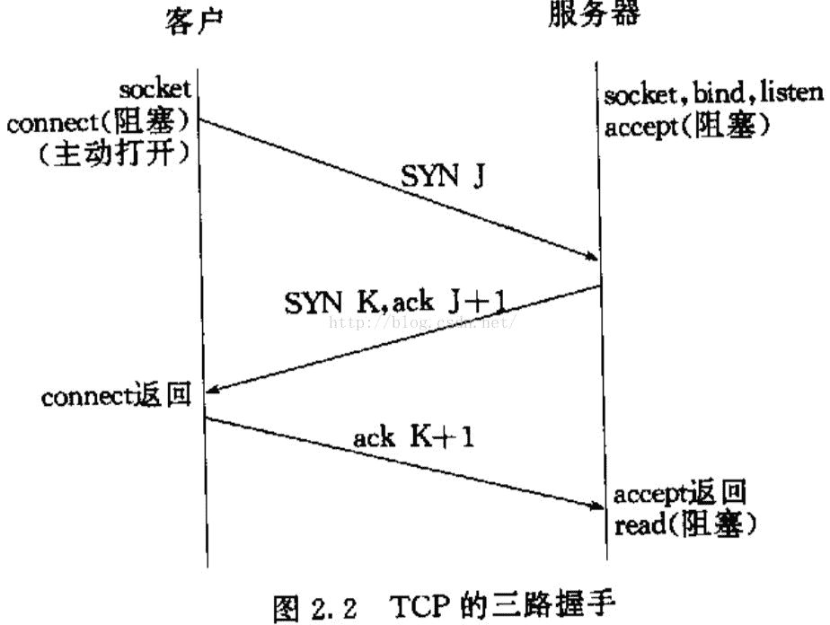
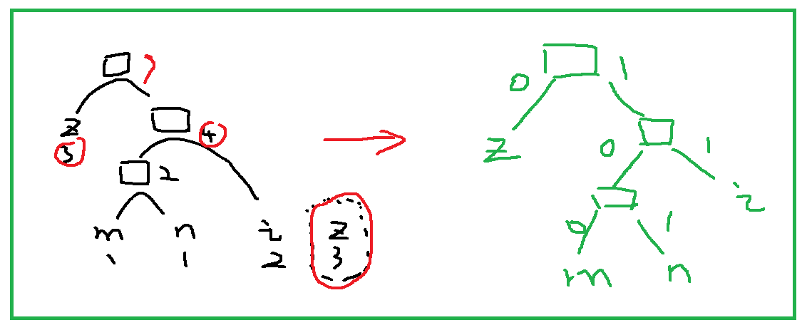
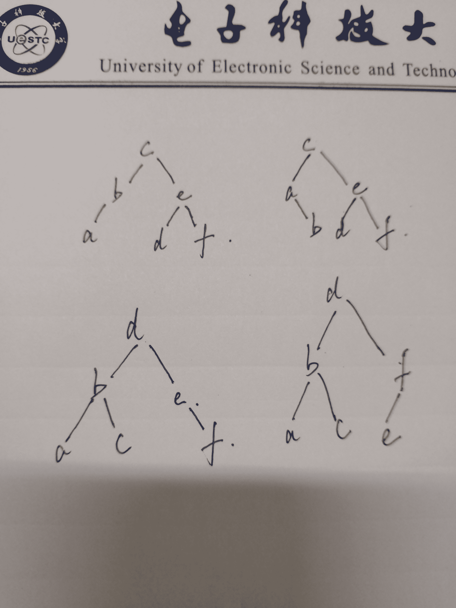

# 网易 2018 实习生招聘笔试题-C 开发实习生

## 1

阅读 C 语言代码输出（）

```cpp
int main()
{
    int arr[]={1,2,3,4,5,6,7};
    int *p=arr;
    *(p++)+=89;
    printf("%d,%d\n",*p,*(++p));
    return 0;
}
```

正确答案: A   你的答案: 空 (错误)

```cpp
3 3
```

```cpp
2 2
```

```cpp
2 3
```

```cpp
3 2
```

本题知识点

网易 C++工程师 2018 C++

讨论

[dutxubo](https://www.nowcoder.com/profile/7804269)

printf 从右向左编译，从左向右输出，符合栈模型

发表于 2018-05-30 14:49:20

* * *

[中二学生](https://www.nowcoder.com/profile/3247422)

好了，这样的代码谁写出来的？开除了吧😂

发表于 2018-06-14 15:05:27

* * *

[小鱼啊酷](https://www.nowcoder.com/profile/7026699)

第 4 行： *p=arr[0]第 5 行：arr[0]=90;p 自加 1，此时*p=arr[1];第 6 行：先计算*(++p),*p=arr[2],在计算*p=arr[2].原因 prinf 从右到左编译，从左到右输出

发表于 2018-06-15 12:28:40

* * *

## 2

阅读下面 C++ 代码，输出结果为（）

```cpp
#include <iostream>
using namespace std;

class base1 {
private: int a, b;
public:
    base1(int i) : b(i + 1), a(b) {}
    base1():b(0), a(b) {}
    int get_a() { 
        return a; 
    }
    int get_b() { 
        return b; 
    }
};
int main() {
    base1 obj1(11);
    cout << obj1.get_a() << " " << obj1.get_b() << endl;
    return 0;
}
```

正确答案: B   你的答案: 空 (错误)

```cpp
12 12
```

```cpp
随机数 12
```

```cpp
随机数 随机数
```

```cpp
12 随机数
```

本题知识点

网易 C++工程师 2018 C++

讨论

[同宇冋桌](https://www.nowcoder.com/profile/5547733)

类中变量赋值顺序是变量声明顺序，所以赋值时先执行 a(b)，再执行 b(i+1)。a 赋值为随机数

发表于 2018-06-06 15:58:01

* * *

[Mr.NH](https://www.nowcoder.com/profile/9587415)

初始化列表的执行顺序是变量的声明顺序

发表于 2018-06-01 09:38:21

* * *

[WeiC0der](https://www.nowcoder.com/profile/725677014)

需要注意：在类的构造函数中，成员变量的初始化与初始化列表中的顺序无关，而与成员在类中的声明顺序有关。

发表于 2021-06-19 11:00:12

* * *

## 3

64 位电脑运行 C++ 结果输出（）

```cpp
#include <iostream>
using namespace std;

class A {
    char a[2];
public:
    virtual void aa() {};
};

class B : public virtual A {
    char b[2];
    char a[2];
public:
    virtual void bb() {};
    virtual void aa() {};
};

class C : public virtual B {
    char a[2];
    char b[2];
    char c[2];
public:
    virtual void cc() {};
    virtual void aa() {};
    virtual void bb() {};
};

int main() {
    cout << sizeof(A) << endl << sizeof(B) << endl << sizeof(C);
    return 0;
}
```

正确答案: C   你的答案: 空 (错误)

```cpp
8 16 24
```

```cpp
16 32 36
```

```cpp
16 32 48
```

```cpp
8 20 24
```

本题知识点

网易 C++工程师 2018 C++

讨论

[岩流佐佐木小次郎](https://www.nowcoder.com/profile/1806554)

应该考虑虚继承中虚基类指针的情况，**GCC 共享虚函数表指针，也就是说父类如果已经有虚函数表指针，那么子类***享父类的虚函数表指针空间，不在占用额外的空间，这一点与 VC 不同，VC 在虚继承情况下，不共享父类虚函数表指针**因此答案有误，在 gcc 下为 16 32 48，vc 下应为 16 40 56 参考[`www.cnblogs.com/demian/p/6538301.html`](https://www.cnblogs.com/demian/p/6538301.html)

发表于 2018-08-10 01:58:57

* * *

[Intmain](https://www.nowcoder.com/profile/3595974)

2+8=10 补至 164+8=12 补至 16 再加父类 16  为 326+8=14 补至 16 再加父类 32  为 4864 位系统，所以指向虚函数表的指针为 8 字节，A 中的所有虚函数都存在一个虚函数表中，所以只需要一个指针，同理 B 和 C 中的所有虚函数也是只需要一个指针，由于子类 sizeof 应包含父类大小，所以得到上述结果

编辑于 2018-07-04 10:07:09

* * *

[杨水彬](https://www.nowcoder.com/profile/1278667)

类空间大小是成员中内存最大值的最小整数倍。虚函数会占用内存空间，这边 64 位系统，则占用 8Byte。sizeof(A) = 2+8=10，最大成员内存 8，则补齐至 16\.sizeof(B) = 4+8=12，补齐至 16，+sizeof(A)，total=32sizeof(C) = 6+8=14，补齐至 16，+sizeof(B)，total=48

发表于 2018-05-30 16:00:47

* * *

## 4

以下代码在 64 位的机子上输出是什么：

```cpp
#include <stdio.h>
int getSize(int data[]){
    return sizeof(data);
}

int main(){
    int data1[] = {1,2,3,4,5};
    int size1 = sizeof(data1);

    int* data2 = data1;
    int size2 = sizeof(data2);

    int size3 = getSize(data1);

    printf("%d, %d, %d", size1, size2, size3);
    return 0;
}
```

正确答案: A   你的答案: 空 (错误)

```cpp
20,8, 8
```

```cpp
4, 4, 4
```

```cpp
20, 4, 20
```

```cpp
20, 20, 20
```

本题知识点

网易 C++工程师 2018 C 语言

讨论

[Mr.NH](https://www.nowcoder.com/profile/9587415)

64 位机下，指针占 8 个字节，所以 sizeof(B)为 8.getSize()是一个函数，数组名作为函数的参数退化为指针，所以 size3 也为 8

发表于 2018-06-08 16:46:26

* * *

[一片两片三四片](https://www.nowcoder.com/profile/4580060)

64 位机器，指针变量占 8 个字节。sizeof(data1): sizeof(数组)=数组所存放元素占用空间=5*4=20；sizeof(data2): sizeof(指针)=8；数组作为形参时，蜕变为指针，故 size3=8.

发表于 2018-06-29 14:00:29

* * *

[kidiyan](https://www.nowcoder.com/profile/818787)

int 类型在 64 位系统 占 4 个字节 数组大小是 5 所以 20 个字节 第二个 指针大小是 8 第三个 数组名会退化成指针 所以也是 8

发表于 2018-06-06 19:32:48

* * *

## 5

关于 MySQL 索引 ，下面说法正确的是（）(1)B+Tree 索引是大多数 MySQL 存储引擎的默认索引类型(2)在 MySQL 中只有 Memory 引擎显式支持哈希索引(3)哈希索引只包含哈希值和列指针，而不存储字段值(4)MyISAM 存储引擎支持空间索引，可以用于地理数据存储。(5)空间索引使用 MATCH AGAINST，而不是普通的 WHERE(6) 索引将顺序 I/O 变为随机 I/O

正确答案: B   你的答案: 空 (错误)

```cpp
(1)(2)
```

```cpp
(2)(4)
```

```cpp
(2)(5)
```

```cpp
(2)(4)(5)
```

```cpp
(2)(5)(6)
```

```cpp
(4)(5)(6)
```

本题知识点

网易 C++工程师 2018

讨论

[执念 sss](https://www.nowcoder.com/profile/4730837)

(1) BTree 索引是大多数 MySQL 存储引擎的默认索引类型，不是 B+Tree。
(2) 哈希索引是 memory 引擎表的默认索引类型，memory 也支持 btree。
(3) 哈希索引只包含哈希值和行指针，而不存储字段值，所以不能使用索引中的值来避免读取行（即不能使用哈希索引来做覆盖索引扫描）。
(5) 空间索引不会要求 where 子句使用索引最左前缀可以全方位索引数据，可以高效使用任何数据组合查找 配合使用 mercontains()函数使用。
(6) 索引将随机 I/O 变为顺序 I/O

发表于 2018-06-10 20:28:37

* * *

[南院幽笛](https://www.nowcoder.com/profile/263381702)

(1) BTree 索引是大多数 MySQL 存储引擎的默认索引类型，不是 B+Tree。
(2) 哈希索引是 memory 引擎表的默认索引类型，memory 也支持 btree。
(3) 哈希索引只包含哈希值和行指针，而不存储字段值，所以不能使用索引中的值来避免读取行（即不能使用哈希索引来做覆盖索引扫描）。
(5) 空间索引不会要求 where 子句使用索引最左前缀可以全方位索引数据，可以高效使用任何数据组合查找 配合使用 mercontains()函数使用。
(6) 索引将随机 I/O 变为顺序 I/O

发表于 2018-08-30 14:08:56

* * *

[lilinl](https://www.nowcoder.com/profile/3431580)

哈希索引只包含哈希值和行指针，而不存储字段值；空间索引配合 mercontains()函数使用；索引将随机 I/O 变为顺序 I/O;

发表于 2018-07-25 21:33:07

* * *

## 6

在 Linux 系统中，可以用来查找可执行文件的是？(1)whereis(2)locate(3)which(4)type(5)find

正确答案: D   你的答案: 空 (错误)

```cpp
(1)(2)(3)
```

```cpp
(1)(2)(5)
```

```cpp
(1)(2)(3)(5)
```

```cpp
(1)(2)(3)(4)(5)
```

本题知识点

网易 C++工程师 C++工程师 网易 2018

讨论

[lpplgg](https://www.nowcoder.com/profile/2201901)

[`www.cnblogs.com/kex1n/p/5233821.html`](https://www.cnblogs.com/kex1n/p/5233821.html)

发表于 2018-07-22 13:42:26

* * *

[小鱼啊酷](https://www.nowcoder.com/profile/7026699)

type 命令用来显示指定命令的类型，判断给出的指令是内部指令还是外部指令。

发表于 2018-06-15 12:50:59

* * *

## 7

运行下面的 c++代码, 关于 ptrX ptrY ptrZ 三个指针下面说法正确的是

```cpp
class BaseX
{
    public:
        virtual ~BaseX(){};
        virtual void FunctionX(){};
};
class ClassY: public BaseX
{
    public:
        virtual void FunctionY(){};
};
class FatherZ :public ClassY
{
    public:
};
int main()
{
    FatherZ aObject;
    BaseX* ptrX=&aObject;
    ClassY* ptrY=&aObject;
    FatherZ* ptrZ=&aObject;
    return 0;
}
```

正确答案: A   你的答案: 空 (错误)

```cpp
ptrX,ptrY,ptrZ 的取值相同.
```

```cpp
ptrZ=ptrX+ptrY
```

```cpp
ptrX 和 ptrY 不相同
```

```cpp
ptrZ 不等于 ptrX 也不等于 ptrY
```

本题知识点

网易 C++工程师 C++工程师 网易 2018

讨论

[风暴洋](https://www.nowcoder.com/profile/1356065)

实测后，是一样的。因为我们实例化 Z 类后，该对象的大小仅仅是一个虚函数表指针的大小。那么该对象的地址就是虚函数表指针的首地址，它是不会变的，变的是虚函数表指针的值(也就是虚函数表中第一个虚函数的地址)。注意虚函数表指针的地址和虚函数表指针的值。

发表于 2018-06-05 12:39:19

* * *

[只想上岸啊](https://www.nowcoder.com/profile/120029762)

*   如果类里含有虚函数，则虚函数表的首地址和类的首地址是一致的。
*   题干三个指针在程序执行时动态绑定，使得三者虚函数表首地址都指向 aObject 对象所含虚函数表的首地址。所以三者值相等。

发表于 2019-03-01 15:05:35

* * *

[AnimateDeng](https://www.nowcoder.com/profile/224460406)

我们把不关心的都屏蔽掉来看这个问题，
我们都知道空类会默认占一个字节，这里初始化指向的即空类（对象`aObject`）的位置。

```cpp
#include 
using namespace std;
class BaseX
{
    public:
        // virtual ~BaseX(){};
        // virtual void FunctionX(){};
};
class ClassY : public BaseX
{
    public:
        // virtual void FunctionY(){};
};
class FatherZ : public ClassY
{
    public:
};
int main()
{
    FatherZ aObject;
    BaseX*   ptrX = &aObject;
    ClassY*  ptrY = &aObject;
    FatherZ* ptrZ = &aObject;
    // gcc test
    cout << ptrX << endl;    // 0x68fee3
    cout << ptrY << endl;    // 0x68fee3
    cout << ptrZ << endl;    // 0x68fee3
    cout << sizeof(* ptrX) << endl;
    cout << sizeof(* ptrY) << endl;
    cout << sizeof(* ptrZ) << endl;
    return 0;
}
/*
Test result
0x68fee3
0x68fee3
0x68fee3
1
1
1
[Finished in 0.5s]
*/ 
```

编辑于 2018-09-07 21:58:32

* * *

## 8

以下哪种情况会使得进程由执行状态转变成阻塞状态

正确答案: D   你的答案: 空 (错误)

```cpp
时间片用完
```

```cpp
进程调度
```

```cpp
I/O 完成
```

```cpp
I/O 请求
```

本题知识点

网易 C++工程师 C++工程师 网易 2018

讨论

[SGHのRY](https://www.nowcoder.com/profile/4431167)

执行-->就绪：时间片完；就绪-->执行：被调度；执行-->阻塞：等待事件；SGH

发表于 2018-06-02 11:06:23

* * *

[加班改 BUG](https://www.nowcoder.com/profile/220207099)

执行-->就绪：时间片完；就绪-->执行：被调度；执行-->阻塞：等待事件，io 请求；阻塞->就绪：io 完成

发表于 2019-07-02 19:51:38

* * *

[一路狂奔带点风](https://www.nowcoder.com/profile/5612514)

进程的三种基本状态：摘自 [`blog.csdn.net/qq_40385194/article/details/79320360`](https://blog.csdn.net/qq_40385194/article/details/79320360) 就绪状态： 当进程已分配到除 CPU 以外的所有必要的资源，只要获得处理机便可立即执行，这时的进程状态就称为就绪状态；
执行状态：
当进程已获得处理机，其程序正在处理机上执行，此时的进程状态称为执行状态；
阻塞状态：
正在执行的进程，由于等待某个事件发生而无法执行时，便放弃处理机而进入阻塞状态。引起进程阻塞的事件有很多种，例如，等待 I/O 完成、申请缓冲区不能满足、等待信号等。
进程三种状态间的转换一个进程在运行期间，不断地从一种状态转换到另一种状态，它可以多次处于就绪状态和执行状态，也可以多次处于阻塞状态。 
A. 就绪—>执行
处于就绪状态的进程，当进程调度程序为之分配好了处理机后，该进程便由就绪状态转换为执行状态；
B. 执行—>就绪 
处于执行状态的进程在其执行过程中，因分配给它的一个时间片已经用完而不得不让出处理机，于是进程从执行状态转换为就绪状态；
C. 执行—>阻塞
正在执行的进程因等待某种事件发生而无法继续执行时，便从执行状态变成阻塞状态；
D. 阻塞—>就绪
处于阻塞状态的进程，若其等待的事件已经发生，于是进程便从阻塞状态转变为就绪状态。

发表于 2018-08-04 13:47:42

* * *

## 9

假设某分时系统采用时间片轮转法，进程 A，B，C，D 需要运行的时间分别为 20ms，10ms，15ms，5ms，时间片选用 5ms，则平均周转时间是：

正确答案: D   你的答案: 空 (错误)

```cpp
20ms
```

```cpp
35ms
```

```cpp
35.25ms
```

```cpp
36.25ms
```

本题知识点

网易 C++工程师 C++工程师 网易 2018

讨论

[WAK](https://www.nowcoder.com/profile/9358901)

系统按照时间片轮转，进程运行顺序为 A B C D A B C A C A，A 执行 4 次，B 执行 2 次，C 执行 3 次，D 执行一次，按执行完的时间算：A 在第 10 个时间片后，B 在第 6 个时间片后，C 在第 9 个时间片后，D 在第 4 个时间片后，平均时间为（10+6+9+4）*5/4 = 36.25

发表于 2018-05-31 15:30:30

* * *

[TheFurtherLo](https://www.nowcoder.com/profile/6649734)

按照时间片轮转：相当于每过一个 5ms 运行一部分，运行完的下一个轮回就没有了，如下 A(20-5)B(10-5)C(15-5)D(5-5)A(15-5)B(5-5)C(10-5)A(10-5)C(5-5)A(5-5)

发表于 2018-07-07 10:04:52

* * *

[玫瑰酱酱酱](https://www.nowcoder.com/profile/834704410)

[`blog.csdn.net/Houchaoqun_XMU/article/details/55540250`](https://blog.csdn.net/Houchaoqun_XMU/article/details/55540250)

发表于 2019-08-03 10:52:09

* * *

## 10

假设某系统为进程在内存中分配了 3 个物理块，进程访问顺序为 0、2、1、3、0、2、4、0、2、1、3、4。已知系统未事先调入任何页面，那么当采用 FIFO 置换算法时，缺页率是：

正确答案: C   你的答案: 空 (错误)

```cpp
33.3%
```

```cpp
25%
```

```cpp
75%
```

```cpp
60%
```

本题知识点

网易 C++工程师 C++工程师 网易 2018

讨论

[WAK](https://www.nowcoder.com/profile/9358901)

访问失败叫做缺页，访问的内存不存在或者内存满都算访问失败。（0）（2）（1）（3）（0）（2）（4）  0    2   （1）（3）  4 前三个括号中的算内存不存在  后 6 个括号中的算内存满所以是 9/12 = 0.75

发表于 2018-05-31 10:29:54

* * *

[AnimateDeng](https://www.nowcoder.com/profile/224460406)

```cpp
/* 解析 */
// 0 2 1 3 0 2 4 0 2 1 3 4
// FIFO 仅有 3 个物理块（内存）
/* ---------------------- */   --->
// 0 loss insert 0 locate 1 // 0 x x
// 2 loss insert 2 locate 2 // 2 0 x
// 1 loss insert 1 locate 3 // 1 2 0  memory full
// 3 loss insert 3 locate 3 // 0 out, memory: [3 1 2]
// 0 loss insert 0 locate 3 // 2 out, memory: [0 3 1]
// 2 loss insert 2 locate 3 // 1 out, memory: [2 0 3]
// 4 loss insert 4 locate 3 // 3 out, memory: [4 2 0]
// 0 have keep     keep     // keep , memory: [4 2 0]
// 2 have keep     keep     // keep , memory: [4 2 0]
// 1 loss insert 1 locate 3 // 0 out, memory: [1 4 2]
// 3 loss insert 3 locate 3 // 2 out, memory: [3 1 4]
// 4 have keep     keep     // keep , memory: [3 1 4]
// loss page: 
 lossPageRate = (12 - 3) / 12 = 0.75 = 75% 
```

发表于 2018-09-07 22:34:29

* * *

[木木 201805151657669](https://www.nowcoder.com/profile/4235663)

缺页率 = (页面置换次数+分配给该进程的物理块数)/要访问的页面总数将要访问的页面（12 个）按照 FIFO 顺序，入 3 个物理块组成的队列。队尾插入进程号时判断（队列未满不需要页面置换，不作判断），是否在队列中，不存在则删除队头进程号并插入；存在略过判断下一个。以上步骤得到【页面置换次数】-- 6.有公式得：缺页率 = （6 + 3）/ 12.

编辑于 2018-06-04 17:32:55

* * *

## 11

TCP 建立连接的时候 connect()函数和 accept()函数分别在三次握手第几次后返回（）

正确答案: B   你的答案: 空 (错误)

```cpp
1 , 2
```

```cpp
2 , 3
```

```cpp
1 , 3
```

```cpp
2 , 2
```

本题知识点

网易 C++工程师 C++工程师 网易 2018

讨论

[执念 sss](https://www.nowcoder.com/profile/4730837)



发表于 2018-06-10 21:26:10

* * *

## 12

关于 HTTP1.0 和 HTTP1.1 错误的是()

正确答案: A   你的答案: 空 (错误)

```cpp
HTTP1.0 只能短连接，而 HTTP1.1 只能长连接
```

```cpp
HTTP1.0 通信的时候会占用大量内存，而 HTTP1.1 可以避免这样的情况
```

```cpp
状态码 100 只适用于 HTTP1.1 版本
```

```cpp
HTTP1.1 在 Request 消息头里多了一个 Host 域,HTTP1.0 则没有这个域
```

本题知识点

网易 C++工程师 C++工程师 网易 2018

讨论

[TheFurtherLo](https://www.nowcoder.com/profile/6649734)

HTTP 1.0 规定浏览器与服务器只保持短暂的连接，浏览器的每次请求都需要与服务器建立一个 TCP 连接，服务器完成请求处理后立即断开 TCP 连接，服务器不跟踪每个客户也不记录过去的请求。
HTTP 1.1 则支持永久连接, 并且默认使用永久连接. 在同一个 tcp 的连接中可以传送多个 HTTP 请求和响应. 多个请求和响应可以重叠，多个请求和响应可以同时进行. 更加多的请求头和响应头(比如 HTTP1.0 没有 host 的字段).

发表于 2018-07-07 10:14:42

* * *

[风暴洋](https://www.nowcoder.com/profile/1356065)

HTTP1.0 规定浏览器与服务器只保持短暂的连接，浏览器的每次请求都需要与服务器建立一个 TCP 连接，服务器完成请求处理后立即断开 TCP 连接，服务器不跟踪每个客户也不记录过去的请求。在 HTTP1.1 中,一个连接可用于一次或多次请求/响应交换,尽管连接可能由于各种原因被关闭。HTTP 1.1 支持持久连接，在一个 TCP 连接上可以传送多个 HTTP 请求和响应，减少了建立和关闭连接的消耗和延时。 

发表于 2018-06-04 20:46:31

* * *

[summerrr](https://www.nowcoder.com/profile/5030955)

100  Continue  初始的请求已经接受，客户应当继续发送请求的其余部分。（HTTP 1.1 新）  
101  Switching Protocols  服务器将遵从客户的请求转换到另外一种协议（HTTP 1.1 新）  

发表于 2019-03-03 22:50:47

* * *

## 13

下面关于三次握手与 connect()函数的关系说法错误的是（）

正确答案: B   你的答案: 空 (错误)

```cpp
客户端发送 SYN 给服务器
```

```cpp
服务器只发送 SYN 给客户端
```

```cpp
客户端收到服务器回应后发送 ACK 给服务器
```

```cpp
connect()函数在三次握手的第二次返回
```

本题知识点

网易 C++工程师 C++工程师 网易 2018

讨论

[去环游世界啦](https://www.nowcoder.com/profile/7955379)

1.  客户端调用 connect()函数发送 SYN 给服务器端，客户端处于 SYN_SENT 状态
2.  服务器端 accept()接收到 SYN 后发送 ACK 和 SYN，服务器端处于 SYN_RECV 状态；
3.  客服端接收到 SYN 后发送 ACK 给服务器端，connect 返回（期间处于阻塞状态），客户端处于 ESTABLISHED 状态；
4.  服务器端就收到 ACK 后 accept 返回，服务器端也处于 ESTABLISHED 状态；

发表于 2018-08-12 15:12:18

* * *

[🎧关键词、](https://www.nowcoder.com/profile/9897585)

三次握手：客户端发送 SYN-> 服务器端；服务器端发送 SYN+ACK ->客户端；客户端发送 ACK->服务器端

发表于 2018-06-02 21:22:13

* * *

[SGHのRY](https://www.nowcoder.com/profile/4431167)

还有 SEQ&ACK&rwnd 信息

发表于 2018-06-02 11:35:21

* * *

## 14

一个完全二叉树节点数为 200，则其叶子结点个数为？

正确答案: C   你的答案: 空 (错误)

```cpp
98
```

```cpp
99
```

```cpp
100
```

```cpp
101
```

本题知识点

网易 C++工程师 C++工程师 网易 2018

讨论

[ζั͡އ๓尐星繁♪](https://www.nowcoder.com/profile/6153698)

完全二叉树，叶子结点数 n/2 向上取整

发表于 2018-06-01 16:00:18

* * *

[神思者之梦](https://www.nowcoder.com/profile/582606)

7 层满二叉树有 2 的 7 次方-1=127 个节点。8 层满二叉树有 2 的 8 次方-1=255 个节点。因此 200 个节点树有 8 层，前 7 层是满的。第 i 层有 2 的(i-1)次方个节点，因此第 7 层有 64 个节点，第 8 层有 200-127=73 个节点(均为叶子节点)第七层中有孩子的节点则为 73/2 向上取整 37 个节点(度为 2 或 1)第七层的叶子节点数为 64-37=27 个叶子节点一共有 73+27=100 个-------------------------------------------------------------------------------------------------------------------------网上查到的另一种解法：

```cpp
完全二叉树除最后一层，其他层都是满结点的。
所以这里总结点 200 个，这里是偶数，可以判断度为 1 的结点是 1 个。
根据二叉树性质 n0 = n2 + 1;叶子结点数量等于度为 2 的结点数+1
n0 + n1 + n2 = 200 
n0 + n1 + n0 -1 =200;
2n0 = 201-n1 = 200  （完全二叉树度为 1 的结点个数要么 1，要么 0\. 叶子结点数为整数，这里也可以推断出度为 1 的结点个数是 1）
n0 = 100 叶子结点数是 100.
```

编辑于 2018-06-01 15:15:21

* * *

[hey,20180424](https://www.nowcoder.com/profile/5886477)

这个考查完全二叉树的特点 就是每行的节点数如果完整 都是 2 的整数次方

比如 1 2 4 8 16 32 64 128 所以要看到哪一层之前的节点数之和小于且最靠近 200

1+2+4+8+16+32+64=127 也就是说 最后一层的叶子节点有 200-127=73 个

那么上一层的叶子节点有多少个？

最后一层的叶子节点 73 用了上一层的 73/2+1=37 个，因为单独的那个叶子节点的父节点已经不是叶子了，被占用了。所以上一层只剩下 64-37=27 个

27+73=100 个

发表于 2018-10-13 22:18:01

* * *

## 15

字符串 zmnzizi 用哈夫曼编码来编码，则共有多少位？

正确答案: B   你的答案: 空 (错误)

```cpp
14
```

```cpp
13
```

```cpp
12
```

```cpp
11
```

本题知识点

网易 C++工程师 C++工程师 网易 2018

讨论

[RichardD](https://www.nowcoder.com/profile/7876308)

0  100  101  0 11  0 11 每次首两位权重合并后 需要重新排序[`blog.csdn.net/fx677588/article/details/70767446`](http://blog.csdn.net/fx677588/article/details/70767446)

发表于 2018-06-13 10:20:18

* * *

[AnimateDeng](https://www.nowcoder.com/profile/224460406)

z: 0         x3
i: 11        x2
m: 100    x1
n: 101     x1
3 + 4 + 6 = 13

发表于 2018-09-08 10:40:18

* * *

[小鱼啊酷](https://www.nowcoder.com/profile/7026699)

m:000n:001i:01z:11*3+2*2+3*1+3*1=13

发表于 2018-06-15 13:18:29

* * *

## 16

已知中序遍历的序列为 abcdef，高度最小的不可能的二叉树的前序遍历是

正确答案: D   你的答案: 空 (错误)

```cpp
dbacfe
```

```cpp
dbacef
```

```cpp
cbaedf
```

```cpp
cabefd
```

本题知识点

网易 C++工程师 C++工程师 网易 2018

讨论

[大脸猫大脸猫爱吃鱼](https://www.nowcoder.com/profile/8975196)

要使二叉树的高度最小，则根节点两边子树的节点要尽可能均分。所以高度最小的二叉树一共有四种情况前两种是以 c 为根节点，后两种是以 d 为根节点对应的前序遍历分别是 cabedf cbaedf dbacfe dbacef

发表于 2018-06-03 15:01:10

* * *

[只想上岸啊](https://www.nowcoder.com/profile/120029762)

这里中序的 abcdef 和先序 cabefd 不能构成一颗二叉树，所以 D 答案肯定不对。

发表于 2019-02-28 21:03:06

* * *

[AnimateDeng](https://www.nowcoder.com/profile/224460406)

```cpp
// 画图
InOrder: abcdef -> a 为最左值, 要使高度最小则两边均分
PreOrder:  dbacfe, dbacef, cbaedf, cabefd
        d
      /    \
    b        f
  /   \        \
a       c        e
-------------------------
         d
      /    \
    b        f
  /   \     /
a       c e
-------------------------
         c
      /    \
    b        e
  /        /   \
a        d       f
-------------------------
         c                       c
      /     \                 /     \
    a         e       !=    a         e
      \     /   \             \     /   \
        b f       d             b  d      f 
```

发表于 2018-09-08 11:03:57

* * *

## 17

以下算法中未用到贪心算法思想的是？

正确答案: D   你的答案: 空 (错误)

```cpp
迪杰斯特拉(Dijkstra)
```

```cpp
库鲁斯卡尔(Kruskal)
```

```cpp
普里姆算法(Prim)
```

```cpp
KMP
```

本题知识点

网易 C++工程师 C++工程师 网易 2018

讨论

[岚の风](https://www.nowcoder.com/profile/646602)

*   ```cpp
    迪杰斯特拉(Dijkstra)
    贪心策略是每次选可达的点中距离源点最近的点进行扩展，即贪心选取最短距离的点

    ```

*   ```cpp
    库鲁斯卡尔(Kruskal)
    贪心策略是每次选最短的边（刨除成环的边）来作为最小生成树，即贪心最短边
    ```

*   ```cpp
    普里姆算法(Prim)
    贪心策略是每次选可达的点中距离曾经扩展过的点中任意点的最短距离，类似 Dij，只是不是找距离源点的最短距离
    ```

*   ```cpp
    KMP
    贪心策略 0.0 不是贪心
    是动态规划，动态规划的是当前状态失败之后上一次匹配的位置（求的是最长的与前缀子串匹配的左子串）
    ```

发表于 2018-06-15 19:00:59

* * *

[小鱼啊酷](https://www.nowcoder.com/profile/7026699)

用到贪心算法的是：Dijkstra、Prim、 Kruskal
未用到的是：KMP 和 FLOYD 算法，其中 FLOYD 采用类似于动态规划的思想

发表于 2018-06-15 13:25:13

* * *

## 18

对于线性表（ 13,25,22,35,54,57,63）进行散列存储时，若选用 H （ K ） =K %7 作为散列函数，则散列地址为 1 的元素有（ ）个？

正确答案: C   你的答案: 空 (错误)

```cpp
0
```

```cpp
1
```

```cpp
2
```

```cpp
3
```

本题知识点

网易 C++工程师 C++工程师 网易 2018

讨论

[小鱼啊酷](https://www.nowcoder.com/profile/7026699)

对 7 取余=1 的数是 22,57

发表于 2018-06-15 13:26:52

* * *

[只想上岸啊](https://www.nowcoder.com/profile/120029762)

请问各位这个地方线性表散列存储不用考虑解决冲突吗？是不是应该改成链表？

发表于 2019-02-28 20:04:06

* * *

## 19

基于哈希算法在信息安全中主要应用在？(1)    文件校验(2)    数字签名(3)    鉴权协议

正确答案: D   你的答案: 空 (错误)

```cpp
(1)(2)
```

```cpp
(1)(3)
```

```cpp
(2)(3)
```

```cpp
(1)(2)(3)
```

本题知识点

网易 C++工程师 C++工程师 网易 2018

讨论

[TheFurtherLo](https://www.nowcoder.com/profile/6649734)

 A、文件校验

我们比较熟悉的校验算法有奇偶校验和 CRC 校验，这 2 种校验并没有抗数据篡改的能力，它们一定程度上能检测并纠正数据传输中的信道误码，但却不能防止对数据的恶意破坏。

B、数字签名

Hash 算法也是现代密码体系中的一个重要组成部分。由于非对称算法的运算速度较慢，所以在数字签名协议中，单向散列函数扮演了一个重要的角色。

在这种签名协议中，双方必须事先协商好双方都支持的 Hash 函数和签名算法 C、鉴权协议

有个称为“挑战-认证模式”的鉴权协议：需要鉴权的一方，向将被鉴权的一方发送随机串（“挑战”），被鉴权方将该随机串和自己的鉴权口令字一起进行 Hash 运算后，返还鉴权方，鉴权方将收到的 Hash 值与在己端用该随机串和对方的鉴权口令字进行 Hash 运算的结果相比较（“认证”），如相同，则可在统计上认为对方拥有该口令字，即通过鉴权

发表于 2018-07-07 11:11:55

* * *

[Intmain](https://www.nowcoder.com/profile/3595974)

文件校验：例如 MD5 散列表算法，即哈希算法数字签名：生成消息摘要时需要使用哈希算法鉴权协议：挑战认证模式，传输的数据可被监听但不可被修改，使用哈希算法

发表于 2018-07-04 11:19:18

* * *

## 20

下列选项中，不可能是快速排序第 2 趟排序结果的是 （）

正确答案: C   你的答案: 空 (错误)

```cpp
4 14 10 12 8 6 18
```

```cpp
4 6 10 8 12 14 18
```

```cpp
6 4 10 8 14 12 18
```

```cpp
8 4 6 10 12 14 18
```

本题知识点

网易 C++工程师 C++工程师 网易 2018

讨论

[TheFurtherLo](https://www.nowcoder.com/profile/6649734)

把最终排序写出来，与选项中的对照，有两个及两个以上的数字对应顺序就说明是满足要求的（两次排序）

发表于 2018-07-07 11:23:00

* * *

[大脸猫大脸猫爱吃鱼](https://www.nowcoder.com/profile/8975196)

快速排序的核心思想是基准数就位，每一趟至少有一个基准数就位，所以两趟下来至少就位两个基准数就位，C 选项只有 18 就位，所以错误

发表于 2018-06-03 16:09:42

* * *

[小雪 2018](https://www.nowcoder.com/profile/3913019)

[`blog.csdn.net/u011240016/article/details/53149645`](https://blog.csdn.net/u011240016/article/details/53149645)

发表于 2018-06-26 17:32:57

* * *

## 21

小 Q 得到一个神奇的数列: 1, 12, 123,...12345678910,1234567891011...。

并且小 Q 对于能否被 3 整除这个性质很感兴趣。

小 Q 现在希望你能帮他计算一下从数列的第 l 个到第 r 个(包含端点)有多少个数可以被 3 整除。

本题知识点

网易 C++工程师 数学 2018

讨论

[苍苍蒹葭](https://www.nowcoder.com/profile/912245336)

```cpp

```
#include<iostream>
using namespace std;
int main()
{
    long long l, r,num = 0;
    cin >> l >> r;
    long long s= l*(l - 1) / 2;
    for (; l <= r; l++)
    {
        s+=l;
        if (!(s % 3)) num++;
    }
    cout << num << endl;
}

```cpp

```

编辑于 2018-08-19 21:57:12

* * *

[BOBO121](https://www.nowcoder.com/profile/8686929)

```cpp
能被 3 整除的数是每个位置上各个位置上数加起来的数能够被 3 整除，此外，不能被 3 整除的数
各位相加为除 3 的余数，故余数为 120120120...，发现本题中只有被 3 整除为 1 的数不能被 3 整除
```

#include<iostream>
using namespace std;
int main()
{
    int count = 0;
    int l , r;
    cin >> l >> r;
    for(int i = l; i <= r; ++i)
    {
        if((i%3==1)?false:true)
        {
            count = count + 1;
        }
    }
    cout << count<< endl;
    return 0;
}

发表于 2018-08-11 09:53:32

* * *

[new-coder](https://www.nowcoder.com/profile/7467857)

```cpp
import java.util.*;

public class Main{
    public static void main(String[] args){
        Scanner scanner = new Scanner(System.in);
        int left = scanner.nextInt();
        int right = scanner.nextInt();
        int result = (right - left)/3*2;
        int temp1 = (right - left) % 3;
        int temp2 = left % 3;
        if(temp2 == 0){
            result += (temp1 < 2 ? 1 : 2);
        }else if(temp2 == 1){
            result += temp1;
        }else{
            result += Math.min(1+temp1, 2);
        }
        System.out.println(result);
    }
}

```

从第一个数开始，能被 3 整除结果为 FFTFFTFFTFFT...（F 不能被 3 整除，T 能被 3 整除），即每 3 个数中有 2 个可以被 3 整除，判断下区间端点能否被 3 整除的情况即可。

发表于 2018-05-30 16:13:06

* * *

## 22

小 Q 正在给一条长度为 n 的道路设计路灯安置方案。

为了让问题更简单,小 Q 把道路视为 n 个方格,需要照亮的地方用'.'表示, 不需要照亮的格子用'X'表示。

小 Q 现在要在道路上设置一些路灯, 对于安置在 pos 位置的路灯, 这盏路灯可以照亮 pos - 1, pos, pos + 1 这三个位置。

小 Q 希望能安置尽量少的路灯照亮所有'.'区域, 希望你能帮他计算一下最少需要多少盏路灯。

本题知识点

网易 C++工程师 数组 模拟 字符串 *贪心 2018* *讨论

[SGHのRY](https://www.nowcoder.com/profile/4431167)

```cpp
#include <iostream>
#include <string>
using namespace std;
int main()
{
    int size;
    cin >> size;
    int len;
    while (cin >> len)
    {
        string str;
        cin >> str;

        int count = 0;
        for(int i = 0; i < len; i ++)
        {
            if(str[i] == '.')
            {
                i = i + 2 ;
                count ++;
            }
        }

        cout << count << endl;
    }

    return 0;
}
 //贪心，每有一个‘.’则安置一个路灯再向后移两位~~~~By SGHRY 
```

发表于 2018-06-02 13:20:29

* * *

[v 特仑苏 v](https://www.nowcoder.com/profile/8462982)

```cpp
#include <cstdio>
#include <cstring>

int num, length;
char road[1003];
int result[1000];
char* p;
int i;

int main()
{
    scanf("%d", &num);
    for (i = 0; i < num; ++i) {
        scanf("%d", &length);
        scanf("%s", road);
        //road[length + 2 - length%3] = '\0';
        p = road;
        while (*p != '\0') {
            if (*p == 'X')
                ++p;
            else {
                ++result[i];
                p += 3;
            }
        }
        memset(road, 0, length + 3);
    }
    for (i = 0; i < num; ++i)
        printf("%d\n", result[i]);
} 
```

一次看 3 格共 8 种情况
...
..X
.XX
.X.
上述 4 种直接一个路灯搞定再跳 3 格看下一组
X.X
XX.
XXX
X..
上述 4 种路障开头直接舍弃 X 再移位直至变成 1-4 的情况

发表于 2018-08-11 10:06:25

* * *

[倚杖听江声](https://www.nowcoder.com/profile/1092167)

#include <stdio.h>
#include "iostream"
#include "fstream"
#include "vector"
using namespace std;

int update_donemark(int done_mark, char* str,int size)//局部最优求解
{
    int choose1 = 1;
    int choose2 = 1;
    if (done_mark+1<size&&str[done_mark + 1] == '.')
    {
        choose1++;
        choose2++;
    }
    if (done_mark + 2<size&&str[done_mark + 2] == '.')
    {
        choose2++;
    }
    if (choose1 > choose2)
    {
        return done_mark + 2;
    }
    else return done_mark + 3;
}
int func(int size, char* str)
{
    int done_mark = 0;//贪心算法已经贪吃掉 str[done_mark]之前的所有区域
    int count = 0;
    while (done_mark < size)
    {
        while (str[done_mark] == 'X')
        {
            done_mark++;
        }
        if (done_mark < size)
        {
            done_mark = update_donemark(done_mark, str,size);
            count++;
        }
        else break;
    }
    return count;
}

int main()
{
     ////////////输入操作部分/////////////////////
    //fstream fin("7.txt");
    int test_num = 0;
    cin >> test_num;
    vector<pair<int, char*>> vec;
    for (int i = 0; i < test_num; i++)
    {
        int size = 0;
        char* temp = new char[1001];
        cin >> size >> temp;
        pair<int, char*> data(size, temp);
        vec.push_back(data);
    }

    ////////////输出操作部分/////////////////////
    for (int i = 0; i < test_num; i++)
    {
        cout << func(vec[i].first, vec[i].second)<<endl;
    }

    return 0;
}

发表于 2018-07-27 10:39:16

* * *

## 23

牛牛准备参加学校组织的春游, 出发前牛牛准备往背包里装入一些零食, 牛牛的背包容量为 w。牛牛家里一共有 n 袋零食, 第 i 袋零食体积为 v[i]。牛牛想知道在总体积不超过背包容量的情况下,他一共有多少种零食放法(总体积为 0 也算一种放法)。

本题知识点

网易 C++工程师 高级算法 穷举 2018

讨论

[落融金](https://www.nowcoder.com/profile/1931438)

//单纯根据题意，加与不加分别一次判断#include<bits/stdc++.h>using namespace std;

int bag(const vector<int> &num,int beg,int m){
    if(beg==num.size()-1){
        if(m>num[beg])
            return 2;
        return 1;
    }
    if(m>=num[beg])//可以加上
        return bag(num,beg+1,m-num[beg])+bag(num,beg+1,m);//两类加与不加
    return bag(num,beg+1,m);//不能加
}

int main(void){
    int n,w;
    while(cin>>n>>w){
        long long sum = 0;
        vector<int> v(n);
        for(int i=0;i<n;i++){
            cin>>v[i];
            sum += v[i];
        }
        if(sum<=w)
            cout<<(1<<n)<<endl;
        else
            cout<<bag(v,0,w)<<endl;
    }
}

发表于 2018-08-18 21:47:52

* * *

[杰斯 007](https://www.nowcoder.com/profile/4926639)

```cpp

	借鉴一下 DFS

	#include<bits/stdc++.h>

	using namespace std;

	long long v[40];

	int n;

	long long ans=0,w;

	void dfs(int t,long long sum){

	    ans++;

	    if(t==n-1){

	        return ;

	    }

	    for(int i=t+1;i<n;i++){

	        if(sum+v[i]<=w){

	            dfs(i,sum+v[i]);

	        }

	    }

	}

	int main(){

	    //long long w;

	    cin>>n>>w;

	    long long sum=0;

	    for(int i=0;i<n;i++){

	        cin>>v[i];

	        sum+=v[i];

	    }

	    if(sum<=w){

	        ans=1<<n;//根据题目，0 个也算进去，那就正好是左移 n 位

	    }

	    else{

	        dfs(-1,0);

	    }

	    cout<<ans<<endl;

	    return 0;

	}

```

编辑于 2018-06-28 09:19:21

* * *

[ftfunjth](https://www.nowcoder.com/profile/50268538)

想了一下只能用 dfs
然后算法如下
最开始的时候会超出运行时间 原因是未考虑 当所有零食的重量之和小于背包的容量的情况和任意一个零食的重量都大于背包的容量的情况。

```cpp
#include <iostream>
long long int v[31];
int dfs(long long int w,long long int n){
    if(w < 0){
        return 0;
    }
    if(n <= 0 && w >= 0){
        return 1;
    }
    return dfs(w - v[n-1],n-1) + dfs(w,n-1);
}
int main(){
    long long int n,w,real_n;
    std::cin >> n >> w;
    real_n = n;
    long long int value;
    long long int sum = 0;
    int index = 0;
    for(int i=0;i<n;i++){
        std::cin >> value;
        if(value > w){
            real_n--;
            continue;
        }
        sum+=value;
        v[index] = value;
        index++;
    }    
    if(sum <=w){
        std::cout << (1 << real_n) << std::endl;
    }else{
        std::cout << dfs(w,real_n) << std::endl;
    }
    return 0;
}
```

编辑于 2018-09-16 22:24:07

* * *

## 24

有 n 项工作，每项工作分别在 Si 时间开始，在 Ti 时间结束。对于每项工作，你都可以选择参与与否。如果选择了参与，那么自始至终都必须全程参与。此外，参与工作的时间段不能重叠（即使是开始的瞬间和结束的瞬间的重叠也是不允许的）。

你的目标是参与尽可能多的工作，那么最多能参与多少项工作呢？

1.你能想到的解题思路或者解题方法是什么？请描述（4 分）

2.请使用伪代码实现你的解题思路（8 分）

3.请简单证明你所使用的方法是最优解（8 分）

你的答案

本题知识点

网易 C++工程师 2018

讨论

[苏卿念](https://www.nowcoder.com/profile/7096915)

答：**1.**我们使用贪心算法，每次选取当前可以做的工作中，结束时间最早的工作去做。

如果把每个工作都以他起始时间为起点，结束时间为终点的区间，在数轴上表示这些区间 。

将这些区间按右端点坐标（结束时间）从小到大排序，顺序处理每个区间。

如果它与当前已选的所有区间都没有重叠，则选择该区间，否则不选。

**2.**

证明：

显然，我们最后选出的区间没有重叠的部分，如果设 fi 为这个算法的第 i 个区间的右端点坐标，gi 为最优解中的第 i 个区间的右端点坐标。

1.当 i>=1 时，该算法所接受的第 i 个区间的右端点坐标 fi<=最优解中的第 i 个区间的右端点坐标 gi。
我们令 i=1,    则有 f[i-1]<=g[i-1]。所以{最优解的第 i 个可选区间} ⊆{该算法时第 i 个可选区间}.而当算法选择第 i 个区间时，选的是在可选区间中右端点坐标最小的一个，所以有 fi<=gi。证毕。
2.最优解选出的区间数量 m=该算法选出的区间数量 k。  假设 m>k，根据 1.,有 fk<=gk。由于 m>k，必然存在某区间，在 gk 之后开始，故也在 fk 之后开始。而该算法一定不会在选了第 k 个区间后停止，还会选择更多的区间，矛盾。所以最优解选出的区间数量 m=该算法选出的区间数量 k。

综上所述，这个算法选出的区间是最优解。

 **3.**

```cpp
#include<bits/stdc++.h>
struct data{
int l;int r;
friend bool operator <(const data &a,const data &b){return a.r<b.r;}
}work[100010];
int n;//n 个工作 
int ans,t;//ans 储存答案，t 为当前结束时间。  
int main()
{
    scanf("%d",&n);
    for(int i=1;i<=n;i++) scanf("%d%d",&work[i].l,&work[i].r);
    sort(work+1,work+n+1);
    for(int i=1;i<=n;i++) if(t<work[i].l) ans++,t=work[i].l;
    return 0;
}

```

发表于 2018-06-01 17:30:13

* * *

[Intmain](https://www.nowcoder.com/profile/3595974)

**1. **使用贪心算法，将所有的工作按结束时间的先后，从小到大排列，然后以第一个结束时间为初始值，判断下一个事件开始时间是否大于结束时间，若大于则执行该事件，更新初始值，继续判断下一事件，否则跳过该事件，判断下一个事件。**2. **使用一个 struct 来存放开始与结束时间。(1)首先读取数据，将第 n 个事件的开始时间存入 struct.a，结束时间存入 struct.b；(2)将该类存入一个数组 performTime，并按照结束时间 struct.b 从小到大的顺序排序；(3)设置初始值 display 为经过排序后的数组 performTime[0].b，参与的事件数 count 为 1；(4)循环取数组元素进行判断，如果数组的下一个元素 x 的开始时间（即 x.a）大于 display 值，count++，更新 display 值为 x.b。**3. **从结束时间最早的事件开始计算，保证了从起始点到该点之间，该事件的时间最短，为了防止重叠，要保证下一事件开始时间晚于该时间结束时间，起始点相当于从第一个时间结束的时间开始，继续按照上面的思路来选择下一个事件，这样就保证了每段都是最优，最后的结果也是最优。**4.代码实现：**

```cpp
#include <iostream>
using namespace std;

struct A
{
    int a;
    int b;
}perform[100000];

bool compare(A first,A second)
{
    return first.b < second.b;
}//作为 sort 排序的 compare 函数

int main()
{
    int n;
    int count = 0;
    int displayTime = 0;
    cin >> n;
    for(int i = 0; i < n; i++)
    {
        cin >> perform[i].a >> perform[i].b;
    }
    sort( perform,perform+n,compare) ; //从小到大排序
    displayTime = perform[0].b;
    count = 1;
    for(int i = 1; i < n; i++)
    {
        if(displayTime < perform[i].a)
        {
            displayTime = perform[i].b
            count ++;
        }
    }
    cout << count << endl;
    return 0;
}
```

编辑于 2018-07-06 10:08:12

* * *

[张大年](https://www.nowcoder.com/profile/8241355)

```cpp
int main(){
        int n;
        cin>>n;
       vector<vector<int>> times(n,vector<int>(2,0));
        for(int i=0;i<n;i++){
            int s,t;
            cin>>s>>t;
            times[i][0]=s;
            times[i][1]=t;
}
        sort(times,byfirstelement());
        int fin=INT_MIN;
int sum=0;
        for(int i=0;i<n;i++){
            if(times[i][0]>fin){
                fin=times[i][1];
                sum++;
}
}
return sum;
}
```

发表于 2018-06-11 15:07:39

* * *

## 25

class A

{

public:

A() {cout<<"A"<<endl;}~A() {cout<<"~A"<<endl;}

};

classB:public A

{

public:

B(A&a):_a(a) { cout<<"B"<<endl; }

~B() { cout<<"~B"<<endl; }

private:

A _a;

}

int main(void)

{

A a;

B b(a);

return 0;

}

请问 main 函数的执行过程中，基类构造、子类构造函数、子类成员变量构造函数的调用顺序是怎么样的 析构函数、子类析构函数、子类成员变量析构函数的调用顺序又是怎么样的?

你的答案

本题知识点

网易 C++工程师 2018

讨论

[hey,20180424](https://www.nowcoder.com/profile/5886477)

码字码到一半自动交卷了= = 重新来过 这个题不错 扫了一个知识盲点 文章很长但看完一定有收获 如果要转载或是引用请评论告知 本文学习了[`blog.csdn.net/syb1295306116/article/details/80896306`](https://blog.csdn.net/syb1295306116/article/details/80896306) 和 [`wenku.baidu.com/view/5df2977ffe4733687f21aa1b.html`](https://wenku.baidu.com/view/5df2977ffe4733687f21aa1b.html) 两篇文章输出是 A A B ~B ~A ~A ~A (注意 析构函数是比构造函数多一个的，原因下面会讲）先说大体顺序  基类构造函数 -》 子类成员变量构造函数 -》 子类构造函数 1. A a; 只调用基类的构造函数 输出 A2. B b(a); 首先调用父类构造函数，输出 A ； 其次应该是子类成员变量构造函数，注意区分成员变量和成员函数，一般成员变量在 private 里，也就是到了 private: A _a; 这时发现构造函数的初始化列表里把 a 赋给了 _a，而 a 是之前已经创建了的，所以这里**隐式调用拷贝构造函数**，不再调用 A 的构造函数了； 最后是 B 类自己的构造函数，输出了 B 所以构造函数是 AAB 但是发现析构函数是 BAAA 差别就是因为刚才的**隐式调用拷贝构造函数，**但是析构函数必须是显式调用，所以会先把 B 的析构，然后是 B 的成员函数也就是 A 类对象 _a 的析构函数，然后是 B 的父类的析构函数，最后是 A 类的析构函数。BAAA 这里只有两个类所以看不太出来顺序，下面赋上我自己研究这个顺序的时候的测试代码，有三个类，顺序更好看出。#include<iostream>
using namespace std; class C{
public:
    C(){cout<<"C"<<endl;}
    ~C(){cout<<"~C"<<endl;}
};
class A:public C{
public:
A() {cout<<"A"<<endl;}
~A() {cout<<"~A"<<endl;}
};
class B:public A{
public:
B(A&a):test(a){ cout<<"B"<<endl; }
~B() { cout<<"~B"<<endl; }
private:
C test;
};
int main(void){
A a;
B b(a);
return 0;
}
上面代码的输出是 CACAB ~B ~C ~A ~C ~A ~C 可以看到析构函数也是比构造函数多一个的。A 继承 C，B 继承 A。创建 A 类对象时先去找父类 C 的构造函数，输出 C，然后是自己，因为没有成员函数，所以到了自己的构造函数，输出 A。创建 B 类对象时，还是先找父类 A，再找父类的父类 C，因为两个都没有成员函数，输出 C 输出 A，这时重要的来了！找完父类了该自己的成员函数了，结果成员函数是父类的对象，所以看构造函数的初始化列表，发现是把 a 赋给它了，而 a 之前已经创建，所以和题目一样，隐式调用拷贝构造函数，（注意这个顺序为什么是在这里也可以通过反着看析构函数证明！这就是三个类的好处，析构函数更加清楚。本来构造函数和析构函数应该是完全相反的顺序，但是在第 4 和 5 之间插入了一个 C，就说明找完父类然后是自己的成员函数）最后是自己类的构造函数，输出 B 这个不需要解释了。补充一个知识点，要注意在一个类中定义另一个类的对象（这个类的构造函数是带参数的），这时只是告诉编译器这里有一个其他类的对象，真正创建对象是在本类的初始化列表里。为什么呢，可以试想有一个类构造函数含参 Test{ public：Test(int a){...} ，如果想创建这个类的对象必须传一个参数，比如 Test t(2);  那么在别的类中定义一个 Test 类的对象在成员变量中，这时只能在初始化列表中传递外来的参数，但是定义还是得照常定义，比如我把上面的代码稍微改一下 class A{     A(int num){cout<<num<<endl; }};class B{
 B(int num，int bNum): a(num) { cout<<bNum<<endl; }

private:

    A a;};此时 如果在类 B 中想创建一个 A 类对象，必须给它一个参数，那这个参数我总不能在定义的时候就知道吧，所以只能利用构造函数的初始化列表，在创建一个 B 类对象时 B b(10,20); 就给 A 也传了参数。就这样，有什么想法欢迎交流！

发表于 2018-10-18 22:04:24

* * *

[牛客 358905105 号](https://www.nowcoder.com/profile/358905105)

```cpp
输出：
A //A a
A //B b(a) 须先调用父类构造函数
B //B b(a) 再调用子类构造函数，因为 a 已经存在，无需再构造,但会调用 A 的拷贝构造函数,即 b._a 是 a 的拷贝
~B //调用子类析构函数,析构 b
~A //析构 b._a
~A //父类析构函数
~A //对象 a 的销毁

```

发表于 2018-06-24 16:35:28

* * *

[一路狂奔带点风](https://www.nowcoder.com/profile/5612514)

main 函数中 A a 创建 A 类的对象，调用 A 的构造函数，输出 AB b(a)创建 B 类的对象 B 继承 A 先调用父类 A 的构造函数，再次输出 A 继续调用 B 本身的构造函数，这里对象 a 已经存在，无需再构造无输出，但会调用 A 的拷贝构造函数，所以 b._a 是 a 的拷贝，B 本身的构造函数输出 Bmain 函数调用结束返回时，释放顺序与构造顺序相反。所以先释放变量 b，调用子类析构函数 输出~B 析构上面提到的拷贝，也就是 b._a，调用 A 的析构函数~A 然后父类析构函数最后对象 a 调用 A 的析构函数

发表于 2018-08-05 16:31:21

* * **