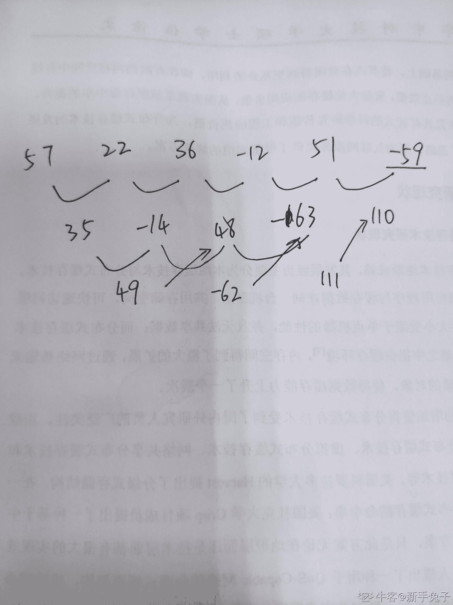

# 吉比特 2018 秋招数据分析岗位试卷 A 卷

## 1

以下哪款游戏属于手游？

正确答案: C   你的答案: 空 (错误)

```cpp
天涯明月刀
```

```cpp
质量效应：仙女座
```

```cpp
地狱边境
```

```cpp
绝地求生大逃杀
```

本题知识点

吉比特 Java 工程师 C++工程师 iOS 工程师 安卓工程师 运维工程师 前端工程师 算法工程师 PHP 工程师 数据分析师 吉比特 2018

讨论

[夜跑小精灵](https://www.nowcoder.com/profile/287714414)

为什么选地狱边境啊？绝地求生大逃杀不是吃鸡吗，吃鸡不是手游吗？

发表于 2019-08-19 10:28:45

* * *

[牛客 725398074 号](https://www.nowcoder.com/profile/725398074)

地狱边境 英文叫 limbo 我初中玩过，一款闯关冒险类手游

发表于 2021-05-24 01:05:14

* * *

## 2

以下哪个名词是 CSGO 游戏的种类？

正确答案: A   你的答案: 空 (错误)

```cpp
FPS
```

```cpp
MMORPG
```

```cpp
APPG
```

```cpp
MOBA
```

本题知识点

吉比特 Java 工程师 C++工程师 iOS 工程师 安卓工程师 运维工程师 前端工程师 算法工程师 PHP 工程师 数据分析师 吉比特 2018

讨论

[quarterQ4](https://www.nowcoder.com/profile/158224847)

FPS：第一人称 first 射击游戏，特征为游戏内主要使用**等弹道武器进行战斗，操控的角色一般只能看到手部（区别于 TPS 第三人称 third，可以看到自己操控角色的背影）MMORPG：多人在线角色扮演游戏，重点在多人，战斗形式上可以是回合制，也可以是即时动作 ARPG：动作角色扮演游戏，重点在角色的移动、攻击、技能释放等动作元素 actionMOBA：多人战术竞技游戏，也称 ARTS，既强调角色动作的操控也重视策略的选取，风格上一般为俯视角

发表于 2020-08-02 10:19:06

* * *

[夜跑小精灵](https://www.nowcoder.com/profile/287714414)

first_person shooting game 原来是传说中的 cs。。。

发表于 2019-08-19 10:30:23

* * *

## 3

一般通过下面哪一个指标来衡量用户的活跃值？

正确答案: C   你的答案: 空 (错误)

```cpp
ARPU
```

```cpp
ARPPU
```

```cpp
DAU
```

```cpp
LTV
```

本题知识点

吉比特 Java 工程师 C++工程师 iOS 工程师 安卓工程师 运维工程师 前端工程师 算法工程师 PHP 工程师 数据分析师 2018

讨论

[夏季 smile](https://www.nowcoder.com/profile/708691518)

DAU-Daily Active User 日活跃用户数量
ARPU-Average Revenue Per User 每用户平均收益 
ARPPU-Average Revenue per Paying User 每付费用户平均收益 
LTV-Life Time Value 生命周期总价值,意为客户终生价值

发表于 2019-07-26 09:09:59

* * *

## 4

哪两个选项是同一个公司发行的手游？
①、王者荣耀
②、纪念碑谷 2
③、阴阳师
④、纪念碑谷

正确答案: A   你的答案: 空 (错误)

```cpp
①②
```

```cpp
①③
```

```cpp
②③
```

```cpp
③④
```

本题知识点

吉比特 Java 工程师 C++工程师 iOS 工程师 安卓工程师 运维工程师 前端工程师 算法工程师 PHP 工程师 数据分析师 2018

讨论

[pang201904020024316](https://www.nowcoder.com/profile/177442711)

发行不等于开发

发表于 2019-09-02 21:14:17

* * *

[夜跑小精灵](https://www.nowcoder.com/profile/287714414)

不懂就问，王者荣耀是腾讯出的，阴阳师是网易，纪念碑谷和纪念碑谷是美国一个公司出的呀...

发表于 2019-08-19 10:33:54

* * *

## 5

免费回合制游戏《问道》的公测时间是？

正确答案: B   你的答案: 空 (错误)

```cpp
2001
```

```cpp
2004
```

```cpp
2005
```

```cpp
2007
```

本题知识点

吉比特 Java 工程师 C++工程师 iOS 工程师 安卓工程师 运维工程师 前端工程师 算法工程师 PHP 工程师 数据分析师 吉比特 2018

讨论

[零葬](https://www.nowcoder.com/profile/75718849)

这个应该是 2006 年吧

发表于 2020-12-24 11:30:05

* * *

[offer 在哪呢？](https://www.nowcoder.com/profile/393584532)

不是 2006 年嘛？

发表于 2019-09-04 16:42:46

* * *

## 6

随着居民自主意识的不断提高，各个国家的公共建设遇到公民抵制的事情越来越多，很多关系到国计民生的大项目无法顺利依时程进行，拖延了国家发展的步伐。可见（ ）。

正确答案: C   你的答案: 空 (错误)

```cpp
无政府主义开始抬头
```

```cpp
国家的权威普遍开始下降
```

```cpp
公共利益与个人利益并不总是一致的
```

```cpp
民主制度缺乏效率
```

本题知识点

吉比特 Java 工程师 C++工程师 iOS 工程师 安卓工程师 运维工程师 前端工程师 算法工程师 PHP 工程师 数据分析师 吉比特 2018

## 7

地理老师画了世界五大洲的图形，并给每个图形编了代号，然后请五个同学上来每人认出两个洲。
回答如下：甲：3 是欧洲，2 是美洲;乙：4 是亚 洲，2 是大洋洲;丙：1 是亚洲，5 是非洲;丁：4 是非洲，3 是大洋洲;戊：2 是欧洲，5 是美洲。地理老师说：“你们每人对了一半。”
请你根据以上条件推测 每个号码各代表哪个洲，下列正确的一项是( )。

正确答案: C   你的答案: 空 (错误)

```cpp
1 是亚洲，2 是欧洲
```

```cpp
2 是大洋洲，3 是非洲
```

```cpp
3 是欧洲，4 是非洲
```

```cpp
4 是美洲，5 是非洲
```

本题知识点

吉比特 Java 工程师 C++工程师 iOS 工程师 安卓工程师 运维工程师 前端工程师 算法工程师 PHP 工程师 数据分析师 2018

讨论

[123 没有 4](https://www.nowcoder.com/profile/3645029)

1.亚洲 2.大洋洲 3.欧洲 4.非洲 5.美洲

发表于 2018-09-03 16:40:43

* * *

[苏打烟花无糖粉](https://www.nowcoder.com/profile/241000055)

破题关键，知道甲说法中，3 是欧洲的说法是正确的之后就可以根据 每人的说法有一般都是正确且每个号码只能对应一个地方的原则 的原则，用排除法进行推理即可

发表于 2021-11-18 15:29:06

* * *

[鹿鸣松](https://www.nowcoder.com/profile/646250553)

画棵二叉树就出来了

发表于 2020-12-21 20:34:26

* * *

## 8

请根据下列数字的规律,推测括号中的数字应该是多少？0，6，24，60，120,( )

正确答案: B   你的答案: 空 (错误)

```cpp
186
```

```cpp
210
```

```cpp
220
```

```cpp
226
```

本题知识点

吉比特 Java 工程师 C++工程师 iOS 工程师 安卓工程师 运维工程师 前端工程师 算法工程师 PHP 工程师 数据分析师 吉比特 2018

讨论

[柠檬鸡腿](https://www.nowcoder.com/profile/677515298)

第一个是 0x1x2,第二个是 1x2x3,以此类推

发表于 2019-09-02 15:53:13

* * *

[FANLIN](https://www.nowcoder.com/profile/43129704)

做两次差

发表于 2018-08-31 16:14:42

* * *

[紫夜馨空 2012](https://www.nowcoder.com/profile/303388676)

应该是 B.210 
6*(6*6-1)=210
X=n*（n*n-1）
也就是 n 乘以 n 平方减 1

发表于 2018-08-20 13:18:14

* * *

## 9

请根据下列数字的规律,推测括号中的数字应该是多少？256，269，286，302，（ ）

正确答案: C   你的答案: 空 (错误)

```cpp
314
```

```cpp
328
```

```cpp
307
```

```cpp
316
```

本题知识点

吉比特 Java 工程师 C++工程师 iOS 工程师 安卓工程师 运维工程师 前端工程师 算法工程师 PHP 工程师 数据分析师 吉比特 2018

讨论

[紫夜馨空 2012](https://www.nowcoder.com/profile/303388676)

302+3+0+2=307

发表于 2018-08-20 13:19:47

* * *

[牛客 216611007 号](https://www.nowcoder.com/profile/216611007)


发表于 2021-09-29 21:04:39

* * *

## 10

请根据下列数字的规律,推测括号中的数字应该是多少？20/9，4/3，7/9，4/9，1/4，（ ）

正确答案: A   你的答案: 空 (错误)

```cpp
5/36
```

```cpp
1/6
```

```cpp
1/9
```

```cpp
1/144
```

本题知识点

吉比特 Java 工程师 C++工程师 iOS 工程师 安卓工程师 运维工程师 前端工程师 算法工程师 PHP 工程师 数据分析师 2018

讨论

[紫夜馨空 2012](https://www.nowcoder.com/profile/303388676)

相邻两数相除就会发现规律：

20/9 除以 4/3 =5/3= 10/6
4/3 除以 7/9 = 12/7
7/9 除以 4/9 =7/4= 14/8
4/9 除以 1/4 = 16/9
1/4 除以?= 18/10

规律是分子为：10,12,14,16,18 分母为：6,7,8,9,10

所以很容易看到下一个除数是 36/5.

因此下一个要填的数是 5/36

发表于 2018-08-20 13:31:35

* * *

[小橙汁](https://www.nowcoder.com/profile/158654105)

通分作差

发表于 2020-10-07 16:08:32

* * *

## 11

请根据下列数字的规律,推测括号中的数字应该是多少？57，22，36，-12，51，（ ）

正确答案: A   你的答案: 空 (错误)

```cpp
-59
```

```cpp
62
```

```cpp
-32
```

```cpp
43
```

本题知识点

吉比特 Java 工程师 C++工程师 iOS 工程师 安卓工程师 运维工程师 前端工程师 算法工程师 PHP 工程师 数据分析师 吉比特 2018

讨论

[紫夜馨空 2012](https://www.nowcoder.com/profile/303388676)

应该为-59 57-22+1=36 22-36+2=-12 36-（-12）+3=51 -12-51+4=-59

发表于 2018-08-20 13:41:45

* * *

[小白白小](https://www.nowcoder.com/profile/478814248)



发表于 2020-09-05 21:00:31

* * *

## 12

请问，连续的十年可能有多少天？（ ）

正确答案: B   你的答案: 空 (错误)

```cpp
3650、3651、3652、3653
```

```cpp
3651、3652、3653
```

```cpp
3651、3652
```

```cpp
3653、3652
```

本题知识点

吉比特 Java 工程师 C++工程师 iOS 工程师 安卓工程师 运维工程师 前端工程师 算法工程师 PHP 工程师 数据分析师 吉比特 2018

讨论

[古良生](https://www.nowcoder.com/profile/7030150)

闰年的条件是能被 4 整除不能被 100 整除或者能被 400 整除，不是每隔四年一个闰年。不能被 400 整除的年份比如 2100 年不是闰年，2096 是闰年，2104 年也是闰年，这种情况就是八年一个闰年

发表于 2018-09-03 16:35:04

* * *

[求 offer 的渣渣一枚](https://www.nowcoder.com/profile/995493306)

10 年有多少天，有三种情况：

3651 天（一个[闰年](https://www.baidu.com/s?wd=%E9%97%B0%E5%B9%B4&tn=SE_PcZhidaonwhc_ngpagmjz&rsv_dl=gh_pc_zhidao)），如从 1897 到 1906，因为 1900 不能被 400[整除](https://www.baidu.com/s?wd=%E6%95%B4%E9%99%A4&tn=SE_PcZhidaonwhc_ngpagmjz&rsv_dl=gh_pc_zhidao)，所以不是[闰年](https://www.baidu.com/s?wd=%E9%97%B0%E5%B9%B4&tn=SE_PcZhidaonwhc_ngpagmjz&rsv_dl=gh_pc_zhidao)，这十年只有一个[闰年](https://www.baidu.com/s?wd=%E9%97%B0%E5%B9%B4&tn=SE_PcZhidaonwhc_ngpagmjz&rsv_dl=gh_pc_zhidao)1904 年。

3652 天（两个闰年），如 1902 到 1911，其中 1904、1908 是闰年，故天数=8*365+2*366=3652 天。

3653 天（三个闰年），如 1904 到 1913，其中 1904、1908、1912 都有 366 天。

发表于 2019-09-05 13:49:28

* * *

[幸运之神 777](https://www.nowcoder.com/profile/518535102)

```cpp
if ((y % 4 == 0 and y % 100 != 0) or (y % 400 == 0 and y % 3200 != 0)):   print("閏年") else: print("平年")
```

编辑于 2019-08-30 17:30:58

* * *

## 13

1、某游戏，收入 4 月份比 3 月下降了 20%，请列出收入下降的分析思路。

你的答案

本题知识点

吉比特 Java 工程师 C++工程师 iOS 工程师 安卓工程师 运维工程师 前端工程师 算法工程师 PHP 工程师 数据分析师 2018

讨论

[GONEW33](https://www.nowcoder.com/profile/304779693)

**整体思路：首先排除 4 月份异常虚高。若无异常，运用结构化思维将现象拆分，再结合公式化，准确定位现象原因。再结合业务背景，发现本质原因。****-.将最近半年的月收入做成折线图，观察 3 月份是否在平滑折线内，若较其他月份突增，则暂定将原因定位于 3 月份收入虚高。**   -分析 3 月份虚高原因因为（类似于对 4 月分析，我只做简要陈述）：       -从用户的角度：是否打通了某些渠道，使得新增用户激增       -从用户消费金额的角度：游戏内是否做了某些活动，吸引玩家消费       -.....   -分析 4 月份为什么不能延续 3 月份的势头       -渠道投入成本过高，暂停投入       -月份活动过多，提前释放玩家消费热情       - ......**-若 3 月无异常虚高，则 4 月份收入确实偏低**   -内部原因       -付费玩家数较少（=当月活跃玩家*付费玩家率）            -活跃玩家减少                 -新增活跃用户减少                     考虑该有的曝光率是否不够、渠道投入是有过低、曝光转化率是否不佳                -流失老用户增多
                     考虑是否玩家粘性过低，是否游戏体验难以满足玩家            -付费玩家率降低
                考虑消费引导机制不合理，消费回报过低
       -人均消费金额降低（=平均单次消费金额*消费次数）            -平均单次消费金额降低
                考虑付费内容定价过低，高价内容吸引力不足            -消费次数降低
                考虑是否很久没有推出新装备等消费内容，付费玩家们消费欲望降低   -外部原因       -市场竞争激烈            -同质化严重新进入该游戏类型的公司越来越多，共同瓜分玩家 -同类游戏中某一款爆发 某公司花重金宣传，赔本做活动，引起广泛关注，玩家被吸引 -有同类游戏中出现创新机制                 未能紧跟游戏潮流，机制老旧       -国家政策对游戏产业的调整
-牌照 - 

发表于 2019-09-02 23:38:38

* * *

[欧佛 come](https://www.nowcoder.com/profile/184888517)

--参考各位大神--本质--对比指标--细因

分析：收入下降的本质原因可能有这些，用户数减少、平均用户付费额减少

思路一：从用户数入手：（可细分用户再进行分析，对比不同类用户的变化）

内部：

*   从竞争对手入手进行分析，是不是竞争对手推出了类似产品导致的用户流失；（kpi=下载数等）
*   从国家政策和社会情况入手，例如国家出台相关防止青少年沉迷游戏的规避机制等导致用户数减少。（kpi=根据***政策调整的前后对比，对比年龄比率的变化，对应年龄段人数变化）
*   从政策、经济、社会、技术四个维度入手：即 PEST 分析，分析与用户数减少是否有关。
*   ......

外部：

*   与往年数据进行对比分析，看看是不是周期性的数据下降，是否存在某些因素，导致周期性的常规下降。若是季节性，可能是如假期结束等的原因（kpi=对比年龄比率的变化，对应年龄段人数变化）

*   游戏体验度：用户减少可能是游戏的持久吸引力不够，吸引力下降导致的（kpi=对比前后用户上线时长，每日活跃度等）
*   ......

思路二：从平均用户付费额入手：（可细分用户再进行分析，对比不同类用户的变化）

*   推广分析：3 月是否有推广活动，导致上述指标有了变化。若因为活动导致 3 月消费变高，可进一步分析每个渠道在 4 月消费下降比例，若一些渠道下降非常低，则可以说明在该渠道举办活动，能提高用户消费留存

*   按产品入手，锁定下降原因。分析每种消费项目的当月金额，同比下降值。看同比，确认每个消费下降程度。然后再锁定下降产品项目，查看付费用户数，付费金额指标，具体分析。

*   ......

发表于 2019-08-22 21:11:00

* * *

[夏季 smile](https://www.nowcoder.com/profile/708691518)

[`www.nowcoder.com/questionTerminal/553726e56eb04564b3665f0cfb4b401f?orderByHotValue=1&page=1&onlyReference=false`](https://www.nowcoder.com/questionTerminal/553726e56eb04564b3665f0cfb4b401f?orderByHotValue=1&page=1&onlyReference=false)类似的题目,可参考主要从以下几个方面:1\. 同比分析,对比今年 4 月和去年 4 月的收入 2.PEST 分析：政策、经济、社会、技术四个维度 3.竞争对手分析：主要竞争对手收入变化情况，游戏新况，热度等 4.推广分析：3 月是否有推广活动，导致上述指标有了变化。若因为活动导致 3 月消费变高，可进一步分析每个渠道在 4 月消费下降比例，若一些渠道下降非常低，则可以说明在该渠道举办活动，能提高用户消费留存

发表于 2019-07-26 09:27:30

* * *

## 14

2、请简述 K-means 算法原理、过程及其在游戏数据分析中的应用。

你的答案

本题知识点

吉比特 Java 工程师 C++工程师 iOS 工程师 安卓工程师 运维工程师 前端工程师 算法工程师 PHP 工程师 数据分析师 2018

讨论

[offer 在哪呢？](https://www.nowcoder.com/profile/393584532)

1\. 算法原理：k-means 算法是一种无监督聚类算法，即其思想是将样本全部分成 K 类，使得类间样本的距离足够大，而使得类内的样本距离足够小。2\. 过程：(1). 首先随机选取样本中的 K 个点作为聚类中心；
(2). 分别算出样本中其他样本距离这 K 个聚类中心的距离，并把这些样本分类为距离自己最近的那个聚类中心的那个类别；
(3). 对上述分类完的样本再进行每个的类别求平均，求解出新的聚类中心；
(4). 最后进行不断重复（2）（3）步骤，直到所有样本类别不再发生变化为止。
3\. 在游戏数据分析中的应用可以使用 K-means 算法，根据用户在游戏中的各个属性特征。聚类成多种类别，从而实现对用户的分层，比如说可以根据用户的在线时间分为忠诚客户和一般用户、游客用户等，针对不同的用户群可以采用不同的营销管理策略。比如忠诚客户，是我们的重要群体，可以采用适量的奖励，积分、等级等优惠活动维持好并进一步吸引他们转为付费用户，一般忠诚客户的付费转化是高的，需要适当的引导策略。而针对游客用户，可以使用一些新手礼包、注册奖励等活动吸引注册并不断引导消费，对其进行用户画像分析，分析消费心理，对其进行一定鼓励政策。

编辑于 2019-09-05 17:22:30

* * *

[拿不到 offer 不配做易烊千玺的老婆](https://www.nowcoder.com/profile/924334170)

K-Means 算法原理：K-means 算法的基本思想是：对于给定样本数据集，将样本数据集分成 K 类，使类间样本点的距离尽可能地大，类内样本点的距离尽可能地小；实现过程：1.确定分类数 K，随机初始化 K 个质心；2.计算所有样本点到 K 个质心的距离，并将其分配到离他最近的质心所在的类中；3.计算类的均值，将类均值作为新的质心；4.重复 2、3 步，直到质心不再发生变化或达到迭代终止条件。在数据分析中的作用：可以对用户进行 K-means 聚类：将用户按活跃状态划分为活跃用户、高危用户和流失用户；或者按照用户等级等将用户划分为高级用户、中级用户和低级用户。聚类之后可以按照用户的不同类别给用户推送不同的内容。

发表于 2019-08-21 09:48:20

* * *

[Tryingtimeswillpass](https://www.nowcoder.com/profile/1747696)

kmeans 是一种无监督学习的算法，是聚类算法中最简单的一种。不同与一些分类的监督学习算法、比如逻辑回归、SVM、随机森林等，

1、 随机选取 k 个聚类质心点（cluster centroids）为。

2、 重复下面过程直到收敛 {

               对于每一个样例 i，计算其应该属于的类

               

               对于每一个类 j，重新计算该类的质心

               

编辑于 2018-07-09 20:33:55

* * *

## 15

1．根据以下表格，请填写求各地区充值总金额(美元)的 excel 函数。


你的答案

本题知识点

吉比特 Java 工程师 C++工程师 iOS 工程师 安卓工程师 运维工程师 前端工程师 算法工程师 PHP 工程师 数据分析师 2018

讨论

[(≧ω≦)/](https://www.nowcoder.com/profile/263557908)

=SUMPRODUCT(D2:D14,E2:E14)

发表于 2018-10-12 19:21:42

* * *

[(≧∇≦)三玖](https://www.nowcoder.com/profile/989361716)

=sumproduct(D6:D14,E6:E14)

发表于 2019-09-06 20:06:28

* * *

[jjjjutu](https://www.nowcoder.com/profile/228649303)

因为币种不一致所以要先乘以汇率

发表于 2019-08-19 14:59:11

* * *

## 16

2．根据以下已知表格，求各物品的购买数量，请书写 excel 步骤，及其相关函数：

 

你的答案

本题知识点

吉比特 Java 工程师 C++工程师 iOS 工程师 安卓工程师 运维工程师 前端工程师 算法工程师 PHP 工程师 数据分析师 2018

讨论

[北落狮门宇](https://www.nowcoder.com/profile/994498319)

第一步，先根据商品名称来匹配物品 ID，函数是：INDEX(G22:G29,MATCH(B39:B42,H22:H29,0))第二部，将性别的男女，替换为 male 和 female，函数为:IF(C39="女","female","male")
第三部，根据前两部得来的条件，对物品表进行多条件求和操作，函数为：=SUMIFS($D$22:$D$34,$B$22:$B$34,E39,$C$22:$C$34,F39)
如此即可得到结果。

发表于 2019-03-09 20:05:02

* * *

[Dame、CX](https://www.nowcoder.com/profile/255407225)

在 D39 单元格输入以下函数,然后下拉即可=SUMIFS($D$22:$D$34,$B$22:$B$34,INDEX($G$22:$G$29,MATCH(B39,$G$22:$H$29)),$C$22:$C$34,IF(C39="女","female","male"))

发表于 2021-07-26 21:11:17

* * *

[牛客 418159978 号](https://www.nowcoder.com/profile/418159978)

1\. 在表二后面添加购买数量列 2\. 根据物品 ID 对表一和表做升序排列，利用 Vlookup 函数从表 1 中查找对应物品 ID 的购买数量数据 3.再次利用 Vlookup 函数，根据物品名称，找出求购买数量表中对应的购买数量，并填充到 D 列

发表于 2021-04-26 20:06:36

* * *

## 17

从所给四个选项中，选择最合适的一个填入问号处。使之呈现一定规律性：( )。


正确答案: B   你的答案: 空 (错误)

本题知识点

吉比特 Java 工程师 C++工程师 iOS 工程师 安卓工程师 运维工程师 前端工程师 算法工程师 PHP 工程师 数据分析师 吉比特 2018

讨论

[祫衣](https://www.nowcoder.com/profile/42106114)

第一个图里面挖掉第二个图得到第三个图；第四个图里面挖掉第五个图得到 B

发表于 2019-08-10 23:35:00

* * *

[零葬](https://www.nowcoder.com/profile/75718849)

2 和 3 可以拼成 1，所以 5 和 6 应该拼成 4

发表于 2020-12-24 11:29:22

* * *

## 18

一正方体如下图所示切掉了上半部分的四分之三。现在从任意面剖开，下面哪一项不可能是该多面体的截面?(    )
 

正确答案: C   你的答案: 空 (错误)

本题知识点

吉比特 Java 工程师 C++工程师 iOS 工程师 安卓工程师 运维工程师 前端工程师 算法工程师 PHP 工程师 数据分析师 吉比特 2018

讨论

[JasonArchur](https://www.nowcoder.com/profile/223450832)


发表于 2020-05-23 16:26:54

* * *

## 19

把下面的六个图形分为两类，使每一类图形都有各自的共同特征或规律，分类正确的一项是：( ) 

正确答案: B   你的答案: 空 (错误)

```cpp
①②⑥，③④⑤
```

```cpp
①④⑤，②③⑥
```

```cpp
①②⑤，③④⑥
```

```cpp
①②③，④⑤⑥
```

本题知识点

吉比特 Java 工程师 C++工程师 iOS 工程师 安卓工程师 运维工程师 前端工程师 算法工程师 PHP 工程师 数据分析师 吉比特 2018

讨论

[趁年轻可以再拼](https://www.nowcoder.com/profile/602381932)

1,4,5 是封闭图形

发表于 2019-07-27 09:22:18

* * *

[江嘉伟](https://www.nowcoder.com/profile/938759264)

1、4、5 至少有两条对称轴

发表于 2019-03-21 21:25:24

* * *

[牛客 31748600 号](https://www.nowcoder.com/profile/31748600)

1、2、5 对称   3、4、6 画三笔才能画完。。。

发表于 2021-02-26 17:07:17

* * *

## 20


你的答案

本题知识点

吉比特 Java 工程师 C++工程师 iOS 工程师 安卓工程师 运维工程师 前端工程师 算法工程师 PHP 工程师 数据分析师 2018

讨论

[Madison7](https://www.nowcoder.com/profile/209010420)

a: select count(distinct tableB.user_id),sum( tableB.money) from tableB left join table A on tableB.userid=tableA.userid and year(tableA.date)>=2017b:select tableA.date, count(distinct tableA.userid) from tableB left join table A on tableB.userid=tableA.userid and datepart(yy,tableB.date)='2016' and datepart(mm,tableB.date)='12'  group by tableA.date

编辑于 2019-08-02 10:54:06

* * *

[大王叫我来巡山哟~](https://www.nowcoder.com/profile/460073992)

--1select count(distinct B.userid),sum(B.money)from Bleft join A on A.userid=B.useridwhere A.date>=2017--2SELECT  A.DATE,COUNT(DISTINCT B.USERID)FROM B LEFT JOIN A ON B.USERID=A.USERIDWHERE DATE_FORMAT(B.DATE,'%Y-%C')='2016-12'GROUP BY 1

发表于 2019-08-17 17:11:06

* * *

[1ffer](https://www.nowcoder.com/profile/934684940)

A.SELECT COUNT(userid), SUM(user_money)
   FROM （
                 SELECT B.userid, SUM(B.money) as user_money
                 FROM B LEFT JOIN A ON A.userid = B.useid
                 GROUP BY B.userid
                 HAVING YEAR(A.date)>2016）as C

B.每个玩家注册日期：
   SELECT B.userid，A.date
   FROM B LEFT JOIN A ON A.userid = B.useid
   GROUP BY B.userid
   HAVING A.date between '2017-12-01 00:00:00' and '2017-12-31 23:59:59'
   总人数:
   SELECT COUNT(B.userid)
   FROM B LEFT JOIN A ON A.userid = B.useid
   GROUP BY B.userid
   HAVING A.date between '2017-12-01 00:00:00' and '2017-12-31 23:59:59'

发表于 2018-09-01 23:54:00

* * *