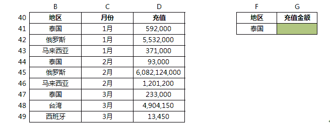

# 吉比特 2018 秋招数据分析岗位试卷 B 卷

## 1

名字固然只是一个符号，姓氏也只是一个符号。姓氏虽然不一定需要废弃(自然愿意的人也尽可以废弃)，仍然可以作为一种传统习惯加以保留，但是宗法社会对于姓氏的那种唯心主义的错误观念，却必须被彻底戳穿，这意味着（ ）。

正确答案: B   你的答案: 空 (错误)

```cpp
名字和姓氏是没有意义的
```

```cpp
姓名是代表一个人的符号
```

```cpp
儿子应该跟父亲姓
```

```cpp
名字取得好坏会影响一个人的命运
```

本题知识点

吉比特 Java 工程师 C++工程师 iOS 工程师 安卓工程师 运维工程师 前端工程师 算法工程师 PHP 工程师 数据分析师 吉比特 2018

## 2

对于穿鞋来说，正合脚的鞋子比过大的鞋子好。不过，在寒冷的天气，尺寸稍大点的毛衣与一件正合身的毛衣差别并不大。这意味着（ ）。

正确答案: C   你的答案: 空 (错误)

```cpp
不合脚的鞋不能在冷天穿
```

```cpp
毛衣的大小只不过是式样问题，与其功能无关
```

```cpp
不合身的衣服有时仍然有穿用价值
```

```cpp
在买礼物的时候，尺寸不如用途那样重要
```

本题知识点

吉比特 Java 工程师 C++工程师 iOS 工程师 安卓工程师 运维工程师 前端工程师 算法工程师 PHP 工程师 数据分析师 2018

## 3

请根据下列数字的规律,推测括号中的数字应该是多少？0，6，78，（ ），15620

正确答案: C   你的答案: 空 (错误)

```cpp
240
```

```cpp
252
```

```cpp
1020
```

```cpp
7771
```

本题知识点

吉比特 Java 工程师 C++工程师 iOS 工程师 安卓工程师 运维工程师 前端工程师 算法工程师 PHP 工程师 数据分析师 吉比特 2018

讨论

[紫夜馨空 2012](https://www.nowcoder.com/profile/303388676)

```cpp
0=1²-1
6=2³-2
78=3⁴-3
?=4⁵-4
15620=5⁶-5    
答案是 1020 选 C
```

发表于 2018-08-20 14:42:57

* * *

## 4

请根据下列数字的规律,推测括号中的数字应该是多少？5/7，5/8，5/9，8/11，7/11，（ ）

正确答案: A   你的答案: 空 (错误)

```cpp
11/14
```

```cpp
11/13
```

```cpp
15/17
```

```cpp
11/12
```

本题知识点

吉比特 Java 工程师 C++工程师 iOS 工程师 安卓工程师 运维工程师 前端工程师 算法工程师 PHP 工程师 数据分析师 2018

讨论

[小揪揪](https://www.nowcoder.com/profile/559187488)

题目有误，第一个是 3/7 奇数项分母：7 9 11，间隔 2 奇数项分子：3 5 7，间隔 2 偶数项分母：8 11，间隔 3 偶数项分子：5 8，间隔 3 括号处的是偶数项，分母 14，分子 11，选 A

发表于 2018-09-19 21:19:10

* * *

[1ffer](https://www.nowcoder.com/profile/934684940)

 题目错了，第一个是 3/7

发表于 2018-09-01 20:00:22

* * *

## 5

请根据下列数字的规律,推测括号中的数字应该是多少？1，2，1，6，9，10，（ ）

正确答案: D   你的答案: 空 (错误)

```cpp
13
```

```cpp
12
```

```cpp
19
```

```cpp
17
```

本题知识点

吉比特 Java 工程师 C++工程师 iOS 工程师 安卓工程师 运维工程师 前端工程师 算法工程师 PHP 工程师 数据分析师 2018

讨论

[阿蔡蔡](https://www.nowcoder.com/profile/8754302)

1+2+1=4 2+1+6=9 1+6+9=16 6+9+10=25 9+10+?=36

发表于 2018-08-24 22:39:21

* * *

[2htttttttttt](https://www.nowcoder.com/profile/704487070)

偶数项 2，6，10 偶数项后一项 2*2-3，2*6-3，2*10-3

发表于 2021-09-03 14:30:06

* * *

[牛客 321705178 号](https://www.nowcoder.com/profile/321705178)

第一个减第二个依次相减得到数列 1,-1,5,3,1 将得到的数列第二次依次相减得到数列-2,6,8,-2 第二次相减的数列存在周期性-2,6,8 所以得出第二次相减的最后一个数为 6 带入第一次相减的数列得到最后一个数为 7 得出括号中为 17

发表于 2020-08-26 10:27:15

* * *

## 6

请根据下列数字的规律,推测括号中的数字应该是多少？1，2，2，6，3，15，3，21，4，（ ）

正确答案: D   你的答案: 空 (错误)

```cpp
46
```

```cpp
20
```

```cpp
12
```

```cpp
44
```

本题知识点

吉比特 Java 工程师 C++工程师 iOS 工程师 安卓工程师 运维工程师 前端工程师 算法工程师 PHP 工程师 数据分析师 2018

讨论

[阿蔡蔡](https://www.nowcoder.com/profile/8754302)

1*2=2
2*3=63*5=153*7=21
4*11 =442 3 5 7 11 为连续质数 

发表于 2018-08-24 22:28:26

* * *

## 7

请根据下列数字的规律,推测括号中的数字应该是多少？2，5，20，12，-8，（ ），10

正确答案: A   你的答案: 空 (错误)

```cpp
7
```

```cpp
8
```

```cpp
12
```

```cpp
-8
```

本题知识点

吉比特 Java 工程师 C++工程师 iOS 工程师 安卓工程师 运维工程师 前端工程师 算法工程师 PHP 工程师 数据分析师 2018

讨论

[夜跑小精灵](https://www.nowcoder.com/profile/287714414)


发表于 2019-08-19 18:40:12

* * *

[啥时候能有 offer](https://www.nowcoder.com/profile/703156428)

2 + 10 = 125 + ? = 1220 + (-8) = 12

发表于 2019-08-13 10:52:14

* * *

[红豆豆~](https://www.nowcoder.com/profile/6634584)

奇数项：2，20，-8，1020 +（-8）= 10 + 2 偶数项：5，12，？若 5+12=？，则？=17 若 5+？=12，则？=7（选项 A）若？+12=5，则 ？=-7

发表于 2018-09-01 17:32:49

* * *

## 8

从所给的四个选项中，选择最合适的一个填入问号处，使之呈现一定的规律性（ ）


正确答案: D   你的答案: 空 (错误)

本题知识点

吉比特 Java 工程师 C++工程师 iOS 工程师 安卓工程师 运维工程师 前端工程师 算法工程师 PHP 工程师 数据分析师 吉比特 2018

讨论

[dbsdxq](https://www.nowcoder.com/profile/869068433)

图案内部只有四根线条

发表于 2019-09-05 18:05:34

* * *

## 9

从所给的四个选项中，选择最合适的一个填入问号处，使之呈现一定的规律性（ ）


正确答案: D   你的答案: 空 (错误)

本题知识点

吉比特 Java 工程师 C++工程师 iOS 工程师 安卓工程师 运维工程师 前端工程师 算法工程师 PHP 工程师 数据分析师 吉比特 2018

讨论

[offer 在哪呢？](https://www.nowcoder.com/profile/393584532)

横向看，从第一个图到到第二个图的变化：小的图形总体以逆时针走 45 度， 但是以左上顶点固定顺时针旋转 45 度                                                                     大的图形逆时针旋转 45 度

发表于 2019-09-05 17:11:12

* * *

## 10

从所给的四个选项中，选择最合适的一个填入问号处，使之呈现一定的规律性（  ）


正确答案: A   你的答案: 空 (错误)

本题知识点

吉比特 Java 工程师 C++工程师 iOS 工程师 安卓工程师 运维工程师 前端工程师 算法工程师 PHP 工程师 数据分析师 吉比特 2018

讨论

[offer 在哪呢？](https://www.nowcoder.com/profile/393584532)

1\. 横向看，每行的第一个图三个黑色、第二个图 4 个黑色、第三个图 5 个黑色。排除 C 选项 2\. 横向看，每行的 周边的三角形顶点朝向是间隔的。如第二行 外内外     第三行: 内外内     所有第一行肯定是   内外内  排除 BD3\. 横向看 。每行中间的图形 都是 圆形、五边形、正方形。所有 第一行缺 五边形  即 A 满足三个条件 

发表于 2019-09-05 17:20:02

* * *

## 11

某游戏，4 月份登陆人数较比 3 月上升了 10%，请列出登陆人数上升的分析思路。

你的答案

本题知识点

吉比特 Java 工程师 C++工程师 iOS 工程师 安卓工程师 运维工程师 前端工程师 算法工程师 PHP 工程师 数据分析师 2018

讨论

[.201902272200286](https://www.nowcoder.com/profile/883414492)

1、先确定这个月是否上线了什么新功能，以及优惠活动。、2、将用户分为稳定用户和不稳定用户，稳定用户可定义为每天都会登陆游戏的人，不稳定用户定义为一个月内登录次数少于 2 次的用户。其中新用户也视为不稳定用户。3、着重分析不稳定用户的登陆行为，即上个月的不稳定用户这个月转化为稳定用户。4、如果是新功能的增加，看不稳定用户的平均在线时长有没有显著增加。这可以定义为新功能有没有吸引新的用户。5、如果是优惠活动，看不稳定用户的平均在线时长有没有显著增加。这可以定义增加的登陆人数是否是有效召回。6、如果既没有新功能以及优惠活动，从登陆渠道进行分析。哪部分的转化比上个月显著增加。

发表于 2019-08-12 15:22:43

* * *

[小风 20181009192096](https://www.nowcoder.com/profile/575055374)

若数据无误，则：登陆人数上升可分为两类，第一类是新用户注册，可能采取的措施包括渠道推广、新号冲级活动、第二类是老用户回流，可能采取的措施包括版本更新、召回系统（push 召回和短信召回等）、回归有礼活动、

发表于 2019-08-28 14:52:33

* * *

[苏打烟花无糖粉](https://www.nowcoder.com/profile/241000055)


发表于 2021-11-19 12:40:18

* * *

## 12

请从数据分析的角度阐述如何对玩家进行分类。

你的答案

本题知识点

吉比特 Java 工程师 C++工程师 iOS 工程师 安卓工程师 运维工程师 前端工程师 算法工程师 PHP 工程师 数据分析师 2018

讨论

[~~Smile](https://www.nowcoder.com/profile/3486232)

可以从以下几个方面进行对玩家进行分类：
       1． 玩家群体定量分类，从玩家数据中了解玩家结构，玩家结构包括玩家性别结构，玩家年龄结构，玩家收入结构，玩家使用的设备结构（IOS/android，设备品牌，设备硬件情况等）。这是采用定量的方法进行分类。

2． 玩家喜好&行为分析，从玩家数据中获得玩家结构与玩家喜好&行为间的关系，从产品的定位出发为产品寻找目标用户，找出与相关竞品间的差异，从而为市场细分及市场定位提供建议。

3． 核心玩家画像分析，第一步对后台数据进行提取，通过数据了解到玩家情况一些关键指标。在对玩家情况有一些初步把握后，获取玩家关键指标，进行数据清洗后，通过聚类分析对玩家进行分群。第二步，对各个群或者各个类型的玩家进行定性访谈，挖掘玩家生活情境与体验场景。围绕各类玩家的行为特征，了解玩家的核心需求情况，发现各类玩家的潜在机会，细化颗粒度（细化到每类玩家每一具体的体验情景），形成核心玩家画像。

发表于 2018-09-08 23:42:20

* * *

[风海洋](https://www.nowcoder.com/profile/784097590)

在进行玩家分类前，可以为每个玩家制作用户画像，根据每个人的特性划分将变得更加精准，可以从以下几个方面进行分类：1、根据用户的登录频率可将用户分为长期用户、中期用户、短期用户（当天注册完后三日内未登录过游戏），划分指标为用户留存率 2、根据用户的每日、每三天或者每周的平均在线时长可将玩家分为活跃用户、半活跃用户、潜水用户；具体划分标准可以分别设置为每日在线时长大于 4 小时，每日在线时长大于 1 小于 4 小时，每日在线时长小于 1 个小时 3、根据用户的充值情况可将用户分为人民币玩家、半人民币玩家和散户（基本不充值），划分指标是每周充值次数以及该周内最大的一笔充值数目实现上述具体的指标划分可以利用分类算法中的基于距离的 k-近邻(K-NN)算法和决策树分类方法中的 C4.5 算法

发表于 2020-09-25 17:43:00

* * *

[李晓宇 007](https://www.nowcoder.com/profile/832569897)

选取用户基本属性、行为表现相关特征使用聚类算法对用户进行分群：用户基本属性：年龄、性别、地域。。。行为表现特征：付费金额、付费次数、登录次数、登录时长、登录时间间隔标准差、登录天数。。。根据分群结果提炼簇特征，以支撑运营。

发表于 2020-12-16 09:43:06

* * *

## 13

请问在目前大多数的市场报告中，用来形容“用户终身价值”的术语是？（ ）

正确答案: B   你的答案: 空 (错误)

```cpp
ARPPU
```

```cpp
LTV
```

```cpp
PCU
```

```cpp
ARPU
```

本题知识点

吉比特 Java 工程师 C++工程师 iOS 工程师 安卓工程师 运维工程师 前端工程师 算法工程师 PHP 工程师 数据分析师 吉比特 2018

讨论

[禅音当妖七](https://www.nowcoder.com/profile/6424879)

用户终身价值全称 life time value, LTV

发表于 2018-07-18 15:11:10

* * *

## 14

以下哪个作品不是源于游戏 IP 的？( )

正确答案: A   你的答案: 空 (错误)

```cpp
Love Live！
```

```cpp
精灵宝可梦
```

```cpp
生化危机
```

```cpp
舰队 collection
```

本题知识点

吉比特 Java 工程师 C++工程师 iOS 工程师 安卓工程师 运维工程师 前端工程师 算法工程师 PHP 工程师 数据分析师 2018

讨论

[夜跑小精灵](https://www.nowcoder.com/profile/287714414)

精灵宝可梦是任天堂的吗？生化危机系列电影改编自 capcom 的游戏生化危机，舰队也是游戏 ip。love live 是少女漫画。

发表于 2019-08-19 18:52:26

* * *

[quarterQ4](https://www.nowcoder.com/profile/158224847)

Love Live！是一个偶像企划，包括女团、漫画、动画、游戏等等周边形式

发表于 2020-08-02 11:42:27

* * *

## 15

对于一款 MMORPG 游戏，以下哪个系统与增强玩家交互无关？( )

正确答案: D   你的答案: 空 (错误)

```cpp
公会系统
```

```cpp
交易系统
```

```cpp
组队系统
```

```cpp
职业系统
```

本题知识点

吉比特 Java 工程师 C++工程师 iOS 工程师 安卓工程师 运维工程师 前端工程师 算法工程师 PHP 工程师 数据分析师 吉比特 2018

讨论

[quarterQ4](https://www.nowcoder.com/profile/158224847)

个人理解中，职业系统也是能够增强玩家交互的，但是没有其他三个选项那么直接。1.划分职业导致装备通用性下降，从而促进了装备在玩家间的流通；功能性副职如制药、冶炼、锻造等同理 2.副本攻打中，玩家需要平衡职业分类进行组队，提高了陌生人之间的组队难度，迫使玩家进行更多沟通

发表于 2020-08-26 09:42:47

* * *

## 16

以下哪种措施不能有效改善 MOBA 对战网游游戏内挂机玩家严重的情况？( )

正确答案: C   你的答案: 空 (错误)

```cpp
没收挂机者对战奖励
```

```cpp
增加举报系统
```

```cpp
挂机玩家不计算战绩
```

```cpp
对挂机玩家禁赛
```

本题知识点

吉比特 Java 工程师 C++工程师 iOS 工程师 安卓工程师 运维工程师 前端工程师 算法工程师 PHP 工程师 数据分析师 2018

讨论

[offer 在哪呢？](https://www.nowcoder.com/profile/393584532)

只有 C 选项没有对挂机者进行有效惩罚，并不能减少挂机者的数量。因为挂机反正也不影响自己之前的段位，即使输了，也没关系。

编辑于 2019-09-05 19:27:04

* * *

[夜跑小精灵](https://www.nowcoder.com/profile/287714414)

为啥选 C 呀，不懂哎

发表于 2019-08-24 18:15:41

* * *

## 17

以下不属于游戏公司名称的是？( )

正确答案: D   你的答案: 空 (错误)

```cpp
capcom
```

```cpp
nintendo
```

```cpp
blizzard
```

```cpp
spaceX
```

本题知识点

吉比特 Java 工程师 C++工程师 iOS 工程师 安卓工程师 运维工程师 前端工程师 算法工程师 PHP 工程师 数据分析师 吉比特 2018

讨论

[夜跑小精灵](https://www.nowcoder.com/profile/287714414)

```cpp
capcom：卡普空，日本电视游戏软件公司；

```

```cpp
nintendo：传说中的任天堂；

```

```cpp
blizzard：暴风雪游戏公司

```

```cpp
spaceX：美国太空探索技术公司

```

发表于 2019-08-19 18:57:12

* * *

## 18


你的答案

本题知识点

吉比特 Java 工程师 C++工程师 iOS 工程师 安卓工程师 运维工程师 前端工程师 算法工程师 PHP 工程师 数据分析师 2018

讨论

[Kevin201907151131712](https://www.nowcoder.com/profile/67171822)

**selectn sum(b.amt) as total, count(distinct b.userid) as numfrom(select date as regtime, useridfrom tableAwhere date >= '20161201'and date <= '20161230') aleft join(select  userid, sum(money) as amt,from tableBgroup by userid) b on a.userid = b.useridselectdate,count(distinct case when money > 0 and money < 500 then userid end) as "(0,500) fufeirenshu",sum(case when money > 0 and money < 500 then money end) as "fufei1",count(distinct case when money >= 500 and money < 5000 then userid end) as "[500,5000)fufeirenshu",sum(case when money >= 500 and money < 5000 then money end) as "fufei2",count(distinct case when money >= 5000 then userid end) as "[5000,oo)fufeirenshu",sum(case when money >= 5000 then money end) as "fufei3"from tableBwhere date >= '20160101'group by dateorder by date**

编辑于 2019-08-06 11:31:16

* * *

[MM_Einstrin](https://www.nowcoder.com/profile/8099518)

1\.select  sum(tableB.money)as 付费金额, count(tableB.userid) as 付费人数
from tableA inner join tableB
on tableA.userid=tableB.userid
and tableA.date between '2016-12-1' and '2016-12-31'
and DATEDIFF(dd,tableB.date,tableA.date)<=30
and tableB.money is not null

发表于 2018-08-16 09:31:55

* * *

[比奇堡大厨丶](https://www.nowcoder.com/profile/524772576)

A. select count(distinct a.userid) as user_num, sum(money) as fee from tableA a join tableB b  on a.userid = b.userid  where a.date between '2016-12-01'and '2016-12-31'  and b.date between a.date and date_add(a.date,interval 30day)  B. select (case when fee<500 then '0~500' when fee<5000 then '500~5000' else '5000~' end) as group, count(distinc userid) as user_num, sum(fee) as total_fee  from(select userid,sum(money) as fee  from table B where date >='2016-01-01'  group by userid  )M  group by (case when fee<500 then '0~500' when fee<5000 then '500~5000' else '5000~' end) 

编辑于 2019-08-15 14:28:10

* * *

## 19

             请根据以下表格，求泰国地区的累计充值金额，请填写 excel 函数。
 

你的答案

本题知识点

吉比特 Java 工程师 C++工程师 iOS 工程师 安卓工程师 运维工程师 前端工程师 算法工程师 PHP 工程师 数据分析师 2018

讨论

[红豆豆~](https://www.nowcoder.com/profile/6634584)

=sumif（B41:B49，'泰国'，D41:D49）

发表于 2018-09-01 17:16:18

* * *

[(≧∇≦)三玖](https://www.nowcoder.com/profile/989361716)

```cpp
=sumif($B$41:$B$49，'泰国'，$D$41:$D$49)
```

发表于 2019-09-06 10:10:18

* * *

## 20

            

你的答案

本题知识点

吉比特 Java 工程师 C++工程师 iOS 工程师 安卓工程师 运维工程师 前端工程师 算法工程师 PHP 工程师 数据分析师 2018

讨论

[红豆豆~](https://www.nowcoder.com/profile/6634584)

第一步：在已知表 1 中，最后插入一列 E 列 物品名称，根据已知表 2，在 E65 中填写函数=vlookup（C65，已知表 2！$G：$H，2,0），下拉填充柄填充函数。第二步：在结果表中 D84 填入函数=sumifs（$D$65：$D$77，$B$65：$B$77，B84，$E$65：$E$77，C84），下拉填充柄填充函数。

发表于 2018-09-01 17:15:59

* * *

[比奇堡大厨丶](https://www.nowcoder.com/profile/524772576)

1、表 1 增加 1 列，E65=vlookup(C65,$G$65:$H$72,2,0)，然后向下填充 2、D84=SUMIFS($D$65:$D$77,$B$65:$B$77,B84,$E$65:$E$77,C84)3、向下填充

编辑于 2019-07-27 21:14:33

* * *

[Dame、CX](https://www.nowcoder.com/profile/255407225)

=SUMIFS($D$65:$D$77,$B$65:$B$77,B84,C65:C77,INDEX(G65:G72,MATCH(C84,H65:H72,0))在 D84 单元格填上以上公式,然后下拉即可

发表于 2021-07-27 14:09:44

* * *