# 吉比特 2018 届秋招技术类试卷 A 卷

## 1

有一个苹果，两个人抛硬币来决定谁吃这个苹果，先抛到正面者吃。请问先抛者吃到苹果的概率为 _____________。

正确答案: C   你的答案: 空 (错误)

```cpp
1/2
```

```cpp
1/3
```

```cpp
2/3
```

```cpp
1/4
```

本题知识点

吉比特 Java 工程师 C++工程师 iOS 工程师 安卓工程师 运维工程师 前端工程师 算法工程师 PHP 工程师 2018

讨论

[王大 _ 锤锤锤锤锤锤锤](https://www.nowcoder.com/profile/7078955)

先抛者如果抛到正面即可先吃，概率为 1/2，如果没有抛到正面，后抛者第一次没有抛到正面，先抛者后面还有概率吃到，大于 1/2.选项中只有 C 大于 1/2.

发表于 2018-09-02 22:45:48

* * *

[emcpper](https://www.nowcoder.com/profile/4021641)

```cpp
因为第一次抛就成功：1/2
如果两人都失败，第一个人还有机会，那么概率  > 1/2
选 C
```

编辑于 2019-08-05 22:31:36

* * *

[hahahah8391](https://www.nowcoder.com/profile/7154495)

会不会太复杂了点。。。。。第一次成功：1/2 第三次成功（即前两次失败）：（1-1/2）*（1-1/2）*（1/2）第五次成功（即前四次都失败）：（1-1/2）*（1-1/2）*（1-1/2）*（1-1/2）*（1/2）第 2*k + 1 次成功（即前 2*k 次都失败）：（1-1/2）*（1-1/2）*...*（1-1/2）*（1-1/2）*（1/2）当 k 趋向于无穷大时，最后一项等于 0 将前面所有的加起来，即求等比数列的和：（1/2）/（1-1/4）= 2/3

发表于 2018-07-11 17:04:23

* * *

## 2

将一个白木质的正方体的 6 个面都涂上红漆，再将它锯成 64 个小正方体，从中取 3 个，其中至少有一个 3 面是红漆的小正方体的概率为 _____________。

正确答案: A   你的答案: 空 (错误)

```cpp
83/248
```

```cpp
1/5208
```

```cpp
1/8
```

```cpp
169/512
```

本题知识点

吉比特 Java 工程师 C++工程师 iOS 工程师 安卓工程师 运维工程师 前端工程师 算法工程师 PHP 工程师 2018

讨论

[33 平凡的世界](https://www.nowcoder.com/profile/5027098)

有 8 个小正方体三面有红漆。没有任何一个取到的概率为：C(3,56)/C(3,64)则至少取到一个三面红漆小方块的概率为 1-C(3,56)/C(3,64)=1-165/248=83/248.

发表于 2018-07-27 15:46:43

* * *

[NowCoderJava](https://www.nowcoder.com/profile/50935185)

感觉又回到了高考前夕

发表于 2020-02-26 20:07:49

* * *

[emcpper](https://www.nowcoder.com/profile/4021641)

```cpp
至少有一个 3 面，那么可以是 1 个，2 个，3 个
反向思考，1 - P(没有 3 面)
3 面的正方体：8
没有 3 面的正方体：56
```


发表于 2019-08-05 22:34:21

* * *

## 3

甲乙两个办公室的员工都不到 20 人，如果从甲办公室调 N 个人到乙办公室，则甲办公室的人数是乙办公室人数的 2 倍；如果乙办公室调 N 个人到甲办公室，则甲办公室的人数就是乙办公室的 3 倍，请问则 N 的值是？

正确答案: A   你的答案: 空 (错误)

```cpp
1
```

```cpp
2
```

```cpp
3
```

```cpp
4
```

本题知识点

吉比特 Java 工程师 C++工程师 iOS 工程师 安卓工程师 运维工程师 前端工程师 算法工程师 PHP 工程师 2018

讨论

[nonicname](https://www.nowcoder.com/profile/991289091)

如果从甲办公室调 N 个人到乙办公室，则甲办公室的人数是乙办公室人数的 2 倍；x-N=2(y+N) 如果乙办公室调 N 个人到甲办公室，则甲办公室的人数就是乙办公室的 3 倍；x+N=3(y-N) 综上两式子  x=2y+3N                    y=7N
由于 x 和 y 都小于 20  所以 N=1 或 2   N=2 时 x=2y+3N>20 舍去 得 N=1

发表于 2018-08-31 15:52:21

* * *

[LittleStoneys](https://www.nowcoder.com/profile/324218921)

初中水平，两个方程解决 Y = 7N

发表于 2020-08-26 15:10:28

* * *

[emcpper](https://www.nowcoder.com/profile/4021641)

```cpp
X < 20
Y < 20
=> X + Y < 40
X - N = 2(Y + N)
X + N = 3(Y - N)
=> 2X = 5Y - N
=> 2N = Y - 5N => Y = 7N
=> X = 17N
=> X + Y = 24N
=> N = 1
选 A
```

发表于 2019-08-05 22:35:01

* * *

## 4

6 个人分乘两辆不同的汽车，每辆车最多坐 4 人，则不同的乘车方法数为 _____________。

正确答案: B   你的答案: 空 (错误)

```cpp
40
```

```cpp
50
```

```cpp
60
```

```cpp
70
```

本题知识点

吉比特 Java 工程师 C++工程师 iOS 工程师 安卓工程师 运维工程师 前端工程师 算法工程师 PHP 工程师 2018

讨论

[778 笑哈哈](https://www.nowcoder.com/profile/3718620)

首先认定一辆车，把 6 个人选出来坐在这辆车里，
余下的人坐在另一辆车里，
符合条件的选法有选 2，3，4
分别有 C62，C63，C64 种结果，
根据分类计数原理知共有 15+20+15=50 种结果，

发表于 2018-07-25 13:58:22

* * *

[飞跃走你](https://www.nowcoder.com/profile/631715763)

这种题较简单，只用考虑一种车的问题就好，满足一种车分配，其余的人就分给另一辆车了，一辆车可以分 2 人，3 人，4 人三种情况，所以中的情况为 50 种

发表于 2018-09-01 15:13:32

* * *

[emcpper](https://www.nowcoder.com/profile/4021641)


发表于 2019-08-05 22:21:50

* * *

## 5

三个人独立地破译一份密码，已知各人能译出的概率分别为 1/5，1/4，1/3，则密码能被破译的概率为 _____________。

正确答案: D   你的答案: 空 (错误)

```cpp
1/60
```

```cpp
2/5
```

```cpp
59/60
```

```cpp
3/5
```

本题知识点

吉比特 Java 工程师 C++工程师 iOS 工程师 安卓工程师 运维工程师 前端工程师 算法工程师 PHP 工程师 2018

讨论

[饭稀稀 7](https://www.nowcoder.com/profile/8261286)

没有一个人能破译的概率：4/5 + 3/4 +2/3 = 2/5，能破译（至少有一个人破译）的概率： 1 - 2/5 = 3/5

发表于 2018-08-08 11:40:32

* * *

[emcpper](https://www.nowcoder.com/profile/4021641)

```cpp
ABC 三人独立破解
对于 A，概率为 1/5
对于 B，概率为 1/4
对于 C，概率为 1/3
至少有一个人破解成功的概率 P = 1 - P（～A～B～C） = 1 - 2/5 = 3/5
```

发表于 2019-08-05 22:35:54

* * *

## 6

一个平面的法线是指与该平面垂直的直线。下面哪条直线是过点(1,1,1)、(0,3,0)、(2,0,0)的平面的法线？

正确答案: D   你的答案: 空 (错误)

```cpp
过点(1,1,1)、(2,3,3)的直线
```

```cpp
过点(1,1,1)、(3,2,1)的直线
```

```cpp
过点(0,3,0)、(-3,1,1)的直线
```

```cpp
过点(2,0,0)、(5,2,1)的直线
```

本题知识点

吉比特 Java 工程师 C++工程师 iOS 工程师 安卓工程师 运维工程师 前端工程师 算法工程师 PHP 工程师 2018

讨论

[睶](https://www.nowcoder.com/profile/5291894)

高中知识已经还给老师了！！！！

发表于 2018-08-31 10:35:29

* * *

[778 笑哈哈](https://www.nowcoder.com/profile/3718620)

因为点（1,1,1）与点（2,0,0）的间的向量为（1,-1,-1,）
因为法向量（法线方向的向量）与平面上的向量的乘积为 0
所以 D 满足要求 过点（2,0,0）、（5,2,1）得向量为（-3,-2,-1）
（1,-1,-1,）*（-3,-2,-1）=1*（-3）+（-1）*（-2）+（-1）*（-1）=0

发表于 2018-07-25 13:58:50

* * *

[Mrw0629](https://www.nowcoder.com/profile/584342889)

哪怕我一个月前刚复习过高数的所有知识，这道题依然浪费我我很多时间，看来我白学了😭

发表于 2020-08-26 21:13:03

* * *

## 7

估算下 sin1° 最接近下列选项中的哪个值？

正确答案: D   你的答案: 空 (错误)

```cpp
0.0144
```

```cpp
0.0154
```

```cpp
0.0164
```

```cpp
0.0174
```

本题知识点

吉比特 Java 工程师 C++工程师 iOS 工程师 安卓工程师 运维工程师 前端工程师 算法工程师 PHP 工程师 2018

讨论

[emcpper](https://www.nowcoder.com/profile/4021641)

```cpp
游戏中，我们也是这么干的，利用增量思想
f（x） = sin(x)
f'(x) = cos(x)
当 h 非常小，f(x + h)  = f(x) + f'(x)h
1 度 => 3.14/180 弧度 
x = 0, h = 3.14/180 = 0.017...，带入求解
选 D
```

发表于 2019-08-05 22:37:38

* * *

[778 笑哈哈](https://www.nowcoder.com/profile/3718620)

1、sin30 度已知,利用 2 倍角公式,求出 sin15 度
2、利用 3 倍角公式,求出 sin5 度
sin（5x）＝ sin（4x + x）
＝sin（4x）cos（x） + cos（4x）sin（x）…………（1）
而 sin（4x）＝ 2sin（2x）cos（2x）
＝ 4sin（x）cos（x）（ 2cos（x）cos（x） - 1）
同理,将 cos（4x）化成用 sin（x）和 cos（x）表达的函数
最后,令 sin（x） ＝ t,cos（x）＝ sqrt（1 - t²)
全部代入（1）中,解得 sin1 度
上面这个方法是针对高中生的,学过泰勒级数以后,可以利用下面这个展开公式：
sin x = x - x³/3!+ x⁵/5!- ...(-1)^(k-1) * x^(2k-1) / (2k-1)!+ ...
这里面 x 为弧度,1 度 ＝ π / 180 ＝ 0.01753…………
用上面的公式,你可以得到足够精确的数字,比如精确到小数点后 100 万位之类～
当然,这里面牵涉到 π 的计算,最简单的方法是：
π ＝ 4* （1 - 1/3 + 1/5 - 1/7 + 1/9 ………………）
专业的算法参考下面的链接：
sin2 度的计算方法同上

发表于 2018-07-25 13:59:30

* * *

## 8

在下图中，大圆的半径是 8，求阴影部分的面积？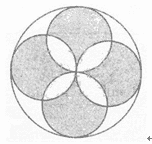 

正确答案: B   你的答案: 空 (错误)

```cpp
120
```

```cpp
128
```

```cpp
136
```

```cpp
144
```

本题知识点

吉比特 Java 工程师 C++工程师 iOS 工程师 安卓工程师 运维工程师 前端工程师 算法工程师 PHP 工程师 2018

讨论

[饭稀稀 7](https://www.nowcoder.com/profile/8261286)

图形变换一下，实际上就是 4 个小圆内接正方形的面积：32*4

发表于 2018-08-08 11:44:49

* * *

[emcpper](https://www.nowcoder.com/profile/4021641)

```cpp
拿一个小圆分析，
假设面积为 S，半径为 R
S = Pi * R * R
假设空白部分面积为 4X
假设小半圆那部分阴影面积为 2Y
4X + 2Y = （1/2）* S
2X + 2Y = （1/2）* 2R * R
=>
4X + 4Y = 2R * R
=>
2Y = 2R * R - (1/2) * S
得到小圆阴影部分面积 = 2Y + (1/2) * S = 2R*R 
四个圆面积 = 4 * 2R * R = 8 * 4 * 4 = 128
```

发表于 2019-08-05 22:38:36

* * *

## 9

已知 A 点的坐标为(12,13)，B 点坐标为(10,11)，求 A 点绕 B 点逆时针旋转 30 度后的坐标为？已知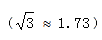

正确答案: A   你的答案: 空 (错误)

```cpp
(10.73,13.73)
```

```cpp
(12.73,12.73)
```

```cpp
(13.73,10.73)
```

```cpp
(12.73,13.73)
```

本题知识点

吉比特 Java 工程师 C++工程师 iOS 工程师 安卓工程师 运维工程师 前端工程师 算法工程师 PHP 工程师 2018

讨论

[emcpper](https://www.nowcoder.com/profile/4021641)

```cpp
将 A 转为 B 所在坐标系，套用旋转公式进行旋转，再转回世界坐标系即可。
旋转公式
x’ = xcos(-30') + ysin(-30')
y’ = ycos(-30') - xcos(-30')
选 A
```

发表于 2019-08-05 22:40:28

* * *

[飄 201807132142909](https://www.nowcoder.com/profile/164216008)

筛选法：逆时针转，则转之后的 x 要小于 12，y 要大于 13，纵观 4 个选项，只有 A 符合。计算法:利用直角三角形关系计算，AB 距离根据两点之间的距离公式可以计算出来，转动之后的 AB 与水平方向的夹角为 75 度，然后计算出 x,y 方向的偏距，就可以求出坐标

发表于 2018-09-01 10:47:53

* * *

## 10

已知向量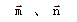是单位向量且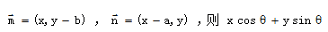的最大值为 _____________。

正确答案: D   你的答案: 空 (错误)

```cpp
2
```

本题知识点

吉比特 Java 工程师 C++工程师 iOS 工程师 安卓工程师 运维工程师 前端工程师 算法工程师 PHP 工程师 2018

讨论

[emcpper](https://www.nowcoder.com/profile/4021641)

```cpp
（x，y）经过 xcos + ysin 公式，得到 x’，x‘为旋转后的 x 轴投影，最大为长度 sqrt(x*x+y*y)
二维笛卡尔坐标系中绘制（x，y），（x，y-b），（x-a，y），连接为三角形
单位向量长度 1（固定），可知，b 或者 a 越大，得到长度越长。
n（0，1），m（1，0）
=> max = sqrt(2)
```

发表于 2019-08-05 22:41:04

* * *

## 11

假设 4 个作业如下表所示同时到达，当使用最高优先权优先调度算法时（优先级数值越大优先级越高），这 4 个作业的平均周转时间为多少小时？周转时间为：完成时间与到达时间的时间差。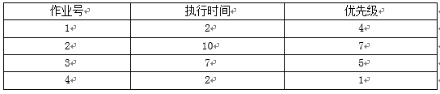 

正确答案: D   你的答案: 空 (错误)

```cpp
12.5
```

```cpp
12.75
```

```cpp
15.5
```

```cpp
16.75
```

本题知识点

吉比特 Java 工程师 C++工程师 iOS 工程师 安卓工程师 运维工程师 前端工程师 算法工程师 PHP 工程师 2018

讨论

[饭稀稀 7](https://www.nowcoder.com/profile/8261286)

到达时间均为 0，按优先级顺序完成时间分别为：10，10+7，10+7+2，10+70+2+2 平均周转时间：（10+17+19+21）/4 = 16.75

发表于 2018-08-08 12:39:41

* * *

[emcpper](https://www.nowcoder.com/profile/4021641)

```cpp
执行顺序：2 3 1 4
周转时间 = 10 + 
		  10 + 7 +
		  10 + 7 + 2 +
		  10 + 7 + 2 + 2 = 67
平均周转 = 67 / 4 = 16..
选 D
```

发表于 2019-08-05 22:41:22

* * *

## 12

请选出 4 个选项中最适合放在问号位置的一项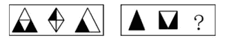 

正确答案: A   你的答案: 空 (错误)

本题知识点

吉比特 Java 工程师 C++工程师 iOS 工程师 安卓工程师 运维工程师 前端工程师 算法工程师 PHP 工程师 2018

讨论

[emcpper](https://www.nowcoder.com/profile/4021641)

```cpp
黑色面积占比翻倍
第一张 1:1 变为 2:0
第二张 1:3 变为 2:2
第三张 1:3 变为 2:2
```

发表于 2019-08-05 22:41:40

* * *

[靶心](https://www.nowcoder.com/profile/6625142)

为什么是 A 啊，找不出规律是什么，跪求大佬解答一下

发表于 2019-04-10 11:01:53

* * *

## 13

请问下列伪代码在做什么操作？

void foo(Node root)

{

if (root == null)

return;

    visit(root);

    root.visited = true;

    foreach (Node n in root.adjacent)

    {

        if (n.visited == false)

            foo(n);

    }

}

正确答案: A   你的答案: 空 (错误)

```cpp
深度优先搜索
```

```cpp
广度优先搜索
```

```cpp
前序遍历
```

```cpp
后序遍历
```

本题知识点

吉比特 Java 工程师 C++工程师 iOS 工程师 安卓工程师 运维工程师 前端工程师 算法工程师 PHP 工程师 2018

讨论

[虚煌](https://www.nowcoder.com/profile/355450679)

深度优先搜索，因为函数的递归调用方式决定它是把一个方向搜索完才换另一个方向的，所以不是广度优先不符合前序遍历，前序遍历无需进行 visited 判定。

发表于 2018-11-13 16:56:38

* * *

[我想静静！](https://www.nowcoder.com/profile/9359484)

因为这里有个 visit()函数 就是看这个节点是否已经遍历过在循环判断中，如果没有遍历过的话，才执行递归操作，所以应该是求深度优先遍历

发表于 2018-11-13 10:47:33

* * *

## 14

下面程序的输出是（） ```cpp
#include <stdio.h>

int main() {
    int m = 0;
    for (int i = 1; i <= 100; i++) {
        for (int j = 1; j <= i; j++) {
            if (j % 2 != 0)
                continue;
            m++;
        }
    }
    printf("%d\n",m);
    return 0;
}
``` 

正确答案: A   你的答案: 空 (错误)

```cpp
2500
```

```cpp
2501
```

```cpp
2550
```

```cpp
2551
```

本题知识点

吉比特 C++工程师 2018 C 语言

讨论

[swordjoinmagic](https://www.nowcoder.com/profile/731216776)

首先确定内层循环是用来找 1 ~ i 中偶数出现次数的.
其中 1 ~ N 的偶数出现次数大概如下表所示:

| N | 偶数出现次数 |
| --- | --- |
| 1 | 0 |
| 2 | 1 |
| 3 | 1 |
| 4 | 2 |
| 5 | 2 |
| 6 | 3 |
| 7 | 3 |
| ...... |
| N | n/2 |

题目求 1 ~ 1 + 1 ~ 2 + 1 ~ 3 + ... + 1 ~ N 的偶数出现次数.

可以发现最后结果是 1+1+2+2+3+3+...+n/2(还得判断 n 是否为偶数,为偶数只有一个 n/1,为奇数有两个 n/2,具体情况可看上表得知)

因为题目中 n=100,为偶数,则 n/2 只出现一次
将式子化简为 ,则可以运用等差公式: 

这时将得到的 2450 加上之前得到的 n/2=50,即 2450+50 = 2500

发表于 2019-09-03 13:40:15

* * *

[emcpper](https://www.nowcoder.com/profile/4021641)

```cpp
j:1->1
	m += 0
j:1->2
	m += 1
j:1->3
	m += 1
j:1->4
	m += 2
...
j:1->100
	m += 50
=>
m += 0 + 1 + 1 + 2 + 2 + ... + 50 (+ 50 对于 101
m = 2 * (1 + 49) * 49 / 2 + 50 = 50 * 49 + 50 = 50 * (49 + 1) = 2500
```

发表于 2019-08-05 22:42:18

* * *

[Joker▽](https://www.nowcoder.com/profile/517910605)

我想问下，这种题要是忘了数列，怎么办...

发表于 2021-09-06 20:18:34

* * *

## 15

请问以下代码在执行什么逻辑？

```cpp
int calc(vector<int> a){
    int m = 0;
    int s = 0;
    for (size_t i = 0; i < a.size(); ++i){
        s += a[i];
        if (m < s)
            m = s;
        else if (s < 0)
            s = 0;
    }
    return m;
}
```

正确答案: A   你的答案: 空 (错误)

```cpp
计算总和最大的连续数列
```

```cpp
计算只包含正数的总和最大的连续数列
```

```cpp
计算所有和不小于 0 非连续数列的和
```

```cpp
计算数列中所有正数的和
```

本题知识点

C++工程师

讨论

[做题王中王](https://www.nowcoder.com/profile/167412597)

这个题目出的太失败了，如果 vector 全是负数呢？只会返回 0。答案是错的

发表于 2020-10-02 00:02:57

* * *

[Macarons](https://www.nowcoder.com/profile/825630501)

**题，根本不对

发表于 2021-04-01 16:17:52

* * *

[WS 一直在前进](https://www.nowcoder.com/profile/182303797)

最大子序列的高效算法

发表于 2020-08-24 21:00:08

* * *

## 16

以下程序执行后控制台输出为（） ```cpp
#include <stdio.h>
int f(int n) {
    int i = 0;
    for (int k = 1; k <= n; k *= 2)
        ++i;
    for (int j = i / 2; j > 0; --j) {
        int v1 = (1 << (j - 1));
        int v2 = (1 << (i - j));
        bool flag1 = ((n & v1) != 0);
        bool flag2 = ((n & v2) != 0);
        if (flag1 != flag2) {
            n ^= v1;
            n ^= v2;
        }
    }
    return n;
}

int main(int argc, char* argv[]) {
    printf("%d", f(3456));
    return 0;
}
``` 

正确答案: D   你的答案: 空 (错误)

```cpp
6543
```

```cpp
3456
```

```cpp
639
```

```cpp
27
```

本题知识点

吉比特 C++工程师 2018 C 语言

讨论

[炫歌](https://www.nowcoder.com/profile/622959792)

i=初始值为 12。n=3456=2048+1024+256+128;n 根据规律属于递减的。当 j=2 时 v1=2v2=1024f1=0;f2=1n=n^v1=n+2;n=n^v2=n+2-1024;
当 j=1 时 v1=1v2=2048;f1=0;f2=1n=n^v1=n+1;n=n^v2=n+1-2048;n 减了有 3000 多剩下的一定小于 c 的 639,所以选 D.本题主要在于看规律，大致的蒙，准确计算 心算的话不现实。手算又太费时间。故大致计算是性价比最高的。

发表于 2020-11-12 19:43:16

* * *

[牛客 506299977 号](https://www.nowcoder.com/profile/506299977)

全靠猜

发表于 2020-09-29 10:20:05

* * *

[吕华](https://www.nowcoder.com/profile/460063127)

算出输入数字的比特位数量；从中间位开始分为左右两个半区，并从中间开始向两边逐位进行以下操作：若左右对称位值相同，则不做调整；若左右对称位值不同，则先左位保持原值，右位取反；再右位不变，左位取反；此时即意味着左右对称位交换了值。最后来看即该函数实现的是按位逆序功能。

发表于 2021-03-08 20:47:33

* * *

## 17

TCP/IP 协议中，TCP 协议提供可靠的连接服务，采用三次握手建立一个连接，第二次握手的时候服务器所处的状态是 _____________。

正确答案: A   你的答案: 空 (错误)

```cpp
SYN_RECV
```

```cpp
ESTABLISHED
```

```cpp
SYN-SENT
```

```cpp
LAST_ACK
```

本题知识点

吉比特 Java 工程师 C++工程师 iOS 工程师 安卓工程师 运维工程师 前端工程师 算法工程师 PHP 工程师 2018

讨论

[778 笑哈哈](https://www.nowcoder.com/profile/3718620)

在 TCP/IP 协议中，TCP 协议提供可靠的连接服务，采用三次握手建立一个连接。

第一次握手：建立连接时，客户端发送 syn 包(syn=j)到服务器，并进入 SYN_SEND 状态，等待服务器确认；

第二次握手：服务器收到 syn 包，必须确认客户的 SYN（ack=j+1），同时自己也发送一个 SYN 包（syn=k），即 SYN+ACK 包，此时服务器进入 SYN_RECV 状态；

第三次握手：客户端收到服务器的 SYN＋ACK 包，向服务器发送确认包 ACK(ack=k+1)，此包发送完毕，客户端和服务器进入 ESTABLISHED 状态，完成三次握手。

完成三次握手，客户端与服务器开始传送数据

发表于 2018-07-25 14:14:48

* * *

## 18

如果 Ethernet 交换机一个端口的数据传输速率是 50Mbit/s，该端口支持全双工通信，这个端口的实际数据传输速率可以达到 _____________。

正确答案: B   你的答案: 空 (错误)

```cpp
50Mbit/s
```

```cpp
100Mbit/s
```

```cpp
200Mbit/5
```

```cpp
4000Mbit/s
```

本题知识点

吉比特 Java 工程师 C++工程师 iOS 工程师 安卓工程师 运维工程师 前端工程师 算法工程师 PHP 工程师 2018

## 19

1 元钱买一瓶汽水，喝完后两个空瓶可以换一瓶汽水，请问有 20 元钱，最多可以喝到几瓶汽水？

正确答案: C   你的答案: 空 (错误)

```cpp
36
```

```cpp
39
```

```cpp
40
```

```cpp
42
```

本题知识点

吉比特 Java 工程师 C++工程师 iOS 工程师 安卓工程师 运维工程师 前端工程师 算法工程师 PHP 工程师 2018

讨论

[李文](https://www.nowcoder.com/profile/772566)

> 把这 2 个瓶 换 1 瓶继续喝，喝完后把这 1 个空瓶换 1 瓶汽水，喝完换来的那瓶再把瓶子还给人家即可，所以最多可以喝的汽水数为：20＋10＋5＋2＋1＋1＋1＝40

这是最骚的。。。。

发表于 2019-04-10 18:03:15

* * *

[靶心](https://www.nowcoder.com/profile/6625142)

解题思路 1：
一开始 20 瓶没有问题，随后的 10 瓶和 5 瓶也都没有问题，接着把 5 瓶分成 4 瓶和 1 瓶，前 4 个空瓶再换 2 瓶，喝完后 2 瓶再换 1 瓶，此时喝完后手头上剩余的空瓶数为 2 个，把这 2 个瓶 换 1 瓶继续喝，喝完后把这 1 个空瓶换 1 瓶汽水，喝完换来的那瓶再把瓶子还给人家即可，所以最多可以喝的汽水数为：20＋10＋5＋2＋1＋1＋1＝40
解题思路 2：
先看 1 元钱最多能喝几瓶汽水。喝 1 瓶余 1 个空瓶，借商家 1 个空瓶，2 个瓶换 1 瓶继续喝 ，喝完后把这 1 个空瓶还给商家。即 1 元钱最多能喝 2 瓶汽水。20 元钱当然最多能喝 40 瓶汽水 。
解题思路 3：
两个空瓶换一瓶汽水，可知纯汽水只值 5 角钱。20 元钱当然最多能喝 40 瓶的纯汽水。N 元钱当然最多能喝 2N 瓶汽水。
答案：
40 瓶

发表于 2019-04-10 11:43:56

* * *

[ruolinchangfeng](https://www.nowcoder.com/profile/5653652)

难道不是 39 吗？

发表于 2018-09-03 18:24:28

* * *

## 20

5 位运动员在某个项目中排名第一到第五。他们说了下面这些话：
甲：“我不是最后一名”
乙：“丙是第三名”
丙：“甲的排名在戊后面”
丁：“戊是第二名”
戊：“丁不是第一名”
金牌和银牌的得主都说了谎，其他三个说了真话。问第一名是谁 _____________。

正确答案: B   你的答案: 空 (错误)

```cpp
甲
```

```cpp
乙
```

```cpp
丙
```

```cpp
丁
```

```cpp
戊
```

本题知识点

吉比特 Java 工程师 C++工程师 iOS 工程师 安卓工程师 运维工程师 前端工程师 算法工程师 PHP 工程师 2018

讨论

[CyanSuz](https://www.nowcoder.com/profile/5320656)

首先甲不可能说假话，甲的如果是假话，那他说假话必是前两名，那他就说真话了，悖论，所以甲是真话。其次，丁说的如果是真的，那么戊就是假话，那丁就是第一名，丁就应该说假话，所以丁是假话，所以丁是前两名。再其次，如果戊说的是假的，那丁就是第一名，那么戊就只能是第二名（说假话），那么丁就说真话了，所以戊是真话，那么丁是第二名。再来，如果乙说真话，那么丙就是第三名，那么丙就说真话（不是前两名），但此时乙丙必有一假，所以乙说假话，乙是第一名。那么丙说了真话，甲在戊后面，成立。推得顺序从前往后为：乙丁戊甲丙，符合题干描述。

发表于 2021-05-02 13:26:12

* * *

[朱兆坤](https://www.nowcoder.com/profile/169932108)

```cpp
总共只有五种可能，可以使用排除法来解。
假设第一名是甲，那么丙说的是假话，所以丙是第二名。那么丁说的一定是真话，与丙是第二名相悖，所以第一名不是甲。
假设第一名是乙，其他人说的话没有一个与乙相关的，所以难以确定谁是第二名，先放着待会看。
假设第一名是丙，那么第二名则是乙，其他人说的都是真话。但丁又说戊是第二名，与乙是第二名相悖，所以第一名不是丙。
假设第一名是丁，那么第二名是戊。但丁说的又是假话，与戊是第二名相悖，所以丁不是第一名。
假设第一名是戊，戊说丁不是第一名，那么反过来就是丁是第一名，与戊是第一名相悖，所以戊也不是第一名。
最后只有乙可能是第一名。
```

发表于 2019-09-05 11:37:10

* * *

## 21

向一个有 127 个元素的顺序表中插入一个新元素并保持原来顺序不变，平均要移动 _____________ 个元素。

正确答案: B   你的答案: 空 (错误)

```cpp
8
```

```cpp
63.5
```

```cpp
63
```

```cpp
7
```

本题知识点

吉比特 Java 工程师 C++工程师 iOS 工程师 安卓工程师 运维工程师 前端工程师 算法工程师 PHP 工程师 C++工程师 Java 工程师 吉比特 2018

讨论

[778 笑哈哈](https://www.nowcoder.com/profile/3718620)

```cpp
平均要移动 63.5 次；
如果插在第一个位置那就要移动 127 个元素（即 127 次）；
如果插在第二个位置那就要移动 126 个元素（即 126 次）；
 。
 。
 。
 如果插在最后一个位置那不用移动移动次数为 0；
就是从 0~127 的一个递增数列（想倒过来递减也行）；
所以平均要移动的次数 N=(0+127)/2=63.5；
```

发表于 2018-07-25 14:18:59

* * *

## 22

下列叙述正确的是***？***

正确答案: C   你的答案: 空 (错误)

```cpp
算法的执行效率与数据的存储结构无关
```

```cpp
算法的空间复杂度是指算法程序中指令（或语句）的条数
```

```cpp
算法的有穷性是指算法必须能在执行有限个步骤之后终止
```

```cpp
算法的时间复杂度是指执行算法程序所需要的时间
```

本题知识点

吉比特 Java 工程师 C++工程师 iOS 工程师 安卓工程师 运维工程师 前端工程师 算法工程师 PHP 工程师 C++工程师 Java 工程师 吉比特 2018

讨论

[靶心](https://www.nowcoder.com/profile/6625142)

算法的时间复杂度是指算法执行过程中所需要的基本运算次数

发表于 2019-04-10 11:47:04

* * *

## 23

递归过程或函数调用时，处理参数及返回地址，要用一种称为 _____________ 的数据结构。

正确答案: D   你的答案: 空 (错误)

```cpp
队列
```

```cpp
多维数组
```

```cpp
线性表
```

```cpp
栈
```

本题知识点

吉比特 Java 工程师 C++工程师 iOS 工程师 安卓工程师 运维工程师 前端工程师 算法工程师 PHP 工程师 C++工程师 Java 工程师 吉比特 2018

讨论

[Mrw0629](https://www.nowcoder.com/profile/584342889)

我的想法是，不管是递归还是调用函数，都属于“先进后出”的顺序，即递归下去只有到底才能一层一层返回执行；调用函数只有被调用的函数执行完成才能继续原来的函数。所以应该是“栈”这种结构。

发表于 2020-08-26 21:39:58

* * *

## 24

假设要存储一个数据集，数据维持有序，对其的操作只有插入、删除和顺序遍历，综合存储效率和运行速度，下列哪种数据结构是最适合的？

正确答案: B   你的答案: 空 (错误)

```cpp
数组
```

```cpp
链表
```

```cpp
哈希表
```

```cpp
队列
```

本题知识点

吉比特 Java 工程师 C++工程师 iOS 工程师 安卓工程师 运维工程师 前端工程师 算法工程师 PHP 工程师 C++工程师 Java 工程师 吉比特 2018

## 25

设一个有序的单链表中有 n 个结点，现要求插入一个新结点后使得单链表仍然保持有序，则该操作的时间复杂度为 _____________。

正确答案: D   你的答案: 空 (错误)

```cpp
O(logn)
```

```cpp
O(1)
```

```cpp
O(n2)
```

```cpp
O(n)
```

本题知识点

吉比特 Java 工程师 C++工程师 iOS 工程师 安卓工程师 运维工程师 前端工程师 算法工程师 PHP 工程师 C++工程师 Java 工程师 吉比特 2018

讨论

[INeedahug](https://www.nowcoder.com/profile/9336833)

我个人理解是单链表插入结点先要寻找插入的位置，平均时间复杂度为 O(n),找到后修改尾指针指向，时间复杂度为 O(1)，所以总时间复杂度为 O(n)，个人观点仅供参考

发表于 2018-09-03 10:54:44

* * *

## 26

对线性表采用折半查找，该线性表必须 _____________。

正确答案: C   你的答案: 空 (错误)

```cpp
元素按值有序排列
```

```cpp
采用顺序结构
```

```cpp
元素按值有序排列，并且采用顺序存储结构
```

```cpp
元素按值有序排列，并且采用链式存储结构
```

本题知识点

吉比特 Java 工程师 C++工程师 iOS 工程师 安卓工程师 运维工程师 前端工程师 算法工程师 PHP 工程师 C++工程师 Java 工程师 吉比特 2018

讨论

[NowCoderJava](https://www.nowcoder.com/profile/50935185)

二分查找前置条件 ：1.必须有序 2.顺序结构

发表于 2020-02-26 20:12:17

* * *

## 27

设无向图的顶点个数为 n，则该图最多有 _____________ 条边。

正确答案: B   你的答案: 空 (错误)

```cpp
n-1
```

```cpp
n(n-1)/2
```

```cpp
n(n+1)/2
```

```cpp
n*n
```

本题知识点

吉比特 Java 工程师 C++工程师 iOS 工程师 安卓工程师 运维工程师 前端工程师 算法工程师 PHP 工程师 C++工程师 Java 工程师 吉比特 2018

讨论

[靶心](https://www.nowcoder.com/profile/6625142)

**无向图 G 中边数目的取值范围：0＜-e＜=n(n-1)/2。有 n(n-1)/2 条边的无向图称为完全图。**

发表于 2019-04-10 11:52:48

* * *

[虚煌](https://www.nowcoder.com/profile/355450679)

B

发表于 2018-11-13 16:47:56

* * *

[Denis201804191927386](https://www.nowcoder.com/profile/6040842)

B

发表于 2018-11-13 15:33:16

* * *

## 28

下列不属于 hash 碰撞解决方法的是？

正确答案: B   你的答案: 空 (错误)

```cpp
线性探测
```

```cpp
单旋转法
```

```cpp
二次探测
```

```cpp
拉链法
```

本题知识点

吉比特 Java 工程师 C++工程师 iOS 工程师 安卓工程师 运维工程师 前端工程师 算法工程师 PHP 工程师 C++工程师 Java 工程师 吉比特 2018

讨论

[靶心](https://www.nowcoder.com/profile/6625142)

单旋转法是一种 hash 函数的构造方法，将最后一位数，旋转放置到第一位，其余的往右移。如 5062101 旋转之后得到 1506210，

发表于 2019-04-10 11:54:09

* * *

## 29

当序列基本有序的情况下，下列选项中效率最高的排序是？

正确答案: A   你的答案: 空 (错误)

```cpp
插入排序
```

```cpp
选择排序
```

```cpp
快速排序
```

```cpp
归并排序
```

本题知识点

吉比特 Java 工程师 C++工程师 iOS 工程师 安卓工程师 运维工程师 前端工程师 算法工程师 PHP 工程师 2018

## 30

二叉树的旋转操作对以下哪种遍历不会造成影响***？***

正确答案: B   你的答案: 空 (错误)

```cpp
前序遍历
```

```cpp
中序遍历
```

```cpp
后序遍历
```

```cpp
都不会
```

本题知识点

吉比特 Java 工程师 C++工程师 iOS 工程师 安卓工程师 运维工程师 前端工程师 算法工程师 PHP 工程师 2018

## 31

将有关二叉树的概念推广到三叉树，则一棵有 130 个结点的完全三叉树的高度是 _____________。

正确答案: B   你的答案: 空 (错误)

```cpp
5
```

```cpp
6
```

```cpp
7
```

```cpp
8
```

本题知识点

吉比特 Java 工程师 C++工程师 iOS 工程师 安卓工程师 运维工程师 前端工程师 算法工程师 PHP 工程师 2018

讨论

[い王小喵](https://www.nowcoder.com/profile/664017785)

第六层 3⁵ = 243 > 130 

发表于 2019-04-04 19:45:52

* * *

## 32

下列排序算法中，在最后一趟开始之前，所有元素都有可能不在其最终的位置上的是 _____________。

正确答案: B   你的答案: 空 (错误)

```cpp
堆排序
```

```cpp
插入排序
```

```cpp
快速排序
```

```cpp
冒泡排序
```

本题知识点

吉比特 Java 工程师 C++工程师 iOS 工程师 安卓工程师 运维工程师 前端工程师 算法工程师 PHP 工程师 C++工程师 Java 工程师 吉比特 2018

讨论

[牛客 280852332 号](https://www.nowcoder.com/profile/280852332)

例如从小到大插入排序，最后一个插入的是最小的元素，此时最后一次前所有的数都不在正确的位置上。 其他几种排序每次循环都会确认至少一个元素的正确位置，所以不可能出现这种情况

发表于 2021-03-31 11:15:43

* * *

## 33

若用数组 S[0...n-1]（n>3）作为两个栈 S1 和 S2 的共同存储结构，要求对任何一个栈，只有当 S 全满时才不能做入栈操作，则为这两个栈分配空间的最佳方案是 _____________。

正确答案: C   你的答案: 空 (错误)

```cpp
S1 的栈底位置为 0，S2 的栈底位置为 1
```

```cpp
S1 的栈底位置为 0，S2 的栈底位置为 n/2
```

```cpp
S1 的栈底位置为 0，S2 的栈底位置为 n-1
```

```cpp
S1 的栈底位置为 n/2，S2 的栈底位置为 n/2+1
```

本题知识点

吉比特 Java 工程师 C++工程师 iOS 工程师 安卓工程师 运维工程师 前端工程师 算法工程师 PHP 工程师 C++工程师 Java 工程师 吉比特 2018

讨论

[33 平凡的世界](https://www.nowcoder.com/profile/5027098)

利用栈底位置不变的特性，可让两个顺序栈共享一个一维数据空间，以互补余缺，实现方法是：将两个栈的栈底位置分别设在存储空间的两端，让它们的栈顶各自向中间延伸。这样，两个栈的空间就可以相互调节，只有在整个存储空间被占满时才发生上溢，这样一来产生上溢的概率要小得多。

发表于 2018-07-27 20:34:04

* * *

## 34

快速排序在以下哪种情况下最不利于发挥其长处？

正确答案: D   你的答案: 空 (错误)

```cpp
要排序的数据量太大
```

```cpp
要排序的数据中含有多个相同值
```

```cpp
要排序的数据个数为奇数
```

```cpp
要排序的数据已基本有序
```

本题知识点

吉比特 Java 工程师 C++工程师 iOS 工程师 安卓工程师 运维工程师 前端工程师 算法工程师 PHP 工程师 2018

讨论

[寻找 offer](https://www.nowcoder.com/profile/6035108)

快排在数据基本有序的时间复杂度为
$o(n²)$

发表于 2018-07-05 20:30:57

* * *

## 35

一个元素存在一个大小为 n 的数组中，这个数组包含了超过 n/2 个重复的元素，请问最优的找到这个元素的时间复杂度为 _____________。

正确答案: A   你的答案: 空 (错误)

```cpp
O(n)
```

```cpp
O(nlgn)
```

```cpp
O(nlgn + n)
```

```cpp
O(n*n)
```

本题知识点

吉比特 Java 工程师 C++工程师 iOS 工程师 安卓工程师 运维工程师 前端工程师 算法工程师 PHP 工程师 2018

讨论

[ArnoSu](https://www.nowcoder.com/profile/945485530)

利用抵销法。因为重复元素超过 n/2。而总数是 n。所以该元素与其他元素抵消，到最后一定能得到的是该元素。如，1,1,1，2,2. 两个 1（做+操作）和两个 2（做-操作）互相抵消。最后值还是大于等于 0

发表于 2020-04-27 10:40:47

* * *

## 36

无向图有 n 个顶点 m 条边，则建立该图邻接表的时间复杂度为 _____________。

正确答案: B   你的答案: 空 (错误)

```cpp
O(n+m*m)
```

```cpp
O(n+m)
```

```cpp
O(n*n)
```

```cpp
O(n*m)
```

本题知识点

吉比特 Java 工程师 C++工程师 iOS 工程师 安卓工程师 运维工程师 前端工程师 算法工程师 PHP 工程师 2018

## 37

一棵二叉树现有如下关系：若任意父结点为(x,y)，那么其左子结点为(x + y,y)，右子结点为(x,y + x)。已知一棵二叉树根结点为(1,1)，请问以下哪个结点可能存在于该树中？

正确答案: A   你的答案: 空 (错误)

```cpp
(88,75)
```

```cpp
(76,128)
```

```cpp
(87,93)
```

```cpp
(106,72)
```

本题知识点

吉比特 Java 工程师 C++工程师 iOS 工程师 安卓工程师 运维工程师 前端工程师 算法工程师 PHP 工程师 2018

讨论

[い王小喵](https://www.nowcoder.com/profile/664017785)

按题目规律从下往上推父节点一直推到根节点是（1，1）就是对的 A    （88，75）——（13，75）——（13，62）——（13，49）——（13，36）——（13，23）——（13，10）——（3，10）——（3, 7）——（3，4）——（3，1）——(2，1) ——(1，1) 是对的 B     （76，128）——（76，52）——（24，52）——（24，28）——（24，4）——（20，4）——（16，4）——（12，4）——（8，4）——（4，4）——（0，4）/（4，0） 错的 C D 同上

发表于 2019-04-07 02:30:06

* * *

[许愿多多涨薪](https://www.nowcoder.com/profile/9726073)

这不就是辗转相减法求最大公约数嘛换个方法求最大公约数为 1 就可以了

发表于 2020-11-13 13:19:16

* * *

[emcpper](https://www.nowcoder.com/profile/4021641)

maxx - y = px, y = py

maxy - x = py, x = px

88 - 75 = 13

75 - (75/13 * 13) = 10

13 - 10 = 3

10 - (10/3 * 3) = 1

选 A

128 - 76 = 52

76 - 52 = 24

52 - 48 = 4

48 % 4 == 0

93 - 87 = 6

87 - (87/6*6) = 3

6 % 3 == 0

106 - 72 = 34

72 - 68 = 4

34 - (34/4*4) = 2

4 % 2 == 0

发表于 2019-08-05 23:02:20

* * *

## 38

有 4 份作业，每一份均需要先在机器 A 上加工完，然后在机器 B 上加工，机器 A 上同一时间只能加工一份作业，机器 B 上同一时间也只能加工一份作业，且作业之间无依赖关系。作业 i 在机器 A 和 B 上加工所需的时间分别为 ai 和 bi，且(a1,a2,a3,a4)=(4,5,12,10)，(b1,b2,b3,b4)=(8,2,15,9)，加工完 4 份作业所需的最短时间是 _____________。

正确答案: C   你的答案: 空 (错误)

```cpp
34
```

```cpp
38
```

```cpp
42
```

```cpp
45
```

本题知识点

吉比特 Java 工程师 C++工程师 iOS 工程师 安卓工程师 运维工程师 前端工程师 算法工程师 PHP 工程师 2018

讨论

[Lory.](https://www.nowcoder.com/profile/892308139)

约翰逊法具体步骤：
第一步，取出最小工时。如该工时为第一工序的，则最先加工；反之，则放在最后加工。第二步，将该已排序工作划去。第三步，对余下的工作重复上述排序步骤，直至完毕。得到最终的排序，计算整批工件的停留时间。
此题，取最小工时 b2=2，则作业 2 为最后完成的。a1=4，作业 1 为最先完成的。b4=9，作业 4 为第三个完成的。所以作业顺序为：作业 1 -> 作业 3 -> 作业 4 -> 作业 2，总时长为：4+12+10+(15-10)+5+(9-5)+2=42 或 4+12+15+9+2=42 （第 n 项作业所需工时值为第 n 项 a 工序和第 n-1 项 b 工序的最大值，即 max(a[n],b[n-1])）
ref：[`wiki.mbalib.com/wiki/%E7%BA%A6%E7%BF%B0%E9%80%8A%E6%B3%95`](https://wiki.mbalib.com/wiki/%E7%BA%A6%E7%BF%B0%E9%80%8A%E6%B3%95)

编辑于 2019-04-04 23:52:41

* * *

[33 平凡的世界](https://www.nowcoder.com/profile/5027098)

约翰逊法则的应用。找出加工时间最短的作业，若是第二工序，排在最后，反之排在最前面；消去后在剩下的作业中重复相同步骤。按作业 1->作业 3->作业 4->作业 2 的顺序加工（4+12+15+9+2=42）

发表于 2018-07-27 21:39:17

* * *

[Yunhong](https://www.nowcoder.com/profile/3140091)

学习了 多谢！

发表于 2018-07-28 11:09:17

* * *

## 39

用二进制表示十进制数 1 到 4，分别为 1、10、11、100，这些二进制数所有位上 1 的个数共有 5 个。那么，用二进制表示的十进制数 1 到 128，所有位上 1 的个数共有 _____________ 个。

正确答案: B   你的答案: 空 (错误)

```cpp
448
```

```cpp
449
```

```cpp
1024
```

```cpp
1025
```

本题知识点

吉比特 Java 工程师 C++工程师 iOS 工程师 安卓工程师 运维工程师 前端工程师 算法工程师 PHP 工程师 C++工程师 Java 工程师 吉比特 2018

讨论

[小冲冲](https://www.nowcoder.com/profile/4754385)

128 的二进制是 10000000（8 位），那么对于 1 到 128 的数来说，前 7 位 0 和 1 的出现次数是相等的（这个很好理解，举个简单的例子，对于 001 到 100 之间的数是 001 010 011 100 ，对于前两位来说，可以看到 0 和 1 的数量是相等的），那么这样就好做了，对于前 7 位来说，一共 128 个数，那么就是说 1 出现的个数就是 7*64，对于第八位来说，很明显可以看到只有在 128 的时候第八位取到了 1，所以说第八位一共就一个 1，所以最后的结果就是 449

发表于 2018-07-06 13:27:19

* * *

[张计科](https://www.nowcoder.com/profile/497554017)

来一个笨一点的方法暴力求解前 7 位出现 1 的个数情况有 1 个的时候 C¹[7 ]，出现两个 1 的时候有 2*C²[ 7 ]  个 1，，，，再加上 128 的那个 1 一共就是 7+42+105+140+105+42+7+1=499；

发表于 2018-09-19 01:25:58

* * *

[emcpper](https://www.nowcoder.com/profile/4021641)

```cpp
n = 1 位，0-1，个数为 2⁰ = 1
n = 2 位，2-3，个数为 2¹ + (2⁰) =  3
n = 3 位，4-7，个数为 2² + ((2¹ + 2⁰) + 2⁰) = 8
n = 4 位，8-15，个数为 2³ + (...) = ...
...
n = 7 位，64-127,个数为 2^(n-1) + (sum(n-1)) = f(n)
=>
f(n) = sum(n-1) + 2^(n-1)
f(n+1) = sum(n) + 2^n
f(n+1) - f(n) =  f(n) + 2^(n-1)
f(n+1) = 2f(n) + 2^(n-1)
根据递归树
=>
f(n+1) = 2^n + n*2^(n-1)
=>
sum(n) = f(n+1) - 2^n = n*2^(n-1)
答案为 sum(n) + 1 = 7 * 2⁶ + 1 = 449
```

发表于 2019-08-05 23:05:55

* * *

## 40

任何一个基于"比较"的内部排序的算法，若对 6 个元素进行排序，则在最坏情况下所需的比较次数至少为 _____________。

正确答案: B   你的答案: 空 (错误)

```cpp
9
```

```cpp
10
```

```cpp
11
```

```cpp
36
```

本题知识点

吉比特 Java 工程师 C++工程师 iOS 工程师 安卓工程师 运维工程师 前端工程师 算法工程师 PHP 工程师 C++工程师 Java 工程师 吉比特 2018

讨论

[__moon](https://www.nowcoder.com/profile/405204380)

最坏情况：无序或倒序。最少比较次数：用归并排序，分为两个范围 0-2，3-5，前面两次，后面比较两次，然后归并后，比较 6 次，最少十次是可以了.

发表于 2019-04-09 22:37:32

* * *

[emcpper](https://www.nowcoder.com/profile/4021641)

```cpp
min(所有基于比较多排序算法在最坏情况下的比较次数)
归并：
交叉情况下 (n1+n2) - 1
AE C	=> 2 + 1 - 1 => 2
AC => A
CE => C
=>E
BF D	=> 2 + 1 - 1 => 2
BD => B
DF => D
=> F
ACE	BDF	=> 3 + 3 - 1 => 5
AB => A
BC => B
CD => C
DE => D
EF => E
=>F
得到 9 次
```

发表于 2019-08-05 23:06:31

* * *

[谁与争锋](https://www.nowcoder.com/profile/465844)

1\. AB,CD,EF 两两比较共 3 次，得到 3 个结果，假设为 A,C,E，再两两比较，依然需要 2 次比较 AC,AE,假设最大为 A（共 5 次）  2\. 再比较 B,C,E,比较两次 BC,CE（共 2 次）  最大值为 C3\. 再比较 B,D,E，比较 DE,BE(共 2 次)     最大值为 E4\. 再比较 B,D,F,比较 BD,DF,最大值为 D (共两次） 最大值为 D5\. 再比较 BF,最大值为 B(1 次）共 12 次但是如果换了比较顺序，也出现过 11 次

发表于 2018-07-24 16:51:20

* * *

## 41

一个岛上有一对神秘的小兔子，一个月后它们会长成一对大兔子，再一个月后他们会生下一对小兔子，必定是一公一母（即：第一个月的月末会有一对大兔子，第二个月月末会有一对大兔子和一对小兔子），我们定义在第 x 个月月末时的兔子对数为 f(x)，请问 f(8) = 1

你的答案 (错误)

1 参考答案 (1) 34

本题知识点

吉比特 Java 工程师 前端工程师 算法工程师 PHP 工程师 C++工程师 2018

讨论

[AAAAAAAAAA 丶](https://www.nowcoder.com/profile/6504959)

这题不严谨。无论正确答案还是上面给出的题解，我都觉得有问题。首先他并没有说兔子在第二个月开始往后的每个月都会生一对出来。所以从这一点我认为他的正确答案就是错的。

发表于 2020-08-26 17:14:02

* * *

[Lory.](https://www.nowcoder.com/profile/892308139)

找规律。         大  小
F(1)=1F(2)=1+1=2F(3)=2+1=3F(4)=(2+1)+2=F(3)+F(2)=5F(5)=F(4)+F(3)=8F(6)=F(5)+F(4)=13F(7)=F(6)+F(5)=21F(8)=F(7)+F(6)=34

发表于 2019-04-05 00:38:42

* * *

[swordjoinmagic](https://www.nowcoder.com/profile/731216776)

f(8),计算量不大...列表统计即可

| 兔子数 | 月份 |
| --- | --- |
| 1 对大 | 1 |
| 1 对大,1 对小 | 2 |
| 2 对大,1 对小 | 3 |
| 3 对大,2 对小 | 4 |
| 5 对大,3 对小 | 5 |
| 8 对大,5 对小 | 6 |
| 13 对大,8 对小 | 7 |
| 21 对大,13 对小 | 8 |

发表于 2019-09-03 14:26:01

* * *

## 42

请阅读以下代码：

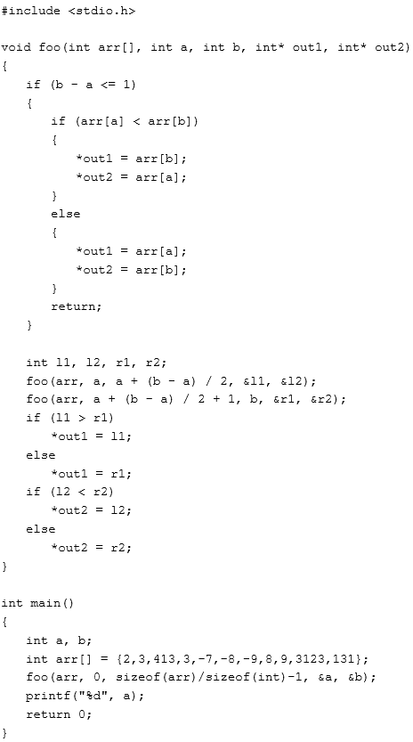

请问代码执行后控制台输出的值为 1

你的答案 (错误)

1 参考答案 (1) 3123

本题知识点

吉比特 Java 工程师 前端工程师 算法工程师 PHP 工程师 C++工程师 2018

## 43

请阅读以下代码：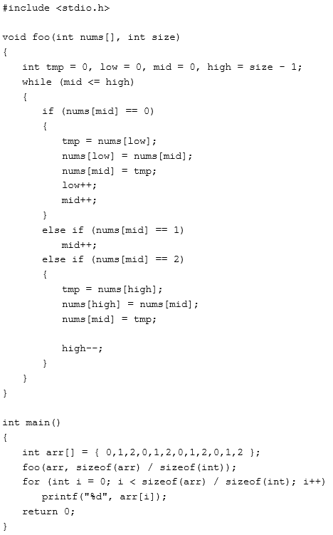
请问代码执行后控制台输出的值为 1

你的答案 (错误)

1 参考答案 (1) 000011112222

本题知识点

吉比特 Java 工程师 前端工程师 算法工程师 PHP 工程师 C++工程师 2018

讨论

[insight21](https://www.nowcoder.com/profile/666197094)

三路快排，可参考 leetcode 的三色荷兰国旗排序

发表于 2022-03-19 16:41:53

* * *

## 44

请阅读以下代码：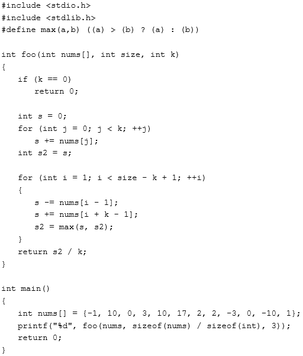
请问代码执行后控制台输出的值为 1

你的答案 (错误)

1 参考答案 (1) 10

本题知识点

吉比特 Java 工程师 前端工程师 算法工程师 PHP 工程师 C++工程师 2018

讨论

[insight21](https://www.nowcoder.com/profile/666197094)

求长度为 k 的滑动窗口内，最大的平均值

发表于 2022-03-19 16:45:23

* * *

## 45

请阅读以下代码：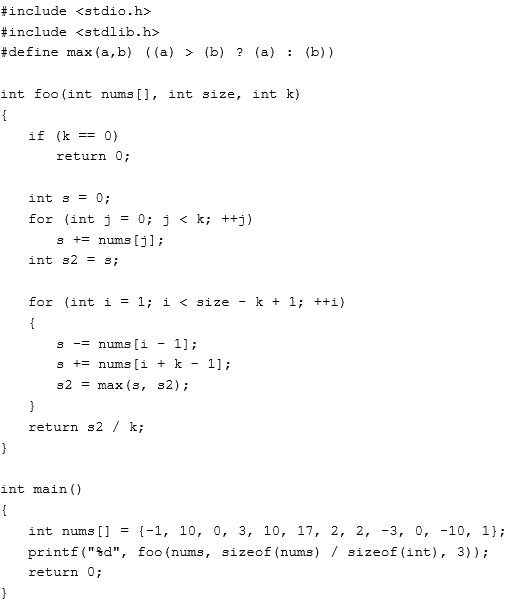
请问代码执行后控制台输出的值为 1

你的答案 (错误)

1 参考答案 (1) 10

本题知识点

吉比特 Java 工程师 前端工程师 算法工程师 PHP 工程师 C++工程师 2018

## 46

请阅读以下代码：

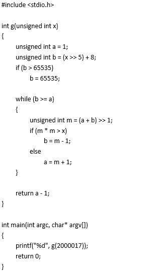

请问代码执行后控制台输出的值为 1

你的答案 (错误)

1 参考答案 (1) 1414

本题知识点

吉比特 Java 工程师 前端工程师 算法工程师 PHP 工程师 C++工程师 2018

## 47

请阅读以下代码：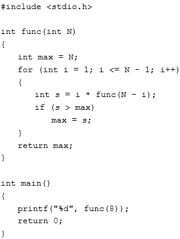
请问代码执行后控制台输出的值为 1

你的答案 (错误)

1 参考答案 (1) 18

本题知识点

吉比特 Java 工程师 前端工程师 算法工程师 PHP 工程师 C++工程师 2018

讨论

[陆尔](https://www.nowcoder.com/profile/864558301)

f(n) = 2 × (n-1)!

发表于 2020-04-27 11:08:01

* * *

## 48

请阅读以下代码：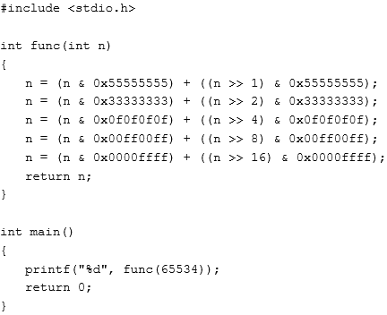
请问代码执行后控制台输出的值为 1

你的答案 (错误)

1 参考答案 (1) 15

本题知识点

吉比特 Java 工程师 前端工程师 算法工程师 PHP 工程师 C++工程师 2018

## 49

请阅读以下代码：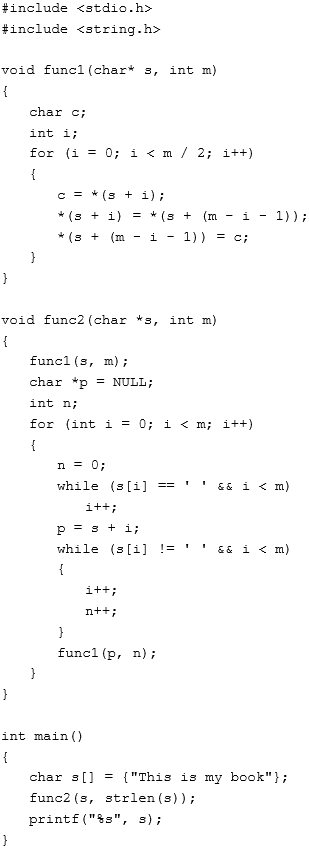
请问代码执行后控制台输出的值为 1

你的答案 (错误)

1 参考答案 (1) book my is This

本题知识点

吉比特 Java 工程师 前端工程师 算法工程师 PHP 工程师 C++工程师 2018

## 50

请阅读以下代码：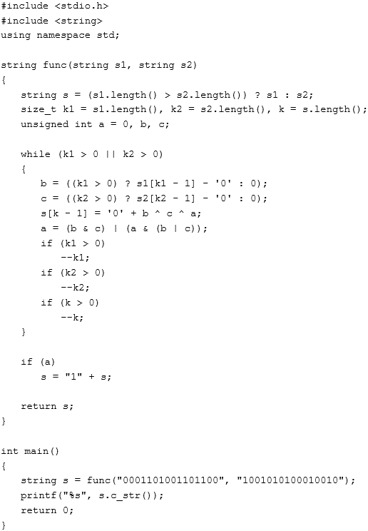
请问代码执行后控制台输出的值为 1

你的答案 (错误)

1 参考答案 (1) 1010111101111110

本题知识点

吉比特 Java 工程师 前端工程师 算法工程师 PHP 工程师 C++工程师 2018

讨论

[笨蛋蜘蛛](https://www.nowcoder.com/profile/8328817)

二进制加法

发表于 2019-04-10 11:18:19

* * *

## 51

输入一串字符，包含数字[0-9]和小写字母[a-z]，要求按数字从小到大、字母从 a 到 z 排序，并且所有数字排在字母后面

本题知识点

吉比特 Java 工程师 C++工程师 iOS 工程师 安卓工程师 运维工程师 前端工程师 算法工程师 PHP 工程师 字符串 *排序 *模拟 2018** **讨论

[wylu](https://www.nowcoder.com/profile/8627786)

```cpp
import java.io.BufferedReader;
import java.io.IOException;
import java.io.InputStreamReader;

/**
 * 计数排序
 * @author wylu
 */
public class Main {
    public static void main(String[] args) throws IOException {
        BufferedReader br = new BufferedReader(new InputStreamReader(System.in));
        char[] s = br.readLine().toCharArray();

        int[] letters = new int[26], digits = new int[10];
        for (char ch : s) {
            if (ch >= '0' && ch <= '9') digits[ch - '0']++;
            else letters[ch - 'a']++;
        }

        StringBuilder sb = new StringBuilder();
        for (int i = 0; i < letters.length; i++) {
            for (int j = 0; j < letters[i]; j++) sb.append((char) (i + 'a'));
        }
        for (int i = 0; i < digits.length; i++) {
            for (int j = 0; j < digits[i]; j++) sb.append((char) (i + '0'));
        }
        System.out.println(sb);
    }
}

```

发表于 2019-01-18 15:59:58

* * *

[无心 2019](https://www.nowcoder.com/profile/991674511)

```cpp
#include <bits/stdc++.h>
using namespace std; 
int main()
{
    string s,s1="",s2="";
    cin>>s;
    for(int i=0;i<s.size();i++)
    {
        if(s[i]>='0'&&s[i]<='9')
            s1+=s[i];
        else if(s[i]>='a'&&s[i]<='z')
            s2+=s[i];
    }
    sort(s1.begin(),s1.end());
    sort(s2.begin(),s2.end());
    s1=s2+s1;
    cout<<s1<<endl;
    return 0;
}

```

发表于 2019-06-18 10:33:31

* * *

[黄宗文](https://www.nowcoder.com/profile/4403932)

Python3

```cpp
# 普通字典序是数字在字母前面
# 可以先排序，然后使用正则表达式，找到数字，并把数字放到字母后面
# 实测，使用正则表达式没有比较字符码值效率高
# 字符串没有 sort()方法，sorted()排序过后得到的是字符 list

"""
import re

ls = sorted(input())
s = "".join(ls)
p = re.compile(r"\d*")
l = len(p.search(s).group())
print(s[l:]+s[:l])
"""

ls = sorted(input())
t = 0
for i in range(len(ls)):
    if ord(ls[i]) > ord('9'):
        t = i
        break
print("".join(ls[t:]+ls[:t]))
```

发表于 2019-08-18 00:31:14

* * *

## 52

G 社正在开发一个新的战棋类游戏，在这个游戏中，角色只能向 2 个方向移动：右、下。移动需要消耗行动力，游戏地图上划分 M*N 个格子，当角色移动到某个格子上时，行动力就会加上格子上的值 K（-100~100），当行动力<=0 时游戏失败，请问要从地图左上角移动到地图右下角至少需要多少起始行动力，注意（玩家初始化到起始的左上角格子时也需要消耗行动力）

本题知识点

吉比特 Java 工程师 C++工程师 iOS 工程师 安卓工程师 运维工程师 前端工程师 算法工程师 PHP 工程师 查找 *动态规划 2018* *讨论

[wylu](https://www.nowcoder.com/profile/8627786)

```cpp
import java.io.BufferedReader;
import java.io.IOException;
import java.io.InputStreamReader;

/**
 * @author wylu
 */
public class Main {
    public static void main(String[] args) throws IOException {
        BufferedReader br = new BufferedReader(new InputStreamReader(System.in));
        String[] strs = br.readLine().split(" ");
        int m = Integer.parseInt(strs[0]), n = Integer.parseInt(strs[1]);
        int[][] grid = new int[m][n];
        for (int i = 0; i < m; i++) {
            strs = br.readLine().split(" ");
            for (int j = 0; j < n; j++) {
                grid[i][j] = Integer.parseInt(strs[j]);
            }
        }

        int[][] dp = new int[m + 1][n + 1];
        dp[m][n] = 1;
        for (int i = m - 1; i >= 0; i--) {
            for (int j = n - 1; j >= 0; j--) {
                dp[i][j] = Math.max(1, Math.min(dp[i + 1][j], dp[i][j + 1]) - grid[i][j]);
            }
        }
        System.out.println(dp[0][0]);
    }
}

```

发表于 2019-02-02 13:22:25

* * *

[tricoffee](https://www.nowcoder.com/profile/4784924)

**【关键点】角色的三种状态：**

1.  角色在(i, j)之前（即在(i-1, j)或者(i, j-1)，下一步即将移动到(i, j)）行动力用 dp[i][j]表示，比如初始行动力为 dp[0][0]，下一步即将移动到(0, 0)；

2.  角色在(i, j)时（下一步即将移动到(i+1, j)或者(i, j+1)）行动力等于 dp[i][j]+a[i][j]，比如初始行动力为 dp[0][0]，角色在(0, 0)时行动力为 dp[0][0]+a[0][0]；

3.  角色在(i, j)之后（即在(i+1, j)或者(i, j+1)，上一步在(i, j)），此时有 min(dp[i+1][j], dp[i][j+1])等于 dp[i][j]+a[i][j]。

**【分析】**dp[i][j]表示角色尚在格子(i, j)之前并且即将要移动到格子(i, j)时的行动力。

dp[0][0]表示初始的行动力。

当行动力小于或者等于 0 时游戏失败，dp[i][j]必然大于或者等于(对应递推公式的 max)1，即 dp[i][j]>=1。

dp[i][j]+a[i][j]表示角色在格子(i, j)但尚未往下移动时的行动力，此时行动力为 min(dp[i+1][j], dp[i][j+1])，采用 min 是因为最后要求的是最小值。

最后求解初始时刻的行动力，则应该从后往前推理，可得，

dp[i][j] = max(1, min(dp[i+1][j], dp[i][j+1]) – a[i][j])。 ```cpp
#include<iostream>
#include<vector>
#include<algorithm>
using namespace std;
int main()
{
    int m,n;
    cin>>m>>n;
    vector<vector<int> > a(m,vector<int>(n,0));
    vector<vector<int> > dp(m+1,vector<int>(n+1,0));
    for(int i=0;i<m;++i)
        for(int j=0;j<n;++j)
            cin>>a[i][j];
    for(int i=m-1;i>=0;--i)
        for(int j=n-1;j>=0;--j)
            dp[i][j]=max(1,min(dp[i+1][j],dp[i][j+1])-a[i][j]);
    cout<<dp[0][0]<<endl;
    return 0;
}
``` 

编辑于 2020-03-20 02:15:55

* * *

[起航，再也不停留](https://www.nowcoder.com/profile/9556001)

```cpp
#写一个 python 版的答案

#读取数据
m,n = map(int,input().split())
array = []
for _ in range(m):
    list1 = list(map(int,input().split()))
    array.append(list1)
#构建一个辅助数组，记录移动方向
#1 表示竖直移动，0 表示水平移动
line = [[0]*n for _ in range(m)]
for j in range(n-1):
    array[0][j+1] += array[0][j]
for i in range(m-1):
    array[i+1][0] += array[i][0]
#动态规划算每个点最小的体力值
for i in range(1,m):
    for j in range(1,n):
        if(array[i-1][j] > array[i][j-1]):
            array[i][j] += array[i-1][j]
            line[i][j] = 1
        else:
            array[i][j] += array[i][j-1]
#print(array)
#从右下角 往 左上角 回溯。 求得最小值
list1 = []
i = m-1
j = n-1
while(i>0 and j>0):
    if(line[i][j] == 1):
        i -= 1
    else:
        j -= 1
    list1.append(array[i][j])
if(i>0):
    for k in range( i):
        list1.append(array[k][0])
else:
    for k in range( j):
        list1.append(array[0][k])
#print(list1)
res = min(list1)
print(max(-res+1,1))

```

发表于 2019-04-21 16:00:08

* * ****