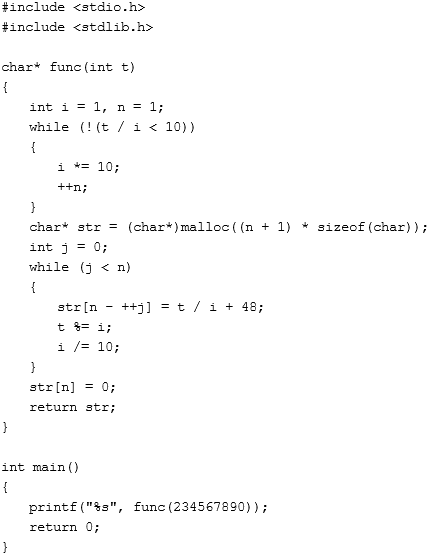

# 二千零一十八、届吉比特校招技术类笔试 B 卷

## 1

A 口袋内装有若干红球与白球，从中摸出一个红球的概率是 30%，B 口袋内装有若干黄球与白球，从中摸出一个黄球的概率是 40%，同时从两个口袋中各摸一个球出来，其中摸出有且只有一个白球的概率是 ________。

正确答案: C   你的答案: 空 (错误)

```cpp
12%
```

```cpp
42%
```

```cpp
46%
```

```cpp
54%
```

本题知识点

吉比特 Java 工程师 C++工程师 iOS 工程师 安卓工程师 运维工程师 前端工程师 算法工程师 PHP 工程师 2018

讨论

[求求求 offerofferoffer](https://www.nowcoder.com/profile/3783932)

30%*（1-40%）+（1-30%）*40%=46%

发表于 2018-08-26 15:53:06

* * *

## 2

已知 a = 6789x + 6789、b = 6789x + 6790、c = 6789x + 6791，则代数式 a² + b² + c²-ab -bc -ca 的值为 ________。

正确答案: D   你的答案: 空 (错误)

```cpp
0
```

```cpp
1
```

```cpp
2
```

```cpp
3
```

本题知识点

吉比特 Java 工程师 C++工程师 iOS 工程师 安卓工程师 运维工程师 前端工程师 算法工程师 PHP 工程师 C++工程师 Java 工程师 吉比特 2018

讨论

[GDIves](https://www.nowcoder.com/profile/7953702)

a²+b²+c²-ab-bc-ca
=(1/2)*(2a²+2b²+2c²-2ab-2bc-2ca)
=(1/2)*(a²-2ab+b²+c²-2ca+a²+b²-2bc+c²)
=(1/2)*[(a-b)²+(a-c)²+(b-c)²]

发表于 2018-08-24 17:54:35

* * *

[swordjoinmagic](https://www.nowcoder.com/profile/731216776)

朴素方法,显然 6789 最后会被消掉,这里设 6789 为 k,那么条件变为下面几个:

1.  
2.  
3.  

接下来带入计算就好了,计算量不大


3 个会被消掉,其余的 k(x+k)也会被消掉,最后结果是 5-2 = 3.

不过直接设 x 的方法比这个方便....一开始没想到

发表于 2019-08-30 12:38:29

* * *

[CyanSuz](https://www.nowcoder.com/profile/5320656)

设 a = b-1,c = b+1。

发表于 2021-05-01 11:33:26

* * *

## 3

将 14 拆成几个自然数的和，再求出这些数的乘积，可以求出的最大乘积是 ________。

正确答案: C   你的答案: 空 (错误)

```cpp
135
```

```cpp
144
```

```cpp
162
```

```cpp
166
```

本题知识点

吉比特 Java 工程师 C++工程师 iOS 工程师 安卓工程师 运维工程师 前端工程师 算法工程师 PHP 工程师 2018

讨论

[mars 的先遣队](https://www.nowcoder.com/profile/164514495)

# -*- coding:utf-8 -*-

class Solution:

    def cutRope(self, number):
        # write code here
        if(number == 2):
            return 2
        if(number == 3):
            return 3

        ## 绳子剪成 m 段
        quotient = number // 3
        remainder = number % 3
        if(remainder == 0):
            res = pow(3,quotient)
        elif(remainder == 1):
            res = pow(2,2) * pow(3,quotient - 1)
        else:
            res = 2 * pow(3,quotient)

        return res

发表于 2020-11-22 13:53:37

* * *

[赏个 offer 吧！](https://www.nowcoder.com/profile/346279714)

只能列举法 。。。。很难找到规律不能含有 1 尽可能多的 3

发表于 2019-08-28 18:54:51

* * *

[koder](https://www.nowcoder.com/profile/8654236)

3*3*3*3*2=162

发表于 2018-08-20 16:46:32

* * *

## 4

6 种不同的元素排成前中后三排，每排排 2 个，请问，共有 ________ 种排法？

正确答案: C   你的答案: 空 (错误)

```cpp
36
```

```cpp
120
```

```cpp
720
```

```cpp
270
```

本题知识点

吉比特 Java 工程师 C++工程师 iOS 工程师 安卓工程师 运维工程师 前端工程师 算法工程师 PHP 工程师 C++工程师 Java 工程师 吉比特 2018

讨论

[邹俊 201904232343357](https://www.nowcoder.com/profile/299188877)

....这虽然用排除法知道答案是 6 的阶乘，但是难道每排 2 个这有什么意义？***？答案不应该是 90？

发表于 2019-05-19 22:48:08

* * *

[GDIves](https://www.nowcoder.com/profile/7953702)


发表于 2018-08-24 18:02:00

* * *

[Dream 静](https://www.nowcoder.com/profile/5094616)

相当于 6 个不同的元素站成一排的全排列：6*5*4*3*2*1=720

发表于 2019-04-09 16:34:09

* * *

## 5

某银行新设一种定期存款业务，经预测：存款量与存款利率的平方成正比，比例系数为 k(k>0)，贷款的利率为 4.8%时，银行吸收的存款能全部放贷出去，请问：当银行的存款利率定为 ________ 时，银行可获得最大收益？

正确答案: A   你的答案: 空 (错误)

```cpp
3.2%
```

```cpp
3.3%
```

```cpp
3.4%
```

```cpp
3.5%
```

本题知识点

吉比特 Java 工程师 C++工程师 iOS 工程师 安卓工程师 运维工程师 前端工程师 算法工程师 PHP 工程师 C++工程师 Java 工程师 吉比特 2018

讨论

[GDIves](https://www.nowcoder.com/profile/7953702)

用 y 表示收益，由设存款量是 kx2，利率为 x，贷款收益为 0.048kx2
则收益 y=0.048kx2-kx3，x∈（0，0.048），
∵y′=0.096x-3kx2=3kx（0.032-x）
∴当 y′＞0，0＜x＜0.032
当 y′＜0，0.032＜x＜0.048
故收益 y 在 x=0.032 时取得最大值

发表于 2018-08-24 18:05:05

* * *

[赏个 offer 吧！](https://www.nowcoder.com/profile/346279714)

列出关系式，观察特点求导，为零时取得最大值（或最小值）

发表于 2019-08-28 18:56:17

* * *

## 6

两个圆，半径分别为 1cm、3cm，小圆在大圆外，绕大圆圆周滚动一周，请问小圆一共旋转了几圈？

正确答案: D   你的答案: 空 (错误)

```cpp
1
```

```cpp
2
```

```cpp
3
```

```cpp
4
```

本题知识点

吉比特 Java 工程师 C++工程师 iOS 工程师 安卓工程师 运维工程师 前端工程师 算法工程师 PHP 工程师 C++工程师 Java 工程师 吉比特 2018

讨论

[GDIves](https://www.nowcoder.com/profile/7953702)

看圆心距离，在圆外时圆心距离是 4，且小球滚动圆心距离是不变的，然后路径是 4πR，又可知，圆心走过的距离和小圆边走过的距离一定是相等的，故也是 4πR，所以要转的圈数是 4πR/ πR=4 圈

发表于 2018-08-24 18:21:58

* * *

[邹俊 201904232343357](https://www.nowcoder.com/profile/299188877)

感觉好多脑筋急转弯，路程上说小圆的周长是大圆三分之一，但是小圆绕大圆圆周滚动一周这一圈也要算进去.......所以 3+1=4

发表于 2019-05-20 15:28:58

* * *

[谁与争锋](https://www.nowcoder.com/profile/465844)

为什么不选 3，走过的周长一样

发表于 2018-07-24 19:33:58

* * *

## 7

HTTP 传输完成，断开需要四次挥手，第二次挥手的时候客户端所处的状态是 ________。

正确答案: C   你的答案: 空 (错误)

```cpp
CLOSE_WAIT
```

```cpp
LAST_ACK
```

```cpp
FIN_WAIT
```

```cpp
TIME_WAIT
```

本题知识点

吉比特 Java 工程师 C++工程师 iOS 工程师 安卓工程师 运维工程师 前端工程师 算法工程师 PHP 工程师 2018

## 8

一个单核多道批处理系统中仅有 P1 和 P2 两个作业， P2 比 P1 晚 10ms 到达，它们的计算和 I/O 操作顺序如下：
P1 ：计算 40ms ， I/O 120ms ，计算 20ms
P2 ：计算 30ms ， I/O 60ms ，计算 40ms
若不考虑调度和切换时间，则完成两个作业需要的时间最少是***？***

正确答案: B   你的答案: 空 (错误)

```cpp
240ms
```

```cpp
260ms
```

```cpp
340ms
```

```cpp
360ms
```

本题知识点

吉比特 Java 工程师 C++工程师 iOS 工程师 安卓工程师 运维工程师 前端工程师 算法工程师 PHP 工程师 2018

讨论

[ItsAbel](https://www.nowcoder.com/profile/329902427)

注意：这道题中，P1 和 P2 是不能同时进行 IO 的，正确的流程为：①. P1 计算 40ms；②. P1 进行 120ms IO（同时 P2 进行 30ms 计算）；③. P2 进行 60ms IO（同时 P1 进行 20ms 计算）；④. P2 进行 40ms 计算。总计：40+120+60+40=260ms。

发表于 2020-04-01 11:33:26

* * *

[swordjoinmagic](https://www.nowcoder.com/profile/731216776)

*   单道批处理系统：一次只允许一个作业调入内存被执行
*   n 道批处理系统：一次允许 n 个作业调入内存被执行

列出表格:

|   | 计算 | IO | 计算 |
| P1 | 40 | 120 | 20 |
| P2 | 30 | 60 | 40 |

按照多道批处理系统规则(在 IO 时可以同时处理计算),运行应该是下面这样:P1 计算 -> P1IO(此时 P2 同时计算) -> P1IO 完毕后,P2 开始 IO(此时 P1 同时计算) -> P2IO 完毕,计算 P2

|   | 计算 | IO | 计算 |
| P1 | 40 | 120 | ~~20~~ |
| P2 | ~~30~~ | 60 | 40 |

累加后为结果,40+120+60+40 = 260

发表于 2019-08-30 12:40:43

* * *

[听风不是雨，you](https://www.nowcoder.com/profile/9635710)

p1 计算----->p1 IO（p2 计算）--->p2 IO(p1 计算)--->p2 计算   （同一时间计算和 IO 可以共存）  40                160                              220                  260

发表于 2018-09-03 11:56:07

* * *

## 9

假定一个同步总线的工作频率 16MHz ，总线中有 32 位数据线，每个总线时钟传输一次数据，则该总线的最大数据传输率为 ________。

正确答案: B   你的答案: 空 (错误)

```cpp
32MB/s
```

```cpp
64MB/s
```

```cpp
128MB/s
```

```cpp
512MB/s
```

本题知识点

吉比特 Java 工程师 C++工程师 iOS 工程师 安卓工程师 运维工程师 前端工程师 算法工程师 PHP 工程师 2018

讨论

[wengmq](https://www.nowcoder.com/profile/766769871)

赫兹也是国际单位制中频率的单位，它是每秒中的周期性变动重复次数的计量。赫兹的名字来自于德国物理学家海因里希·鲁道夫·赫兹。其符号是 Hz。1Hz = 1/s，即在单位时间内完成的次数，单位为赫兹（1 赫兹=1 次/秒）。

单位换算

SI 衍生单位 1[千赫](https://baike.baidu.com/item/%E5%8D%83%E8%B5%AB) （kHz 103 Hz） =1 000 Hz1 兆赫 （MHz 106 Hz） =1 000 000 Hz1 吉赫 （GHz 109 Hz） =1 000 000 000 Hz1 太赫 （THz 1012 Hz） =1 000 000 000 000 Hz1 拍赫 （PHz 1015 Hz） =1 000 000 000 000 000 Hz1 艾赫 （EHz 1018 Hz） =1 000 000 000 000 000 000 Hz 所以题目的意思可以理解为：有个同步总线 1 秒可以发送 16*1 000 000 次数据，每次的数据量为 32 位的数据（32bit）选项中使用的是 B，即 Byte，所以要装换：32bit = 32/8Byte = 4Byte （缩写为 4B）所以总线的最大数据传输率就是 1 秒内发送的数据量： =  16 * 1 000 000 * 4B / 1s =  64 MB/s 所以 B 正确。

发表于 2020-03-14 01:31:26

* * *

[GDIves](https://www.nowcoder.com/profile/7953702)

16MHz*32b=512Mb/s=512/8MB/s=64MB/s

发表于 2018-08-24 21:47:38

* * *

## 10

已知公式：
DONALD

+ GERALD

ROBERT
以上共有 10 个字母，每一个字母都代表阿拉伯数字中 0-9 中的一个，已知 D = 5，请计算出 N 字母代表的数字

正确答案: C   你的答案: 空 (错误)

```cpp
3
```

```cpp
4
```

```cpp
6
```

```cpp
9
```

本题知识点

吉比特 Java 工程师 C++工程师 iOS 工程师 安卓工程师 运维工程师 前端工程师 算法工程师 PHP 工程师 C++工程师 Java 工程师 吉比特 2018

讨论

[Mango0520](https://www.nowcoder.com/profile/2939608)

D=5，所以 T=0，且个位有一个进位，所以 R 是奇数；万位 O+E 的是 O，考虑到进位只能是 1，所以 E=9；十万位 D+G+1=R，所以 R>6，所以 R=7；所以 G=1；
再看十位 L+L+1 的是 R,所以 L=3 或 8；考虑到百位 A+A 的结果为 E=9 是奇数 ，所以十位有个进位，因此 L=8，A=4；剩下的三个数只能是 N=6，B=3，O=2

发表于 2019-04-10 16:41:46

* * *

[CyanSuz](https://www.nowcoder.com/profile/5320656)

D=5, T=0;O+E+1=O+10 -> E = 9 ->  A=4;最左一列 5+G+1 = R ，没有进位，6<R<9 ->  0<G<3 ,G 取 1-2 ，R 取 7-8；右数第二列，L+L=R+1 -> R 为奇数 -> R=7,G=1;左数第三列，N+7=B+10, N = B - 3;如题，每个字母对应一个数字，此时还剩下 2，3，6 三个数字，满足 N=B-3 的只有 3 和 6；N=3,B=6,O=2;526485+197485=723970

发表于 2021-05-01 11:51:39

* * *

## 11

在一次国际会议上，有 21 个人会讲法语，21 个人会讲英语，21 个人会讲德语，但与会人数远小于 63，因为有些人会说几种语言。事实上，所有的可能性不外乎：有些人只会说一种语言，有些人只会说两种，而有些人三种都会说。如果把会说某种语言的人称为一个组，那么在这个组内，只会说某两种语言的人（类似地，只会说这种语言的人，三种语言都会说的人）就称为一个小组。对于任何一个给定的组，其各小组的人数都不相同（但至少 3 人）。人数最多的小组是由那些只会说法语的人组成的。那么会说英语和德语但不会说法语的人有 ________ 人？

正确答案: B   你的答案: 空 (错误)

```cpp
3
```

```cpp
6
```

```cpp
7
```

```cpp
9
```

本题知识点

吉比特 Java 工程师 C++工程师 iOS 工程师 安卓工程师 运维工程师 前端工程师 算法工程师 PHP 工程师 C++工程师 Java 工程师 吉比特 2018

讨论

[＆黑大帅](https://www.nowcoder.com/profile/2778422)

首先用字母代替三种语言,法语(A),英语(B),德语(C),那会多种语言就用字母组合;读完题后得出结论,一共可以分为 7 个小组,A,B,C,AB,AC,BC,ABC;这七个小组最少人数为,3,4,5,6,7,8,9;其中法语人数最多,因此 A>=9 人;和三条等式;A+AB+AC+ABC = 21,  B+AB+BC+ABC = 21, C+AC+BC+ABC =21\.列完已知条件后,我们将选项中的数字带入等式中来判断,当 BC = 9 时,等式三,就是 C+AC+9+ABC = 21\.C+AC+ABC = 12; 又因为 C>BC,所以 C>9,但是 AC>=3;ABC>=3,因此等式不成立. 当 BC = 7 时,等式三,C+AC+ABC = 14;又因为 C>=9,所以,依然不成立.当 BC = 3,得出 C+AC+ABC = 18;C 只能等于 9, AC 和 ABC 可以取 5,4 两个值;再将该已知条件带入等式一中.A+AB = 12;然后没有符合与 A,AB 的数字,从而选 B,

发表于 2019-08-29 12:26:02

* * *

[牛客 412705553 号](https://www.nowcoder.com/profile/412705553)

设法语（A），英语(B)，德语(C)，多种语言字母组合。读题可知：有七个小组每个小组人数>=3，有需要满足每个小组人数不同，且 A 组最多人。则 A>=9；     又因为 A+AB+AC+ABC = 21 所以 AB+AC+ABC <= 12；又 AB，AC，ABC 满足>=3 且<9；所以仅有组合{3，4，5}满足，则可以得出 A=9；至此，我们可以限定 BC 的范围，6<=BC<9 又 B+AB+BC+ABC = 21, C+AC+BC+ABC =21，所以 B+BC 和 C+BC 的可能值仅为 12，13，14 中的两个不同数值。到此我们假设 BC 的所有可能值：1、BC=8，此时 B 与 C 的可能值为 4，5，6 中的两个不同值，4,5 在前面推导占用了，仅剩 6，所以舍弃。2、BC=7，此时 B 与 C 的可能值为 5，6，7 中的两个不同值，5 在前面推导占用了，7 又被 BC 占用，仅剩 6，所以舍弃。3、BC=6，此时 B 与 C 的可能值为 6，7，8 中的两个不同值，6 被 BC 占用，剩 7，8，所以 B，C 可能为 7，8。总结 A= 9 ，BC= 6，其他值不确定只能估计范围。

发表于 2021-03-02 14:24:22

* * *

[赏个 offer 吧！](https://www.nowcoder.com/profile/346279714)

坐等神仙来回答

发表于 2019-08-28 19:07:39

* * *

## 12

以下判断二叉树是否平衡的方法对的是 ________。

正确答案: B   你的答案: 空 (错误)

```cpp
任何一个节点的两颗子树的高度相等
```

```cpp
任何一个节点的两颗子树的高度差不超过 1
```

```cpp
根节点的两颗子树高度相等
```

```cpp
根节点的两颗子树高度差不超过 1
```

本题知识点

吉比特 Java 工程师 C++工程师 iOS 工程师 安卓工程师 运维工程师 前端工程师 算法工程师 PHP 工程师 2018

## 13

以下说法正确的是 ________。

正确答案: B   你的答案: 空 (错误)

```cpp
任何情况下相同元素的 hash map 查找的速度都比红黑树 map 来得快
```

```cpp
二分查找要求查找的数组必须已排序
```

```cpp
快速排序是不稳定的，在最差的情况下，时间复杂度量级比冒泡排序高
```

```cpp
堆排序的空间复杂度为 O(n)
```

本题知识点

吉比特 Java 工程师 C++工程师 iOS 工程师 安卓工程师 运维工程师 前端工程师 算法工程师 PHP 工程师 C++工程师 Java 工程师 吉比特 2018

讨论

[宇宙 2662](https://www.nowcoder.com/profile/244258828)

**各排序算法的时间复杂度、空间复杂度、稳定性：**

（**排序算法的稳定性**：排序前后**相等元素**的**相对位置不变**，则称排序算法是稳定的；否则排序算法是不稳定的）

| 排序算法 | 平均时间复杂度 | 最坏时间复杂度 | 空间复杂度 |  稳定性  |
|  冒泡排序 |  O(n²) |  O(n²) |  O(1) | 稳定  |
|  选择排序 |  O(n²) |  O(n²) |  O(1) | 不稳定 |
| 直接插入排序 |  O(n²) |  O(n²) |  O(1) | 稳定 |
|  归并排序 |  O(nlogn) |  O(nlogn) |  O(n) | 稳定 |
|  快速排序 |  O(nlogn) |  O(n²) |  O(logn) | 不稳定 |
|  堆排序 |  O(nlogn) |  O(nlogn) |  O(1) | 不稳定 |

**冒泡排序：**

冒泡排序算法需要多次遍历数组（N-1 次），在每次遍历中，比较连续相邻的元素。如果一对元素是降序，则互换它们的值；否则保持不变。这样每一次遍历较大的值都沉到了后面：第一次遍历区间为 0~N-1，第一次遍历后，最后一个元素成为数组中最大的数；第二次遍历区间为 0~N-2，第二次遍历后，倒数第二个元素成为第二大的数……

*   **稳定性**：**稳定**。冒泡排序就是把小的元素往前调或者把大的元素往后调。比较是相邻的两个元素比较，交换也发生在这两个元素之间。如果两个元素相等，不会把他们俩交换，所以相同元素的前后顺序并没有改变，所以冒泡排序是一种稳定排序算法。
*   **时间复杂度**：**O(n²)**。需要两个 for 循环，每次只关注一个元素，平均时间复杂度为 O(n²)，最坏的也是 O(n²)。
*   **空间复杂度**：**O(1)**。需要一个临时变量来交换元素位置，所以空间复杂度 O(1)。

**选择排序：**

选择排序是给每个位置选择当前元素最小的，比如给第一个位置选择最小的，在剩余元素里面给第二个元素选择最小的，依次类推，直到第 n-1 个元素，第 n 个元素不用选择了，因为只剩下它一个最大的元素了。

*   **稳定性**：**不稳定**。在一趟选择中，如果当前元素比一个元素小，而该小的元素又出现在一个和当前元素相等的元素后面，那么交换后稳定性就被破坏了。比如序列 5 8 5 2 9， 我们知道第一遍选择第 1 个元素 5 会和 2 交换，那么原序列中 2 个 5 的相对前后顺序就被破坏了，所以选择排序不是一个稳定的排序算法。
*   **时间复杂度**：**O(n²)**。需要两个 for 循环，平均时间复杂度为 O(n²)，最坏的也是 O(n²)。
*   **空间复杂度**：**O(1)**。需要一个临时变量来交换元素位置，所以空间复杂度 O(1)。

**插入排序：**

插入排序是重复的将新的元素插入一个排好序的子线性表中，直到整个线性表排好序。插入排序是在一个已经有序的小序列的基础上，一次插入一个元素。当然，刚开始这个有序的小序列只有 1 个元素，就是第一个元素。比较是从有序序列的末尾开始，也就是想要插入的元素和已经有序的最大者开始比起，如果比它大则直接插入在其后面，否则一直往前找直到找到它该插入的位置......

*   **稳定性**：**稳定**。如果碰见一个和插入元素相等的，那么插入元素把想插入的元素放在相等元素的后面。所以，相等元素的前后顺序没有改变。
*   **时间复杂度**：**O(n²)**。需要两个 for 循环，平均时间复杂度为 O(n²)。最坏时间 O(n²)，最好时间 O(n)，就是不用交换。
*   **空间复杂度**：**O(1)**。需要一个临时变量来交换元素位置，所以空间复杂度 O(1)。

**归并排序：**

归并排序是使用**分而治之法**对数组排序。将数组分为两半，对每部分递归地应用归并排序。在两部分都排好序后，对它们进行归并。先什么都不管，把数组分为两个子数组，一直递归把数组划分为两个子数组，直到数组里只有一个元素，这时候才开始排序，让两个数组间排好序，依次按照递归的返回来把两个数组进行排好序，到最后就可以把整个数组排好序。

做法：分成两个函数：1）划分数组；2）归并两个有序数组。划分时创建两个临时数组，将数组前半部分与后半部分复制到临时数组中。归并时将它们先排序再归并到原始数组中。

*   **稳定性**：**稳定**。在短序列只有 1 个或 2 个元素时，1 个元素不会交换，2 个元素如果大小相等也不交换，这不会破坏稳定性。那么，在短的有序序列合并的过程中，稳定是否受到破坏？没有，合并过程中我们可以保证如果两个当前元素相等时，我们把处在前面的序列的元素保存在结果序列的前面，这样就保证了稳定性。
*   **时间复杂度**：**O(nlogn)**。归并排序将数组划分为两个子数组，使用同样的算法对子数组进行递归排序，然后将子数组进行归并，因此 T(n)=T(n/2)+T(n/2)+归并用时。第一项是对数组的前半部分排序所需的时间，第二项是对数组的后半部分排序所需的时间。要归并两个数组，最多需要 n-1 次比较来比较两个子数组中的元素，以及 n 次移动将元素移到临时数组中，因此归并总时间为 2n-1。因此 T(n)=T(n/2)+T(n/2)+2n-1=O(nlogn)。
*   **空间复杂度**：**O(n)**。归并排序每次递归需要用到一个辅助表，长度与待排序的表相等，虽然递归次数是 O(log2n)，但每次递归都会释放掉所占的辅助空间，所以下次递归的栈空间和辅助空间与这部分释放的空间就不相关了，这样每一个时刻需要 O(n)个空间即可，因而空间复杂度还是 O(n)。

**快速排序：**

 　　在数组中选择一个基准元素（pivot），将数组分为两部分，使得第一部分中的所有元素都小于等于 pivot，第二部分的所有元素都大于 pivot。对第一部分递归的应用快速排序算法，然后对第二部分递归的应用快速排序算法。

*   **稳定性**：**不稳定**。快速排序有两个方向，右边的 j 下标一直往左走，当 a[j] > pivot，左边的 i 下标一直往右走，当 a[i] <= pivot。如果 i 和 j 都走不动了，i <= j, 交换 a[i]和 a[j],重复上面的过程，直到 i>j，交换 a[j]和 pivot，完成一趟快速排序。在基准元素 pivot 和 a[j]交换的时候，很有可能把前面的元素的稳定性打乱，比如序列为 5 3 3 4 3 8 9 10 11， 现在基准元素 5 和 3 交换就会把元素 3 的稳定性打乱，所以快速排序是一个不稳定的排序算法，不稳定发生在基准元素和 a[j]交换的时刻。
*   **时间复杂度**：**O(nlogn)**。
    *   最差情况下，划分由 n 个元素构成的数组需要进行 n 次比较和 n 次移动，划分所需时间为 O(n)，在最差情况下，基准元素每次会将数组划分为一个大的子数组和另外一个空数组，这个大的子数组的大小是在划分前的子数组的大小上减 1，该算法需要()+()+...+2+1=O(n²)时间。
    *   最佳情况下，基准元素每次将数组划分为规模大致相等的两部分，则 T(n)=T(n/2)+T(n/2)+划分用时，其中前两项表示在两个子数组上进行递归的快速排序用时，划分用时为 O(n)，则 T(n)=T(n/2)+T(n/2)+n=O(nlogn)。
*   **空间复杂度**：**O(logn)**。快速排序每次递归都会返回一个中间值的位置。最优的情况下空间复杂度为 O(logn) ，即每一次都平分数组的情况；最差的情况下空间复杂度为 O(n) ，即退化为冒泡排序的情况。

**堆排序：**

堆排序使用一个二叉堆，它首先将所有的元素添加到一个堆上，然后不断移除最大的元素以获得一个排好序的线性表。

该二叉堆是一个完全二叉树，该二叉树具有如下属性：首先它**是一个完全二叉树（二叉树的每层都是满的，或者最后一层没填满并且最后一层的叶子都是靠最左放置的）**，其次**每个结点大于或等于它的任意一个孩子**。

*   **稳定性**：**不稳定**。
*   **时间复杂度**：**O(nlogn)。**

设 h 表示 n 个元素的堆的高度。由于堆是一颗完全二叉树，所以第一层有 1（2⁰）个结点，第二层有 2（2¹）个结点，....，第 h 层有 2^(h-1)个结点，最后第 h+1 层最少有 1 个最多有 2^h 个结点。因此 1+2+...+2^(h-1)<n<=1+2+...+2^(h-1)+2^h，即 2^h < n+1 <= 2^(h+1)，所以 h < log(n+1) <= h+1。所以堆的高度为 O(logn)。

*   *   由于 add 方***最追踪从叶子结点到根节点的路径，因此向堆中添加一个新元素最多需要 h 步，所以建立一个包含 n 个元素的数组的初始堆需要 O(nlogn)时间。
    *   因为 remove 方法要追踪从根节点到叶子结点的路径，因此从堆中删除根节点后重建堆最多需要 n 步。由于要调用 n 次 remove 方法，所以由堆产生一个有序数组需要时间为 O(nlogn)。
*   **空间复杂度**：**O(1)**。只是需要一个临时变量来交换元素位置，所以空间复杂度 O(1)。

发表于 2019-09-03 13:16:48

* * *

[弓长九日](https://www.nowcoder.com/profile/6624458)

堆是 o1 空间复杂度？？？？？？？？？？？？？？？？？？？？？？？？？？？？？？？？？？？？？？？？？？？？？？？？？？？？？？？？？？？？？？？？？？？？？？？？？？？？？？？？？？？？？？？？？？？？

发表于 2020-03-31 14:18:46

* * *

## 14

在 n 个结点的顺序表中，算法的时间复杂度是 O(1)的操作是 ________。

正确答案: A   你的答案: 空 (错误)

```cpp
访问第 i 个结点和求第 i 个结点的直接前驱
```

```cpp
在第 i 个结点后插入一个新结点
```

```cpp
删除第 i 个结点
```

```cpp
将 n 个结点从小到大排序
```

本题知识点

吉比特 Java 工程师 C++工程师 iOS 工程师 安卓工程师 运维工程师 前端工程师 算法工程师 PHP 工程师 2018

## 15

给定一组数：71、39、80、25、50、42、91。对其进行排序操作，排序过程中出现如下顺序：42、39、50、25、71、80、91。那么可能使用的是哪种排序算法 ________。

正确答案: C   你的答案: 空 (错误)

```cpp
归并排序
```

```cpp
插入排序
```

```cpp
快速排序
```

```cpp
选择排序
```

本题知识点

吉比特 Java 工程师 C++工程师 iOS 工程师 安卓工程师 运维工程师 前端工程师 算法工程师 PHP 工程师 2018

讨论

[邹俊 201904232343357](https://www.nowcoder.com/profile/299188877)

25 是不是少换了一下，果然做题的时候细心也要有个度才行

发表于 2019-05-21 16:31:54

* * *

[BTTC-李彪](https://www.nowcoder.com/profile/1399055)

没有去验证，排除法，不是归并，不是插入，选择稍微对比下也不是，只能选 C

发表于 2018-09-03 16:31:39

* * *

## 16

现有 4 个数 27，16，17，28。请从里面选择任意个数进行异或（中间产生的值也可以参与计算），使得异或值最大为 ________。

正确答案: B   你的答案: 空 (错误)

```cpp
28
```

```cpp
29
```

```cpp
30
```

```cpp
31
```

本题知识点

吉比特 Java 工程师 C++工程师 iOS 工程师 安卓工程师 运维工程师 前端工程师 算法工程师 PHP 工程师 2018

讨论

[Dream 静](https://www.nowcoder.com/profile/5094616)

异或：相同为 0，不同为 1 例如：00=0； 01=1； 10=1； 11=016=1000017=1000128=11100161728=0000128=0000111100=11101=29

发表于 2019-04-09 16:58:35

* * *

[starboycn](https://www.nowcoder.com/profile/512227589)

4 个二进制数列成矩阵阶梯化

发表于 2021-04-29 23:18:14

* * *

[ybyrz](https://www.nowcoder.com/profile/700656766)

A 异或 B=C 则 C 异或 A=B，C 异或 B=A

发表于 2019-06-22 10:12:52

* * *

## 17

一个环形的路上有 n 个节点，第 i 个节点通过第 i 条边与下一个节点相连，到达第 i 个节点会获得 x 分数，通过第 i 条边会扣除 y 分数。一旦分数为负分就无法继续前进。现在想知道以下哪个环形回路能从其某个点出发经过一圈再次回到该点？

正确答案: D   你的答案: 空 (错误)

```cpp
n = 5，x = {8,10,11,10,7}，y = {10,9,13,9,6}
```

```cpp
n = 5，x = {8,10,5,10,11}，y = {7,11,6,9,12}
```

```cpp
n = 5，x = {9,11,10,13,14}，y = {11,12,9,11,15}
```

```cpp
n = 5，x = {9,12,12,6,7}，y = {11,13,10,5,5}
```

本题知识点

吉比特 Java 工程师 C++工程师 iOS 工程师 安卓工程师 运维工程师 前端工程师 算法工程师 PHP 工程师 C++工程师 Java 工程师 吉比特 2018

讨论

[starboycn](https://www.nowcoder.com/profile/512227589)

写出 x,y 的差数组，合大于 0 符合

发表于 2021-04-29 23:17:20

* * *

[Dream 静](https://www.nowcoder.com/profile/5094616)

答案选 Di 从 3 开始：设 temp=0 为分数 i = 3:   temp = x3-y3+temp = 12-10+0 = 2i = 4:   temp = x4-y4+temp = 6-5+2 = 3i = 5:   temp = x5-y5+temp = 7-5+3 = 5i = 1:   temp = x1-y1+temp = 9-11+5 = 3i = 2:   temp = x2-y2+temp = 12-13+3 = 2i = 3:   temp = x3-y3+temp = 12-10+3 = 4
经过一圈，能够再次回到 i=3

发表于 2019-04-09 17:05:39

* * *

## 18

若长度为 n 的线性表采用顺序存储结构，在其第 i 个位置(1<=i<=n+1)插入一个新元素的算法的时间复杂度为 ________。

正确答案: B   你的答案: 空 (错误)

```cpp
O(1)
```

```cpp
O(n)
```

```cpp
O(logn)
```

```cpp
O(n2)
```

本题知识点

吉比特 Java 工程师 C++工程师 iOS 工程师 安卓工程师 运维工程师 前端工程师 算法工程师 PHP 工程师 C++工程师 Java 工程师 吉比特 2018

讨论

[付进才-Java 开发](https://www.nowcoder.com/profile/372646649)

应该是查找的复杂度是 i，插入后新元素后面的元素后移为 n-i

发表于 2020-08-27 14:57:23

* * *

[求百度 offer，南无阿弥陀佛](https://www.nowcoder.com/profile/238048463)

（n-1）/2 得出 O（n）是这样吗？

发表于 2020-03-14 14:36:03

* * *

## 19

若用一个大小为 6 的数组来实现循环队列(只能在 front 删除元素，在 rear 添加元素)，且当前 front 和 rear 的值分别为 0 和 4，当从队列中删除一个元素，再加入两个元素后，front 和 rear 的值分别为 ________。

正确答案: A   你的答案: 空 (错误)

```cpp
1 和 0
```

```cpp
0 和 5
```

```cpp
2 和 5
```

```cpp
5 和 4
```

本题知识点

吉比特 Java 工程师 C++工程师 iOS 工程师 安卓工程师 运维工程师 前端工程师 算法工程师 PHP 工程师 C++工程师 Java 工程师 吉比特 2018

讨论

[星野妙](https://www.nowcoder.com/profile/604099522)


发表于 2022-03-20 15:04:36

* * *

[Marina_Dear](https://www.nowcoder.com/profile/5374198)

每次做这种题，就手写一遍 raer=4 front=0  循环队列 0-5 删除一个元素，front=1,rear=4 增加两个元素，front=1,rear=0

发表于 2018-08-30 10:47:05

* * *

## 20

已知广义表 L=((x,y,z),a,(u,t,w))，从 L 表中取出原子项 u 的运算是 ________。

正确答案: C   你的答案: 空 (错误)

```cpp
head(tail(tail(L)))
```

```cpp
tail(head(head(tail(L))))
```

```cpp
head(head(tail(tail(L))))
```

```cpp
head(tail(head(tail(tail(L)))))
```

本题知识点

吉比特 Java 工程师 C++工程师 iOS 工程师 安卓工程师 运维工程师 前端工程师 算法工程师 PHP 工程师 2018

讨论

[Marina_Dear](https://www.nowcoder.com/profile/5374198)

广义表 L=((x,y,z),a,(u,t,w))，第一次 tail(L)取出（a,(u,t,w)）第二次 tail()取出((u,t,w))第三次 head()取出(u,t,w)第四次 head()取出 u

发表于 2018-08-30 10:54:31

* * *

[星野妙](https://www.nowcoder.com/profile/604099522)

                         tail(L)=(a(u,t,w))
                   tail(tail(L))=((u,t,w))
          head(tail(tail(L)))=(u,t,w)
 head(head(tail(tail(L))))=u

编辑于 2022-03-20 15:25:40

* * *

[Anrrow](https://www.nowcoder.com/profile/653961752)

广义表，除了头 全是尾，只能取头或除头以外的所有元素

发表于 2019-09-05 17:06:54

* * *

## 21

对二叉树的结点从 1 开始进行连续编号，要求每个结点的编号大于其左、右孩子的编号，同一结点的左右孩子中，其左孩子的编号小于其右孩子的编号，可采用 ________ 次序的遍历实现编号。

正确答案: D   你的答案: 空 (错误)

```cpp
从根开始按层次遍历
```

```cpp
先序
```

```cpp
中序
```

```cpp
后序
```

本题知识点

吉比特 Java 工程师 C++工程师 iOS 工程师 安卓工程师 运维工程师 前端工程师 算法工程师 PHP 工程师 C++工程师 Java 工程师 吉比特 2018

讨论

[半块铜钱](https://www.nowcoder.com/profile/108089166)

先序：中 左 右中序：左 中 右后序：左 右 中层次：从上到下 从左到右

发表于 2020-03-31 17:20:49

* * *

## 22

如果待排序序列中两个数据元素具有相同的值，在排序前后它们的相互位置发生颠倒，则称该排序算法是不稳定的。若需在 O(nlogn)的时间内完成对数组的排序，且要求排序是稳定的，则可选择的排序方法是 ________。

正确答案: D   你的答案: 空 (错误)

```cpp
快速排序
```

```cpp
堆排序
```

```cpp
直接插入排序
```

```cpp
归并排序
```

本题知识点

吉比特 Java 工程师 C++工程师 iOS 工程师 安卓工程师 运维工程师 前端工程师 算法工程师 PHP 工程师 2018

## 23

给定 n 个权值，其对应哈夫曼树的结点总数为 ________。

正确答案: A   你的答案: 空 (错误)

```cpp
2n-1
```

```cpp
2n
```

```cpp
2n+1
```

```cpp
不确定
```

本题知识点

吉比特 Java 工程师 C++工程师 iOS 工程师 安卓工程师 运维工程师 前端工程师 算法工程师 PHP 工程师 2018

讨论

[安安略](https://www.nowcoder.com/profile/115084051)

哈夫曼树没有度为 1 的结点.且权值所在结点都是叶子. 二叉树中度为 2 的结点数比叶结点少 1 即由权值总数为 n，知道叶子结点数为 n，又度为 2 的结点为 n-1 个，故共有 n+n-1=2n-1 个

发表于 2019-11-29 21:24:41

* * *

## 24

如果只想得到 5000 个元素组成的序列中第 10 个最小元素之前的部分排序的序列，使用下列选项中的哪种方法最快？

正确答案: C   你的答案: 空 (错误)

```cpp
冒泡排序
```

```cpp
快速排列
```

```cpp
堆排序
```

```cpp
归并排序
```

本题知识点

吉比特 Java 工程师 C++工程师 iOS 工程师 安卓工程师 运维工程师 前端工程师 算法工程师 PHP 工程师 C++工程师 Java 工程师 吉比特 2018

讨论

[Anrrow](https://www.nowcoder.com/profile/653961752)

堆排：只有前 10 个小元素进入堆，其他不进入，logK，K 为堆中元素值快排：对所有数进行排序

发表于 2019-09-05 17:09:08

* * *

[牛客 630332665 号](https://www.nowcoder.com/profile/630332665)

首先冒泡是 n²，剩下都是 nlogn 归并和快速排序都是是分治算法，所以要排完才能知道前十个，但是堆排序和选择排序一样是找完前十个就跑路，所以更快

发表于 2021-10-16 17:11:14

* * *

## 25

下面哪项不是链表优于数组的特点？

正确答案: D   你的答案: 空 (错误)

```cpp
方便删除
```

```cpp
方便插入
```

```cpp
长度可变
```

```cpp
存储空间小
```

本题知识点

吉比特 Java 工程师 C++工程师 iOS 工程师 安卓工程师 运维工程师 前端工程师 算法工程师 PHP 工程师 C++工程师 Java 工程师 吉比特 2018

## 26

两个单链表 L1、L2 的长度分别为 m、n，两者均有头指针，无尾指针，将 L2 链接在 L1 之后的算法的时间复杂度是 ________。

正确答案: B   你的答案: 空 (错误)

```cpp
O(mlogm)
```

```cpp
O(m)
```

```cpp
O(m*n)
```

```cpp
O(logm)
```

本题知识点

吉比特 Java 工程师 C++工程师 iOS 工程师 安卓工程师 运维工程师 前端工程师 算法工程师 PHP 工程师 C++工程师 Java 工程师 吉比特 2018

讨论

[菜鸡也要努力鸭](https://www.nowcoder.com/profile/476001052)

O(m)可以遍历到 L1 的尾部，O(1)时间可以把 L2 插入到 L1 尾部

发表于 2019-10-15 16:16:42

* * *

## 27

当在一个有序的顺序存储表上查找一个数据时，既可用折半查找，也可用顺序查找，但前者比后者的查找速度 ________。

正确答案: C   你的答案: 空 (错误)

```cpp
必定快
```

```cpp
必定慢
```

```cpp
在大部分情况下要快
```

```cpp
取决于表递增还是递减
```

本题知识点

吉比特 Java 工程师 C++工程师 iOS 工程师 安卓工程师 运维工程师 前端工程师 算法工程师 PHP 工程师 C++工程师 Java 工程师 吉比特 2018

## 28

若一个栈的输入序列是 1、2、3、4、5，且第一个输出的元素是 3，则最后一个输出的元素是 ________。

正确答案: C   你的答案: 空 (错误)

```cpp
1
```

```cpp
1 或 4
```

```cpp
1 或 4 或 5
```

```cpp
1 或 2 或 4 或 5
```

本题知识点

吉比特 Java 工程师 C++工程师 iOS 工程师 安卓工程师 运维工程师 前端工程师 算法工程师 PHP 工程师 C++工程师 Java 工程师 吉比特 2018

讨论

[晚点的风景](https://www.nowcoder.com/profile/4417535)

1.输入 1、2、3，取出 3，输入 4、5，然后全部取出。最后一个输出为 1\.2.输入 1、2、3，取出 3、2、1，输入 4、5，然后全部取出。最后一个输出为 4.3.输入 1、2、3，取出 3、2、1，输入 4，取出 4，输入 5，取出 5，最后一个输出为 5.

发表于 2018-08-30 18:50:53

* * *

## 29

对初始序列 18625473 采用堆排序，当建堆（小顶堆）完毕时，堆所对应的二叉树中序遍历序列为 ________。

正确答案: A   你的答案: 空 (错误)

```cpp
83251647
```

```cpp
32851467
```

```cpp
38251674
```

```cpp
82351476
```

本题知识点

吉比特 Java 工程师 C++工程师 iOS 工程师 安卓工程师 运维工程师 前端工程师 算法工程师 PHP 工程师 2018

讨论

[星野妙](https://www.nowcoder.com/profile/604099522)


发表于 2022-03-20 15:50:29

* * *

[Matana 牛客 468030407 号](https://www.nowcoder.com/profile/468030407)

堆排序后

1

2 4

3 5 6 7

8

中序：左根右

发表于 2020-03-31 22:37:12

* * *

## 30

n 个顶点，m 条边的全连通图，至少去掉 ________ 条边才能构成一棵树。

正确答案: B   你的答案: 空 (错误)

```cpp
m-n
```

```cpp
m-n+1
```

```cpp
m-n-1
```

```cpp
m-2n
```

本题知识点

吉比特 Java 工程师 C++工程师 iOS 工程师 安卓工程师 运维工程师 前端工程师 算法工程师 PHP 工程师 2018

## 31

先序遍历序列为 a,b,c,d 的不同二叉树的个数为 ________。

正确答案: B   你的答案: 空 (错误)

```cpp
13
```

```cpp
14
```

```cpp
15
```

```cpp
16
```

本题知识点

吉比特 Java 工程师 C++工程师 iOS 工程师 安卓工程师 运维工程师 前端工程师 算法工程师 PHP 工程师 2018

讨论

[GDIves](https://www.nowcoder.com/profile/7953702)

卡特兰数：C(2n,n)/(n+1)=14

发表于 2018-08-26 11:10:12

* * *

## 32

给定一个 m 行 n 列的整数矩阵，每行从左到右和每列从上到下都是升序的。判断一个整数 k 是否在矩阵中出现的最优算法在最坏情况下的时间复杂度是 ________。

正确答案: B   你的答案: 空 (错误)

```cpp
0(m*n)
```

```cpp
O(m+n)
```

```cpp
O(log(m*n))
```

```cpp
O(log(m+n))
```

本题知识点

吉比特 Java 工程师 C++工程师 iOS 工程师 安卓工程师 运维工程师 前端工程师 算法工程师 PHP 工程师 2018

## 33

有一个小白程序员，写了一个只能对 5 个数字进行排序的函数。现在有 25 个不重复的数字，请问小白同学最少需要调几次该函数，才可以找出其中最大的三个数？

正确答案: C   你的答案: 空 (错误)

```cpp
5
```

```cpp
6
```

```cpp
7
```

```cpp
8
```

本题知识点

吉比特 Java 工程师 C++工程师 iOS 工程师 安卓工程师 运维工程师 前端工程师 算法工程师 PHP 工程师 2018

讨论

[Marina_Dear](https://www.nowcoder.com/profile/5374198)

解析：第一步：25 人分为 5 组调用，分别排序，调用 5 次

第二步：取出 5 组中的最大数，排序，调用 1 次

第三步：将第二步排序中最大的三组取出，假设为 A,B,C,从第二步已知 A[1]>B[1]>C[1]，不需要再比较，选 A[2]、A[3]、B[1]、B[2]、C[1]比较。不需要比较 B[3]是因为 A[1]已经最大了，若剩下两个数在 B 中，A[1]占一个，只剩两个位置，C[1]同理。调用 1 次

发表于 2018-08-30 11:33:52

* * *

[半块铜钱](https://www.nowcoder.com/profile/108089166)

我来说简单一点：第一步：25 人分五组，每组分别排序；调用五次第二步：取每组最大排序；调用一次第三步：明确题目只取前三，假设第二步中的前三组（注意是组）为 A,B,C，A[1]>B[1]>C[1],所以毋庸置疑 A[1]最大，不要比，那就看看 A[2],A[3]会不会比 B[1],C[1]大；有了这个思路，我们就分情况讨论：1、A[2]>B[1]>A[3]2、A[2]>A[3]>B[1]3、B[1]>A[2]>A[3]4、B[1]>B[2]>A[2]>C[1]5、B[1]>C[1]...看了上面这么多情况，有点眼花，不过其实不用看，就只要知道，我要把这五个数排序，取前两位就可以；调用一次

发表于 2020-03-31 20:49:38

* * *

## 34

长度为 1 米的细绳上系有小球，从 A 点处放手后，小球第一次摆到最低点 B 处共移动了 ________ 米？ 

正确答案: A   你的答案: 空 (错误)

```cpp
1 +π/3
```

```cpp
1 + 2π/3
```

```cpp
2π/3
```

```cpp
1/2 +π/2
```

本题知识点

吉比特 Java 工程师 C++工程师 iOS 工程师 安卓工程师 运维工程师 前端工程师 算法工程师 PHP 工程师 2018

讨论

[Marina_Dear](https://www.nowcoder.com/profile/5374198)

先是自由落体运动 AA'为一竖直线垂直于水平线 OA=OA' ，然后做圆弧运动

发表于 2018-08-30 14:28:34

* * *

## 35

判断下面哪个选项中的两个球体是相交的？

正确答案: A   你的答案: 空 (错误)

本题知识点

吉比特 Java 工程师 C++工程师 iOS 工程师 安卓工程师 运维工程师 前端工程师 算法工程师 PHP 工程师 C++工程师 Java 工程师 吉比特 2018

## 36

下图阴影部分的面积为 ________。 

正确答案: C   你的答案: 空 (错误)

```cpp
2π/3
```

```cpp
π/2
```

```cpp
2
```

```cpp
3
```

本题知识点

吉比特 Java 工程师 C++工程师 iOS 工程师 安卓工程师 运维工程师 前端工程师 算法工程师 PHP 工程师 C++工程师 Java 工程师 吉比特 2018

讨论

[赏个 offer 吧！](https://www.nowcoder.com/profile/346279714)

对 sinx 求 0-π上的定积分

发表于 2019-08-28 19:23:52

* * *

## 37

已知原点 O 为(0,0)点，A 点的坐标为(2,2)，B 点的坐标为(3,1)，向量与向量 的夹角为θ，则 cos²θ = ？

正确答案: B   你的答案: 空 (错误)

```cpp
5/6
```

```cpp
4/5
```

```cpp
3/4
```

```cpp
2/3
```

本题知识点

吉比特 Java 工程师 C++工程师 iOS 工程师 安卓工程师 运维工程师 前端工程师 算法工程师 PHP 工程师 C++工程师 Java 工程师 吉比特 2018

## 38

请选出 4 个选项中最适合放在问号位置的一项：_______。 

正确答案: D   你的答案: 空 (错误)

本题知识点

吉比特 Java 工程师 C++工程师 iOS 工程师 安卓工程师 运维工程师 前端工程师 算法工程师 PHP 工程师 C++工程师 Java 工程师 吉比特 2018

讨论

[JasperChu](https://www.nowcoder.com/profile/4543506)

共同点是形状内有 4 条直线

发表于 2019-04-10 17:41:08

* * *

## 39

以下程序执行后控制台输出为（）

```cpp
#include <stdio.h>
void g1(int *a, int n, int i){
    while (2 * i <= n){
        int j = 2 * i;
        int v = a[j - 1];
        if (j < n && v < a[j]){
            v = a[j];
            j += 1;
        }
        if (a[i - 1] < v){
            int tmp = a[i - 1];
            a[i - 1] = v;
            a[j - 1] = tmp;
            i = j;
        } else{
            break;
        }
    }
}
int g2(int *a, int n, int m){
    int i;
    for (i = n / 2; i > 0; --i)
        g1(a, n, i);
    for (i = 0; i < n && a[i] != m; ++i);
    int j = 0;
    for (++i; i > 0; i /= 2)
        ++j;
    return j;
}
int main(int argc, char* argv[]){
    int a[] = {1, 2, 3, 4, 5, 6, 7, 8, 9, 10, 11, 12, 13, 14, 15, 16};
    int n = sizeof(a) / sizeof(a[0]);
    printf("%d", g2(a, n, 8));
    return 0;
}
```

正确答案: B   你的答案: 空 (错误)

```cpp
3
```

```cpp
4
```

```cpp
5
```

```cpp
7
```

本题知识点

C++工程师 C++

讨论

[lrjbds](https://www.nowcoder.com/profile/700623824)

建立大顶堆，8 的索引为 7，在第 4 层。

发表于 2019-04-09 11:24:31

* * *

[牛客 250562957 号](https://www.nowcoder.com/profile/250562957)

size of(a)=64,n=16,上面的一堆没什么用，然后 i=7,做

   for (++i; i > 0; i /= 2)

        ++j;

j=4

发表于 2020-09-17 23:48:25

* * *

[Puluomixs](https://www.nowcoder.com/profile/135670764)

。。。

发表于 2021-12-07 08:52:11

* * *

## 40

对于连接矩阵 A, 元素 A[i][j]表示无向图 G 中以 i 和 j 为顶点的边的长度。若 A 的数值如下，则图 G 的最小生成树中各边的长度和为 1

{0, 1, 2, 3, 4, 5}

{1, 0, 2, 4, 3, 3}

{2, 2, 0, 5, 2, 4}

{3, 4, 5, 0, 1, 3}

{4, 3, 2, 1, 0, 2}

{5, 3, 4, 3, 2, 0}

你的答案 (错误)

1 参考答案 (1) 8

本题知识点

吉比特 Java 工程师 C++工程师 iOS 工程师 安卓工程师 运维工程师 前端工程师 算法工程师 PHP 工程师 2018

讨论

[GDIves](https://www.nowcoder.com/profile/7953702)

6 个顶点，5 条边，选最小

发表于 2018-08-26 14:53:48

* * *

## 41

请阅读以下代码： 请问代码执行后控制台输出的值为 1

你的答案 (错误)

1 参考答案 (1) bcdefghi123456789a

本题知识点

吉比特 Java 工程师 前端工程师 算法工程师 PHP 工程师 C++工程师 2018

讨论

[swordjoinmagic](https://www.nowcoder.com/profile/731216776)

首先有几个已知条件:

1.  异或满***换律,即 a^b = b^a,其中
    str[a] = str[a]^str[b];
    str[b] = str[a]^str[b];
    str[a] = str[a]^str[b];

2.  a⁰ = a; a^a = 0;

表示交换 str[a]和 str[b]的值,下面推导一下.

*   a = a^b
*   b = a^b -> (a^b)^b = a^(b^b) -> a⁰ = a
*   a = a^b -> (a^b)^a = a^a^

发表于 2019-09-02 10:34:43

* * *

[JasperChu](https://www.nowcoder.com/profile/4543506)

fun1 函数功能实际上是对称交换区间上的字符

发表于 2019-04-10 17:44:14

* * *

## 42

请阅读以下代码： 请问代码执行后控制台输出的值为 1

你的答案 (错误)

1 参考答案 (1) 2

本题知识点

吉比特 Java 工程师 前端工程师 算法工程师 PHP 工程师 C++工程师 2018

讨论

[swordjoinmagic](https://www.nowcoder.com/profile/731216776)

*   首先考虑等价于判断 c 的个位上是否为 1\.
*   其次计算 c = 1024⁴⁰⁹⁶,这里直接硬算吧.这里循环体内部每次循环是直接将 c 右移一位.


可以知道结果有两个 1,则结果为 2

编辑于 2019-09-01 10:51:12

* * *

[邹俊 201904232343357](https://www.nowcoder.com/profile/299188877)

a 和 b 按位取亦或，a=2¹⁰,b=2¹²,c 只有 2 位上数字为 1，k=2

发表于 2019-05-22 15:11:31

* * *

## 43

请阅读以下代码：
请问代码执行后，控制台输出的值为 1

你的答案 (错误)

1 参考答案 (1) 22

本题知识点

吉比特 Java 工程师 前端工程师 算法工程师 PHP 工程师 C++工程师 2018

讨论

[笨蛋蜘蛛](https://www.nowcoder.com/profile/8328817)

除法的底层源码实现

发表于 2019-04-09 11:19:07

* * *

## 44

请阅读以下代码：
以上代码执行后，控制台输出的值为 1

你的答案 (错误)

1 参考答案 (1) 6

本题知识点

吉比特 Java 工程师 前端工程师 算法工程师 PHP 工程师 C++工程师 2018

## 45

请阅读以下代码：
请问以上代码执行后，控制台输出的值为 1

你的答案 (错误)

1 参考答案 (1) 1000000000099999

本题知识点

吉比特 Java 工程师 前端工程师 算法工程师 PHP 工程师 C++工程师 2018

## 46

请阅读以下代码： 请问以上代码执行后，控制台输出的值为 1

你的答案 (错误)

1 参考答案 (1) -87654321

本题知识点

吉比特 Java 工程师 前端工程师 算法工程师 PHP 工程师 C++工程师 2018

讨论

[swordjoinmagic](https://www.nowcoder.com/profile/731216776)

t%10 即求 t 的个位表示,r = r*10 + t%10 表示求数 x 的翻转表示

发表于 2019-09-02 10:49:18

* * *

## 47

请阅读以下代码： 请问以上代码执行后，控制台输出的值为 1

你的答案 (错误)

1 参考答案 (1) 4

本题知识点

吉比特 Java 工程师 前端工程师 算法工程师 PHP 工程师 C++工程师 2018

讨论

[我也是哥哥啊](https://www.nowcoder.com/profile/177633270)

flody 算法

发表于 2019-08-27 20:06:28

* * *

## 48

请阅读以下代码： 请问以上代码执行后，控制台输出的值为 1

你的答案 (错误)

1 参考答案 (1) 098765432

本题知识点

吉比特 Java 工程师 前端工程师 算法工程师 PHP 工程师 C++工程师 2018

## 49

请阅读以下代码： 请问以上代码执行后，控制台输出的值为 1

你的答案 (错误)

1 参考答案 (1) CDAEB

本题知识点

吉比特 Java 工程师 前端工程师 算法工程师 PHP 工程师 C++工程师 2018

## 50

输入两个整数，求两个整数二进制格式有多少个位不同

本题知识点

吉比特 Java 工程师 C++工程师 iOS 工程师 安卓工程师 运维工程师 前端工程师 算法工程师 PHP 工程师 模拟 2018

讨论

[华科平凡](https://www.nowcoder.com/profile/4939096)

python3 两行

```cpp
a, b = map(lambda c: bin(int(c)).replace("0b", "").rjust(32, '0'), input().split())
print(sum(map(lambda c: a[c] != b[c], range(32))))
```

*   第一行：统一格式，将 a，b 转化成 32 位二进制格式字符串

*   第二行，对 32 位分别进行计算判断是相同，将结果累加。

编辑于 2019-02-23 10:13:56

* * *

[老骥伏枥志在千里](https://www.nowcoder.com/profile/712504970)

```cpp
import java.util.*;
public class Main{
    public static void main(String[] args){
        Scanner sc=new Scanner(System.in);
        int n=sc.nextInt();
        int m=sc.nextInt();
        n=n^m;
        m=0;
        while(n!=0){
            ++m;
            n=n&(n-1);
        }
        System.out.println(m);
    }
}

```

先将 n 和 m 两数进行异或运算，得到的新数的二进制 1 的个数就等于前两个整数二进制位的不同个数，最后计算新数的 1 的个数即可。

发表于 2019-03-30 10:21:48

* * *

[ChessC](https://www.nowcoder.com/profile/848210337)

```cpp
//建议直接 32 位 bitset 存储后比较
#include <bits/stdc++.h>
using namespace std;
int main(){
    int a,b;
    cin>>a>>b;
    int res=0;
    bitset<32> veca(a),vecb(b);
    for(int i=0;i<32;++i)
        if(veca[i]!=vecb[i])
            res++;
    cout<<res;
    return 0;
}

```

发表于 2019-03-04 10:21:06

* * *

## 51

给定 N 个三维坐标点(包含整形 x,y,z)，找到位于同一条直线上点的最大个数

本题知识点

吉比特 Java 工程师 C++工程师 iOS 工程师 安卓工程师 运维工程师 前端工程师 算法工程师 PHP 工程师 穷举 数学 查找 *哈希 *2018** **讨论

[wylu](https://www.nowcoder.com/profile/8627786)

[`blog.csdn.net/qq_32767041/article/details/88386459`](https://blog.csdn.net/qq_32767041/article/details/88386459)
[`leetcode.com/problems/max-points-on-a-line/`](https://leetcode.com/problems/max-points-on-a-line/)

```cpp
import java.io.BufferedReader;
import java.io.IOException;
import java.io.InputStreamReader;
import java.util.HashMap;
import java.util.Map;

class Point {
    int x;
    int y;
    int z;
    Point(int x, int y, int z) {
        this.x = x;
        this.y = y;
        this.z = z;
    }
}

/**
 * @author wylu
 */
public class Main {
    public static void main(String[] args) throws IOException {
        BufferedReader br = new BufferedReader(new InputStreamReader(System.in));
        int n = Integer.parseInt(br.readLine());
        Point[] points = new Point[n];
        for (int i = 0; i < n; i++) {
            String[] strs = br.readLine().split(" ");
            points[i] = new Point(Integer.parseInt(strs[0]), Integer.parseInt(strs[1]), Integer.parseInt(strs[2]));
        }
        System.out.println(maxPoints(points));
    }

    private static int maxPoints(Point[] points) {
        if (points.length <= 2) return points.length;

        Map<Integer, Map<Integer, Map <Integer, Integer>>> map = new HashMap<>();
        int res = 0;
        for (int i = 0; i < points.length; i++) {
            int overlap = 0, count = 0;
            for (int j = i + 1; j < points.length; j++) {
                int dx = points[i].x - points[j].x;
                int dy = points[i].y - points[j].y;
                int dz = points[i].z - points[j].z;
                if (dx == 0 && dy == 0 && dz == 0) {
                    overlap++;
                    continue;
                }

                int gcd = gcd(dx, dy, dz);
                dx /= gcd;
                dy /= gcd;
                dz /= gcd;

                if (map.containsKey(dx)) {
                    if (map.get(dx).containsKey(dy)) {
                        if (map.get(dx).get(dy).containsKey(dz)) {
                            map.get(dx).get(dy).put(dz, map.get(dx).get(dy).get(dz) + 1);
                        } else {
                            map.get(dx).get(dy).put(dz, 1);
                        }
                    } else {
                        Map<Integer, Integer> m = new HashMap<>();
                        m.put(dz, 1);
                        map.get(dx).put(dy, m);
                    }
                } else {
                    Map<Integer, Integer> m1 = new HashMap<>();
                    m1.put(dz, 1);
                    Map<Integer, Map<Integer, Integer>> m2 = new HashMap<>();
                    m2.put(dy, m1);
                    map.put(dx, m2);
                }
                count = Math.max(count, map.get(dx).get(dy).get(dz));
            }
            res = Math.max(res, count + 1 + overlap);
            map.clear();
        }
        return res;
    }

    private static int gcd(int a, int b, int c) {
        return gcd(a, gcd(b, c));
    }

    private static int gcd(int a, int b) {
        return b == 0 ? a : gcd(b, a % b);
    }
}

```

编辑于 2019-03-11 00:45:05

* * *

[四十平米](https://www.nowcoder.com/profile/880356)

```cpp
import java.util.*;

public class Main {
    static class Point {
        int x;
        int y;
        int z;
        Point() {x = 0; y = 0; z = 0;}
        Point(int a, int b, int c) {
            x = a;
            y = b;
            z = c;
        }
    }
    public static void main(String[] args) {
        Scanner in = new Scanner(System.in);
        int n = in.nextInt();
        Point[] points = new Point[n];
        for (int i = 0; i < n; i++) 
            points[i] = new Point(in.nextInt(), in.nextInt(), in.nextInt());
        System.out.println(maxPoints(points));
    }

    private static int maxPoints(Point[] points) {
        int n = points.length;
        if (n == 0)
            return 0;
        if (n <= 2)
            return n;
        int result = 0, overlap = 0, count = 0;

        HashMap<Integer, HashMap<Integer, HashMap<Integer, Integer>>> map = new HashMap<>();
        for (int i = 0; i < n; i++) {
            for (int j = i+1; j < n; j++) {
                int dx = points[i].x - points[j].x;
                int dy = points[i].y - points[j].y;
                int dz = points[i].z - points[j].z;
                if (dx == 0 && dy == 0 && dz == 0) {
                    overlap++;
                    continue;
                }
                int gcd = gcd(dx, dy, dz);
                if (gcd != 0) {
                    dx /= gcd;
                    dy /= gcd;
                    dz /= gcd;
                }

                if (map.containsKey(dx)) {
                    if (map.get(dx).containsKey(dy)) {
                        if (map.get(dx).get(dy).containsKey(dz)) {
                            map.get(dx).get(dy).put(dz, map.get(dx).get(dy).get(dz) + 1);
                        }
                        else
                            map.get(dx).get(dy).put(dz, 1);
                    }
                    else {
                        HashMap<Integer, Integer> map1 = new HashMap<>();
                        map1.put(dz, 1);
                        map.get(dx).put(dy, map1);
                    }
                }
                else {
                    HashMap<Integer, Integer> map1 = new HashMap<>();
                    HashMap<Integer, HashMap<Integer, Integer>> map2 = new HashMap<>();
                    map1.put(dz, 1);
                    map2.put(dy, map1);
                    map.put(dx, map2);
                }
                count = Math.max(count, map.get(dx).get(dy).get(dz));
            }
            result = Math.max(result, count+overlap+1);
            map.clear();
            overlap = 0;
            count = 0;
        }
        return result;
    }

    private static int gcd(int a, int b) {
        if (b == 0)
            return a;
        else
            return gcd(b, a % b);
    }

    private static int gcd(int a, int b, int c) {
        return gcd(gcd(a, b), c);
    }
}
```

编辑于 2018-09-03 15:06:28

* * *

[GirafeeBlue](https://www.nowcoder.com/profile/55013010)

```cpp
#include <iostream>
#include <vector>
#include <unordered_map>

// 3 维的点或者向量
struct Vec3{
    int x;
    int y;
    int z;
};

// 重载减法
static Vec3 operator-(const Vec3& p1, const Vec3& p2){
    Vec3 v;
    v.x = p1.x - p2.x;
    v.y = p1.y - p2.y;
    v.z = p1.z - p2.z;
    return v;
}

// 最大公约数
int gcd(int a, int b){
    if(b == 0) return a;
    return gcd(b, a%b);
}

int main(){
    // 处理输入
    int N;
    std::cin >> N;
    std::vector<Vec3> points(N);
    for(int i = 0; i < N; ++i){
        std::cin >> points[i].x >> points[i].y >> points[i].z;
    }

    // 为自定义的 Vec3 提供“比较”运算以及“哈希”运算，不然无法作为哈希表中的 key
    // 关于哈希的计算，这里也可以将 Vec3 中的 3 个数字连成 string，将这个 string 当为哈希表的 key。但可能超时。
    auto equalOp = [](const Vec3& p1, const Vec3& p2){
        return p1.x == p2.x &&
               p1.y == p2.y &&
               p1.z == p2.z;
    };
    using h = std::hash<int>;
    auto hashOp = [](const Vec3& p){
        // 模仿 boost::hash_combine
        size_t hashVal = 0;
        hashVal ^= h()(p.x) + 0x9e3779b9 + (p.x << 6) + (p.x >> 2);
        hashVal ^= h()(p.y) + 0x9e3779b9 + (p.y << 6) + (p.y >> 2);
        hashVal ^= h()(p.z) + 0x9e3779b9 + (p.z << 6) + (p.z >> 2);
        return hashVal;
    };
    std::unordered_map<Vec3, int, decltype(hashOp), decltype(equalOp)> G(8, hashOp, equalOp);

    // 返回值
    int res = 0;

    // 对向量的 3 个坐标约分的时候会使用到
    std::vector<int> magic;

    // 遍历每一个点，计算以该点为起点的所有向量。如果发现两向量“相等”，则说明有共线存在。
    for (int i = 0; i < N; ++i) {
        // 每更换一个起点，都要清空一次哈希表
        G.clear();
        // 记录最多有多少个点与起点共线(不考虑重合的点)
        int t = 0;
        // 单独考虑两点重合的情况
        int overlap = 0;

        // 直接从 i+1 开始，而不是从 0 开始
        // 考虑四个(互不重合)的点 P1、P2、P3、P4。假设 P2 与 P1 共线，且我们最后得出 P2、P3、P4 三点共线，那么我们在之前以 P1 为起点的时候，肯定会得出
        // 四点共线，即最大值肯定在前面的遍历中已经求得
        for (int j = i + 1; j < N; ++j) {
            // 两点相减，形成向量
            Vec3 v = points[j] - points[i];
            // 如果重合，直接跳过
            if (v.x == 0 && v.y == 0 && v.z == 0) {
                ++overlap;
                continue;
            }

            // 通过约分，将向量化为最简形式
            // 考虑如向量 v = (6, 2, 0)，我们不能直接对这三个数求最大公约数 K，再将这三个数除以 K。因为 K=0
            // 这里只对所有非零的数求最大公约数
            magic.clear();
            if (v.x != 0) magic.push_back(v.x);
            if (v.y != 0) magic.push_back(v.y);
            if (v.z != 0) magic.push_back(v.z);
            int b = 1;
            if (magic.size() == 3) {
                b = gcd(magic[0], gcd(magic[1], magic[2]));
            }
            else if (magic.size() == 2) {
                b = gcd(magic[0], magic[1]);
            }else{
                b = magic[0];
            }
            v.x /= b;
            v.y /= b;
            v.z /= b;

            G[v] += 1;
            t = std::max(t, G[v]);
        }

        res = std::max(t + 1 + overlap, res);
    }

    std::cout << res;

    return 0;
}
```

思路同 leetcode-149。题 149 是二维点，这道题是 3 维点。如果采用方向向量来判断共线，则两道题几乎一样。细节：如果用哈希表存方向向量，需要自定义哈希。简单地将各数据域拼接成 string，再做 key 的话，可能会超时。

发表于 2021-08-07 17:55:57

* * *

## 52

设高度为 h（只有根结点时，h=1）的二叉树没有度为 1 的结点，则该二叉树的总结点数至少为 ________。

正确答案: A   你的答案: 空 (错误)

本题知识点

吉比特 Java 工程师 C++工程师 iOS 工程师 安卓工程师 运维工程师 前端工程师 算法工程师 PHP 工程师 2018**