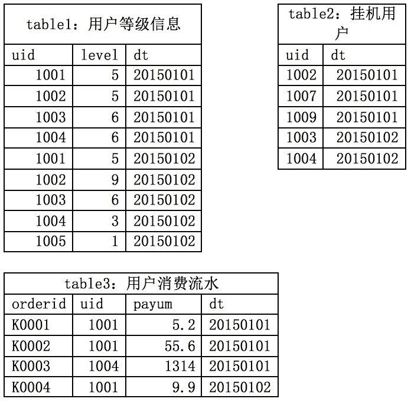

# 欢聚时代 2018 校招笔试题-web 前端 A 卷【成都场】

## 1

以下哪些选项用来描述用户数量：

正确答案: A   你的答案: 空 (错误)

```cpp
UV
```

```cpp
PV
```

```cpp
VV
```

```cpp
ARPU
```

本题知识点

欢聚集团 Java 工程师 C++工程师 iOS 工程师 安卓工程师 运维工程师 前端工程师 算法工程师 PHP 工程师 2018

## 2

以下哪些数据可以评估用户黏性？

正确答案: A C   你的答案: 空 (错误)

```cpp
留存数据
```

```cpp
当天活跃数据
```

```cpp
回访数据
```

```cpp
当天收入数据
```

本题知识点

欢聚集团 Java 工程师 C++工程师 iOS 工程师 安卓工程师 运维工程师 前端工程师 算法工程师 PHP 工程师 2018

## 3

以下哪些指标是渠道运营的关注重点：

正确答案: B D   你的答案: 空 (错误)

```cpp
推荐转化率
```

```cpp
ROI
```

```cpp
复购率
```

```cpp
新增用户数
```

本题知识点

欢聚集团 Java 工程师 C++工程师 iOS 工程师 安卓工程师 运维工程师 前端工程师 算法工程师 PHP 工程师 2018

## 4

以下哪些不是属于用户标识：

正确答案: C D   你的答案: 空 (错误)

```cpp
IMEI
```

```cpp
cookie
```

```cpp
经纬度
```

```cpp
年龄
```

```cpp
帐号
```

本题知识点

欢聚集团 Java 工程师 C++工程师 iOS 工程师 安卓工程师 运维工程师 前端工程师 算法工程师 PHP 工程师 2018

## 5

以下哪些不会影响数据结果的准确性：

正确答案: D   你的答案: 空 (错误)

```cpp
口径的合理及统一
```

```cpp
适当的建模方法
```

```cpp
数据的完整性
```

```cpp
存储使用的数据库类型
```

本题知识点

欢聚集团 Java 工程师 C++工程师 iOS 工程师 安卓工程师 运维工程师 前端工程师 算法工程师 PHP 工程师 2018

## 6

用户表 user 有多列，其中字段 id 中没有 null 值，字段 username 中存在 null 值，以下 sql 不能获得 user 表的总记录数的是：

正确答案: C   你的答案: 空 (错误)

```cpp
select count(*) from user;
```

```cpp
select count(id) from user;
```

```cpp
select count(username) from user;
```

```cpp
select count(1) from user;
```

本题知识点

欢聚集团 Java 工程师 C++工程师 iOS 工程师 安卓工程师 运维工程师 前端工程师 算法工程师 PHP 工程师 2018

## 7

观测宇宙中单位体积内星球的个数，属于什么分布：

正确答案: B   你的答案: 空 (错误)

```cpp
学生分布
```

```cpp
泊松分布
```

```cpp
正态分布
```

```cpp
二项分布
```

本题知识点

欢聚集团 Java 工程师 C++工程师 iOS 工程师 安卓工程师 运维工程师 前端工程师 算法工程师 PHP 工程师 2018

## 8

请找出数列 4，9，23，60，157 的下一项：

正确答案: D   你的答案: 空 (错误)

```cpp
411
```

```cpp
314
```

```cpp
425
```

```cpp
其他选项都错
```

本题知识点

欢聚集团 Java 工程师 C++工程师 iOS 工程师 安卓工程师 运维工程师 前端工程师 算法工程师 PHP 工程师 2018

讨论

[ganq](https://www.nowcoder.com/profile/1488802)

为什么不是 a

发表于 2018-07-06 20:08:26

* * *

[此时丶彼时](https://www.nowcoder.com/profile/8004193)

数列第 n 项 a[n]=3a[n-1]-a[n-2]，故下一项为 3*157-60=411，选 A

发表于 2018-08-21 23:40:34

* * *

## 9

以下哪个语法不是 R 的基础语言

正确答案: A B   你的答案: 空 (错误)

```cpp
proc glot
```

```cpp
select *from table
```

```cpp
kc&lt;-kmeans(data,3)
```

```cpp
print”hello world”
```

```cpp
sd&lt;-summary(data)
```

```cpp
import
```

本题知识点

欢聚集团 Java 工程师 C++工程师 iOS 工程师 安卓工程师 运维工程师 前端工程师 算法工程师 PHP 工程师 2018

## 10

关于销毁数据，以下哪些是错的：

正确答案: A B C   你的答案: 空 (错误)

```cpp
使用简单的删除或硬盘格式化命令可以彻底销毁数据；
```

```cpp
文件系统中删除的文件无法恢复
```

```cpp
多次覆写无法彻底销毁数据
```

```cpp
物理损坏/焚毁可以彻底销毁数据
```

```cpp
对磁盘消磁可以撤掉销毁数据
```

本题知识点

欢聚集团 Java 工程师 C++工程师 iOS 工程师 安卓工程师 运维工程师 前端工程师 算法工程师 PHP 工程师 2018

## 11

以下哪个不属于随机现象？

正确答案: A   你的答案: 空 (错误)

```cpp
查询平台上面的一个用户，曾经开播过还是未开播过
```

```cpp
抛硬币落地时，朝向是正面还是反面
```

```cpp
客服接到拨打热线的月来电量
```

```cpp
一盒子中有多种颜色的球，取出一个是白球
```

本题知识点

组合数学 *智力题 前端工程师 欢聚集团 2018 数学运算* *讨论

[131452zreo](https://www.nowcoder.com/profile/303529390)

在一定条件下，在个别试验或观察中呈现不确定性，但在大量重复试验或观察中其结果又具有一定规律性的[现象](https://baike.baidu.com/item/%E7%8E%B0%E8%B1%A1/2808631)，称为随机现象。

发表于 2018-10-15 22:59:32

* * *

[迟迟琰](https://www.nowcoder.com/profile/349536561)

c

发表于 2019-08-13 09:59:58

* * *

[ahprodite000](https://www.nowcoder.com/profile/684615483)

d 没说众多颜色中是否有白色

发表于 2019-07-29 18:22:03

* * *

## 12

X 服从区间（2，6）上的均匀分布，求对 X 进行 3 次独立观测中，至少有 2 次的观测值大于 3 的概率。

正确答案: A   你的答案: 空 (错误)

```cpp
0.84375
```

```cpp
0.75275
```

```cpp
0.65275
```

```cpp
0.80370
```

本题知识点

欢聚集团 Java 工程师 C++工程师 iOS 工程师 安卓工程师 运维工程师 前端工程师 算法工程师 PHP 工程师 2018

讨论

[sora!](https://www.nowcoder.com/profile/749045054)

3/4*3/4*3/4+3*3/4*3/4*1/4=54/64

发表于 2019-08-27 11:04:36

* * *

## 13

在 R 中定义函数 exec_str 正确答案: D   你的答案: 空 (错误)

```cpp
3⁴
```

```cpp
1
```

```cpp
-1
```

```cpp
81
```

本题知识点

欢聚集团 Java 工程师 C++工程师 iOS 工程师 安卓工程师 运维工程师 前端工程师 算法工程师 PHP 工程师 2018

讨论

[sora!](https://www.nowcoder.com/profile/749045054)

eval 函数：

通过计算 string 得到的值（如果有的话）。

说明

该方法只接受原始字符串作为参数，如果 string 参数不是原始字符串，那么该方法将不作任何改变地返回。因此请不要为 eval() 函数传递 String 对象来作为参数。

如果试图覆盖 eval 属性或把 eval() 方法赋予另一个属性，并通过该属性调用它，则 ECMAScript 实现允许抛出一个 EvalError 异常。

抛出

如果参数中没有合法的表达式和语句，则抛出 SyntaxError 异常。

如果非法调用 eval()，则抛出 EvalError 异常。

如果传递给 eval() 的 Javascript 代码生成了一个异常，eval() 将把该异常传递给调用者。

eval 函数会计算 string 中字符串表达式的值

发表于 2019-08-27 11:08:29

* * *

## 14

以下场景中，对应使用的挖掘算法不合适的是

正确答案: C   你的答案: 空 (错误)

```cpp
用关联规则算法分析出购买了啤酒的买家，是否适合推荐花生
```

```cpp
根据用户最近一年的交易日志数据，用 K-means 算法聚类出不同的用户群体
```

```cpp
根据用户最近几年的消费者来电量，用主成分分析法拟合出用户未来一个月可能的来电量
```

```cpp
根据用户最近购买的商品信息，用决策树算法识别出用户是否在一线城市
```

本题知识点

欢聚集团 Java 工程师 C++工程师 iOS 工程师 安卓工程师 运维工程师 前端工程师 算法工程师 PHP 工程师 2018

## 15

excel 工作簿 a 中有两列 id、age，工作簿 b 中有一列 id，需要找到工作薄 b 中 id 对应的 age，可用的函数包括

正确答案: A B   你的答案: 空 (错误)

```cpp
index+match
```

```cpp
vlookup
```

```cpp
hlookup
```

```cpp
find
```

```cpp
if
```

```cpp
like
```

本题知识点

欢聚集团 Java 工程师 C++工程师 iOS 工程师 安卓工程师 运维工程师 前端工程师 算法工程师 PHP 工程师 2018

## 16

请写出正态分布的概率密度函数 1

你的答案 (错误)

1 参考答案 (1) 无

本题知识点

欢聚集团 Java 工程师 前端工程师 算法工程师 PHP 工程师 2018

## 17

R 中生成符合正态分布随机数的函数是 1

你的答案 (错误)

1 参考答案 (1) rnorm

本题知识点

欢聚集团 Java 工程师 前端工程师 算法工程师 PHP 工程师 2018

## 18

在 excel 文档中，A1-A3 单元格的内容分别为：BBB8CK76-3MBH、7B1015665-1717EL、EB65E1E15-1CK。请写出 B1 单元格公式，确保公式下拖后，B1-B3 单元格的内容分别为 3MBH、1717EL、1CK。B1 单元格公式为 1

你的答案 (错误)

1 参考答案 (1) =RIGHT(A1,LEN(A1)-FIND(“-“,A1))

本题知识点

欢聚集团 Java 工程师 前端工程师 算法工程师 PHP 工程师 2018

讨论

[yuyu 果子](https://www.nowcoder.com/profile/998324902)

=RIGHT(A1,LEN(A1)-FIND("-",A1))

发表于 2019-01-05 12:20:46

* * *

## 19

一架电梯开始有 6 位乘客并且等可能的停在 10 层楼的每一层，求下列事件的概率：
（1）某一层有两位乘客离开
（2）没有两位及两位以上乘客在同一层离开
（3）恰有两位乘客在同一层离开
（4）至少有两位乘客在同一层离开

你的答案

本题知识点

欢聚集团 Java 工程师 C++工程师 iOS 工程师 安卓工程师 运维工程师 前端工程师 算法工程师 PHP 工程师 2018

## 20

向上抛一颗制造均匀对称的骰子，当它落地时，其向上的面出现的点数是一个随机变量ξ，求 Eξ,Dξ

你的答案

本题知识点

欢聚集团 Java 工程师 C++工程师 iOS 工程师 安卓工程师 运维工程师 前端工程师 算法工程师 PHP 工程师 2018

## 21

请介绍一种通过补缺处理缺失值的方法并简单阐述其原理

你的答案

本题知识点

欢聚集团 Java 工程师 C++工程师 iOS 工程师 安卓工程师 运维工程师 前端工程师 算法工程师 PHP 工程师 2018

## 22

请简要说明 SQL 中内连接，左连接，右连接，完全连接的区别？

你的答案

本题知识点

欢聚集团 Java 工程师 C++工程师 iOS 工程师 安卓工程师 运维工程师 前端工程师 算法工程师 PHP 工程师 2018

## 23

表 A 结构如下：
Member_ID(用户的 ID，字符型)
Log_time(用户访问页面时间，日期型(只有一天的数据))
URL(访问的页面地址，字符型)
要求：提取出每个用户访问的第一个 URL(按时间最早)，形成一个新表(新表名为 B，表结构和表 A 一致)

你的答案

本题知识点

欢聚集团 Java 工程师 C++工程师 iOS 工程师 安卓工程师 运维工程师 前端工程师 算法工程师 PHP 工程师 2018

讨论

[牛客 134441863 号](https://www.nowcoder.com/profile/134441863)

create table B as select Member_ID, min(log_time), URL from A group by Member_id;

发表于 2022-02-16 11:53:12

* * *

## 24

retain_2 是一个有 1500 行的数据框，其中的 ratio 变量的值符合正态分布，请提供一段 R 代码，对 ratio 变量在同一张图上作正态分布直方图及正态分布曲线。其中正态分布曲线要求为蓝色，线宽为 2。（注：不能使用本地 IDE）

你的答案

本题知识点

欢聚集团 Java 工程师 C++工程师 iOS 工程师 安卓工程师 运维工程师 前端工程师 算法工程师 PHP 工程师 2018

## 25

用一条 SQL 语句查询出每门课都大于 80 分的学生姓名
数据源如下：
name kecheng fenshu
张三 语文 81
张三 数学 75
李四 语文 76
李四 数学 90
王五 语文 81
王五 数学 100
王五 英语 90（注：不能使用本地 IDE）

你的答案

本题知识点

欢聚集团 Java 工程师 C++工程师 iOS 工程师 安卓工程师 运维工程师 前端工程师 算法工程师 PHP 工程师 2018

## 26

数据源：使用 MySQL 语言写出以下查询算法步骤：1、统计 20150101 当天各等级非挂机用户的消费总金额。2、统计 20150101 各等级用户中，在次日（20150102）仍维持该等级用户的占比。（注：不能使用本地 IDE） 

你的答案

本题知识点

欢聚集团 Java 工程师 C++工程师 iOS 工程师 安卓工程师 运维工程师 前端工程师 算法工程师 PHP 工程师 2018*