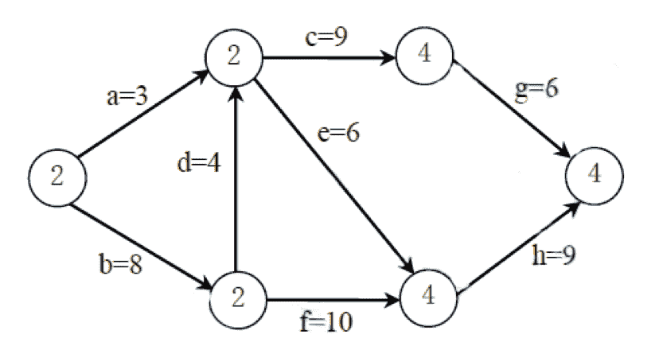

# 欢聚时代 2018 校招笔试题-C /C 音视频传输/推荐算法/测试开发 B 卷

## 1

定义指针常量
const char *cp = “Hello, World!”;
以下使用 C++强制类型转换的语句，能通过编译的有（ ）。

正确答案: A B C D   你的答案: 空 (错误)

```cpp
string= static_cast&lt;string&gt;(cp);&lt;/string&gt;
```

```cpp
charp = (char)cp;
```

```cpp
charp = const_cast&lt;char&gt;(cp);
```

```cpp
intp = reinterpret_cast&lt;int&gt; ((char*)cp);
```

本题知识点

欢聚集团 Java 工程师 C++工程师 iOS 工程师 安卓工程师 运维工程师 前端工程师 算法工程师 PHP 工程师 测试开发工程师 2018 C++

讨论

[乐砂](https://www.nowcoder.com/profile/517903666)

我也不会，所以搜了[`blog.csdn.net/Bob__yuan/article/details/88044361`](https://blog.csdn.net/Bob__yuan/article/details/88044361)

发表于 2020-08-19 10:11:24

* * *

[牛客 4938kunn](https://www.nowcoder.com/profile/820995325)

每次看到这种 HTML 语言表示都有点别扭。
A: string= static_cast<string>(cp);</string>
C: char p = const_cast<char>(cp);
D: int p = reinterpret_cast<int> ((char*)cp);

发表于 2021-05-22 16:24:45

* * *

## 2

None

正确答案: A B   你的答案: 空 (错误)

```cpp

```
ClassA a1;
ClassA a2(a1);
```cpp

```

```cpp

```
ClassA a1;
ClassA a2=a1;
```cpp

```

```cpp

```
ClassA a1, a2;
a1 = a2;
```cpp

```

```cpp

```
ClassAa1 = new ClassA();
ClassAa2 = a1;
```cpp

```

本题知识点

欢聚集团 Java 工程师 C++工程师 iOS 工程师 安卓工程师 运维工程师 算法工程师 PHP 工程师 测试开发工程师 2018

讨论

[QQ 冰雹](https://www.nowcoder.com/profile/546388684)

在什么情况下系统会调用拷贝构造函数：（三种情况）

（1）用类的一个对象去初始化另一个对象时

（2）当函数的形参是类的对象时（也就是值传递时），如果是引用传递则不会调用

（3）当函数的返回值是类的对象或引用时

发表于 2020-08-09 12:07:40

* * *

[T1ng](https://www.nowcoder.com/profile/3428732)

这是啥东西啊？看不懂

发表于 2021-04-25 17:33:32

* * *

[Shian](https://www.nowcoder.com/profile/413128889)

d 和 b 怎么区别？咋感觉效果是一样的咩

发表于 2021-05-14 18:12:14

* * *

## 3

已知函数 int fun( int i )。以下声明函数指针 pfunc 的语句正确的是：

正确答案: C   你的答案: 空 (错误)

```cpp
int*pfunc( int );
```

```cpp
int *pfunc( int )();
```

```cpp
int(*pfunc)(int);
```

```cpp
int(*pfunc)(int)();
```

本题知识点

欢聚集团 Java 工程师 C++工程师 iOS 工程师 安卓工程师 运维工程师 前端工程师 算法工程师 PHP 工程师 测试开发工程师 2018 C++ C 语言

讨论

[SZU_QicaiHuang](https://www.nowcoder.com/profile/985959958)

函数指针只需将函数名的位置换成指针即可。

发表于 2020-10-15 20:12:12

* * *

[M_xiaotao](https://www.nowcoder.com/profile/8465220)

这个太有迷惑作用了，只有一个选项，确是一个多选题

发表于 2020-08-02 08:05:40

* * *

[小阿花 Minty](https://www.nowcoder.com/profile/724882383)

A 括号优先级比*高，因此*pfunc( int )的意思是 pfunc 这个函数的参数是 int 类型，且函数的返回值为 int*类型 C (*pfunc)加了括号，因此这是一个取名为 pfunc 的指针，因此 int(*pfunc)(int)的意思是指向一个参数为 int 的函数，函数的返回值为 int，函数名未知。
BD 会报错

发表于 2020-09-12 22:22:39

* * *

## 4

Unix 操作系统中文件 File 的权限是 754，表示（）

正确答案: A B C E   你的答案: 空 (错误)

```cpp
文件属主可执行 File
```

```cpp
文件属主可读 File
```

```cpp
同组用户可写 File
```

```cpp
同组用户可执行 File
```

```cpp
其他用户可读 File
```

本题知识点

欢聚集团 Java 工程师 C++工程师 iOS 工程师 安卓工程师 运维工程师 前端工程师 算法工程师 PHP 工程师 测试开发工程师 2018

讨论

[高小武](https://www.nowcoder.com/profile/4793271)

答案很明显是存在问题的 7:111  所以就是 rwx   文件属主可以执行 读写和执行 5:101 所以就是 r-x    同组成员可以执行 读和执行 4:100 所以就是 r--    其他人可以执行读

发表于 2018-07-26 11:38:49

* * *

[深色浅色 56](https://www.nowcoder.com/profile/553042781)

答案有问题啊，同组成员应该是可读可执行

发表于 2019-09-20 20:05:23

* * *

[毅.L](https://www.nowcoder.com/profile/802601962)

答案错的，用户组可执行可读不可写

发表于 2019-09-09 16:49:02

* * *

## 5

数据链路层有以下哪些功能（）：

正确答案: A B C D   你的答案: 空 (错误)

```cpp
寻址
```

```cpp
流量控制
```

```cpp
差错控制
```

```cpp
实现透明传输
```

本题知识点

欢聚集团 Java 工程师 C++工程师 iOS 工程师 安卓工程师 运维工程师 前端工程师 算法工程师 PHP 工程师 测试开发工程师 2018

## 6

以下关于 HTTP 协议描述错误的是（ ）。

正确答案: A C D   你的答案: 空 (错误)

```cpp
定义了只有 GET/POST 两种与 Web 服务器交互的方法
```

```cpp
http 码 302 表示暂时性转移(Temporarily Moved)
```

```cpp
http1.1 是短连接模式，http2.0 在其基础上实现了持久连接和管线化操作功能
```

```cpp
http Header 和 Body 的分隔符是\n\n
```

本题知识点

欢聚集团 Java 工程师 C++工程师 iOS 工程师 安卓工程师 运维工程师 前端工程师 算法工程师 PHP 工程师 测试开发工程师 2018

## 7

下列 AOE 网表示一项包含 8 个活动的工程。通过同时加快若干进度可以缩短整个工程的工期。下列选项中，加快其进度就可以缩短工程工期的是（ ）。

正确答案: C   你的答案: 空 (错误)

```cpp
c 和 e
```

```cpp
d 和 c
```

```cpp
f 和 d
```

```cpp
f 和 h
```

本题知识点

欢聚集团 Java 工程师 C++工程师 iOS 工程师 安卓工程师 运维工程师 前端工程师 算法工程师 PHP 工程师 测试开发工程师 2018

## 8

对长度为 n 的线性表排序，在最坏情况下比较次数是 n（n－1）/2 的排序方法是（）。

正确答案: A B C   你的答案: 空 (错误)

```cpp
快速排序
```

```cpp
冒泡排序
```

```cpp
直接插入排序
```

```cpp
堆排序
```

本题知识点

欢聚集团 Java 工程师 C++工程师 iOS 工程师 安卓工程师 运维工程师 前端工程师 算法工程师 PHP 工程师 测试开发工程师 2018

## 9

已知某二叉树的后序遍历序列是 dabec，中序遍历序列是 debac，它的前序遍历是（）。

正确答案: D   你的答案: 空 (错误)

```cpp
acbed
```

```cpp
decab
```

```cpp
deabc
```

```cpp
cedba
```

本题知识点

欢聚集团 Java 工程师 C++工程师 iOS 工程师 安卓工程师 运维工程师 前端工程师 算法工程师 PHP 工程师 测试开发工程师 2018

## 10

字母表｛a,b｝上以 aa 打头任何符号串的集合，可用正规式表示为（）。

正确答案: C   你的答案: 空 (错误)

```cpp
aa(a|b)
```

```cpp
(a|b)*aa
```

```cpp
aa(a|b)*
```

```cpp
其他都不对
```

本题知识点

欢聚集团 Java 工程师 C++工程师 iOS 工程师 安卓工程师 运维工程师 前端工程师 算法工程师 PHP 工程师 测试开发工程师 2018

## 11

The 1keyword is intended to prevent the compiler from applying any optimizations on objects that can change in ways that cannot be determined by the compiler.（2 分）Sometimes there is requirement to modify one or more data members of class / struct through const function even though you don’t want the function to update other members of class / struct. This task can be easily performed by using2keyword.（1 分

你的答案 (错误)

12 参考答案 (1) volatile
(2) mutable

本题知识点

欢聚集团 Java 工程师 前端工程师 算法工程师 PHP 工程师 C++工程师 测试开发工程师 2018

## 12

用 push 表示入栈操作，用 pop 表示出栈操作。设有一个空栈，现有输入序列为 a、b、c、d，为了得到 a、c、d、b 的出栈顺序，相应的出栈和入栈操作序列为 1。

你的答案 (错误)

1 参考答案 (1) push(a) pop(a) push(b) push(c) pop(c) push(d) pop(d) pop(b)

本题知识点

欢聚集团 Java 工程师 前端工程师 算法工程师 PHP 工程师 C++工程师 测试开发工程师 2018

## 13

以下是链表删除节点的算法，请补全代码。

```cpp
DoubleNode* deleteTheNode(DoubleNode* head,int num)
{
	DoubleNode*p = head;
	if (p->data == num)
    {
        head = p->next;
        head->prev = NULL;
        free(p);
        return head;
    }

	while(p)
	{
		if (p->data == num)
        {
			1;
			p->next->prev = p->prev;
			free(p);
			return head;
        }
		p = p->next;
	}

	printf("not found!\n");
	return head;
}

```

你的答案 (错误)

1 参考答案 (1) p-&gt;prev-&gt;next = p-&gt;next

本题知识点

欢聚集团 Java 工程师 前端工程师 算法工程师 PHP 工程师 C++工程师 测试开发工程师 2018

## 14

前序遍历（DLR）为 A,B,C,D 的不同二叉树的个数是 1。

你的答案 (错误)

1 参考答案 (1) 14

本题知识点

欢聚集团 Java 工程师 前端工程师 算法工程师 PHP 工程师 C++工程师 测试开发工程师 2018

## 15

运行下面的程序，输出结果是：1。#include <iostream>#include <stdio.h>using namespace std;void f( int k ){if (k > 0){printf("%d ",k);f(k-2);f(k-1);}}int main(  ){f(5);return 0;}

你的答案 (错误)

1 参考答案 (1) 5 3 1 2 1 4 2 1 3 1 2 1

本题知识点

欢聚集团 Java 工程师 前端工程师 算法工程师 PHP 工程师 C++工程师 测试开发工程师 2018

## 16

直播网站后台有以下礼物消费信息表(GiftConsumeTable)，记录了用户给某个主播送礼流水：
（1）请用一条 sql 语句找出送出礼物 2 次或以上的用户 （5 分）
（2）请用一条 sql 语句找出送出 2 种或以上不同礼物的用户 (5 分)
（3）请用一条 sql 语句找出同一种礼物送过 2 次或以上的用户 (5 分)

你的答案

本题知识点

欢聚集团 Java 工程师 C++工程师 iOS 工程师 安卓工程师 运维工程师 前端工程师 算法工程师 PHP 工程师 测试开发工程师 2018

讨论

[2730597](https://www.nowcoder.com/profile/2730597)

1、select Uid from gift group by Uid having count(Uid) > 1;2、select Uid from gift group by Uid having count(distinct GiftName) > 1;3、select Uid from gift group by Uid, GiftName having count(Uid) > 1;

发表于 2018-09-14 15:10:20

* * *

## 17

设将 n(n>1)个整数存放到一维数组 R 中。设计一个在时间和空间两方面尽可能高效的算法。将 R 中的序列循环左移 P（0<P<n）个位置，即将 R 中的数据由（x0，x1，…，xn-1）变换为（xp，Xp+1，…，Xn-1，x0，x1，…，Xp-1）。要求：
（1）给出算法的基本设计思想。（5 分）
（2）根据设计思想，用程序设计语言描述算法，关键之处给出注释。（7 分）
（3）说明你所设计算法的时间复杂度和空间复杂度。（3 分）

你的答案

本题知识点

欢聚集团 Java 工程师 C++工程师 iOS 工程师 安卓工程师 运维工程师 前端工程师 算法工程师 PHP 工程师 测试开发工程师 2018

## 18

已有互斥锁类 LOCK，存在以下 public 接口：class LOCK{public:void Lock();void UnLock();};请基于 LOCK 类封装读写锁 RWLock，实现 ReadLock()/ReadUnlock()/WriteLock()/WriteUnlock()接口。（一个接口 5 分）可自行增加 private 成员。class RWLock{public:void ReadLock();void ReadunLock();void WriteLock();void WriteUnlock();private:};

你的答案

本题知识点

欢聚集团 Java 工程师 C++工程师 iOS 工程师 安卓工程师 运维工程师 前端工程师 算法工程师 PHP 工程师 测试开发工程师 2018

## 19

写一个程序对数组进行排序，要求返回结果是奇数在前，偶数在后。
奇数部分从小到大排列，偶数部分从大到小排列。（注：不能使用本地 IDE）

你的答案

本题知识点

欢聚集团 Java 工程师 C++工程师 iOS 工程师 安卓工程师 运维工程师 前端工程师 算法工程师 PHP 工程师 测试开发工程师 2018