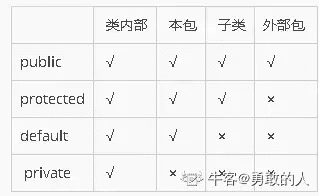
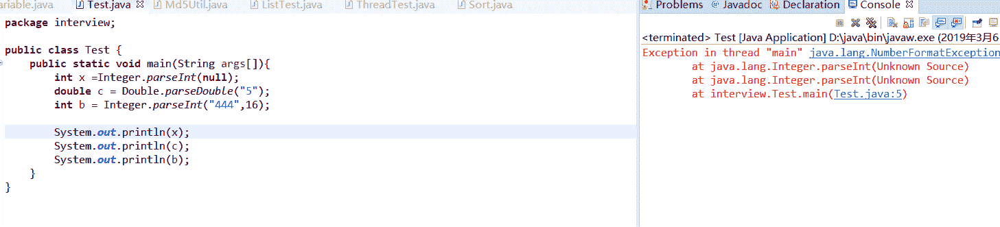

# 欢聚时代 2018 校招笔试题-Android A 卷

## 1

关于继承的描述，错误的是

正确答案: A B D   你的答案: 空 (错误)

```cpp
一个类可以继承多个实体类
```

```cpp
一个类可以继承多个抽象类
```

```cpp
一个类可以继承多个接口类
```

```cpp
子类不能访问父类的 protected 方法
```

本题知识点

欢聚集团 Java 工程师 C++工程师 iOS 工程师 安卓工程师 运维工程师 前端工程师 算法工程师 PHP 工程师 2018

讨论

[勇敢的人](https://www.nowcoder.com/profile/800342149)

楼上的图不太对

发表于 2020-10-10 10:35:27

* * *

[LaMer](https://www.nowcoder.com/profile/963755198)

| 同一类中 | 同一包中 | 子类中 | 不同包内 |
| --- | --- | --- | --- |
| public | √ | √ | √ | √ |
| protected | √ | √ | √ | × |
| default | √ | √ | × | × |
| private | √ | × | × | × |

注意：

*   子类与父类在不同包时父类中 private 和 default 类型的成员变量不会被子类继承，即子类只继承父类中 public 和 protected 类型的成员变量；
*   子类可重写父类中 protected 方法并将其可见性改为 public
*   当父类中的实例方法为可访问类型（public、protected）时子类才能重写该方法，若其为私有的则子类中相同签名的方法与其没有任何关系；
*   静态方法**可被继承**但**不能被覆盖**，若其在子类中被重新定义则其将被隐藏，并可通过父类.静态方法名调用；

发表于 2018-10-15 16:26:50

* * *

## 2

String 和 StringBuilder 描述正确的是？

正确答案: B C D   你的答案: 空 (错误)

```cpp
String 对字符串的操作更节省内存
```

```cpp
StringBuilder 的内容是可修改的
```

```cpp
StringBuilder 不是线程安全的
```

```cpp
对 json 的拼装操作应使用 StringBuilder
```

本题知识点

欢聚集团 Java 工程师 C++工程师 iOS 工程师 安卓工程师 运维工程师 前端工程师 算法工程师 PHP 工程师 2018

讨论

[尉迟涛](https://www.nowcoder.com/profile/707457511)

这题目太不严谨了

发表于 2020-04-23 21:26:00

* * *

## 3

关于 final,以下描述正确的是

正确答案: A C   你的答案: 空 (错误)

```cpp
final 修饰一个变量时，变量引用不可变
```

```cpp
final 修饰一个变量时，变量内容不可变
```

```cpp
final 修饰类的成员变量时，成员变量可以不在定义时初始化，而在构造函数中初始化
```

```cpp
final 修饰一个类的时候，该类的子类不能覆盖父类已实现的方法
```

本题知识点

欢聚集团 Java 工程师 C++工程师 iOS 工程师 安卓工程师 运维工程师 前端工程师 算法工程师 PHP 工程师 2018

讨论

[蛋蛋爱吃蛋糕蛋挞和鸡蛋](https://www.nowcoder.com/profile/337752169)

1：final 修饰类，则被修饰的类不能被继承。2：final 修饰成员变量，若变量是基本类型，则说明该变量的值不能改变；若变量是引用类型，则引用的地址不能改变，但引用所指向的对象内容是可以改变的。其次，定义为 final 的成员变量一定要赋初始值，初始值可以直接赋值，也可以在构造方法中赋值，但只能初始化一次。3：final 修饰方法，则说明该方法不能被重写。

发表于 2020-06-22 23:14:52

* * *

[LaMer](https://www.nowcoder.com/profile/963755198)

final 修饰的类不能被继承

发表于 2018-10-16 00:03:50

* * *

## 4

关于&和&&，描述正确的是

正确答案: A C D   你的答案: 空 (错误)

```cpp
对于&amp;和&amp;&amp;：当运算符两边的表达式为 true 时，结果均为 true，只要有一边运算结果为 false, 则结果均为 false
```

```cpp
如果运算符左边计算结果为 false,则&amp;不会再继续计算右边表达式值
```

```cpp
如果运算符左边计算结果为 false,则&amp;&amp;不会再继续计算右边表达式值
```

```cpp
&amp;可以作为位运算符，而&amp;&amp;不能
```

本题知识点

欢聚集团 Java 工程师 C++工程师 iOS 工程师 安卓工程师 运维工程师 前端工程师 算法工程师 PHP 工程师 2018

## 5

以下函数返回值正确的是：public int getVal(String str) {int val = 0;
try {
val = Integer.parseInt(str);
return val;
} catch (NumberFormatException e) {
return val;
}
finally {
val = -1;
}
}

正确答案: A   你的答案: 空 (错误)

```cpp
输入 str = &quot;10&quot;时，返回 10
```

```cpp
输入 str = null 时，返回-1
```

```cpp
输入 str = &quot;x&quot;时，返回-1
```

```cpp
输入 str = &quot;-2&quot;时，返回-1
```

本题知识点

欢聚集团 Java 工程师 C++工程师 iOS 工程师 安卓工程师 运维工程师 前端工程师 算法工程师 PHP 工程师 2018

讨论

[蛋蛋爱吃蛋糕蛋挞和鸡蛋](https://www.nowcoder.com/profile/337752169)

由于 try、catch 中都有 return 语句，所以其实 finally 语句是不会执行到的。

发表于 2020-06-22 23:20:38

* * *

[把牛妹带回家](https://www.nowcoder.com/profile/2967044)

finally 是幌子，因为早在前面就一定会 returnparseInt(str)如下

```cpp
 public static int parseInt(String s) throws NumberFormatException {
        return parseInt(s,10);
 }
```

在 parseInt(s,10)中有如下代码

```cpp
        if (s == null) {
            throw new NumberFormatException("null");
        }

```

s='x'时会判定出不是数字（比较复杂，就不解释了），从而抛出异常，返回 0s='-2'时返回-2
所以选 A

发表于 2019-09-07 16:32:19

* * *

[CoralRed](https://www.nowcoder.com/profile/1482531)

null 会抛异常

发表于 2019-03-06 18:15:19

* * *

## 6

关于 TCP 和 UDP，描述正确的是

正确答案: B D   你的答案: 空 (错误)

```cpp
TCP 每次收到的数据包与原始发送的数据包大小一致
```

```cpp
UDP 每次收到的数据包与原始发送的数据包大小一致
```

```cpp
UDP 可能丢包，但发送顺序和接收顺序一致
```

```cpp
UDP 比 TCP 有更高的传输效率
```

本题知识点

欢聚集团 Java 工程师 C++工程师 iOS 工程师 安卓工程师 运维工程师 前端工程师 算法工程师 PHP 工程师 2018

讨论

[蛋蛋爱吃蛋糕蛋挞和鸡蛋](https://www.nowcoder.com/profile/337752169)

UDP 是无连接协议，不可靠传输，在传输过程中并不需要先建立连接，也没有对传递的数据进行分组，所以传输数据包的大小与原始数据包大小一致；而 TCP 在传输时遵循三次握手、四次挥手的原则，同时在传输数据中要确认数据传递的准确性和完整性，由于传输效率要比 UDP 低。

发表于 2020-06-22 23:37:18

* * *

## 7

关于 post 的描述正确的是

正确答案: A C D   你的答案: 空 (错误)

```cpp
post 请求对数据长度没有限制
```

```cpp
post 有更高的效率
```

```cpp
post 有更高的安全性
```

```cpp
post 下层使用 TCP 链接
```

本题知识点

欢聚集团 Java 工程师 C++工程师 iOS 工程师 安卓工程师 运维工程师 前端工程师 算法工程师 PHP 工程师 2018

## 8

以下 activity 的启动模式,哪个允许有多个实例

正确答案: A B   你的答案: 空 (错误)

```cpp
standard
```

```cpp
singleTop
```

```cpp
singleTask
```

```cpp
singleInstance
```

本题知识点

欢聚集团 Java 工程师 C++工程师 iOS 工程师 安卓工程师 运维工程师 前端工程师 算法工程师 PHP 工程师 2018

## 9

Activity 启动 Service 时，下列的数据类型可以被传递的是

正确答案: A D   你的答案: 空 (错误)

```cpp
Serializable
```

```cpp
Activity
```

```cpp
Thread
```

```cpp
File
```

本题知识点

欢聚集团 Java 工程师 C++工程师 iOS 工程师 安卓工程师 运维工程师 前端工程师 算法工程师 PHP 工程师 2018

## 10

以下哪些情况可能导致内存泄漏

正确答案: A B D   你的答案: 空 (错误)

```cpp
Activity 匿名内部类未释放导致 Activity 泄漏
```

```cpp
Activity.getSystemService 可能导致 activity 泄漏
```

```cpp
Activity.startActivity 可能导致 Activity 泄漏
```

```cpp
单例导致内存泄漏
```

本题知识点

欢聚集团 Java 工程师 C++工程师 iOS 工程师 安卓工程师 运维工程师 前端工程师 算法工程师 PHP 工程师 2018

## 11

从 A 切换到 B activity 时，会依次调用 B 生命周期的 1 函数。

你的答案 (错误)

1 参考答案 (1) onCreate，onStart， onResume

本题知识点

欢聚集团 Java 工程师 前端工程师 算法工程师 PHP 工程师 安卓工程师 2018

## 12

abstract 关键字只能修饰 1,不能修饰 2

你的答案 (错误)

12 参考答案 (1) 类和方法/class、function
(2) 成员变量/member

本题知识点

欢聚集团 Java 工程师 C++工程师 算法工程师 PHP 工程师 安卓工程师 2018

## 13

一个有 i 层的二叉树，他的最小、最大节点数分别是 12

你的答案 (错误)

12 参考答案 (1) i
(2) 2^i - 1

本题知识点

欢聚集团 C++工程师 iOS 工程师 安卓工程师 算法工程师 2018

## 14

普通的 service 默认运行在 1 线程，IntentService 的 OnHandleIntent 运行在 2 线程

你的答案 (错误)

12 参考答案 (1) 主线程
(2) 异步线程/后台线程

本题知识点

欢聚集团 Java 工程师 前端工程师 算法工程师 PHP 工程师 安卓工程师 2018

## 15

如果切屏不需要重新调用 activity 各个生命周期，需要设置 configChanges 为 1.

你的答案 (错误)

1 参考答案 (1) orientation|keyboardHidden

本题知识点

欢聚集团 Java 工程师 前端工程师 算法工程师 PHP 工程师 安卓工程师 2018

## 16

Android 中多线程同步有哪些方法可以实现？A 为非 UI 线程，如何实现 A 在 UI 线程中同步执行一段代码

你的答案

本题知识点

欢聚集团 Java 工程师 C++工程师 iOS 工程师 安卓工程师 运维工程师 前端工程师 算法工程师 PHP 工程师 2018

讨论

[减肥一个月也不会变成小田切让](https://www.nowcoder.com/profile/7662098)

使用 Handler 来实现

发表于 2018-08-10 09:58:52

* * *

## 17

什么是代理模式？他有什么好处？ 描述一个使用代理模式的场景

你的答案

本题知识点

欢聚集团 Java 工程师 C++工程师 iOS 工程师 安卓工程师 运维工程师 前端工程师 算法工程师 PHP 工程师 2018

## 18

请从字符串中提取以最后一个[img]开头、以最后一个[\img]结尾的字符串，未找到匹配的字符串返回"null"

本题知识点

欢聚集团 Java 工程师 C++工程师 iOS 工程师 安卓工程师 运维工程师 前端工程师 算法工程师 PHP 工程师 字符串 *模拟 2018* *讨论

[shijiacheng](https://www.nowcoder.com/profile/179663)

```cpp
import java.util.Scanner;

/**
 * 请从字符串中提取以最后一个[img]开头、以最后一个[\img]结尾的字符串，
 * 未找到匹配的字符串返回"null"
 * 输入描述:
 * 可能包含[img][\img]的字符串
 * 输出描述:
 * 截取后的字符串
 * 输入例子 1:
 * bbb[img]ccc[img]ddd[\img]eee[\img]
 * 输出例子 1:
 * [img]ddd[\img]eee[\img]
 */
public class Main {

    public static void main(String[] args) {
        Scanner sc = new Scanner(System.in);
        String str = sc.nextLine();
        System.out.println(findImageStr(str));

    }

    public static String findImageStr(String str) {
        if (str == null) {
            return "null";
        }
        int start = str.lastIndexOf("[img]");
        int end = str.lastIndexOf("[\\img]");

        if (start > -1 && end > -1 && start < end) {
            return str.substring(start, end+6);
        } else {
            return "null";
        }
    }
} 
```

发表于 2018-07-08 19:08:07

* * *

[小路远](https://www.nowcoder.com/profile/914598596)

```cpp
a = input()
startTag, endTag = "[img]","[\img]"
result = "null"
reverse_a = a[::-1]
for i in range(len(a)-6):
    if reverse_a[i:i+6] == endTag[::-1]:
        for j in range(i+6,len(a)-5):
            if reverse_a[j:j+5] == startTag[::-1]:
                result = reverse_a[i:j+5][::-1]
                break
        break
print(result)
```

发表于 2021-04-12 18:02:04

* * *

[Jayson-zys](https://www.nowcoder.com/profile/1654457)

```cpp
import java.util.*;

public class Main {

    public static void main(String[] args) {
        Scanner in = new Scanner(System.in);
        String s = in.nextLine();
        int i = s.lastIndexOf("[img]");
        int j = s.lastIndexOf("[\\img]");
        if (i == -1 || j == -1 || i > j) {
            System.out.println("null");
        } else {
            String res = s.substring(i, j + 6);
            System.out.println(res);
        }
    }
}
```

发表于 2019-09-07 20:39:59

* * *

## 19

请从字符串中找出至少重复一次的子字符串的最大长度

本题知识点

欢聚集团 Java 工程师 C++工程师 iOS 工程师 安卓工程师 运维工程师 前端工程师 算法工程师 PHP 工程师 字符串 *哈希 *模拟 穷举 2018** **讨论

[shijiacheng](https://www.nowcoder.com/profile/179663)

```cpp
import java.util.Scanner;

/**
 * 请从字符串中找出至少重复一次的子字符串的最大长度
 * 输入描述:
 * 字符串，长度不超过 1000
 * 输出描述:
 * 重复子串的长度，不存在输出 0
 * 输入例子 1:
 * ababcdabcefsgg
 * 输出例子 1:
 * 3
 */
public class Main {

    public static void main(String[] args) {
        Scanner sc = new Scanner(System.in);
        int count = findLongestRepeatStr(sc.nextLine());
        System.out.println(count + "");
    }

    public static int findLongestRepeatStr(String str) {
        int len = str.length();

        int array[][] = new int[len + 1][len + 1];
        for (int m = 0; m < len; m++) {

            for (int n = 0; n < len; n++) {
                if (str.charAt(m) == str.charAt(n))
                    array[m + 1][n + 1] = array[m][n] + 1;

            }

        }

        int max = 0;
        for (int m = 0; m < len + 1; m++) {

            for (int n = 0; n < len + 1; n++) {
                if ((m != n) && (array[m][n] > max))
                    max = array[m][n];
            }

        }

        return max;

    }
} 
```

发表于 2018-07-08 19:08:35

* * *

[小黄猪](https://www.nowcoder.com/profile/7043905)

import java.util.Scanner;

public class Main {
    Main() {
        Scanner scanner = new Scanner(System.in);
        String str = scanner.nextLine();
        int max=0;
        String temp;
        for (int i = 1; i <str.length() ; i++) {//子串长度
            for (int k = 0; k < str.length()-i; k++) {//
                temp=str.substring(k, k + i);
                if (str.substring(0, k).contains(temp) || str.substring(k+i).contains(temp)) {//字符串中：子串前和后有没有和子串一样的子串
                    if(max<temp.length()) max = temp.length();
                }
            }
        }
        System.out.println(max);
    }    public static void main(String[] args) {
        new Main();
    }

}

发表于 2018-08-14 14:01:47

* * *

[牛客 6481049 号](https://www.nowcoder.com/profile/6481049)

```cpp
#include <iostream>
#include <string>
#include <vector>

using namespace std;

inline int getResult(const string& str) {
    int len = str.size();
    vector<vector<int>> arr;
    arr.resize(len);
    for(int n = 0 ; n < len; ++n) {
        arr[n].resize(len);
    }
    for(int i = 0; i < len;++i) {
        for(int j = 0 ; j < len;++j) {
            if(str[i] == str[j]) {
                arr[i][j] = (i - 1 >= 0 && j - 1 >= 0) ? arr[i - 1][j - 1] + 1 : 1;
            }
        }
    }

    auto max = 0;
    for(int i = 0; i < len;++i) {
        for(int j = 0 ; j < len;++j) {
            if(i != j && arr[i][j] > max) {
                max = arr[i][j];
            }
        }
    }
    return max;
}

int main() {
    string str;
    while(cin>>str) {
        auto res = getResult(str);
        cout<<res<<endl;
    }

}

```

发表于 2018-07-09 20:38:17

* * ****