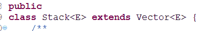
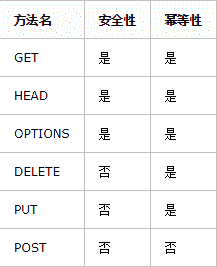

# 欢聚时代 2018 校招笔试题-Android B 卷

## 1

Java 中主要有如下几种类型的变量

正确答案: A B C   你的答案: 空 (错误)

```cpp
局部变量
```

```cpp
类变量（静态变量）
```

```cpp
成员变量（非静态变量）
```

```cpp
方法变量
```

本题知识点

欢聚集团 Java 工程师 C++工程师 iOS 工程师 安卓工程师 运维工程师 前端工程师 算法工程师 PHP 工程师 2018

## 2

Java 中关于枚举描述正确的是？

正确答案: B C   你的答案: 空 (错误)

```cpp
jdk1.5 后，switch 语句不支持 enum 类型
```

```cpp
所有的枚举值都是 public static final 的，且非抽象的枚举类不能再派生子类
```

```cpp
带有构造方法的枚举，构造方法为不能为 public
```

```cpp
枚举最多只能拥有一个构造方法
```

本题知识点

欢聚集团 Java 工程师 C++工程师 iOS 工程师 安卓工程师 运维工程师 前端工程师 算法工程师 PHP 工程师 2018

讨论

[蒲蒲](https://www.nowcoder.com/profile/8262316)

 ***   ```cpp
    jdk1.5 后，switch 语句开始支持 enum 类型

    ```

*   ```cpp
    所有的枚举值都是 public static final 的，且非抽象的枚举类不能再派生子类
    ```

*   ```cpp
    带有构造方法的枚举，构造方法为只能为 private，
    ```

*   ```cpp
    枚举类可以拥有多个构造方法
    ```** 

发表于 2019-04-10 23:17:58

* * *

[差不多先生高配版](https://www.nowcoder.com/profile/3658149)

带构造方法的枚举，其构造方法访问修饰符只能为 private，如下：
public enum EOrderTyper {
/**

```cpp
 * 无效的订单类型
 */
Invalid(-1,"无效的订单类型"),

/**
 * 一般订单
 */
NormalOrder(0, "一般订单"),

/**
 * 虚拟礼品卡订单
 */
VDDmoney(50, "虚拟订单"),

/**
 * 实物礼品卡订单
 */
PDDmoney(51, "礼品卡订单");
private int orderType;
private String description;
private EOrderTyper(int type, String desc) {
    this.orderType = type;
    this.description = desc;
}

public int getOrderType() {
    return this.orderType;
}

public String getDescription() {
    return this.description;
} 
```

}

发表于 2018-09-17 16:02:50

* * *

## 3

下列方法中哪些是线程拥有的方法？

正确答案: A B   你的答案: 空 (错误)

```cpp
run()
```

```cpp
sleep()
```

```cpp
stop()
```

```cpp
continue()
```

本题知识点

欢聚集团 Java 工程师 C++工程师 iOS 工程师 安卓工程师 运维工程师 前端工程师 算法工程师 PHP 工程师 2018

## 4

关于内部类 往 OuterClass 类的代码段中插入内部类声明, 哪一个是错误的:public class OuterClass{private float f=1.0f;
//插入代码到这里
}

正确答案: A B C D   你的答案: 空 (错误)

```cpp
class InnerClass{ public static float func(){return f;} }
```

```cpp
abstract class InnerClass{ public abstract float func(){} }
```

```cpp
static class InnerClass{ protected static float func(){return f;} }
```

```cpp
public class InnerClass{  static float func(){return f;} }
```

本题知识点

欢聚集团 Java 工程师 C++工程师 iOS 工程师 安卓工程师 运维工程师 前端工程师 算法工程师 PHP 工程师 2018

讨论

[cjhcf](https://www.nowcoder.com/profile/6593894)

成员内部类无法声明静态成员，除非为 final static。抽象方法无方法体，去掉｛｝

编辑于 2019-07-08 09:54:06

* * *

[差不多先生高配版](https://www.nowcoder.com/profile/3658149)

B 中，抽象方法需要去掉{}，否则则表示这是一个空方法而非抽象方法。应改为 public abstract float func();

编辑于 2018-09-17 16:07:56

* * *

## 5

以下集合对象中哪几个是线程安全的？

正确答案: B C D   你的答案: 空 (错误)

```cpp
ArrayList
```

```cpp
Vector
```

```cpp
Hashtable
```

```cpp
Stack
```

本题知识点

欢聚集团 Java 工程师 C++工程师 iOS 工程师 安卓工程师 运维工程师 前端工程师 算法工程师 PHP 工程师 2018

讨论

[差不多先生高配版](https://www.nowcoder.com/profile/3658149)

线程安全的集合有 vector，hashtable，StringBuffer，concurrentHashMap。同时，vector 是 stack 的父类（见 java 源码）。

编辑于 2018-09-17 16:16:34

* * *

## 6

关于 java 内存的描述不正确的是

正确答案: A D   你的答案: 空 (错误)

```cpp
java 中有 GC 机制，所以不会出现内存溢出的情况
```

```cpp
有弱引用的对象，不管当前内存空间足够与否，都会回收它的内存
```

```cpp
当 GC 执行时，会挂起其他线程的工作
```

```cpp
当开发人员把一个成员变量置空后，该对象占用的内存空间就会立马释放
```

本题知识点

欢聚集团 Java 工程师 C++工程师 iOS 工程师 安卓工程师 运维工程师 前端工程师 算法工程师 PHP 工程师 2018

讨论

[差不多先生高配版](https://www.nowcoder.com/profile/3658149)

D 将变量赋值 null，只是提示 GC 这个对象可以被回收，但是内存空间什么时候被释放由系统决定，不可预计。甚至调用 System.gc（）也不一定执行内存回收。

发表于 2018-09-17 16:22:18

* * *

## 7

关于 http 请求里 post 和 get 描述正确的是

正确答案: A C D   你的答案: 空 (错误)

```cpp
POST 请求的数据不会暴露在地址栏中
```

```cpp
GET 请求的 URL 中不能携带数据参数
```

```cpp
根据 HTTP 规范，POST 表示可能修改变服务器上的资源的请求
```

```cpp
根据 HTTP 规范，GET 用于信息获取，而且应该是安全的和幂等的
```

本题知识点

欢聚集团 Java 工程师 C++工程师 iOS 工程师 安卓工程师 运维工程师 前端工程师 算法工程师 PHP 工程师 2018

讨论

[麻叶绿了和小轩窗](https://www.nowcoder.com/profile/8352165)

安全性指的是多次调用不会产生副作用，即不会对访问数据进行修改。幂等性指的是多次调用可获得相同的数据。

发表于 2019-10-11 23:23:44

* * *

## 8

android 提供的跨进程通讯方式有哪些

正确答案: A B C   你的答案: 空 (错误)

```cpp
Content Provider
```

```cpp
Broadcast
```

```cpp
AIDL
```

```cpp
service
```

本题知识点

欢聚集团 Java 工程师 C++工程师 iOS 工程师 安卓工程师 运维工程师 前端工程师 算法工程师 PHP 工程师 2018

讨论

[凱琪](https://www.nowcoder.com/profile/9138978)

service 不是可以通过 Binder 来进行进程通讯吗。。怎么错了？？？？

发表于 2018-08-10 22:44:56

* * *

## 9

android 的 view 控件从被创建到显示，会经过以下哪些方法

正确答案: A B D   你的答案: 空 (错误)

```cpp
onDraw
```

```cpp
onMeasure
```

```cpp
onAdd
```

```cpp
onLayout
```

本题知识点

欢聚集团 Java 工程师 C++工程师 iOS 工程师 安卓工程师 运维工程师 前端工程师 算法工程师 PHP 工程师 2018

## 10

关于 androidMainifast.xml 描述正确的是

正确答案: B D   你的答案: 空 (错误)

```cpp
一个工程内只可以存在一个 androidMainifast.xml 文件
```

```cpp
工程里的 androidMainifast.xml 可以在注册多个程序入口，并可以在桌面显示的对应程序入口的图标
```

```cpp
如果声明了 package=&quot;com.duowan.mobile”，那么里面的 Activity 必须存放在 com.duowan.mobile 包路径下
```

```cpp
receiver 下可以注册多个不同的 intent-filter
```

本题知识点

欢聚集团 Java 工程师 C++工程师 iOS 工程师 安卓工程师 运维工程师 前端工程师 算法工程师 PHP 工程师 2018

讨论

[麻叶绿了和小轩窗](https://www.nowcoder.com/profile/8352165)

package 属性是指定 Java 主程序的包名，同时也是该进程的默认进程名

发表于 2019-10-11 23:35:41

* * *

## 11

从 A 切换到 B Fragment 时，会依次调用 B 生命周期的 1 函数

你的答案 (错误)

1 参考答案 (1) onCreate，onCreateView ，onStart， onResume

本题知识点

欢聚集团 C++工程师 iOS 工程师 安卓工程师 运维工程师 2018

讨论

[凱琪](https://www.nowcoder.com/profile/9138978)

onCreate，onCreateView ，onActivityCreated，onStart， onResume

发表于 2018-08-10 23:45:23

* * *

## 12

泛型作用于 1(编译／运行时)阶段，成功编译过后的 class 文件中是 2（包含／不包含）任何泛型信息的

你的答案 (错误)

12 参考答案 (1) 编译
(2) 不包含

本题知识点

欢聚集团 Java 工程师 C++工程师 iOS 工程师 PHP 工程师 安卓工程师 2018

## 13

一个有 i 层的二叉树，他的最小、最大节点数分别是 1,2

你的答案 (错误)

12 参考答案 (1) i
(2) 2^i - 1

本题知识点

欢聚集团 Java 工程师 C++工程师 iOS 工程师 PHP 工程师 安卓工程师 2018

## 14

android 中解析 XML 主要有三种方式 123

你的答案 (错误)

123 参考答案 (1) SAX
(2) DOM
(3) PULL

本题知识点

欢聚集团 C++工程师 iOS 工程师 安卓工程师 算法工程师 2018

## 15

一个 Handler 允许发送和处理 1 或者 2 对象，并且会关联到主线程的 MessageQueue 中。

你的答案 (错误)

12 参考答案 (1) Message
(2) Runnable

本题知识点

欢聚集团 Java 工程师 安卓工程师 算法工程师 PHP 工程师 2018

## 16

Override 和 Overload 的区别

你的答案

本题知识点

欢聚集团 Java 工程师 C++工程师 iOS 工程师 安卓工程师 运维工程师 前端工程师 算法工程师 PHP 工程师 2018

## 17

什么是职责链（责任链）模式？他有什么好处？ 描述一个使用职责链模式的场景

你的答案

本题知识点

欢聚集团 Java 工程师 C++工程师 iOS 工程师 安卓工程师 运维工程师 前端工程师 算法工程师 PHP 工程师 2018

## 18

回形数是一个矩阵输出，从矩阵的左上角往右开始打印数字 0，遇到矩阵边界时，顺时针 90 方向继续打印，并数字增长 1，如此类推直到把矩阵填满，输入一个整形宽和高单位，每输出一个数字，占用 1 单位宽高空间，根据入参打印出对应的回形数

本题知识点

欢聚集团 Java 工程师 C++工程师 iOS 工程师 安卓工程师 运维工程师 前端工程师 算法工程师 PHP 工程师 数组 模拟 2018

讨论

[shijiacheng](https://www.nowcoder.com/profile/179663)

```cpp
import java.util.Scanner;

/**
 * 欢聚时代 2018 校招笔试题-Android B 卷 打印回形数
 * 回形数是一个矩阵输出，从矩阵的左上角往右开始打印数字 0，遇到矩阵边界时，顺时针 90 方向
 * 继续打印，并数字增长 1，如此类推直到把矩阵填满，输入一个整形宽和高单位，每输出一个数
 * 字，占用 1 单位宽高空间，根据入参打印出对应的回形数
 * 输入描述:
 * 矩阵的宽高
 * 输出描述:
 * 回字形的矩阵
 * 输入例子 1:
 * 8 3
 * 输出例子 1:
 * 00000000
 * 34444441
 * 22222221
 */
public class PrintBackMatrix {
    public static void main(String[] args) {
        Scanner sc = new Scanner(System.in);
        int col = sc.nextInt();
        int row = sc.nextInt();
        printMatrix(col, row);
    }

    public static void printMatrix(int columns, int rows) {
        int[][] matrix = new int[rows][columns];
        int start = 0;
        while (columns > start * 2 && rows > start * 2) {
            printMatrixInCircle(matrix, columns, rows, start);
            start++;
        }

        int m = matrix.length;

        for (int i = 0; i < rows; i++) {
            for (int j = 0; j < columns; j++) {
                System.out.print(matrix[i][j]);
            }
            System.out.println();
        }
    }

    public static void printMatrixInCircle(int[][] matrix, int columns, int rows,
                                           int start) {
        int endX = columns - 1 - start;
        int endY = rows - 1 - start;

        int num = 0;

        //第一步：从左到右打印一行
        for (int i = start; i <= endX; i++) {
            matrix[start][i] = start * 4 + num;
        }

        num++;
        //第二步：从上到下打印一列
        if (start < endY) {
            for (int i = start + 1; i <= endY; i++) {
                matrix[i][endX] = start * 4 + num;
            }
        }
        num++;
        //第三步：从右到左打印一行
        if (start < endX && start < endY) {
            for (int i = endX - 1; i >= start; i--) {
                matrix[endY][i] = start * 4 + num;
            }
        }
        num++;
        //第四步：从下到上打印一列
        if (start < endX && start < endY - 1) {
            for (int i = endY - 1; i >= start + 1; i--) {
                matrix[i][start] = start * 4 + num;
            }
        }
        num = 0;
    }
} 
```

发表于 2018-07-09 21:20:36

* * *

[向宇回桌](https://www.nowcoder.com/profile/520872)

入门题。。

```cpp
import java.util.*;

public class Main {
    private static int MAX = (int) 10e5+5;
    private static int INT_MAX = 0x3f3f3f3f;
    public static void main(String[] args) {
        Scanner sc = new Scanner(System.in);
        int m = sc.nextInt(), n = sc.nextInt();
        int count = 0;
        int[][] map = new int[n][m];
        for (int i=0; i!=n; i++) {
            for (int j=0; j!=m; j++) {
                map[i][j] = -1;
            }
        }
        int i = 0, j = -1; int now = 0;
        while (count < m * n) {
            while (j+1<m && map[i][j+1]==-1 && count < m*n) { map[i][++j] = now; count++; } now++;
            while (i+1<n && map[i+1][j]==-1 && count < m*n) { map[++i][j] = now; count++; } now++;
            while (j-1>=0 && map[i][j-1]==-1 && count < m*n) { map[i][--j] = now; count++; } now++;
            while (i-1>=0 && map[i-1][j]==-1 && count < m*n) { map[--i][j] = now; count++; } now++;
        }
        StringBuilder sb = new StringBuilder();
        for (i=0; i!=n; i++) {
            for (j=0; j!=m; j++) {
                sb.append(map[i][j]);
            }
            sb.append("\n");
        }
        System.out.print(sb.toString());
        return;
    }
} 
```

编辑于 2019-02-11 01:34:05

* * *

[零葬](https://www.nowcoder.com/profile/75718849)

直接上模拟边界法

```cpp
import java.lang.String;
import java.io.BufferedReader;
import java.io.InputStreamReader;
import java.io.IOException;

public class Main {
    public static void main(String[] args) throws IOException {
        BufferedReader br = new BufferedReader(new InputStreamReader(System.in));
        String line;
        while((line = br.readLine()) != null) {
            String[] strWH = line.split(" ");
            int h = Integer.parseInt(strWH[1]), w = Integer.parseInt(strWH[0]);
            solve(h, w);
        }
    }

    private static void solve(int m, int n) {
        int[][] arr = new int[m][n];
        int idx = 0, start = 0;
        int left = 0, right = n - 1, top = 0, bottom = m - 1;
        while(idx <= m * n){
            for(int i = left; i <= right; i++){
                arr[top][i] = start;
                idx ++;
            }
            top ++;
            if(top > bottom) break;
            start ++;
            for(int i = top; i <= bottom; i++){
                arr[i][right] = start;
                idx ++;
            }
            right --;
            if(left > right) break;
            start ++;
            for(int i = right; i >= left; i--){
                arr[bottom][i] = start;
                idx ++;
            }
            bottom --;
            if(top > bottom) break;
            start ++;
            for(int i = bottom; i >= top; i--){
                arr[i][left] = start;
                idx ++;
            }
            left ++;
            if(left > right) break;
            start ++;
        }
        StringBuilder sb;
        for(int i = 0; i < m; i++){
            sb = new StringBuilder();
            for(int j = 0; j < n; j++)
                sb.append(arr[i][j]);
            System.out.println(sb.toString());
        }
    }
}
```

编辑于 2020-11-30 17:08:01

* * *

## 19

如果我们列出 10 以内所有 3 或 5 的倍数，我们将得到 3、5、6 和 9，这些数的和是 23。求 n 以内所有 3 或 5 的倍数的和。

本题知识点

欢聚集团 Java 工程师 C++工程师 iOS 工程师 安卓工程师 运维工程师 前端工程师 算法工程师 PHP 工程师 数学 穷举 2018

讨论

[shijiacheng](https://www.nowcoder.com/profile/179663)

```cpp
import java.util.Scanner;

/**
 * 欢聚时代 2018 校招笔试题-Android B 卷
 * 如果我们列出 10 以内所有 3 或 5 的倍数，我们将得到 3、5、6 和 9，这些数的和是 23。
 * 求 n 以内所有 3 或 5 的倍数的和。
 * 输入描述:
 * 输入 n，n 不超过 2000
 * 输出描述:
 * 输出 n 以内 3 或 5 倍数的和
 * 输入例子 1:
 * 10
 * 输出例子 1:
 * 23
 */
public class MultiplesOf3And5 {

    public static void main(String[] args){
        Scanner sc = new Scanner(System.in);
        int n = sc.nextInt();
        int sum = getSum(n,3)+getSum(n,5)-getSum(n,15);
        System.out.println(sum);

    }

    /**
     * @param n 输入的 n
     * @param a a 的倍数
     */
    public static int getSum(int n,int a){
        if (a>=n){
            return 0;
        }
        int sum = (a + ((n-1)/a)*a)*((n-1)/a)/2;
        return sum;
    }
}
```

编辑于 2021-09-30 11:35:18

* * *

[公众号「我不是匠人」](https://www.nowcoder.com/profile/936070)

```cpp
#include <iostream>
#include <algorithm>
#include <cstring>
#include <vector>
using namespace std;
int main(){
	int n, sum = 0;
	scanf("%d", &n);

	int i = 1, j = 1, t = 0;
	while(i*3 <= n && j*5 <= n){
		t = min(i*3, j*5);
		sum += t;
		if(i*3 == t) i++;
		if(j*5 == t) j++; 
	}
	printf("%d", sum);
	return 0;
}
```

编辑于 2021-09-30 11:35:25

* * *

[无心 2019](https://www.nowcoder.com/profile/991674511)

```cpp
#include <bits/stdc++.h>
using namespace std; 
int main()
{
    int n,res=0;
    cin>>n;
    vector<int>a;
    for(int i=3;i<n;i++)
        if(i%3==0||i%5==0)
            res+=i;
    if(n==1000)
        cout<<167835<<endl;
    else
        cout<<res<<endl;
    return 0;
}

```

发表于 2019-06-19 10:39:31

* * *