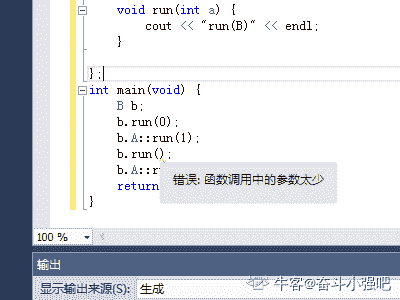

# 欢聚时代 2018 校招笔试题-C /C 音视频传输/推荐算法/测试开发 A 卷

## 1

struct 和 class 的区别

正确答案: A C   你的答案: 空 (错误)

```cpp
struct 的成员默认是公有的
```

```cpp
class 的成员默认是公有的
```

```cpp
class 继承默认是私有继承
```

```cpp
struct 继承默认是私有继承
```

本题知识点

欢聚集团 Java 工程师 C++工程师 iOS 工程师 安卓工程师 运维工程师 前端工程师 算法工程师 PHP 工程师 测试开发工程师 2018 C++

讨论

[我的昵称呢呢](https://www.nowcoder.com/profile/160323705)

最本质的区别在于：struct 的默认继承权限和默认访问权限是 public，而 class 的默认继承权限和默认访问权限是 private。

此外，“class”这个关键字还用于定义模板参数，就像“typename”。但关键字“struct”不用于定义模板参数。

所以，struct 更适合看成是一个数据结构的实现体，class 更适合看成是一个对象的实现体。

发表于 2019-09-12 14:18:07

* * *

[牛客 506194496 号](https://www.nowcoder.com/profile/506194496)

class 成员默认是 private，struct 成员默认是 public。class 默认是 private 继承，struct 默认是 public 继承。

发表于 2021-08-16 19:19:53

* * *

[yes~yes~](https://www.nowcoder.com/profile/458799717)

在 C++中 class 和 struct 都可以定义类
区别在于：

*   struct 成员默认访问方式是 public，
*   class 的默认成员访问方式是 private

发表于 2019-09-05 09:59:25

* * *

## 2

以下关于类占用内存空间的说法正确的是

正确答案: A B C D   你的答案: 空 (错误)

```cpp
类所占内存的大小是由成员变量（静态变量除外）和虚拟函数表指针空间（若有虚函数）所决定
```

```cpp
空类的内存大小是１个字节
```

```cpp
类中无论有多少个虚函数，只会多占一个虚表指针空间
```

```cpp
子类的内存大小等于父类的内存大小加上子类独有成员变量的内存大小
```

本题知识点

欢聚集团 C++工程师 2018 C++

讨论

[我的昵称呢呢](https://www.nowcoder.com/profile/160323705)

空类会占用 1 字节的内存空间，原因是 C++要求每个实例在内存中都有独一无二的地址。

（一）类内部的成员变量：

普通的变量：要占用内存的，要注意对齐原则（这点和 struct 类型很相似）。

static 修饰的静态变量：不占用内存，原因是编译器将其放在全局变量区。

（二）类内部的成员函数：

普通函数：不占用内存。

虚函数：占用 4 个字节，用来指定虚函数表的入口地址。所以一个类的虚函数所占用的地址是不变的，和虚函数的个数没有关系。

发表于 2019-09-12 14:37:31

* * *

[六岁小孩惨遭七名老师轮流布置作业](https://www.nowcoder.com/profile/977060823)

空的类是会占用内存空间的，而且大小是 1，原因是 C++要求每个实例在内存中都有独一无二的地址。 类内部的成员变量： 普通的变量：是要占用内存的，但是要注意对齐原则（这点和 struct 类型很相似）。 static 修饰的静态变量：不占用内容，原因是编译器将其放在全局变量区。 类内部的成员函数： 普通函数：不占用内存。 虚函数：要占用 4 个字节，用来指定虚函数的虚拟函数表的入口地址。所以一个类的虚函数所占用的地址是不变的，和虚函数的个数是没有关系的 注意:系统为了提高实例在内存中的存取效率，类的大小会被调整到系统整数倍，如 5 会被调整到 8

发表于 2018-08-30 19:04:43

* * *

[MissLove](https://www.nowcoder.com/profile/649453)

A 不对吧，有无虚函数也是个吧？

发表于 2021-02-02 22:47:41

* * *

## 3

以下关于类初始化成员变量的描述正确的是

正确答案: B C D   你的答案: 空 (错误)

```cpp
static 成员变量可在类定义内初始化
```

```cpp
const 成员变量必须在构造函数的初始化列表中初始化
```

```cpp
成员变量可以在构造函数中初始化
```

```cpp
数组成员是不能在初始化列表里初始化的
```

本题知识点

欢聚集团 Java 工程师 C++工程师 iOS 工程师 安卓工程师 运维工程师 前端工程师 算法工程师 PHP 工程师 测试开发工程师 2018 C++

讨论

[liuzhen007](https://www.nowcoder.com/profile/873052646)

A 选项，static 成员变量可在类定义内声明，但是必须在类外初始化。为了避免多文件同时引用同一个头文件时，重复定义的问题，比如静态全局变量是全局唯一的。

发表于 2021-02-25 08:47:48

* * *

[毅.L](https://www.nowcoder.com/profile/802601962)

《C++ Primer》中提到在以下三种情况下需要使用初始化成员列表：
情况一、需要初始化的数据成员是对象的情况(这里包含了继承情况下，通过显示调用父类的构造函数对父类数据成员进行初始化)；
情况二、需要初始化 const 修饰的类成员；
情况三、需要初始化引用成员数据；

发表于 2019-09-08 16:07:39

* * *

[AST2DFA](https://www.nowcoder.com/profile/166136253)

```cpp
class A {
public:
    A(): a({1,2,3,4}) {
        for (int i = 0; i < 4; i++) {
            printf("%d ", a[i]);
        }
        printf("\n");
    }
private:
    int a[4];
};

//可以呀
```

发表于 2018-09-14 14:47:59

* * *

## 4

以下关于 STL 各种容器和算法的 sort 和 find 函数对重载运算符的描述正确的是

正确答案: A B D   你的答案: 空 (错误)

```cpp
二叉树类型的容器的 sort 和 find 都会调用 operator &lt;
```

```cpp
线性类型容器 sort 会调用 operator &lt;
```

```cpp
二叉树类型的容器的 find 会调用 operator ==
```

```cpp
线性类型容器使用 std::find 会调用 operator ==
```

本题知识点

欢聚集团 Java 工程师 C++工程师 iOS 工程师 安卓工程师 运维工程师 前端工程师 算法工程师 PHP 工程师 测试开发工程师 2018 C++

讨论

[虎🐯神](https://www.nowcoder.com/profile/711413476)

STL 各种容器和算法的 sort 和 find 函数对重载运算符的调用情况：1） 二叉树类型的容器的 sort 和 find 都会调用 operator < 。2）线性类型容器 sort 会调用 operator <；线性容器使用 std::find 会调用 operator ==。

发表于 2020-08-10 16:22:02

* * *

[哈利波特与桃花娘](https://www.nowcoder.com/profile/501696196)

摘自：[`blog.csdn.net/shs1992shs/article/details/83113087`](https://blog.csdn.net/shs1992shs/article/details/83113087)

发表于 2020-09-25 19:58:19

* * *

[泥鳅泥鳅](https://www.nowcoder.com/profile/197867298)

为啥我苹果 12 手机。看不全题目。有一半被遮了

发表于 2021-07-13 18:09:04

* * *

## 5

以下有关路由协议的描述正确的是

正确答案: A C D   你的答案: 空 (错误)

```cpp
动态路由协议可分为距离向量路由协议和链路状态路由协议
```

```cpp
链路状态路由协议基于图论中非常著名的 Dijkstra 算法，即最短优先路径算法
```

```cpp
OSPF 属于距离向量路由协议
```

```cpp
BGP 属于域间路由协议
```

本题知识点

欢聚集团 Java 工程师 C++工程师 iOS 工程师 安卓工程师 运维工程师 前端工程师 算法工程师 PHP 工程师 测试开发工程师 2018

讨论

[冮冮](https://www.nowcoder.com/profile/1918175)

c 错了吧，OSPF 是基于链路状态的路由协议。

发表于 2018-07-10 21:54:45

* * *

[牛客 7625239 号](https://www.nowcoder.com/profile/7625239)

ABD

发表于 2018-09-05 23:14:31

* * *

[绅蓝](https://www.nowcoder.com/profile/1596072)

ABD

发表于 2019-03-14 13:35:05

* * *

## 6

以下有关网络设备的描述正确的是

正确答案: C   你的答案: 空 (错误)

```cpp
中继器属于数据链路层的设备
```

```cpp
以太网交换机属于数据链路层的设备
```

```cpp
路由器不但能够根据逻辑地址进行转发，而且可以根据物理地址进行转发
```

```cpp
集线器工作在数据链路层
```

本题知识点

欢聚集团 Java 工程师 C++工程师 iOS 工程师 安卓工程师 运维工程师 前端工程师 算法工程师 PHP 工程师 测试开发工程师 2018

讨论

[我的昵称呢呢](https://www.nowcoder.com/profile/160323705)

中继器、集线器：物理层；网桥、交换机：数据链路层；路由器：网络层。

发表于 2019-09-12 15:04:01

* * *

[是萌萌的前辈呀](https://www.nowcoder.com/profile/649256)

答案给的我怀疑人生，这套卷子感觉好几个答案都有问题

发表于 2018-08-25 11:22:41

* * *

[笨狗欢乐跳](https://www.nowcoder.com/profile/1887346)

中继器属于物理层  以太网是工作在链路层啊 集线器工作在物理层

发表于 2018-07-20 13:53:20

* * *

## 7

以下关于排序算法的描述正确的是

正确答案: B C D   你的答案: 空 (错误)

```cpp
堆排序是稳定的排序算法
```

```cpp
希尔排序的时间复杂度是 O(n²)
```

```cpp
快速排序思想是将原问题分解为若干个规模更小但结构与原问题相似的子问题，递归地解这些子问题，然后将这些子问题的解组合成为原问题的解
```

```cpp
直接插入排序的空间复杂度是 O(1)
```

本题知识点

欢聚集团 Java 工程师 C++工程师 iOS 工程师 安卓工程师 运维工程师 前端工程师 算法工程师 PHP 工程师 测试开发工程师 2018

讨论

[绅蓝](https://www.nowcoder.com/profile/1596072)

没有 B，这套卷子答案都是什么鬼

发表于 2019-03-14 13:39:06

* * *

[笨狗欢乐跳](https://www.nowcoder.com/profile/1887346)

希尔排序的平均时间复杂度是 O(n1.3) 最坏才是 O(N2)。。。。。

发表于 2018-07-20 13:58:14

* * *

[陈 6 牛客号](https://www.nowcoder.com/profile/888348970)

C 不是归并排序吗

发表于 2020-08-29 11:00:30

* * *

## 8

以下关于事务的描述正确的是

正确答案: A B   你的答案: 空 (错误)

```cpp
脏读是指在一个事务处理过程里读取了另一个未提交的事务中的数据
```

```cpp
Repeatable read 事务隔离级别可避免脏读
```

```cpp
Serializable 是最低的事务隔离级别
```

```cpp
Redo 日志记录某数据被修改前的值，可以用来在事务失败时进行 rollback
```

本题知识点

欢聚集团 Java 工程师 C++工程师 iOS 工程师 安卓工程师 运维工程师 前端工程师 算法工程师 PHP 工程师 测试开发工程师 2018

讨论

[绅蓝](https://www.nowcoder.com/profile/1596072)

**1、DEFAULT**

默认隔离级别，每种数据库支持的事务隔离级别不一样，如果 Spring 配置事务时将 isolation 设置为这个值的话，那么将使用底层数据库的默认事务隔离级别。顺便说一句，如果使用的 MySQL，可以使用"**select @@tx_isolation**"来查看默认的事务隔离级别

**2、READ_UNCOMMITTED**

读未提交，即能够读取到没有被提交的数据，所以很明显这个级别的隔离机制无法解决脏读、不可重复读、幻读中的任何一种，因此很少使用

**3、READ_COMMITED**

读已提交，即能够读到那些已经提交的数据，自然能够防止脏读，但是无法限制不可重复读和幻读

**4、REPEATABLE_READ**

重复读取，即在数据读出来之后加锁，类似"select * from XXX for update"，明确数据读取出来就是为了更新用的，所以要加一把锁，防止别人修改它。REPEATABLE_READ 的意思也类似，读取了一条数据，这个事务不结束，别的事务就不可以改这条记录，这样就解决了脏读、不可重复读的问题，但是幻读的问题还是无法解决

**5、SERLALIZABLE**

串行化，最高的事务隔离级别，不管多少事务，挨个运行完一个事务的所有子事务之后才可以执行另外一个事务里面的所有子事务，这样就解决了脏读、不可重复读和幻读的问题了

发表于 2019-03-14 13:46:39

* * *

## 9

以下关于操作系统的描述不正确的是

正确答案: B C   你的答案: 空 (错误)

```cpp
32 位操作系统的虚拟内存最多为 4G
```

```cpp
时间片轮转算法会受作业的执行时间影响
```

```cpp
可变分区的内存管理方式存在内碎片
```

```cpp
线程是资源调度的基本单位
```

本题知识点

欢聚集团 Java 工程师 C++工程师 iOS 工程师 安卓工程师 运维工程师 前端工程师 算法工程师 PHP 工程师 测试开发工程师 2018

讨论

[毅.L](https://www.nowcoder.com/profile/802601962)

PAE 技术的出现，即物理地址扩展（Physical Address Extension），弥补了 32 位 CPU 寻址能力的不足。PAE 技术将地址扩展到了 36 位，这样，系统就能够容纳 2³⁶=64GB 的内存。[时间片轮转调度](https://baike.baidu.com/item/%E6%97%B6%E9%97%B4%E7%89%87%E8%BD%AE%E8%BD%AC%E8%B0%83%E5%BA%A6/3059054)是一种最古老，最简单，最公平且使用最广的算法。每个进程被分配一时间段，称作它的时间片，即该进程允许运行的时间。


发表于 2019-09-08 18:59:37

* * *

## 10

有以下一段代码：
#include <iostream>
using namespace std;
class A {
public :
void run(void) {
cout << "run()" << endl;
}
void run(int a){
cout << "run(A)" << endl;
}
};
class B : public A {
public :
void run(int a) {
cout << "run(B)" << endl;
}

};
int main(void)　{
B b;
b.run(0);　　//语句 1
b.A::run(1); //语句 2
b.run(); //语句 3
b.A::run(); //语句 4
return 0;
}
编译时会产生错误的语句有：</iostream>

正确答案: C   你的答案: 空 (错误)

```cpp
语句 1
```

```cpp
语句 2
```

```cpp
语句 3
```

```cpp
语句 4
```

本题知识点

欢聚集团 Java 工程师 C++工程师 iOS 工程师 安卓工程师 运维工程师 前端工程师 算法工程师 PHP 工程师 测试开发工程师 2018 C++

讨论

[奋斗小强吧](https://www.nowcoder.com/profile/324744938)

隐藏条件：子类中函数跟基类中函数名字相同，基类中无 virtual 关键字，则无论函数参数是否一样，基类中函数都将被子类函数隐藏，此时，子类无法直接调用基类同名函数，但可以通过作用域::来调用基类中被隐藏的函数

发表于 2020-08-29 12:39:12

* * *

[毅.L](https://www.nowcoder.com/profile/802601962)

父类同名函数不是 vitual，所以只是被遮掩了，并没有被覆盖，可以使用 b.A::run(1)来调用基类函数而因为父类被遮掩，所以子类没办法直接调用父类同名函数来进行重载。

发表于 2019-09-08 19:40:54

* * *

[小刘白](https://www.nowcoder.com/profile/120149287)

这个题答案有问题吧

发表于 2019-08-24 11:02:21

* * *

## 11

在 64 位操作系统下，sizeof(int)=1,sizeof(float)=2,sizeof(double)=3,sizeof(char *)=4,sizeof(long)=5

你的答案 (错误)

12345 参考答案 (1) 4
(2) 4
(3) 8
(4) 8
(5) 8

本题知识点

欢聚集团 Java 工程师 C++工程师 iOS 工程师 安卓工程师 运维工程师 前端工程师 算法工程师 PHP 工程师 测试开发工程师 2018

## 12

请完成以下程序：若 a 大于 b 返回 a，否则返回 b。
int great(int a, int b) {
return 1;
}

你的答案 (错误)

1 参考答案 (1) a&gt;b?a:b

本题知识点

欢聚集团 Java 工程师 前端工程师 算法工程师 PHP 工程师 C++工程师 测试开发工程师 2018

## 13

一个算法的时间复杂度为(n⁴+n³log2n+18n)/n²，其数量级表示为 1

你的答案 (错误)

1 参考答案 (1) O(n²)

本题知识点

欢聚集团 C++工程师 iOS 工程师 前端工程师 算法工程师 测试开发工程师 2018

## 14

已知二叉树的前序遍历顺序为：GDALFEMHZ, 中序遍历顺序为：LADEFGHMZ，则后序遍历顺序为 1

你的答案 (错误)

1 参考答案 (1) LAEFDHZMG

本题知识点

欢聚集团 Java 工程师 C++工程师 iOS 工程师 PHP 工程师 算法工程师 测试开发工程师 2018

讨论

[毅.L](https://www.nowcoder.com/profile/802601962)

已知二叉树的前序遍历顺序为：GDALFEMHZ, 中序遍历顺序为：LADEFGHMZ，则后序遍历顺序前序是根左右 所以 G 是根节点；看中序 是左根右，又已知根节点是 G，所以，G 的左孩有 LADEF 右孩有 HMZ 而 G 左孩的前序是 DALFE 中序是 LADEF，同理可得 D 是根，D 的左孩前序是 AL，右孩前序是 FE 而 G 右孩前序是 MHZ，可得 G 右孩根是 M，M 的左孩是 H，右孩是 Z 再根据后续写出顺序：LAEFDHZMG

发表于 2019-09-08 20:42:57

* * *

[将大局逆转吧！](https://www.nowcoder.com/profile/609448954)

遍历顺序：先序根左右，中序左根右，后序左右根，先序遍历跟结点总是第一个，所以***为树根。又根据中序遍历，根节点 G 左边的 LADEF 为树的左半部分,HMZ 为右半部分。

发表于 2019-08-12 10:51:36

* * *

## 15

一个 IP 地址为 141.121.0.0 的 B 类网络，若要切割为 7 个子网，而且都要连上 Internet ，请问子网掩码设为 1

你的答案 (错误)

1 参考答案 (1) 255.255.224.0

本题知识点

欢聚集团 Java 工程师 安卓工程师 算法工程师 PHP 工程师 C++工程师 测试开发工程师 2018

讨论

[毅.L](https://www.nowcoder.com/profile/802601962)


发表于 2019-09-08 20:58:48

* * *

[有信仰的咸鱼](https://www.nowcoder.com/profile/748727524)

切割 7 个子网  至少向主机位借 3 位(2³>7)  则子网掩码应为 19 位(网络位 16+主机位 3)  转为十进制即 255.255.224.0  

编辑于 2019-08-18 14:12:11

* * *

[是萌萌的前辈呀](https://www.nowcoder.com/profile/649256)

不需要考虑全 0 全 1 的情况吗？

发表于 2018-08-25 11:17:04

* * *

## 16

请从编译、链接和运行等方面来描述共享库（或叫动态库）是如何实现动态加载的？

你的答案

本题知识点

欢聚集团 Java 工程师 C++工程师 iOS 工程师 安卓工程师 运维工程师 前端工程师 算法工程师 PHP 工程师 测试开发工程师 2018

讨论

[毅.L](https://www.nowcoder.com/profile/802601962)

动态库在程序编译时并不会被链接到目标代码中，而是在程序运行是才被载入。**不同的应用程序如果调用相同的库，那么在内存里只需要有一份该共享库的实例**，规避了空间浪费问题。动态库在程序运行是才被载入，也解决了静态库对程序的更新、部署和发布页会带来麻烦。用户只需要更新动态库即可，**增量更新**。[`blog.csdn.net/poject/article/details/84033406`](https://blog.csdn.net/poject/article/details/84033406)

发表于 2019-09-08 23:26:15

* * *

## 17

请用具体代码实现一个线程安全的单例模式类（类名为 singleton），不能用锁

你的答案

本题知识点

欢聚集团 Java 工程师 C++工程师 iOS 工程师 安卓工程师 运维工程师 前端工程师 算法工程师 PHP 工程师 测试开发工程师 2018

讨论

[漂泊的心](https://www.nowcoder.com/profile/6470542)

```cpp
饿汉式：
public class Singleton{
    //私有化构造函数
    private Singleton(){}

    //私有化静态成员变量，并初始化对象
    private static Singleton s = new Singleton();

    //提供公共的访问入口
     public static Singleton getInstance(){
        return s;
    }
}
```

发表于 2018-09-13 10:55:28

* * *

## 18

实现并发服务器，有哪几种基于线程方式的实现模式？各自有哪些优劣？

你的答案

本题知识点

欢聚集团 Java 工程师 C++工程师 iOS 工程师 安卓工程师 运维工程师 前端工程师 算法工程师 PHP 工程师 测试开发工程师 2018

## 19

为了提高客户端开发效率和发布速度，需从客户端抽象出不同功能的组件，并且每个组件可以独立开发和发布。为实现上述功能，需要实现一个组件灰度发布服务，核心功能是按用户 ID 范围来灰度发布组件，例如范围 a{1,10}发布组件 1，范围 b{5,20}发布组件 2，范围 c{15,25}发布组件 3，其中 a、b、c 的范围是有可能重叠，为提高查找效率和节省空间，需对所有范围进行合并和拆分，最终输出为范围 A{1,4}发布组件 1，B{5,10}发布组件 1 和 2，C{11,14}发布组件 2，D{15,20}发布组件 2 和 3，E{21,25}发布组件 3。

你的答案

本题知识点

欢聚集团 Java 工程师 C++工程师 iOS 工程师 安卓工程师 运维工程师 前端工程师 算法工程师 PHP 工程师 测试开发工程师 2018