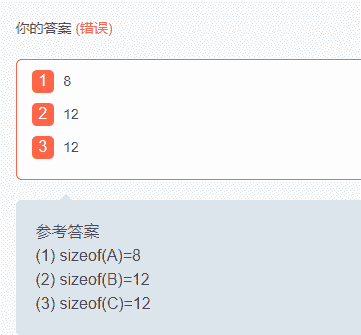
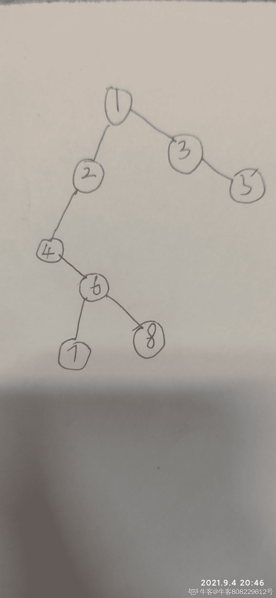

# 欢聚时代 2018 校招笔试题-C /C 音视频传输/推荐算法/测试开发 C 卷

## 1

下列有关面向对象的叙述不正确的是

正确答案: C D   你的答案: 空 (错误)

```cpp
面向对象设计的意图是适应需求变化
```

```cpp
应尽量针对接口编程，而不要针对实现编程
```

```cpp
尽量使用继承而不是聚合，因为继承使得类间的耦合性最小
```

```cpp
对象之间不能相互通信
```

本题知识点

欢聚集团 Java 工程师 C++工程师 iOS 工程师 安卓工程师 运维工程师 前端工程师 算法工程师 PHP 工程师 测试开发工程师 2018

讨论

[hmy9781](https://www.nowcoder.com/profile/832648978)

解析：面向对象的设计原则之一是：针对接口编程，而不是针对实现编程。遵循这个原则的好处有：①客户不必知道其使用对象的具体所属类；②客户无需知道特定类，只需知道他们所期望的接口；③一个对象可以很容易地被实现了相同接口的的另一个对象所替换；④对象间的连接不必硬绑定到一个具体类的对象上，灵活性高；⑤增加了重用的可能性，提高了对象组合的机率；⑥松散耦合。继承会使得类问的耦合性变大，因此使用类间聚合比使用类间继承好。

发表于 2020-08-31 17:34:03

* * *

## 2

有哪几种情况,成员变量只能用初始化列表

正确答案:   你的答案: 空 (错误)

```cpp
当类中含有 const 成员变量
```

```cpp
当类中含有 reference 成员变量
```

```cpp
当类中含有静态成员变量
```

```cpp
当类中含有函数指针成员变量
```

本题知识点

欢聚集团 Java 工程师 C++工程师 iOS 工程师 安卓工程师 运维工程师 前端工程师 算法工程师 PHP 工程师 测试开发工程师 2018 C++

讨论

[牛客职导官方账号](https://www.nowcoder.com/profile/897353)

【正确答案】A B
【解析】  查看全部)

编辑于 2021-11-18 08:37:38

* * *

[阿拉丁 9060](https://www.nowcoder.com/profile/637506797)

**对于 const 和 reference 类型成员变量，它们只能够被初始化而不能做赋值操作，因此只能用初始化列表**

发表于 2019-07-03 12:03:47

* * *

[hmy9781](https://www.nowcoder.com/profile/832648978)

初始化列表指的是初始化类的时候采用 Test(int a, int b):0,1{}形式对成员变量进行初始化的方法

发表于 2020-08-31 17:39:00

* * *

## 3

关于 struct 和 class，下面的说法不正确的是（）

正确答案: B C D   你的答案: 空 (错误)

```cpp
struct 的成员默认是 public,class 的成员默认是 private
```

```cpp
struct 不能继承，class 可以继承
```

```cpp
struct 的成员变量只能是 public
```

```cpp
class 可以有无参构造函数，而 struct 不可以
```

本题知识点

欢聚集团 C++工程师 2018 C++

讨论

[六岁小孩惨遭七名老师轮流布置作业](https://www.nowcoder.com/profile/977060823)

struct 能包含成员函数 能继承 能实现多态 和 class 的区别在于默认访问控制类型不同 struct 是 public 的，class 是 private 就算把程序中的 class 全换成 struct，程序依然能正常运行。 还有另一个很少涉及的区别是:class 可以用于定义模板参数，但是 struct 不行。

发表于 2018-08-29 14:02:04

* * *

[拧围巾](https://www.nowcoder.com/profile/142933478)

struct 是能继承的吧，

发表于 2021-09-08 09:38:54

* * *

[baixiaofei567](https://www.nowcoder.com/profile/641559353)

struct 不是可以实现继承和多态吗，只是默认的继承权限和默认的访问权限不同

发表于 2021-03-22 00:09:40

* * *

## 4

关于虚函数的说法,哪些是正确的

正确答案: B C   你的答案: 空 (错误)

```cpp
构造函数中调用该类的虚函数，动态绑定机制会生效
```

```cpp
静态函数不可以是虚函数
```

```cpp
虚函数可以声明为 inline
```

```cpp
构造函数和析构函数都可以声明为虚函数
```

本题知识点

欢聚集团 Java 工程师 C++工程师 iOS 工程师 安卓工程师 运维工程师 前端工程师 算法工程师 PHP 工程师 测试开发工程师 2018 C++

讨论

[c++爱上 java](https://www.nowcoder.com/profile/9128621)

虚函数用于实现运行时的多态，  查看全部)

编辑于 2018-07-22 17:45:48

* * *

[易殇](https://www.nowcoder.com/profile/525763257)

静态函数不能定义为虚函数：静态成员函数对于每个类都只有一份代码，所有对象都可以共享这份代码，他不归某一个对象所有，所以它没有动态绑定的必要，不能定义为虚函数。内联函数不能定义为虚函数：内联函数本就是为了减少函数调用的代价，所以在代码中直接展开。但虚函数一定要创建虚函数表，这两者不可能统一。另外，内联函数在编译时被展开，而虚函数在运行时才动态绑定。但是注意以下误区： ```cpp
class a
{
	inline virtual void test(){}
};
```

尽管以上写法是没有语法错误的，并且可以执行，但其实 test 函数已经不是内联函数了，因为 inline 只是对编译器的一个建议而已。
搞清本质就好。

发表于 2020-08-24 11:33:43

* * *

[牛客 580050057 号](https://www.nowcoder.com/profile/580050057)

静态函数不能定义为虚函数：静态成员函数对于每个类都只有一份代码，所有对象都可以共享这份代码，他不归某一个对象所有。所以它没有动态绑定的必要，不能定义为虚函数内联函数不能定义为虚函数： 内联函数本就是为了减少函数调用的代价，所有在代码中直接展开。但虚函数一定要创建虚函数表，这两者不可同一。另外，内联函数在编译时被展开，而虚函数在运行时才动态绑定

发表于 2021-03-08 10:33:39

* * *

## 5

后缀表达式 ab+cd+/可用以下哪些表达式来表示

正确答案: B   你的答案: 空 (错误)

```cpp
a+b/c+d
```

```cpp
(a+b)/(c+d)
```

```cpp
a+b/(c+d)
```

```cpp
a+b+c/d
```

本题知识点

欢聚集团 Java 工程师 C++工程师 iOS 工程师 安卓工程师 运维工程师 前端工程师 算法工程师 PHP 工程师 测试开发工程师 2018

讨论

[六岁小孩惨遭七名老师轮流布置作业](https://www.nowcoder.com/profile/977060823)

不包括括号，运算符放在两个运算对象后面，所有计算按运算符出现的顺序，严格从左向右，不考虑运算符优先规则 ab+等价于 a+b，cd+等价于 c+d，两者运算结果再进行/ 中缀表达式:我们平常用的计算方法，就数学课上那种 前缀表达式:不包含括号，运算符写在操作数前面，-a+b c 等价于 a-（b+c）

发表于 2018-08-29 14:16:59

* * *

## 6

关于 TCP 和 UDP 的区别，描述正确的有哪些

正确答案: A B C   你的答案: 空 (错误)

```cpp
TCP 面向连接，UDP 面向非连接即发送数据前不需要建立链接
```

```cpp
TCP 提供可靠的服务（数据传输），UDP 无法保证
```

```cpp
TCP 面向字节流，UDP 面向报文
```

```cpp
TCP 面向报文，UDP 面向字节流
```

本题知识点

欢聚集团 Java 工程师 C++工程师 iOS 工程师 安卓工程师 运维工程师 前端工程师 算法工程师 PHP 工程师 测试开发工程师 2018

讨论

[六岁小孩惨遭七名老师轮流布置作业](https://www.nowcoder.com/profile/977060823)

tcp 面向字节流，udp 面向报文

发表于 2018-08-29 14:17:42

* * *

## 7

以下排序算法是非稳定排序的是

正确答案: C D   你的答案: 空 (错误)

```cpp
冒泡排序
```

```cpp
归并排序
```

```cpp
快速排序
```

```cpp
堆排序
```

本题知识点

欢聚集团 Java 工程师 C++工程师 iOS 工程师 安卓工程师 运维工程师 前端工程师 算法工程师 PHP 工程师 测试开发工程师 2018

讨论

[AlanFang](https://www.nowcoder.com/profile/5098499)

冒泡排序是稳定的

发表于 2018-10-27 10:34:54

* * *

## 8

进程和线程的区别，下面描述正确的有哪些

正确答案: A B C D   你的答案: 空 (错误)

```cpp
线程作为调度和分配的基本单位，进程作为拥有资源的基本单位
```

```cpp
不仅进程之间可以并发执行，同一个进程的多个线程之间也可并发执行
```

```cpp
进程是拥有资源的一个独立单位，线程不拥有系统资源，但可以访问隶属于进程的资源
```

```cpp
在创建或撤消进程时，由于系统都要为之分配和回收资源，导致系统的开销明显大于创建或撤消线程时的开销
```

本题知识点

欢聚集团 Java 工程师 C++工程师 iOS 工程师 安卓工程师 运维工程师 前端工程师 算法工程师 PHP 工程师 测试开发工程师 2018

讨论

[牛客 808229612 号](https://www.nowcoder.com/profile/808229612)

我觉得 A 没什么问题

发表于 2021-09-04 20:38:32

* * *

## 9

分页和分段的区别，描述正确的有哪些

正确答案: A C D   你的答案: 空 (错误)

```cpp
段是信息的逻辑单位，它是根据用户的需要划分的;页是信息的物理单位，是为了管理主存的方便而划分的
```

```cpp
段和页的大小固定，由系统决定
```

```cpp
段向用户提供二维地址空间；页向用户提供的是一维地址空间
```

```cpp
段是信息的逻辑单位，便于存储保护和信息的共享，页的保护和共享受到限制
```

本题知识点

欢聚集团 Java 工程师 C++工程师 iOS 工程师 安卓工程师 运维工程师 前端工程师 算法工程师 PHP 工程师 测试开发工程师 2018

## 10

死锁产生的必要条件有哪些

正确答案: A B C D   你的答案: 空 (错误)

```cpp
一个资源一次只能被一个进程使用
```

```cpp
一个进程因请求资源而阻塞时，对已获得资源保持不放
```

```cpp
进程获得的资源，在未完全使用完之前，不能强行剥夺
```

```cpp
若干进程之间形成一种头尾相接的环形等待资源关系
```

本题知识点

欢聚集团 Java 工程师 C++工程师 iOS 工程师 安卓工程师 运维工程师 前端工程师 算法工程师 PHP 工程师 测试开发工程师 2018

讨论

[毅.L](https://www.nowcoder.com/profile/802601962)

**互斥条件**：指进程对所分配到的资源进行排它性使用，即在一段时间内某资源只由一个进程占用。如果此时还有其它进程请求资源，则请求者只能等待，直至占有资源的进程用毕释放。

**● 请求与保持条件**：进程已经保持了至少一个资源，但又提出了新的资源请求，而该资源 已被其他进程占有，此时请求进程被阻塞，但对自己已获得的资源保持不放。

**● 不可剥夺条件**：进程所获得的资源在未使用完毕之前，不能被其他进程强行夺走，即只能 由获得该资源的进程自己来释放（只能是主动释放)。

**● 循环等待条件**：指在发生死锁时，必然存在一个进程——资源的环形链，即进程集合{P0，P1，P2，···，Pn}中的 P0 正在等待一个 P1 占用的资源；P1 正在等待 P2 占用的资源，……，Pn 正在等待已被 P0 占用的资源。

发表于 2019-08-13 22:50:26

* * *

## 11

class A
{
public:
int a;
virtual void f1( ) {}
};
class B : public A
{
public:
char b;
};
class C : public B
{
public:
virtual void f2( ) {}
static void f3( ){}
};
sizeof(A) = 1
sizeof(B) = 2
sizeof(C) =3

你的答案 (错误)

123 参考答案 (1) sizeof(A)=8
(2) sizeof(B)=12
(3) sizeof(C)=12

本题知识点

欢聚集团 C++工程师 iOS 工程师 安卓工程师 运维工程师 算法工程师 测试开发工程师 2018

讨论

[58 最菜的程序员](https://www.nowcoder.com/profile/2446685)

不知道他这怎么评判的简单说下 A 里面有虚函数，就会有个指针去指向虚函数表 所以是 4+4B 继承了 A，所以 B 里面也有指针，char b 向上对齐就是 4 个字节了  4+4+4C 里面没有其它成员变量 虽然有虚函数，但是虚函数表会合并，只会有一个虚函数指针。所以也是 4+4+4

发表于 2018-09-14 11:02:42

* * *

[AVX512](https://www.nowcoder.com/profile/507669155)

32 还是 64 位不说做个锤子

发表于 2020-08-31 17:34:06

* * *

## 12

假定 x=8888，返回值是 1
int func(x)
{
int countx = 0;
while(x)
{
countx ++;
x = x&(x-1);
}
return countx;
}

你的答案 (错误)

1 参考答案 (1) 6

本题知识点

欢聚集团 C++工程师 运维工程师 前端工程师 算法工程师 测试开发工程师 2018

讨论

[while(true){++salary;}](https://www.nowcoder.com/profile/621892314)

原文：[`blog.csdn.net/sszgg2006/article/details/7997507`](https://blog.csdn.net/sszgg2006/article/details/7997507) 每执行一次 x = x&(x-1)，会将 x 用二进制表示时最右边的一个 1 变为 0，因为 x-1 将会将该位(x 用二进制表示时最右边的那个 1)变为 0。（假设该位为第 k 位，减 1 后，该位后面全部变成 1，但是由于该位是最右边的 1 了，所以 x 的第 k 位后面全是 0，而 x-1 的第 k 位是 0，从 1 到 k-1 位全是 1，按位与的结果自然就是第 k 位和 1~k-1 位都变成 0。）所以该表达式的用途之一：

１：将最低的为 1 的位变成 0，这个解释理解起来不难。

该表达式的第二个用途为：
２：当 x 为奇数的时候,x=x&(x-1)它的值相当于 x=x-1;一样的效果；当 x 为 2 的 N 次幂时,结果为 0，这可以用来快速判断一个数是否为２的ｎ次方。
判断一个数(x)是否是 2 的 n 次方
#include <stdio.h>
int func(int x)
{
if( (x&(x-1)) == 0 )
return 1;
else
return 0;
}

int main()
{
int x = 8;
printf("%d\n", func(x));
}

发表于 2019-02-17 17:45:03

* * *

[Mysf](https://www.nowcoder.com/profile/189240570)

不是 2 吗，8888-8192-0

发表于 2019-12-15 11:12:08

* * *

[58 最菜的程序员](https://www.nowcoder.com/profile/2446685)

8192+512+128+32+16+4

发表于 2018-09-14 11:08:19

* * *

## 13

已知二叉树的前序遍历顺序为：12467835, 中序遍历顺序为：47682135，则后序遍历顺序为 1

你的答案 (错误)

1 参考答案 (1) 78642531

本题知识点

欢聚集团 Java 工程师 C++工程师 iOS 工程师 PHP 工程师 算法工程师 测试开发工程师 2018

讨论

[牛客 808229612 号](https://www.nowcoder.com/profile/808229612)

78642531

发表于 2021-09-04 20:47:44

* * *

[NovePlantimu](https://www.nowcoder.com/profile/552360971)

这个答案对吗  47862351 才是对把？

发表于 2020-11-01 15:20:49

* * *

## 14

计算时间复杂度：1
int i = 1;
while (i<=n)
{
i = i*2;
}

你的答案 (错误)

1 参考答案 (1) O(log2n)

本题知识点

欢聚集团 C++工程师 iOS 工程师 安卓工程师 算法工程师 测试开发工程师 2018

## 15

ping 命令作用 1,使用的什么协议 2.

你的答案 (错误)

12 参考答案 (1) 测试两个主机之间的连通性
(2) ICMP 协议

本题知识点

欢聚集团 Java 工程师 C++工程师 算法工程师 PHP 工程师 测试开发工程师 2018

## 16

什么是存储过程？有哪些优点？索引是什么？有哪些优缺点？

你的答案

本题知识点

欢聚集团 Java 工程师 C++工程师 iOS 工程师 安卓工程师 运维工程师 前端工程师 算法工程师 PHP 工程师 测试开发工程师 2018

讨论

[666 的佩奇爸爸](https://www.nowcoder.com/profile/7670357)

答案：SQL 语句执行的时候，要首先编译，然后再被执行。在大型数据库系统中，为了提高效率，将为了完成特定功能的 SQL 语句集进行编译优化后，存储在数据库服务器中，用户通过指定存储过程的名字来调用执行。具体而言，存储过程（Stored Procedure）是一组为了完成特定功能的 SQL 语句集，存储在数据库中，经过第一次编译后，再次调用不需要再次编译，用户通过指定存储过程的名字并给出参数（如果该存储过程带有参数）来执行它。

例如，下面为一个创建存储过程的常用语法：create procedure sp_name @[参数名][类型]   as  begin            ........  end  调用存储过程语法：exec sp_name [参数名]

删除存储过程语法：drop procedure sp_name

从上面的介绍可以发现，使用存储过程可以增强 SQL 语言的功能和灵活性。由于用流程控制语句编写存储过程具有很强的灵活性，所以，使用存储过程可以完成复杂的判断和运算，并且可以保证数据的安全性和完整性，同时，存储过程可以使没有权限的用户在控制之下间接地存取数据库，也保证了数据的安全。

具体而言，存储过程主要有如下优点：

1）执行效率高。

2）减少网络流量。因为在调用的时候不需要每次都把 SQL 语句传输到数据库上。

3）安全机制好。通过对存储过程进行授权，从而保证安全性。 

编辑于 2018-07-20 16:56:59

* * *

[牛客 808229612 号](https://www.nowcoder.com/profile/808229612)

存储过程存储过程是一系列 SQL 语句的集合，可以进行入参，出参，达到模块化的效果索引索引地址的引用，建立起索引便于快速地查找内容，也就是代替了全部遍历。

发表于 2021-09-04 20:14:26

* * *

[马孟睿](https://www.nowcoder.com/profile/436183443)

存储过程是指编译之后可以以一种可执行的形式永久地存储在数据库中的 SQL 语句。
它的优点有：
（1）提高运行速度
（2）模块化程序设计
（3）减少网络通信量
（4）保证系统的安全性索引是与表或视图关联的磁盘上结构，可以加快从表或视图中检索行的速度。
索引中包含由表或视图中的一列或多列生成的键。这些键存储在一个结构（BTree）中，使 SQL 可以快速有效地查找与键值关联的行。
2\. 索引的优点：
1) 建立索引的列可以保证行的唯一性，生成唯一的 rowId；
2) 建立索引可以有效缩短数据的检索时间；
3) 建立索引可以加快表与表之间的连接；
4) 为用来排序或者是分组的字段添加索引可以加快分组和排序顺序。
3\. 索引的缺点：
1) 创建索引和维护索引需要时间成本，这个成本随着数据量的增加而加大；
2) 创建索引和维护索引需要空间成本，每一条索引都要占据数据库的物理存储空间，数据量越大，占用空间也越大（数据表占据的是数据库的数据空间），从而会降低表的增删改的效率，因为每次增删改索引需要进行动态维护，这样会导致时间变长。 

发表于 2019-08-30 10:39:37

* * *

## 17

什么是用户态和内核态？它们之间是怎样切换的？

你的答案

本题知识点

欢聚集团 Java 工程师 C++工程师 iOS 工程师 安卓工程师 运维工程师 前端工程师 算法工程师 PHP 工程师 测试开发工程师 2018

讨论

[为了睡觉](https://www.nowcoder.com/profile/240143772)

就调了下参考答案的格式。内核态：控制计算机的硬件资源，并提供上层应用程序运行的环境，运行在高特权级上。 用户态：上层应用程序的活动空间，运行在低特权级别上。 为了使上层应用能够访问到这些资源，内核为上层应用提供访问的接口。 切换：1、系统调用。用户态进程主动要求切换到内核态的一种方式，用户态进程通过系统调用申请使用操作系统提供的服务程序完成工作 。2、异常。当 CPU 在执行运行在用户态下的程序时，发生了某些事先不可知的异常，这时会触发由当前运行进程切换到处理此异常的内核相关程序中，也就转到了内核态 。3、外围设备中断。当外围设备完成用户请求的操作后，会向 CPU 发出相应的中断信号，这时 CPU 会暂停即将要执行的指令而去执行与中断信号对应的处理程序。

发表于 2021-09-04 23:28:35

* * *

[F 先森](https://www.nowcoder.com/profile/65279210)

内核态：控制计算机的硬件资源，并提供上层应用程序运行的环境，运行在高特权级上。 用户态：上层应用程序的活动空间，运行在低特权级别上。 为了使上层应用能够访问到这些资源，内核为上层应用提供访问的接口。

发表于 2019-09-08 13:02:27

* * *

## 18

描述下在浏览器中输入 www.yy.com 后执行的全部过程？

你的答案

本题知识点

欢聚集团 Java 工程师 C++工程师 iOS 工程师 安卓工程师 运维工程师 前端工程师 算法工程师 PHP 工程师 测试开发工程师 2018

## 19

程序（比如卸载程序）是怎样做到自删除的？大型游戏（比如 WOW）如何做到快速升级修复 bug？

你的答案

本题知识点

欢聚集团 Java 工程师 C++工程师 iOS 工程师 安卓工程师 运维工程师 前端工程师 算法工程师 PHP 工程师 测试开发工程师 2018

## 20

有 char a[n],char b[m]两个数组，n > m > 1000，b 数组中的元素 a 中都有，现在需要生成数组 c，将 a 中有 b 中没有的元素都放到 c 里面，要求 O(N)。比如输入是 char a[] = { '1', '2', '3', '4', '5', 'a', 'b', 'c', 'd', 'e', '\0' };char b[] = { '1', '3', 'c', 'f','\0' };结果：c[] = {'2','4','5','a','b','d', 'e'}（注：不能使用本地 IDE）

你的答案

本题知识点

欢聚集团 Java 工程师 C++工程师 iOS 工程师 安卓工程师 运维工程师 前端工程师 算法工程师 PHP 工程师 测试开发工程师 2018

讨论

[逍遥飞](https://www.nowcoder.com/profile/5952696)

桶思想，标志数组

发表于 2019-10-18 20:26:42

* * *