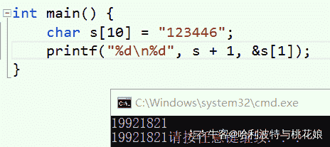

# 欢聚时代 2018 校招笔试题-IOS B 卷

## 1

以下关于进程和线程描述正确的是

正确答案: B C   你的答案: 空 (错误)

```cpp
不管是进程还是线程，它们都使用独立的地址空间；
```

```cpp
进程属于资源分配和调度的单位，而线程是处理机调度和分配的单位
```

```cpp
系统切换线程的代价比切换进程要低； 
```

```cpp
一个程序只能创建一个进程，一个进程可以创建无数的线程
```

本题知识点

欢聚集团 Java 工程师 C++工程师 iOS 工程师 安卓工程师 运维工程师 前端工程师 算法工程师 PHP 工程师 2018

讨论

[锦衣狼](https://www.nowcoder.com/profile/9879861)

线程和进程的区别主要在于它们是不同的操作系统资源管理方式。进程有独立的地址空间，一个进程崩溃后，在保护模式的影响下不会对其他进程产生影响，而线程只是一个进程中的不同执行路径。线程有自己的堆栈和局部变量，但线程之间没有单独的地址空间，一个线程死掉就等同于整个进程死掉，所以多进程的程序要比多线程的程序健壮，但在进程切换时，耗费资源较大，效率要差一些。但对于一些要求同时进行并且又要共享某些变量的并发操作，只能用线程，不能用进程。

发表于 2018-08-03 16:28:51

* * *

## 2

已知数组定义”char s[10];”，以下表示 s[1]包括

正确答案: A C D   你的答案: 空 (错误)

```cpp
s+1
```

```cpp
*(s+1)
```

```cpp
s[0]+1
```

```cpp
s[1]
```

本题知识点

欢聚集团 C++工程师 算法工程师 2018 C++ C 语言

讨论

[牛客 889320556 号](https://www.nowcoder.com/profile/889320556)

A 咋不对

发表于 2020-08-06 10:30:01

* * *

[哈利波特与桃花娘](https://www.nowcoder.com/profile/501696196)


所以 A 哪里错了？

编辑于 2020-09-17 09:52:53

* * *

[一条 LG](https://www.nowcoder.com/profile/855466048)

选项 A 就是对的，标准的地址法。

编辑于 2020-09-27 15:09:33

* * *

## 3

以下关于引用和指针的描述，正确的是（）

正确答案: B C D   你的答案: 空 (错误)

```cpp
引用和指针都是指向变量的内存地址
```

```cpp
引用可以表示指针
```

```cpp
引用和指针都是实现多态效果的手段
```

```cpp
引用本身是目标变量的别名，对引用的操作就是对目标变量的操作
```

本题知识点

欢聚集团 C++工程师 2018 C++

讨论

[普通程序圆](https://www.nowcoder.com/profile/4471273)

实际上"引用"可以做的任何事情"指针"也都能够做，为什么还要"引用"这东西？

答案是"用适当的工具做恰如其分的工作"。

指针能够毫无约束地操作内存中的任何东西，尽管指针功能强大，但是非常危险。

如果的确只需要借用一下某个对象的"别名"，那么就用"引用"，而不要用"指针"，以免发生意外。

发表于 2018-09-04 10:56:49

* * *

[黄俊尹](https://www.nowcoder.com/profile/262605718)

**A****.引用和指针都是指向变量的内存地址，错误。**        引用等价于* const ptr，也就是对一个指针常量取值，指针才能指向内存地址，这也解释了引用为什么必须要初始化，且后面无法修改引用。int a =10; int& r = a；在编译器底层就已经替换成 r = *const ptr = *(&a)，这就解释了为什么对引用取地址和原变量相等，看起来变量和引用使用相同的地址，因为&(&*)a= ptr = &a。**B.引用可以表示指针，正确。**        指针的引用是存在的**C.引用和指针都是实现多态的手段，正确。**        根据引用和指针的关系，当然指针能多态，引用就能多态。**D.引用本身是目标变量的别名，对引用的操作就是对目标变量的操作，正确。**        这个算 C++ primer 中的原话，没什么好说的。

编辑于 2021-11-09 12:31:54

* * *

[牛客 41008939 号](https://www.nowcoder.com/profile/41008939)

引用指向变量内存地址，其实也不能说它就错了，还需要考究一下

发表于 2020-09-26 16:51:23

* * *

## 4

以下关于变量的描述正确的是 （）

正确答案: A B   你的答案: 空 (错误)

```cpp
局部变量的生命周期只在代码块内
```

```cpp
全局变量贯穿整个程序的生命周期
```

```cpp
局部变量不能使用和全局变量相同的名称
```

```cpp
局部变量和全局变量有同样的默认初始值
```

本题知识点

欢聚集团 C++工程师 2018

讨论

[Perfume🐷2019](https://www.nowcoder.com/profile/212925046)

个人觉得 A 不对，静态局部变量的生命周期是整个程序。

发表于 2020-08-31 18:46:01

* * *

[少年与梦 01](https://www.nowcoder.com/profile/311318005)

全局变量的使用周期不应该是定义程序行到程序结束吗？，假设我全局变量定义在后面的，前边仍然访问不到

发表于 2021-05-25 17:59:56

* * *

[锦衣狼](https://www.nowcoder.com/profile/9879861)

全局变量在使用前不必赋值，没赋值的话用默认值，然而局部变量在使用前必须赋值。

发表于 2018-08-03 16:31:33

* * *

## 5

以下关于临界区的描述正确的是

正确答案: A C   你的答案: 空 (错误)

```cpp
如果有多个进程同时要求进入临界区，一次只能有一个进程进入
```

```cpp
临界区内可以同时存在多个进程
```

```cpp
进入临界区的进程应该尽快退出临界区，以便其他进程访问
```

```cpp
如果进入临界区失败，进程应该一直重试，以减少等待时间
```

本题知识点

欢聚集团 Java 工程师 C++工程师 iOS 工程师 安卓工程师 运维工程师 前端工程师 算法工程师 PHP 工程师 2018

讨论

[锦衣狼](https://www.nowcoder.com/profile/9879861)

进程进入临界区的调度原则是：1、如果有若干进程要求进入空闲的临界区，一次仅允许一个进程进入。2、任何时候，处于临界区内的进程不可多于一个。如已有进程进入自己的临界区，则其它所有试图进入临界区的进程必须等待。3、进入临界区的进程要在有限时间内退出，以便其它进程能及时进入自己的临界区。4、如果进程不能进入自己的临界区，则应让出 CPU，避免进程出现“忙等”现象。

发表于 2018-08-03 16:32:50

* * *

## 6

关于 Object-C 中 Protocol 的说法错误的是

正确答案: C   你的答案: 空 (错误)

```cpp
一个类可以继承多个 Protocol 协议
```

```cpp
Protocol 声明的方法有必选和可选两种类型
```

```cpp
Protocol 和 Interface 类似可以声明属性
```

```cpp
Protocol 可以继承自其他的 Protocol
```

本题知识点

欢聚集团 Java 工程师 C++工程师 iOS 工程师 安卓工程师 运维工程师 前端工程师 算法工程师 PHP 工程师 2018

讨论

[锦衣狼](https://www.nowcoder.com/profile/9879861)

iOS 中协议中和分类中是可以用@property 形式声明属性的，只不过在协议、分类中声明的属性，只有对应的 setter／getter 方法，并没有生成对应的成员变量。因为协议中只可以声明方法，分类中只能声明方法和对应的实现。

发表于 2018-08-03 16:34:47

* * *

## 7

以下关于 TCP 和 UDP 的描述，正确的是

正确答案: A C   你的答案: 空 (错误)

```cpp
TCP 是可靠的传输，UDP 是不可靠的传输
```

```cpp
UDP 和 TCP 都是以用户数据报作为传输单元
```

```cpp
UDP 不需要建立连接，所以传输速度更快
```

```cpp
TCP 比 UDP 更安全，无法通过抓包工具捕获并解析数据包;
```

本题知识点

欢聚集团 Java 工程师 C++工程师 iOS 工程师 安卓工程师 运维工程师 前端工程师 算法工程师 PHP 工程师 2018

讨论

[锦衣狼](https://www.nowcoder.com/profile/9879861)

TCP 报文段 UDP 数据报

发表于 2018-08-03 16:35:54

* * *

## 8

关于数据库的事务，以下说法正确的是

正确答案: A C D   你的答案: 空 (错误)

```cpp
事务包含一个或多个 SQL 语句
```

```cpp
如果事务执行失败，会直接停止在失败状态
```

```cpp
 事务需要通过锁来保证其完整性和并发性
```

```cpp
事务只有有一个 SQL 语句执行失败，那么整个事务都失败
```

本题知识点

欢聚集团 Java 工程师 C++工程师 iOS 工程师 安卓工程师 运维工程师 前端工程师 算法工程师 PHP 工程师 2018

## 9

设计模式中，当我们说”要依赖于抽象，不要依赖于具体；即针对接口编程，不要针对实现编程”，是指

正确答案: D   你的答案: 空 (错误)

```cpp
开-闭原则
```

```cpp
接口隔离原则
```

```cpp
里氏代换原则
```

```cpp
依赖倒转原则
```

本题知识点

欢聚集团 Java 工程师 C++工程师 iOS 工程师 安卓工程师 运维工程师 前端工程师 算法工程师 PHP 工程师 2018

## 10

观察者模式是 iOS 中非常常用的设计模式，以下关于其说法正确的是

正确答案: A B D   你的答案: 空 (错误)

```cpp
观察者和被观察者是多对一的关系
```

```cpp
多个观察者接收状态更新的通知的顺序是不确定的
```

```cpp
观察者可以持有并直接修改被观察者的状态
```

```cpp
观察者可以被动态增加和移除
```

本题知识点

欢聚集团 Java 工程师 C++工程师 iOS 工程师 安卓工程师 运维工程师 前端工程师 算法工程师 PHP 工程师 2018

## 11

假如 x=3, y=8，执行表达式 y *= ++x，之后 x=1，y=2；

你的答案 (错误)

12 参考答案 (1) 4
(2) 32

本题知识点

欢聚集团 Java 工程师 前端工程师 算法工程师 PHP 工程师 iOS 工程师 2018

## 12

假如(a1, a2, …, an)是以链表的方式存储，那么访问第 i 个元素的时间复杂度为 1

你的答案 (错误)

1 参考答案 (1) O(n)

本题知识点

欢聚集团 Java 工程师 C++工程师 iOS 工程师 安卓工程师 2018 算法工程师

## 13

顺序表敏感词有 n 个元素，如果需要在第 i（1≤i≤n＋1）个元素之前插入一个元素，那么需要先表尾方向移动 1 个元素

你的答案 (错误)

1 参考答案 (1) n - i + 1

本题知识点

欢聚集团 Java 工程师 C++工程师 算法工程师 PHP 工程师 iOS 工程师 2018

## 14

面向对象的三个基本特征是 123

你的答案 (错误)

123 参考答案 (1) 封装
(2) 继承
(3) 多态

本题知识点

欢聚集团 Java 工程师 C++工程师 前端工程师 算法工程师 iOS 工程师 2018

## 15

在类实现文件中定义的静态常量，如果需要提供给外部访问，可以在头文件中使用关键字 1 进行声明；

你的答案 (错误)

1 参考答案 (1) extern

本题知识点

欢聚集团 Java 工程师 C++工程师 iOS 工程师 PHP 工程师 2018 算法工程师

## 16

在 Object-C 如果需要声明 dispatch_block_t 类型的属性，应该使用修饰词（nonatomic, 1）

你的答案 (错误)

1 参考答案 (1) copy

本题知识点

欢聚集团 Java 工程师 C++工程师 算法工程师 PHP 工程师 iOS 工程师 2018

## 17

对一个 NSMutableArray 类型变量执行 copy 方法返回的结果类型为 1

你的答案 (错误)

1 参考答案 (1) NSArray

本题知识点

欢聚集团 Java 工程师 C++工程师 iOS 工程师 PHP 工程师 2018 算法工程师

## 18

设计模式中，MVC 模型表示 Model-View-Controller，实际上它的基本工作原理是基于 1 模式，实现是基于 2 模式；

你的答案 (错误)

12 参考答案 (1) 观察者
(2) 命令

本题知识点

欢聚集团 Java 工程师 C++工程师 算法工程师 PHP 工程师 iOS 工程师 2018

## 19

设计模式中，Open-Close 原则是指，应当对 1 开放，对 2 关闭

你的答案 (错误)

12 参考答案 (1) 扩展
(2) 修改

本题知识点

欢聚集团 Java 工程师 C++工程师 算法工程师 PHP 工程师 iOS 工程师 2018

## 20

MySQL 属于关系型数据库，与之对应为非关系型数据库，可以细分为 4 种类型，其中 MongoDB 属于其中的 1 型数据库；

你的答案 (错误)

1 参考答案 (1) 文档

本题知识点

欢聚集团 Java 工程师 C++工程师 iOS 工程师 PHP 工程师 2018 算法工程师

讨论

[锦衣狼](https://www.nowcoder.com/profile/9879861)

键值([Key-Value](https://baike.baidu.com/item/Key-Value))存储[数据库](https://baike.baidu.com/item/%E6%95%B0%E6%8D%AE%E5%BA%93)Tokyo Cabinet/Tyrant, Redis, Voldemort, Oracle BDB.列存储数据库 Cassandra, HBase, Riak 文档型数据库 CouchDB, MongoDb. 国内也有文档型数据库 SequoiaDB 图形(Graph)数据库 Neo4J, InfoGrid, Infinite Graph.

发表于 2018-08-03 16:40:24

* * *

## 21

继承可以分为类继承和接口继承，请简述两者的区别，并说明它们分别适用的场景

你的答案

本题知识点

欢聚集团 Java 工程师 C++工程师 iOS 工程师 安卓工程师 运维工程师 前端工程师 算法工程师 PHP 工程师 2018

## 22

程序常用的内存管理方式主要分为引用计数策略和垃圾收集策略，请分别对比一下两者的差异和优劣点

你的答案

本题知识点

欢聚集团 Java 工程师 C++工程师 iOS 工程师 安卓工程师 运维工程师 前端工程师 算法工程师 PHP 工程师 2018

## 23

已定义结构如下：struct Node {int data;struct Node *next;};请实现以长度为 n 的数组作为参数，简历表头指针为 L 的链表，链表中节点的值的顺序刚好与数组元素的顺序相反。方法声明如下：void func(NODE*& L, int array[], int n);**输入描述**长度为 n 的整型数组，如：{3, 4, 1, 7, 8, 9}**输出描述**建立好的链表结构，从头节点开始打印，如：{9, 8, 7, 1, 4, 3}**输入例子**{3, 4, 1, 7, 8, 9}**输出例子**{9, 8, 7, 1, 4, 3}（注：不能使用本地 IDE）

你的答案

本题知识点

欢聚集团 Java 工程师 C++工程师 iOS 工程师 安卓工程师 运维工程师 前端工程师 算法工程师 PHP 工程师 2018

## 24

有若干个人结伴一起旅行，每个人能够携带的物品总重量是固定的。给定若干不同重量的物品（单个物品重量不超过个人上限），请问每个人应该携带的物品应该如何分配？例如，每个人能够携带的物品总重为 6，共有 7 个物品为{5, 3, 3, 2, 2, 2, 1}，那么答案应该为{(5+1), (3+3), (2+2+2)}。请给出解决方案并写成算法。**输入描述**表示所有物品的数组，如：{5, 3, 3, 2, 2, 2, 1}， 以及表示可负担的人数和每个人可承担的总量 **输出描述**输出物品分配方案，如：{0, 1, 1, 2, 2, 2, 0}第 i 个元素值 j：表示第 i 个物品分配给第 j 个人**输入例子**{5, 3, 3, 2, 2, 2, 1},  {6, 6, 6}**输出例子**{0, 1, 1, 2, 2, 2, 0}（注：不能使用本地 IDE）

你的答案

本题知识点

欢聚集团 Java 工程师 C++工程师 iOS 工程师 安卓工程师 运维工程师 前端工程师 算法工程师 PHP 工程师 2018