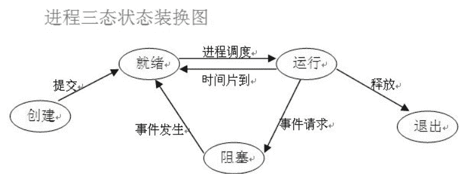
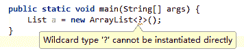
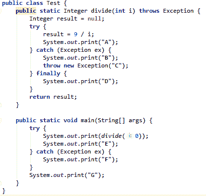
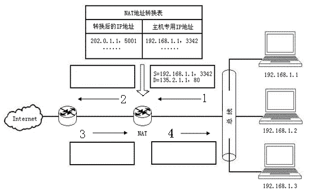
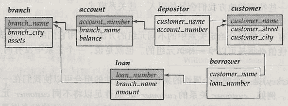
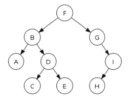

# 欢聚时代 2018 校招笔试题-Java 开发/运维研发/数据挖掘 A 卷

## 1

以下哪些是操作系统的名称?

正确答案: A B C D   你的答案: 空 (错误)

```cpp
Windows
```

```cpp
Linux
```

```cpp
Solaris
```

```cpp
UNIX
```

本题知识点

欢聚集团 Java 工程师 C++工程师 iOS 工程师 安卓工程师 运维工程师 前端工程师 算法工程师 PHP 工程师 数据挖掘工程师 2018

讨论

[朝花夕誓的眼睛娘](https://www.nowcoder.com/profile/464731193)

solaris 是 UNIX 系统的衍生

发表于 2018-07-08 22:44:58

* * *

## 2

关于进程和线程，以下哪些说明是错误的

正确答案: B C D   你的答案: 空 (错误)

```cpp
无论多进程和多线程架构的程序，都可以做到利用 CPU 多核多线程的能力
```

```cpp
Linux 内核看来，进程只是一个资源分配单位，线程才是一个实际的执行体
```

```cpp
某个进程 fork 出来的多个子进程，它们的内存是共享的
```

```cpp
多线程架构的调度开销要小于多进程架构，因此多线程性能会更好一些
```

本题知识点

欢聚集团 Java 工程师 C++工程师 iOS 工程师 安卓工程师 运维工程师 前端工程师 算法工程师 PHP 工程师 数据挖掘工程师 2018

讨论

[牛客 xiao 白龙](https://www.nowcoder.com/profile/698152286)

B.在 Linux 中，进程也是 CPU 调度和分配资源的基本单位  C.线程才是共享的 D 多线程比多进程成本低，但性能更低

发表于 2018-07-27 22:24:07

* * *

[黄小斜](https://www.nowcoder.com/profile/3539721)

B 选项为什么是错误的，我想题目可能是想说，进程不仅是一个资源分配单位，也可以进行调度。

发表于 2018-07-08 15:17:59

* * *

[绝味小开发](https://www.nowcoder.com/profile/4550590)

Linux 中进程也可以进行调度

发表于 2018-12-24 20:42:08

* * *

## 3

CPU 的状态转换中，以下哪些是可能发生的

正确答案: A B C   你的答案: 空 (错误)

```cpp
Running -&gt; Waiting
```

```cpp
Running -&gt; Blocked
```

```cpp
Blocked -&gt; Waiting
```

```cpp
Blocked -&gt; Running
```

本题知识点

欢聚集团 Java 工程师 C++工程师 iOS 工程师 安卓工程师 运维工程师 前端工程师 算法工程师 PHP 工程师 数据挖掘工程师 2018

讨论

[牛客 xiao 白龙](https://www.nowcoder.com/profile/698152286)



发表于 2018-07-27 22:27:07

* * *

## 4

Java 中内存模型中，Metaspace(即元空间，也叫方法区)是从哪个版本开始引入的?

正确答案: C   你的答案: 空 (错误)

```cpp
Java 6
```

```cpp
Java 7
```

```cpp
Java 8
```

```cpp
Java 9
```

本题知识点

欢聚集团 Java 工程师 C++工程师 iOS 工程师 安卓工程师 运维工程师 前端工程师 算法工程师 PHP 工程师 数据挖掘工程师 2018

讨论

[Vitas20180710150138](https://www.nowcoder.com/profile/598509216)

Java 8 彻底将永久代移除出了 HotSpot JVM，将其原有的数据迁移至 Java Heap 或 Metaspace。

 在 HotSpot JVM 中，永久代中用于存放类和方法的元数据以及常量池，在 Java 中对应能通过反射获取到的数据，比如 Class 和 Method。每当一个类初次被加载的时候，它的元数据都会放到永久代中。

永久代是有大小限制的，因此如果加载的类太多，很有可能导致永久代内存溢出，即 java.lang.OutOfMemoryError: PermGen 。为此我们不得不对虚拟机做调优

Java 8 中永久代被移出 HotSpot JVM 的原因主要有两个：

1、由于 Permanent Generation 内存经常不够用或发生内存泄露，引发 java.lang.OutOfMemoryError: PermGen （在 Java Web 开发中非常常见）。

2、移除 Permanent Generation 可以促进 HotSpot JVM 与 JRockit VM 的融合，因为 JRockit 没有永久代。

根据上面的各种原因，永久代最终被移除，方法区移至 Metaspace，字符串常量移至 Java Heap。

发表于 2018-08-15 18:32:12

* * *

[我是复读机](https://www.nowcoder.com/profile/162099353)

JDK1.7 之前运行时常量池逻辑包含字符串常量池，存放在方法区, 此时 hotspot 虚拟机对方法区的实现为永久代；
JDK1.7 字符串常量池被从方法区拿到了堆中, 这里没有提到运行时常量池,也就是说字符串常量池被单独拿到堆,运行时常量池剩下的东西还在方法区, 也就是 hotspot 中的永久代 ；
JDK1.8 hotspot 移除了永久代用元空间(Metaspace)取而代之, 这时候字符串常量池还在堆, 运行时常量池还在方法区, 只不过方法区的实现从永久代变成了元空间(Metaspace)。

发表于 2021-01-02 19:31:09

* * *

## 5

以下哪些关键字/类可以达到不同线程互斥访问的效果?

正确答案: A D   你的答案: 空 (错误)

```cpp
ReentrantLock
```

```cpp
volatile
```

```cpp
static
```

```cpp
synchronized
```

本题知识点

欢聚集团 Java 工程师 C++工程师 iOS 工程师 安卓工程师 运维工程师 前端工程师 算法工程师 PHP 工程师 数据挖掘工程师 2018

讨论

[那旧城以西](https://www.nowcoder.com/profile/5795244)

synchronized 可同步方法 同步代码块 同步，静态同步 synchronized 方法与 synchronized(class)代码块 都是为了互斥 同一个时间只有一个线程可以执行 synchronized 修饰的方法，代码块 Volatile 关键字 保证了不同线程对变量操作的可见性 一个变量被 Volatile 修饰时，它保证修改的值会立即被更新到主存，当有其他线程需要读取时，回去内存中读取新值
重入锁是可以完全替代 synchronized 关键字的 可中断响应、锁申请等待限时、公平锁,另外可以结合 Condition 来使用

发表于 2018-10-28 11:27:42

* * *

[我是复读机](https://www.nowcoder.com/profile/162099353)

1、ReentrantLock 和 synchronized 都是可重入锁。synchronized 是依赖于 JVM 实现的，ReentrantLock 是 JDK 层面实现的（也就是 API 层面，需要 lock() 和 unlock() 方法配合 try/finally 语句块来完成）。相比 synchronized，ReentrantLock 增加了一些高级功能：等待可中断、可实现公平锁、可实现选择性通知（锁可以绑定多个条件）。
2、volatile 关键字主要用于解决变量在多个线程之间的可见性，而 synchronized 关键字解决的是多个线程之间访问资源的同步性。

发表于 2021-01-02 19:48:52

* * *

[qing 鹏](https://www.nowcoder.com/profile/596601496)

互斥说的多个线程对同一段代码的获取锁和释放锁，而 voliate 只是保证了变量的可见性，好像没有涉及到锁，在汇编语言的实现中也没有涉及到锁的释放和获取

发表于 2019-07-15 16:52:21

* * *

## 6

以下描述中，哪些是完全正确的?

正确答案: B D   你的答案: 空 (错误)

```cpp
对象实例中的成员变量是线程安全的
```

```cpp
方法内定义的变量是线程安全的
```

```cpp
Singleton(单例)实例中的成员变量是线程安全的
```

```cpp
volatile 的变量是线程不安全的
```

本题知识点

欢聚集团 Java 工程师 C++工程师 iOS 工程师 安卓工程师 运维工程师 前端工程师 算法工程师 PHP 工程师 数据挖掘工程师 2018

讨论

[拼命也要幸福](https://www.nowcoder.com/profile/171607642)

[`www.cnblogs.com/kubidemanong/p/9505944.html`](https://www.cnblogs.com/kubidemanong/p/9505944.html)

发表于 2019-07-27 10:08:29

* * *

[花言不知梦](https://www.nowcoder.com/profile/4035965)

解释下 b 选项 1\. 方法执行时，都会创建相应的栈帧，方法内定义的变量存放在栈帧的内部，栈帧会压入虚拟机栈 2\. 每个线程都拥有独立的 Java 虚拟机栈（虚拟机栈线程之间不共享），故不存在线程不安全的问题

编辑于 2020-06-18 20:46:30

* * *

[qing 鹏](https://www.nowcoder.com/profile/596601496)

D 因为不能保证变量的原子性

发表于 2019-07-15 16:54:04

* * *

## 7

关于 Java 的语法，以下描述中哪些是正确的?

正确答案: B C   你的答案: 空 (错误)

```cpp
一个类可以继承(extends)一个或多个父类
```

```cpp
一个类可以实现(implements)一个或多个接口
```

```cpp
一个接口可以继承(extends)一个或多个其它接口
```

```cpp
一个接口以实现(implements)一个或多个其它接口
```

本题知识点

欢聚集团 Java 工程师 C++工程师 iOS 工程师 安卓工程师 运维工程师 前端工程师 算法工程师 PHP 工程师 数据挖掘工程师 2018

讨论

[我是复读机](https://www.nowcoder.com/profile/162099353)

接口可继承（extends）接口，并可多继承（implements）接口，但不能用接口来实现接口。

发表于 2021-01-02 20:09:36

* * *

## 8

List a = new ArrayList<______>();
下列哪些选项放在上面的<______>中是符合 java 语法的?

正确答案: C D   你的答案: 空 (错误)

```cpp
?
```

```cpp
? extends Collection
```

```cpp
LinkedList
```

```cpp
DelayQueue
```

本题知识点

欢聚集团 Java 工程师 C++工程师 iOS 工程师 安卓工程师 运维工程师 前端工程师 算法工程师 PHP 工程师 数据挖掘工程师 2018

讨论

[三七互娱员工 _ 已认证](https://www.nowcoder.com/profile/5983407)

非限制泛型不允许初始化

发表于 2018-08-14 22:35:15

* * *

[我是复读机](https://www.nowcoder.com/profile/162099353)

在实例化泛型类时，必须指定 T 的具体类型

发表于 2021-01-02 20:36:17

* * *

[IT 小村](https://www.nowcoder.com/profile/429065690)



发表于 2019-01-19 17:25:01

* * *

## 9

假设某个类有两个成员变量 a 和 b，类型为 Integer，以下为某个类中的 2 个方法，哪些组合是线程安全的?

正确答案: A B   你的答案: 空 (错误)

```cpp
public int sum(){synchronized(this){return a+b;}}<br>public void set(int a, int b){synchronized(this){this.a=a;this.b=b;}}
```

```cpp
public synchronized int sum(){return a+b;}<br>public synchronized void set(int a, int b){this.a=a;this.b=b;}
```

```cpp
public int sum(){synchronized(this.a){return a+b;}}<br>public void set(int a, int b){synchronized(this.a){this.a=a;this.b=b;}}
```

```cpp
public int sum(){synchronized(this.a){return a+b;}}<br>public void set(int a, int b){synchronized(this.b){this.a=a;this.b=b;}}
```

本题知识点

欢聚集团 Java 工程师 C++工程师 iOS 工程师 安卓工程师 运维工程师 前端工程师 算法工程师 PHP 工程师 数据挖掘工程师 2018

讨论

[IT 小村](https://www.nowcoder.com/profile/429065690)

这代码格式小难受

A

```cpp
public int sum() {
        synchronized (this) {
            return a + b;
        }
    }
    public void set(int a, int b) {
        synchronized (this) {
            this.a = a;
            this.b = b;
        }
    }
```

B

```cpp
public synchronized int sum() {
        return a + b;
    }
    public synchronized void set(int a, int b) {
        this.a = a;
        this.b = b;
    }
```

C

```cpp
public int sum() {
        synchronized (this.a) {
            return a + b;
        }
    }
    public void set(int a, int b) {
        synchronized (this.a) {
            this.a = a;
            this.b = b;
        }
    }
```

D

```cpp
public int sum() {
        synchronized (this.a) {
            return a + b;
        }
    }
    public void set(int a, int b) {
        synchronized (this.b) {
            this.a = a;
            this.b = b;
        }
    }
```

编辑于 2019-01-19 17:33:30

* * *

[joyh](https://www.nowcoder.com/profile/661382648)

好像是 Integer 类存在缓存的原因，String 也不能作为🔒

发表于 2019-07-21 21:48:45

* * *

[我是复读机](https://www.nowcoder.com/profile/162099353)

1、关于 C 选项。this.a = x 是创建了一个新的 Integer 对象，并将引用赋值给 a。因为 a 的指向一直在变，所以线程每次加锁可能都加在了不同对象上，导致临界区控制出现问题，无法保证线程安全。感兴趣的可以看个例子，[`blog.csdn.net/weixin_42097648/article/details/80934183`](https://blog.csdn.net/weixin_42097648/article/details/80934183)2、synchronized 关键字主要有三种使用方式。修饰实例方法，给当前对象实例加锁，进入同步代码前要获得当前对象实例的锁；修饰静态方法，也就是给当前类加锁，会作用于类的所有对象实例，进入同步代码前要获得当前 class 的锁；修饰代码块，指定加锁对象，对给定对象/类加锁。synchronized(this/object) 表示进入同步代码库前要获得指定对象的锁。synchronized(类.class) 表示进入同步代码前要获得指定 class 的锁。

发表于 2021-01-02 21:12:30

* * *

## 10

Which statement（s） is （are） true about threads?

正确答案: D   你的答案: 空 (错误)

```cpp
Threads created from the same class all finish together.
```

```cpp
A thread can be created only by subclassing java.lang.Thread.
```

```cpp
Invoking the suspend() method stops a thread so that it cannot be restarted.
```

```cpp
JVM will exit when only daemon threads remains alive.
```

本题知识点

欢聚集团 Java 工程师 C++工程师 iOS 工程师 安卓工程师 运维工程师 前端工程师 算法工程师 PHP 工程师 数据挖掘工程师 2018

讨论

[我是复读机](https://www.nowcoder.com/profile/162099353)

A、无需过多解释；B、考察的是 java 创建线程的方式。有四种：继承 Thread 类创建线程类，通过 Runnable 接口创建线程类，通过 Callable 和 FutureTask 创建线程，通过线程池启动多线程；C、suspend()是一个过时的方法，其作用是将线程挂起，与 resume()配套使用；D、守护线程。只要还有用户线程在运行，则守护线程全部工作；当最后一个用户线程结束时，守护线程随着 JVM 一同结束工作。

发表于 2021-01-03 13:38:27

* * *

[那旧城以西](https://www.nowcoder.com/profile/5795244)

JVM 开启 守护线程就会存在 如垃圾回收线程

发表于 2018-10-28 11:34:02

* * *

## 11

关于构造函数的描述下列说法正确的是

正确答案: B D   你的答案: 空 (错误)

```cpp
构造函数不能被重载
```

```cpp
构造函数不能被覆盖
```

```cpp
一个构造函数可以返回一个私有的或一个对象的引用
```

```cpp
构造函数代码执行顺序时是从最远的祖先类到当前的类层级
```

本题知识点

欢聚集团 Java 工程师 C++工程师 iOS 工程师 安卓工程师 运维工程师 前端工程师 算法工程师 PHP 工程师 数据挖掘工程师 2018 C++

讨论

[qing 鹏](https://www.nowcoder.com/profile/596601496)

构造函数是没有返回值的

发表于 2019-07-15 16:59:27

* * *

[绝影 shadowlr](https://www.nowcoder.com/profile/711576544)

d 选项 这个要看声明顺序吧？

发表于 2020-10-21 10:40:43

* * *

[奋斗小强吧](https://www.nowcoder.com/profile/324744938)

构造函数调用顺序是先父类，后子类，如果父类构造函数被覆盖，则子类无法访问父类构造函数，因此无法构造子类对象

发表于 2020-08-29 16:52:43

* * *

## 12

以下哪些项可以让两个同名的方法实现合法的重载?

正确答案: A C   你的答案: 空 (错误)

```cpp
形式参数个数不同
```

```cpp
返回值类型不同
```

```cpp
形式参数类型不同
```

```cpp
形式参数名称不同
```

本题知识点

欢聚集团 Java 工程师 C++工程师 iOS 工程师 安卓工程师 运维工程师 前端工程师 算法工程师 PHP 工程师 数据挖掘工程师 2018

## 13

浮点数的表示范围和精度取决于?

正确答案: B C   你的答案: 空 (错误)

```cpp
阶码的基数
```

```cpp
阶码的位数
```

```cpp
尾数的位数
```

```cpp
阶码和尾数的比例
```

本题知识点

欢聚集团 Java 工程师 C++工程师 iOS 工程师 安卓工程师 运维工程师 前端工程师 算法工程师 PHP 工程师 数据挖掘工程师 2018

讨论

[牛客 xiao 白龙](https://www.nowcoder.com/profile/698152286)

[浮点数](https://www.baidu.com/s?wd=%E6%B5%AE%E7%82%B9%E6%95%B0&tn=SE_PcZhidaonwhc_ngpagmjz&rsv_dl=gh_pc_zhidao)所能表示的范围取决于阶码；精度取决于尾数。

发表于 2018-07-27 22:48:00

* * *

[我是复读机](https://www.nowcoder.com/profile/162099353)

[`blog.csdn.net/m0_37482190/article/details/87218019`](https://blog.csdn.net/m0_37482190/article/details/87218019)[`www.cnblogs.com/fengju/p/6336162.html`](https://www.cnblogs.com/fengju/p/6336162.html)

编辑于 2021-01-03 14:37:17

* * *

## 14

以下哪些是补码的优点?

正确答案: A B D   你的答案: 空 (错误)

```cpp
减法也可以按加法来处理
```

```cpp
简化对应计算部分的硬件结构
```

```cpp
可以区分+0 和-0
```

```cpp
编码空间比原码大
```

本题知识点

欢聚集团 Java 工程师 C++工程师 iOS 工程师 安卓工程师 运维工程师 前端工程师 算法工程师 PHP 工程师 数据挖掘工程师 2018

讨论

[花言不知梦](https://www.nowcoder.com/profile/4035965)

没有 +0 和 -0 之分，-0 也就是 -128

发表于 2020-06-18 18:41:11

* * *

[拼命也要幸福](https://www.nowcoder.com/profile/171607642)

[`zhidao.baidu.com/question/490966449748918332.html`](https://zhidao.baidu.com/question/490966449748918332.html)

发表于 2019-07-28 10:43:03

* * *

## 15

以下哪些属于 Linux 使用的进程间通信方式?

正确答案: A B C D   你的答案: 空 (错误)

```cpp
管道
```

```cpp
共享内存
```

```cpp
信号量
```

```cpp
套接字
```

本题知识点

欢聚集团 Java 工程师 C++工程师 iOS 工程师 安卓工程师 运维工程师 前端工程师 算法工程师 PHP 工程师 数据挖掘工程师 2018

讨论

[三七互娱员工 _ 已认证](https://www.nowcoder.com/profile/5983407)

linux 下**进程间通信**的几种主要手段：    
   **1.管道（Pipe）及有名管道（named pipe）**：管道可用于具有亲缘关系进程间的通信，有名管道克服了管道没有名字的限制，因此，除具有管道所具有的功能外，它还允许无亲缘关系进程间的通信；    
   **2.信号（Signal）**：信号是比较复杂的通信方式，用于通知接受进程有某种事件生，除了用于进程间通信外，进程还可以发送信号给进程本身；linux 除了支持 Unix 早期 信号语义函数 sigal 外，还支持语义符合 Posix.1 标准的信号函数 sigaction（实际上， 该函数是基于 BSD 的，BSD 为了实现可靠信号机制，又能够统一对外接口，sigaction 函数重新实现了 signal 函数）；    
   **3.报文（Message）队列（消息队列）**：消息队列是消息的链接表，包括 Posix 消息队列 system V 消息队列。有足够权限的进程可以向队列中添加消息，被赋予读权限的进程则可以读走队列中的消息。消息队列克服了信号承载信息量少，管道只能承载无格式字节流以及缓冲区大小受限等缺点。
   **4.共享内存**：使得多个进程可以访问同一块内存空间，是最快的可用 IPC 形式。是针其他通信机制运行效率较低设计的。往往与其它通信机制，如信号量结合使用， 来达到进程间的同步及互斥。   
   **5.信号量（semaphore）**：主要作为进程间以及同一进程不同线程之间的同步手段。             
   **6.套接字（Socket）**：更为一般的进程间通信机制，可用于不同机器之间的进程间通信。起初是由 Unix 系统的 BSD 分支开发出来的，但现在一般可以移植到其它类 Unix 系统上：Linux 和 System V 的变种都支持套接字。

发表于 2018-08-14 22:14:32

* * *

## 16

有能力处理网络层协议的网络设备是?

正确答案: A C   你的答案: 空 (错误)

```cpp
路由器
```

```cpp
集线器
```

```cpp
硬件防火墙
```

```cpp
中继器
```

本题知识点

欢聚集团 Java 工程师 C++工程师 iOS 工程师 安卓工程师 运维工程师 前端工程师 算法工程师 PHP 工程师 数据挖掘工程师 2018

讨论

[必胜！！](https://www.nowcoder.com/profile/9046753)

第一层：中继器、集线器第二层：交换机、网桥第三层：路由器

发表于 2018-07-09 19:07:59

* * *

## 17

以下哪些方法不属于 HTTP 协议的标准方法?

正确答案: C D   你的答案: 空 (错误)

```cpp
PUT
```

```cpp
POST
```

```cpp
QUERY
```

```cpp
REMOVE
```

本题知识点

欢聚集团 Java 工程师 C++工程师 iOS 工程师 安卓工程师 运维工程师 前端工程师 算法工程师 PHP 工程师 数据挖掘工程师 2018

讨论

[牛客 xiao 白龙](https://www.nowcoder.com/profile/698152286)

- HTTP/1.1 协议***定义了八种方法(动作)来表明 Request-URI 指定的资源的不同操作方式：    - OPTIONS        - 返回服务器针对特定资源所支持的 HTTP 请求方法。也可以利用向 Web 服务器发送'*'的请求来测试服务器的功能性    - HEAD        - 向服务器索要与 GET 请求相一致的响应，只不过响应体将不会被返回。这一方法可以在不必传输整个响应内容的情况下，就可以获取包含在响应消息头中的元信息    - GET        - 向特定的资源发出请求。注意：GET 方法不应当被用于产生“副作用”的操作中，例如在 web app.中。其中一个原因是 GET 可能会被网络蜘蛛等随意访问    - POST        - 向指定资源提交数据进行处理请求（例如提交表单或者上传文件）。数据被包含在请求体中。POST 请求可能会导致新的资源的建立和/或已有资源的修改    - PUT        - 向指定资源位置上传其最新内容    - DELETE        - 请求服务器删除 Request-URI 所标识的资源    - TRACE        - 回显服务器收到的请求，主要用于测试或诊断    - CONNECT        - HTTP/1.1 协议中预留给能够将连接改为管道方式的***服务器

发表于 2018-07-27 22:50:23

* * *

[给我一个蜜橙啦](https://www.nowcoder.com/profile/346608743)

md 把 remove 想成了 delete

发表于 2019-10-21 10:29:38

* * *

[joyh](https://www.nowcoder.com/profile/661382648)

delete 而不是 remove

发表于 2019-07-21 21:51:13

* * *

## 18

请选择出属于 TCP 协议或 IP 协议中的概念

正确答案: A B D   你的答案: 空 (错误)

```cpp
TTL
```

```cpp
MTU
```

```cpp
MAC
```

```cpp
ESTABLISTED
```

本题知识点

欢聚集团 Java 工程师 C++工程师 iOS 工程师 安卓工程师 运维工程师 前端工程师 算法工程师 PHP 工程师 数据挖掘工程师 2018

讨论

[花言不知梦](https://www.nowcoder.com/profile/4035965)

TTL：生存时间，限制 IP 数据包在计算机网络中的存在的时间 MTU：最大传输单元，发送方能够接受的数据包大小 ESTABLISHED：TCP 协议中，建立连接，表示两台计算机正在进行通信

发表于 2020-06-18 18:37:49

* * *

[西电萌萌哒](https://www.nowcoder.com/profile/4129454)

TTL time to live 它告诉数据包在网络中的时间是否太长而应被丢弃 MTU Maximum Transmission Unit,最大传输单元

发表于 2018-09-02 16:39:05

* * *

[小猪部落](https://www.nowcoder.com/profile/754764356)

MTU 不是数据链路层的概念吗

发表于 2020-12-15 10:12:33

* * *

## 19

以下哪些属于关系型数据库或对应 SQL 中的概念?

正确答案: B D   你的答案: 空 (错误)

```cpp
CPA
```

```cpp
INDEX
```

```cpp
MapReduce
```

```cpp
HAVING
```

本题知识点

欢聚集团 Java 工程师 C++工程师 iOS 工程师 安卓工程师 运维工程师 前端工程师 算法工程师 PHP 工程师 数据挖掘工程师 2018

讨论

[给我一个蜜橙啦](https://www.nowcoder.com/profile/346608743)

求解答 CPA 是啥

发表于 2019-10-21 10:33:07

* * *

[天落枫](https://www.nowcoder.com/profile/7635707)

mapreduce 分布式计算模型

发表于 2018-09-15 19:55:23

* * *

## 20

请选择出属于 Oracle HotSpot JDK 自带的命令行工具

正确答案: A B C D   你的答案: 空 (错误)

```cpp
jstack
```

```cpp
jvisualvm
```

```cpp
jhat
```

```cpp
jstat
```

本题知识点

欢聚集团 Java 工程师 C++工程师 iOS 工程师 安卓工程师 运维工程师 前端工程师 算法工程师 PHP 工程师 数据挖掘工程师 2018

讨论

[牛客 xiao 白龙](https://www.nowcoder.com/profile/698152286)

| **名称** | **主要功能** |
| jps | JVM Process Status Tool，显示指定系统内所有 HotSpot 虚拟机进程 |
| jstat | JVM Statistics Minitoring Tool，用于收集 HotSpot 虚拟机各方面的运行数据 |
| jinfo | Configuration Info for Java，显示虚拟机配置信息 |
| jmap | Memory Map for Java，生成虚拟机的内存转储快照（heapdump）文件 |
| jhat | JVM Heap Dump Browser，用于分析 heapdump 文件，它会建立一个 HTTP/HTML 服务器，让用户可以在浏览器上查看分析结果 |
| jstack | Stack Trace for Java，显示虚拟机的线程快照 |

编辑于 2018-07-27 22:56:23

* * *

## 21

//请写出程序的输出内容：

```cpp
public class Test {
 public static Integer divide(int i) throws Exception {
 Integer result = null;
 try{
 result = 9/i;
 System.out.print("A");
 } catch(Exception ex) {
 System.out.print("B");
 throw new Exception("C");
 } finally {
 System.out.print("D");
 }
 return result;
 }
 public static void main(String [] args) {
 try{
 System.out.print(divide(0));
 System.out.print("E");
 } catch(Exception ex) {
 System.out.print("F");
 }
 System.out.print("G");
 }
}
```

1

你的答案 (错误)

1 参考答案 (1) BDFG

本题知识点

欢聚集团 Java 工程师 C++工程师 算法工程师 PHP 工程师 运维工程师 数据挖掘工程师 2018

讨论

[求过求 offer](https://www.nowcoder.com/profile/7665787)

这题主要考察程序抛出异常和 catch 捕获异常所做的处理。在 main 函数中，使用 divide(0)，0 传入 divide()函数，i = 0。1\. 先执行 result = 9 / i，0 不可以当除数，抛出异常，跳过 System.out.print("A")2.异常被 catch，先 System.out.print("B")，然后抛出一个异常 throw new Exception("C")，由于 finally 中的语句 System.out.print("D")必须执行，所以输出 BD 然后接一个异常。3.这个异常在 main 函数中被 catch，catch 后做 System.out.print("F")处理，然后 System.out.print("G")。这里不会再抛出异常，因为之前的异常被处理而且没有新的异常产生。所以最后结果是 BDFG。

发表于 2018-07-30 16:21:58

* * *

[IT 小村](https://www.nowcoder.com/profile/429065690)



发表于 2019-01-20 00:28:04

* * *

## 22


如图所示，在内网的机器 192.168.1.1 需要通过 NAT 方式访问外部的一个服务(地址为 135.2.1.1，端口为 80)。NAT 处的外网地址为 202.0.1.1，本次访问的 NAT 映射信息见图中的"NAT 地址转换表"。请按图中 1 的形式写出图中 2，3，4 中的的对应信息，注意同时按 1 中形式注明端口号。123【注意：S 和 D 间用空格分割】

你的答案 (错误)

123 参考答案 (1) S=202.0.1.1,5001 D=135.2.1.1,80
(2) S=135.2.1.1,80 D=202.0.1.1,5001
(3) S=135.2.1.1,80 D=192.168.1.1,3342

本题知识点

欢聚集团 Java 工程师 前端工程师 算法工程师 PHP 工程师 运维工程师 数据挖掘工程师 2018

讨论

[Amaterasu.Z](https://www.nowcoder.com/profile/5384477)

注意 1 4 的 S 和 D 互为相反；2 3 的 S 和 D 互为相反。所以第四个数据包写成 S=202.0.1.1,5001 D=192.168.1.1,3342  是不对的

发表于 2018-09-14 14:41:22

* * *

[4everRain_YAO](https://www.nowcoder.com/profile/6635712)

我写的跟答案一样为啥错了？

发表于 2018-09-04 16:49:46

* * *

## 23


如上的数据库表设计，请填写以下的空白：
CREATE TABLE depositor （
customer_name char（20）,
account_number char（10）,
PRIMARY KEY 1）

SELECT D.customer_name, SUM（A.balance） FROM depositor AS D, account AS A
WHERE 2GROUP BY 3

你的答案 (错误)

123 参考答案 (1) customer_name, account_number 或 account_number, customer_name
(2) D.account_number = A.account_number 或 A.account_number = D.account_number
(3) D.customer_name 或 customer_name

本题知识点

欢聚集团 C++工程师 iOS 工程师 前端工程师 算法工程师 运维工程师 数据挖掘工程师 Java 工程师 2018

讨论

[诺坎普的酋长](https://www.nowcoder.com/profile/9515750)

和答案一样但是结果是错误，fo 了

发表于 2018-12-05 10:41:20

* * *

[4everRain_YAO](https://www.nowcoder.com/profile/6635712)

为什么一个表里可以有两个主键啊？

发表于 2018-09-04 16:48:33

* * *

[Amaterasu.Z](https://www.nowcoder.com/profile/5384477)

为什么本题需要用复合主键？ 简单看的话，可以认为 customer_name 和 account_number 都是别的表的主键，所以这里要用复合主键。

发表于 2018-09-14 14:46:20

* * *

## 24

有一棵树的构造如图所示，请写出它的先根序遍历结果 1 和后根序遍历结果 2。

你的答案 (错误)

12 参考答案 (1) FBADCEGIH
(2) ACEDBHIGF

本题知识点

欢聚集团 C++工程师 iOS 工程师 算法工程师 PHP 工程师 运维工程师 数据挖掘工程师 Java 工程师 2018

## 25

在工作中经常需要计算一些字符串出现的次数，请写一个字符串计数的工具类，它需要实现下面的接口。注意这个类需要支持高并发的情况下使用。
pulic interface Counter {    // 获取一个字符串的出现次数    int get(String str);    // 增加一个字符串的出现次数    void add(String str);}（注：不能使用本地 IDE）

你的答案

本题知识点

欢聚集团 Java 工程师 C++工程师 iOS 工程师 安卓工程师 运维工程师 前端工程师 算法工程师 PHP 工程师 数据挖掘工程师 2018

讨论

[林锴](https://www.nowcoder.com/profile/8152078)

```cpp

```
private ConcurrentHashMap<String, AtomicInteger> container=new ConcurrentHashMap<>();  @Override public int get(String str) { return container.get(str).get(); } 
//主要在添加这里，尽量避免加锁带来的一些性能损失，在不得已才加锁，采用了 cas @Override public void add(String str) { if (container.containsKey(str)) { container.get(str).getAndIncrement();  } else { synchronized (container) { if(!container.containsKey(str)) container.put(str, new AtomicInteger(1));  else  add(str);  }
    }
}
```cpp

```

编辑于 2018-09-05 15:15:27

* * *

[Varukiri](https://www.nowcoder.com/profile/494287667)

```cpp
import java.util.concurrent.ConcurrentHashMap;
import java.util.concurrent.atomic.AtomicInteger;
import java.util.*;

public class ConcreteCounter implements Counter{

    private ConcurrentHashMap<String, AtomicInteger> map = new ConcurrentHashMap<>();

    public int get(String str) {
        AtomicInteger ai = map.get(str);
        if (ai == null)
            return 0;
        else
            return ai.get();
    }

    public void add(String str) {
        if (map.containsKey(str))
            map.get(str).getAndIncrement();
        else {
            AtomicInteger ai = new AtomicInteger(1);
            AtomicInteger result = map.putIfAbsent(str, ai);
            if (result != ai) { // put 失败
                map.get(str).getAndIncrement();
            }
        }
    }
}
```

编辑于 2019-03-06 19:48:33

* * *

[raven~](https://www.nowcoder.com/profile/163174876)

public class Test implements Counter{

    private Map<String, Integer> map = new Hashtable<String, Integer>();

    public int get(String str) {
        Integer num = map.get(str);
        if (num == null) {
            return 0;
        }else {
            return num;
        }
    }

    public void add(String str) {
        Integer num = map.get(str);
        if (num == null) {
            map.put(str, 1);
        }else {
            map.put(str, num+1);
        }
    }

}

发表于 2019-03-07 17:48:49

* * *

## 26

给定一个整型数组 a (int[])，包含 N 个元素。判断是否这 N 个整数可以构造出一个 "按位与等式"，即是否存在这样一个等式：将数组中的任意 N-1 个整数进行按位求与操作(即 Java 中的"&"操作)，得到的结果等于剩下的那个整数，注意这 N 个整数在等式中均必须出现且只出现一次。举例一：给定一个数组[5，20，4]，结果为：true，因为 "20 & 5 = 4"。举例二：[5，3，7，19]，结果为：false，因为数组中任何三个整数按位取与，均无法等于剩下的那个整数。请按如下函数定义，写出你的程序。（注：不能使用本地 IDE）

boolean isAndEqationExist(int[] a);

注：
1) 保证正确性的同时，请考虑复杂度，复杂度越低，得分越高。
2) 可以定义其它的一些辅助函数以改进程序的可读性。

你的答案

本题知识点

欢聚集团 Java 工程师 C++工程师 iOS 工程师 安卓工程师 运维工程师 前端工程师 算法工程师 PHP 工程师 数据挖掘工程师 2018

讨论

[xc 就是我](https://www.nowcoder.com/profile/9605787)

public static boolean isAndEqationExist(int[] a){
        int min = a[0];
        int sum =Integer.MAX_VALUE;
        for(int i=1;i<a.length;i++){
            if(min>a[i]){
                sum&=min;
                min=a[i];
            }else
                sum&=a[i];
        }
        if(sum==min)
            return true;
        else
            return false;
    }

发表于 2018-09-10 11:37:06

* * *

[牛客 157094687 号](https://www.nowcoder.com/profile/157094687)

确定不是全部&起来然后全部都是二进制的 1？脑筋急转弯？还搁那写代码呢

发表于 2022-03-15 14:36:12

* * *

[uply](https://www.nowcoder.com/profile/9366644)

```cpp
boolean isAndEqationExist(int[] a) {
    if (a == null || a.length == 0)
        return false;
    int s = a[0];
    int min = s;
    for (int i = 1; i < a.length; i++) {
        s &= a[i];
        if (min > a[i])
            min = a[i];
    } 
    if (min == s)
        return true;
    return false;  
}
```

发表于 2018-09-14 12:10:32

* * *

## 27

给定任意一个非空字符串，请编程回答存在多少种如下组合式的情况："S1 + C1 + S2 + C2 + S3"。其中 S1/S2/S3 为任意非空字符串(三者可以相同也可以不同)，C1/C2 为任意字符，且 C1=C2。举例一：字符串"duowan"存在 0 种。举例二：字符串"duowanisgood"存在 2 种："du + o + wanisg + o + od"和"du + o + wanisgo + o + d"。请按如下函数定义编程：

public int compositionCount(String str);

注：
1) 保证正确性的同时，请考虑复杂度，时间复杂度越低，得分越高。
2) 可以定义其它的一些辅助函数以改进程序的可读性。（注：不能使用本地 IDE）

你的答案

本题知识点

欢聚集团 Java 工程师 C++工程师 iOS 工程师 安卓工程师 运维工程师 前端工程师 算法工程师 PHP 工程师 数据挖掘工程师 2018

讨论

[牛客 133486391 号](https://www.nowcoder.com/profile/133486391)

```cpp
while True:
    try:
        count = 0
        s = input()
        if len(s) < 5:
            print("input error")
            break
        for i in range(1, len(s)-3):
            x = 0
            for j in range(i+2, len(s)-1):
                if s[i] == s[j]:
                    x += 1
                    # print('%s %s %s %s %s' % (s[0:i], s[i], s[i+1:j], s[j], s[j+1:]))
            count += x
        print(count)
    except:
        break
```

编辑于 2021-06-03 14:34:03

* * *

[uply](https://www.nowcoder.com/profile/9366644)

```cpp
    public int compositionCount(String str) {//暴力
        int len;
        if (str == null || (len = str.length()) < 5)
            return 0;
        int count = 0;
        for(int i = 1; i < len - 3; i++) {
            int x = 0;
            for (int j = i + 2; j < len - 1; j++) {
                if (str.charAt(i) == str.charAt(j)) {
                    x++;
                }
            }
            count += x;
        }
        return count;
    }
```

发表于 2018-09-14 12:16:49

* * *