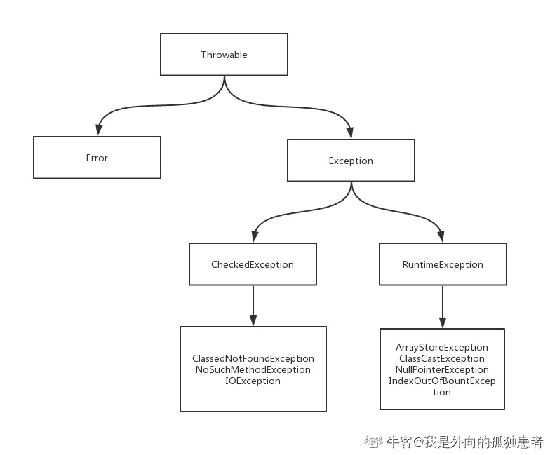
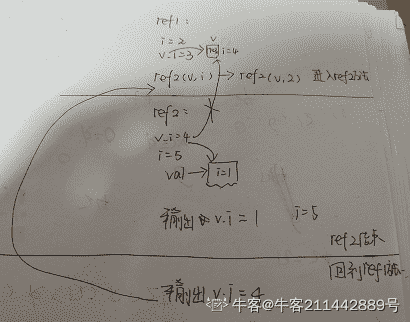

# 欢聚时代 2018 校招笔试题-Java 开发/运维研发/数据挖掘 B 卷

## 1

关于 main 方法声明以下有哪些是合法的？

正确答案: A B   你的答案: 空 (错误)

```cpp
public static void main(String[] args)
```

```cpp
public static void main(String[] strings)
```

```cpp
static void main(String[] strings) throws FileNotFindExcetpion
```

```cpp
public static void main(String[] args) throw Excetpion
```

本题知识点

欢聚集团 Java 工程师 C++工程师 iOS 工程师 安卓工程师 运维工程师 前端工程师 算法工程师 PHP 工程师 数据挖掘工程师 2018

讨论

[在风中凌乱](https://www.nowcoder.com/profile/9038371)

D 选项是 throws 而不是 throw，而且是 Exception 而不是 Excetpion。

发表于 2018-07-12 16:06:39

* * *

[Lvan•Wong](https://www.nowcoder.com/profile/270615737)

public static void main(String[] args)

1.这是最准确的，可以变的就两个地方 第一 String[] args 中，args 的命名可以修改

2.public 和 static 可以互换位置

对于本题来说还有两个地方错：
1、throw**s** FileNotFindExcetpion
根本就没有这个异常，有的是 FileNot**Found**Excetpion、filenot**found**exception

2、**throw** Excetpion
这个
throw 是语句抛出一个异常。
throws 才是写在方法上，表面该方法可能跑出异常

拓展：

一、异常的结构



二、常见的编译时异常

1.FileNotFoundException

2.ClassNotFoundException

3.SQLException

4.NoSuchFieldException

5.NoSuchMethodException

6.ParseException

三、常见的运行时异常

1.NullPointerException

2.ArithmeticException

3.ClassCastException

4.ArrayIndexOutOfBoundsException

5.StringIndexOutOfBoundsException

发表于 2020-08-11 12:53:15

* * *

[wuliji](https://www.nowcoder.com/profile/8731913)

C 选项是 FileNotFoundException 而不是 FileNotFindException.

发表于 2018-07-08 18:48:06

* * *

## 2

Which of the followings are true about RuntimeException?

正确答案: B C D   你的答案: 空 (错误)

```cpp
A RuntimeException is a subclass of Throwable which indicates serious problems that a reasonable application should not try to catch.
```

```cpp
RuntimeException is the subclass of those exceptions that must be thrown during the normal operation of the JVM.
```

```cpp
NullPointerExcetpion is one kind of RuntimeException.
```

```cpp
A method is not required to declare in its throwsclause any subclasses of RuntimeException that might be thrown during the execution of the method but not caught.
```

本题知识点

欢聚集团 Java 工程师 C++工程师 iOS 工程师 安卓工程师 运维工程师 前端工程师 算法工程师 PHP 工程师 数据挖掘工程师 2018

讨论

[Lvan•Wong](https://www.nowcoder.com/profile/270615737)

A、RuntimeException 是 Throwable 的一个子类，他说明出现严重问题，不能被捕获
（这里应该是说 error，换成 error 就对）B、RuntimeException 是那些在 JVM 正常运行期间必须抛出的异常的子类。
（我觉得这里是“必须”“must”怪怪的）C、NullPointerExcetpion 是一种运行时异常。

D、大概就是说：RuntimeException 不需要在方法上用 throws 声明、做 catch 捕获，但是在方法执行过程中可能引发。（这里补充一下，运行时异常是可以被捕获，只要是 Throwable 的子类实例都可以捕获，只是不推荐，因为运行时异常多是由于逻辑错误导致的，属于应该解决的 bug。）太难了，程序员还是应该多读一读英语

发表于 2020-08-11 13:06:14

* * *

[娃哈哈 402](https://www.nowcoder.com/profile/5859293)

B 明显错了吧？？？

发表于 2018-12-01 00:19:01

* * *

[不戴红领巾的大队长](https://www.nowcoder.com/profile/1084171)

An Error is a subclass of Throwable that indicates serious problems that a reasonable application should not try to catch. 

发表于 2018-08-31 15:56:10

* * *

## 3

关于 Java 虚拟机垃圾回收以下说法正确的有哪些？

正确答案: C D   你的答案: 空 (错误)

```cpp
Java 虚拟机中的自动垃圾回收机制能阻止程序运行时内存溢出
```

```cpp
垃圾回收是一个独立的平台
```

```cpp
当一个对象的所有引用都被置为空时，该对象就可以变为能被垃圾回收的
```

```cpp
System.gc()可以建议垃圾回收执行，但不能强迫其执行；
```

本题知识点

欢聚集团 Java 工程师 C++工程师 iOS 工程师 安卓工程师 运维工程师 前端工程师 算法工程师 PHP 工程师 数据挖掘工程师 2018

讨论

[寻找 offer](https://www.nowcoder.com/profile/6035108)

垃圾回收只是一个 daemon 线程 GC 直接减缓内存溢出的出现，但并不会阻止内存溢出

发表于 2018-07-16 19:58:51

* * *

[冗热](https://www.nowcoder.com/profile/567361028)

GC 是 jvm 的一部分，可以进行垃圾回收但是不保证不会出现内存溢出，要不然 OOM 哪来的？

发表于 2019-03-04 12:06:34

* * *

[IT 小村](https://www.nowcoder.com/profile/429065690)

JVM 令人又爱又恨，内存自动管理，方便的同时，一旦出现内存泄漏则伤脑筋

发表于 2019-01-23 12:07:11

* * *

## 4

以下哪些方法不是 Object 类所定义的 public method？

正确答案: B   你的答案: 空 (错误)

```cpp
clone()
```

```cpp
sleep()
```

```cpp
wait()
```

```cpp
finalize()
```

本题知识点

欢聚集团 Java 工程师 C++工程师 iOS 工程师 安卓工程师 运维工程师 前端工程师 算法工程师 PHP 工程师 数据挖掘工程师 2018

讨论

[蝉鸣 niuke](https://www.nowcoder.com/profile/3147955)

还要加上 clone()和 finalize()方法，这两个方法都是 protected 的

发表于 2018-08-02 13:25:35

* * *

[Lvan•Wong](https://www.nowcoder.com/profile/270615737)

Object 类方法

Object 是所有类的父类，任何类都默认继承 Object。Object 类到底实现了哪些方法？

（1）clone 方法

保护方法，实现对象的浅复制，只有实现了 Cloneable 接口才可以调用该方法，否则抛出 CloneNotSupportedException 异常。

（2）getClass 方法

final 方法，获得运行时类型。

（3）toString 方法

该方法用得比较多，一般子类都有覆盖。

（4）finalize 方法

该方法用于释放资源。因为无法确定该方法什么时候被调用，很少使用。

（5）equals 方法

该方法是非常重要的一个方法。一般 equals 和==是不一样的，但是在 Object 中两者是一样的。子类一般都要重写这个方法。

（6）hashCode 方法

该方法用于哈希查找，重写了 equals 方法一般都要重写 hashCode 方法。这个方法在一些具有哈希功能的 Collection 中用到。

一般必须满足 obj1.equals(obj2)==true。可以推出 obj1.hash- Code()==obj2.hashCode()，但是 hashCode 相等不一定就满足 equals。不过为了提高效率，应该尽量使上面两个条件接近等价。

（7）wait 方法

wait 方法就是使当前线程等待该对象的锁，当前线程必须是该对象的拥有者，也就是具有该对象的锁。wait()方法一直等待，直到获得锁或者被中断。wait(long timeout)设定一个超时间隔，如果在规定时间内没有获得锁就返回。

调用该方法后当前线程进入睡眠状态，直到以下事件发生。

（1）其他线程调用了该对象的 notify 方法。

（2）其他线程调用了该对象的 notifyAll 方法。

（3）其他线程调用了 interrupt 中断该线程。

（4）时间间隔到了。

此时该线程就可以被调度了，如果是被中断的话就抛出一个 InterruptedException 异常。

（8）notify 方法

该方法唤醒在该对象上等待的某个线程。

（9）notifyAll 方法

该方法唤醒在该对象上等待的所有线程。

发表于 2020-08-11 13:09:29

* * *

[网易-内推](https://www.nowcoder.com/profile/6764700)

A 也要选，clone()时 protected 方法。

发表于 2018-07-22 19:40:15

* * *

## 5

关于抽象类说法以下哪些是正确的？

正确答案: A C   你的答案: 空 (错误)

```cpp
抽象类中可以不存在任何抽象方法
```

```cpp
抽象类可以为 final 的
```

```cpp
抽象类可以被抽象类所继承
```

```cpp
如果一个非抽象类从抽象类中派生，不一定要通过覆盖来实现继承的抽象成员
```

本题知识点

欢聚集团 Java 工程师 C++工程师 iOS 工程师 安卓工程师 运维工程师 前端工程师 算法工程师 PHP 工程师 数据挖掘工程师 2018 C++

讨论

[offer 工程师](https://www.nowcoder.com/profile/152439887)

如果一个非抽象类从抽象类中派生，不通过覆盖来实现继承的抽象成员，此时，派生类也会是抽象类，因为基类的抽象方法被继承下来，在派生类中，没有被重写，仍为抽象方法，那也就是说一样是抽象类了

发表于 2020-12-04 00:29:48

* * *

[冗热](https://www.nowcoder.com/profile/567361028)

抽象类就是必须要被覆盖的 所以他才不能和 final 一起用啊

发表于 2019-03-04 12:10:53

* * *

[风的味道 1990](https://www.nowcoder.com/profile/9444002)

A 之所以对，是因为可以定义个抽象类 a，a 中有个抽象方法，然后定义个 b，继承 a，b 没有实现 a 中的抽象方法，但是 b 也没有定义自己的抽象方法，b 仍然是抽象类。

发表于 2020-08-27 18:18:31

* * *

## 6

当路由收到目标为 202.38.17.98 的 IP 包时，将选取哪个路由项转发？

正确答案: D   你的答案: 空 (错误)

```cpp
202.38.17.0/25
```

```cpp
202.38.17.32/27
```

```cpp
202.38.17.64/26
```

```cpp
202.38.17.96/27
```

本题知识点

欢聚集团 Java 工程师 C++工程师 iOS 工程师 安卓工程师 运维工程师 前端工程师 算法工程师 PHP 工程师 数据挖掘工程师 2018

讨论

[小胖子要增肥](https://www.nowcoder.com/profile/3170358)

ACD 都是对的，但是，在路由中如果这三个都存在的话，那么就需要使用“最长匹配原则”，选择子网掩码最长的进行转发。

发表于 2018-09-12 14:51:50

* * *

## 7

以下哪些地址属于网段：202.38.18.64/27

正确答案: A B C   你的答案: 空 (错误)

```cpp
202.38.18.68
```

```cpp
202.38.18.86
```

```cpp
202.38.18.88
```

```cpp
202.38.18.98
```

本题知识点

欢聚集团 Java 工程师 C++工程师 iOS 工程师 安卓工程师 运维工程师 前端工程师 算法工程师 PHP 工程师 数据挖掘工程师 2018

讨论

[IT 小村](https://www.nowcoder.com/profile/429065690)

27=3*8+38-3=52⁵=3232，64，96，1280~31，32~63，64~95，96~127**64 <= 68,86,88 <= 95**

编辑于 2019-01-23 12:22:12

* * *

[花言不知梦](https://www.nowcoder.com/profile/4035965)

主机号的取值范围应该是 **65 到 94**主机号（后 5 位）不能全为 0（也就是 64），因为全为 0 就是代表子网的网络地址主机号（后 5 位）不能全为 1（也就是 95），因为全为 1 就是代表子网的广播地址我这样有无错误，希望大佬指正，和下面的答案不太一样

发表于 2020-06-18 02:35:41

* * *

[高崇贵](https://www.nowcoder.com/profile/1461383)

根据 ip 地址，前 27 位是网络地址，所以后 5 位是主机地址。2⁵=32.64+32=96。所以 64~96 之间都可以。D 选项错误

发表于 2018-07-21 22:41:56

* * *

## 8

关于 TCP/IP 协议中的 TCP 和 UDP 以下哪些表述是正确的？

正确答案: A B C   你的答案: 空 (错误)

```cpp
TCP 和 UDP 包头结构中都不包含目的地址的 IP
```

```cpp
视频、聊天等数据的传输都可以基于 UDP 协议
```

```cpp
数据通过 UDP 协议传输存在丢包的可能，因此其传输可靠性不如 TCP 协议
```

```cpp
UDP 和 TCP 包都是固定长度的
```

本题知识点

欢聚集团 Java 工程师 C++工程师 iOS 工程师 安卓工程师 运维工程师 前端工程师 算法工程师 PHP 工程师 数据挖掘工程师 2018

讨论

[在风中凌乱](https://www.nowcoder.com/profile/9038371)

目标 IP 地址包含在 IP 头部中

发表于 2018-07-12 16:20:10

* * *

[江户川 lb](https://www.nowcoder.com/profile/342151796)

我就纳闷了，TCP 是可靠传输 就代表不会丢包？

发表于 2021-09-06 11:12:53

* * *

[takeitdown](https://www.nowcoder.com/profile/373251715)

数据传输时先经过传输层（TCP、UDP 协议所在层），再经过网络层（IP 所在层），所以其头结构不会包含 IP

发表于 2019-09-07 18:18:11

* * *

## 9

以下哪些是 JSP 的内置对象？

正确答案: A B C D   你的答案: 空 (错误)

```cpp
request
```

```cpp
page
```

```cpp
pageContext
```

```cpp
session
```

本题知识点

欢聚集团 Java 工程师 C++工程师 iOS 工程师 安卓工程师 运维工程师 前端工程师 算法工程师 PHP 工程师 数据挖掘工程师 2018

讨论

[三月三对半](https://www.nowcoder.com/profile/6288087)

```cpp
九大内置对象
request
response
page
session
application
out
exception
config
pageContext
```

发表于 2018-09-13 15:09:56

* * *

## 10

若系统中有 5 台打印机资源，有多个进程均需要使用 2 台，若规定每个进程 1 次只允许申请 1 台，则至多允许多少个进程参与竞争而不发生死锁？

正确答案: B   你的答案: 空 (错误)

```cpp
3
```

```cpp
4
```

```cpp
5
```

```cpp
6
```

本题知识点

欢聚集团 Java 工程师 C++工程师 iOS 工程师 安卓工程师 运维工程师 前端工程师 算法工程师 PHP 工程师 数据挖掘工程师 2018

讨论

[老子是反派](https://www.nowcoder.com/profile/921020745)

假如 5 个打印机被 5 个进程申请了，由于需要两台打印机才能工作，所以会进入死锁状态；假如其中的 4 个打印机被 4 个进程申请，还剩下一个打印机被谁分配到谁就能工作，其他进程可以等那一个工作完成后再工作

发表于 2018-09-02 15:46:37

* * *

[gdut17](https://www.nowcoder.com/profile/279358190)

1*N + 1 <= 5N<=4

发表于 2020-09-03 23:23:19

* * *

[高崇贵](https://www.nowcoder.com/profile/1461383)

哲学家就餐问题

发表于 2018-07-21 22:45:54

* * *

## 11

以下哪些是操作系统的职责功能？

正确答案: A B C D   你的答案: 空 (错误)

```cpp
设备管理
```

```cpp
进程管理
```

```cpp
文件管理
```

```cpp
作业管理
```

本题知识点

欢聚集团 Java 工程师 C++工程师 iOS 工程师 安卓工程师 运维工程师 前端工程师 算法工程师 PHP 工程师 数据挖掘工程师 2018

讨论

[高崇贵](https://www.nowcoder.com/profile/1461383)

操作系统的功能: （1）作业管理　　 （2）文件管理　 （3）存储管理 （4）设备管理 （5）进程管理

发表于 2018-07-21 22:48:59

* * *

## 12

假设就绪队列中有 15 个进程，系统将时间片设为 100ms，CPU 进程切换要花费 5ms，则系统开销占比多少？

正确答案: A   你的答案: 空 (错误)

```cpp
0.05
```

```cpp
0.1
```

```cpp
0.15
```

```cpp
0.2
```

本题知识点

欢聚集团 Java 工程师 C++工程师 iOS 工程师 安卓工程师 运维工程师 前端工程师 算法工程师 PHP 工程师 数据挖掘工程师 2018

讨论

[花式括号](https://www.nowcoder.com/profile/2055647)

[`www.zhihu.com/question/29209855/answer/43549181`](https://www.zhihu.com/question/29209855/answer/43549181) 知乎上有一个挺准确的答案

发表于 2018-09-11 10:18:59

* * *

[不戴红领巾的大队长](https://www.nowcoder.com/profile/1084171)

系统开销比率=切换进程总时间 / 进程总共运行时间；

发表于 2018-08-31 16:26:14

* * *

[去哪都行](https://www.nowcoder.com/profile/1618600)

5ms/100ms

发表于 2018-09-05 16:07:02

* * *

## 13

设有关系 R(S,R,T)，其函数依赖集 F={S->R,R->T}，则关系 R 至多满足()?

正确答案: B   你的答案: 空 (错误)

```cpp
1NF
```

```cpp
2NF
```

```cpp
3NF
```

```cpp
BCNF
```

本题知识点

欢聚集团 Java 工程师 C++工程师 iOS 工程师 安卓工程师 运维工程师 前端工程师 算法工程师 PHP 工程师 数据挖掘工程师 2018

讨论

[IT 小村](https://www.nowcoder.com/profile/429065690)

∵ S->R,R->T∴ S->T

发表于 2019-01-23 13:18:40

* * *

[不戴红领巾的大队长](https://www.nowcoder.com/profile/1084171)

存在传递依赖

发表于 2018-08-31 16:29:09

* * *

## 14

关于数据库主键以下哪些说法是正确的？

正确答案: A C D   你的答案: 空 (错误)

```cpp
可以将多个字段的组合设置为主键
```

```cpp
一个表中可以设置多个主键约束
```

```cpp
主键必须满足唯一性约束
```

```cpp
主键约束的字段中的数据不能重复
```

本题知识点

欢聚集团 Java 工程师 C++工程师 iOS 工程师 安卓工程师 运维工程师 前端工程师 算法工程师 PHP 工程师 数据挖掘工程师 2018

讨论

[gdut17](https://www.nowcoder.com/profile/279358190)

主键只有一个主键不能为空主键不能重复主键可以是多个字段联合建立

发表于 2020-09-03 23:25:09

* * *

[ecjtu-16-软工 4 班华园林](https://www.nowcoder.com/profile/711641324)

组合主键，可以有部分字段重复

发表于 2019-12-10 18:22:51

* * *

[IT 小村](https://www.nowcoder.com/profile/429065690)

```cpp
主键必须满足唯一性约束
```

发表于 2019-01-23 13:50:09

* * *

## 15

为了便于实现多级中断，保存现场信息最有效的方法是采用?

正确答案: A   你的答案: 空 (错误)

```cpp
堆栈
```

```cpp
外存
```

```cpp
存储器
```

```cpp
通用寄存器
```

本题知识点

欢聚集团 Java 工程师 C++工程师 iOS 工程师 安卓工程师 运维工程师 前端工程师 算法工程师 PHP 工程师 数据挖掘工程师 2018

讨论

[不戴红领巾的大队长](https://www.nowcoder.com/profile/1084171)

在多级中断时，每一层的中断都需要保护中断时的现场信息，例如一个三级中断，依次需要保护第一、第二、第三级的现场信息，当产生第三级的中断处理程序结束后，首先恢复第三级的现场进行处理，接着返回第二级，以此类推 ，这正好符合堆栈的特性。

发表于 2018-08-31 16:35:07

* * *

[IT 小村](https://www.nowcoder.com/profile/429065690)

汇编语言，栈 push x，pop x

编辑于 2019-01-23 13:51:38

* * *

## 16

在计算机组成原理中，以下说法哪些是正确的？

正确答案: B C   你的答案: 空 (错误)

```cpp
总线结构传递方式可以提高数据的传输速度
```

```cpp
与独立请求相比，链式查询方式对电路的故障更敏感
```

```cpp
PCI 总线采用同步时序协议和集中式仲裁策略
```

```cpp
总线的带宽即总线本身所达到的平均传输速率
```

本题知识点

欢聚集团 Java 工程师 C++工程师 iOS 工程师 安卓工程师 运维工程师 前端工程师 算法工程师 PHP 工程师 数据挖掘工程师 2018

讨论

[IT 小村](https://www.nowcoder.com/profile/429065690)

```cpp
D.最大传输速率
```

发表于 2019-01-25 12:20:12

* * *

## 17

下面程序输出的结果是？
public class ExamSample {
public static void main(String[] args) {
new ExamSample().convert();
}
public void convert() {
int i = 012;
char a = 'a';
System.out.println((i > 11) ? i : a);
System.out.println((i > 11) ? 65 : a);
System.out.println((i > 11) ? 65.0 : a);
}
}

正确答案: B   你的答案: 空 (错误)

```cpp
12,65,65.0
```

```cpp
97,a,97.0
```

```cpp
97,97,97.0
```

```cpp
a,a,a
```

本题知识点

欢聚集团 Java 工程师 C++工程师 iOS 工程师 安卓工程师 运维工程师 前端工程师 算法工程师 PHP 工程师 数据挖掘工程师 2018

讨论

[在风中凌乱](https://www.nowcoder.com/profile/9038371)

[`blog.sina.com.cn/s/blog_6810dfc20101j7op.html`](http://blog.sina.com.cn/s/blog_6810dfc20101j7op.html)

发表于 2018-07-12 16:27:00

* * *

[最喜欢的是 offer](https://www.nowcoder.com/profile/255600620)

首先,i 是一个以 0 开头的八进制数 012 把它转换成十进制： 0 * 8 ^ 3 + 1 * 8 ^ 2 + 2 * 8 ⁰ = 10 第二,判断下面三行的输出内容:1.char 类型的 a 在跟 int 型的变量做比较时,会被自动提升为 int 型,所以输出 972.与 a 比较的是一个常量表达式,与常量表达式做比较时,输出的内容取决于与之比较的 T 的类型,在这里是 char,所以输出 a3.根据上面的推理,就可以得出,与 double 类型进行比较时,会被提升为 double 类型

发表于 2020-08-23 14:04:29

* * *

[south2019](https://www.nowcoder.com/profile/689594478)

int i=012；012 为八进制数，转换成十进制为 10

发表于 2018-09-12 21:51:03

* * *

## 18

下面程序输出的结果是？
public class ExamSample {
public static void main(String[] args) {
new ExamSample().ref1();
}
public static class Val {
int i = 1;
}
public void ref1() {
int i = 2;
Val v = new Val();
v.i = 3;
ref2(v,i);
System.out.println(v.i);
}
public void ref2(Val v, int i) {
v.i = 4;
i = 5;
Val val = new Val();
v = val;
System.out.print(v.i+","+i+",");
}
}

正确答案: C   你的答案: 空 (错误)

```cpp
4,5,3
```

```cpp
4,5,4
```

```cpp
1,5,4
```

```cpp
1,5,3
```

本题知识点

欢聚集团 Java 工程师 C++工程师 iOS 工程师 安卓工程师 运维工程师 前端工程师 算法工程师 PHP 工程师 数据挖掘工程师 2018

讨论

[牛客 211442889 号](https://www.nowcoder.com/profile/211442889)



发表于 2022-02-07 19:40:06

* * *

[闷死作大死](https://www.nowcoder.com/profile/433851177)

直接分析最后一个为什么是 4 吧

调用 ref2 的方法时传入的其实是 v 的副本 v', v 与 v' 都指向堆中的同一个对象, 

v'.i = 4;  堆中对象的 i 属性变成了 4,

Val val = new Val(); 又在堆中创建了个对象, val 指向这个新的对象,

v' = val;  将 v' 指向了这个新的对象, 并没有对 v 产生影响

所以 v.i 还是 4

发表于 2019-03-18 21:09:05

* * *

## 19

假定有编号为 12345 的数字依次输入最多容纳 4 个数字的空栈，每个数字有且仅有 1 次进出栈机会，则可能的数字输出顺序有？

正确答案: A C   你的答案: 空 (错误)

```cpp
12345
```

```cpp
45312
```

```cpp
43251
```

```cpp
54321
```

本题知识点

欢聚集团 Java 工程师 C++工程师 iOS 工程师 安卓工程师 运维工程师 前端工程师 算法工程师 PHP 工程师 数据挖掘工程师 2018

讨论

[qyq 明天会更好](https://www.nowcoder.com/profile/38027871)

栈中最多放入 4 个数，不可能 5 个数都进栈。

发表于 2018-08-31 09:16:15

* * *

[花言不知梦](https://www.nowcoder.com/profile/4035965)

有个**坑**，容纳 4 个数据

发表于 2020-06-18 02:41:21

* * *

[冗热](https://www.nowcoder.com/profile/567361028)

最多容纳 4 个 就说明 5 不可能先出栈 排除 D

发表于 2019-03-04 16:45:39

* * *

## 20

针对给定的数字序列(58,46,98,97,58,84,36,94)，若以第一个数字 58 为基准进行一趟快速排序的结果是？

正确答案: D   你的答案: 空 (错误)

```cpp
46,36,58,58,84,97,98,94
```

```cpp
46,36,58,58,97,84,98,94
```

```cpp
36,46,58,58,84,97,98,94
```

```cpp
36,46,58,58,97,84,98,94
```

本题知识点

欢聚集团 Java 工程师 C++工程师 iOS 工程师 安卓工程师 运维工程师 前端工程师 算法工程师 PHP 工程师 数据挖掘工程师 2018

讨论

[过了笔试至少再过个面试吧](https://www.nowcoder.com/profile/746701735)

58,46,98,97,58,84,36,94 网上看到类似挖坑的解说还不错基准 58 ，挖了个坑 __,46,98,97,58,84,**36**,94left                        right 从右往左找个<=58 的数把坑补上 36,46,**98**,97,58,84,__,94          left              right 从左往右找个>58 的数把坑补上
36,46,__,97,**58**,84,98,94
          left    right 从右往左找个<=58 的数把坑补上 36,46,58,**97**,**__**,84,98,94left right 从左往右找个>58 的数把坑补上 36,46,58,__,97,84,98,94              left&right 重合，结束菜狗解析，有意见指出，有问题 cue 我

发表于 2019-09-12 15:34:31

* * *

## 21

一棵二叉树的前序遍历是 ABDCEF，中序遍历结果是 DBAECF，则后序遍历的结果为 1

你的答案 (错误)

1 参考答案 (1) DBEFCA

本题知识点

欢聚集团 Java 工程师 C++工程师 iOS 工程师 PHP 工程师 运维工程师 数据挖掘工程师 2018

讨论

[牛有道](https://www.nowcoder.com/profile/43911958)

[`blog.csdn.net/m0_37698652/article/details/79218014`](https://blog.csdn.net/m0_37698652/article/details/79218014)

发表于 2018-09-24 11:18:47

* * *

## 22

请给出下面程序的时间复杂度 1
for(int i = 0; i < n; i++)
for(int j = 0; j < n; j += n/4)
for(int k = 0; k < n; k = 2*k) {
//TODO: do something here
}

你的答案 (错误)

1 参考答案 (1) O(nlogn)

本题知识点

欢聚集团 Java 工程师 C++工程师 iOS 工程师 算法工程师 运维工程师 数据挖掘工程师 2018

讨论

[求个 offer 到碗里](https://www.nowcoder.com/profile/5143247)

额。。。这个内循环 k 不是一直都是 0 么。。或者这里应该是 2 的 k 次方？

发表于 2018-10-07 19:20:44

* * *

[超爱逛街的耶耶](https://www.nowcoder.com/profile/55198044)

这里的 k=1 吧

发表于 2019-08-06 15:41:25

* * *

## 23

用二进制编码字符串"abcdaabaa"，需要能够根据编码来解码回原来的字符串，至少需要多长的二进制字符串?1

你的答案 (错误)

1 参考答案 (1) 15

本题知识点

欢聚集团 Java 工程师 C++工程师 iOS 工程师 PHP 工程师 运维工程师 数据挖掘工程师 2018

讨论

[在风中凌乱](https://www.nowcoder.com/profile/9038371)

用霍夫曼编码来压缩，a:0，b:10，c:110，d:111，二进制编码为 010110111001000

发表于 2018-07-12 16:41:28

* * *

[gdut17](https://www.nowcoder.com/profile/279358190)

```cpp
             9
           /   \
          4      a
         / \      
       b    2
           /  \
          c    d

a:1
b:00
c:010
d:011

sum =15

```

编辑于 2020-09-03 23:30:08

* * *

## 24

请给出计算机计算 18-10 的二进制表示方式 1,并给出二进制运算结果 2，以及对应的十进制值 3

你的答案 (错误)

123 参考答案 (1) 00010010+11110110
(2) 00001000
(3) 8

本题知识点

欢聚集团 C++工程师 iOS 工程师 算法工程师 PHP 工程师 运维工程师 数据挖掘工程师 Java 工程师 2018

讨论

[offer++!](https://www.nowcoder.com/profile/415142417)

位数补全，18+（-10） 转换成补码再相加 

发表于 2018-09-14 11:48:50

* * *

## 25

下面程序依次输出的 3 个值 i,j,k 分别是 123?
public class ExamSample {
public static void main(String[] args) {
new ExamSample( ).pluses( );
}
public void pluses( ) {
int i = -010;
int j = ++i + i++ + i++ + ++i;
int k = j++ + ++j + j++ + ++j;
System.out.println(String.format("i=%s,j=%s,k=%s", i, j, k));
}
}

你的答案 (错误)

123 参考答案 (1) -4
(2) -20
(3) -88

本题知识点

欢聚集团 Java 工程师 C++工程师 iOS 工程师 PHP 工程师 运维工程师 数据挖掘工程师 2018

讨论

[过了笔试至少再过个面试吧](https://www.nowcoder.com/profile/746701735)

++a 在**使用变量 a 之前**，先使 a 的值加 1a++在**使用变量 a 之后**，再使 a 的值减 1

发表于 2019-09-12 15:46:23

* * *

[Kobayashi](https://www.nowcoder.com/profile/307498787)

一开始那里被坑了

```cpp
int i = -010;
```

第一位数字是 0，所以表示 8 进制的，换成十进制也就是 0*8⁰ + 1*8¹ = 8 ，前面有一个负号，也就是-8
后面就简单了

```cpp
int  j = ++i + i++ + i++ + ++i
也就是 j = (-7)+(-7)+(-6)+(-4)
下面同理
```

发表于 2019-09-10 13:19:12

* * *

[Ziggy_Yu](https://www.nowcoder.com/profile/361698599)

八進制。

发表于 2018-11-10 20:19:00

* * *

## 26

A 公司产品运营活动需向选定的目标用户发送活动通知短信，短信发送是通过目标用户 uid 索引出其绑定的手机号进行短信发送，由于存在一个手机号绑定多个不同 uid 情况，为了降低这种情况下短信重复发送对用户造成骚扰，因此，需要对手机号去重发送。
请描述至少 3 种方案解决上述问题，并给出每种方案的优缺点，以及各自相对更适用的场景。（注：不能使用本地 IDE）

你的答案

本题知识点

欢聚集团 Java 工程师 C++工程师 iOS 工程师 安卓工程师 运维工程师 前端工程师 算法工程师 PHP 工程师 数据挖掘工程师 2018

讨论

[林锴](https://www.nowcoder.com/profile/8152078)

1.使用 set，将手机号放进 set 里面，在发送前检测是否手机号存在 set 里面，如果存在，跳过发送 2.使用 distinct 函数查询的时候进行去重 3.使用 redis 进行去重

发表于 2018-09-04 10:07:47

* * *

## 27

假设考试信息以"编号,姓名,得分"格式按行记录（即一行代表一名考试信息）于文件"F:\\examerscore.dat"，编程统计本次考生考试情况，结果包含：
1)最高得分考生信息（编号、姓名、得分）
2)最低得分考生信息（编号、姓名、得分）
3)平均得分信息（考生总数，平均分）
4)超过平均分考生信息（超过的总人数，每人的编号、姓名、得分）
5)输出 top(N*60%)的考生信息（超过的总人数，每人的编号、姓名、得分）

请根据下面代码片段，完善以上要求的编程(可以自定义一些辅助函数提高程序可读性)：
public static void main(String[] args) throws IOException {
ExamersKeeper tester = new ExamersKeeper();
String examerFile = "F:/examerscore.dat";
//TODO:读取考生信息
List<Examer> examers = tester.readExamersFromFile(examerFile);
//TODO:排序
sort(examers);
//TODO:1)最高得分考生信息（编号、姓名、得分）

//TODO:2)最低得分考生信息（编号、姓名、得分）

//TODO:3)平均得分信息（考生总数，平均分）

//TODO:4)超过平均分考生信息（超过的总人数，每人的编号、姓名、得分）

//TODO:5)输出 top(N*60%)的考生信息（超过的总人数，每人的编号、姓名、得分）

}</examer>（注：不能使用本地 IDE）

你的答案

本题知识点

欢聚集团 Java 工程师 C++工程师 iOS 工程师 安卓工程师 运维工程师 前端工程师 算法工程师 PHP 工程师 数据挖掘工程师 2018

## 28

对于任意给定的一组字符组成的一个数组，假设一定存在某个字符出现的总次数超过其它字符出现的总次数之和，如：字符数组['a','b','2','b','b']中的字符'b'，再如字符数组['c','2','c','c']中的字符'c'。
1)（4 分）请编写程序找出数组中该字符，要求：程序中使用到 Map 型数据存储结构(如 HashMap、HashTable 等)；
2)（5 分）请编写程序找出数组中该字符，要求：①程序中不使用 Map 型数据存储结构(如 HashMap、HashTable 等)；②尝试将数据有序化后再进行查找；③排序不允许调用 Java API 类库，排序算法时间复杂度优先；
3)（6 分）请编写程序找出数组中该字符，要求：①思路与上面的 1)和 2)不同，不使用 Map 型数据存储结构且不使用排序手段；②时间复杂度为 O(n);(注：n 代表数组长度)③空间复杂度越低越好；
4)（5 分）请分别给出上面 1)2)3)你实现的算法的时间复杂度和空间复杂度；（注：不能使用本地 IDE）

你的答案

本题知识点

欢聚集团 Java 工程师 C++工程师 iOS 工程师 安卓工程师 运维工程师 前端工程师 算法工程师 PHP 工程师 数据挖掘工程师 2018