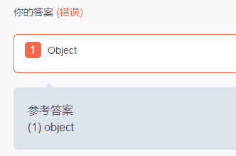
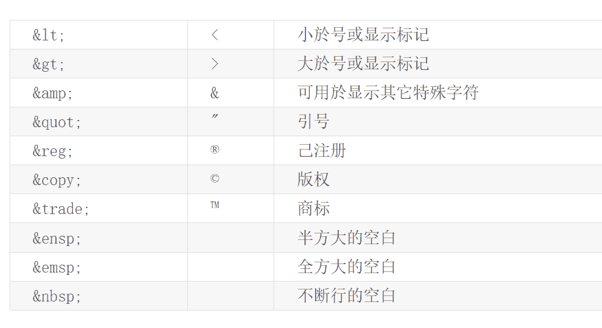
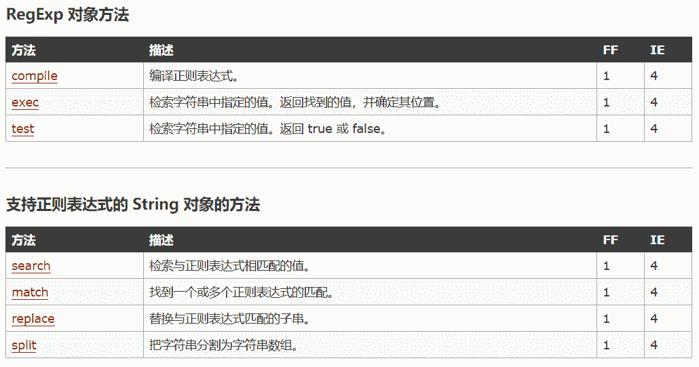
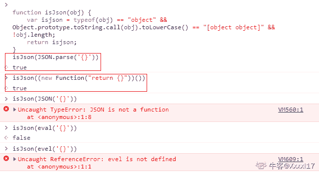

# 欢聚时代 2018 校招笔试题-web 前端 A 卷

## 1

Form 标签的 1 属性用于设置表单提交时向何处发送表单数据。

你的答案 (错误)

1 参考答案 (1) action

本题知识点

欢聚集团 C++工程师 安卓工程师 运维工程师 算法工程师 前端工程师 2018

讨论

[didididididididid](https://www.nowcoder.com/profile/2685534)

action

发表于 2018-08-07 10:05:17

* * *

## 2

HTML 中的 1 标签用于定于无序列表。

你的答案 (错误)

1 参考答案 (1) ul

本题知识点

欢聚集团 安卓工程师 运维工程师 前端工程师 算法工程师 2018

讨论

[我教枣子简灯笼](https://www.nowcoder.com/profile/635698749)

写

发表于 2019-07-24 15:43:42

* * *

[柳小白](https://www.nowcoder.com/profile/375210551)

ul 无序列表。ol 有序列表。

发表于 2020-08-29 14:36:44

* * *

[didididididididid](https://www.nowcoder.com/profile/2685534)

发表于 2018-08-07 10:05:30

* * *

## 3

1

你的答案 (错误)

1
参考答案 (1) border-radius

本题知识点

欢聚集团 安卓工程师 运维工程师 前端工程师 算法工程师 2018

讨论

[didididididididid](https://www.nowcoder.com/profile/2685534)

border-radius

发表于 2018-08-07 10:09:44

* * *

## 4

在 CSS3 中设置样式为：1 可以改变默认盒子模型计算方式。

你的答案 (错误)

1 参考答案 (1) box-sizing:border-box;

本题知识点

欢聚集团 安卓工程师 运维工程师 前端工程师 算法工程师 2018

讨论

[牛客 80379999 号](https://www.nowcoder.com/profile/80379999)

好吧，不写分号是不对的

发表于 2019-12-12 22:39:38

* * *

[tlltll](https://www.nowcoder.com/profile/984905694)

这题有问题叭 设置 contentbox 啥的不也改变盒模式计算方式了么

发表于 2020-09-13 00:29:30

* * *

[前端小白啦](https://www.nowcoder.com/profile/815171945)

好吧，只写 box-sizing 是不对的

发表于 2018-09-10 11:24:11

* * *

## 5

数组的 1 方法可以删除并且返回数组的最后一个元素。

你的答案 (错误)

1 参考答案 (1) pop

本题知识点

欢聚集团 Java 工程师 前端工程师 算法工程师 PHP 工程师 2018

讨论

[didididididididid](https://www.nowcoder.com/profile/2685534)

pop()

发表于 2018-08-07 10:10:25

* * *

## 6

正则表达式的元字符 1 用于匹配一个非数字字符。

你的答案 (错误)

1 参考答案 (1) \D

本题知识点

欢聚集团 安卓工程师 运维工程师 前端工程师 算法工程师 2018

讨论

[didididididididid](https://www.nowcoder.com/profile/2685534)

\D

发表于 2018-08-07 10:11:05

* * *

## 7

Javascript 中的 1 和 2 方法用于改变 this 指向。

你的答案 (错误)

12 参考答案 (1) call 或 apply 或 bind
(2) call 或 apply 或 bind

本题知识点

欢聚集团 Java 工程师 C++工程师 算法工程师 PHP 工程师 前端工程师 2018

讨论

[KEEPFORWORD](https://www.nowcoder.com/profile/140932719)

bindcall/apply

发表于 2020-09-25 16:03:07

* * *

[切图仔啊](https://www.nowcoder.com/profile/901924811)

1.bind2.call/apply

发表于 2019-04-12 16:54:19

* * *

## 8

执行代码 const a = typeof null ; a 的值是 1。

你的答案 (错误)

1 参考答案 (1) object

本题知识点

欢聚集团 Java 工程师 C++工程师 算法工程师 PHP 工程师 前端工程师 2018

讨论

[lingziyaonuliya](https://www.nowcoder.com/profile/7311553)



发表于 2018-09-09 10:57:49

* * *

[二拍](https://www.nowcoder.com/profile/840213224)

返回的字符串 应该要加引号的

发表于 2020-08-28 14:39:34

* * *

[😄😄201901171657621](https://www.nowcoder.com/profile/94671897)

跟答案一样也是错的？？

发表于 2019-10-17 08:52:00

* * *

## 9

http 协议的 1 状态码, 代表永久性转移(Permanently Moved)。

你的答案 (错误)

1 参考答案 (1) 301

本题知识点

欢聚集团 Java 工程师 C++工程师 iOS 工程师 前端工程师 2018

讨论

[sunny@](https://www.nowcoder.com/profile/774275430)

301 永久转移 302 暂时转移 305 使用***

发表于 2018-09-14 15:19:58

* * *

## 10

html 中，大于号(>) 的转义编码是 1。

你的答案 (错误)

1 参考答案 (1) &amp;gt;

本题知识点

欢聚集团 安卓工程师 运维工程师 前端工程师 算法工程师 2018

讨论

[是鸢不是猿](https://www.nowcoder.com/profile/9918676)

还要考虑答案被转义...网站做的很安全（无奈）

发表于 2018-09-10 16:51:04

* * *

[前端小白啦](https://www.nowcoder.com/profile/815171945)

答案我写的&gt;，自动给我转成了>，好神奇

编辑于 2018-09-10 11:33:28

* * *

[柳小白](https://www.nowcoder.com/profile/375210551)

lt; 小于

&gt; 大于

发表于 2020-08-29 14:40:28

* * *

## 11

以下属于 Audio/Video 的方法有？

正确答案: A B C   你的答案: 空 (错误)

```cpp
load()
```

```cpp
play()
```

```cpp
pause()
```

```cpp
stop()
```

本题知识点

欢聚集团 Java 工程师 C++工程师 iOS 工程师 安卓工程师 运维工程师 前端工程师 算法工程师 PHP 工程师 2018 HTML

讨论

[不精通 JavaScript 不罢休](https://www.nowcoder.com/profile/146346458)

pause 暂停 没有 stop

发表于 2020-08-03 22:37:53

* * *

[带着锋芒的善良](https://www.nowcoder.com/profile/7726799)

没有 stop（）方法

发表于 2018-09-07 09:43:37

* * *

[牛客 691586483 号](https://www.nowcoder.com/profile/691586483)

解题思路错了

发表于 2021-01-28 08:35:27

* * *

## 12

以下那些是 css 属性 position 可以设置的值：

正确答案: A B C D   你的答案: 空 (错误)

```cpp
fixed
```

```cpp
relative
```

```cpp
absolute
```

```cpp
inherit
```

本题知识点

欢聚集团 Java 工程师 C++工程师 iOS 工程师 安卓工程师 运维工程师 前端工程师 算法工程师 PHP 工程师 2018 CSS

讨论

[bytedance_svip](https://www.nowcoder.com/profile/2476096)

| absolute | 生成绝对定位的元素，相对于 static 定位以外的第一个父元素进行定位。元素的位置通过 "left", "top", "right" 以及 "bottom" 属性进行规定。 |
| fixed | 生成绝对定位的元素，相对于浏览器窗口进行定位。元素的位置通过 "left", "top", "right" 以及 "bottom" 属性进行规定。 |
| relative | 生成相对定位的元素，相对于其正常位置进行定位。因此，"left:20" 会向元素的 LEFT 位置添加 20 像素。 |
| static | 默认值。没有定位，元素出现在正常的流中（忽略 top, bottom, left, right 或者 z-index 声明）。 |
| inherit | 规定应该从父元素继承 position 属性的值。 |

发表于 2018-09-20 14:34:56

* * *

[粥粥粥 98](https://www.nowcoder.com/profile/408024324)

absolute,fixed,relative,inherit,static,sticky,initial

发表于 2021-04-22 21:19:16

* * *

[Hayle](https://www.nowcoder.com/profile/416498138)

static fixed relative absolute inherit 这 5 个

发表于 2021-04-15 14:04:06

* * *

## 13

有以下代码,最终字体的颜色为？<div class='red black' id="yy">YY</div>
<style>

```cpp
    #yy{color:blue;}
    .black{color:black;}
    .red{color:red;}
    div{color:white;}

```

</style>

正确答案: A   你的答案: 空 (错误)

```cpp
blue
```

```cpp
black
```

```cpp
red
```

```cpp
white
```

本题知识点

欢聚集团 Java 工程师 C++工程师 iOS 工程师 安卓工程师 运维工程师 前端工程师 算法工程师 PHP 工程师 2018

讨论

[木木 LL](https://www.nowcoder.com/profile/641672342)

内联样式权重是 1000；id 的权重是 100；类选择器的权重是 10；标签的权重是 0

发表于 2019-10-11 22:16:14

* * *

[秦 hf](https://www.nowcoder.com/profile/658759310)

行间样式>id>class>标签>通配符

发表于 2019-09-17 15:51:29

* * *

[Tency](https://www.nowcoder.com/profile/4538145)

权重：id＞class＞标签

发表于 2018-07-07 16:58:46

* * *

## 14

以下执行结果不是 number 类型的有

正确答案: A C D   你的答案: 空 (错误)

```cpp
‘a’ + 1
```

```cpp
1/0
```

```cpp
Symbol(0)
```

```cpp
Number('1.9999').toFixed(2)
```

本题知识点

欢聚集团 Java 工程师 C++工程师 iOS 工程师 安卓工程师 运维工程师 前端工程师 算法工程师 PHP 工程师 2018

讨论

[Map1es](https://www.nowcoder.com/profile/521316089)

A string 类型 B Infinity 无限，属于 Number 类型 C Symbol 类型 D toFixed()方法返回的是 String 类型（返回 NumberObject 的字符串表示，不采用指数计数法，小数点后有固定的 num 位数字。）

发表于 2018-12-24 14:50:13

* * *

[前端小白啦](https://www.nowcoder.com/profile/815171945)

求解答一下 BCD

发表于 2018-09-10 11:34:49

* * *

## 15

以下结果返回 true 的有？

正确答案: B   你的答案: 空 (错误)

```cpp
[0,1,2,3,4].every(Number)
```

```cpp
[0,1,2,3,4].some(Number)
```

```cpp
[0,1,2,3,4].map(Number)
```

```cpp
[0,1,2,3,4].forEach(Number)
```

本题知识点

欢聚集团 Java 工程师 C++工程师 iOS 工程师 安卓工程师 运维工程师 前端工程师 算法工程师 PHP 工程师 2018

讨论

[压压惊](https://www.nowcoder.com/profile/6341676)

[0,1,2,3,4].every((value)=>{
    return Number(value);
})可以将 A 选项看成这样，Number(value)得到的 0，1，2，3，4 由于 every 对每一项都运行传入的函数，且传入的函数要求返回布尔值，所以这里 0，1，2，3，4 会强制转换为布尔值。0 的布尔值为 false

发表于 2020-11-04 18:48:46

* * *

[牛客 694924315 号](https://www.nowcoder.com/profile/694924315)

A 把数组里的 0 删除就返回 true

发表于 2020-10-24 21:03:47

* * *

[offer 快到我碗里来-](https://www.nowcoder.com/profile/383052911)

谁来解释一下 A 选型呀

发表于 2019-10-05 10:20:34

* * *

## 16

以下是支持正则表达式的 String 对象的方法有？

正确答案: A B   你的答案: 空 (错误)

```cpp
replace
```

```cpp
split
```

```cpp
test
```

```cpp
exec
```

本题知识点

欢聚集团 Java 工程师 C++工程师 iOS 工程师 安卓工程师 运维工程师 前端工程师 算法工程师 PHP 工程师 2018

讨论

[myblademaster](https://www.nowcoder.com/profile/642907251)



发表于 2018-08-23 10:51:56

* * *

[牛客 206597936 号](https://www.nowcoder.com/profile/206597936)

答案选择 A、BString 对象支持正则表达式的有：search  参数为字符串或正则，可以支持忽略大小写加 i ，但不支持全局查找，找到返回下标，找不到返回-1match  参数为字符串或正则，同上输入字符串，会先调用 RegExp 构造函数将字符串转化成正则表达式，在进行匹配，可以全局匹配和忽略大小写，匹配到返回数组，匹配不到返回 nullreplace  接收两个参数，可以转入正则表达式，修改匹配到的内容返回和引用，下次查找的位置等 split  可以接受正则表达式，分割成数组，两个参数，后一个参数表示切割的长度，一般忽略正则表达式实例方法有：test  校验正则表达式是否匹配，返回 true 和 falseexec  返回数组

发表于 2021-01-20 20:42:33

* * *

## 17

以下代码能把 json 格式的字符 {} 转成 json 对象的有？

正确答案: A C D   你的答案: 空 (错误)

```cpp
JSON.parse(‘{}’)
```

```cpp
JSON(’{}’)
```

```cpp
(new Function("return {}"))()
```

```cpp
evel(‘{}’)
```

本题知识点

欢聚集团 Java 工程师 C++工程师 iOS 工程师 安卓工程师 运维工程师 前端工程师 算法工程师 PHP 工程师 2018

讨论

[shanzi111](https://www.nowcoder.com/profile/1152334)

eval() 函数可计算某个字符串，并执行其中的的 JavaScript 代码。只接受原始字符串作为参数，如果 string 参数不是原始字符串，那么该方法将不作任何改变地返回。因此请不要为 eval() 函数传递 String 对象来作为参数。

发表于 2018-08-30 16:39:39

* * *

[春招年薪 x 冲冲冲](https://www.nowcoder.com/profile/805190040)

```cpp
function isJson(obj) {
	var isjson = typeof(obj) == "object" && Object.prototype.toString.call(obj).toLowerCase() == "[object object]" && !obj.length;
	return isjson;
}
isJson(JSON.parse('{}'))//true
isJson((new Function("return {}"))())//true
isJson(JSON('{}'))//error
isJson(eval('{}'))//false
isJson(evel('{}'))//error
```



编辑于 2020-11-17 12:24:38

* * *

[球球佛祖让我上岸](https://www.nowcoder.com/profile/3963348)

最后一个应该错了吧

发表于 2018-10-02 20:33:44

* * *

## 18

执行以下代码，打印出：
for (let i = 0; i < 3; i++) {
setTimeout(function() {
console.log(i++);
}, 1000);
}

正确答案: A   你的答案: 空 (错误)

```cpp
0 1 2
```

```cpp
1 2 3
```

```cpp
3 3 3
```

```cpp
4 4 4
```

本题知识点

欢聚集团 Java 工程师 C++工程师 iOS 工程师 安卓工程师 运维工程师 前端工程师 算法工程师 PHP 工程师 2018

讨论

[前端小白啦](https://www.nowcoder.com/profile/815171945)

说说这个题我怎么做的，如果不合适请指出：首先排除 CD，选 CD 的可能陷入了自执行函数的误区，这个函数在循环内部每循环一次就输出一次，对于 AB，要搞清楚 i++和++i 的区别，i++是先执行后++，++i 是先++后执行，所以本题中是先执行后++，就是先输出第一个数字 0 再++

发表于 2018-09-10 11:41:35

* * *

[晓寒 yee](https://www.nowcoder.com/profile/323672407)

通过 let /const 关键字声明的变量是拥有块级作用域（指的是任何在 {} 中的内容）。在每次的遍历过程中，i 都有一个新值，并且每个值都在循环内的作用域中。

发表于 2019-07-26 22:35:55

* * *

[***来啦](https://www.nowcoder.com/profile/4815927)

如楼上所说，千万不要陷入自执行函数的误区

发表于 2018-09-14 11:30:38

* * *

## 19

以下是 http 协议的请求方法的有

正确答案: B C D   你的答案: 空 (错误)

```cpp
remove
```

```cpp
post
```

```cpp
get
```

```cpp
head
```

本题知识点

欢聚集团 Java 工程师 C++工程师 iOS 工程师 安卓工程师 运维工程师 前端工程师 算法工程师 PHP 工程师 2018

讨论

[远不远](https://www.nowcoder.com/profile/706702183)

**GET：获取资源******POST：传输实体文本**********PUT：传输文件************DELETE：删除文件****** ****HEAD：获得报文首部**** ****OPTIONS：询问支持的方法**** ****TRACE：追踪路径********CONNECT：要求用隧道协议连接******* 

发表于 2019-03-10 13:17:16

* * *

[前端小白啦](https://www.nowcoder.com/profile/815171945)

HTTP 中的 GET, POST, PUT, DELETE 就对应着对这个资源的查，改，增，删 4 个操作。HEAD 就像 GET，只不过服务端接受到 HEAD 请求后只返回响应头，而不会发送响应内容。当我们只需要查看某个页面的状态的时候，使用 HEAD 是非常高效的，因为在传输的过程中省去了页面内容。 

发表于 2018-09-10 11:43:29

* * *

## 20

在 Object.defineProperty(obj, prop, descriptor) ，descriptor 参数可以设置的属性有？

正确答案: A B D   你的答案: 空 (错误)

```cpp
configurable
```

```cpp
enumerable
```

```cpp
length
```

```cpp
value
```

本题知识点

欢聚集团 Java 工程师 C++工程师 iOS 工程师 安卓工程师 运维工程师 前端工程师 算法工程师 PHP 工程师 2018

讨论

[Agnes201804031341619](https://www.nowcoder.com/profile/3506287)

枚举属性，默认并不是 true...

发表于 2020-01-04 22:17:03

* * *

[晓寒 yee](https://www.nowcoder.com/profile/323672407)

属性描述对象提供 6 个元属性。
（1）value
value 存放该属性的属性值，默认为 undefined。
（2）writable
writable 存放一个布尔值，表示属性值（value）是否可改变，默认为 true。
（3）enumerable
enumerable 存放一个布尔值，表示该属性是否可枚举，默认为 true。如果设为 false，会使得某些操作（比如 for...in 循环、Object.keys()）跳过该属性。
（4）configurable
configurable 存放一个布尔值，表示“可配置性”，默认为 true。如果设为 false，将阻止某些操作改写该属性，比如，无法删除该属性，也不得改变该属性的属性描述对象（value 属性除外）。也就是说，configurable 属性控制了属性描述对象的可写性。
（5）get
get 存放一个函数，表示该属性的取值函数（getter），默认为 undefined。
（6）set
set 存放一个函数，表示该属

发表于 2019-07-26 22:42:28

* * *

## 21

px、em、rem、vh、vw 的区别是什么？

你的答案

本题知识点

欢聚集团 Java 工程师 C++工程师 iOS 工程师 安卓工程师 运维工程师 前端工程师 算法工程师 PHP 工程师 2018

讨论

[兔.还是流氓滴好](https://www.nowcoder.com/profile/869434907)

px 固定像素值 em 根据父元素像素大小按照倍数关系从而得到像素值，如果父元素没有设定再找父父元素，最终找根元素 rem 根据根元素像素大小按照倍数关系获得像素值 vh 根据视窗高度百分比设定 vw 根据视窗宽度百分比设定

发表于 2018-08-27 14:57:14

* * *

[KEEPFORWORD](https://www.nowcoder.com/profile/140932719)

1px 表示显示屏上的一个像素点；em 是相对于父元素 font-size 大小的相对单位；rem 是相对于根元素 html 的 font-size 大小的相对单位；1vh 表示当前视口 1%的高度；1vw 表示当前视口 1%的宽度。

发表于 2020-09-25 16:08:06

* * *

## 22

DOM 的 onload 和 domContentLoaded 事件有什么区别？

你的答案

本题知识点

欢聚集团 Java 工程师 C++工程师 iOS 工程师 安卓工程师 运维工程师 前端工程师 算法工程师 PHP 工程师 2018

讨论

[牛客 34431288 号](https://www.nowcoder.com/profile/34431288)

当 onload 事件触发时，页面上所有的 dom，样式表，脚本，图片等都加载完成，

DOMContentLoaded 仅 dom 加载完成

发表于 2020-09-06 09:08:18

* * *

## 23

requestAnimationFrame 方法是做什么用的，应用场景有哪些？

你的答案

本题知识点

欢聚集团 Java 工程师 C++工程师 iOS 工程师 安卓工程师 运维工程师 前端工程师 算法工程师 PHP 工程师 2018

讨论

[🐣正🐤元🐥是蛋](https://www.nowcoder.com/profile/7900688)

能在浏览器里实现动画的展示。比如进度条的加载

发表于 2018-08-09 16:48:18

* * *

## 24

网站的登录态是如何保持的，一个完整的登录流程是怎样实现的？

你的答案

本题知识点

欢聚集团 Java 工程师 C++工程师 iOS 工程师 安卓工程师 运维工程师 前端工程师 算法工程师 PHP 工程师 2018

讨论

[前端小明](https://www.nowcoder.com/profile/4846506)

通过 session 来保持的，服务端 session 里面存储用户登陆信息，在浏览器用 cookie 存储，每次请求到后端服务器都会带上 cookie。从而验证用户是否登录。
输入用户、密码—>点击登录发送到服务端—》服务端验证密码生成 session—》写入到 cookies返回成功

发表于 2018-09-04 11:52:08

* * *

[前端小白啦](https://www.nowcoder.com/profile/815171945)

通过 cookies 来保持的，cookie 面面存储 token，每次请求到后端服务器都会带上 token。从而验证用户是否登录。 
输入用户、密码—>点击登录发送到服务端—》服务端验证密码生成 token—》写入到 cookies返回成功

1.客户端请求后台登录接口。

2.后台验证通过后，将用户的登录状态保存至 cookie 并写入客户端。

3.客户端再次登录网站，请求 login 接口时，后台直接从客户端获取到该用户写入 cookie 的登录状态。

4.通过对该状态的验证，确认用户是否需要再次登录。

5.如 cookie 过期，则跳转至登录页；如未过期，则直接显示为已登录状态。

发表于 2018-09-10 11:45:06

* * *

## 25

有如下 HTML 代码，实现点击删除链接后，删除当前点击所在的 li 项。<ul class=”list”>
<li>aa<a href="/">删除</a></li>
<li>bb<a href="/">删除</a></li>
<li>cc<a href="/">删除</a></li>
</ul>（注：不能使用本地 IDE）

你的答案

本题知识点

欢聚集团 Java 工程师 C++工程师 iOS 工程师 安卓工程师 运维工程师 前端工程师 算法工程师 PHP 工程师 2018

讨论

[didididididididid](https://www.nowcoder.com/profile/2685534)

```cpp
var ul=document.querySelector('.list'); ul.addEventListener('click',function (event) {
    event.preventDefault(); var li=event.target.parentNode; ul.removeChild(li);
})
```

发表于 2018-08-07 11:01:14

* * *

[前端小明](https://www.nowcoder.com/profile/4846506)

let deleteList = document.getElementsByClass("list")[0];deleteList.onclick = function(e){e.preventDefault()if(e.target.nodeName == "li"){deleteList.removeChild(e.target);}}

发表于 2018-09-13 16:53:34

* * *

[Jenny_Z](https://www.nowcoder.com/profile/943779129)

```cpp
window.onload = function () {  var deleteList = document.getElementsByClassName("list")[0];  deleteList.onclick = function (e) {  e.preventDefault();  if (e.target.nodeName === "A"){  var li = e.target.parentNode;  deleteList.removeChild(li);  }  }  }
```

发表于 2018-09-25 16:41:42

* * *

## 26

用 HTML 和 css3 编写代码，实现一个圆形左右无限循环来回移动。（注：不能使用本地 IDE）

你的答案

本题知识点

欢聚集团 Java 工程师 C++工程师 iOS 工程师 安卓工程师 运维工程师 前端工程师 算法工程师 PHP 工程师 2018

讨论

[KEEPFORWORD](https://www.nowcoder.com/profile/140932719)

<html>
    <head>
      <title>test 网站</title>
      <style>
          body {
              position: relative;
          }
          .target {
              position: absolute;
              width: 200px;
              height: 200px;
              border-radius: 50%;
              background-color: red;
              animation: roll 2s infinite ;
          }
          @keyframes roll {
              0, 100% {
                  transform: translate3d(0, 0, 0)
              }
              50% {
                  transform: translate3d(200px, 0, 0)
              }
          }
      </style>
    </head>
    <body>
        <div class="target"></div>
    </body>
</html>

发表于 2020-09-25 16:15:28

* * *

[前端小白啦](https://www.nowcoder.com/profile/815171945)

<html lang="en">
<head>
    <meta charset="UTF-8">
    <title>Document</title>
    <style>
        div{
            width: 100px;
            height: 100px;
            background-color: #000;
            border-radius: 50%;
            position: absolute;
            -webkit-animation:move 1s infinite;
        }
        @-webkit-keyframes move{
            0%{
                left:0;
            }
            50%{
                left:500px;
            }
            100%{
                left:0;
            }
        }
    </style>
</head>
<body>
    <div></div>
</body>
</html>

发表于 2018-09-10 11:53:44

* * *

[didididididididid](https://www.nowcoder.com/profile/2685534)

```cpp
@keyframes rollCircle { from{ left: 0;
    } to{ left: 50px;
    }
}
.circle{ position: relative; width: 50px; height: 50px; border-radius: 50px; background-color: #f00; -webkit-animation: rollCircle 1s linear infinite alternate; -o-animation: rollCircle 1s linear infinite alternate; animation: rollCircle 1s linear infinite alternate;
}
```

发表于 2018-08-07 11:06:56

* * *

## 27

编写一个函数，用于从 cookie 里面获取数据。（注：不能使用本地 IDE）

你的答案

本题知识点

欢聚集团 Java 工程师 C++工程师 iOS 工程师 安卓工程师 运维工程师 前端工程师 算法工程师 PHP 工程师 2018

讨论

[包子是好包子](https://www.nowcoder.com/profile/9170153)

```cpp
function deal(){ var cookie = document.cookie;
var arr = cookie.split(';');
var obj = {};
arr.forEach(function(item){
   var itemArr = item.split('=');
    obj[itemArr[0]] = itemArr[1];
})
return obj;
}
```

发表于 2018-09-03 15:26:45

* * *

[前端小白啦](https://www.nowcoder.com/profile/815171945)

```cpp
function getCookie(name){
    var arr = document.cookie.split(";");
    for(var i = 0;i<arr.length;i++){
        var arrName = arr[i].split("=");
       if(arrName[0] == name){
            return arrName[1];
        }
    }
    return " ";
}
```

发表于 2018-09-10 12:02:29

* * *

## 28

编写一个 Emitter 事件分发类，有 on、off、trigger、once 方法。（注：不能使用本地 IDE）

你的答案

本题知识点

欢聚集团 Java 工程师 C++工程师 iOS 工程师 安卓工程师 运维工程师 前端工程师 算法工程师 PHP 工程师 2018

讨论

[前端小明](https://www.nowcoder.com/profile/4846506)

```cpp
function EventEmitter(){
 this.tasks = {};
 }
 EventEmitter.prototype = {
 constructor:EventEmitter,
 on: function(name,fn){
 if(!this.tasks[name]){
 this.tasks[name] = [];
 }
 this.tasks[name].push(fn);
 },
 once: function(name,fn){
 if(!this.tasks[name]){
 this.tasks[name] = [];
 }
 fn.tag = 'once'
 this.tasks[name].push(fn);
 //this.tasks[name][this.tasks[name].length-1].tag = 'once';
 },
 emit: function(name,args){
 if(this.tasks[name] instanceof Array){
 let task = this.tasks[name];
 for(let i = 0,len = task.length;i<len;i++){
 args = Array.prototype.slice.call(arguments,1);
 task[i].apply(this,args);
 //  debugger
 if(task[i].tag === 'once'){
 this.tasks[name].splice(i,1)
 }
 }
 }
 },
 remove: function(name,fn){
 if(this.tasks[name] instanceof Array){
 for(var i = 0,len = this.tasks[name].length;i<len;i++){
 if(fn === this.tasks[name][i]){
 break;
 }
 }
 if(i<len){
 this.tasks[name].splice(i,1);
 }
 }
 }
 }
```

编辑于 2018-09-13 16:57:28

* * *

[何晗](https://www.nowcoder.com/profile/176012799)

function Emitter(){    this.tasks={};    this.on = function (type,callback){        if(!this.tasks[type]){
            this.tasks[type]=[callback];
        }else{
            this.tasks[type].push(callback);
        }
    }
    this.off = function (type,callback){
        if (this.tasks[type]){
            let index = this.tasks[type].indexOf(callback);            if(index!==-1){
                this.tasks[type].split(index,1);
                return;
            }        }
        console.log("callback function doesn't exist");} this.trigger = function (type,...args){         if(this.tasks[type]){this.tasks[type].forEach((item)=>{ item.call(this,...args);                 });} } this.once = function (type,callback,...args){ it(this.tasks[type]){ let index=this.tasks[type].indexOf(callback); if(index!==-1){ this.tasks[type].call(this,...args); } } } }

发表于 2020-08-31 16:50:53

* * *