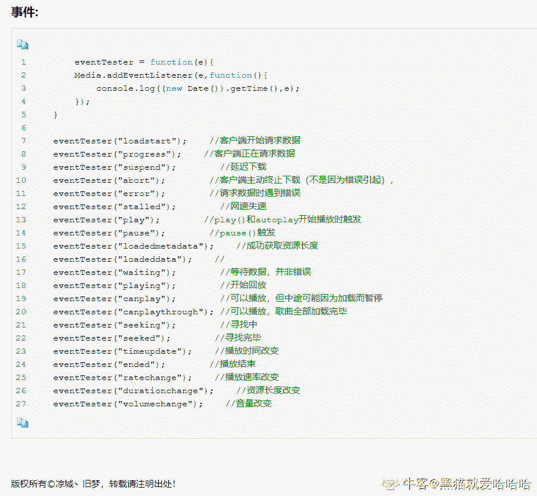
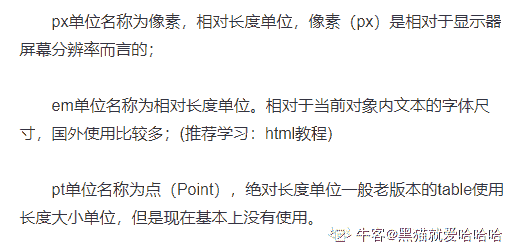
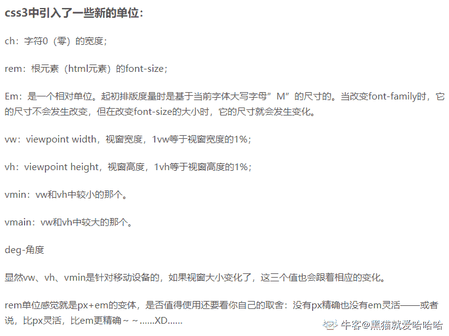

# 欢聚时代 2018 校招笔试题-web 前端 B 卷

## 1

设置 input 标签的 type 属性为 1 用于定义隐藏的输入字段。

你的答案 (错误)

1 参考答案 (1) hidden

本题知识点

欢聚集团 Java 工程师 C++工程师 算法工程师 PHP 工程师 前端工程师 2018

讨论

[shanzi111](https://www.nowcoder.com/profile/1152334)

| button | 定义可点击按钮（多数情况下，用于通过 JavaScript 启动脚本）。 |
| checkbox | 定义复选框。 |
| file | 定义输入字段和 "浏览"按钮，供文件上传。 |
| hidden | 定义隐藏的输入字段。 |
| image | 定义图像形式的提交按钮。 |
| password | 定义密码字段。该字段中的字符被掩码。 |
| radio | 定义单选按钮。 |
| reset | 定义重置按钮。重置按钮会清除表单中的所有数据。 |
| submit | 定义提交按钮。提交按钮会把表单数据发送到服务器。 |
| text | 定义单行的输入字段，用户可在其中输入文本。默认宽度为 20 个字符。 |

发表于 2018-08-30 09:23:37

* * *

## 2

A 标签的 target 设置 1 可以始终在新窗口中打开链接。

你的答案 (错误)

1 参考答案 (1) _blank

本题知识点

欢聚集团 Java 工程师 C++工程师 算法工程师 PHP 工程师 前端工程师 2018

讨论

[丫头猪猪](https://www.nowcoder.com/profile/395729882)

target 属性取值有 4 个，分别是：_blank、_self、_top、_parent。由于 H5 不支持框架，所以 _top、_parent 这两个取值不常用。 _blank 值为在新窗口中显示超链接页面， _self 代表在自身窗口中显示超链接页面， 当省略 target 属性时，默认值为 _self。

发表于 2018-08-31 10:37:14

* * *

## 3

文字加粗的样式属性为：1。

你的答案 (错误)

1 参考答案 (1) font-weight

本题知识点

欢聚集团 Java 工程师 C++工程师 iOS 工程师 PHP 工程师 前端工程师 2018

讨论

[跨越银河 Galaxy](https://www.nowcoder.com/profile/659067852)

font-weight

发表于 2020-09-09 01:18:33

* * *

[丫头猪猪](https://www.nowcoder.com/profile/395729882)

CSS 字体属性用于定义文字的字体，大小，粗细的表现，常见的字体属性包括字体，字号，字体风格，字体颜色等 font-family 属性用于指定文字的字体类型，如宋体，黑体等； font-size 属性用来设置文字大小； font-style 属性用来定义字体风格，如标准样式，斜体等； font-weight 设置字体的粗细程度。

发表于 2018-08-31 10:48:24

* * *

## 4

相对于根元素来设置字体大小的单位是：1。

你的答案 (错误)

1 参考答案 (1) rem

本题知识点

欢聚集团 Java 工程师 C++工程师 iOS 工程师 PHP 工程师 前端工程师 2018

## 5

数组的 1 方法可以在数组头部添加元素。

你的答案 (错误)

1 参考答案 (1) unshift

本题知识点

欢聚集团 Java 工程师 C++工程师 算法工程师 PHP 工程师 前端工程师 2018

讨论

[。。哼](https://www.nowcoder.com/profile/4004087)

unshift()都不行吗？真实！！

发表于 2018-09-12 16:34:02

* * *

[undefined201906121753239](https://www.nowcoder.com/profile/204641173)

什么东西！

发表于 2020-02-11 13:37:07

* * *

## 6

正则表达式的量词 1 用于匹配任何包含至少一个或多个的字符串。

你的答案 (错误)

1 参考答案 (1) +

本题知识点

欢聚集团 Java 工程师 C++工程师 算法工程师 PHP 工程师 前端工程师 2018

## 7

执行 Javascript 中的 1 函数会创建一个新函数，新函数与被调函数具有相同的函数体，当目标函数被调用时 this 值指向第一个参数。

你的答案 (错误)

1 参考答案 (1) bind

本题知识点

欢聚集团 iOS 工程师 安卓工程师 运维工程师 前端工程师 2018

讨论

[。。哼](https://www.nowcoder.com/profile/4004087)

我为什么一直加()括号！！

发表于 2018-09-12 16:34:32

* * *

[小野市](https://www.nowcoder.com/profile/9391147)

fun.bind(this,arg1,arg2,...)

bind()方***创建一个新的函数，称为绑定函数,fun 方法在 this 环境下调用

发表于 2018-08-09 00:10:28

* * *

## 8

HTTP 协议的 1 请求方法用于获取服务器支持的 HTTP 请求方法。

你的答案 (错误)

1 参考答案 (1) OPTIONS

本题知识点

欢聚集团 Java 工程师 C++工程师 算法工程师 PHP 工程师 前端工程师 2018

讨论

[。。哼](https://www.nowcoder.com/profile/4004087)

我为什么是小写！！！！

发表于 2018-09-12 16:35:04

* * *

[跨越银河 Galaxy](https://www.nowcoder.com/profile/659067852)

OPTIONS

发表于 2020-09-09 01:19:00

* * *

[荒岛流年](https://www.nowcoder.com/profile/573915609)

options

发表于 2020-05-08 20:11:13

* * *

## 9

HTML 中空格的转义字符是 1。

你的答案 (错误)

1 参考答案 (1)

本题知识点

欢聚集团 Java 工程师 前端工程师 算法工程师 PHP 工程师 2018

讨论

[跨越银河 Galaxy](https://www.nowcoder.com/profile/659067852)

nbsp；

发表于 2020-09-09 01:19:26

* * *

[小野市](https://www.nowcoder.com/profile/9391147)

发表于 2018-08-09 09:12:53

* * *

[QQ 群](https://www.nowcoder.com/profile/968354)

空格：&nbsp

发表于 2018-07-30 19:03:11

* * *

## 10

const a = 10; const b = a >> 2 | 1; 执行代码后 b 的值为：1。

你的答案 (错误)

1 参考答案 (1) 3

本题知识点

欢聚集团 Java 工程师 C++工程师 算法工程师 PHP 工程师 前端工程师 2018

讨论

[QQ 群](https://www.nowcoder.com/profile/968354)

 a=10；转为二进制为：a=1010；a >> 2：0010a >> 2 | 1 ： 0010 | 0001 = 0011 ；也就是十进制的 3

发表于 2018-07-28 20:52:35

* * *

## 11

以下是 Video/Audio 中会触发的事件的有？

正确答案: B C D   你的答案: 空 (错误)

```cpp
load
```

```cpp
play
```

```cpp
seeked
```

```cpp
abort
```

本题知识点

欢聚集团 Java 工程师 C++工程师 iOS 工程师 安卓工程师 运维工程师 前端工程师 算法工程师 PHP 工程师 2018 HTML

讨论

[小野市](https://www.nowcoder.com/profile/9391147)

```cpp
方法：load() play() pause()
事件：play() playing() pause() seeked() seeking() abort()当音频/视频的加载已放弃时触发
```

发表于 2018-08-09 09:19:24

* * *

[别卷啦！](https://www.nowcoder.com/profile/610837318)

[`www.cnblogs.com/lcddjm/p/5680109.html`](https://www.cnblogs.com/lcddjm/p/5680109.html)

编辑于 2021-01-12 10:38:41

* * *

[牛客 93833757 号](https://www.nowcoder.com/profile/93833757)

| 方法：load() play() pause()事件：play() playing() pause() seeked() seeking() abort()当音频/视频的加载已放弃时触发 |

发表于 2021-02-19 21:42:05

* * *

## 12

给定如下 HTML 代码，以下选择器能选到 P 元素的是？

<div class="box">

<div>

<p>YY</p>

</div>

</div>

正确答案: A D   你的答案: 空 (错误)

```cpp
.box p
```

```cpp
.box > p
```

```cpp
.box + p
```

```cpp
.box,p
```

本题知识点

欢聚集团 Java 工程师 C++工程师 iOS 工程师 安卓工程师 运维工程师 前端工程师 算法工程师 PHP 工程师 2018 HTML

讨论

[我用时间换天分](https://www.nowcoder.com/profile/173408590)

 css 中“>”是:

css3 特有的选择器，A>B 表示选择 A 元素的所有子 B 元素。

与 A B 的区别在于，A B 选择所有后代元素，而 A>B 只选择一代

发表于 2020-08-10 11:09:26

* * *

[dxzmpk](https://www.nowcoder.com/profile/415472899)

逗号分隔叫群选择器，用于同时选择多个元素

发表于 2020-01-19 08:46:02

* * *

[一正](https://www.nowcoder.com/profile/7653878)

.box p 表示 box 里面的所有 p 元素，不管多少级 .box > p 表示 box 里面第一级子元素为 p 的 .box + p 表示和 box 同级的，且紧跟着 box 后面出现的 p

发表于 2022-01-16 15:20:04

* * *

## 13

以下是 css3 中支持的单位有？

正确答案: A B C D   你的答案: 空 (错误)

```cpp
pt
```

```cpp
vw
```

```cpp
em
```

```cpp
%
```

本题知识点

欢聚集团 Java 工程师 C++工程师 iOS 工程师 安卓工程师 运维工程师 前端工程师 算法工程师 PHP 工程师 2018 CSS

讨论

[VNkillDark](https://www.nowcoder.com/profile/61674876)

这些题太蛋疼了。简直就是恶心人的存在

发表于 2020-08-20 16:24:15

* * *

[别卷啦！](https://www.nowcoder.com/profile/610837318)

两张结合着来吧  **pt 老版本的 table 长度单位******

发表于 2021-01-13 09:55:26

* * *

[。。哼](https://www.nowcoder.com/profile/4004087)

vw:基于视口的宽度 vh:基于视口的高度

编辑于 2018-09-15 20:23:42

* * *

## 14

以下返回 true 的有？

正确答案: B D   你的答案: 空 (错误)

```cpp
void 1
```

```cpp
undefined !== null
```

```cpp
0 &amp;&amp; true
```

```cpp
undefined == null
```

本题知识点

欢聚集团 Java 工程师 C++工程师 iOS 工程师 安卓工程师 运维工程师 前端工程师 算法工程师 PHP 工程师 2018

讨论

[sora!](https://www.nowcoder.com/profile/749045054)

undefined 和 null 都是无意义的数，所以相等 undefined 和 null 是不同类型的 ，所以不全等

发表于 2019-08-27 10:16:08

* * *

## 15

以下返回 1 的有？

正确答案: A B   你的答案: 空 (错误)

```cpp
Math.abs(-1)
```

```cpp
Math.ceil(0.5)
```

```cpp
Math.floor(0.6)
```

```cpp
Math.max(0.1,1.1)
```

本题知识点

欢聚集团 Java 工程师 C++工程师 iOS 工程师 安卓工程师 运维工程师 前端工程师 算法工程师 PHP 工程师 2018

讨论

[是鸢不是猿](https://www.nowcoder.com/profile/9918676)

abs:绝对值 ceil:向上取整 floor:向下取整

发表于 2018-09-11 11:08:09

* * *

## 16

1.  [1,2,'a','b','3'].filter(Number)返回值是？

正确答案: C   你的答案: 空 (错误)

```cpp
[1,2,'a','b','3']
```

```cpp
[1,2,NaN,NaN,3]
```

```cpp
[1,2,’3’]
```

```cpp
[1,2,3]
```

本题知识点

欢聚集团 Java 工程师 C++工程师 iOS 工程师 安卓工程师 运维工程师 前端工程师 算法工程师 PHP 工程师 2018

讨论

[轻轻的轻轻](https://www.nowcoder.com/profile/9418952)

为啥是返回'3'而不是 3 呢？

发表于 2020-08-31 17:29:16

* * *

[我教枣子简灯笼](https://www.nowcoder.com/profile/635698749)

对数组的每个元素进行 Number（）操作，Number（'a'）=NaN Number('3')=3Boolean(NaN)=false 所以 a 和 b 被过滤

发表于 2019-07-24 01:17:39

* * *

## 17

以下是 RegExp 对象的方法的有？

正确答案: A B C   你的答案: 空 (错误)

```cpp
compile
```

```cpp
exec
```

```cpp
test
```

```cpp
match
```

本题知识点

欢聚集团 Java 工程师 C++工程师 iOS 工程师 安卓工程师 运维工程师 前端工程师 算法工程师 PHP 工程师 2018

讨论

[godspeeDR](https://www.nowcoder.com/profile/380851996)

compile 方法已经废弃 match 是 String 对象上的方法 发表于 2021-08-24 12:55:42

* * *

## 18

执行以下代码，在控制台打印的值为？        var a = 0;

        var b = (function(){

            var a = 1;

            return function(){

                setTimeout(function(){

                    console.log(this.a);

                },1000)

            };

        })();

        b();

正确答案: A   你的答案: 空 (错误)

```cpp
0
```

```cpp
1
```

```cpp
undefined
```

```cpp
null
```

本题知识点

欢聚集团 Java 工程师 C++工程师 iOS 工程师 安卓工程师 运维工程师 前端工程师 算法工程师 PHP 工程师 2018

讨论

[Tency](https://www.nowcoder.com/profile/4538145)

setTimeout 种的 this 指向全局

发表于 2018-09-10 19:11:02

* * *

[QQ 群](https://www.nowcoder.com/profile/968354)

setTimeout 方法里面，this 会指向全局，所以会输出全局里面的 a 的值。下面的代码，将会输出局部区域里面的 a 的值：

```cpp

```
var a = 0; var b = (function(){ var a = 1;  return function(){  setTimeout(function(){  console.log(a);
        },1000)};
    })(); b();

```cpp

```

发表于 2018-07-30 19:07:36

* * *

[贰捌](https://www.nowcoder.com/profile/2664071)

复制粘贴出来时 undefined，有没有同样答案的童鞋

发表于 2018-09-13 21:51:45

* * *

## 19

执行以下代码,在控制台打印的值为？

    var obj = {name:’yy0’};

    Object.defineProperty(obj,"name",{

         configurable:true,

         enumerable:false,

         set: function(){

            name = 'yy3';

         },

         get: function(){

              return 'yy1';

          }

     });

     obj.name = 'yy2';

     console.log(obj.name);

正确答案: B   你的答案: 空 (错误)

```cpp
yy0
```

```cpp
yy1
```

```cpp
yy2
```

```cpp
yy3
```

本题知识点

欢聚集团 Java 工程师 C++工程师 iOS 工程师 安卓工程师 运维工程师 前端工程师 算法工程师 PHP 工程师 2018

讨论

[_ 小也 _](https://www.nowcoder.com/profile/3781300)

**get**语法将对象属性绑定到**查询该属性**时将被调用的函数。题中的

```cpp
get: function(){
    return 'yy1';
    } 
```

是使用`defineProperty`在现有对象上定义 `getter`. `getter`是一个隐藏函数,会在访问属性值时默认调用, 所以访问`obj.name`时,就会调用刚刚自定义的`get`了

发表于 2018-08-21 16:36:11

* * *

## 20

在方法里面执行 for 循环，以下关键字能跳出循环的有？

正确答案: A B C   你的答案: 空 (错误)

```cpp
break
```

```cpp
continue
```

```cpp
return
```

```cpp
void
```

本题知识点

欢聚集团 Java 工程师 C++工程师 iOS 工程师 安卓工程师 运维工程师 前端工程师 算法工程师 PHP 工程师 2018

讨论

[你和代码一样迷人](https://www.nowcoder.com/profile/377236445)

continue 不是跳出此次循环进行下次循环吗? 也不是严格意义上的跳出循环啊. 难道是我记错了?

发表于 2019-08-31 22:53:06

* * *

[牛客 507247581 号](https://www.nowcoder.com/profile/507247581)

A, break

发表于 2022-01-09 15:03:51

* * *

## 21

盒子模型是什么，谈谈你的理解。

你的答案

本题知识点

欢聚集团 Java 工程师 C++工程师 iOS 工程师 安卓工程师 运维工程师 前端工程师 算法工程师 PHP 工程师 2018

## 22

cookies，sessionStorage 和 localStorage 有什么区别，应用场景在哪里？

你的答案

本题知识点

欢聚集团 Java 工程师 C++工程师 iOS 工程师 安卓工程师 运维工程师 前端工程师 算法工程师 PHP 工程师 2018

讨论

[QQ 群](https://www.nowcoder.com/profile/968354)

区别：1、数据是否传给服务器 2、数据的大小限制：4k   >5m3、数据的有效期：设置删除时间   会话结束     永久有效，除非手动删除 4、作用域：session、localstorage 同源窗口共享  sessionStorage 同一个页面有效

发表于 2018-07-30 19:13:07

* * *

[欲言。](https://www.nowcoder.com/profile/6445044)

1\. 有效期: sessionStorage 的有效期仅为一个会话, 而其他两者可以长期存在 2\. 作用域: sessionStorage 同源窗口不共享, 而其他两者可 3\. 存储量: cookie 不能超过 4K, 而其他两者可达 4M4\. 存取方式: cookie 需要自定义 API 存取, 比较麻烦, 而其他两者提供了易用的 API5\. 请求携带: cookie 会被同源请求自动携带, 而其他两者不会

发表于 2019-10-02 20:10:40

* * *

## 23

JSONP 的跨域原理是什么？

你的答案

本题知识点

欢聚集团 Java 工程师 C++工程师 iOS 工程师 安卓工程师 运维工程师 前端工程师 算法工程师 PHP 工程师 2018

讨论

[寒未](https://www.nowcoder.com/profile/1400888)

其本质是利用了标签具有可跨域的特性，由服务端返回预先定义好的 javascript 函数的调用，并且将服务端数据以该函数参数的形式传递过来。

发表于 2018-09-13 16:21:28

* * *

## 24

DOM 操作中的事件代理、事件冒泡是什么？

你的答案

本题知识点

欢聚集团 Java 工程师 C++工程师 iOS 工程师 安卓工程师 运维工程师 前端工程师 算法工程师 PHP 工程师 2018

## 25

用 HTML、CSS、Javascript 编写一个 Toast 组件，要求：从底部渐变上移到屏幕正中间，2 秒后消失。（注：不能使用本地 IDE）

你的答案

本题知识点

欢聚集团 Java 工程师 C++工程师 iOS 工程师 安卓工程师 运维工程师 前端工程师 算法工程师 PHP 工程师 2018

讨论

[二拍](https://www.nowcoder.com/profile/840213224)

html

```cpp
<body>
  <div class='toast'>弹窗组件</idv>
</body>
<script>
  var toast=document.getElementsByClassName('toast')[0]
  var parent=toast.parentNode
  setTimeout(()=>{
    parent.removeChild(toast)
  },2000)
</script>
```

css

```cpp
.toast{
  width:200px;
  height:80px;
  border:1px black solid;
  text-align:center;
  line-height:80px;
  position:fixed;
  left:50%;
  top:50%;
  margin-top:-40px;
  margin-left:-100px;
  animation:move 1s linear;
}
@keyframes move{
  0%{
    transform:translateY(100%);
    opacity:0;
  }
  100%{
    transform:translateY(0);
    opacity:1;
  }
}
```

发表于 2020-08-29 16:46:00

* * *

[欲言。](https://www.nowcoder.com/profile/6445044)

See the Pen [Toast 动画](https://codepen.io/Emiya1996/pen/MWWgWBa) by Emiya ([@Emiya1996](https://codepen.io/Emiya1996)) on [CodePen](https://codepen.io).

编辑于 2019-10-03 16:12:34

* * *

[诺维阿鑫](https://www.nowcoder.com/profile/4654779)

<html>
    <head>
        <meta charset="utf-8">
        <title>简单 CSS 动画</title>
    </head>
    <style>

#target{
 width:300px;
height:300px;
background:yellow;
position:fixed;
top:50%;
left:50%;
margin-top:-150px;
margin-left:-150px;
animation:mymove 1s linear; 
}
@keyframes mymove{
 from{
  transform:translateY(100%);
  opacity:0;

}to{
  transform:translateY(50%)
  opacity:1;
}
}
    </style>
    <body>
     <div id="target"></div>
     <script>
     var parent=target.parentNode;
setTimeout(function(){parent.removeChild(target)},2000);

     </script>
    </body>
</html>

发表于 2018-09-22 13:06:08

* * *

## 26

编写一段正则表达式，用于匹配身份证号码。（注：不能使用本地 IDE）

你的答案

本题知识点

欢聚集团 Java 工程师 C++工程师 iOS 工程师 安卓工程师 运维工程师 前端工程师 算法工程师 PHP 工程师 2018

讨论

[G_SANGSK](https://www.nowcoder.com/profile/89611884)

[1-9]\d{9}(0[1-9]|1[0-2])(0[1-9]|[1-2]\d|3[0-1])\d{3}(\d|[xX])[1-9]\d{5} 前 6 位
\d{4} 某某年
(0[1-9]|1[0-2]) 某某月
(0[1-9]|[1-2]\d|3[0-1]) 某某日
\d{3}(\d|[X]) 末四位（X 代表 10 只能大写）

编辑于 2019-01-02 18:00:52

* * *

[牛客 489172889 号](https://www.nowcoder.com/profile/489172889)

```cpp
[1-9]{6}[12][0-9]{7}[0-9|0-9X]{4}
```

发表于 2020-06-25 00:29:11

* * *

[欲言。](https://www.nowcoder.com/profile/6445044)

^[1-9]\d{5}(18|19|([23]\d))\d{2}((0[1-9])|10|11|12)(([0-2][1-9])|10|20|30|31)\d{3}[0-9X]$

1.  地区码: [1-9]\d{5}
2.  年份(1800 年~3999 年): (18|19|([23]\d))\d{2}
3.  月份：(0[1-9])|10|11|12
4.  天数: ([0-2][1-9])|10|20|30|31
5.  顺序码: \d{3}
6.  校验码: [0-9X]

编辑于 2019-10-03 16:33:18

* * *

## 27

如果有以下数组 [1,2,7,4,5,6,6,3,8,9] ,请去重并且从小到大排序。（注：不能使用本地 IDE）

你的答案

本题知识点

欢聚集团 Java 工程师 C++工程师 iOS 工程师 安卓工程师 运维工程师 前端工程师 算法工程师 PHP 工程师 2018

讨论

[嫑慌](https://www.nowcoder.com/profile/2553661)

```cpp

	var arr = [1,2,7,4,5,6,6,3,8,9]; 

	var set  = new Set(arr);  

	var res = [];

	for(k of set){

	  res.push(k);

	};

	res.sort(function(a,b){

	   return a-b;

	})

```

编辑于 2018-09-22 14:09:18

* * *

[欲言。](https://www.nowcoder.com/profile/6445044)

贡献个正则版本吧, 面向面试哦~

```cpp
const monoSort = arr => {
    if (!arr.length) return arr;

    return arr
        .sort((a, b) => a - b)
        .join(',')
        .replace(/([^,]+)(,\1)*/g,'$1')
        .split(',')
        .map(Number);
}
```

编辑于 2019-10-03 17:06:36

* * *

[🐣正🐤元🐥是蛋](https://www.nowcoder.com/profile/7900688)

var arr =  [1,2,7,4,5,6,6,3,8,9];
        var res = new Array();
        for(var i=0;i<arr.length;i++){
            if(res.indexOf(arr[i]) == -1){
                res.push(arr[i]);
            }
        }
        res.sort();
        console.log(res);

发表于 2018-08-09 17:40:02

* * *

## 28

使用 js 实现一个深度 clone 的方法。（注：不能使用本地 IDE）

你的答案

本题知识点

欢聚集团 Java 工程师 C++工程师 iOS 工程师 安卓工程师 运维工程师 前端工程师 算法工程师 PHP 工程师 2018

讨论

[飞^鱼](https://www.nowcoder.com/profile/9787050)

恕我直言...JSON.parse(JSON.stringify(targerValue))最好用。。。

发表于 2018-08-30 15:31:05

* * *

[保庇节后中奖🙏](https://www.nowcoder.com/profile/5206054)

var deepCopy = function(obj) {    if (typeof obj !== 'object') return;    var newObj = obj instanceof Array ? [] : {};    for (var key in obj) {        if (obj.hasOwnProperty(key)) {            newObj[key] = typeof obj[key] === 'object' ? deepCopy(obj[key]) : obj[key];        }    }    return newObj;}

编辑于 2018-08-18 15:25:51

* * *

[🐣正🐤元🐥是蛋](https://www.nowcoder.com/profile/7900688)

var a = {c: {d: 1}}; 
var b = $.extend(true, {}, a);
 console.log(a === b); // 输出 false
 a.c.d = 3;
 console.log(b.c.d); // 输出 1，没有改变。

发表于 2018-08-09 17:55:04

* * *