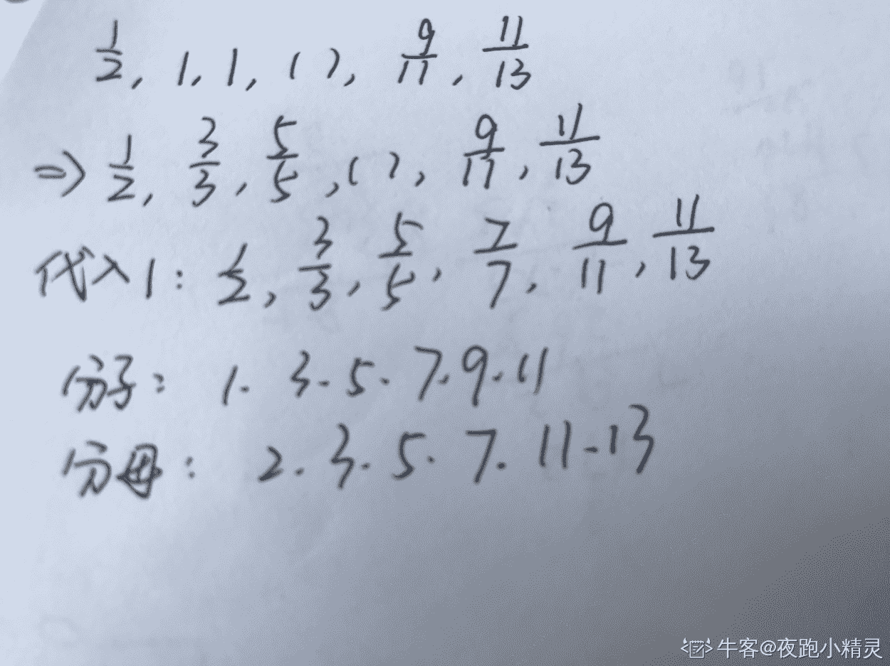
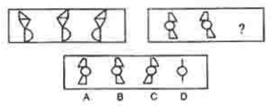
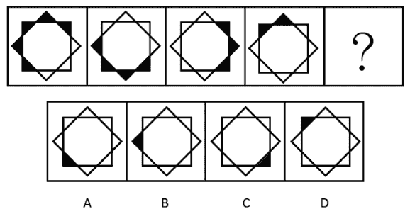
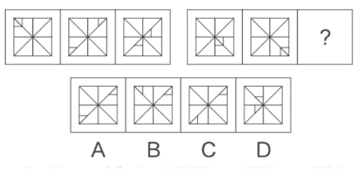
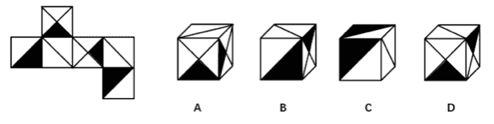

# 欢聚时代 2018 校招笔试题-产品经理/数据分析/游戏运营/市场专员 B 卷

## 1

2 ， 4 ， 12 ， 48 ，（）

正确答案: C   你的答案: 空 (错误)

```cpp
96
```

```cpp
120
```

```cpp
240
```

```cpp
480
```

本题知识点

欢聚集团 产品运营 游戏运营 产品 市场 数据分析师 欢聚集团 2018

讨论

[offer 快到碗里来哇](https://www.nowcoder.com/profile/897014155)

（2+4）*2=12（4+12）*3=48（12+48）*4=240

发表于 2018-09-14 12:11:55

* * *

[梨子要努力](https://www.nowcoder.com/profile/808156335)

数列是：       2,4,12,48，（）对应的位置是 1,2,3,4,5 从第二项开始，4=2*2,12=3*4,48=4*12，即每项都是各自的位置数*前一项数字所以，第五项是 5*48=240

发表于 2018-09-13 20:13:32

* * *

[a_yin](https://www.nowcoder.com/profile/4989933)

2,4,12,484=2*212=4*348=12*4240=48*5

发表于 2018-08-04 15:32:24

* * *

## 2

4   2    12    28    80    （ ） 

正确答案: C   你的答案: 空 (错误)

```cpp
124
```

```cpp
96
```

```cpp
216
```

```cpp
348
```

本题知识点

欢聚集团 产品运营 游戏运营 产品 市场 数据分析师 欢聚集团 2018

讨论

[DoubleO](https://www.nowcoder.com/profile/365305073)

第三项等于前两项之和乘以 2

发表于 2018-08-25 12:34:59

* * *

[a_yin](https://www.nowcoder.com/profile/4989933)

4,2,12,28,8012=(4+2)*228=(2+12)*280=(12+28)*2?=(28+80)*2

发表于 2018-08-04 15:34:13

* * *

## 3

1/2，1，1，（ ），9/11，11/13

正确答案: C   你的答案: 空 (错误)

```cpp
2
```

```cpp
3
```

```cpp
1
```

```cpp
9 分之 7
```

本题知识点

欢聚集团 产品运营 游戏运营 产品 市场 数据分析师 欢聚集团 2018

讨论

[ZEOPrear](https://www.nowcoder.com/profile/926215909)

从左往右分子是 1,3,5,7,9,11...等奇数从左往右分母是 2,3,5,7,11,13...等质数按照这个规律  第四个数仍然是 1

编辑于 2018-09-09 22:22:24

* * *

[夜跑小精灵](https://www.nowcoder.com/profile/287714414)



发表于 2019-08-20 11:08:30

* * *

[波小艺](https://www.nowcoder.com/profile/757928238)

从左往右分子是 1,3,5,7,9,11...等奇数从左往右分母是 2,3,5,7,11,13...等质数按照这个规律  第四个数仍然是 1

发表于 2019-09-09 16:47:27

* * *

## 4

19，4，18，3，16，1，17，( )

正确答案: D   你的答案: 空 (错误)

```cpp
5
```

```cpp
4
```

```cpp
3
```

```cpp
2
```

本题知识点

欢聚集团 产品运营 游戏运营 产品 市场 数据分析师 欢聚集团 2018

讨论

[狂奔的野猪](https://www.nowcoder.com/profile/5694123)

D[2n-1]-D[2n]=15

发表于 2018-08-12 22:55:25

* * *

[零葬](https://www.nowcoder.com/profile/75718849)

两个为一组，前项减后项等于 15

发表于 2020-12-26 19:47:21

* * *

[梨子要努力](https://www.nowcoder.com/profile/808156335)

19，4，18，3，16，1，17，( )奇数项：19,18,16,17，规律是-1，-2，+1 偶数项：4,   3,   1，（），规律是-1，-2，+1 所以，1+1=2

发表于 2018-09-13 20:08:00

* * *

## 5

2，6，5，12，8，（ ）

正确答案: D   你的答案: 空 (错误)

```cpp
24
```

```cpp
30
```

```cpp
12
```

```cpp
18
```

本题知识点

欢聚集团 产品运营 游戏运营 产品 市场 数据分析师 2018

讨论

[‼️‼️](https://www.nowcoder.com/profile/979822681)

两个数一组 2 6 ：2x2+2=65 12：5x2+2=12 所以后面就是 8x2+2=18

发表于 2018-09-05 10:53:08

* * *

[娇娃子](https://www.nowcoder.com/profile/342389236)

分奇偶项，奇数项是 2-5-8 为等差数列，偶数项是 6-12-？，等差的话是 18，2 倍的话是 24，尴尬

发表于 2018-08-18 10:22:40

* * *

[牛客 937674372 号](https://www.nowcoder.com/profile/937674372)

2,  6,  5,  12,  8，  （）11 分析：2， 5,  8，此数列为等差数列，所以后一项应为 11\.即 2， 5， 8， 11，用上述等差数列 2+5-1=6；5+8-1=12；8+11-1=18。所以（）内数字为 11\.

发表于 2022-02-16 15:19:09

* * *

## 6

？处的图像为（ ）

正确答案: A   你的答案: 空 (错误)

```cpp
A
```

```cpp
B
```

```cpp
C
```

```cpp
D
```

本题知识点

欢聚集团 常识判断 游戏运营 产品 市场 数据分析师 2018 判断推理

讨论

[Delete201904272039376](https://www.nowcoder.com/profile/521673005)

这是一个图像变形的过程，把每个单独的图像看作上中下三层，先上层作对称，然后中层不变，再下层作对称

发表于 2019-07-24 10:26:06

* * *

[Bigger_Tang](https://www.nowcoder.com/profile/407730835)

图像是由三个图形组成，只要把中间的图形去掉，就能看出问题了

发表于 2018-09-09 21:45:42

* * *

[牛客 937674372 号](https://www.nowcoder.com/profile/937674372)

观察整体：图一整体，3 个图片分解未变。所以图二的分解图也不会变化。观察组成：将图分解为上中下，做对比，观察规律。

发表于 2022-02-16 15:24:14

* * *

## 7

图像推理

正确答案: A   你的答案: 空 (错误)

```cpp
A
```

```cpp
B
```

```cpp
C
```

```cpp
D
```

本题知识点

欢聚集团 产品运营 游戏运营 产品 市场 数据分析师 欢聚集团 2018

讨论

[牛客 ID：1234569](https://www.nowcoder.com/profile/5734571)

黑三角串逆时针移动，每次向前移动两个三角的位置，尾部一个黑三角变白三角。

发表于 2018-09-03 14:45:55

* * *

[毛虎](https://www.nowcoder.com/profile/258171298)

将第一张图下方最靠边的视为头部，规律是头部向前涂黑两个，尾部涂白三个，最后选 A

发表于 2018-08-24 21:42:55

* * *

[Risun](https://www.nowcoder.com/profile/927743843)

顺时针看，每变动一次：黑角串的第一个变白色，然后整体顺时针转（180 度+45 度）

发表于 2021-09-05 14:20:38

* * *

## 8

图像推理

正确答案: C   你的答案: 空 (错误)

```cpp
A
```

```cpp
B
```

```cpp
C
```

```cpp
D
```

本题知识点

欢聚集团 产品运营 游戏运营 产品 市场 数据分析师 欢聚集团 2018

讨论

[梨子要努力](https://www.nowcoder.com/profile/808156335)

我的想法是，左图都是以自左上角到右下角的轴为对称轴的。4 个选项只有 C 对称。

发表于 2018-09-13 20:22:09

* * *

[wmy0123](https://www.nowcoder.com/profile/436212603)

对称

发表于 2020-08-31 16:36:58

* * *

[Bigger_Tang](https://www.nowcoder.com/profile/407730835)

示例图片中第一个是两个三角形不在同一条边上，第二第三的三角形都是在同一条斜边上。  由此可得出米字格中三角形的位置是两个斜边的三角形相同，另外一个不相同。答案选 C

发表于 2018-09-09 21:55:53

* * *

## 9

图像推理

正确答案: D   你的答案: 空 (错误)

```cpp
A
```

```cpp
B
```

```cpp
C
```

```cpp
D
```

本题知识点

欢聚集团 产品运营 游戏运营 产品 市场 数据分析师 欢聚集团 2018

讨论

[小菜鸟想拿 offer！！](https://www.nowcoder.com/profile/412348870)

先看最左边的大三角，折成正方体后很容易推出 bc 不对，再看两个黑的小三角，是不可能挨在一起的，所以选 d

发表于 2020-05-19 11:25:18

* * *

[Valder fields201910121756290](https://www.nowcoder.com/profile/452404251)

我觉得这道题有问题 d 选项上方的斜线应是从右上方画到左下方的

发表于 2019-10-15 22:12:00

* * *

[2htttttttttt](https://www.nowcoder.com/profile/704487070)

D 不对把，如果正面是这样的话，侧面这个图形应该是左侧而不是右侧？

发表于 2021-08-26 16:46:11

* * *

## 10

有一份选择题试卷共 6 个小题，其得分标准是：一道小题答对得 8 分，答错得 O 分，不答得 2 分，某位同学得了 20 分，则他

正确答案: D   你的答案: 空 (错误)

```cpp
至多答对一道题。
```

```cpp
至少有三个小题没答。
```

```cpp
至少答对三个小题。
```

```cpp
答错两个小题。
```

本题知识点

欢聚集团 产品运营 游戏运营 产品 市场 数据分析师 欢聚集团 2018

讨论

[436846043](https://www.nowcoder.com/profile/436846043)

这个不用 x 吧。。。最多答对两道 16 分，差四分就是没答的两道

发表于 2018-11-20 14:15:33

* * *

[零葬](https://www.nowcoder.com/profile/75718849)

答对两道题，不答两道题，答错两道题就行

发表于 2020-12-26 19:44:55

* * *

[Victor0606](https://www.nowcoder.com/profile/9117904)

设答对 x 道，答错 y 道，不答 z 道，则 8x+0y+2z=20。A 项表示 x≥1，则代入得 z≥6，即表示至少有 6 道没答，而一共只有 6 道，因此可排除；B 项表示 6＞z≥3，即 z 可能为 3、4、5。因此，x 可能为 1.75，1.5，1.25，都不符合要求，因为 x、y、z 都应为整数；C 项表示 6≥x≥3，即 x 可能为 3、4、5、6，因为答对 3 道总分为 24，已超出得分，因而也不符合题意；D 项表示 y=2，则 8x+2z=20，且 x+z=4，则 x=2，z=2，可以推出。故选 D。

发表于 2018-09-19 15:40:36

* * *

## 11

派出所民警讯问公共汽车上的一桩盗窃案的嫌疑人甲、乙、丙、丁的笔录如下： 甲说：“反正不是我干的” 乙说：“是丁干的。” 丙说：“是乙干的。” 丁说：“乙是诬陷。” 他们当中只有三人说真话，扒手只有一个，是

正确答案: B   你的答案: 空 (错误)

```cpp
甲
```

```cpp
乙
```

```cpp
丙
```

```cpp
丁
```

本题知识点

欢聚集团 产品运营 游戏运营 产品 市场 数据分析师 欢聚集团 2018

讨论

[Delete201904272039376](https://www.nowcoder.com/profile/521673005)

乙说丁，丁说乙说谎，悖论已经产生了，那么说假话的必然在乙和丁之间，也就是甲丙说了真话，丙说是乙，那么就是乙了

发表于 2019-07-24 10:31:07

* * *

## 12

在计算机语言中有一种逻辑运算，如果两个数同一位上都是 0 时，其和为 0，一个为 0，一个为 1 时或两个都是 1 时，其和为 1。那么

正确答案: B   你的答案: 空 (错误)

```cpp
如果和为 1，则两数必然都是 1。
```

```cpp
如果和为 0，则两数必然都为 0。
```

```cpp
如果和为 0，则两数中可能有一个为 1。
```

```cpp
如果和为 1，则两数中至少有一个为 0。
```

本题知识点

欢聚集团 产品运营 游戏运营 产品 市场 数据分析师 欢聚集团 2018

讨论

[牛客 39631518 号](https://www.nowcoder.com/profile/39631518)

考的与或非的逻辑

发表于 2020-07-31 00:13:52

* * *

## 13

为了增加收入，一家机场计划改变其计时停车区收取的停车费。机场会在第一个 4 小时或不到 4 小时期间收取 4 美元，而后每小时收取 1 美元；而不是在第一个 2 小时或不到 2 小时期间收取 2 美元，而后每小时收取 1 美元。下面哪种考虑，如果正确，表明该计划可以成功地增加收入？

正确答案: A   你的答案: 空 (错误)

```cpp
很少有人会在机场的计时停车区内一次停车超过 2 小时。
```

```cpp
在过去的几年内，机场运营计时停车设备的成本要高于从中获得的收入。
```

```cpp
把车停在机场进行短途旅行的人通常把车停在按天计费而非按时计费的停车区内。
```

```cpp
用来运营机场停车区的资金很大一部分被用来维护设备而不是支付收取停车费的职工工资。
```

本题知识点

欢聚集团 产品运营 游戏运营 产品 市场 数据分析师 欢聚集团 2018

讨论

[小菜鸟想拿 offer！！](https://www.nowcoder.com/profile/412348870)

停 2 个小时，还是要交 4 个小时的钱，对停车场而言赚了

发表于 2020-05-19 11:29:07

* * *

## 14

亚洲并非棕榈树的原产地，在这儿传统上用手工为棕榈树的花授粉，这种办法使棕榈果实产量非常低。当 1980 年将作为棕榈花的有效授粉者而被熟知的象鼻虫引进亚洲后，棕榈果实产量上升——在某些地区上升了 50%——但在 1984 年急剧下降。问：以下哪一项，如果是正确的，将对 1984 年产量的下降提出最好的解释？

正确答案: C   你的答案: 空 (错误)

```cpp
随着产量的上升同时需求下降，1980 年到 1984 年之间，棕榈果实的价格持续下降。
```

```cpp
进口树经常比本地树产量更大，因为进口树将它们的害虫与疾病留在它们本国的土地上。
```

```cpp
产量的迅速提高耗尽了培育果实的雌花生长需要的营养物质。
```

```cpp
在 1980 年到 1984 年之间，亚洲象鼻虫的数量保持在相同的水平上。
```

本题知识点

欢聚集团 产品运营 常识判断 游戏运营 产品 市场 数据分析师 2018 判断推理

讨论

[Jockeraaa](https://www.nowcoder.com/profile/95259297)

A 虽然从供需角度而言是正确的，但注意产量是急剧下降，这一般是不符合供需关系的。所以考虑是果实本身的问题

发表于 2019-04-10 15:54:50

* * *

## 15

在相同的收入水平上，乡村家庭比城市或城市郊区的家庭有更大的购买力，因为城市或城市郊区家庭中用在食物或住所的一部分收入可以被乡村家庭用在其他的需要上。问：以上论述最支持以下哪个论断？

正确答案: B   你的答案: 空 (错误)

```cpp
平均来说乡村家庭比城市或城市郊区的家庭包含有更多的人数。
```

```cpp
乡村家庭在食物和住房上的开支比城市或城市郊区家庭的开支少。
```

```cpp
城市郊区家庭通常比乡村或城市家庭有更大的购买力。
```

```cpp
城市和城市郊区家庭的中等收入通常比乡村家庭的中等收入高。
```

```cpp
所有三种类型的家庭在饮食和住房上花费的收入比在其他所有商品上的花费多。
```

本题知识点

欢聚集团 产品运营 常识判断 游戏运营 产品 市场 数据分析师 2018 判断推理

## 16

短视频在 2017 年迎来爆发，快手、火山、抖音等短视频平台持续增长。请分析短视频与直播之间的关系，以及这些平台对 YY 的影响，并提出相应对策

你的答案

本题知识点

欢聚集团 产品运营 游戏运营 产品 市场 数据分析师 2018

讨论

[冲上顶峰](https://www.nowcoder.com/profile/189892324)

短视频与直播的关系：短视频和直播都是内容呈现的载体。

竞合关系是核心。从以下几个角度来讲。

竞争点：

1.  目标人群。短视频与直播的人群存在高度交叉。大量的用户均为年龄在 15-35 岁之间，有社交和存在感需求的人群。（快手的年龄层会往后倾斜）
2.  产品解决的痛点：产品解决的痛点类似，但不同的平台侧重点会有所区别。
3.  头部内容产出 KOL 和内容存在有同质化情况。一个 KOL 既可能在直播平台直播，也可能在短视频平台发相关内容。且容易出现同质化。

合作点：

1.  产品动机上的融合：不同产品形态用户使用的动机不相同。短视频平台用户动机是分享的可能性远大于直播平台用户分享行为动机的可能性。直播平台的唤醒用户大部分是从上往下的，短视频的唤醒方式存在从下往上，且这两点不构成逻辑矛盾。
2.  产品形态上的融合：直播平台突出的点在于时效性，互动性，和内容发起者的号召力。往往存在一点对多点的情况。而短视频平台突出的特点在内容消化快，种类多，分享价值高，多对多的传播方式。两种方式在同一个平台上存在有共存空间。
3.  内容形态上的融合与头部内容产出的融合：头部内容贡献者在两个内容平台均可以产生内容，且针对于用户不同场景下的不同需要，可以产出不同的内容。且能对现有内容的丰富性做补充。在产生的内容方面，直播内容相对较浅，但部分直播以强关系链链接，且容易形成兴趣社群。而短视频内容相对深度更深，种类多，但缺乏关系链链接，对于社群形成缺乏有效的培育机制。两者结合，可以在社群运营与关系链打造方面有所精进。短视频也可以用来增加粉丝粘性，将集中在头部资源的直播环境进行改善，提高下层主播的曝光率问题。
4.  使用场景上的协调规划：用户在不同场景下对于两种平台的需求有所区别；短视频平台更多的用户使用场景是在碎片化时间下与特殊场景下的分享和创造；直播平台的用户使用场景是有规模化时间，特殊内容产出的吸引。这两者可以进行有效结合。同时两者的头部内容可以在不同的场景下进行内容上的衔接。存在有巨大的空间。

影响与对策：

竞争：

*   占用用户时间的 APP 只有一个。对于流量的争夺与用户碎片化时间的把握将会构成重复和冗余。
*   一旦出现内容同质化情况，对于用户的吸引度将会降低。

对策：

*   抓住用户核心规模化时间。通过登录激励，打卡，积分体系，建立用户粘性与用户习惯。鼓励用户打开 APP。
*   形成节目化，规模化内容产出。自制连续的内容录播等相关环节。鼓励娱乐现场直播化，直播节目化。增加内容差异性，并通过内容形成用户留存。

合作方面的影响与对策：

*   鼓励跨平台合作。对接积分体系，提供折扣或其他增值服务购买特权。
*   建立平台连接。
*   共享头部内容资源。

发表于 2019-03-25 13:00:55

* * *

[努力拼一回](https://www.nowcoder.com/profile/47645153)

1\. 短视频制作和传播只需要手机就能完成，直播需要固定的电脑设备；短视频容易传播，用户闲暇时间即可观看，快节奏下短视频的可获得性更加便利；短视频制作后可以加工剪裁，直播对视频内容的要求更高 2\. 部分用户会被短视频分流，YY 应该针对自身优势（语音沟通）和直播行业特点，抓住游戏电竞，平民才艺等细分的直播市场，培养固定的用户群。

发表于 2018-09-28 12:51:41

* * *

[晴晴是魔鬼吗](https://www.nowcoder.com/profile/333967442)

短视频与直播之间的区别：1.短视频时长短，直播时长长 2.短视频时效性需求较低，直播是参与式的，要求极高的时效性 3.短视频拍摄成本较低，直播需要较强的异步操作以及设备支持，成本花费大 4.短视频内容多样化，直播目前较为成功模块是游戏直播、美女直播等，内容格局相对较小、5.短视频互动性较差，直播商业模式是基于受众群体与主播直接互动产生短视频与直播的相似性：1.都是用户原创内容，内容优质性与创造者直接挂钩 2.都友好的解决了空间上的问题，受众群体分布范围较广关联性：1.直播是视频的衍生物，直播能够很好的解决短视频的缺点 2.短视频为直播做铺垫，经过短视频的发展，更加明确哪些内容是可行的，为直播提供参考依据快手、火山、抖音这些短视频网站的发展一方面促进了互联网短视频的发展，另外一方面加剧了互联网的竞争，各平台争相恐后抢夺用户资源和内容创造者资源，以高额投入争取获得更多用户及内容，但往往内容质量远比不上数量，长期以往，许多短视频网站在这场你追我赶的争夺赛中落幕，与此同时，直播的出现给了他们新的希望，所以，很多短视频平台纷纷加入直播战队，这对于以直播为生的 YY 而言是极大的挑战，新的竞争对手在短视频领域有较多的经验，也已经有较多的用户量，同时他们进入直播行业可能有更多新的想法，可能对现有的直播起到较大的冲击。因而，YY 目前应该进行自我突破，找到更多的改善点，能够增强用户的粘性；在更多领域方面进行探索，在直播细分领域中找到自己的立足之地，能够让用户在该领域第一个想到即是 YY；增加内容的质量，优质的内容及优秀的内容创造者才能够永久的吸引用户，做长久打算。

编辑于 2019-08-25 15:54:51

* * *

## 17

手机 YY 下个大版本交由你来主导，请给出你的产品设计方案

你的答案

本题知识点

欢聚集团 产品运营 游戏运营 产品 市场 数据分析师 2018

讨论

[冲上顶峰](https://www.nowcoder.com/profile/189892324)

1.  主要功能按钮增加单人聊天框。支持点对点聊天；在两人均可选择是否接受和是否发起的情况下。
2.  强化积分体系。内容分层和积分分层。并支持进入打卡获得积分；登录达到范围赠送积分。
3.  增加更多的 1 对 1，多对多功能，开辟节目化直播和视频直播相应版块，提高内容属性。
4.  KOL 直播可做开屏页面或首页浮层，点击即可进入并一键分享传播。
5.  发现页面中置顶垂直兴趣社群，通过兴趣爱好标签选择与个性化推荐，进行更深度和更小众的交流，提高内容沉淀的可能性。
6.  提高版权与内容的保护。形成内容竞争壁垒。

发表于 2019-03-25 13:01:55

* * *

[字节内推 sylvia](https://www.nowcoder.com/profile/939007802)

YY 本身是加强游戏中大家交流的渠道 1.强化并保存原来核心功能，YY 语音，及时&无损&变声娱乐性 2.突出使用者的标签化，挖掘声线魅力比如类似搜狗的皮肤标签化，YY 语音中声线标签化，分出标签，营造打榜投票高的可以有类似成就榜单

发表于 2020-05-30 22:04:38

* * *

## 18

YY 熊在探寻 AR 宝箱的过程中，来到了一列长为 n 阶的楼梯前。YY 熊的小短腿每次能迈 1、2 或 3 步台阶。YY 熊必须计算出自己走到楼顶有多少种方式（列如 n=3，YY 熊一共有 1-1-1/2-1/1-2/3，4 种方式），才能打开 AR 宝箱。你能帮 YY 熊解决这个棘手的问题吗？（写出 n<=10 的答案，可写代码答题更好）

你的答案

本题知识点

欢聚集团 产品运营 游戏运营 产品 市场 数据分析师 2018

讨论

[树根 Root](https://www.nowcoder.com/profile/462656433)

```cpp
def jump_ways(n):
    if n == 1:
        return 1

    elif n == 2:
        return 2

    elis n == 3:
        return 4

    else:
        ways = jump_ways(n-1) + jump_ways(n-2) + jump_ways(n-3)
        return ways

def tot_jump_ways(n):
    for i in range(1,n+1):
        result = jump_ways(i)
        print("{}阶楼梯一共有%s 种方法".format(i) % result)

if __name__ == '__main__':
    tot_jump_ways(10)

```

发表于 2018-09-12 15:39:17

* * *

[啾啾要秋秋](https://www.nowcoder.com/profile/655143444)

#include<iostream>
using namespace std;
int Fi(int s){
    if(s<=0)
        return 0;
    if(s<=2)
        return s; 
    else 
        return 2*Fi(s-1);
}

int main(){
    int s;
    cin>>s;
    cout<<Fi(s);
    return 0;
} 

发表于 2020-08-31 16:38:59

* * *

[Jaiken](https://www.nowcoder.com/profile/2589282)

/*
     * 动态规划 1.台阶问题 步长为 1 或者 2
     */
    public static int countWays(int n) {
        // write code here
        int f1 = 1;// 上第一层台阶时候仅有一种方法
        int f2 = 2;// 上第二层台阶的时候存在两种方法 1->1,2
        int f3 = 0;// 由于步长存在两种 1 和 2 ，那么上到第三层台阶或者 n 层台阶的时候的方法数为，上到 n- 1 的方法数加上上到 n-2 层台阶的方法数

        for (int i = 2; i < n; i++) {
            f3 = (f2 + f1) % 1000000007;
            f1 = f2;
            f2 = f3;
        }
        return f3;
    }

    /*
     * 动态规划 2.台阶问题，步长为 1,2,3
     *
     */
    public static int countWays2(int n) {
        int f1 = 1;
        int f2 = 2;
        int f3 = 4;
        int re = 0;
        for (int i = 3; i < n; i++) {
            re = f3 + f2 + f1;            // 到达第 n 层台阶的方法为(n-1)+(n-2)+(n-3)的和与步长为 1,2 的时候理解相同            f1 = f2;
            f2 = f3;
            f3 = re;
        }
        return re;
    }

    /*
     * 动态规划 3.步长为任意数，
     */
    public static int countWays3(int n) {
        int[] fn = new int[n + 1];
        fn[1] = 1;
        fn[2] = 2;
        fn[3] = 4;
        int re = 0;
        for (int i = 4; i <= n; i++) {
            re = 0;// 清零操作，避免影响后面的数据
            for (int j = 1; j < i; j++) {
                re += fn[j];
            }
            re++;
            // 到达第 n 层台阶的方法为(n-1)+(n-2)+(n-3)+...+1+1,意思是前面所有步的方法的和再加 1
            fn[i] = re;
            System.out.println("re=" + re);
        }
        return re;
    }

发表于 2018-08-05 15:07:55

* * *

## 19

请画出你心目中，直播间最完美的呈现方式（标注功能），并为其设计 1-2 种主播与用户之间的互动玩法，绘制的完整度与保真度越高越好。

你的答案

本题知识点

欢聚集团 产品运营 游戏运营 产品 市场 数据分析师 2018

讨论

[求个 offer–成功上岸](https://www.nowcoder.com/profile/87321337)

结合 AR 的呈现方式。

具体功能：
1.观看直播的用户可以使用直播 APP 配套的 AR 设备，并结合 APP 的 AR 模式功能，进行沉浸式的直播观看体验。可以全方位看到主播，就像零距离接触一样。
2.直播 APP 开发一个虚拟主播的功能，用户可以自己选择二次元虚拟主播（例如初音未来）或者真人主播。虚拟主播不仅限于二次元范围，也可以是仿真人。虚拟主播的好处在于可以实时和每一个用户“对话”，能照顾到大部分用户的情绪。

玩法：
1.AR 功能：通过 AR 设备和投影“实际”感受与主播“面对面”交流，甚至是牵手感受。
2.虚拟主播功能：用户可以通过自己的喜好，捏造虚拟主播，然后投影呈现。

发表于 2020-03-21 10:44:03

* * *

## 20

相比斗鱼，虎牙等综合性内容平台来说，以歌舞内容为主的新星花椒、映客等平台很快遇到了用户量的瓶颈和流失，你觉得造成这种现象的关键原因是什么？假如你是某 APP 的负责人，你打算如何去改善目前的状况？

你的答案

本题知识点

欢聚集团 产品运营 游戏运营 产品 市场 数据分析师 2018

讨论

[x 个 offer 就好呜呜呜](https://www.nowcoder.com/profile/4411325)

关键原因：以歌舞为主等平台内容形式太过于单一，用户容易审美疲劳感到腻味，从而流失改善：以丰富内容为主，包括丰富播放内容和丰富平台形式 1、丰富播放内容：1）培养平台现有主播，丰富他们的播放内容，给予他们现有粉丝不一样的惊喜（如歌舞主播播出打游戏内容等）2）引进不同形式的主播，比如引进游戏、搞笑主播等，用户不用换平台就能观看不同形式的内容 2、丰富平台形式 1）在直播间为用户设立多样的形式，目的是为了让用户更有参与感，增强用户与主播的关系纽带，从而增强用户粘性 2）在直播间以外的地方，即平台其他的功能上进行丰富，例如增加游戏间，聊天间，增强平台的社交性质，让用户（粉丝）之间联系起来，从而增强用户粘性。

发表于 2019-08-21 11:08:05

* * *

[矜持的小甜瓜](https://www.nowcoder.com/profile/452133631)

造成现象的原因：1\. 长时间的歌舞内容会造成用户疲劳 2\. 内容更为丰富的 app 显然更吸引用户改善：1.纯粹，要做就做最好，强化歌舞属性，专注于歌舞发展 2.适度加以推广，明星引流，与歌舞综艺合作增加曝光 3.增强用户参与度，直播连线等方式让用户参与进来

发表于 2020-03-12 15:24:34

* * *

[冲上顶峰](https://www.nowcoder.com/profile/189892324)

关键原因：瓶颈的原因在于受众范围有限，且大量内容抵达不到目标用户。流失的主要原因在于留存机制不好，内容不好，存在着被竞争的风险。

改善方式从两个角度来讲：1.增加触达人群、2.提升用户粘性

1.  增加触达人群的关键在于产品形态与内容形态的多样化。
2.  内容是用来提高上限降低下线的核心方式。

主要的方式包括：增加 1 对 1 直播/增加节目化直播内容/增加多对多直播/娱乐节目直播化/深度垂直的内容或干货直播/增加打赏的方式，玩法，比如幸运转盘等。

提升用户粘性的关键在于有效的增值服务体系与积分体系。满足用户的存在感需求与内容需求，同时增加用户在平台的沉淀，提高离开成本。

主要的方式包括：1.登录有奖/积分体系/增值会员权益多样化/会员分级制度/内容产出激励方案/内容存储，删改，编辑功能细化等。

同时为了防止被竞争，可以考虑加水印的方式。强化品牌认知。

发表于 2019-03-25 13:12:13

* * *