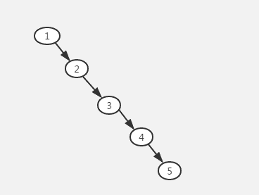
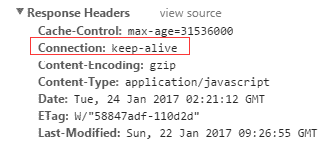

# 百度 2018 校招 Web 前端工程师笔试卷（提前批）

## 1

CSS 中 Position 默认值是什么？

正确答案: A   你的答案: 空 (错误)

```cpp
static
```

```cpp
relative
```

```cpp
absolute
```

```cpp
inherit
```

本题知识点

百度 Java 工程师 C++工程师 iOS 工程师 安卓工程师 运维工程师 前端工程师 算法工程师 PHP 工程师 2018 CSS

讨论

[六狗子](https://www.nowcoder.com/profile/7127473)

position 属性用于定义元素的定位模式。 static 静态定位 默认定位方式。 relative 相对定位。 absolute 绝对定位 相对于定位的父元素定位。 fixed 固定定位 相对于浏览器窗口定位。

发表于 2018-08-05 17:01:50

* * *

[燃烧黎明](https://www.nowcoder.com/profile/567164937)

其他属性还有 unset,initial,inherit，其中 unset 是 initial 和 inherit 的集合

发表于 2018-11-16 11:32:09

* * *

## 2

下列哪个样式定义后,内联(非块状)元素可以定义宽度和高度( )

正确答案: C   你的答案: 空 (错误)

```cpp
display:inline
```

```cpp
display:none
```

```cpp
display:block
```

```cpp
display:inherit
```

本题知识点

百度 Java 工程师 C++工程师 iOS 工程师 安卓工程师 运维工程师 前端工程师 算法工程师 PHP 工程师 前端工程师 百度 2018

讨论

[是居居吖](https://www.nowcoder.com/profile/177684868)

display:inline 使其变为内联元素，即在一行内进行布局，因此无法设置宽高。display:none 使其不显示。display:block 使其变为块级元素，可设置宽高。display:inherit 使其从父元素继承 display 属性。

发表于 2020-03-14 10:29:40

* * *

[六狗子](https://www.nowcoder.com/profile/7127473)

inline block 显示为行内块元素。

发表于 2018-08-05 17:06:33

* * *

## 3

下面 span 标签中 Hello World 字体的颜色是：（）

> <style type="text/css">span {color: green;}.red {color: red;}#blue {color: blue;}</style><span id="blue" class="red" style="color:black;">Hello World</span>

正确答案: D   你的答案: 空 (错误)

```cpp
green
```

```cpp
red
```

```cpp
blue
```

```cpp
black
```

本题知识点

百度 Java 工程师 C++工程师 iOS 工程师 安卓工程师 运维工程师 前端工程师 算法工程师 PHP 工程师 前端工程师 百度 2018

讨论

[sillylove（愚爱）](https://www.nowcoder.com/profile/526025906)

权重:  !important 最大, 紧接着是内联样式 ,其次是 id 选择器;接着是伪类,类选择器,最小是标签选择器量化的话,它们分别为  10000     1000  100  10   1   这样子

发表于 2018-09-02 11:06:34

* * *

## 4

关于触发进程调度的原因，下列说法正确的是 I.中断返回 II.当前进程阻塞 III.当前进程的时间片用完

正确答案: D   你的答案: 空 (错误)

```cpp
仅 III 正确
```

```cpp
仅 II 正确
```

```cpp
仅 II、III 正确
```

```cpp
I、II、III 都正确
```

本题知识点

百度 Java 工程师 C++工程师 iOS 工程师 安卓工程师 运维工程师 前端工程师 算法工程师 PHP 工程师 2018

讨论

[AndrewJoe](https://www.nowcoder.com/profile/5664681)

中断返回指的是中断操作完成，如 I/O 操作完成，等待 I/O 完成的进程进入就绪状态。

发表于 2018-07-24 00:48:08

* * *

## 5

关于实现时间片轮转调度算法需要的软件或硬件，下列选项中正确的是 I 进程调度程序 II 可编程中断控制器 III 可编程间隔定时器 IV 进程控制块

正确答案: D   你的答案: 空 (错误)

```cpp
仅需 I
```

```cpp
仅需 I、II
```

```cpp
仅需 I、IV
```

```cpp
需 I、II、III、IV
```

本题知识点

百度 Java 工程师 C++工程师 iOS 工程师 安卓工程师 运维工程师 前端工程师 算法工程师 PHP 工程师 2018

## 6

以下代码的执行结果是什么？

```cpp
var strNumber = '1';
var intNumber = 0;
console.log(strNumber + intNumber);
console.log(strNumber - intNumber);
console.log(strNumber * intNumber); 
```

正确答案: C   你的答案: 空 (错误)

```cpp
1, 1, 0
```

```cpp
'10', '1', '1'
```

```cpp
'10', 1, 0
```

```cpp
other
```

本题知识点

百度 Java 工程师 C++工程师 iOS 工程师 安卓工程师 运维工程师 前端工程师 算法工程师 PHP 工程师 2018

## 7

以下代码的执行结果是什么？

```cpp
var array = [0, 1, 2];
var spliceArray = array.splice(0, 1);
var sliceArray = array.slice(0, 1);
var concatArray = array.concat("a");
console.log(array);
console.log(spliceArray);
console.log(sliceArray);
console.log(concatArray);
```

正确答案: D   你的答案: 空 (错误)

```cpp
[0, 1, 2], [0], [0], [0, 1, 2, &quot;a&quot;]
```

```cpp
[1, 2, &quot;a&quot;], [0], [1], [1, 2, &quot;a&quot;]
```

```cpp
[0, 1, 2], [0], [1], [1, 2, &quot;a&quot;]
```

```cpp
[1, 2], [0], [1], [1, 2, &quot;a&quot;]
```

本题知识点

百度 Java 工程师 C++工程师 iOS 工程师 安卓工程师 运维工程师 前端工程师 算法工程师 PHP 工程师 2018

讨论

[六狗子](https://www.nowcoder.com/profile/7127473)

详见数组操作方法。splice 对原数组进行修改。 其他在 splice 的基础上创建副本。

发表于 2018-08-05 17:23:14

* * *

[EthanYe](https://www.nowcoder.com/profile/876734953)

slice()

在只有一个参数的情况下，slice()方法返回从该参数指定位置开始到当前数组末尾的所有项。如果有两个参数，该方法返回起始和结束位置之间的项(但不包括结束位置的项)。**slice()方法不会影响原始数组**

splice()

有多种用法，**会直接修改原数组，返回一个包含从原数组中删除的项的数组**

*   **删除**：可以删除任意数量的项，只需指定 2 个参数：要删除的第一项的位置和要删除的项数。
    例如，splice(0,2)会删除数组中的前两项。
*   **插入**：可以向指定位置插入任意数量的项，只需提供 3 个参数：起始位置、0（要删除的项数）和要插入的项。如果要插入多个项，可以再传入第四、第五，以至任意多个项。
    例如，splice(2,0,"red","green")会从当前数组的位置 2 开始插入字符串"red"和"green"。
*   **替换**：可以向指定位置插入任意数量的项，且同时删除任意数量的项，只需指定 3 个参数：起始位置、要删除的项数和要插入的任意数量的项。插入的项数不必与删除的项数相等。
    例如，splice (2,1,"red","green")会删除当前数组位置 2 的项，然后再从位置 2 开始插入字符串"red"和"green"。

编辑于 2020-05-20 22:16:07

* * *

## 8

以下代码的执行结果是什么？

```cpp
function func() {
  var a = b = 1;
}
func();
console.log(a);
console.log(b); 
```

正确答案: C   你的答案: 空 (错误)

```cpp
1, 1
```

```cpp
error, error
```

```cpp
error, 1
```

```cpp
other
```

本题知识点

百度 Java 工程师 C++工程师 iOS 工程师 安卓工程师 运维工程师 前端工程师 算法工程师 PHP 工程师 2018

讨论

[赵 pp](https://www.nowcoder.com/profile/4145713)

b 没有 var 为全局变量，var a=b 局部变量外部访问不到

发表于 2018-09-26 15:43:50

* * *

[铠甲](https://www.nowcoder.com/profile/711995166)

b=1 a

发表于 2018-09-22 08:56:26

* * *

[我的宝宝贝贝](https://www.nowcoder.com/profile/698625336)

b=1 a

发表于 2018-09-21 15:07:08

* * *

## 9

以下代码的执行结果是什么？

```cpp
var name = 'World';
(function () {
    if (typeof name === 'undefined') {
        var name = 'Shawn';
        console.log('Goodbye ' + name);
    } else {
        console.log('Hello ' + name);
    }
})();
```

正确答案: A   你的答案: 空 (错误)

```cpp
'Goodbye Shawn'
```

```cpp
'Hello Shawn'
```

```cpp
'Hello undefined'
```

```cpp
'Hello World'
```

本题知识点

百度 Java 工程师 C++工程师 iOS 工程师 安卓工程师 运维工程师 前端工程师 算法工程师 PHP 工程师 2018

讨论

[包子是好包子](https://www.nowcoder.com/profile/9170153)

变量声明会提升!

相当于以下代码：var name = 'World';(function () {**    *var name;***    if (typeof name === 'undefined') { **        *name = 'Shawn';***        console.log('Goodbye ' + name);    } else {        console.log('Hello ' + name);    }    })();

发表于 2018-08-15 11:19:08

* * *

[GgZM](https://www.nowcoder.com/profile/655092269)

函数预编译不会看你 if 语句条件是否成立，会直接读变量声明语句，然后此时 name 就是 undefined 在 AO 中 typeof name 就是字符串类型的 undefined

发表于 2019-01-29 15:35:22

* * *

[梁小炮囡泡泡泡泡](https://www.nowcoder.com/profile/8536054)

闭包

发表于 2018-08-08 17:04:19

* * *

## 10

以下代码的执行结果是什么？

```cpp
var string = 'bob';
var replaced = string.replace('b', 'l');
console.log(replaced === 'lob');
console.log(string === 'lob');
console.log(string === 'bob'); 
```

正确答案: B   你的答案: 空 (错误)

```cpp
true, false, false
```

```cpp
true, false, true
```

```cpp
true, true, false
```

```cpp
other
```

本题知识点

百度 Java 工程师 C++工程师 iOS 工程师 安卓工程师 运维工程师 前端工程师 算法工程师 PHP 工程师 2018

讨论

[鲁小溪 Angela](https://www.nowcoder.com/profile/5620727)

replace 方法不会改变原字符串

发表于 2018-10-15 15:55:35

* * *

[QQ 群](https://www.nowcoder.com/profile/968354)

string.replace：只替换匹配到的第一个字符

string.replaceAll：替换所有匹配到的字符

发表于 2018-07-26 16:44:33

* * *

## 11

以下代码的执行结果是什么？

```cpp
function funcA(data) {
    data.key = 'data';
}
function funcB(data) {
    data = {};
      data.value = 'data';
}
var data = { key: 'key', value: 'value' };
funcA(data);
funcB(data);
console.log(data.key);
console.log(data.value); 
```

正确答案: C   你的答案: 空 (错误)

```cpp
'key', 'value'
```

```cpp
'data', 'data'
```

```cpp
'data', 'value'
```

```cpp
undefined, 'data'
```

本题知识点

百度 Java 工程师 C++工程师 iOS 工程师 安卓工程师 运维工程师 前端工程师 算法工程师 PHP 工程师 2018

讨论

[牛客 256211 号](https://www.nowcoder.com/profile/256211)

```cpp
function funcA(data) {
    data.key = 'data';
}
function funcB() { // 把函数的这个 data 参数去掉,结果就是 D 选项了
    data = {};  // 这个 data 虽然在函数里面，但是并没有用 var 声明，所以算是全局变量，会把 var 声明的全局变量替换
      data.value = 'data';
}
var data = { key: 'key', value: 'value' };   // 用 var 声明的全局变量
funcA(data); 
funcB(data);
console.log(data.key);
console.log(data.value);
```

发表于 2018-11-23 21:08:07

* * *

[柳宁依](https://www.nowcoder.com/profile/5497144)

```cpp
function funcA(data) {
    data.key = 'data';//此 data 就是参数 data
}
function funcB(data) {
    data = {}; //这里的 data 是一个新的 data，并不是参数 data，是函数里面的 data，所以并不会改变全局 data 的值
      data.value = 'data';
}
var data = { key: 'key', value: 'value' };
funcA(data);
funcB(data);
console.log(data.key);
console.log(data.value);
所以输出结果是 data value
```

发表于 2018-08-30 17:02:28

* * *

## 12

CSS3 中什么功能可以实现文字或图像的变形处理：

正确答案: A   你的答案: 空 (错误)

```cpp
transform
```

```cpp
deform
```

```cpp
scale
```

```cpp
rotate
```

本题知识点

前端工程师 CSS

讨论

[QQ 群](https://www.nowcoder.com/profile/968354)

transform 属性向元素应用 2D 或 3D 转换。该属性允许我们对元素进行旋转、缩放、移动或倾斜。rotate() 方法旋转当前的绘图 

发表于 2018-07-26 16:49:37

* * *

[PiggyCoder](https://www.nowcoder.com/profile/556507504)

scale 是按比例放大或者缩小

发表于 2020-08-18 11:09:02

* * *

## 13

JavaScript 定时器不包含哪个函数：

正确答案: D   你的答案: 空 (错误)

```cpp
setTimeout()
```

```cpp
clearTimeout()
```

```cpp
setInterval()
```

```cpp
getInterval()
```

本题知识点

百度 Java 工程师 C++工程师 iOS 工程师 安卓工程师 运维工程师 前端工程师 算法工程师 PHP 工程师 2018

讨论

[QQ 群](https://www.nowcoder.com/profile/968354)

clearTimeout() 方法：取消由 setTimeout() 方法设置的 timeout。 ```cpp
<script type="text/javascript">
var c=0
var t
function timedCount()
  {
  document.getElementById('txt').value=c
  c=c+1
  t=setTimeout("timedCount()",1000)
  }
function stopCount()
  {clearTimeout(t)}
</script>
```

setInterval() 方法：可按照指定的周期（以毫秒计）来调用函数或计算表达式。

setInterval() 方***不停地调用函数，直到 clearInterval() 被调用或窗口被关闭。由 setInterval() 返回的 ID 值可用作 clearInterval() 方法的参数。没有

```cpp
getInterval()
``` 

编辑于 2018-07-26 16:53:12

* * *

## 14

JavaScript 中通过 navigator.userAgent 获取到的是：

正确答案: A   你的答案: 空 (错误)

```cpp
用户浏览器信息
```

```cpp
用户代理信息
```

```cpp
用户地理位置
```

```cpp
用户 IP 地址
```

本题知识点

百度 Java 工程师 C++工程师 iOS 工程师 安卓工程师 运维工程师 前端工程师 算法工程师 PHP 工程师 2018

讨论

[小野市](https://www.nowcoder.com/profile/9391147)

```cpp
为什么不是 B 啊？
```

发表于 2018-08-16 10:32:43

* * *

[梦落 201810181636452](https://www.nowcoder.com/profile/874979015)

通过 navigator.userAgent 的**返回值**识别各种浏览器信息。

发表于 2019-03-18 16:12:04

* * *

[QQ 群](https://www.nowcoder.com/profile/968354)

userAgent 属性是一个只读的字符串，声明了**浏览器**用于 HTTP 请求的**用户***头的值**

发表于 2018-07-26 16:54:42

* * *

## 15

HTML5 应用中如果需要在浏览器端存储一组 50k 大小的数据，而且不受浏览器关闭影响，最好使用以下那种技术：

正确答案: A   你的答案: 空 (错误)

```cpp
localStorage
```

```cpp
sessionStorage
```

```cpp
cookie
```

```cpp
url
```

本题知识点

百度 Java 工程师 C++工程师 iOS 工程师 安卓工程师 运维工程师 前端工程师 算法工程师 PHP 工程师 2018

讨论

[Xiao 小](https://www.nowcoder.com/profile/4869076)

cookie 存储是 4k 左右

发表于 2018-07-07 23:28:05

* * *

## 16

使用 jQuery 在一个<DIV>元素前面插入另外一个<DIV>,下面选项哪个是正确的

正确答案: C   你的答案: 空 (错误)

```cpp
$('#Div').push('&lt;div&gt;text&lt;/div&gt;');
```

```cpp
$('#Div').add('&lt;div&gt;text&lt;/div&gt;');
```

```cpp
$('#Div').before('&lt;div&gt;text&lt;/div&gt;');
```

```cpp
$('#Div').shift('&lt;div&gt;text&lt;/div&gt;');
```

本题知识点

百度 Java 工程师 C++工程师 iOS 工程师 安卓工程师 运维工程师 前端工程师 算法工程师 PHP 工程师 2018

讨论

[WEBJ2EE](https://www.nowcoder.com/profile/3930151)

Cpush、add、shift 都是数组的方法。。。别混了...

发表于 2019-12-21 10:31:52

* * *

## 17

以下哪个是正确的 HTML5 DOCTYPE 声明：

正确答案: B   你的答案: 空 (错误)

```cpp
&lt;!DOCTYPE html PUBLIC &quot;-//W3C//DTD XHTML 1.0 Transitional//EN&quot; &quot;http://www.w3.org/TR/xhtml1/DTD/xhtml1-transitional.dtd&quot;&gt;
```

```cpp
&lt;!DOCTYPE HTML&gt;
```

```cpp
&lt;!DOCTYPE HTML5&gt;
```

```cpp
&lt;!DOCTYPE XHTML&gt;
```

本题知识点

百度 Java 工程师 C++工程师 iOS 工程师 安卓工程师 运维工程师 前端工程师 算法工程师 PHP 工程师 2018 HTML

讨论

[formoney](https://www.nowcoder.com/profile/117297947)

 HTML 5 <!DOCTYPE>，它是一条指令，告诉浏览器编写页面所用的标记的版本。HTML 4.01 中的 doctype 需要对 DTD 进行引用，因为 HTML 4.01 基于 SGML。而 HTML 5 不基于 SGML，因此不需要对 DTD 进行引用，但是需要 doctype 来规范浏览器的行为（让浏览器按照它们应该的方式来运行。）。在 HTML 4.01 中有 3 个不同的文档类型，在 HTML 5 中只有一个：

```cpp
<!DOCTYPE HTML>
```

发表于 2021-01-05 15:59:52

* * *

[牛客 34920730 号](https://www.nowcoder.com/profile/34920730)

HTML5

发表于 2020-09-17 11:41:47

* * *

[牛客 223420338 号](https://www.nowcoder.com/profile/223420338)

HTML 4.01 与 HTML 5 之间的差异

在 HTML 4.01 中有 3 个不同的文档类型，在 HTML 5 中只有一个：

```cpp
<!DOCTYPE HTML>
```

发表于 2020-09-10 22:42:58

* * *

## 18

有 6 个元素，m1-m6，依次进栈，如果这 6 个元素的出栈顺序为 m2，m3，m4，m6，m5，m1，则栈的容量大小至少为多少？

正确答案: B   你的答案: 空 (错误)

```cpp
2
```

```cpp
3
```

```cpp
4
```

```cpp
5
```

本题知识点

百度 Java 工程师 C++工程师 iOS 工程师 安卓工程师 运维工程师 前端工程师 算法工程师 PHP 工程师 2018

讨论

[denyLonely](https://www.nowcoder.com/profile/829456596)

m1 出去两次，m5 出去一次。

发表于 2019-10-16 20:16:52

* * *

## 19

下面代码输出的结果为?

```cpp
var a = 1;
function f(){
var a = 2;
eval('console.log(a)');
}
f();
```

正确答案: B   你的答案: 空 (错误)

```cpp
无输出结果
```

```cpp
2
```

```cpp
1
```

```cpp
编译报错
```

本题知识点

百度 Java 工程师 C++工程师 iOS 工程师 安卓工程师 运维工程师 前端工程师 算法工程师 PHP 工程师 前端工程师 百度 2018

讨论

[爱吃肉的小胖子](https://www.nowcoder.com/profile/8143626)

eval() 函数可计算某个字符串，并执行其中的的 JavaScript 代码。

发表于 2018-08-01 22:14:32

* * *

[不愿停](https://www.nowcoder.com/profile/9322258)

如果你间接的使用 eval()，比如通过一个引用来调用它，而不是直接的调用 eval 。 从 ECMAScript 5 起，它工作在全局作用域下，而不是局部作用域中。
 function test() {
  var x = 2, y = 4;
  console.log(eval("x + y"));  // 直接调用，使用本地作用域，结果是 6
  var geval = eval; // 等价于在全局作用域调用
  console.log(geval("x + y")); // 间接调用，使用全局作用域，throws ReferenceError 因为`x`未定义
  (0, eval)('x + y'); // 另一间接调用的例子
}

发表于 2018-09-03 17:05:22

* * *

[Xiao 小](https://www.nowcoder.com/profile/4869076)

先在同级作用域中查找

发表于 2018-07-07 18:46:21

* * *

## 20

由权值分别为 1、20、23、3、10 的叶子节点生成一颗哈夫曼树，它的带权路径长度为()

正确答案: A   你的答案: 空 (错误)

```cpp
119
```

```cpp
90
```

```cpp
80
```

```cpp
60
```

本题知识点

百度 Java 工程师 C++工程师 iOS 工程师 安卓工程师 运维工程师 前端工程师 算法工程师 PHP 工程师 2018

讨论

[一直都这样](https://www.nowcoder.com/profile/654062)

答案是不是错的啊？为什么我算出来是 109 啊，有无大佬给我解释啊

发表于 2018-07-11 21:17:09

* * *

[不努力了随便吧](https://www.nowcoder.com/profile/751093125)

109

发表于 2020-03-28 16:11:04

* * *

[唐宋元明清齊](https://www.nowcoder.com/profile/9974533)

n 个叶节点组成的所有二叉树中，带权路径长度最小的二叉树称为哈夫曼树或最优二叉树。解法：给定叶节点的两个带权最小值相加代入累加器中，然后吧最小值去掉，加入相加取得的值。知道数组中只剩一个值。

```cpp
function count（arr）{
var sum=0;
countsum(arr,sum); 
return sum;
}
function countsum(arr,sum){
while(arr.length>1){
 arr.sort(function(a,b){
  return a-b;});
  var s=arr[0]+arr[1];
   sum+=s;
   count(arr.splice(0,2,s),sum);   
} 
return sum+arr[0];
}  
```

发表于 2018-07-11 17:01:31

* * *

## 21

ES6 原生提供了 Promise 对象，Promise 主要提供哪种功能？

正确答案: A   你的答案: 空 (错误)

```cpp
解决异步编程造成的回调陷阱等问题
```

```cpp
赋予 javascript 多线程能力
```

```cpp
能够让代码运行在严格模式下
```

```cpp
实现视图和数据模型的动态绑定
```

本题知识点

百度 Java 工程师 C++工程师 iOS 工程师 安卓工程师 运维工程师 前端工程师 算法工程师 PHP 工程师 2018

## 22

关键字序列：（53,7,30,8,40,48,0,64,6,25,66,1）散列存储在一个哈希表中，若散列函数为 H（key）=key%7，并采用链地址法来解决冲突，则在等概率情况下查找成功的平均查找长度为（）

正确答案: B   你的答案: 空 (错误)

```cpp
1.0
```

```cpp
1.5
```

```cpp
2.5
```

```cpp
3.0
```

本题知识点

百度 Java 工程师 C++工程师 iOS 工程师 安卓工程师 运维工程师 前端工程师 算法工程师 PHP 工程师 2018

讨论

[一直都这样](https://www.nowcoder.com/profile/654062)

链地址法 0 下有 7,01 下有 8,64,12 下有 303 下有 664 下有 53,255 下有 406 下有 48,6ASL=（1*7+2*4+3*1）/12 = 18 / 12 = 1.5

发表于 2018-07-12 09:55:30

* * *

## 23

在堆排序的过程中,建立一个堆的时间复杂度为

正确答案: D   你的答案: 空 (错误)

```cpp
O(logn)
```

```cpp
O(nlogn)
```

```cpp
O(n2)
```

```cpp
O(n)
```

本题知识点

百度 Java 工程师 C++工程师 iOS 工程师 安卓工程师 运维工程师 前端工程师 算法工程师 PHP 工程师 前端工程师 百度 2018

讨论

[Xiao 小](https://www.nowcoder.com/profile/4869076)

建队是遍历 n 个元素，排序是 logn 的复杂度

发表于 2018-07-07 18:47:45

* * *

## 24

假设有一颗 N 个节点的二叉搜索树，在这颗二叉树中查找到目标的最差时间复杂度为

正确答案: D   你的答案: 空 (错误)

```cpp
O(logn)
```

```cpp
O(nlogn)
```

```cpp
O(n2)
```

```cpp
O(n)
```

本题知识点

百度 Java 工程师 C++工程师 iOS 工程师 安卓工程师 运维工程师 前端工程师 算法工程师 PHP 工程师 前端工程师 百度 2018

讨论

[小野市](https://www.nowcoder.com/profile/9391147)



发表于 2018-08-16 10:58:37

* * *

## 25

下面的代码在页面上输出的结果为?

> <ol><li>百度</li><li>[`www.baidu.com`](http://www.baidu.com)</li></ol>

正确答案: D   你的答案: 空 (错误)

```cpp
.百度<br>.http://www.baidu.com
```

```cpp
百度<br>&quot;http://www.baidu.com&quot;
```

```cpp
&quot;http://www.baidu.com&quot;<br>百度
```

```cpp
1.百度<br>2.http://www.badu.com
```

本题知识点

百度 Java 工程师 C++工程师 iOS 工程师 安卓工程师 运维工程师 前端工程师 算法工程师 PHP 工程师 2018 HTML

讨论

[千雨丶千寻](https://www.nowcoder.com/profile/590200934)

<ul>无序标签

```cpp
<ul>
    <li>a</li>
    <li>b</li>
    <li>c</li>
</ul>
/*
  输出
    ·a
    ·b
    ·c
*/
```

<ol>有序标签

```cpp
<ol>
    <li>a</li>
    <li>b</li>
    <li>c</li>
</ol>
/*
  输出
   1.a
   2.b
   3.c
*/
```

发表于 2021-04-12 17:04:23

* * *

[honng](https://www.nowcoder.com/profile/633961032)

ol 标签没有闭合？

发表于 2020-12-08 15:32:49

* * *

[艾特 YOU](https://www.nowcoder.com/profile/395452739)

编辑于 2021-10-01 15:44:24

* * *

## 26

以下哪些不是 HTTP 请求中浏览器缓存机制会用到的协议头？

正确答案: C   你的答案: 空 (错误)

```cpp
Etag
```

```cpp
Cache-control
```

```cpp
Keep-Alive
```

```cpp
Last-Modified
```

本题知识点

百度 Java 工程师 C++工程师 iOS 工程师 安卓工程师 运维工程师 前端工程师 算法工程师 PHP 工程师 2018

讨论

[QQ 群](https://www.nowcoder.com/profile/968354)

keep-alive 是和 http 连接是否有效相关，和缓存无关

发表于 2018-07-26 19:53:47

* * *

[难得丶糊涂╮(╯▽╰)╭](https://www.nowcoder.com/profile/2149088)

keep-alive 是 http 协议的一种连接模式，根本不是协议头

发表于 2019-03-24 20:16:54

* * *

## 27

node.js 不适用以下哪个场景？

正确答案: C   你的答案: 空 (错误)

```cpp
SPA 单页面应用
```

```cpp
基于 json api 的 web 应用
```

```cpp
cpu 密集型任务
```

```cpp
数据密集型实时应用
```

本题知识点

百度 Java 工程师 C++工程师 iOS 工程师 安卓工程师 运维工程师 前端工程师 算法工程师 PHP 工程师 2018

讨论

[好好学习的郝](https://www.nowcoder.com/profile/1969063)

Node 是单线程的，擅长 IO 密集型任务，不适合 cpu 密集型任务。

发表于 2018-09-02 20:24:02

* * *

## 28

node 中的哪个模块被用来创建 web server?

正确答案: C   你的答案: 空 (错误)

```cpp
url 模块
```

```cpp
net 模块
```

```cpp
http 模块
```

```cpp
web 模块
```

本题知识点

百度 Java 工程师 C++工程师 iOS 工程师 安卓工程师 运维工程师 前端工程师 算法工程师 PHP 工程师 2018

## 29

牛牛有两个字符串 A 和 B,其中 A 串是一个 01 串,B 串中除了可能有 0 和 1,还可能有'?',B 中的'?'可以确定为 0 或者 1。 寻找一个字符串 T 是否在字符串 S 中出现的过程,称为字符串匹配。牛牛现在考虑所有可能的字符串 B,有多少种可以在字符串 A 中完成匹配。

例如:A = "00010001", B = "??"
字符串 B 可能的字符串是"00","01","10","11",只有"11"没有出现在字符串 A 中,所以输出 3

本题知识点

百度 Java 工程师 C++工程师 iOS 工程师 安卓工程师 运维工程师 前端工程师 算法工程师 PHP 工程师 字符串 *模拟 穷举 2018* *讨论

[一叶之秋~](https://www.nowcoder.com/profile/1319299)

用 Java 实现的正则表达式写法，简洁明了：

```cpp
import java.util.*;

public class Main{

    public static void main(String[] args){
        Scanner sc = new Scanner(System.in);
        String A = sc.nextLine();
        String B = sc.nextLine();
        StringBuilder sb = new StringBuilder();
        //将 sb 装换成模式匹配
        for(int i=0; i<B.length(); i++)
            if(B.charAt(i) == '?')
                sb.append("[01]{1}");
            else
                sb.append(B.charAt(i));
        Set<String> res = new HashSet<>();

        for(int i=0; i<=A.length()-B.length(); i++){
            String sub = A.substring(i, i+B.length());
            if(sub.matches(sb.toString()))
                res.add(sub);
        }
        System.out.println(res.size());
    }
}

```

发表于 2018-10-15 16:54:07

* * *

[老司机李云龙](https://www.nowcoder.com/profile/5185659)

用一个 map 来存字符串，暴力匹配时间复杂度 n 的平方。

当找到第一个字符串后进入循环，这里注意匹配条件，相等或者 b[i]为 0

```cpp
#include<bits/stdc++.h>
using namespace std;
int main()
{
    unordered_set<string> strMap;
    string a, b;
    while(cin >> a >> b){
        int sizeA = a.size();
        int sizeB = b.size();
        for(int i = 0;i < sizeA - sizeB + 1;i++)
        {
            if(a[i] == b[0] || b[0] == '?'){
                int cnt = 0;
                for(int j = 0;j < sizeB;j++){
                    if(a[i + j] == b[j] || b[j] == '?')
                        cnt++;
                    else
                        break;
                }
                if(cnt == sizeB){
                    strMap.insert(a.substr(i, sizeB));
                }
            }
        }
        cout << strMap.size() << endl;
    }
    return 0;
}
```

发表于 2019-04-02 15:22:30

* * *

[wylu](https://www.nowcoder.com/profile/8627786)

```cpp
import java.io.BufferedReader;
import java.io.IOException;
import java.io.InputStreamReader;
import java.util.HashSet;

/**
 * @author wylu
 */
public class Main {
    public static void main(String[] args) throws IOException {
        BufferedReader br = new BufferedReader(new InputStreamReader(System.in));
        char[] a = br.readLine().toCharArray();
        char[] b = br.readLine().toCharArray();

        HashSet<String> set = new HashSet<>();
        for (int i = 0; i <= a.length - b.length; i++) {
            StringBuilder sb = new StringBuilder();
            for (int j = 0; j < b.length; j++) {
                if (b[j] == '?' || b[j] == a[i + j]) {
                    sb.append(a[i + j]);
                }
            }
            if (sb.toString().length() == b.length) set.add(sb.toString());
        }
        System.out.println(set.size());
    }
}

```

发表于 2019-01-18 15:09:59

* * *

## 30

系统会在 tbody 中随机生成一份产品信息表单，如 html 所示。
请完成 sort 函数，根据参数的要求对表单所有行进行重新排序。
1、type 为 id、price 或者 sales，分别对应第 1 ~ 3 列
2、order 为 asc 或者 desc，asc 表示升序，desc 为降序
3、例如 sort('price', 'asc') 表示按照 price 列从低到高排序
4、所有表格内容均为数字，每一列数字均不会重复
5、不要使用第三方插件

本题知识点

百度 Java 工程师 C++工程师 iOS 工程师 安卓工程师 运维工程师 前端工程师 算法工程师 PHP 工程师 排序 *模拟 2018* *讨论

[一直都这样](https://www.nowcoder.com/profile/654062)

function sort(type,order){
            var oJsList = document.getElementById("jsList");
            var aTr = oJsList.getElementsByTagName("tr");
            var len = aTr.length;
            var col;
            switch(type) {
                case 'id':
                    col = 0;
                    break;
                case 'price':
                    col = 1;
                    break;
                case 'sales':
                    col = 2;
                    break;
            }
            aTr = Array.prototype.slice.call(aTr);
            aTr.sort(function (val1,val2) {
                var v1 = parseFloat(val1.getElementsByTagName("td")[col].innerText);
                var v2 = parseFloat(val2.getElementsByTagName("td")[col].innerText);
                console.log(v1,v2);
                if (order == "asc") {
                    return v1 - v2;
                } else {
                    return v2 - v1;
                }
            });
            for (var i = 0; i < len; i++) {
                oJsList.appendChild(aTr[i]);
            }
        }

发表于 2018-07-12 11:47:35

* * *

[灯南 _](https://www.nowcoder.com/profile/9111323)

```cpp
function sort(type, order) {
    var map = ['id','price','sales'],
        parent = document.getElementById('jsList'),
        trs = parent.children,
        col = map.indexOf(type);
    [].slice.call(trs).sort(function(l,n){
        var lt = l.children[col].innerHTML,
            nt = n.children[col].innerHTML;
        return order == 'desc' ? lt < nt : lt > nt;
    }).map(function(el){
        parent.appendChild(el);
    });
}
```

编辑于 2018-07-20 16:37:48

* * *

[♈FourBrother✅已认证♉](https://www.nowcoder.com/profile/603005090)

这种题就离谱 就是跑不过

```cpp
function sort(type, order) {
    const tbody = document.getElementById("jsList")
    const children = [...tbody.children]
    const colMap = {
        id: 0,
        price: 1,
        sales: 2
    }
    children.sort((a, b) => {
        const aField = +a.children[colMap[type]].innerText
        const bField = +b.children[colMap[type]].innerText
        return order === 'asc' ? aField - bField : bField - aField 
    })
    children.forEach(item => tbody.append(item))
}
```

发表于 2021-11-29 14:57:44

* * *

## 31

以下哪个表达式能达到 trim 函数的效果

正确答案: A   你的答案: 空 (错误)

```cpp
str.replace(/^\s+|\s+$/g, '')
```

```cpp
str.replace(/^\s+$/g, '')
```

```cpp
/^\s+|\s+$/g.replace(str, '')
```

```cpp
/^\s+$/g.replace(str, '')
```

本题知识点

百度 Java 工程师 C++工程师 iOS 工程师 安卓工程师 运维工程师 前端工程师 算法工程师 PHP 工程师 2018

## 32

在 html 中，下列哪个标签可以创建一个下拉菜单？

正确答案: C   你的答案: 空 (错误)

```cpp
<dropdown ><select >baidu</select></dropdown>
```

```cpp
<select><dropdown>baidu</dropdown></select>
```

```cpp
<select><option>baidu</option></select>
```

```cpp
<option><select>baidu</select></option>
```

本题知识点

百度 Java 工程师 C++工程师 iOS 工程师 安卓工程师 运维工程师 前端工程师 算法工程师 PHP 工程师 2018 HTML

讨论

[牛客 425244096 号](https://www.nowcoder.com/profile/425244096)

先 select 再 option（选项）

发表于 2021-03-21 12:29:36

* * *

[二棠](https://www.nowcoder.com/profile/420343443)

先 select 在 option

发表于 2021-11-01 19:17:16

* * *

[牛客 71812177 号](https://www.nowcoder.com/profile/71812177)

标签下下拉

发表于 2021-07-04 14:51:42

* * *

## 33

在现代 JavaScript 中有哪些方案可以优化回调陷进问题？

你的答案

本题知识点

百度 Java 工程师 C++工程师 iOS 工程师 安卓工程师 运维工程师 前端工程师 算法工程师 PHP 工程师 2018

讨论

[漫步紫空下](https://www.nowcoder.com/profile/7445474)

promise

async await

generator 函数

将各步拆解为单个的 function

发布者订阅者模式

发表于 2020-11-13 10:44:39

* * *

## 34

参照以下性能优化建议，设计一个 JavaScript 工具库，实现在任意 HTML 页面中运行该库可以计算该页面的性能得分。（每条建议的评分标准可自行设定，例如第一条中的 DOM 元素数量少于 200 得满分，大于 10000 得零分等，工具库依据每条建议的得分汇总得出最后的总分；实现过程无需考虑跨域问题；）1.  减少 DOM 元素数量 2.  推迟加载非关键 JavaScript （defer、async）3.  减少 iframe 的使用 4.  样式表置于顶部，JavaScript 置于底部 5.  不要在 HTML 中缩放图像 6.  为图片资源响应头指定 Expires 或 Cache-Control 并进行 Gzip 压缩

你的答案

本题知识点

百度 Java 工程师 C++工程师 iOS 工程师 安卓工程师 运维工程师 前端工程师 算法工程师 PHP 工程师 2018**