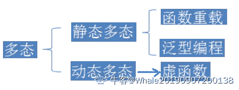

# 百度 2018 校招 AI 异构计算工程师笔试题（提前批）

## 1

关于多线程与多进程编程，下面描述正确的是：

正确答案: A C D   你的答案: 空 (错误)

```cpp
多进程里，子进程可获得父进程的所有堆与栈的数据；而线程会与同进程的其他线程共享数据，拥有自己的栈空间
```

```cpp
线程因为有自己的独立栈空间且共享数据，所有执行的开销相对较大，同时不利于资源管理和保护
```

```cpp
线程的通信速度更快，切换更快，因为他们在同一地址空间内
```

```cpp
线程使用公共变量/内存时需要使用同步机制，因为他们在同一地址空间内
```

```cpp
因多线程里，每个子进程有自己的地址空间，因此相互之间通信时，线程不如进程灵活和方便
```

本题知识点

百度 Java 工程师 C++工程师 iOS 工程师 安卓工程师 运维工程师 前端工程师 算法工程师 PHP 工程师 2018

## 2

以下说法正确的是？

正确答案: A B C D   你的答案: 空 (错误)

```cpp
在多线程中不加限制的随意访问非 static 局部变量可能会导致运算结果出错
```

```cpp
在多线程中不加限制的随意访问非 static 全部变量可能会导致运算结果出错
```

```cpp
在多线程中不加限制的随意访问 static 局部变量可能会导致运算结果出错
```

```cpp
在多线程中不加限制的随意访问 static 全部变量可能会导致运算结果出错
```

本题知识点

百度 Java 工程师 C++工程师 iOS 工程师 安卓工程师 运维工程师 前端工程师 算法工程师 PHP 工程师 2018

## 3

如下描述错误的是：

正确答案: A C   你的答案: 空 (错误)

```cpp
GPU 线程切换开销小于 CPU 线程切换开销的主要原因是，GPU 每一个线程都有独立的 PC 寄存器
```

```cpp
GPU 的一个 block 内的线程，只能运行在一个 SM 或者 CU 中
```

```cpp
GPU 的 L1 cache 延迟和吞吐性能通常远高于 CPU L1 cache
```

```cpp
提高 GPU 显存访问性能的主要方式是： coalesced 和 alignment
```

本题知识点

百度 Java 工程师 C++工程师 iOS 工程师 安卓工程师 运维工程师 前端工程师 算法工程师 PHP 工程师 2018

## 4

ADD R0, R1, #3 属于（）：

正确答案: A   你的答案: 空 (错误)

```cpp
立即寻址方式
```

```cpp
多寄存器寻址
```

```cpp
寄存器直接寻址
```

```cpp
相对寻址
```

本题知识点

百度 Java 工程师 C++工程师 iOS 工程师 安卓工程师 运维工程师 前端工程师 算法工程师 PHP 工程师 2018

## 5

一台机器对 200 个单词进行排序花了 200 秒(使用冒泡排序)，那么花费 800 秒，大概可以对多少个单词进行排序

正确答案: A   你的答案: 空 (错误)

```cpp
400
```

```cpp
500
```

```cpp
600
```

```cpp
700
```

```cpp
800
```

本题知识点

百度 Java 工程师 C++工程师 iOS 工程师 安卓工程师 运维工程师 前端工程师 算法工程师 PHP 工程师 2018

讨论

[无敌刷刷刷 2](https://www.nowcoder.com/profile/2518421)

n 的数据量，时间复杂度是 O（n²），200 单词是 200 秒 2n 的数据量时间复杂度是 2²O（n），400 单词是 800 秒答案应该是 400 个单词

发表于 2018-08-02 15:26:19

* * *

## 6

以下关于栈的说法正确的是：

正确答案: A   你的答案: 空 (错误)

```cpp
在栈空的情况下，一定不能作出栈操作，否则产生溢出
```

```cpp
栈一定是顺序存储的线性结构
```

```cpp
空栈是所有元素都为 0 的栈
```

```cpp
一个栈的输入序列为：A,B,C,D，可以得到输出序列：C,A,B,D
```

本题知识点

百度 Java 工程师 C++工程师 iOS 工程师 安卓工程师 运维工程师 前端工程师 算法工程师 PHP 工程师 2018

## 7

下列关于多态性说法不正确的是：

正确答案: A B   你的答案: 空 (错误)

```cpp
重载函数名相同，但是参数列表个数和顺序，参数类型，以及返回类型一定不同
```

```cpp
重载 overload 和 重写 override 是一个意思
```

```cpp
多态行有静态和动态多态两种
```

```cpp
c++中 final 关键字表示函数不能再次被 override
```

本题知识点

百度 Java 工程师 C++工程师 iOS 工程师 安卓工程师 运维工程师 前端工程师 算法工程师 PHP 工程师 2018 C++

讨论

[Whale2021](https://www.nowcoder.com/profile/782921671)



发表于 2020-08-26 19:22:56

* * *

[牛客 989543153 号](https://www.nowcoder.com/profile/989543153)

重指函数，，，

发表于 2020-12-28 08:35:14

* * *

[欲渡黄河冰塞川](https://www.nowcoder.com/profile/331787244)

A 项对于函数的重载，函数的返回值类型不是不能作为判断是否重载的条件吗？

发表于 2021-04-13 20:40:53

* * *

## 8

在 C++中，下列哪一个可以做为有继承关系的对象之间安全的转换：

正确答案: B   你的答案: 空 (错误)

```cpp
static_cast
```

```cpp
dynamic_cast
```

```cpp
const_cast
```

```cpp
reinterpret_cast
```

本题知识点

百度 Java 工程师 C++工程师 iOS 工程师 安卓工程师 运维工程师 前端工程师 算法工程师 PHP 工程师 2018 C++

讨论

[666 的佩奇爸爸](https://www.nowcoder.com/profile/7670357)

```cpp

	答案：A、B。

	转换指的是通过改变一个变量的类型为别的类型从而改变该变量的表示方式。

	C++标准定义了四个新的转换符：reinterpret_cast、static_cast、dynamic_cast 和 const_cast，

	目的在于控制类（class）之间的类型转换。

	对于选项 A，static_cast 可以用于类层次结构中基类和子类之间指针或引用的转换。

	把子类的指针或引用转换成基类表示是安全的，但把基类指针或引用转换成子类指针或引用时，

	由于没有动态类型检查，所以，它是不安全的。

	基类和子类之间的动态类型转换一般建议使用 dynamic_cast。

	static_cast 可以用作对象继承之间转换，只不过有安全隐患。因此，选项 A 正确。

	对于选项 B，dynamic_cast 用于对象的指针和引用，当用于多态类型转换时，

	允许隐式转换及相反的转换操作，与 static_cast 的不同之处在于，在相反的转换过程中，

	dynamic_cast 会检测操作的有效性，如果返回的不是被请求的有效完整对象，则返回 null，

	反之返回这个有效的对象，如果是引用返回无效时，则会抛出 bad_cast 异常。所以，选项 B 正确。

	对于选项 C，const_cast 用来修改类型的 const 或 volatile 属性，具体而言，

	const_cast 会操纵传递对象的 const 属性，设置或者移除该属性。所以，选项 C 错误。

	对于选项 D，reinterpret_cast 用来处理无关类型之间的转换，可以转换任意一个 32 位整数，

	包括所有的指针和整数。可以把任何整数转成指针，也可以把任何指针转成整数，

	以及把指针转化为任意类型的指针，但不能将非 32 位的实例转成指针。所以，选项 D 错误。

	所以，本题的答案为 A、B。

```

发表于 2018-07-13 17:06:50

* * *

## 9

C 代码中可能会出现如下类型的结构体定义：

```cpp
typedef struct holder {
    struct holder *next;
    struct holder *prev;
    char buffer[ 0 ];
} holder;
```

最后一行 char data[ 0 ] 作用是（）

正确答案: A B   你的答案: 空 (错误)

```cpp
方便管理内存缓冲区
```

```cpp
减少内存碎片化
```

```cpp
使结构体数据对齐
```

```cpp
没有作用
```

本题知识点

百度 C++工程师 2018 C 语言

讨论

[林山一笑](https://www.nowcoder.com/profile/71176329)

1\. 方便管理内存缓冲区：如果用指针 char* 代替 char data[0] 来指向新开辟的空间，需要两次 malloc 也需要两次 free。用 char data[0]，一次 malloc 即完成，方便管理缓冲区。

2\. 减少内存碎片化：如果在 struct 尾部用指针*指向新开辟的 buffer 长度，struct 本身相较 buffer 长度是很小的，即碎片化的内存。而用 char data[0]指向新开辟的 buffer，只需一次 malloc，struct 和 buffer 的空间是连续的。即减少了内存的碎片化。

3. 节省空间，相较用指针指向新开辟的 str，data[0]是不占用内存的，而指针占用 4 字节。

发表于 2020-08-09 23:56:56

* * *

[极客教育家](https://www.nowcoder.com/profile/97982629)

一、在 struct 结构定义的后面使用 data[0]的好处：1.方便管理内存缓冲区：如果用指针 char* 代替 char data[0] 来指向新开辟的空间，需要两次 malloc 也需要两次 free。用 char data[0]，一次 malloc 即完成，方便管理缓冲区。  2.可以减少内存碎片化：如果在 struct 尾部用指针*指向新开辟的 buffer 长度，struct 本身相较 buffer 长度是很小的，即碎片化的内存。而用 char data[0]指向新开辟的 buffer，只需一次 malloc，struct 和 buffer 的空间是连续的。即减少了内存的碎片化。3.节省空间（这里就不得不说说指针和 data[0]的区别）二、使用指针和 data[0]有一下区别： 1.地址的连续性，data[0]和结构体是一个连续的存储空间，使用指针就不是连续的。连续的存储空间通过不同的强转使用起来比较灵活。
2.data[0]不占用任何内存，*data 占用 4 字节 。
3.建议：C++的类中可以使用 *data 但是不要使用 data[0]，因为这样使用可能会导致类中的一些看不到的东西被覆盖。  发表于 2021-11-09 19:52:07

* * *

[Joker2720](https://www.nowcoder.com/profile/210202720)

**在结构体定义最后一行使用**** char data[ 0 ] **在结构体中，data 是一个数组名，但该数组没有元素。该数组的真实地址紧随结构体之后，而这个地址就是结构体后面数据的地址（如果给这个结构体分配的内容大于这个结构体实际大小，后面多余的部分就是这个 data 的内容）。这种声明方法可以巧妙的实现 C 语言里的数组扩展。这种声明方法的作用如下：1.方便管理内存缓冲区：用指针需要两次 malloc 和 free，用 char data[0]，只需一次 malloc 和 free，方便管理缓冲区。2.减少内存碎片化：用指针指向开辟的 buffer 与结构体不连续，用 char data[0]指向开辟的 buffer，struct 和 buffer 的空间是连续的。即减少了内存的碎片化。3.节省空间：指向开辟的 buffer，指针占 4 字节（32 位系统），而 data[0]是不占用内存的。

编辑于 2022-02-19 00:25:07

* * *

## 10

类 B 是类 A 的公有派生类，类 A 和类 B 中都定义了虚函数 func(),p 是一个指向类 A 对象的指针，则 p->A::func()将（）？

正确答案: C   你的答案: 空 (错误)

```cpp
调用类 B 中函数 func()
```

```cpp
即调用类 A 中函数，也调用类 B 中的函数
```

```cpp
调用类 A 中函数 func()
```

```cpp
根据 p 所指的对象类型而确定调用类 A 中或类 B 中的函数 func()
```

本题知识点

百度 Java 工程师 C++工程师 iOS 工程师 安卓工程师 运维工程师 前端工程师 算法工程师 PHP 工程师 2018 C++

讨论

[HouJian](https://www.nowcoder.com/profile/5255423)

D 是不对的不论指针 p 是属于类 A 还是类 B，也不论指针 p 指向的对象属于类 A 还是类 B(当然，不能用类 B 的指针指向类 A 的对象)，因为加了作用域说明符 A::，因此都只会调用类 A 的函数。

编辑于 2020-09-21 17:35:43

* * *

[Warwolf_Jacob](https://www.nowcoder.com/profile/40159364)

感觉有点傻了，D 对，C 才对吗？既然 C 对了，D 为啥不对，不就是因为 D 所以 C 吗？

发表于 2020-08-10 19:39:23

* * *

## 11

请简要描述主流 GPU 存储层级，并说明各层级特点

你的答案

本题知识点

百度 Java 工程师 C++工程师 iOS 工程师 安卓工程师 运维工程师 前端工程师 算法工程师 PHP 工程师 2018

## 12

请简述 2~3 个导致 GPU 计算单元使用率不高的原因，并提出改进方式

你的答案

本题知识点

百度 Java 工程师 C++工程师 iOS 工程师 安卓工程师 运维工程师 前端工程师 算法工程师 PHP 工程师 2018

## 13

什么是 register file、mem bank conflict、read-only cache

你的答案

本题知识点

百度 Java 工程师 C++工程师 iOS 工程师 安卓工程师 运维工程师 前端工程师 算法工程师 PHP 工程师 2018

## 14

请描述一下你最熟悉的硬件架构特点

你的答案

本题知识点

百度 Java 工程师 C++工程师 iOS 工程师 安卓工程师 运维工程师 前端工程师 算法工程师 PHP 工程师 2018

## 15

二叉树根据给定的结点，对以当前结点为父结点的子树进行翻转 Invert a binary tree，given key == 7       4      /    \    2       7   /   \   /   \ 1    3 6    9 to       4     /    \   2       7  /   \   /   \ 1   3 9   6 /**  * Definition for a binary tree node.  * struct TreeNode {  *     int val;  *     TreeNode *left;  *     TreeNode *right;  *     TreeNode(int x) : val(x), left(NULL), right(NULL) {}  * };  */ class Solution { public:     TreeNode* invertTree(TreeNode* root, TreeNode* key) {    }}；

你的答案

本题知识点

百度 Java 工程师 C++工程师 iOS 工程师 安卓工程师 运维工程师 前端工程师 算法工程师 PHP 工程师 2018

## 16

有一张 1024x1024 pixel 的三通道图片，需要进行 32 个不同的 3x3 三通道卷积操作。请使用你所熟悉的并行加速技术及编程语言实现，如 CPU（AVX/SSE）、GPU（CUDA/OpenCL）,ARM(NEON)等，请详述解决思路。

你的答案

本题知识点

百度 Java 工程师 C++工程师 iOS 工程师 安卓工程师 运维工程师 前端工程师 算法工程师 PHP 工程师 2018