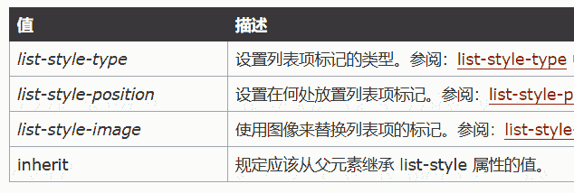

# 百度 2018 校招 Web 前端工程师笔试题（第一批）

## 1

下面代码输出的结果为：

```cpp
for(var i=1;i<=3;i++){
   setTimeout((function(a){
       console.log(a);    
   })(i),0);  
};
```

正确答案: B   你的答案: 空 (错误)

```cpp
4 4 4
```

```cpp
1 2 3
```

```cpp
3 3 3
```

```cpp
没有输出结果
```

本题知识点

百度 Java 工程师 C++工程师 iOS 工程师 安卓工程师 运维工程师 前端工程师 算法工程师 PHP 工程师 前端工程师 百度 2018

讨论

[爱吃肉的小胖子](https://www.nowcoder.com/profile/8143626)

https://www.cnblogs.com/smswei/p/5240065.html

发表于 2018-08-01 09:18:20

* * *

[GgZM](https://www.nowcoder.com/profile/655092269)

这是一个立即执行函数 不会与循环体的变量形成闭包

发表于 2019-01-29 03:58:27

* * *

## 2

str.replace(/\s+$/g, '')这个表达式的效果是

正确答案: D   你的答案: 空 (错误)

```cpp
去掉 str 的所有空格
```

```cpp
去掉 str 开头和末尾的空格
```

```cpp
去掉 str 开头的空格
```

```cpp
去掉 str 末尾的空格
```

本题知识点

百度 Java 工程师 C++工程师 iOS 工程师 安卓工程师 运维工程师 前端工程师 算法工程师 PHP 工程师 2018

## 3

以下 JavaScript 程序输出什么()

```cpp
var x="undefined";
var y="false";
var z="";
function assert(xVar){
    if(xVar)     
        console.log(true);
    else  
        console.log(false);
}
assert(x);
assert(y);
assert(z);
```

正确答案: B   你的答案: 空 (错误)

```cpp
true，true，true
```

```cpp
true，true，false
```

```cpp
false，false，true
```

```cpp
false，false，false
```

本题知识点

百度 Java 工程师 C++工程师 iOS 工程师 安卓工程师 运维工程师 前端工程师 算法工程师 PHP 工程师 2018

讨论

[周如生](https://www.nowcoder.com/profile/98921543)

var  x="undefined"  var  y="false"
var  z=""
x y z 加上引号，三者都为字符串类型 ,  x y  为非空字符串，转换为 true，z 空字符串 转为 false

发表于 2018-07-20 21:54:35

* * *

[lemoNMM](https://www.nowcoder.com/profile/5747772)

在 JS 中只有 0 和空字符串等于 false，变量 x 和 y 字符串转化为布尔值是 true

发表于 2018-07-09 22:47:40

* * *

[上弦](https://www.nowcoder.com/profile/8923668)

if else 语句里面的判断被转化为了布尔值，然后就会进入对应的判断

发表于 2018-07-09 22:13:01

* * *

## 4

有如下 JavaScript 程序:

```cpp
  var a = 'baidu';
  var b = new String('baidu');
  console.log(typeof a);
  console.log(typeof b);
```

会输出什么?

正确答案: D   你的答案: 空 (错误)

```cpp
object object
```

```cpp
string string
```

```cpp
object string
```

```cpp
string object
```

本题知识点

百度 Java 工程师 C++工程师 iOS 工程师 安卓工程师 运维工程师 前端工程师 算法工程师 PHP 工程师 2018

讨论

[INeedahug](https://www.nowcoder.com/profile/9336833)

new String()返回 string 实例，是对象类型

发表于 2018-08-23 12:32:08

* * *

## 5

有如下 JavaScript 程序:

```cpp
var arr=[1,2,3];
arr.shift();
arr.push(1);
arr.unshift(2);
var arrNew=arr.concat([1,2]);
console.log(arrNew);
```

在浏览器中运行会结果是什么

正确答案: A   你的答案: 空 (错误)

```cpp
[2,2,3,1,1,2]
```

```cpp
[2,1,2,1,1,2]
```

```cpp
[2,2,3,1,[1,2]]
```

```cpp
[2,1,2,1,[1,2]]
```

本题知识点

百度 Java 工程师 C++工程师 iOS 工程师 安卓工程师 运维工程师 前端工程师 算法工程师 PHP 工程师 2018

讨论

[小野市](https://www.nowcoder.com/profile/9391147)

unshift（）向数组开头添加一个或多个元素

发表于 2018-07-08 01:50:28

* * *

## 6

下面 JavaScript 哪个表达式会返回 true?

正确答案: D   你的答案: 空 (错误)

```cpp
1 + '0' === '1'
```

```cpp
undefined
```

```cpp
1 + '0' === 1
```

```cpp
'0'
```

本题知识点

百度 Java 工程师 C++工程师 iOS 工程师 安卓工程师 运维工程师 前端工程师 算法工程师 PHP 工程师 2018

讨论

[小野市](https://www.nowcoder.com/profile/9391147)

只有空字符串会转换成 false

发表于 2018-07-08 01:51:02

* * *

[周如生](https://www.nowcoder.com/profile/98921543)

1 + ‘0’  === ‘10’  ，+号表示链接符， 1 会转为 ‘1’ ，拼接出‘10’ 

发表于 2018-07-20 22:04:16

* * *

## 7

有如下 JavaScript 程序:

```cpp
function Test() {
    var x = 0;
    return function() {
        console.log(x++);
    }
}

var f1 = Test(),
    f2 = Test();
f1();
f1();
f2();
```

会输出什么?

正确答案: C   你的答案: 空 (错误)

```cpp
0 0 0
```

```cpp
0 0 2
```

```cpp
0 1 0
```

```cpp
0 1 2
```

本题知识点

百度 Java 工程师 C++工程师 iOS 工程师 安卓工程师 运维工程师 前端工程师 算法工程师 PHP 工程师 2018

讨论

[INeedahug](https://www.nowcoder.com/profile/9336833)

闭包内的变量不会立即回收

发表于 2018-08-23 12:33:57

* * *

[少了蓝胖的大雄](https://www.nowcoder.com/profile/863421701)

c

发表于 2019-01-27 09:51:28

* * *

## 8

下面哪一项可以创建 JavaScript 函数?

正确答案: B   你的答案: 空 (错误)

```cpp
function=myFunction(){....}
```

```cpp
function myFunction(){....}
```

```cpp
myfunction == function(){....}
```

```cpp
myFunction(){....}
```

本题知识点

百度 Java 工程师 C++工程师 iOS 工程师 安卓工程师 运维工程师 前端工程师 算法工程师 PHP 工程师 2018

讨论

[加油。学计算机](https://www.nowcoder.com/profile/4503430)

es6 语法呢。第四种应该可以的吧

发表于 2018-12-21 01:19:37

* * *

[不愿停](https://www.nowcoder.com/profile/9322258)

函数定义的三种方式：函数声明 function foo() {} 函数表达式 var foo = function(){}; 使用 Function 构造函数 var foo = new Function();

发表于 2018-08-30 16:07:55

* * *

## 9

下面哪个函数在 jquery 中能够实现元素之间互换显示和隐藏?

正确答案: D   你的答案: 空 (错误)

```cpp
hide
```

```cpp
show
```

```cpp
fade
```

```cpp
toggle
```

本题知识点

百度 Java 工程师 C++工程师 iOS 工程师 安卓工程师 运维工程师 前端工程师 算法工程师 PHP 工程师 2018

## 10

有如下 JavaScript 程序:

```cpp
var Test= {
    foo: "test",
    func: function() {
        var self = this;
        console.log(this.foo);  
        console.log(self.foo);  
        (function() {
            console.log(this.foo);  
            console.log(self.foo);  
        }());
    }
};
Test.func();
```

会输出什么?

正确答案: B   你的答案: 空 (错误)

```cpp
test<br>test<br>test<br>test
```

```cpp
test<br>test<br>undefined<br>test
```

```cpp
test<br>test<br>test<br>undefined
```

```cpp
undefined<br>test<br>undefined<br>test
```

本题知识点

百度 Java 工程师 C++工程师 iOS 工程师 安卓工程师 运维工程师 前端工程师 算法工程师 PHP 工程师 2018

讨论

[明天你好 iew](https://www.nowcoder.com/profile/9554450)

答案错了，应该是 B。解析：this 指针指向其调用者，所以在执行 Test.func()之后，func()的调用者是 Test 这个对象，所以 func 内部的 this 指的就是 Test 对象，这样的话前两个输出都是“test”。需要注意的是，self 作为一个变量，把 this 指针的指向者（Test 对象）保存了下来。内部的函数闭包在执行的时候没有调用者，则 this 指向 window 对象，输出“undefined”。self.foo 访问闭包函数外部的 self 变量，也就是 test 对象，输出“test”.

发表于 2018-08-12 15:44:14

* * *

[李嘉滢](https://www.nowcoder.com/profile/647389931)

var Test= {    foo: "test",    func: function() {        var self = this;        console.log(this.foo); //指向 test         console.log(self.foo);  //指向 test         (function() {            console.log(this.foo);  //指向 window            console.log(self.foo);  //指向 test  self = this 的 this 是指向 test 的        }());    }};Test.func();

发表于 2020-08-26 16:55:24

* * *

## 11

下面语法中，哪个可以定义一个带正方形的列表? （）

正确答案: D   你的答案: 空 (错误)

```cpp
list-style-image: square
```

```cpp
list-style-color: square
```

```cpp
list-type: square
```

```cpp
list-style-type: square
```

本题知识点

百度 Java 工程师 C++工程师 iOS 工程师 安卓工程师 运维工程师 前端工程师 算法工程师 PHP 工程师 2018 CSS

讨论

[climax](https://www.nowcoder.com/profile/3595173)



发表于 2018-09-11 10:22:31

* * *

[honng](https://www.nowcoder.com/profile/633961032)

第一次做错了，后来好几次都没错

编辑于 2020-12-30 17:12:42

* * *

[牛牛 121](https://www.nowcoder.com/profile/383958544)

简写为 list-style

发表于 2021-10-04 23:03:43

* * *

## 12

下面标签中默认属于行内元素的是？（）

正确答案: C   你的答案: 空 (错误)

```cpp
<li>
```

```cpp
<h1>
```

```cpp
<label>
```

```cpp
<nav>
```

本题知识点

百度 前端工程师 2018 HTML

讨论

[Blue_01](https://www.nowcoder.com/profile/625595407)


发表于 2020-09-02 10:01:28

* * *

[小野市](https://www.nowcoder.com/profile/9391147)

其它三者是块级元素

发表于 2018-07-08 01:56:54

* * *

[小游侠 UnoW](https://www.nowcoder.com/profile/850761022)

label 呀

发表于 2019-12-19 16:04:50

* * *

## 13

关于电子邮件连接，下面写法正确的是？（）

正确答案: C   你的答案: 空 (错误)

```cpp
<a url="love@baidu.com”>love@baidu.com</a>
```

```cpp
<mail href=”love@baidu.com”>love@baidu.com</mail>
```

```cpp
<a href=”mailto:love@baidu.com”>love@baidu.com</a>
```

```cpp
<mail href=”mailto:love@baidu.com”>love@baidu.com</mail>
```

本题知识点

百度 Java 工程师 C++工程师 iOS 工程师 安卓工程师 运维工程师 前端工程师 算法工程师 PHP 工程师 2018 HTML

讨论

[mcfish](https://www.nowcoder.com/profile/813309548)

a 标签只是超链接的占位符，href 属性中是 url 地址  电子邮件的 url 地址的 protocol 协议部分是 mailto

发表于 2020-08-15 12:14:33

* * *

[一锅端攻城狮](https://www.nowcoder.com/profile/502495701)

别把输入框 type 为 mail 的搞混了

发表于 2021-05-21 02:32:12

* * *

[明天你好 iew](https://www.nowcoder.com/profile/9554450)

BD 的后缀写错，应该是：/>等价于/a>。然后 a 标签没有 url 属性。

发表于 2018-08-12 15:58:28

* * *

## 14

关于 form 标签的说法，下列错误的是？（）

正确答案: D   你的答案: 空 (错误)

```cpp
&lt;form&gt; 标签用于为用户输入创建 HTML 表单
```

```cpp
数据通过设置的 action 属性提交到指定的位置
```

```cpp
&lt;form&gt;标签目前只支持 GET 和 POST 请求，且默认为 GET
```

```cpp
&lt;form&gt;标签的 enctype 属性值默认为 multipart/form-data
```

本题知识点

百度 Java 工程师 C++工程师 iOS 工程师 安卓工程师 运维工程师 前端工程师 算法工程师 PHP 工程师 2018

讨论

[dayday_up](https://www.nowcoder.com/profile/4864122)

enctype 属性的值由四个 application/x-www-form-urlencoded：在发送前编码所有字符（默认）multipart/form-data：不对字符编码。在使用包含文件上传控件的表单时，必须使用该值。text/plain：空格转换为 "+" 加号，但不对特殊字符编码。
application/json：json 格式的数据 

编辑于 2018-08-11 09:04:28

* * *

## 15

下面哪个属性可以在 html 元素中用来定义内联样式?（）

正确答案: D   你的答案: 空 (错误)

```cpp
href
```

```cpp
link
```

```cpp
rel
```

```cpp
style
```

本题知识点

百度 Java 工程师 C++工程师 iOS 工程师 安卓工程师 运维工程师 前端工程师 算法工程师 PHP 工程师 2018 HTML

讨论

[zhuyoubin](https://www.nowcoder.com/profile/8063197)

外联：使用 link 标签引入外部的 css 文件。 内联：在 head 标签中使用 style 标签。 嵌入：在标签中使用 style 属性。

发表于 2020-09-04 07:35:41

* * *

[小爱少女](https://www.nowcoder.com/profile/47609321)

外联：使用 link 标签引入外部的 css 文件。 内联：在 head 标签中使用 style 标签。 嵌入：在标签中使用 style 属性。

编辑于 2020-09-10 01:04:26

* * *

[小野市](https://www.nowcoder.com/profile/9391147)

内联 外联 嵌入

发表于 2018-07-08 02:04:12

* * *

## 16

如果想在 bash 中，把标准输入流重定向到标准错误输出流,应该加下面那条命令?

正确答案: B   你的答案: 空 (错误)

```cpp
1&gt;&amp;2
```

```cpp
0&gt;&amp;2
```

```cpp
2&gt;&amp;1
```

```cpp
2&gt;&amp;0
```

```cpp
0&gt;&amp;1
```

```cpp
1&gt;&amp;0
```

本题知识点

百度 Java 工程师 C++工程师 iOS 工程师 安卓工程师 运维工程师 前端工程师 算法工程师 PHP 工程师 2018

讨论

[Xiao 小](https://www.nowcoder.com/profile/4869076)

输入流 0 标准输出 1 标准错误输出 2 linux 命令知识

发表于 2018-07-08 00:21:27

* * *

## 17

Linux 系统中某文件的权限是 d-r-xrw---x,那么以下描述正确的有()

正确答案: D   你的答案: 空 (错误)

```cpp
该文件类型为块设备文件
```

```cpp
文件的所属组成员的权限为可读，可写，可以通过 cd 命令进入目录
```

```cpp
文件的所有者权限为可读，可写
```

```cpp
文件的非本组成员的权限为只可执行
```

本题知识点

百度 Java 工程师 C++工程师 iOS 工程师 安卓工程师 运维工程师 前端工程师 算法工程师 PHP 工程师 2018

讨论

[明天你好 iew](https://www.nowcoder.com/profile/9554450)

d:表示文件类型，代表文件类型为目录。r-:代表所有者的权限。只读。xrw-:所有者所属组的权限。x(可执行)，r(只读)，w(可写).x:非本组成员的权限.可执行

发表于 2018-08-12 16:21:06

* * *

[小野市](https://www.nowcoder.com/profile/9391147)

前三位：文件拥有者权限

中间三位：同组群的权限

后三位：其它组群的权限

发表于 2018-07-08 02:10:53

* * *

[不愿停](https://www.nowcoder.com/profile/9322258)

d-r-xrw---xd: 目录文件 directory fileb: 块级文件 block level filer-x  所有者，可读可执行 rw- 同组用户，可读可写--x 其他用户，可执行

发表于 2018-08-30 10:33:34

* * *

## 18

如何使用 CSS 选择器定义某个父元素中所有第「奇数」个子元素的样式：

正确答案: A   你的答案: 空 (错误)

```cpp
nth-child(odd)
```

```cpp
nth-child(even)
```

```cpp
nth-of-type(odd)
```

```cpp
nth-of-child(even)
```

本题知识点

百度 前端工程师 2018 CSS

讨论

[honng](https://www.nowcoder.com/profile/633961032)

【 odd 三个字母 奇数】 【 even 四个字母 偶数】

编辑于 2020-12-24 16:00:20

* * *

[不愿停](https://www.nowcoder.com/profile/9322258)

```cpp
nth-child(odd) ：定义某个父元素中所有第"奇数"个子元素的样式

nth-of-type(odd) ：定义某个父元素中的不同类型中的所有第"奇数"个子元素的样式
```

发表于 2018-08-30 10:48:54

* * *

[冬至 ing](https://www.nowcoder.com/profile/339050652)

nth-child(odd) 奇数 ,nth-child(even) 偶数。nth-child(n) : 匹配父元素中的第 n 个子元素，元素类型没有限制。
nth-of-type(n) : 匹配同类型中的第 n 个同级兄弟元素。

发表于 2020-08-04 10:30:39

* * *

## 19

如何使用 CSS 在标题元素

## 前插入图像文件

正确答案: B   你的答案: 空 (错误)

```cpp
h2:after{content:url(mark.png)}
```

```cpp
h2:before{content:url(mark.png)}
```

```cpp
h2.head{content:url(mark.png)}
```

```cpp
h2.first{content:url(mark.png)}
```

本题知识点

百度 前端工程师 2018 CSS

讨论

[Blue_01](https://www.nowcoder.com/profile/625595407)

:before 选择器：在每个 <p> 元素的内容之前插入新内容。:after 伪元素：此样式会在每个 h1 元素之后播放一段声音。

发表于 2020-09-11 10:13:41

* * *

[牛客 894215034 号](https://www.nowcoder.com/profile/894215034)

```cpp
h2:before{content:url(mark.png)}

```

发表于 2021-04-02 17:11:42

* * *

## 20

text-shadow 属性中的四个值 (length、length、length、color) 分别是什么意义：

正确答案: C   你的答案: 空 (错误)

```cpp
阴影离开文字的纵方向距离，阴影离开文字的横方向距离，阴影的模糊半径，阴影的颜色
```

```cpp
阴影的模糊半径，阴影离开文字的横方向距离，阴影离开文字的纵方向距离，阴影的颜色
```

```cpp
阴影离开文字的横方向距离，阴影离开文字的纵方向距离，阴影的模糊半径，阴影的颜色
```

```cpp
阴影的模糊半径，阴影离开文字的纵方向距离，阴影离开文字的横方向距离，阴影的颜色
```

本题知识点

百度 前端工程师 2018 CSS

讨论

[阳光是 Sunny](https://www.nowcoder.com/profile/1475166)


发表于 2020-08-12 21:17:07

* * *

[肖宇晨](https://www.nowcoder.com/profile/43293287)

设置其他如内边距外边距时 第一个值都是上下 第二个值都是左右 设置盒子阴影和文字阴影时反过来

发表于 2020-12-09 16:10:58

* * *

[牛客 808946347 号](https://www.nowcoder.com/profile/808946347)

XYRC

发表于 2022-02-13 15:31:59

* * *

## 21

对于 JavaScript Math 对象描述不正确的是：

正确答案: D   你的答案: 空 (错误)

```cpp
Math.PI; 返回圆周率
```

```cpp
Math.max(); 返回两个指定的数中带有较大的值的那个数
```

```cpp
Math.abs(); 返回数的绝对值
```

```cpp
Math.floor(); 对一个数进行四舍五入
```

本题知识点

百度 Java 工程师 C++工程师 iOS 工程师 安卓工程师 运维工程师 前端工程师 算法工程师 PHP 工程师 2018

讨论

[毛毛开飞机](https://www.nowcoder.com/profile/7846054)

Math.floor()   向下取整
Math.ceil()     向上取整 Math.round() 四舍五入 Math.max()    返回多个数中的最大值， 而不是两个数中的最大值

发表于 2018-07-28 11:23:44

* * *

[小野市](https://www.nowcoder.com/profile/9391147)

D 向下舍入

发表于 2018-07-08 02:15:00

* * *

## 22

Node.js 中，下列哪个选项能取得当前脚本文件的路径?

正确答案: C   你的答案: 空 (错误)

```cpp
path.filename()
```

```cpp
path.dirname()
```

```cpp
__filename
```

```cpp
__dirname
```

本题知识点

百度 Java 工程师 C++工程师 iOS 工程师 安卓工程师 运维工程师 前端工程师 算法工程师 PHP 工程师 2018

讨论

[小野市](https://www.nowcoder.com/profile/9391147)

C 当前模块文件的带有完整绝对路径的文件名

D 当前文件所在目录的完整目录名

发表于 2018-07-08 02:20:34

* * *

## 23

下列关于 Express 说法正确的是？

正确答案: B   你的答案: 空 (错误)

```cpp
Express 是一个 MVC 框架
```

```cpp
Express 是一个 NPM 模块
```

```cpp
Express 是 Node.js 的核心模块
```

```cpp
Express 包含了 WebSocket 的实现
```

本题知识点

百度 Java 工程师 C++工程师 iOS 工程师 安卓工程师 运维工程师 前端工程师 算法工程师 PHP 工程师 2018

讨论

[只求 offee](https://www.nowcoder.com/profile/904188727)

A 为什么错啊？

发表于 2021-07-21 17:23:59

* * *

## 24

下面哪个算法对单链表排序最快?

正确答案: B   你的答案: 空 (错误)

```cpp
冒泡排序
```

```cpp
快速排序
```

```cpp
二分插入排序
```

```cpp
堆排序
```

本题知识点

百度 Java 工程师 C++工程师 iOS 工程师 安卓工程师 运维工程师 前端工程师 算法工程师 PHP 工程师 2018

## 25

以下代码时间复杂度为多少?(^符号表示为幂)
int x=0,a=1,b=2;
for(i=1;i<=N;i++)
{
    for(j=1;j<=i;j++)
    {
        for(k=1;k<=N;k++)
        x+=a*b;
    }
}

正确答案: E   你的答案: 空 (错误)

```cpp
O(N²)
```

```cpp
O((N²)logN)
```

```cpp
O(NlogN)
```

```cpp
O(N*(N+1))
```

```cpp
O(N³)
```

本题知识点

百度 Java 工程师 C++工程师 iOS 工程师 安卓工程师 运维工程师 前端工程师 算法工程师 PHP 工程师 2018

## 26

有一个中缀表达式为 a*(b-(c+d)),它的后缀表达式可以是什么?

正确答案: A   你的答案: 空 (错误)

```cpp
abcd+-*
```

```cpp
abc+d-*
```

```cpp
ab-cd+*
```

```cpp
abd+c-*
```

本题知识点

百度 Java 工程师 C++工程师 iOS 工程师 安卓工程师 运维工程师 前端工程师 算法工程师 PHP 工程师 2018

讨论

[小野市](https://www.nowcoder.com/profile/9391147)

中序遍历与后序遍历

发表于 2018-07-08 02:24:06

* * *

[sxc666](https://www.nowcoder.com/profile/927480328)

中缀表达式转换成后缀表达式

1、概述

可以看到，后缀表达式适合计算式进行运算，但是人却不太容易写出来，尤其是表达式很长得情况下，因此在开发中，需要将 **中缀表达式**转成**后缀表达式**。

2、具体步骤

| 12345678910 | 1.初始化两个栈：运算符栈 s1 和储存中间结果的栈 s2；2.从左至右扫描中缀表达式；3.遇到操作数时，将其压 s2；4.遇到运算符时，比较其与 s1 栈顶运算符的优先级：（1）如果 s1 为空，或栈顶运算符为左括号“(”，则直接将此运算符入栈；（2）否则，若优先级比栈顶运算符的高，也将运算符压入 s1；（3）否则，将 s1 栈顶的运算符弹出并压入到 s2 中，再次转到(4.1)与 s1 中新的栈顶运算符相比较； 5.遇到括号时：　（1）如果是左括号"("，则直接压入 s1　（2）如果是右括号")"，则依次弹出 s1 栈顶的运算符，并压入 s2，直到遇到左括号为止，此时将这一对括号丢弃 6.重复步骤 2 至 5，直到表达式的最右边 7.将 s1 中剩余的运算符依次弹出并压入 s28.依次弹出 s2 中的元素并输出，结果的逆序即为中缀表达式对应的后缀表达式 |

3、案例

将中缀表达式 "1+((2+3)*4)-5" 转换为后缀表达式的过程如下：

结果为："1 2 3 + 4 * 5 - "


转载至[`www.cnblogs.com/niujifei/p/11603003.html`](https://www.cnblogs.com/niujifei/p/11603003.html)

发表于 2020-03-13 22:38:21

* * *

## 27

对于一个基本有序的序列，想让其全部有序，同时想求其最大的 5 个数，使用哪种排序算法最好?

正确答案: A   你的答案: 空 (错误)

```cpp
插入排序
```

```cpp
快速排序
```

```cpp
堆排序
```

```cpp
归并排序
```

```cpp
选择排序
```

本题知识点

百度 Java 工程师 C++工程师 iOS 工程师 安卓工程师 运维工程师 前端工程师 算法工程师 PHP 工程师 前端工程师 百度 2018

讨论

[dayday_up](https://www.nowcoder.com/profile/4864122)

基本有序，即相当于最好情况，因此只需要看最好情况时间复杂度，即哪种排序的时间复杂度为 O(n)：插入、希尔、冒泡、桶

发表于 2018-07-19 00:19:06

* * *

## 28

下面关于栈的说法正确的有?

正确答案: B   你的答案: 空 (错误)

```cpp
在栈空的情况下,能做退栈运算，因为下标一般为-1
```

```cpp
栈一般可以用来实现递归
```

```cpp
序列为 a,b,c 入栈，入栈之后随时可以出栈，出栈序列可以有 4 种
```

```cpp
共享栈不能用来减少内存的开销
```

本题知识点

百度 Java 工程师 C++工程师 iOS 工程师 安卓工程师 运维工程师 前端工程师 算法工程师 PHP 工程师 2018

## 29

图 G 的邻接矩阵表达如下，那么 G 的顶点数和边数为:

> 0 0 1 1 10 0 1 1 01 1 0 1 01 1 1 0 11 0 0 1 0

正确答案: C   你的答案: 空 (错误)

```cpp
4,7
```

```cpp
4,8
```

```cpp
5,7
```

```cpp
5,8
```

```cpp
7,4
```

```cpp
8,5
```

本题知识点

百度 Java 工程师 C++工程师 iOS 工程师 安卓工程师 运维工程师 前端工程师 算法工程师 PHP 工程师 2018

讨论

[小野市](https://www.nowcoder.com/profile/9391147)

对称矩阵

发表于 2018-07-08 02:28:02

* * *

## 30

下列 http 状态码，表示临时重定向的是

正确答案: B   你的答案: 空 (错误)

```cpp
301
```

```cpp
302
```

```cpp
404
```

```cpp
500
```

本题知识点

百度 Java 工程师 C++工程师 iOS 工程师 安卓工程师 运维工程师 前端工程师 算法工程师 PHP 工程师 2018

讨论

[小野市](https://www.nowcoder.com/profile/9391147)

301 永久重定向

302 暂时重定向

发表于 2018-07-08 02:28:51

* * *

## 31

页面中存在 id=jsContainer 的 DOM 元素。
该 DOM 元素内会给出一段随机文本，可能包含一些链接，比如 https://www.baidu.com，或者 www.baidu.com?from=onlineExam，如果出现链接文本，请给该链接文本加上链接标签，用户点击后能直接在新窗口中打开该链接。
请完成 link 函数，完成该功能
1、container 只有纯文本内容，不包含其他 dom 元素
2、识别所有以 http://、https://或者 www.开始的链接
3、所有 www.开头的链接，默认使用 http 协议
4、所有链接在新窗口打开

本题知识点

百度 Java 工程师 C++工程师 iOS 工程师 安卓工程师 运维工程师 前端工程师 算法工程师 PHP 工程师 模拟 字符串 *2018* *讨论

[驊驊龔頾](https://www.nowcoder.com/profile/846539477)

```cpp
function link() {
  let dom = document.getElementById("jsContainer");

  dom.innerHTML = dom.innerText.replace(/(http(s)?:\/\/|www\.)[\w\.\?\=\&#%]+/g, $1=> {
    console.log($1);
    return `<a href="${/^www/.test($1) ? 'http://'+$1 : $1}" target="_blank">${$1}</a>`
  });
}
```

发表于 2021-06-02 10:17:52

* * *

[huaxifn](https://www.nowcoder.com/profile/686784303)

```cpp
function link() {
    var container = document.getElementById('jsContainer');
    var str = container.innerHTML;
    console.log(str);
    str=str.replace(/(http:\/\/|https:\/\/|www\.)([a-zA-Z0-9._=?#]+)/g,function(el){
        if(/^www/.test(el)){
            return `<a href="http://${el}" target="_blank">${el}</a>`;
        }else{
            return `<a href="${el}" target="_blank">${el}</a>`;
        }
    })
    container.innerHTML = str;
}
```

发表于 2022-02-17 09:49:49

* * *

[Hg20181211172926](https://www.nowcoder.com/profile/579479265)

```cpp
function link() {
  let node = document.getElementById('jsContainer')
  let res = node.innerText.replace(
    /((?:https?\:\/\/)?www(?:\.[\w]+){2,}(?:\?[\w]+\=[\w]+)?(?:\#\w+)?)/g,
    function (p1) {
      let href = p1.indexOf('http') == -1 ? 'http://' + p1 : p1
      return `<a href="${href}" target="_blank">${p1}</a>`
    }
  )
  node.innerHTML = res
}
```

发表于 2021-12-05 23:58:24

* * *

## 32

合法的括号匹配序列被定义为:
1\. 空串""是合法的括号序列
2\. 如果"X"和"Y"是合法的序列,那么"XY"也是一个合法的括号序列
3\. 如果"X"是一个合法的序列,那么"[X]"也是一个合法的括号序列
4\. 每个合法的括号序列都可以由上面的规则生成
例如"", "[]", "[][][]", "[[][]]", "[[[[]]]]"都是合法的。
牛牛现在给出一个括号序列 s,牛牛允许你执行的操作是:在 s 的开始和结尾处添加一定数量的左括号('[')或者右括号(']')使其变为一个合法的括号匹配序列。牛牛希望你能求出添加最少的括号之后的合法的括号匹配序列是什么。

本题知识点

百度 Java 工程师 C++工程师 iOS 工程师 安卓工程师 运维工程师 前端工程师 算法工程师 PHP 工程师 字符串 *模拟 栈 *2018** **讨论

[wylu](https://www.nowcoder.com/profile/8627786)

```cpp
import java.io.BufferedReader;
import java.io.IOException;
import java.io.InputStreamReader;

/**
 * @author wylu
 */
public class Main {
    public static void main(String[] args) throws IOException {
        BufferedReader br = new BufferedReader(new InputStreamReader(System.in));
        char[] str = br.readLine().toCharArray();

        int count = 0;
        StringBuilder sb = new StringBuilder();
        for (char ch : str) {
            if (ch == '[') count++;
            else {
                if (count == 0) sb.insert(0, '[');
                else count--;
            }
            sb.append(ch);
        }
        for (int i = 0; i < count; i++) sb.append(']');
        System.out.println(sb);
    }
}

```

发表于 2019-01-17 23:12:24

* * *

[milumilum](https://www.nowcoder.com/profile/7777462)

python 代码从左边开始遍历，如果遇到【，就记录个数，如果遇到】，与左括号匹配，如果左括号存在，就消掉一个，如果没有，结果 resleft 必须加一个左括号（因为之后再出现的左括号无法与之匹配）。遍历完成后，没有消掉的左括号必须加上与之相等的右括号才能消掉。
不能直接统计个数，因为与左右括号出现的顺序有关。只有右括号出现在左括号的右侧，才能凑成一对。        

```cpp
import sys
for line in sys.stdin:
    line = line.strip()
    left = 0  # 记录已经出现的左括号
    resleft = 0   # 记录结果需要加几个左括号
    n = len(line)
    if n <= 0:
        print("")
    else:
        for i in line:
            if i == ']' and left == 0:
                resleft += 1
            elif i == ']':
                left -= 1
            else:
                left += 1
        strresl = ''
        strresr = ''
        strresl += '[' * resleft
        strresr += ']' * left
        print(strresl + line + strresr)
``` 

编辑于 2021-03-29 11:33:08

* * *

[33445](https://www.nowcoder.com/profile/6636329)

var s = readline();
var news = []， count = 0，needr = 0， needl = 0;
    for (var i in s){
        if(s[i]=="]"){
            var index = news.indexOf("[") // 数组中是否有可以匹配的右括号
            if(index>=0){
                news.splice(index,1); // 有，删除数组中的右括号
                needl--; //最后所需的用来匹配右括号的左括号也因此减 1
            }
            else{
                news.push(s[i]);// 没有，将改左括号插入数组
                needr++;//最后所需的用来匹配该左括号的右括号也因此加 1
            }
        }
        else if(s[i]=="["){
            news.push(s[i]); //如果是右括号，插入
            needl++;    //所需要的左括号加 1
        }
}
var l = "";
for (var k =0; k<needl;k++){
 l +="]"  //共需要几个左括号
}
var r = "";
for (var k =0; k<needr;k++){
 r +="["  //共需要几个右括号
}
 print(r+s+l);

发表于 2018-08-15 10:45:44

* * *

## 33

移动端前端开发与 PC 端比有哪些不同？

你的答案

本题知识点

百度 Java 工程师 C++工程师 iOS 工程师 安卓工程师 运维工程师 前端工程师 算法工程师 PHP 工程师 2018

讨论

[不愿停](https://www.nowcoder.com/profile/9322258)

第一： **PC 考虑的是浏览器的兼容性**，而**移动端**开发考虑的更多的是**手机兼容性**，因为**目前不管是 android**手机还是 ios 手机，一般**浏览器使用的都是 webkit 内核**，所以说做移动端开发，更多考虑的应该是**手机分辨率**的适配，和不同操作系统的略微差异化。

第二： 在部分事件的处理上，移动端多出来的事件是**触屏事件**，而**缺少的是 hover 事件**。 另外包括移动端**弹出的手机键盘**的处理，这样的问题在 PC 端都是遇不到的。 

第三： 在布局上，移动端开发一般是要做到布局自适应的，我使用的一直是 rem 布局，感觉很好。 

第四： 在**动画处理**上，**PC 端由于要考虑 IE 的兼容性**，所以通常使用 JS 做动画的通用性会更好一些，但是 CSS3 做了很大的牺牲， 而在**手机端**，如果要做一些动画、特效等，第一选择肯定是**CSS3**，** 既简单、效率又高**。

第五：  微信的一些接口组好能去实现一遍，熟悉一下肯定是有好处的，比如通过微信分享文章，title、description、icon 等图标的配置，这些还是要会的。第六： 百度地图的一些 API 接口，也得去实现一下，这些对于移动端来说，LBS 是一个非常重要的特性，所以地图这块肯定是要了解的，在加上百度地图这块已经是一个比较成熟的平台了，所以学起来也比较容易。第七： CSS3 的动画一定要比较熟练，这在移动端用的还是比较多的。 

第八： 一般 pc 端用 jquery，移动端用 zepto，因为移动端的流量还是比较重要的， 所以引入的资源或者插件，能小则小，一个 30k 的资源和一个 80k 的资源，在移动端的差别还是挺大的。

发表于 2018-08-30 15:44:24

* * *

[蛮子下山](https://www.nowcoder.com/profile/165232914)

1、pc 端有 ie,chrome,ff 内核兼容问题移动端，简单来说兼容问题相对较少。但是移动端要做好多分辨率的处理。移动端所有图片和所有 html 标签的尺寸都要减半。2、移动端在布局跟 js 效果方面，与 PC 端有不同。 3、手机游览器可能不兼容 css3 的属性。 

发表于 2019-03-30 17:05:48

* * *

## 34

用 html+css+js 实现一个无限级树形控件，功能如下：1.利用 html、css 展示一个树形菜单 2.点击箭头图标展开子项 3.点击父节点勾选图标能全选或全取消，点击叶节点勾选图标可以选中或取消注：是否用第三方 js 库(或者不用)，请说明原因 

你的答案

本题知识点

百度 Java 工程师 C++工程师 iOS 工程师 安卓工程师 运维工程师 前端工程师 算法工程师 PHP 工程师 2018

讨论

[Ghibli.zhan](https://www.nowcoder.com/profile/286661775)

[`codepen.io/chriscoyier/pen/JYyXjX`](https://codepen.io/chriscoyier/pen/JYyXjX)

发表于 2018-09-01 02:23:35

* * *

[1001011](https://www.nowcoder.com/profile/3911006)

ant design

发表于 2018-08-27 17:00:29

* * ****