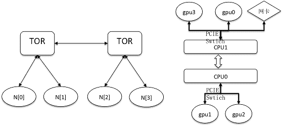

# 百度 2018 校招 AI 异构计算工程师笔试题（第一批）

## 1

以下关于多线程的叙述错误的是：

正确答案: C   你的答案: 空 (错误)

```cpp
线程同步的方法包括使用临界区，互斥量，信号量等
```

```cpp
两个线程同时对简单类型全局变量进行写操作也需要互斥
```

```cpp
实现可重入函数时，对自动变量也要用互斥量加以保护
```

```cpp
可重入函数不可以调用不可重入函数
```

本题知识点

算法工程师 百度 2018

## 2

关于多线程与多进程编程，下面描述正确的是：

正确答案: A C   你的答案: 空 (错误)

```cpp
多进程里，子进程可获得父进程的所有堆与栈的数据；而线程会与同进程的其他线程共享数据，拥有自己的栈空间
```

```cpp
线程因为有自己的独立栈空间且共享数据，所有执行的开销相对较大，同时不利于资源管理和保护
```

```cpp
线程使用公共变量/内存时需要使用同步机制，因为他们在同一地址空间内
```

```cpp
因多线程里，每个子进程有自己的地址空间，因此相互之间通信时，线程不如进程灵活和方便
```

本题知识点

算法工程师 百度 2018

讨论

[晨曦 201907242343692](https://www.nowcoder.com/profile/259735053)

线程和进程在使用上各有优缺点：线程执行开销小，但不利于资源管理和保护；而进程正相反。同时，线程适合于在 SMP 机器上运行，而进程则可以跨机器迁移。

      根本区别就一点：用多进程每个进程有自己的地址空间(address space)，线程则共享地址空间。所有其它区别都是由此而来的：
1、   速度：线程产生的速度快，线程间的通讯快、切换快等，因为他们在同一个地址空间内。
2、   资源利用率：线程的资源利用率比较好也是因为他们在同一个地址空间内。
3、   同步问题：线程使用公共变量/内存时需要使用同步机制还是因为他们在同一个地址空间内

发表于 2021-01-15 18:40:43

* * *

## 3

对静态成员的不正确描述是（）？

正确答案: D   你的答案: 空 (错误)

```cpp
静态数据成员要在类外定义和初始化
```

```cpp
非静态成员函数也可以操作静态数据成员
```

```cpp
静态成员不属于对象，是类的共享成员
```

```cpp
调用静态成员函数时要通过类或对象激活，所以静态成员函数拥有 this 指针
```

本题知识点

算法工程师 百度 2018

## 4

如下描述正确的是：

正确答案: B D   你的答案: 空 (错误)

```cpp
GPU 线程切换开销小于 CPU 线程切换开销的主要原因是，GPU 每一个线程都有独立的 PC 寄存器；
```

```cpp
GPU 的一个 block 内的线程，只能运行在一个 SM 或者 CU 中
```

```cpp
GPU 的 L1 cache 延迟和吞吐性能通常远高于 CPU L1 cache
```

```cpp
提高 GPU 显存访问性能的主要方式是： coalesced 和 alignment
```

本题知识点

算法工程师 百度 2018

## 5

以下关于栈的说法错误的是：

正确答案: B C D   你的答案: 空 (错误)

```cpp
在栈空的情况下，一定不能作出栈操作，否则产生溢出
```

```cpp
栈一定是顺序存储的线性结构
```

```cpp
空栈是所有元素都为 0 的栈
```

```cpp
一个栈的输入序列为：A,B,C,D，可以得到输出序列：C,A,B,D
```

本题知识点

算法工程师 百度 2018

讨论

[陈晓峥](https://www.nowcoder.com/profile/920801058)

栈是线性结构，但可以是顺序存储，也可以是链式存储。

发表于 2018-12-07 10:29:44

* * *

## 6

类 B 是类 A 的公有派生类，类 A 和类 B 中都定义了虚函数 func(),p 是一个指向类 A 对象的指针，则 p->A::func()将（）？

正确答案: C   你的答案: 空 (错误)

```cpp
调用类 B 中函数 func()
```

```cpp
即调用类 A 中函数，也调用类 B 中的函数
```

```cpp
调用类 A 中函数 func()
```

```cpp
根据 p 所指的对象类型而确定调用类 A 中或类 B 中的函数 func()
```

本题知识点

算法工程师 百度 2018 C++

讨论

[5011111111](https://www.nowcoder.com/profile/593628916)

经测试，即使 B 类型的指针指向 B 对象，使用了域限制符 A::，也会调用父类 A 的 fun 方法

发表于 2021-03-19 09:57:29

* * *

[牛客 191029289 号](https://www.nowcoder.com/profile/191029289)

按道理应该是调用指针所指向的对象的函数，但是本题有域解析符限定了调用 A 的函数

发表于 2020-10-29 10:26:10

* * *

[牛客 803944112 号](https://www.nowcoder.com/profile/803944112)

指针指向谁就调用谁

发表于 2020-09-21 12:43:25

* * *

## 7

全高清视频的分辨率为 1920×1080P，如果一张 RGB 真彩色像素的 1920×1080 BMP 数字格式图像，所需存储空间是（）

正确答案: C   你的答案: 空 (错误)

```cpp
1.98 MB
```

```cpp
2.96 MB
```

```cpp
5.93 MB
```

```cpp
7.91 MB
```

本题知识点

算法工程师 百度 2018

## 8

下面代码的输出是什么？（）

```cpp
#include <iostream>
using namespace std;

int main() {
    int a[2][5] = {{1,2,3,4,5},{6,7,8,9,10}};
    int *ptr = (int *) (&a + 1);
    cout << *(ptr - 2) << endl;
    return 0;
}
```

正确答案: D   你的答案: 空 (错误)

```cpp
3
```

```cpp
4
```

```cpp
8
```

```cpp
9
```

本题知识点

算法工程师 百度 2018 C++

讨论

[牛逼（牛客的哥哥）](https://www.nowcoder.com/profile/648054780)

a+1 才表示 数组首元素地址+1，即指到 6 的位置。而&a+1 的偏移量是整个数组的长度，指到了 10 后一位，所以从 10 后一位往前移动两个单位（-2）刚好就是 9 了。不信？ 上机试试&a+1 和 a+1 的区别

发表于 2020-11-19 20:53:39

* * *

[盛宴灬](https://www.nowcoder.com/profile/135015922)

如果是正常的*(a+1)那么指针就会指向 a[0][1]

但是 a 是把整个数组看作是整体，所以如果加 1 上去就变成 a 数组的后一个地址。

*(p-2)又回到了之前第一句话的情况

发表于 2020-09-30 20:21:42

* * *

[小萝卜头 007](https://www.nowcoder.com/profile/697863373)

指针指向&a+1，即数组后面的一个空间，地址减去 2，即指向倒数第二个数组元素！ 若我理解错了，请指正，共同学习

发表于 2020-08-24 15:01:06

* * *

## 9

输入图片大小为 200×200，依次经过一层卷积（kernel size 5×5，padding 1，stride 2），pooling（kernel size 3×3，padding 0，stride 1），又一层卷积（kernel size 3×3，padding 1，stride 1）之后，输出特征图大小为：

正确答案: C   你的答案: 空 (错误)

```cpp
95
```

```cpp
96
```

```cpp
97
```

```cpp
98
```

```cpp
99
```

```cpp
100
```

本题知识点

算法工程师 百度 2018

## 10

假设某计算机按字编址，Cache 有 4 个行， Cache 和主存之间交换的块大小为 1 个字。若 Cache 的内容初始为空，采用 2 路组相联映射方式和 LRU 替换算法，当访问的主存地址依次为 0， 4， 8， 2， 0， 6， 8， 6， 4， 8 时，命中 Cache 的次数是（ ）

正确答案: C   你的答案: 空 (错误)

```cpp
1
```

```cpp
2
```

```cpp
3
```

```cpp
4
```

本题知识点

算法工程师 百度 2018

讨论

[_AChaser](https://www.nowcoder.com/profile/319702277)

参考教材明确给出是唐朔飞老师的《计算机组成原理》，可是出题人偏偏用蒋本珊老师的《计算机组成原理》的中的分组方法来恶心人，我都傻了

发表于 2019-09-14 20:42:22

* * *

[尤离！](https://www.nowcoder.com/profile/1635586)

这是 408 2012 年的考研题，标准答案给的是 C 用主存 3 段地址的方法，答案是 A，参考唐朔飞老师的教材用主存地址 4 段地址的方法答案是 C

编辑于 2020-06-18 16:51:04

* * *

[〆、续写不尽的未来。](https://www.nowcoder.com/profile/937158850)

c

发表于 2020-03-29 17:17:38

* * *

## 11

请简述数据在 CPU 和 GPU 间传输与 GPU 计算的并行原理及注意点

你的答案

本题知识点

算法工程师 百度 2018

## 12

简述 linux 线程和进程的区别，并列出进程间通信的常用方式

你的答案

本题知识点

算法工程师 百度 2018

## 13

如下图，左边为不同节点（主机）的连接方式，右边为节点内系统结构，请设计一种通信策略，实现 4 个节点内全部 GPU 上数据的快速合并（每块 GPU 上数据是所有 GPU 上数据之和），并分析时间消耗（假设 PCIE 带宽为 B1，CPU 间 QPI 带宽为 B2，节点间网络带宽为 B3， 且 B3 > B1 > B2, GPU 上数据块大小为 M）

你的答案

本题知识点

算法工程师 百度 2018

## 14

【不可使用本地 IDE】链表旋转给出一个链表，将链表右端的 K 个节点（不包含 NULL）旋转到左侧。例如:1->2->3->4->5->NULL, K = 2,return 4->5->1->2->3->NULL./** * Definition for singly-linked list. * struct ListNode { *     int val; *     ListNode *next; *     ListNode(int x) : val(x), next(NULL) {} * }; */ ListNode *reverseBetween(ListNode *head, int m, int n) { }

你的答案

本题知识点

算法工程师 百度 2018

讨论

[我的上上签](https://www.nowcoder.com/profile/6132525)

```cpp
public ListNode rotateRight(ListNoe head, int k){
    if(head == null || head.next == null)
        return head;
    int count = 1;
    ListNode cur = head;
    while(cur.next != null){ //计算链表长度
        count++;
        cur = cur.next;
    }
    k = k % count;
    if(k == 0)
        return head;
    cur.next = head; // 将尾结点指向头结点
    ListNode node = new ListNode(-1);
    node.next = head;
    ListNode pre = node;
    for(int i = 0; i < count - k; i++){
        pre = pre.next;
    }
    cur = pre.next;
    pre.next = null;
    return cur;
} 
```

发表于 2018-09-08 09:55:12

* * *

## 15

【不可使用本地 IDE】字符串插入给出 3 个字符串 s1,s2,s3,判断 s3 是否是由 s1 和 s2 相互插入而成。举个例子：s1="adbcaa"s2="acabca"当 s3="adbacacabcaa", return true.当 s3="adbacacabacc", return false.bool isInterleave(string s1, string s2, string s3) { }

你的答案

本题知识点

算法工程师 百度 2018

## 16

【不可使用本地 IDE】请用 CUDA/opencl/pthread 多线程/openmp 等任意并行化方式实现快速排序算法

你的答案

本题知识点

算法工程师 百度 2018