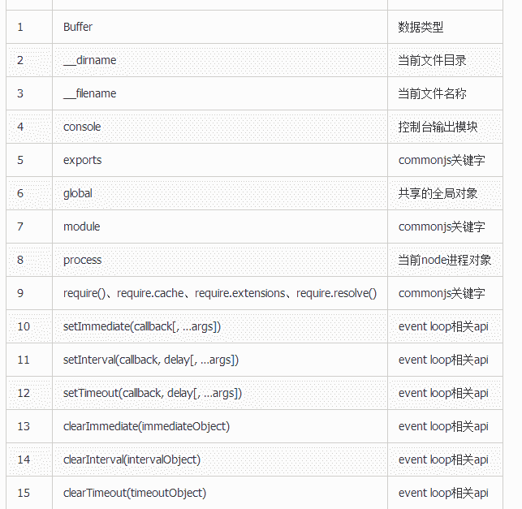

# 百度 2018 校招 Web 前端工程师笔试卷（第二批）

## 1

下面程序输出的结果:

```cpp
var userInfo = {
  userName: "love",
  getUserName: function() {
    return this.userName;
  }
};
var user = userInfo.getUserName;
console.log(userInfo.getUserName());
console.log(user());
```

正确答案: A   你的答案: 空 (错误)

```cpp
love,undefined
```

```cpp
undefined,undefined
```

```cpp
undefined, love
```

```cpp
love,love
```

本题知识点

百度 Java 工程师 C++工程师 iOS 工程师 安卓工程师 运维工程师 前端工程师 算法工程师 PHP 工程师 2018

讨论

[棱析析](https://www.nowcoder.com/profile/886157)

**this 的指向在函数定义的时候是确定不了的，只有函数执行的时候才能确定 this 到底指向谁，userInfo.getUserName()，userInfo 调用函数，this 指向该函数，所以返回'love',当 userInfo.getUserName 赋值给函数 user，再执行 user，this 指向 window，全局变量中没有 userName 的定义，因此返回 undefined** 

发表于 2018-08-02 09:06:15

* * *

## 2

HTML5 中可以用什么方法获取当前地址位置：

正确答案: A   你的答案: 空 (错误)

```cpp
getCurrentPosition()
```

```cpp
getLocation()
```

```cpp
getPosition()
```

```cpp
getCurrentLocation()
```

本题知识点

百度 Java 工程师 C++工程师 iOS 工程师 安卓工程师 运维工程师 前端工程师 算法工程师 PHP 工程师 前端工程师 百度 2018

讨论

[小野市](https://www.nowcoder.com/profile/9391147)

Geolocation 对象 - 其他有趣的方法
watchPosition() - 返回用户的当前位置，并继续返回用户移动时的更新位置（就像汽车上的 GPS）。
clearWatch() - 停止 watchPosition() 方法

发表于 2018-07-11 23:12:15

* * *

## 3

css3 中如何针对 Firefox 浏览器设置圆角半径

正确答案: B   你的答案: 空 (错误)

```cpp
border-radius
```

```cpp
-moz-border-radius
```

```cpp
-o-border-radius
```

```cpp
-webkit-border-radius
```

本题知识点

百度 Java 工程师 C++工程师 iOS 工程师 安卓工程师 运维工程师 前端工程师 算法工程师 PHP 工程师 2018 CSS

讨论

[咚咚呱](https://www.nowcoder.com/profile/735469384)

都马上 2021 年了，这个属性早就不用加浏览器前缀了，题库应该要更新更新啊

发表于 2020-11-02 14:43:07

* * *

[故事依旧](https://www.nowcoder.com/profile/5292340)

IE 9、Opera 10.5、Safari 5、Chrome 4 和 Firefox 4，都支持上述的 border-radius 属性。早期版本的 Safari 和 Chrome，支持-webkit-border-radius 属性，早期版本的 Firefox 支持-moz-border-radius 属性。 目前来看，为了保证兼容性，只需同时设置-moz-border-radius 和 border-radius 即可。 （注意：border-radius 必须放在最后声明，否则可能会失效。）

发表于 2018-07-07 23:07:51

* * *

## 4

能让所有 p 标签内的文字加粗的样式是？

正确答案: D   你的答案: 空 (错误)

```cpp
&lt;p style=&quot;text-size:bold&quot;&gt;
```

```cpp
&lt;p style=&quot;font-size:bold&quot;&gt;
```

```cpp
p {text-size:bold}
```

```cpp
p {font-weight:bold}
```

本题知识点

百度 Java 工程师 C++工程师 iOS 工程师 安卓工程师 运维工程师 前端工程师 算法工程师 PHP 工程师 2018

讨论

[棱析析](https://www.nowcoder.com/profile/886157)

font-weight 的值包括，normal，bold,lighter,bolder,以及数字(100~900)用来字体的粗细. 在 mdn 上面没有找到 text-size 这个属性,

发表于 2018-08-02 09:16:00

* * *

## 5

下面的代码输出的结果为:

```cpp
var foo = "11"+2-"1";
console.log(foo);
console.log(typeof foo);
```

正确答案: D   你的答案: 空 (错误)

```cpp
1121 string
```

```cpp
1121 number
```

```cpp
111 string
```

```cpp
111 number
```

本题知识点

百度 Java 工程师 C++工程师 iOS 工程师 安卓工程师 运维工程师 前端工程师 算法工程师 PHP 工程师 2018

讨论

[牛客 6791166 号](https://www.nowcoder.com/profile/6791166)

对于减法操作符（-），如果操作符中含有字符串，那么就要应用如下规则：

如果有一个操作符是字符串，布尔值，null 或者 undefined,则先在后台调用 Number（）函数将其转换为数值，然后再执行数和数字之间的减法运算。如果转换的结果为 NaN，那么得到的结果就是 NaN。

tips：Number（）函数的转换规则中：如果是 null 值，则返回 0；如果是 undefined,则返回 NaN.

所以，在上述例子中。“11”+2，执行的是将数字 2 转换成字符串再与“11”拼接，最后的结果为“112”，string 类型；“112”-“1”，分别将“112”和“1”转换成数字，相减，结果为 111，number 类型。

发表于 2018-09-04 14:56:50

* * *

## 6

下面的代码输出的结果为：

```cpp
Object.prototype.bar = 1;
var foo = {moo: 2};
for(var i in foo) {
    console.log(i);
}
```

正确答案: C   你的答案: 空 (错误)

```cpp
moo
```

```cpp
bar
```

```cpp
moo,bar
```

```cpp
moo,2
```

本题知识点

百度 Java 工程师 C++工程师 iOS 工程师 安卓工程师 运维工程师 前端工程师 算法工程师 PHP 工程师 2018

讨论

[YJFDQZ](https://www.nowcoder.com/profile/6579453)

for: 是编程式的 forEach: 不支持 return 是声明式的 for in :遍历的时候 key 会变成字符串类型，其中数组和私对象的属性也会被打印出来(因此 bar 也会被打印出来) for of:支持 return,并且是值为 of 数组（不能遍历对象）  现在数组遍历常用 for of                       想遍历对象的时候 Object.keys()  ,将对象的 key 作为新的数组

编辑于 2018-07-25 20:03:38

* * *

[包子是好包子](https://www.nowcoder.com/profile/9170153)

for in 循环遍历对象时，原型上的所有属性也会被访问在 for in 循环中使用 hasOwnProperty()可避免原型上的属性带来干扰

发表于 2018-08-31 21:10:14

* * *

## 7

下面程序输出的结果为:

```cpp
var apple = {
    iphone: function(){ return this.phoneVersion; },
    phoneVersion: 7
}
console.log(typeof (app = apple.iphone)());
```

正确答案: D   你的答案: 空 (错误)

```cpp
number
```

```cpp
int
```

```cpp
function
```

```cpp
undefined
```

本题知识点

百度 Java 工程师 C++工程师 iOS 工程师 安卓工程师 运维工程师 前端工程师 算法工程师 PHP 工程师 2018

讨论

[小野市](https://www.nowcoder.com/profile/9391147)

this 指向全局对象

发表于 2018-07-11 23:21:27

* * *

## 8

```cpp
function sub(a){
    return a - '010';
}
console.log(sub(020));
```

程序的输出结果为？

正确答案: B   你的答案: 空 (错误)

```cpp
10
```

```cpp
6
```

```cpp
010
```

```cpp
NaN
```

本题知识点

百度 Java 工程师 C++工程师 iOS 工程师 安卓工程师 运维工程师 前端工程师 算法工程师 PHP 工程师 2018

讨论

[故事依旧](https://www.nowcoder.com/profile/5292340)

首先将 020 通过八进制转换成 16，因为字符串不支持减号运算，这里会将"010"转换成数字 10

发表于 2018-07-07 23:16:35

* * *

## 9

下面程序输出的结果为:

```cpp
Object.prototype.execArr = function(){
var array=this;
  var n = {}, r = [], len = array.length, val, type;
    for (var i = 0; i < array.length; i++) {
        val = array[i];
        type = typeof val;
        if (!n[val]) {
            n[val] = [type];
            r.push(val);
        } else if (n[val].indexOf(type) < 0) {
            n[val].push(type);
            r.push(val);
        }
    }
    return r;
}
var obj=[1,5,4,4,5,6,7,3,3,2];
console.log(obj.execArr ());
```

正确答案: D   你的答案: 空 (错误)

```cpp
[1,5,4,4,5,6,7,3,3,2]
```

```cpp
[1,2,3,3,4,4,5,5,6,7]
```

```cpp
[1,2,3,4,5,6,7]
```

```cpp
[1,5,4,6,7,3,2]
```

本题知识点

百度 前端工程师

讨论

[牛客 502135950 号](https://www.nowcoder.com/profile/502135950)

这是 js 的题 扔 c++里做啥

发表于 2021-09-23 00:36:55

* * *

[刷题翼](https://www.nowcoder.com/profile/128640845)

else if 中的逻辑有什么用？

发表于 2019-04-02 16:30:27

* * *

[梁小炮囡泡泡泡泡](https://www.nowcoder.com/profile/8536054)

数组去重，但是这里用了两次同样实现去重效果的条件判断，不知用意为何？不会觉得重复了么

发表于 2018-08-07 16:18:02

* * *

## 10

下面哪个 JavaScript 库不支持 Promise 规范？

正确答案: A   你的答案: 空 (错误)

```cpp
underscore
```

```cpp
co
```

```cpp
bluebird
```

```cpp
Q(Q.js)
```

本题知识点

百度 Java 工程师 C++工程师 iOS 工程师 安卓工程师 运维工程师 前端工程师 算法工程师 PHP 工程师 2018

## 11

下面哪个选项可以产生 0<=num<=10 的随机整数

正确答案: C   你的答案: 空 (错误)

```cpp
Math.floor(Math.random()*6)
```

```cpp
Math.floor(Math.random()*10)
```

```cpp
Math.floor(Math.random()*11)
```

```cpp
Math.ceil(Math.random()*10)
```

本题知识点

百度 Java 工程师 C++工程师 iOS 工程师 安卓工程师 运维工程师 前端工程师 算法工程师 PHP 工程师 2018 浩鲸云 2020

讨论

[杯具杀手](https://www.nowcoder.com/profile/321639238)

C floor 函数参数范围为[0,11)

发表于 2021-10-27 18:48:06

* * *

[牛客 665705143 号](https://www.nowcoder.com/profile/665705143)

Math.random()方法返回指 0 到指定数之间的随机数,默认值为 1，Math.random()*4 返回 0 到 4 之间的随机数; 注意不是整数
Math.floor()方法返回一个整数，向下取值，例如：Math.floor(5.2232)，取值为 5;
Math.ceil()方法返回一个整数，向上取值，例如：Math.ceil(5.2232)，取值为 6;
 发表于 2022-01-13 15:17:14

* * *

[youngPeng](https://www.nowcoder.com/profile/226251611)

[0 1)

发表于 2018-12-18 11:08:42

* * *

## 12

分析下面的 JavaScript 代码段，输出结果是

```cpp
var mystring = "I am a student";
var a = mystring.substring(9,13);
console.log(a);  
```

正确答案: C   你的答案: 空 (错误)

```cpp
stud
```

```cpp
tuden
```

```cpp
uden
```

```cpp
udent
```

本题知识点

百度 Java 工程师 C++工程师 iOS 工程师 安卓工程师 运维工程师 前端工程师 算法工程师 PHP 工程师 2018

讨论

[youngPeng](https://www.nowcoder.com/profile/226251611)

[), 前闭后开， 计算机中规律

发表于 2018-12-18 11:10:34

* * *

[故事依旧](https://www.nowcoder.com/profile/5292340)

substring() 方法用于提取字符串中介于两个指定下标之间的字符。substring() 方法返回的子串包括 start 处的字符，但不包括 stop 处的字符。

发表于 2018-07-07 23:20:13

* * *

[少了蓝胖的大雄](https://www.nowcoder.com/profile/863421701)

c

发表于 2019-01-27 09:46:40

* * *

## 13

下列代码执行结果是

```cpp
function isOdd(num) { 
     return num % 2 == 1; 
}
function isEven(num) {
    return num % 2 == 0;
} 
function isSane(num) {
    return isEven(num) || isOdd(num);
}
var values = [7, 4, '13', -9, Infinity];
values.map(isSane);
```

正确答案: C   你的答案: 空 (错误)

```cpp
[true, true, true, true, true]
```

```cpp
[true, true, true, true, false]
```

```cpp
[true, true, true, false, false]
```

```cpp
[true, true, false, false, false]
```

本题知识点

百度 Java 工程师 C++工程师 iOS 工程师 安卓工程师 运维工程师 前端工程师 算法工程师 PHP 工程师 2018

讨论

[一 _ 又](https://www.nowcoder.com/profile/4910954)

-9%2 = -1 有正负号

发表于 2018-07-25 21:33:41

* * *

[牛客 944475055 号](https://www.nowcoder.com/profile/944475055)

function isSane(num){ return isEven(num)||isOdd(num); } 该函数判断 num 是否为正整数,7 与 4 都是正整数 满足为 true'13'被强制转换为数值 13,-9%2 结果为-1,Infinity %2 为 NaN.所以选 C

发表于 2021-07-28 11:19:35

* * *

## 14

以下不能用于判断字符串 str 是否符合正则 reg 的语句是

正确答案: D   你的答案: 空 (错误)

```cpp
!!reg.test(str)
```

```cpp
!!reg.exec(str)
```

```cpp
!!str.match(reg)
```

```cpp
!!str.contains(reg)
```

本题知识点

百度 Java 工程师 C++工程师 iOS 工程师 安卓工程师 运维工程师 前端工程师 算法工程师 PHP 工程师 2018

## 15

在 HTML5 中，下列 sessionStorage 保存数据的方法正确的是()

正确答案: A   你的答案: 空 (错误)

```cpp
sessionStorage.setItem(&quot;键名&quot;,&quot;键值&quot;);
```

```cpp
sessionStorage.saveItem(&quot;键名&quot;,&quot;键值&quot;);
```

```cpp
sessionStorage.saveItem(&quot;键值&quot;,&quot;键名&quot;);
```

```cpp
sessionStorage.setItem(&quot;键值&quot;,&quot;键名&quot;);
```

本题知识点

百度 Java 工程师 C++工程师 iOS 工程师 安卓工程师 运维工程师 前端工程师 算法工程师 PHP 工程师 2018

## 16

下面哪项可以仅仅把"百度"二字设置为白色（）

```cpp
<div class="menu">
    <ul>
        <li><a class="home" href="home.html">百度</a></li>
        <li><a href="about.html"></a>牛客</li>
    </ul>
</div>
```

正确答案: B   你的答案: 空 (错误)

```cpp
li a {color:#fff;}
```

```cpp
.menu .home {color:#fff;}
```

```cpp
.menu a {color:#fff;}
```

```cpp
div.menu li a {color:#fff;}
```

本题知识点

百度 Java 工程师 C++工程师 iOS 工程师 安卓工程师 运维工程师 前端工程师 算法工程师 PHP 工程师 2018

## 17

关于下面 HTML 代码，说法正确的是()

```cpp
<table border="10"> 
<tr><td colspan=2 align="center">公司</td></tr> 
<tr><td rowspan=2 align="center">名字</td><td align="center">百度</td></tr>
<tr><td colspan=2 align="center">百度</td></tr>
<table>
```

正确答案: C   你的答案: 空 (错误)

```cpp
该表格共有 2 行 3 列
```

```cpp
该表格的边框宽度为 10 毫米
```

```cpp
该表格中的文字均居中显示
```

```cpp
&quot;公司&quot;单元格跨 2 行
```

本题知识点

百度 Java 工程师 C++工程师 iOS 工程师 安卓工程师 运维工程师 前端工程师 算法工程师 PHP 工程师 2018

讨论

[小野市](https://www.nowcoder.com/profile/9391147)


发表于 2018-07-12 09:47:11

* * *

## 18

在 HTML 语言中，设置表格中文字与边框距离的标签是（）。

正确答案: C   你的答案: 空 (错误)

```cpp
&lt;table border=#&gt;
```

```cpp
&lt;table cellspacing=#&gt;
```

```cpp
&lt;table cellpadding=#&gt;
```

```cpp
&lt;table width=#&gt;
```

本题知识点

百度 Java 工程师 C++工程师 iOS 工程师 安卓工程师 运维工程师 前端工程师 算法工程师 PHP 工程师 2018

讨论

[QQ 群](https://www.nowcoder.com/profile/968354)

cellspacing：单元格的边框之间的距离 cellpadding：单元格的文字与其边框的距离

发表于 2018-07-22 15:00:03

* * *

## 19

在 Linux 系统下，下列哪个命令可以测试网络通不通?

正确答案: B   你的答案: 空 (错误)

```cpp
top
```

```cpp
ping
```

```cpp
ps
```

```cpp
traceroute
```

本题知识点

百度 Java 工程师 C++工程师 iOS 工程师 安卓工程师 运维工程师 前端工程师 算法工程师 PHP 工程师 前端工程师 百度 2018

讨论

[爱吃肉的小胖子](https://www.nowcoder.com/profile/8143626)

**top 命令**可以实时动态地查看系统的整体运行情况，是一个综合了多方信息监测系统性能和运行信息的实用工具。ps 为我们提供了进程的一次性的查看，它所提供的查看结果并不动态连续的；如果想对进程时间监控，应该用 top 工具。通过 traceroute 我们可以知道信息从你的计算机到互联网另一端的主机是走的什么路径。**ping 命令用来测试主机之间网络的连通性。**

编辑于 2018-07-31 16:30:26

* * *

[小野市](https://www.nowcoder.com/profile/9391147)

Linux top 命令用于实时显示 process 的动态。

Linux ps 命令用于显示当前进程 (process) 的状态。
Linux traceroute 命令用于显示数据包到主机间的路径。

Linux ping 命令用于检测主机。执行 ping 指令会使用 ICMP 传输协议，发出要求回应的信息，若远端主机的网络功能没有问题，就会回应该信息，因而得知该主机运作正常。

发表于 2018-07-12 09:45:02

* * *

## 20

在 Linux 系统中,有一个 shell 执行脚本为"a.sh"，在执行/a.sh fh nk tm 命令的过程中，变量$2 的值为()

正确答案: C   你的答案: 空 (错误)

```cpp
a.sh
```

```cpp
fh
```

```cpp
nk
```

```cpp
tm
```

本题知识点

百度 Java 工程师 C++工程师 iOS 工程师 安卓工程师 运维工程师 前端工程师 算法工程师 PHP 工程师 2018

讨论

[memset(x,0,sizeof(x))](https://www.nowcoder.com/profile/6948233)

执行/a.sh 脚本（注：需要更改文件权限值）fh nk tm 后面接的为传入脚本的参数，在脚本中$0 代表脚本名，依此往后$1,$2 对应传入脚本的参数。

编辑于 2020-07-10 16:03:06

* * *

## 21

DOM 操作中如何只判断两个节点是否有相同：

正确答案: B   你的答案: 空 (错误)

```cpp
element.hasChildNodes()
```

```cpp
element.isEqualNode()
```

```cpp
element.isSameNode()
```

```cpp
element.isSupported()
```

本题知识点

百度 Java 工程师 C++工程师 iOS 工程师 安卓工程师 运维工程师 前端工程师 算法工程师 PHP 工程师 2018

讨论

[小野市](https://www.nowcoder.com/profile/9391147)

DOM3 级引入了两个辅助比较节点的方法：isSameNode( )和 isEqualNode( )。
分别判断传入的节点与引用的节点是否相同和相等
isSameNode() 方法可在某个节点与给定的节点是同一个节点时返回 true，否则返回 false。
使用 isEqualNode() 方法指的是两个节点是否是同一类型，但不一定是相同的节点。

发表于 2018-07-12 09:40:07

* * *

## 22

以下哪项不是 Node.js 中的全局对象

正确答案: D   你的答案: 空 (错误)

```cpp
process
```

```cpp
console
```

```cpp
exports
```

```cpp
stream
```

本题知识点

百度 Java 工程师 C++工程师 iOS 工程师 安卓工程师 运维工程师 前端工程师 算法工程师 PHP 工程师 2018

讨论

[小野市](https://www.nowcoder.com/profile/9391147)



发表于 2018-07-12 09:34:04

* * *

## 23

在 Node.js 应用中，以下哪个语句可以正确获得 http 模块？

正确答案: A   你的答案: 空 (错误)

```cpp
var http = require('http')
```

```cpp
var http = import('http')
```

```cpp
var http = package('http')
```

```cpp
import http
```

本题知识点

百度 Java 工程师 C++工程师 iOS 工程师 安卓工程师 运维工程师 前端工程师 算法工程师 PHP 工程师 2018

## 24

下面关于 Hash 表说法正确的是()

正确答案: C   你的答案: 空 (错误)

```cpp
有冲突的情况下，无论怎样都可以在常数时间内找到特定记录
```

```cpp
所有记录必须存在内存中
```

```cpp
哈希函数的选择跟被查找字段有关系
```

```cpp
若关键字为 k，则其值存放在 f(k)的存储位置上，则不存在 k1≠k2，而 f(k1)=f(k2)
```

本题知识点

百度 Java 工程师 C++工程师 iOS 工程师 安卓工程师 运维工程师 前端工程师 算法工程师 PHP 工程师 2018

## 25

有台计算机使用选择排序对 400 个数字排序花了 400ms，如果花费 1600ms，大概能对多少个数字进行排序?

正确答案: B   你的答案: 空 (错误)

```cpp
1200
```

```cpp
800
```

```cpp
1600
```

```cpp
3200
```

```cpp
400
```

本题知识点

百度 Java 工程师 C++工程师 iOS 工程师 安卓工程师 运维工程师 前端工程师 算法工程师 PHP 工程师 2018

讨论

[小野市](https://www.nowcoder.com/profile/9391147)

sqrt(400) = 20 sqrt(1600) = 40

发表于 2018-07-12 09:27:10

* * *

[memset(x,0,sizeof(x))](https://www.nowcoder.com/profile/6948233)

选择排序时间复杂度为 O(n²)故 B 常见内排序方法：选排，    O(N²)        不稳定 插入，     O(N²)                   稳定 冒泡，     O(N²)                   稳定 堆排，      O(Nlog2N)                  不稳定 快排，      O(Nlog2N)                  不稳定 归并          O(Nlog2N)                  稳定 注：（排序算法的稳定性是指在排序过程中元素间的相对位置是否发生改变）

发表于 2018-08-09 21:24:55

* * *

## 26

将数组[18,17,14,16,15,12,13]用堆排序进行原地升序排序，那么在排序过程中，元素 14 的数组下标发生几次改变?

正确答案: C   你的答案: 空 (错误)

```cpp
0
```

```cpp
1
```

```cpp
2
```

```cpp
3
```

```cpp
4
```

本题知识点

百度 Java 工程师 C++工程师 iOS 工程师 安卓工程师 运维工程师 前端工程师 算法工程师 PHP 工程师 2018

讨论

[小野市](https://www.nowcoder.com/profile/9391147)

[`www.cnblogs.com/chengxiao/p/6129630.html`](https://www.cnblogs.com/chengxiao/p/6129630.html)a.将无需序列构建成一个堆，根据升序降序需求选择大顶堆或小顶堆;
b.将堆顶元素与末尾元素交换，将最大元素"沉"到数组末端;
c.重新调整结构，使其满足堆定义，然后继续交换堆顶元素与当前末尾元素，反复执行调整+交换步骤，直到整个序列有序。

编辑于 2018-07-12 09:23:08

* * *

## 27

使用冒泡排序为长度为 50 的数组升序排序，在最坏情况下，比较次数多少?

正确答案: C   你的答案: 空 (错误)

```cpp
150
```

```cpp
100
```

```cpp
1225
```

```cpp
2450
```

```cpp
2500
```

本题知识点

百度 Java 工程师 C++工程师 iOS 工程师 安卓工程师 运维工程师 前端工程师 算法工程师 PHP 工程师 2018

讨论

[小野市](https://www.nowcoder.com/profile/9391147)

(（n-1）*（n-1+1）)/2

发表于 2018-07-12 08:57:57

* * *

## 28

20 条边,10 个顶点的连通图，至少要去掉多少条边才能构成一棵树?

正确答案: C   你的答案: 空 (错误)

```cpp
9
```

```cpp
19
```

```cpp
11
```

```cpp
10
```

```cpp
12
```

本题知识点

百度 Java 工程师 C++工程师 iOS 工程师 安卓工程师 运维工程师 前端工程师 算法工程师 PHP 工程师 2018

讨论

[QQ 群](https://www.nowcoder.com/profile/968354)

树的特点：n 个节点的树，一定有 n-1 条边。所以，此题有 10 个节点，那肯定要有 9 条边。所以去掉 20-9=11 条边。

发表于 2018-07-22 14:38:28

* * *

[小野市](https://www.nowcoder.com/profile/9391147)

n 个顶点的树一定有 n-1 条边

发表于 2018-07-12 08:54:27

* * *

## 29

当一个栈的进栈序列为 1,2,3 时，进栈之后可以随时弹出，当弹出序列为 2,1,3 时，栈操作为?

正确答案: C   你的答案: 空 (错误)

```cpp
push,pop,push,pop,push,pop
```

```cpp
push,push,push,pop,pop,pop
```

```cpp
push,push,pop,pop,push,pop
```

```cpp
push,pop,push,push,pop,pop
```

```cpp
push,pop,push,pop,pop,push
```

本题知识点

百度 Java 工程师 C++工程师 iOS 工程师 安卓工程师 运维工程师 前端工程师 算法工程师 PHP 工程师 2018

讨论

[不要再给我发感谢信了](https://www.nowcoder.com/profile/856134108)

当弹出序列为 2,1,3 时，应该是：1，2 先栈，然后再出栈；最后 3 进栈，再出栈。

发表于 2019-01-21 19:45:40

* * *

## 30

HTTPS 协议通过什么实现安全访问？

正确答案: B   你的答案: 空 (错误)

```cpp
PGP
```

```cpp
SSL
```

```cpp
IPSEC
```

```cpp
SMTP
```

本题知识点

百度 Java 工程师 C++工程师 iOS 工程师 安卓工程师 运维工程师 前端工程师 算法工程师 PHP 工程师 前端工程师 百度 2018

讨论

[带着锋芒的善良](https://www.nowcoder.com/profile/7726799)

HTTPS 采用的是 TLS 协议+SSL 证书实现安全网站访问的。

发表于 2018-07-22 19:03:08

* * *

## 31

倒计时是 web 开发中常见的组件，请完成 second 和 render 两个函数，完成倒计时的显示部分
1、second 函数的输入为整数，返回{day: Int, hour: Int, min: Int, second: Int}
2、render 函数的输入为 second 函数的输出，将数据在页面对应的 DOM 元素上显示出来，格式如 html 所示
3、如果 day 为 0，隐藏对应的 DOM 元素，否则显示（请直接使用已经实现的 css 代码）
4、数值不足两位，前面补充 0

本题知识点

百度 Java 工程师 C++工程师 iOS 工程师 安卓工程师 运维工程师 前端工程师 算法工程师 PHP 工程师 模拟 2018

讨论

[杏仁儿](https://www.nowcoder.com/profile/902864561)

```cpp
function second(second) {
    var day = Math.floor(second / (3600 * 24));
    var hour = Math.floor((second % (3600 * 24)) / 3600);
    var min = Math.floor(((second % (3600 * 24)) % 3600) / 60);
    var second = Math.floor((((second % (3600 * 24)) % 3600) % 60) % 60);
    return { day, hour, min, second }
}

function render(data) {
    let oDiv = document.getElementById("jsCountdown");
    let aSpans = oDiv.children;

    if (data.day == 0) aSpans[0].setAttribute("class", "hide");
    else aSpans[0].innerHTML = `${data.day < 10 ? '0' + data.day : data.day}天`;
    aSpans[1].innerHTML = `${data.hour < 10 ? '0' + data.hour : data.hour}:`;
    aSpans[2].innerHTML = `${data.min < 10 ? '0' + data.min : data.min}:`;
    aSpans[3].innerHTML = `${data.second < 10 ? '0' + data.second : data.second}`;
}
```

发表于 2021-08-10 14:42:11

* * *

[东颌子大师](https://www.nowcoder.com/profile/853423243)

```cpp
 function second(second) {
        var Day = Math.floor(second/(3600*24));
        var Hour = Math.floor((second%(3600*24))/3600);
        var Min = Math.floor(((second%(3600*24))%3600)/60);
        var Sec = Math.floor((((second%(3600*24))%3600)%60)%60);
        return{day: Day,hour:Hour,min:Min,second:Sec}
    }

    function render(data) {
        clearTimeout(timer);
        if(data == 0){
            clearTimeout(timer);
            return;
        }
        var time= second(data);
        for(var item in time){
            if(time[item]<10){
                time[item] = "0"+time[item];
            }
        }
        var spans = document.getElementById("jsCountdown").getElementsByTagName("span");
        if(time.day == "00"){
            spans[0].className = "hide";
        }else{
            spans[0].className = "";
            spans[0].innerHTML = time.day + "天";
        }
        spans[1].innerHTML = time.hour + ":";
        spans[2].innerHTML = time.min + ":";
        spans[3].innerHTML = time.second;
        data = data - 1;
        var timer = setTimeout(function(){render(data)},1000);
    }
```

发表于 2018-10-07 20:56:24

* * *

[16 级老腊肉](https://www.nowcoder.com/profile/955823416)

function second(second) {
    let dateObj = { // 算时间当然得从最大的开始除，求余的都是捡上面吃剩的漏
        day: parseInt(second/60/60/24),
        hour: parseInt(second/60/60%24),
        min: parseInt(second/60%60),
        second: parseInt(second%60)
    };
    return dateObj;
}

function render(data) {
    let children = document.getElementById('jsCountdown').getElementsByTagName('span'); // 直接用 childNodes 是过不了的，它会把空的文本节点当成节点，比如换行
    if(data.day === 0){ // 如果 day 为 0，隐藏天数对应的 span，其余还是正常展示
        children[0].className = 'hide';
    } else {
        children[0].innerHTML = ('0' + data.day).slice(-2) + '天';
    }
    children[1].innerHTML = ('0' + data.hour).slice(-2) + ':';
    children[2].innerHTML = ('0' + data.min).slice(-2) + ':';
    children[3].innerHTML = ('0' + data.second).slice(-2);
}

发表于 2022-02-18 14:10:14

* * *

## 32

小度有一个小写字母组成的字符串 s.字符串 s 已经被写在墙上了.
小度还有很多卡片,每个卡片上有一个小写字母,组成一个字符串 t。小度可以选择字符串 t 中任意一个字符,然后覆盖在字符串 s 的一个字符之上。小度想知道在选取一些卡片覆盖 s 的一些字符之后,可以得到的字典序最大的字符串是什么。

本题知识点

百度 Java 工程师 C++工程师 iOS 工程师 安卓工程师 运维工程师 前端工程师 算法工程师 PHP 工程师 字符串 *排序 *模拟 2018** **讨论

[向宇回桌](https://www.nowcoder.com/profile/520872)

```cpp
import java.util.*;

public class Main {
    public static void main(String[] args) {
        Scanner sc = new Scanner(System.in);
        String s = sc.nextLine(),t = sc.nextLine();
        char[] cs = s.toCharArray();
        char[] ts = t.toCharArray();
        Arrays.sort(ts);
        int n = s.length(), tn = t.length();
        for (int i=0, j=tn-1; i<n && j>=0; i++) {
            if (cs[i] < ts[j]) {
                cs[i] = ts[j];
                j--;
            }
        }
        System.out.println(new String(cs));
    }
}

```

发表于 2019-04-01 16:47:52

* * *

[sakuuura](https://www.nowcoder.com/profile/967474985)

```cpp
var s1 = readline();
var s2 = readline();
var newS1 = s1.split('');
var newS2 = s2.split('');
newS2 = newS2.sort().reverse();
for(var i = 0,j=0;i<newS1.length&&j<newS2.length;i++){
    if(newS1[i]<newS2[j]){
        newS1.splice(i,1,newS2[j]);
        j++;
    }
}
print(newS1.join(''));
```

发表于 2019-09-01 21:28:47

* * *

[思唸](https://www.nowcoder.com/profile/5935448)

```cpp
#include <iostream>
using namespace std;
#include <string>
#include <algorithm>

int main()
{
    string s,t;
    cin >> s >> t;
    sort(t.begin(), t.end(), greater<char>());
    int pos = 0;
    for (int i=0; i<s.size(); i++)
    {
        //string 的底层最后一个字符是'\0'
        if (s[i] < t[pos])
        {
            s[i] = t[pos++];
        }
    }
    cout << s << endl;
}
```

编辑于 2018-08-22 11:18:09

* * *

## 33

前端两种主流跨域方案：JSONP 与 CORS。请问使用两种方案在 a.com 向 b.com 发起跨域请求时，b.com 的服务端能否解析到跨域请求携带的 cookie。

你的答案

本题知识点

百度 Java 工程师 C++工程师 iOS 工程师 安卓工程师 运维工程师 前端工程师 算法工程师 PHP 工程师 2018

## 34

请设计一个浏览器中能使用的 Promise 模块。包含：实现源码，使用 API，以及使用 Demo。

你的答案

本题知识点

百度 Java 工程师 C++工程师 iOS 工程师 安卓工程师 运维工程师 前端工程师 算法工程师 PHP 工程师 2018

讨论

[你把你 offer 给我交了](https://www.nowcoder.com/profile/7815107)

```cpp
// 定义三种状态、resolve 和 reject 方法、then 方法（onFulfilled、onRejected）
// 支持异步 resolve.

function myPromise(constructor) {
    this.status = "pending" //定义初始状态
    this.value = undefined;//存储成功后的值
    this.reason = undefined;//存储失败的原因

    // 成功存放的数组
    this.onResolvedCallbacks = [];
    // 失败存放法数组
    this.onRejectedCallbacks = [];

    let resolve = value => {
        if (this.status === "pending") {
            console.log(1)
            this.status = "resolved";
            this.value = value;
            // 一旦 resolve 执行，调用成功数组的函数
            this.onResolvedCallbacks.forEach(fn => fn());
            console.log(2)
        }
    }
    let reject = reason => {
        if (this.status === "pending") {
            this.status = "rejected";
            this.reason = reason;
            // 一旦 reject 执行，调用失败数组的函数
            this.onRejectedCallbacks.forEach(fn => fn());
        }
    }
    //捕获构造异常
    try {
        constructor(resolve, reject);
    } catch (e) {
        reject(e);
    }
}

myPromise.prototype.then = function (onFulfilled, onRejected) {
    // 状态为 fulfilled，执行 onFulfilled，传入成功的值
    if (this.status === 'resolved') {
        onFulfilled(this.value);
    };
    // 状态为 rejected，执行 onRejected，传入失败的原因
    if (this.status === 'rejected') {
        onRejected(this.reason);
    };
    // 当状态 status 为 pending 时
    if (this.status === 'pending') {
        // onFulfilled 传入到成功数组
        this.onResolvedCallbacks.push(() => {
            onFulfilled(this.value);
        })
        // onRejected 传入到失败数组
        this.onRejectedCallbacks.push(() => {
            onRejected(this.reason);
        })
    }
} 
```

发表于 2018-08-05 11:31:44

* * *

[LittleStoneys](https://www.nowcoder.com/profile/324218921)

原创 ES6 写法，支持大部分 API

```cpp
const Status = {
  PENDING: Symbol('pending'),
  FUFILLED: Symbol('fulfilled'),
  REJECTED: Symbol('rejected'),
}
class MyPromise {
  constructor(callback) {
    this.Status = Status.PENDING;
    this.value = null;
    this.array = [];
    try {
      callback(this.resolve.bind(this), this.reject.bind(this));
    } catch (error) {
      this.reject(error);
    }
  }
  resolve(value) {
    if (this.Status === Status.PENDING) {
      this.Status = Status.FUFILLED;
      this.value = value;
      setTimeout(() => {
        this.array.forEach(item => {
          item.onFulfilled(value);
        });
      });
    }
  }
  reject(reason) {
    if (this.Status === Status.PENDING) {
      this.Status = Status.REJECTED;
      this.value = reason;
      setTimeout(() => {
        this.array.forEach(item => {
          item.onRejected(reason);
        });
      });
    }
  }
  then(onFulfilled, onRejected) {
    if (typeof onFulfilled !== 'function') {
      onFulfilled = () => this.value
    }
    if (typeof onRejected !== 'function') {
      onRejected = (err) => { throw err }
    }

    const promise = new MyPromise((resolve, reject) => {
      if (this.Status === Status.PENDING) {
        this.array.push({
          onFulfilled: (value) => {
            const result = onFulfilled(value);
            resolve(result);
          },
          onRejected: (reason) => {
            const result = onRejected(reason);
            resolve(result);
          }
        });
      }
      if (this.Status === Status.FUFILLED) {
        setTimeout(() => {
          try {
            const result = onFulfilled(this.value);
            resolve(result);
          } catch (error) {
            reject(error);
          }
        });
      }
      if (this.Status === Status.REJECTED) {
        setTimeout(() => {
          try {
            const result = onRejected(this.value);
            resolve(result);
          } catch (error) {
            reject(error);
          }
        });
      }
    });
    return promise;
  }
  catch(onRejected) {
    return this.then(null, onRejected)
  }
  finally(callback) {
    const MyPromise = this.constructor;
    return this.then(
      value => MyPromise.resolve(callback()).then(() => value),
      reason => MyPromise.resolve(callback()).then(() => { throw reason })
    );
  }
  static resolve(promise) {
    return new MyPromise((resolve, reject) => {
      if (promise instanceof MyPromise) {
        promise.then(resolve);
      } else {
        resolve(promise);
      }
    });
  }
  static reject(promise) {
    return new MyPromise((resolve, reject) => {
      reject(promise);
    });
  }
  static all(promises) {
    const values = [];
    return new MyPromise((resolve, reject) => {
      promises.forEach(promise => {
        promise.then(value => {
          values.push(value);
          if (values.length === promises.length) {
            resolve(values);
          }
        }, reason => {
          reject(reason);
        });
      });
    });
  }
}
```

发表于 2020-09-03 15:29:20

* * *

[wubai🐳](https://www.nowcoder.com/profile/2165631)

```cpp
const isFunction = variable => typeof variable === "function";

const __ = new WeakMap();
function get(that, key) {
  try {
    return __.get(that)[key];
  } catch (e) {
    console.error(e);
    return undefined;
  }
}
function set(that, key, value) {
  const lastValue = __.get(that);
  const newValue = {
    ...lastValue,
    [key]: value
  };
  __.set(that, newValue);
}

const promiseStatus = Symbol("status");
const promiseValue = Symbol("value");
const fulfilledCallbackQueue = Symbol("fulfilledCallbackQueue");
const rejectedCallbackQueue = Symbol("rejectedCallbackQueue");

const PENDING = Symbol("pending");
const FULFILLED = Symbol("fulfilled");
const REJECTED = Symbol("rejected");

const resolve = Symbol("resolve");
const reject = Symbol("reject");

class MyPromise {
  constructor(fn) {
    if (!isFunction(fn)) {
      throw new Error("MyPromise must accept a function as a parameter");
    }
    set(this, promiseStatus, PENDING);
    set(this, promiseValue, undefined);
    set(this, fulfilledCallbackQueue, []);
    set(this, rejectedCallbackQueue, []);
    try {
      fn(this[resolve].bind(this), this[reject].bind(this));
    } catch (e) {
      thisreject;
    }
  }

  resolve {
    const run = () => {
      if (get(this, promiseStatus) !== PENDING) return;
      const runFulfilled = value => {
        let cb;
        while ((cb = get(this, fulfilledCallbackQueue).shift())) {
          cb(value);
        }
      };
      const runRejected = error => {
        let cb;
        while ((cb = get(this, rejectedCallbackQueue).shift())) {
          cb(error);
        }
      };
      if (val instanceof MyPromise) {
        val.then(
          value => {
            set(this, promiseValue, value);
            set(this, promiseStatus, FULFILLED);
            runFulfilled(value);
          },
          err => {
            set(this, promiseValue, err);
            set(this, promiseStatus, REJECTED);
            runRejected(err);
          }
        );
      } else {
        set(this, promiseValue, val);
        set(this, promiseStatus, FULFILLED);
        runFulfilled(val);
      }
    };
    setTimeout(run, 0);
  }
  reject {
    if (get(this, promiseStatus) !== PENDING) return;
    const run = () => {
      set(this, promiseStatus, REJECTED);
      set(this, promiseValue, err);
      let cb;
      while ((cb = get(this, rejectedCallbackQueue).shift())) {
        cb(err);
      }
    };
    setTimeout(run, 0);
  }

  then(onFulfilled, onRejected) {
    return new MyPromise((onFulfilledNext, onRejectedNext) => {
      const fulfilled = value => {
        try {
          if (!isFunction(onFulfilled)) {
            onFulfilledNext(value);
          } else {
            const res = onFulfilled(value);
            if (res instanceof MyPromise) {
              res.then(onFulfilledNext, onRejectedNext);
            } else {
              onFulfilledNext(res);
            }
          }
        } catch (err) {
          onRejectedNext(err);
        }
      };
      const rejected = error => {
        try {
          if (!isFunction(onRejected)) {
            onRejectedNext(error);
          } else {
            const res = onRejected(error);
            if (res instanceof MyPromise) {
              res.then(onFulfilledNext, onRejectedNext);
            } else {
              onFulfilledNext(res);
            }
          }
        } catch (err) {
          onRejectedNext(err);
        }
      };
      switch (get(this, promiseStatus)) {
        case PENDING:
          const newFulfilledCallbackQueue = [
            ...get(this, fulfilledCallbackQueue),
            fulfilled
          ];
          set(this, fulfilledCallbackQueue, newFulfilledCallbackQueue);
          const newRejectedCallbackQueue = [
            ...get(this, rejectedCallbackQueue),
            rejected
          ];
          set(this, rejectedCallbackQueue, newRejectedCallbackQueue);
          break;
        case FULFILLED:
          fulfilled(get(this, promiseValue));
          break;
        case REJECTED:
          rejected(get(this, promiseValue));
          break;
      }
    });
  }
} 
```

编辑于 2019-01-16 10:57:51

* * ***