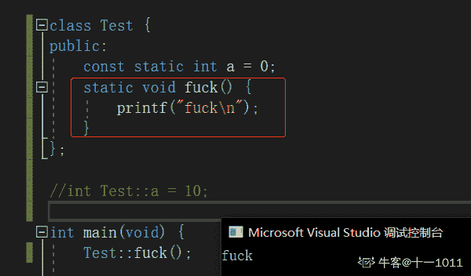
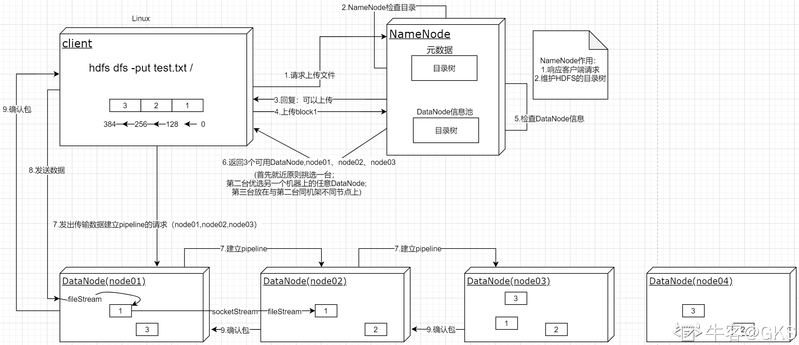
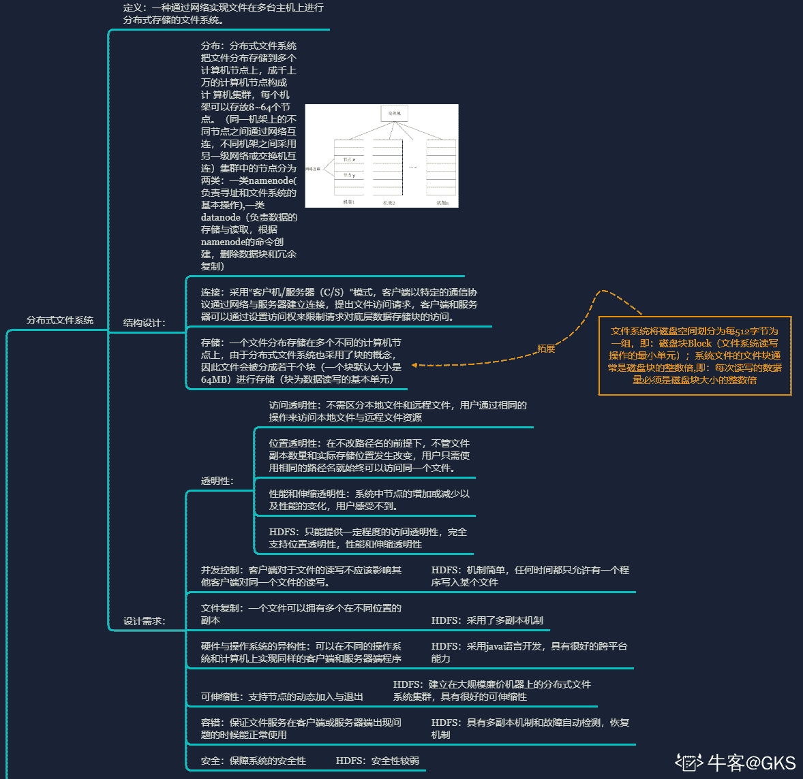
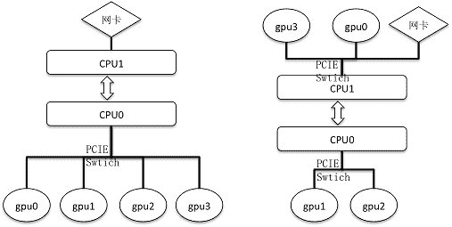

# 百度 2018 校招 AI 异构计算工程师笔试题(第二批）

## 1

关于多线程与多进程编程，下面描述错误的是：

正确答案: A B C   你的答案: 空 (错误)

```cpp
多进程里，子进程可获得父进程的部分堆与栈的数据；而线程会与同进程的其他线程共享数据，拥有自己的栈空间
```

```cpp
线程的通信速度更快，切换更快，因为他们在同一地址空间内
```

```cpp
线程使用公共变量/内存时不需要使用同步机制，因为他们在同一地址空间内
```

```cpp
因多线程里，每个子进程有自己的地址空间，因此相互之间通信时，线程不如进程灵活和方便
```

本题知识点

百度 Java 工程师 C++工程师 iOS 工程师 安卓工程师 运维工程师 前端工程师 算法工程师 PHP 工程师 2018

讨论

[享受人生 201806140911863](https://www.nowcoder.com/profile/427252116)

个人感觉答案是：ACDA.子进程可获得父进程的全部堆与栈的数据 C.需要同步，如互斥锁、读写锁 D.选项没有表述清楚

发表于 2018-10-15 13:52:18

* * *

## 2

对静态成员的正确描述是（）？

正确答案: B C   你的答案: 空 (错误)

```cpp
静态数据成员要在类外定义和初始化
```

```cpp
非静态成员函数也可以操作静态数据成员
```

```cpp
全局变量、静态全局变量和静态局部变量都存放在内存的静态存储区域，局部变量存放在内存的栈区
```

```cpp
调用静态成员函数时要通过类或对象激活，所以静态成员函数拥有 this 指针
```

本题知识点

百度 C++工程师 2018 C++

讨论

[黄俊尹](https://www.nowcoder.com/profile/262605718)

        必须得说一句，A 选项常量静态数据成员才能在类内定义，静态数据成员必须放在类外定义，否则初始化操作就需要构造函数来进行，而若是这样静态数据成员的生命周期就会和对象的生命周期部分绑定，这是不合理的。静态数据成员属于类而不属于对象，所以初始化必须放在类外。而 const static 数据成员因为是直接放到符号表中，编译时候就可以完成，以为读取也只是从符号表中读取而非内存，故而放在哪里初始化都可以。        结论就是 A 选项没错。

发表于 2021-11-11 14:32:08

* * *

[十一 1011](https://www.nowcoder.com/profile/195527855)

评论里说静态成员函数只能在类外定义是错的（至少在 VS 中是错的），看下图： 当静态成员变量为 const 时仅能在类中定义（因为 const 变量必须初始化）。

发表于 2021-06-09 10:39:15

* * *

[Despacito007](https://www.nowcoder.com/profile/893487814)

静态数据成员可在类内定义 答案 BC

发表于 2020-09-19 17:01:57

* * *

## 3

如下描述正确的是：

正确答案: B D   你的答案: 空 (错误)

```cpp
GPU 线程切换开销小于 CPU 线程切换开销的主要原因是，GPU 每一个线程都有独立的 PC 寄存器
```

```cpp
GPU 的一个 block 内的线程，只能运行在一个 SM 或者 CU 中
```

```cpp
GPU 的 L1 cache 延迟和吞吐性能通常远高于 CPU L1 cache
```

```cpp
提高 GPU 显存访问性能的主要方式是： coalesced 和 alignment
```

本题知识点

百度 Java 工程师 C++工程师 iOS 工程师 安卓工程师 运维工程师 前端工程师 算法工程师 PHP 工程师 2018

## 4

CPU 与外设的传输数据的方式是：

正确答案: A B C   你的答案: 空 (错误)

```cpp
程序方式
```

```cpp
中断
```

```cpp
DMA
```

```cpp
通道方式
```

```cpp
共享内存
```

本题知识点

百度 Java 工程师 C++工程师 iOS 工程师 安卓工程师 运维工程师 前端工程师 算法工程师 PHP 工程师 2018

## 5

某计算机的指令流水线由四个功能段组成，指令流经各功能段的时间（忽略各功能段之间的 缓存时间）分别是 90ns、80ns、70ns 和 60ns，则该计算机的 CPU 时钟周期至少是 ____。

正确答案: A   你的答案: 空 (错误)

```cpp
90ns
```

```cpp
80ns
```

```cpp
70ns
```

```cpp
60ns
```

```cpp
170ns
```

本题知识点

百度 Java 工程师 C++工程师 iOS 工程师 安卓工程师 运维工程师 前端工程师 算法工程师 PHP 工程师 2018

## 6

以下关于栈的说法错误的是：

正确答案: B C D   你的答案: 空 (错误)

```cpp
在栈空的情况下，一定不能作出栈操作，否则产生溢出
```

```cpp
栈一定是顺序存储的线性结构
```

```cpp
空栈是所有元素都为 0 的栈
```

```cpp
一个栈的输入序列为：A,B,C,D，可以得到输出序列：C,A,B,D
```

本题知识点

百度 Java 工程师 C++工程师 iOS 工程师 安卓工程师 运维工程师 前端工程师 算法工程师 PHP 工程师 2018

## 7

某 CPU 主频为 1.03 GHz，采用 4 级指令流水线，每个流水段的执行需要 1 个时钟周期。假定 CPU 执行了 100 条指令，在其执行过程中，没有发生任何流水线阻塞，此时流水线的吞吐率为（ ）

正确答案: C   你的答案: 空 (错误)

```cpp
0.25×109 条指令/秒
```

```cpp
0.97×109 条指令/秒
```

```cpp
1.0×109 条指令/秒
```

```cpp
1.03 ×109 条指令/秒
```

本题知识点

百度 Java 工程师 C++工程师 iOS 工程师 安卓工程师 运维工程师 前端工程师 算法工程师 PHP 工程师 2018

讨论

[mcdull201808261228200](https://www.nowcoder.com/profile/70716354)

一条指令的执行时间为 4t，100 条指令的执行时间为（100-1）t+4t 吞吐率为 100/（100-1）t+4t 代入可得 1.0*10⁹

发表于 2018-08-27 09:29:20

* * *

## 8

在 C++中，下列哪一个可以做为对象继承之间的安全转换（）

正确答案: B   你的答案: 空 (错误)

```cpp
static_cast
```

```cpp
dynamic_cast
```

```cpp
const_cast
```

```cpp
reinterpret_cast
```

本题知识点

百度 C++工程师 算法工程师 2018 C++

讨论

[666 的佩奇爸爸](https://www.nowcoder.com/profile/7670357)

```cpp

	答案：A、B。

	转换指的是通过改变一个变量的类型为别的类型从而改变该变量的表示方式。

	C++标准定义了四个新的转换符：reinterpret_cast、static_cast、dynamic_cast 和 const_cast，

	目的在于控制类（class）之间的类型转换。

	对于选项 A，static_cast 可以用于类层次结构中基类和子类之间指针或引用的转换。

	把子类的指针或引用转换成基类表示是安全的，但把基类指针或引用转换成子类指针或引用时，

	由于没有动态类型检查，所以，它是不安全的。

	基类和子类之间的动态类型转换一般建议使用 dynamic_cast。

	static_cast 可以用作对象继承之间转换，只不过有安全隐患。因此，选项 A 正确。

	对于选项 B，dynamic_cast 用于对象的指针和引用，当用于多态类型转换时，

	允许隐式转换及相反的转换操作，与 static_cast 的不同之处在于，在相反的转换过程中，

	dynamic_cast 会检测操作的有效性，如果返回的不是被请求的有效完整对象，则返回 null，

	反之返回这个有效的对象，如果是引用返回无效时，则会抛出 bad_cast 异常。所以，选项 B 正确。

	对于选项 C，const_cast 用来修改类型的 const 或 volatile 属性，具体而言，

	const_cast 会操纵传递对象的 const 属性，设置或者移除该属性。所以，选项 C 错误。

	对于选项 D，reinterpret_cast 用来处理无关类型之间的转换，可以转换任意一个 32 位整数，

	包括所有的指针和整数。可以把任何整数转成指针，也可以把任何指针转成整数，

	以及把指针转化为任意类型的指针，但不能将非 32 位的实例转成指针。所以，选项 D 错误。

	所以，本题的答案为 A、B。

```

发表于 2018-07-13 17:06:17

* * *

[MingGer](https://www.nowcoder.com/profile/210953088)

ABD

发表于 2021-03-24 19:58:10

* * *

[_Archer_](https://www.nowcoder.com/profile/87689217)

```cpp
int i = 0; // 原先是非 const
...

const int* i_const_ref = &i; // 因为某些原因（例如函数传参）变成了 const
// 假设这里我们无法访问变量 i，但我们又想修改 i 的值
i_const_ref = 1; // 编译报错，无法修改 const 量
int* ip = const_cast<int*>(i_const_ref); // 移除 const
*ip = 1; // 正确，i = *i_const_ref = *ip = 1
```

编辑于 2021-03-21 21:21:06

* * *

## 9

C 代码中可能会出现如下类型的结构体定义：

```cpp
  typedef struct holder {
  struct holder *next;
  struct holder *prev;
  char buffer[ 0 ];
  }holder;

```

最后一行 char data[ 0 ] 作用是？

正确答案: A B   你的答案: 空 (错误)

```cpp
方便管理内存缓冲区
```

```cpp
减少内存碎片化
```

```cpp
使结构体数据对齐
```

```cpp
没有作用
```

本题知识点

百度 Java 工程师 C++工程师 iOS 工程师 安卓工程师 运维工程师 前端工程师 算法工程师 PHP 工程师 2018 C 语言

讨论

[郑道鹏](https://www.nowcoder.com/profile/699027167)

下面是网络上一些关于柔性数组的知识
typedef struct{ 

char a; 
char b[0]; 
};

其中 char b[0]， 叫做柔性数据。

这是个广泛使用的常见技巧，常用来构成缓冲区。比起指针，用空数组有这样的优势：  
1.不需要初始化，数组名直接就是所在的偏移  
2.不占任何空间，指针需要占用 int 长度空间，空数组不占任何空间。  

“这个数组不占用任何内存”，意味着这样的结构节省空间；“该数组的内存地址就和他后面的元素的地址相同”，意味着无需初始化，数组名就是后面元素的地址，直接就能当做指针使用。 

发表于 2020-10-21 21:00:41

* * *

[牛客越学越牛](https://www.nowcoder.com/profile/86928299)

大小为 0 的这个数组叫做柔性数组

发表于 2020-10-08 00:21:54

* * *

## 10

定义析构函数时，应该注意：（ ）

正确答案: C   你的答案: 空 (错误)

```cpp
其名与类名完全相同
```

```cpp
返回类型是 void 类型
```

```cpp
无形参，也不可重载
```

```cpp
函数体中必须有 delete 语句
```

本题知识点

百度 Java 工程师 C++工程师 iOS 工程师 安卓工程师 运维工程师 前端工程师 算法工程师 PHP 工程师 2018 C++

讨论

[一碗一斤](https://www.nowcoder.com/profile/717701250)

析构函数和构造函数没有返回值，这与返回值为 void 的函数不同

发表于 2020-08-11 11:52:57

* * *

[月②弯弯](https://www.nowcoder.com/profile/852301687)

多选题，不多选不让交卷，多选给错

发表于 2022-01-26 21:02:30

* * *

[牛客 583341661 号](https://www.nowcoder.com/profile/583341661)

析构函数名有波浪号～

发表于 2021-04-13 10:33:22

* * *

## 11

请简要描述主流 GPU 存储层级，并说明各层级特点

你的答案

本题知识点

百度 Java 工程师 C++工程师 iOS 工程师 安卓工程师 运维工程师 前端工程师 算法工程师 PHP 工程师 2018

## 12

请简述 2~3 个导致 GPU 计算单元使用率不高的原因，并提出改进方式

你的答案

本题知识点

百度 Java 工程师 C++工程师 iOS 工程师 安卓工程师 运维工程师 前端工程师 算法工程师 PHP 工程师 2018

## 13

请描述一种你最熟悉的分布式文件系统的特性及工作流程（HDFS，NFS，AFS 等）

你的答案

本题知识点

百度 Java 工程师 C++工程师 iOS 工程师 安卓工程师 运维工程师 前端工程师 算法工程师 PHP 工程师 2018

讨论

[GKS](https://www.nowcoder.com/profile/769463753)



编辑于 2020-07-11 00:24:30

* * *

## 14

如下两种系统结构，请描述每种结构的优缺点，并给出在单机/多机两种情况下哪种结构性能更好，简述原因。

你的答案

本题知识点

百度 Java 工程师 C++工程师 iOS 工程师 安卓工程师 运维工程师 前端工程师 算法工程师 PHP 工程师 2018

## 15

实现 String 类的以下函数

```cpp
class String 
{ 
public: 
 String(const char *str = NULL);  // 普通构造函数 
 String(const String &other);     // 拷贝构造函数 
 ~ String(void);                // 析构函数 
   String & operate =(const String &other);  // 赋值函数 
private: 
char   *m_data;  
};

```

（注：不能使用本地 IDE）

你的答案

本题知识点

百度 Java 工程师 C++工程师 iOS 工程师 安卓工程师 运维工程师 前端工程师 算法工程师 PHP 工程师 2018

## 16

文件中有一组整数，要求排序后输出到另一个文件中。请完整写出其过程（文件操作，排序等重点过程，c/c++不限）。（注：不能使用本地 IDE）

你的答案

本题知识点

百度 Java 工程师 C++工程师 iOS 工程师 安卓工程师 运维工程师 前端工程师 算法工程师 PHP 工程师 2018

## 17

请使用 CUDA 编写一个数组求和的函数。要求输入为数组首地址及数组长度，输出数组所有元素之和。（注：不能使用本地 IDE）

你的答案

本题知识点

百度 Java 工程师 C++工程师 iOS 工程师 安卓工程师 运维工程师 前端工程师 算法工程师 PHP 工程师 2018

讨论

[cuteant](https://www.nowcoder.com/profile/825180001)

```cpp

            发表于 2018-09-06 20:26:03

```