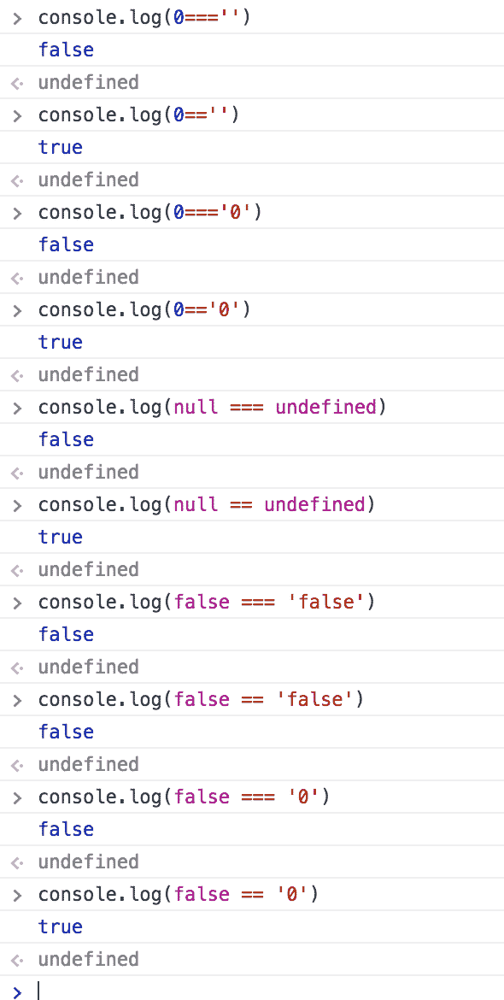
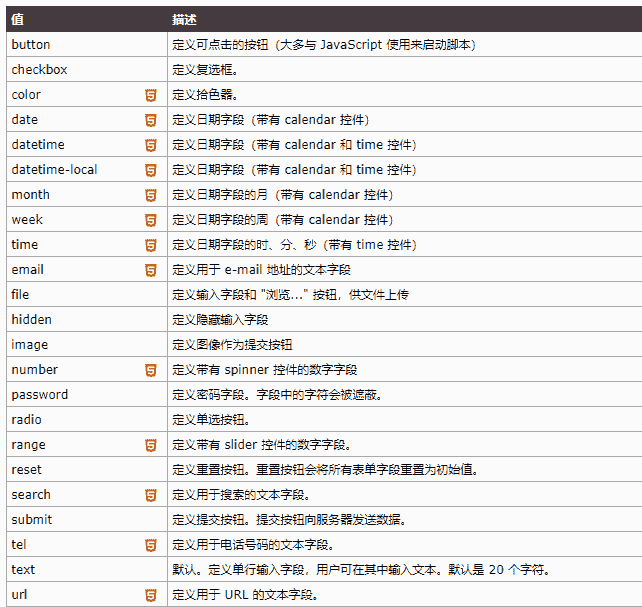
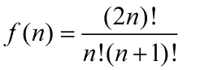
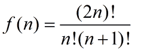
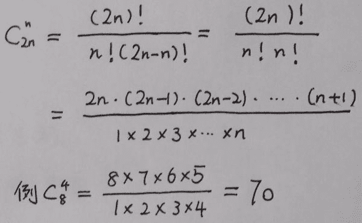
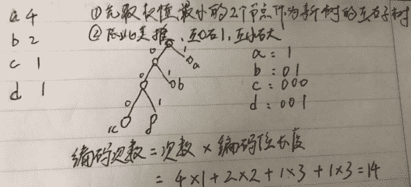
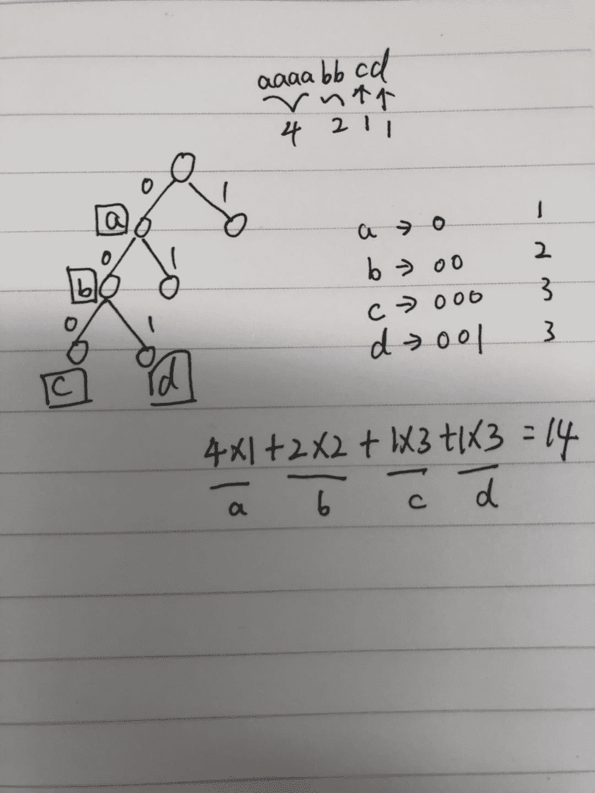

# 百度 2018 校招 Web 前端工程师笔试卷（第三批）

## 1

下面程序输出的结果为:

```cpp
function add(m){
    return function b(n){
        return n+m++
    }
}
var add1 = add(070);
var add2 = add(050);
console.log(add1(010));
console.log(add2(010));
```

正确答案: A   你的答案: 空 (错误)

```cpp
64,48
```

```cpp
80,60
```

```cpp
65,49
```

```cpp
81,61
```

本题知识点

百度 Java 工程师 C++工程师 iOS 工程师 安卓工程师 运维工程师 前端工程师 算法工程师 PHP 工程师 前端工程师 百度 2018 前端工程师 百度 2018

讨论

[越过山丘的小兔子](https://www.nowcoder.com/profile/4085958)

```cpp
js 将 0 开头的数默认为 8 进制的数(我也忘了这茬，ai)
(70).toString(8) = 56
(50).toString(8) = 40
(010).toString(8) = 8
56+40    40 + 8 
```

发表于 2018-08-20 12:10:57

* * *

[九月初十月底](https://www.nowcoder.com/profile/5438780)

这里主要解决了 n+m++的运算疑惑：先进行 n+m,之后 m++验证：

```cpp
function add(m){
    return function b(n){
       console.log("m=",m); console.log("n=",n); 
       var sum=n+m++; 
       console.log("n+m=",sum);  console.log("m=",m);
       return sum;
    }
}
var add1 = add(070);
console.log(add1(010));
VM656:3 m= 56
VM656:3 n= 8
VM656:3 n+m= 64
VM656:3 m= 57
VM656:8 64

```

发表于 2018-07-21 23:54:19

* * *

[33445](https://www.nowcoder.com/profile/6636329)

八进制（070）=十进制（56）八进制（010）=十进制（8）
56+8=64 八进制（050）=十进制（40）
40+8=48

发表于 2018-07-16 17:39:42

* * *

## 2

使用 Ajax 时首先需要创建什么对象：

正确答案: A   你的答案: 空 (错误)

```cpp
XMLHttpRequest
```

```cpp
Ajax
```

```cpp
XMLRequest
```

```cpp
HttpRequest
```

本题知识点

百度 Java 工程师 C++工程师 iOS 工程师 安卓工程师 运维工程师 前端工程师 算法工程师 PHP 工程师 2018

讨论

[小野市](https://www.nowcoder.com/profile/9391147)

Ajax 是无需刷新页面就能够从服务器取得数据的一种方法。关于 Ajax，可以从以下几方面来总结一下。  负责 Ajax 运作的核心对象是 XMLHttpRequest（ XHR）对象。  XHR 对象由微软最早在 IE5 中引入，用于通过 JavaScript 从服务器取得 XML 数据。  在此之后， Firefox、 Safari、 Chrome 和 Opera 都实现了相同的特性，使 XHR 成为了 Web 的一个事实标准。  虽然实现之间存在差异，但 XHR 对象的基本用法在不同浏览器间还是相对规范的，因此可以放心地用在 Web 开发当中。
同源策略是对 XHR 的一个主要约束，它为通信设置了“相同的域、相同的端口、相同的协议”这一
限制。

发表于 2018-07-11 16:33:31

* * *

## 3

设散列表长度为 m，散列函数为 H（key）=key%p，为了减少发生冲突的可能性，p 应取（　　）

正确答案: B   你的答案: 空 (错误)

```cpp
小于 m 的最大奇数
```

```cpp
小于 m 的最大素数
```

```cpp
小于 m 的最大偶数
```

```cpp
小于 m 的最大合数
```

本题知识点

百度 Java 工程师 C++工程师 iOS 工程师 安卓工程师 运维工程师 前端工程师 算法工程师 PHP 工程师 2018

讨论

[一起的远方](https://www.nowcoder.com/profile/549823951)

建立散列函数的一种方法：除留余数法，其中 p 一般取为素数

发表于 2019-04-02 15:39:31

* * *

[小坏 tt 诺言](https://www.nowcoder.com/profile/6041593)

可以看看除留余数法

发表于 2018-09-11 14:27:42

* * *

[小野市](https://www.nowcoder.com/profile/9391147)

p 为小于等于 m 的最大素数

发表于 2018-07-11 17:16:25

* * *

## 4

下面的代码输出结果为：

```cpp
var foo = 1;
function baidu(){
    console.log(foo);
    var foo = 2;
    console.log(foo);
}
baidu();
```

正确答案: A   你的答案: 空 (错误)

```cpp
undefined 2
```

```cpp
undefined undefined
```

```cpp
1 2
```

```cpp
2 2
```

本题知识点

百度 Java 工程师 C++工程师 iOS 工程师 安卓工程师 运维工程师 前端工程师 算法工程师 PHP 工程师 2018

讨论

[33445](https://www.nowcoder.com/profile/6636329)

”JavaScript 中，函数及变量的声明都将被提升到函数的最顶部”，注意，“只有声明的变量会提升，初始化的值却不会。”则：function baidu(){    console.log(foo);    var foo = 2;    console.log(foo);}相当于 function baidu(){     var foo;  //提升到函数最顶部
     console.log(foo);  //输出未定义     foo =2;      console.log(foo); //输出 2} 

发表于 2018-07-17 09:07:06

* * *

[Tency](https://www.nowcoder.com/profile/4538145)

考察知识点是变量提升，[`www.runoob.com/js/js-hoisting.html`](http://www.runoob.com/js/js-hoisting.html)在函数里面定义了 var foo =2;函数内部发生变量提升；函数内部的变量提升是提升到函数头部，所以在函数的最顶端有 var foo = undefined;执行第一个 console.log(foo)的时候，是 undefined，执行 console.log(foo)的时候已经给 foo 赋值了，所以是 2，函数执行时变量先从函数内部找，找不到才会继续向父元素寻找；例如：var foo1=3;function f1(){console.log(foo1)};f1()//3

发表于 2018-07-11 10:40:34

* * *

[.com201808291549793](https://www.nowcoder.com/profile/79358949)

var foo = 1;function baidu(){    console.log(foo);    var foo = 2;    console.log(foo);}baidu();上面说了，容易误解这么说吧。”JavaScript 中，函数及变量的声明都将被提升到函数的最顶部”，注意，“只有声明的变量会提升，初始化的值却不会。”则：var fff = 1;function baidu(){    console.log(foo);    var foo = 2;    console.log(foo);}baidu();相当于 var fff = 1;function baidu(){    var foo;
    console.log(foo);    foo = 2;    console.log(foo);}baidu();

发表于 2019-03-30 16:17:28

* * *

## 5

下面的代码输出的结果为：

```cpp
var baidu = {
    count: 2,
    getBaiduCount: function() {
        return this.count;
    }
}; 
console.log(baidu.getBaiduCount());
var func = baidu.getBaiduCount;
console.log(func());
```

正确答案: B   你的答案: 空 (错误)

```cpp
2,2
```

```cpp
2,undefined
```

```cpp
undefined,undefined
```

```cpp
undefined,2
```

本题知识点

百度 Java 工程师 C++工程师 iOS 工程师 安卓工程师 运维工程师 前端工程师 算法工程师 PHP 工程师 前端工程师 百度 2018 前端工程师 百度 2018

讨论

[既往不恋，纵情向前](https://www.nowcoder.com/profile/990019487)

this 指向的是最后调用他的对象，第一次 this 指向的是 baidu，所以 count 为 2，但是当 var func 的时候 this 指向了 window，而又不存在全局的 count，所以是 undefined

发表于 2018-08-24 19:41:03

* * *

[奋斗的王者](https://www.nowcoder.com/profile/6996994)

console.log(baidu.getBaiduCount());调用 baidu 函数中的方法 getBaiduCount()，以函数形式调用，this 值 window。varfunc = baidu.getBaiduCount;console.log(func());是一个函数表达式，直接调用 getBaiduCount 方法，该方法与 count 属性是并列关系而不是包含关系，即 getBaiduCount()中不包含 count,所以结果为 undefined; 

发表于 2018-07-17 17:33:26

* * *

[vin2000](https://www.nowcoder.com/profile/823164620)

this 指向调用函数的对象，直接写 baidu.getBaiduCount()，baidu 调用函数，所以第一次 this 指向的是 baidu，count 为 2；

但是第二次并没有用对象去调用 func()，所以 this 指向了 window，而又不存在全局的 count，所以是 undefined

发表于 2021-04-17 21:31:59

* * *

## 6

下面的代码输出的结果为：

```cpp
var n=(2).toString()
console.log(typeof(n));
```

正确答案: B   你的答案: 空 (错误)

```cpp
number
```

```cpp
string
```

```cpp
object
```

```cpp
出错
```

本题知识点

百度 Java 工程师 C++工程师 iOS 工程师 安卓工程师 运维工程师 前端工程师 算法工程师 PHP 工程师 前端工程师 百度 2018 前端工程师 百度 2018

讨论

[kingscc](https://www.nowcoder.com/profile/717122239)

var n=2.toString();     console.log(typeof(n))

发表于 2021-10-28 16:54:16

* * *

[切图仔啊](https://www.nowcoder.com/profile/901924811)

我想多了。我以为 2 是原始值，要通过包装类才能调用 toString()方法，所以 typeof n 是 object。。

发表于 2019-04-09 17:33:35

* * *

[小野市](https://www.nowcoder.com/profile/9391147)

typeof 操作符使用方法 typeof operand
or
typeof (operand)

发表于 2018-07-11 17:24:25

* * *

## 7

下面的代码输出的结果为:

```cpp
console.log(0==="");
console.log(0==="0");
console.log(null===undefined);
console.log(false==="false");
console.log(false==="0");
```

正确答案: B   你的答案: 空 (错误)

```cpp
true true true true true
```

```cpp
false false false false false
```

```cpp
true true true false true
```

```cpp
false  false  true false true
```

本题知识点

百度 Java 工程师 C++工程师 iOS 工程师 安卓工程师 运维工程师 前端工程师 算法工程师 PHP 工程师 2018

讨论

[Tency](https://www.nowcoder.com/profile/4538145)

===对类型和值都要求一致，但是==就不同了，不同类型的也可以 console.log(0=="")//true
console.log(0=="0")//trueconsole.log(null==undefined)//true
console.log(false=="false")//false
console.log(false=="0")//true

发表于 2018-07-11 10:49:59

* * *

[last.](https://www.nowcoder.com/profile/8883921)



发表于 2018-07-15 18:04:14

* * *

## 8

下面代码输出的结果为:

```cpp
function Foo() {
    var i = 0;
    return function() {
        console.log(i++);
    }
}
var f1 = Foo(),
f2 = Foo();
f1();
f1();
f2();
```

正确答案: A   你的答案: 空 (错误)

```cpp
0 1 0
```

```cpp
0 1 2
```

```cpp
0 0 0
```

```cpp
0 0 2
```

本题知识点

百度 Java 工程师 C++工程师 iOS 工程师 安卓工程师 运维工程师 前端工程师 算法工程师 PHP 工程师 2018

讨论

[九月初十月底](https://www.nowcoder.com/profile/5438780)

```cpp

	    returnfunction() {

	        console.log(i++);

	    }

	闭包的用途：1、访问外部函数的变量。2、使外部函数被引用的变量一直保存在内存中。

	这是一个闭包，闭包可以通过作用域链向上访问外层函数的变量和函数，同时闭包的作用域链上引用了外部函数的活动对象。

	所以当 f1();函数调用结束后，按道理来讲，这里的变量应该被回收，内存应该被释放，但由于外层函数的活动对象被子作用域链引用，

	一直保存在内存中，输出结果为 0，之后 i++ 变为 1，当再次调用 f1()时，存在于内存中的变量 i=1，打印输出，不过变量 i 还一直存在，除非手动设置为 i=null;

```

发表于 2018-07-22 00:10:48

* * *

[John 李](https://www.nowcoder.com/profile/95510708)

闭包中的局部变量的值会一直保存在同一个引用下。 所以第一次 f1 调用输出 i 为 0，后 i++。第二次调用 f1 时 i=1 所以输出 1。

发表于 2018-07-17 10:26:22

* * *

[菜鸡逆袭记](https://www.nowcoder.com/profile/152441068)

 1.i++返回的是自增之前的值,++i 返回的则是自增后的值。
2.Foo()返回了一个匿名函数，创建了一个局部变量 i=0,在执行 f1 和 f2 时,会分别获取。

发表于 2020-09-23 19:16:48

* * *

## 9

下面代码输出的结果为?

```cpp
var func = function(m, n) {
    arguments[0] = 3;
    arguments[1] = 2;
    return m + n;
}
console.log(func(1, 1));
```

正确答案: B   你的答案: 空 (错误)

```cpp
2
```

```cpp
5
```

```cpp
编译报错,arguments 数组未定义
```

```cpp
7
```

本题知识点

百度 Java 工程师 C++工程师 iOS 工程师 安卓工程师 运维工程师 前端工程师 算法工程师 PHP 工程师 2018

讨论

[既往不恋，纵情向前](https://www.nowcoder.com/profile/990019487)

arguments 表示的就是传进来的参数，在函数里面为 arguments 赋值的情况下外面传进来的参数起不到任何作用，无论如何结果都为 5

发表于 2018-08-24 19:45:30

* * *

[九月初十月底](https://www.nowcoder.com/profile/5438780)

```cpp

	varfunc = function(m, n) {

	arguments[0] = m;  //存放传进来第一个参数，也即是 m,这里是个变量形参

	arguments[1] = n;  //存放传进来第二个参数，也即是 n,这里是个变量形参 

	returnm + n;

	}

	console.log(func(1, 1)); //2

		varfunc = function(m, n) {

		arguments[0] = 3; //这里的

		arguments[1] = 2;

		returnm + n;  //return  arguments[0] + arguments[1] ,这里的值已经被赋予了实参 3，实参 2，被钳制住了，所以无论再传什么都无效 

		}

		console.log(func(1, 1));//5

```

编辑于 2018-07-22 00:28:56

* * *

[奋斗的王者](https://www.nowcoder.com/profile/6996994)

无论 func(m, n)的参数为多少，上述结果均为 5。

发表于 2018-07-17 21:18:53

* * *

## 10

下面程序输出的结果为:

```cpp
var res=typeof(null);
if(res==="object")
{
    res=0;
}
else if(res==="Object")
{
    res=1;
}
else
{
    res=2;
}
console.log(res);
```

正确答案: A   你的答案: 空 (错误)

```cpp
0
```

```cpp
1
```

```cpp
2
```

```cpp
error
```

本题知识点

百度 Java 工程师 C++工程师 iOS 工程师 安卓工程师 运维工程师 前端工程师 算法工程师 PHP 工程师 2018

讨论

[一 _ 又](https://www.nowcoder.com/profile/4910954)

object 必须全部小写

发表于 2018-07-09 20:23:44

* * *

[kobehhhhh](https://www.nowcoder.com/profile/6756252)

typeof 的结果是一个字符串类型

发表于 2018-08-27 01:38:55

* * *

[安如水](https://www.nowcoder.com/profile/788092848)

typeof 可以返回六种类型“string”，“number”，‘object”，“undefined”，“boolean”，“function”（注意全是小写）>>>>>>>>>>>>>>但是这六个返回的值都是字符串！！！

编辑于 2019-05-20 13:34:14

* * *

## 11

下面程序输出的结果为:

```cpp
function add(a){ 
     return a + '010';
}
console.log(add(020));
```

正确答案: A   你的答案: 空 (错误)

```cpp
16010
```

```cpp
020010
```

```cpp
2010
```

```cpp
30
```

本题知识点

百度 Java 工程师 C++工程师 iOS 工程师 安卓工程师 运维工程师 前端工程师 算法工程师 PHP 工程师 2018

讨论

[明天你好 iew](https://www.nowcoder.com/profile/9554450)

注意两点：1、此处的“+”为字符串连接符 2、020 是八进制，对应的十进制数字是 16.

发表于 2018-07-15 08:36:55

* * *

[一 _ 又](https://www.nowcoder.com/profile/4910954)

020 为 8 进制

发表于 2018-07-09 20:26:06

* * *

[DOUBLEMINT€](https://www.nowcoder.com/profile/782876552)

020 这是 8 进制的 16 啊

发表于 2019-04-01 09:00:06

* * *

## 12

假如有一个无向图 G=(V,E)中有 8 个顶点，那么当有 N 条边时，我无论怎么用这 N 条边来连接这 8 个顶点，都会使图 G 是连通的，那么 N 最小是多少?

正确答案: C   你的答案: 空 (错误)

```cpp
7
```

```cpp
21
```

```cpp
22
```

```cpp
42
```

本题知识点

百度 Java 工程师 C++工程师 iOS 工程师 安卓工程师 运维工程师 前端工程师 算法工程师 PHP 工程师 2018

讨论

[小野市](https://www.nowcoder.com/profile/9391147)

方法：任何情况下都是连通的，考虑极端情况，即图 G 的 7 个顶点构成完全无向图，再加上一条边链接该无向图和剩余那个顶点即构成了一个连通图。因此，最少边数 = 7 × 6 / 2 + 1 = 22。 

发表于 2018-07-11 20:19:20

* * *

[安如水](https://www.nowcoder.com/profile/788092848)

无方向时设边的条数为 e：e 的条数为 0~N(N-1)/2 全连通时边数为 N(N-1)/2 这是最大的情况，最小的全连通情况为小野式的方法，done

发表于 2019-05-20 15:17:06

* * *

## 13

result = str.replace(/^\s+|\s+$/, '')，以下 str 和 result 能匹配的是

正确答案: C   你的答案: 空 (错误)

```cpp
str = ' a b c ', result = 'a b c'
```

```cpp
str = ' a b c ', result = 'abc'
```

```cpp
str = ' a b c ', result = 'a b c '
```

```cpp
str = ' a b c ', result = ' a b c'
```

本题知识点

百度 Java 工程师 C++工程师 iOS 工程师 安卓工程师 运维工程师 前端工程师 算法工程师 PHP 工程师 2018

讨论

[是函数不是方法](https://www.nowcoder.com/profile/7255829)

如果要选 a，需要加上/…/g , 表示全文匹配, 而不是找到一个就停止。

发表于 2018-07-10 09:23:54

* * *

[九月初十月底](https://www.nowcoder.com/profile/5438780)

var str = ' a b c ';str.replace(/^\s+|\s+$/, '');
"a b c "
var str = ' a b c ';str.replace(/^\s+|\s+$/g, '');
"a b c"\s： space， 空格
+： 一个或多个
^： 开始，^\s，以空格开始
$： 结束，\s$，以空格结束
|：或者
/g：global， 全局
replace() 替换
整体为如果是以一个或多个空格开始，替换全部空格为空，或者，如果是以一个或多个空格结束，替换全部空格为空。
var cookie = "　　this is a cookie value　　　　　";
cookie = cookie.replace(/^\s+|\s+$/g, '');
结果为 cookie 变成 "this is a cookie value"。前后空格全部去掉了。
而不加全局变量，那么只要匹配到就会进行替换之后停止。

发表于 2018-07-22 00:39:18

* * *

[小野市](https://www.nowcoder.com/profile/9391147)

\s 匹配任何空白字符，包括空格、制表符、换页符等等。等价于 [ \f\n\r\t\v]。

编辑于 2018-07-11 20:21:19

* * *

## 14

下面哪个 CSS 属性可以改变文本颜色? ()

正确答案: B   你的答案: 空 (错误)

```cpp
text-color
```

```cpp
color
```

```cpp
background-color
```

```cpp
font-color
```

本题知识点

百度 前端工程师 2018 CSS

讨论

[牛客 794231477 号](https://www.nowcoder.com/profile/794231477)

根本就没有 text-color 这个属性，不要被误导

发表于 2020-12-17 17:14:19

* * *

[牛客 325137883 号](https://www.nowcoder.com/profile/325137883)

没有 font-color 这个属性吧

发表于 2022-02-28 22:49:41

* * *

[我要一杯蔓越阑珊](https://www.nowcoder.com/profile/963554864)

没有 text-color 这个属性

发表于 2021-02-13 14:31:59

* * *

## 15

下面哪个 CSS 属性可以控制字体的大小? （）

正确答案: B   你的答案: 空 (错误)

```cpp
font-style
```

```cpp
font-size
```

```cpp
text-size
```

```cpp
font-weight
```

本题知识点

百度 前端工程师 2018 CSS

讨论

[PiggyCoder](https://www.nowcoder.com/profile/556507504)

文本尺寸即为字体大小？

发表于 2020-08-18 11:13:57

* * *

[牛客 679518925 号](https://www.nowcoder.com/profile/679518925)

文本尺寸为字体大小

发表于 2021-05-21 15:07:34

* * *

[一唱一和](https://www.nowcoder.com/profile/877212539)

误导人啊，尺寸？

发表于 2021-02-07 10:02:28

* * *

## 16

关于 Linux 命令作用下面说法错误的是()

正确答案: C   你的答案: 空 (错误)

```cpp
ps -ef 可以显示所有进程
```

```cpp
cat /proc/meminfo 可以查看物理内存的大小
```

```cpp
tar 命令可以用来解压 xxxx.gz 文件
```

```cpp
awk 可以对文本和数据处理分析
```

本题知识点

百度 Java 工程师 C++工程师 iOS 工程师 安卓工程师 运维工程师 前端工程师 算法工程师 PHP 工程师 2018

讨论

[NIGRUM](https://www.nowcoder.com/profile/8817195)

.tar.gz 和.gz 文件是两种不同的文件，需要区别对待，解压命令当然也不同。1\. .tar.gz 文件，这种文件是 tar 文件的压缩文件，可以使用 tar 命令进行解压。2\.  单纯的.gz 文件解压，这种文件不可以使用 tar 命令解压，需要用 gunzip 解压，使用命令 gzip 或使用 zcat 命令。 

发表于 2018-07-10 14:55:35

* * *

## 17

在 Linux 系统下，有一个文件为"baidu.txt"，如果想为这个文件的所有者赋予可读和可执行权限,应该用下面那个命令?

正确答案: C   你的答案: 空 (错误)

```cpp
chmod u+wx baidu.txt
```

```cpp
chown u+wx baidu.txt
```

```cpp
chmod 500 baidu.txt
```

```cpp
chown 500 baidu.txt
```

```cpp
chmod 101 baidu.txt
```

```cpp
chown 101 baidu.txt
```

本题知识点

百度 Java 工程师 C++工程师 iOS 工程师 安卓工程师 运维工程师 前端工程师 算法工程师 PHP 工程师 2018

讨论

[小野市](https://www.nowcoder.com/profile/9391147)

chmod 是 Linux 下设置文件权限的命令：
u 表示该文件的拥有者，g 表示与该文件的拥有者属于同一个群体(group)者，o 表示其他以外的人，a 表示这三者皆是。r=4，w=2，x=1 例子：
chmod a=rwx file === chmod 777 filechmod ug=rwx,o=x file === chmod 771 file
解析：chmod u+wx ：文件拥有者添加写和执行的权限 500(读取+执行) ：文件拥有者读+执行 101 ---x-----x  ：u 和 o 只有执行权限。

编辑于 2018-08-11 14:32:06

* * *

[牛客 700232890 号](https://www.nowcoder.com/profile/700232890)

A 也是对的吧

发表于 2018-12-26 12:02:59

* * *

[NIGRUM](https://www.nowcoder.com/profile/8817195)

[`blog.csdn.net/ld513508088/article/details/8362506`](https://blog.csdn.net/ld513508088/article/details/8362506)

发表于 2018-07-10 15:00:33

* * *

## 18

关于 HTML5 全局属性中说法错误的是：

正确答案: D   你的答案: 空 (错误)

```cpp
hidden 属性可以让浏览器不渲染某个元素
```

```cpp
spellcheck 设置为 true 可以对用户输入进行拼写和语法检查
```

```cpp
某个元素使用 tabindex 属性后，该元素可以通过 tab 键来获取焦点
```

```cpp
某元素 hidden 属性为 true 时，元素属于不可见状态，元素内的内容也不会被浏览器创建
```

本题知识点

百度 Java 工程师 C++工程师 iOS 工程师 安卓工程师 运维工程师 前端工程师 算法工程师 PHP 工程师 2018 HTML

讨论

[字节跳动内推（全方向）](https://www.nowcoder.com/profile/3705978)

hidden 属性功能是通知浏览器不渲染元素，是该元素处于不可见状态。但是元素中的内容还是浏览器创建的，也就是说页面装载后允许使用 javascript 脚本将该属性取消，取消后该元素变为可见状态，同时元素中的内容也即时显示出来。hidden 属性是一个布尔值，为 true 元素处于不可见状态；为 false 元素处于可见状态。

发表于 2018-08-13 00:54:47

* * *

[牛客 389229969 号](https://www.nowcoder.com/profile/389229969)

hidden 元素会被创建但不会被渲染

发表于 2021-03-16 16:52:23

* * *

[嬴 201909110909134](https://www.nowcoder.com/profile/241777747)

其实就相当于 display: none，元素会被挂载到 DOM 树上，但不在渲染树上，只有结构，没有样式

发表于 2020-08-13 22:24:25

* * *

## 19

如何使页面整体 document 处于可编辑状态

正确答案: A   你的答案: 空 (错误)

```cpp
使用 js 控制 designMode 属性，并设置为 on
```

```cpp
使用 iframe 元素
```

```cpp
设置 htmlEditable 属性为 true
```

```cpp
设置 bodyEdit 属性
```

本题知识点

百度 Java 工程师 C++工程师 iOS 工程师 安卓工程师 运维工程师 前端工程师 算法工程师 PHP 工程师 2018

讨论

[小野市](https://www.nowcoder.com/profile/9391147)

富文本编辑，又称为 WYSIWYG（ What You See Is What You Get，所见即所得）。在网页中编辑富文本内容，是人们对 Web 应用程序最大的期待之一。虽然也没有规范，但在 IE 最早引入的这一功能基础上，已经出现了事实标准。而且， Opera、 Safari、 Chrome 和 Firefox 都已经支持这一功能。这一技术的本质，就是在页面中嵌入一个包含空 HTML 页面的 iframe。通过设置 designMode 属性，这个空白的 HTML 页面可以被编辑，而编辑对象则是该页面<body>元素的 HTML 代码。 designMode 属性有两个可能的值： "off"（默认值）和"on"。在设置为"on"时，整个文档都会变得可以编辑。

发表于 2018-07-11 20:48:39

* * *

[Now.](https://www.nowcoder.com/profile/6879425)

页面整体：designMode  on/off 元素：contentEditable

发表于 2018-08-04 16:57:51

* * *

## 20

下面关于 form 属性中说法错误的是

正确答案: D   你的答案: 空 (错误)

```cpp
method 属性一共有两个选项，post 和 get
```

```cpp
action 属性用来定义提交给服务器处理程序的地址
```

```cpp
enctype 属性用来定义表单数据进行编码的方式
```

```cpp
enctype 属性的默认值是：text/plain
```

本题知识点

百度 Java 工程师 C++工程师 iOS 工程师 安卓工程师 运维工程师 前端工程师 算法工程师 PHP 工程师 2018 HTML

讨论

[tcxdhh](https://www.nowcoder.com/profile/585655)

enctype 的默认值是 application/x-www-form-urlencoded

发表于 2018-07-19 20:24:39

* * *

[formoney](https://www.nowcoder.com/profile/117297947)

HTML <form> 标签的 enctype 属性

规定在发送到服务器之前应该如何对表单数据进行编码。

| application/x-www-form-urlencoded  | 在发送前编码所有字符（默认）  |
| multipart/form-data  | 不对字符编码。在使用文件上传的表单时，必须使用该值  |
| text/plain  | 空格转换为“+”加号，但不对特殊字符编码  |

发表于 2021-01-05 16:10:30

* * *

[牛客 615850598 号](https://www.nowcoder.com/profile/615850598)

表单不是还有 put 和其他方法吗？

发表于 2020-08-10 02:14:00

* * *

## 21

下列哪个类型不属于 input 元素的类型

正确答案: D   你的答案: 空 (错误)

```cpp
tel 类型
```

```cpp
url 类型
```

```cpp
email 类型
```

```cpp
int 类型
```

本题知识点

百度 Java 工程师 C++工程师 iOS 工程师 安卓工程师 运维工程师 前端工程师 算法工程师 PHP 工程师 前端工程师 百度 2018 前端工程师 百度 2018

讨论

[小野市](https://www.nowcoder.com/profile/9391147)



发表于 2018-07-11 20:57:37

* * *

## 22

CSS 如何使用服务端的字体？

正确答案: A   你的答案: 空 (错误)

```cpp
@font-face
```

```cpp
font-family
```

```cpp
font
```

```cpp
@font-family
```

本题知识点

百度 前端工程师 2018 CSS

讨论

[兰舟啵啵糖](https://www.nowcoder.com/profile/783963494)

使用@font-face 调用服务器端字体的代码,我们先来看看 css2 手册中是怎么定义的：
以下是代码片段：[**********]
语法： 
 @font-face { font-family : name ; src : url( url ) ; sRules } 

说明： 

name : 　字体名称 
url : 　使用绝对或相对地址指定 OpenType 字体 
sRules : 　样式表定义 

设置嵌入 HTML 文档的字体。 
嵌入 HTML 文档的字体是指将 OpenType 字体（压缩的 TrueType 字体）文件映射到客户端系统，用来提供 HTML 文档使用该字体，或取代客户端系统已有的同名字体。 

示例： 

@font-face { font-family: dreamy; font-weight: bold; src: url([`www.example.com/font.eot`](http://www.example.com/font.eot)); } 

Web 设计中有几种字体是比较安全的，如 Arial,Helvetica, Verdana, Georgia, Comic Sans (中文的，一般来说宋体是唯一安全的 - 译者)，现在，使用 CSS2 的 @font-face 可以自己指定字体，不过因为牵扯到版权问题，实际能用的字体也是有限的 (另外，体积庞大的中文字体也是一个不好解决的问题 - 译者)。

发表于 2021-08-19 16:17:57

* * *

[带着锋芒的善良](https://www.nowcoder.com/profile/7726799)

[`blog.csdn.net/iamduoluo/article/details/6877317`](https://blog.csdn.net/iamduoluo/article/details/6877317)

发表于 2018-07-23 20:09:28

* * *

[夜寻极光。](https://www.nowcoder.com/profile/868966489)

@font-face

发表于 2021-08-23 12:27:09

* * *

## 23

使用 Ajax 向服务端发起请求时，下列哪些场景必须使用 post 请求

正确答案: A   你的答案: 空 (错误)

```cpp
向服务器发送大量数据(5M)
```

```cpp
上传文件时
```

```cpp
传递一个 json 数据时
```

```cpp
发送一串字符串时
```

本题知识点

百度 Java 工程师 C++工程师 iOS 工程师 安卓工程师 运维工程师 前端工程师 算法工程师 PHP 工程师 2018

讨论

[小野市](https://www.nowcoder.com/profile/9391147)

两个区别：1.使用 Get 请求时,参数在 URL 中显示,而使用 Post 方式,则不会显示出来
2.使用 Get 请求发送数据量小,Post 请求发送数据量大
3.get 请求需注意缓存问题,post 请求不需担心这个问题

发表于 2018-07-11 21:04:15

* * *

[Now.](https://www.nowcoder.com/profile/6879425)

get 也可以上传文件，文件内容是在 http 请求的 body 内传过去的 json，字符串，get 和 post 都可以这题出的有点别扭

发表于 2018-08-04 17:01:03

* * *

## 24

以下能获取 Node.js 命令行信息的是？

正确答案: D   你的答案: 空 (错误)

```cpp
env.argv
```

```cpp
cmd.argv
```

```cpp
args.argv
```

```cpp
process.argv
```

本题知识点

百度 Java 工程师 C++工程师 iOS 工程师 安卓工程师 运维工程师 前端工程师 算法工程师 PHP 工程师 2018

讨论

[小野市](https://www.nowcoder.com/profile/9391147)

process 模块用来与当前进程互动，可以通过全局变量 process 访问。process 对象提供一系列属性，用于返回系统信息：
process.pid：当前进程的进程号。
process.version：Node 的版本，比如 v0.10.18。
process.platform：当前系统平台，比如 Linux。
process.title：默认值为“node”，可以自定义该值。
process.argv：当前进程的命令行参数数组。
process.env：指向当前 shell 的环境变量，比如 process.env.HOME。
process.execPath：运行当前进程的可执行文件的绝对路径。
process.stdout：指向标准输出。
process.stdin：指向标准输入。
process.stderr：指向标准错误。

发表于 2018-07-11 21:08:48

* * *

[字节跳动内推（全方向）](https://www.nowcoder.com/profile/3705978)

```cpp
const {argv, argv0, execArgv, execPath} = process;

argv.forEach(item => {  // 查看参数，比较常用
    console.log(item)
});
console.log(argv0)
console.log(execArgv)
console.log(execPath)  // 执行脚本的路径

```

发表于 2018-08-13 01:05:23

* * *

## 25

在 Node.js 中，直接运行以下哪个语句会抛出异常？

正确答案: B   你的答案: 空 (错误)

```cpp
module.exports = 'baidu'
```

```cpp
window.exports = 'baidu'
```

```cpp
global.exports = 'baidu'
```

```cpp
exports='baidu'
```

本题知识点

百度 Java 工程师 C++工程师 iOS 工程师 安卓工程师 运维工程师 前端工程师 算法工程师 PHP 工程师 2018

讨论

[Xiaohu233](https://www.nowcoder.com/profile/5276331)

浏览器的全局是 window，而 node.js 的全局是 global

发表于 2018-07-16 00:05:30

* * *

## 26

一个具有 4 个节点的二叉树可能有几种形态?

正确答案: D   你的答案: 空 (错误)

```cpp
5
```

```cpp
7
```

```cpp
10
```

```cpp
14
```

```cpp
16
```

本题知识点

百度 Java 工程师 C++工程师 iOS 工程师 安卓工程师 运维工程师 前端工程师 算法工程师 PHP 工程师 2018

讨论

[一 _ 又](https://www.nowcoder.com/profile/4910954)

公式 C[n,2n]  / (n+1)

发表于 2018-07-09 20:36:05

* * *

[Now.](https://www.nowcoder.com/profile/6879425)



发表于 2018-08-04 17:05:08

* * *

[小野市](https://www.nowcoder.com/profile/9391147)



发表于 2018-07-11 21:36:25

* * *

## 27

假设现在有 8G 的数据需要排序，但是计算机内存也只有 8G，下面排序最可能出现问题是?

正确答案: C   你的答案: 空 (错误)

```cpp
选择排序
```

```cpp
插入排序
```

```cpp
归并排序
```

```cpp
快速排序
```

```cpp
堆排序
```

本题知识点

百度 Java 工程师 C++工程师 iOS 工程师 安卓工程师 运维工程师 前端工程师 算法工程师 PHP 工程师 2018

讨论

[字节跳动内推（全方向）](https://www.nowcoder.com/profile/3705978)

归并的时候需要创建额外的内存空间

发表于 2018-08-13 01:10:58

* * *

[安如水](https://www.nowcoder.com/profile/788092848)

**不稳定：**

      选择排序（selection sort）— O(n²)

      快速排序（quicksort）— O(nlogn) 平均时间, O(n²) 最坏情况; 对于大的、乱序串列一般认为是最快的已知排序

      堆排序 （heapsort）— O(nlogn)

      希尔排序 （shell sort）— O(nlogn)

      基数排序（radix sort）— O(n·k); 需要 O(n) 额外存储空间 （K 为特征个数）

      **稳定：**

      插入排序（insertion sort）— O(n²)

      冒泡排序（bubble sort） — O(n²)

      归并排序 （merge sort）— O(n log n); 需要 O(n) 额外存储空间

      二叉树排序（Binary tree sort） — O(nlogn); 需要 O(n) 额外存储空间

      计数排序  (counting sort) — O(n+k); 需要 O(n+k) 额外存储空间，k 为序列中 Max-Min+1

      桶排序 （bucket sort）— O(n); 需要 O(k) 额外存储空间

发表于 2019-05-20 17:28:12

* * *

[坏坏 62](https://www.nowcoder.com/profile/6236357)

归并排序需要额外的内存空间来保存数据，其他的方式都是在原来数据上做交换

发表于 2018-07-28 14:08:45

* * *

## 28

以下代码时间复杂度为多少?(^符号表示为幂)

```cpp
for(i=0;i<n;i++)
   x++;
 for(j=0;j<n;j++)
   y++;
```

正确答案: B   你的答案: 空 (错误)

```cpp
O(logn)
```

```cpp
O(n)
```

```cpp
O(nlogn)
```

```cpp
O(n²)
```

本题知识点

百度 Java 工程师 C++工程师 iOS 工程师 安卓工程师 运维工程师 前端工程师 算法工程师 PHP 工程师 2018

讨论

[一 _ 又](https://www.nowcoder.com/profile/4910954)

没有花括号处理代码

发表于 2018-07-09 20:37:47

* * *

[你把你 offer 给我交了](https://www.nowcoder.com/profile/7815107)

js 的缩进不像 Python 一样是嵌套，如果是嵌套自然就是 n 平方 

发表于 2018-07-27 19:38:43

* * *

[安如水](https://www.nowcoder.com/profile/788092848)

没有嵌套关系，如果有为 n²

发表于 2019-05-20 17:32:13

* * *

## 29

使用哈夫曼编码来编码字符串"aaaabbcd"时，得到的编码长度为多少?

正确答案: B   你的答案: 空 (错误)

```cpp
12
```

```cpp
14
```

```cpp
13
```

```cpp
15
```

```cpp
16
```

本题知识点

百度 Java 工程师 C++工程师 iOS 工程师 安卓工程师 运维工程师 前端工程师 算法工程师 PHP 工程师 2018

讨论

[你把你 offer 给我交了](https://www.nowcoder.com/profile/7815107)



发表于 2018-07-29 16:41:20

* * *

[33445](https://www.nowcoder.com/profile/6636329)



发表于 2018-07-17 10:53:07

* * *

[带着锋芒的善良](https://www.nowcoder.com/profile/7726799)

其中编码位数就是出现 次数×编码位（bit） 次数就是权重，编码位数就是节点到根节点的层数。 

发表于 2018-07-23 20:17:21

* * *

## 30

下面有关 http 和 https 协议说法错误的是？

正确答案: B   你的答案: 空 (错误)

```cpp
http 和 https 用的端口不一样，前者是 80，后者是 443。
```

```cpp
https 全程采用对称加密来减小服务器的 CPU 负荷。
```

```cpp
http 的是无状态的，https 协议是由 SSL 来进行加密传输。
```

```cpp
https 的服务器必须要有一个证书，证书是一对相互匹配的公钥和私钥。
```

本题知识点

百度 Java 工程师 C++工程师 iOS 工程师 安卓工程师 运维工程师 前端工程师 算法工程师 PHP 工程师 前端工程师 百度 2018 前端工程师 百度 2018

讨论

[小野市](https://www.nowcoder.com/profile/9391147)

HTTP 协议传输的数据都是未加密的，也就是明文的，因此使用 HTTP 协议传输隐私信息非常不安全，为了保证这些隐私数据能加密传输，于是网景公司设计了 SSL（Secure Sockets Layer）协议用于对 HTTP 协议传输的数据进行加密，从而就诞生了 HTTPS。简单来说，HTTPS 协议是由 SSL+HTTP 协议构建的可进行加密传输、身份认证的网络协议，要比 http 协议安全。
B: SSL 协议是通过非对称密钥机制保证双方身份认证，并完成建立连接，在实际数据通信时通过对称密钥机制保障数据安全性
HTTPS 和 HTTP 的区别主要如下：
1、https 协议需要到 ca 申请证书，一般免费证书较少，因而需要一定费用。
2、http 是超文本传输协议，信息是明文传输，https 则是具有安全性的 ssl 加密传输协议。
3、http 和 https 使用的是完全不同的连接方式，用的端口也不一样，前者是 80，后者是 443。
4、http 的连接很简单，是无状态的；HTTPS 协议是由 SSL+HTTP 协议构建的可进行加密传输、身份认证的网络协议，比 http 协议安全。

发表于 2018-07-11 21:22:08

* * *

[tcxdhh](https://www.nowcoder.com/profile/585655)

https 在握手阶段需要通过非对称加密协商出对称加密的密钥

发表于 2018-07-19 20:33:11

* * *

## 31

分页组件是 web 开发中常见的组件，请完成 pagination 函数，在 id 为 jsPagination 的 DOM 元素中完成分页的显示部分，需求如下
1、最多连续显示 5 页，居中高亮显示 current 页（如 demo1 所示)
2、total 为 0 时，隐藏整个元素（如 demo2 所示）
3、如果 total<=5，则显示全部页数，隐藏“首页”和“末页”元素（如 demo3 所示）
4、当 current 居中不足 5 页，向后(前)补足 5 页，隐藏“首页”(“末页”)元素(如 demo4 和 demo5 所示)
5、total、current 均为正整数，1 <= current <= total

本题知识点

百度 Java 工程师 C++工程师 iOS 工程师 安卓工程师 运维工程师 前端工程师 算法工程师 PHP 工程师 模拟 2018

讨论

[包子是好包子](https://www.nowcoder.com/profile/9170153)

```cpp
//分成四种情况：只有首页；只有末页；首页末页都有；首页末页都没有
function pagination(total, current) {
    var wrapper = document.getElementById('jsPagination'),
            liList = wrapper.children;
        if(total == 0){ //demo2
            wrapper.className = 'hide';
        }else if(total <= 5){ //demo3 首页末页都没有
            liList[0].className = 'hide';
            liList[6].className = 'hide';
            for(var i=1;i<=5;i++){
                liList[i].innerHTML = i;
                if(i == current){
                    liList[i].className = 'current';
                }
                if(i>total){
                    liList[i].className = 'hide';
                }
            }
        }else{ //total>5
            if(current<=3){ //这时没有首页 只有尾页 demo4
                liList[0].className = 'hide';
                for(var i=1;i<=5;i++){
                    liList[i].innerHTML = i;
                    if(i == current){
                        liList[i].className = 'current';
                    }
                }
            }else{//这时有首页
                if(current+2>=total){//没有末页  demo5
                    liList[6].className = 'hide';
                    for(var i=5;i>0;i--){
                        liList[i].innerHTML = total;
                        if(total == current){
                            liList[i].className = 'current';
                        }
                        total--;
                    }
                }else{//也有末页 demo1
                    var start = current-2;
                    for(var i=1;i<=5;i++){
                        liList[i].innerHTML = start;
                        if(start == current){
                            liList[i].className = 'current';
                        }
                        start++;
                    }
                }
            }
        }
}

```

发表于 2018-07-17 14:27:09

* * *

[waitforuwen](https://www.nowcoder.com/profile/3076139)

```cpp
/*
           思路: 以 current 为轴点，用一个数组保存 7 个 li 对应的状态 -1,0 皆为不显示 num>1 显示对应的数字
                但是需要判判断是否是 第一个（首页） 最后一个（末页），这两个只有当对应 num 大于 0 才显示，否则隐藏

                首先 我们应该确定右边界 maxRight [...,current,...],
                a[current]为 current 节点的值
                total-current 可以判断出右边还有多少大于 2 的话末页就可以显示否则右边界应该是 total-current+1

                考虑一种情况，当 current 是小于等于 2 的，那么 current 右边的数量是应该增加的
                if(current<=2 && maxRight+1<total){
                    maxRight+=3-current;
                }

                情况考虑完毕，先从 current 向右走 var i = 1 ; i <= maxRight ; i++；
                同理向左走

                一次走完那么至少是左边都是完整的，当然我们应该过滤掉 empty，因为我们是从 a[current]开始左右走的，包括首页的控制变量
                但是右边是不一定的，因为 total 是可能小于 7 的，但我们可以确定的是剩下的一定是不能显示的，所以
                 a = a.filter(function(a){
                    return a>=-1;
                })
                //填充 7 个
                while(a.length<7){
                    a[a.length]=-1;
                }
                至此，遍历这个数组 我们就可以对应的去渲染了

        */
        var pag = document.getElementById("jsPagination"),
            pageLis = pag.children,
            pageNum;
        function pagination(total, current) {
            if(total==0 || current>total){
                hide(pag);
                return;
            }
            show(pag);
           var a = [],count=0;
           a[current] = current;

           maxRight = total-current>2?3:total-current+1;
           if(current<=2 && maxRight+1<total){
               maxRight+=3-current;
           }

           //向右走
        //    console.log(maxRight)
           for(var i = 1 ; i <= maxRight ; i++){
                if(current+i<=total){
                   a[current+i] = current+i;
                }
                else{
                    a[current+i] = -1;
                }
           }
           //向左走
           for(var i = 1 ; i <= 5-maxRight+1 ; i++){

               if(current-i>=0){
                   a[current-i] = current-i;
               }

           }
            //    过滤 empty
            a = a.filter(function(a){
               return a>=-1;
           })
           //填充 7 个
           while(a.length<7){
               a[a.length]=-1;
           }

           render({list:a,current:current});
        }
        // render(pagination(3,2));
        function render(data){
            // console.log(data)
            var a = data.list,
                current = data.current,
                last = a.length-1;
            //遍历一次数组，对 dom 操作
            a.forEach(function(num,i){
                    if(num>0){
                        if(i>0 && i!=0 && i!=6)
                            pageLis[i].innerHTML = num;
                        if(num==current){

                            activeLi(pageLis[i])
                        }
                        else
                             noActiveLi(pageLis[i])
                        show(pageLis[i]);

                    }
                    else{
                        hide(pageLis[i]);
                        noActiveLi(pageLis[i])
                    }
            })
        }
        function noActiveLi(el){
            el.classList.remove("current");
        }
        function activeLi(el){
            el.classList.add("current");
        }
        function hide(el){
            el.classList.add("hide");
        }
        function show(el){
            el.classList.remove("hide");
        }

```

发表于 2018-07-12 10:51:51

* * *

[Knightboy](https://www.nowcoder.com/profile/5405985)

```cpp
//我这样写的，本地可以跑，为什么提交之后不通过啊！ 
function pagination(total, current) {
        var Js = document.getElementById('jsPagination');
        if(total === 0){
            Js.className = 'hide';
        }else if(total<=5){
            Js.firstElementChild.className = 'hide';
            Js.lastElementChild.className = 'hide';
            for(var i=1;i<=total;i++){
                var textNode = document.createTextNode(`${i}`);
                Js.getElementsByTagName('li')[i].appendChild(textNode);
                if(i===current){
                    Js.getElementsByTagName('li')[current].className = 'current';
                }
            }
            if(total<5){
                for(var j=total+1;j<=5;j++){
                    Js.getElementsByTagName('li')[j].className = 'hide';
                    if(j===current){
                        Js.getElementsByTagName('li')[current].className = 'current';
                    }
                }
            }

        }else if(total>5) {
            if(current-2>=1 && current+2<=total){
                Js.firstElementChild.className = '';
                Js.lastElementChild.className = '';
                for(var k=current-2;k<=current+2;k++){
                    var textN = document.createTextNode(`${k}`);
                    Js.getElementsByTagName('li')[k-current+3].appendChild(textN);
                    if(k===current)
                        Js.getElementsByTagName('li')[3].className = 'current';
                }

            }else if(current-2 < 1){
                Js.firstElementChild.className = 'hide';
                var tmp = current;
                while(tmp!==1) tmp--;
                for(var m = tmp;m<=tmp+4 ;m++){
                    var textNo = document.createTextNode(`${m}`);
                    Js.getElementsByTagName('li')[m].appendChild(textNo);
                    if(m===current)
                        Js.getElementsByTagName('li')[current].className = 'current';
                }

            }else if(current+2 > total){
                Js.lastElementChild.className = 'hide';
                var temp = current;
                while(temp!==total) temp++;
                for(var n = temp-4;n<=temp;n++){
                    var textNod = document.createTextNode(`${n}`);
                    Js.getElementsByTagName('li')[n -temp + 5].appendChild(textNod);
                    if(n===current)
                        Js.getElementsByTagName('li')[5-(temp-current)].className = 'current';
                }
            }else{}
        }
    } 
```

编辑于 2018-09-05 21:34:55

* * *

## 32

对于字符串 x 和 y, 如果擦除 x 中的某些字母(有可能全擦掉或者都不擦)能够得到 y,我们就称 y 是 x 的子序列。例如."ncd"是"nowcoder"的子序列,而"xt"不是。
现在对于给定的一个字符串 s,请计算出字典序最大的 s 的子序列。

本题知识点

百度 Java 工程师 C++工程师 iOS 工程师 安卓工程师 运维工程师 前端工程师 算法工程师 PHP 工程师 字符串 *贪心 2018* *讨论

[wylu](https://www.nowcoder.com/profile/8627786)

```cpp
import java.io.BufferedReader;
import java.io.IOException;
import java.io.InputStreamReader;

/**
 * @author wylu
 */
public class Main {
    public static void main(String[] args) throws IOException {
        BufferedReader br = new BufferedReader(new InputStreamReader(System.in));
        char[] s = br.readLine().toCharArray();

        StringBuilder sb = new StringBuilder();
        char ch = s[s.length - 1];
        for (int i = s.length - 1; i >= 0; i--) {
            if (s[i] >= ch) {
                sb.append(s[i]);
                ch = s[i];
            }
        }
        System.out.println(sb.reverse());
    }
}

```

编辑于 2019-01-18 12:29:57

* * *

[羽墨如歌](https://www.nowcoder.com/profile/7737745)

这里我必须要说一个问题，字典序较大，就是两个字符串中比较大的元素，也就是 java 中 compareTo 的实现。好吧！我***了，哈哈哈。既然要找最的字典序，肯定要找开头最大。贪心算法，从后往前找，如果前者比后者大，则保留，否则就删除。

```cpp
public class Main { 
public static void main(String[] args) { 
    Scanner input = new Scanner(System.in); 
    String str = input.nextLine(); 
    char[] res = str.toCharArray(); 
    ArrayList<Character> arr = new ArrayList<>(); 
    arr.add(res[res.length-1]); 
    for (int i = res.length-1; i > 0; i--){ 
        if ( arr.get(arr.size()-1) <= res[i-1]){ 
            arr.add(res[i-1]);             
        }         
    }         
    StringBuilder sb = new StringBuilder();         
    for (int i = 0; i < arr.size(); i++){             
        sb.append(arr.get(i));         
    }         
    System.out.println(sb.reverse().toString());     
    } 
}
```

编辑于 2018-07-12 09:31:29

* * *

[Roroaaa](https://www.nowcoder.com/profile/9842235)

```cpp
分析：从后面找单调递增的不连续序列
```

function getSeq(str) {    var array = str.split('');
    var str1 = array[array.length-1];
    var res=[str1];
    for(var i=array.length-2;i>=0;i--){
        if(array[i]>=res[res.length-1]){
            res.push(array[i])
        }
    }
    return (res.reverse().join(""))
}
var line=readline();

```cpp
console.log(getSeq(line));
```

发表于 2018-08-29 15:58:20

* * *

## 33

dom 的操作，常用的有哪些，如何创建、添加、移除、移动、复制、查找节点？

你的答案

本题知识点

百度 Java 工程师 C++工程师 iOS 工程师 安卓工程师 运维工程师 前端工程师 算法工程师 PHP 工程师 2018

讨论

[梧桐那些事儿](https://www.nowcoder.com/profile/8018601)

原生 js: 创建 var h1 = document.createElement("<h1></h1>")添加 document.appendchild(h1)(头部添加) document.insertBefore(h1)移除 document.removechild(h1)(删除子元素) h1.remove()(删除自身)复制 var h = h1.cloneNode()查找 childNodes 元素节点和文本节点 children 元素节点(兼容性问题)         firstChild 获取第一个节点（文本节点也算）firstElementChild 获取第一个节点（文本节点不算）        lastChild 获取最后一个节点（文本节点也算）lastElementChild 获取最后一个节点（文本节点不算）        previousSibling 获取上一个节点（文本节点也算）previousElementChild 获取上一个节点（文本节点不算）        nextSibling 获取下一个节点（文本节点也算）nextElementSibling 获取下一个节点（文本节点不算）
jQuery:创建 var li = $("<li></li>")添加     内部添加 append()插入尾  appendTo()插入到尾 prepend()插入头 prependTo()插入到头
    外部添加 after() insertAfter() before() insertBefore()
移除 remove() html() empty()复制 clone()查找 find()查找子级 children()查找子级们        siblings()查找同级 contents()查找文本节点         prev()查找上一级节点 prevAll()查找上一级节点们        next()查找下一级节点 nextAll()查找下一级节点们
        $('.xxx') 类选择器查找     $('#xxx')id 选择器查找     $('.xxx xxx')后代选择器查找        $('.xxx~xxx')层级选择器查找 1     $('.xxx+xxx')层级选择器查找 2
伪类查找    $('xxx'):first 查找第一个节点  $('xxx'):last 查找最后一个节点                  $('xxx'):eq(‘下标’)查找指定节点$('xxx'):not('.xxx')查找不含有同级节点    $('xxx'):has('.xxx')查找含有该节点的元素 $('xxx'):gt('下标')查找大于指定下标节点    $('xxx'):lt(‘下标’)查找小于指定下标节点                   $('xxx'):odd 查找奇数倍节点       $('xxx'):even 查找偶数倍节点   jq 方法查找    $('xxx').first() 查找第一个节点   $('xxx').last() 查找第一个节点

发表于 2018-07-13 21:34:22

* * *

[LittleStoneys](https://www.nowcoder.com/profile/324218921)

准确说法是，太不专业了下面的答案

*   [Node.prototype.appendChild()](https://wangdoc.com/javascript/dom/node.html#nodeprototypeappendchild)
*   等等

发表于 2020-09-02 14:44:24

* * *

[我亦飘零久、](https://www.nowcoder.com/profile/7262417)

doucment.getElementByIddocument.getElementByClassNamecreateChild();appendChild();removeChild();

发表于 2019-03-24 10:55:12

* * *

## 34

设计一个图片轮播组件：需要满足的要求如下：1\. 使用手指可以拖动图片进行切换 2\. 图片滚动到最后一张时，可以继续向后无缝切换到第一张，反之，也可以切换滚动到最后一张 3\. 当没有任何操作时，每 3 秒切换一张图片（注：不能使用本地 IDE）

你的答案

本题知识点

百度 Java 工程师 C++工程师 iOS 工程师 安卓工程师 运维工程师 前端工程师 算法工程师 PHP 工程师 2018

讨论

[68214](https://www.nowcoder.com/profile/4328169)

```cpp
<!DOCTYPE html>
<html>

<head>
    <meta charset="utf-8" name="viewport" content="width=device-width,initial-scale=1.0, minimum-scale=1.0, maximum-scale=1.0, user-scalable=no">
    <title>轮播</title>
    <style>
    .wrapper {
        position: relative;
        width: 900px;
        height: 150px;
        overflow: hidden;
        z-index: 10;
    }

    #list {
        position: absolute;
        width: 4500px;
        height: 150px;

        /*float: left;*/
    }

    #list img {
        float: left;
    }

    #buttons {
        width: 100px;
        position: absolute;
        bottom: 10px;
        left: 50%;
        right: 50%;
        margin-left: -50px;
        text-align: center;
        cursor: pointer;
    }

    span {
        /*margin:10px;*/
        color: #fff;
    }

    .on {
        color: green;
    }

    .arrow {
        position: absolute;
        color: #999;
        font-size: 50px;
        line-height: 130px;
        display: none;
        cursor: pointer;
        /*border:1px solid;*/
    }

    .wrapper:hover .arrow {

        display: block;
    }

    #left {
        left: 10px;
    }

    #right {
        right: 10px;
    }
    </style>
</head>

<body>
    <div class="wrapper">
        <div id="list" style="left:-900px">
            
            
            
            
            
        </div>
        <div id="buttons">
            <span index='1' class="on">●</span>
            <span index='2'>●</span>
            <span index='3'>●</span>
        </div>
        <div id="left" class="arrow">&lt;</div>
        <div id="right" class="arrow">&gt;</div>
    </div>
    <script>
    var list = document.getElementById('list'),
        wrapper = document.getElementsByClassName('wrapper')[0],
        left_ = document.getElementById('left'),
        right_ = document.getElementById('right'),
        buts = document.getElementById('buttons'),
        index = 1,
        timer = null,
        startx = 0,
        endx = 0,
        isanimating = false;
    //手指滑动事件，手指触摸屏幕获取 x 坐标，手指滑动在获取手指所在的 x 坐标，相减判断手指移动的方向来确定向左还是向右
    list.ontouchstart = function(e) {
        clearTimeout(timer)
        var event = getEvent(e)
        startx = event.touches[0].clientX
    }
    list.ontouchmove = function(e) {
        endx = event.changedTouches[0].clientX

        if (endx < startx) {
            left_.onclick()
        } else {
            right_.onclick()
        }
    }
    list.ontouchend = function(e) {
        play()

    }
    //点击箭头事件，左右点击
    left_.onclick = function(e) {
        if (isanimating) return
        animation(-900)
        index--;
        if (index <= 0) {
            index = 3;
        }
        showBtn()
    }
    right_.onclick = function(e) {
        if (isanimating) return
        animation(900)
        index++;
        if (index > 3) {
            index = 1;
        }
        // console.log(0)
        showBtn()
    }
    //点击小按钮事件
    buts.onclick = function(e) {
        var event = getEvent(e)
        var target = getTarget(event)
        if (target.tagName === 'SPAN') {
            var i = parseInt(target.getAttribute('index'))
            animation((i - index) * (900))
            index = i;
            showBtn(target)
        }
    }

    function getTarget(event) {
        return event.target ? event.target : event.srcElement;
    }

    function getEvent(e) {
        return e ? e : window.event

    }

    function animation(offset) {
        isanimating = true
        var interValMove = 10,
            timer = 300,
            speed = parseInt(offset / 30),
            left = parseInt(list.style.left) + offset;

        function action() {
            if ((speed < 0 && parseInt(list.style.left) > left) || (speed > 0 && parseInt(list.style.left) < left)) {
                list.style.left = parseInt(list.style.left) + speed + 'px';
                setTimeout(action, interValMove)
            } else {
                isanimating = false
                list.style.left = left + 'px'
                if (parseInt(list.style.left) <= -3600) {
                    list.style.left = -900 + 'px'

                } else if (parseInt(list.style.left) == 0) {
                    list.style.left = -2700 + 'px'

                }
            }
        }
        action()
    }

    function showBtn(target) {
        var children = buts.children,
            len = children.length
        for (var i = 0; i < len; i++) {
            children[i].classList.remove('on')
        }
        if (arguments.length > 0) {
            target.classList.add('on')
        } else {
            children[index - 1].classList.add('on')
        }
    }

    function play() {
        timer = setTimeout(function() {
            right_.onclick()
            timer = setTimeout(arguments.callee, 3000)
        }, 3000)
    }

    wrapper.onmouseenter = function(e) {
        clearTimeout(timer)

    }
    wrapper.onmouseleave = function(e) {
        play()

    }
    play()
    </script>
</body>

</html>

```

编辑于 2018-07-11 17:00:15

* * *

[来个 offer 一个就够](https://www.nowcoder.com/profile/955211192)

<html>
<head>
    <meta charset="utf-8" name="viewport" content="width=device-width,initial-scale=1.0, minimum-scale=1.0, maximum-scale=1.0, user-scalable=no">
    <title>轮播</title>
    <script type="text/javascript" src="js/jquery-3.3.1.js"></script>
    <style>
        *{
            margin: 0;padding: 0;
        }
        .wrapper{
            width: 200px;height: 200px;position: relative;border:1px solid skyblue;border-radius: 30px; margin: 20px auto;overflow:hidden;
        }
        .wrapper img{
            width: 200px;height: 200px; float: left;
        }
        .list{
            width: 1200px;height: 200px;position: absolute; top: 0;left: -600px;
        }
        .arrow{
            font-size: 50px; color: skyblue;width: 40px;height: 40px;line-height: 40px;text-align: center;
            cursor: pointer;
        }

        #left{
            position: absolute;top:80px;left: 0;
        }
        #right{
            position: absolute;top:80px;right: 0;
        }
    </style>
</head>

<body>
    <div class="wrapper">
        <div class="list">
            
            
            
            
            
            
        </div>
        <div id="left" class="arrow">&lt;</div>
           <div id="right" class="arrow">&gt;</div>
    </div>
    <script>
           $(function(){
               var timer;
               normal();
               function normal(){
                    timer=setInterval(function(){
                       move();

                   },3000)
               }

               var num=4;
               var aimg=$('img');
               function move(){
                   clearInterval(timer1);

                   var timer1=setInterval(function(){
                       var speed=parseInt($('.list').css('left'))-10;
                       if(speed<-200*num){
                           speed=-200*num;
                       }
                       $('.list').css('left',speed+'px');
                       if(speed==-200*num){
                           num++
                           clearInterval(timer1);
                       }
                       if(speed==-1000){
                           $('.list').css('left','-400px');
                           num=3;
                       }
                   },50)

               }

               function moveRight(){
                   clearInterval(timer2);
                   var timer2=setInterval(function(){
                       var speed2=parseInt($('.list').css('left'))+10;
                       if(speed2>-200*(num-2)){
                           speed2=-200*(num-2);
                       }
                       $('.list').css('left',speed2+'px');
                       if(speed2==-200*(num-2)){
                           num--;
                           clearInterval(timer2);
                       }
                       if(speed2==-200){
                           $('.list').css('left','-800px');
                           num=5;
                       }

                   },50)
               }

               $('#left').on('click',function(){
                   clearInterval(timer);
                   move();
                   normal();

               })
               $('#right').on('click',function(){
                   clearInterval(timer);
                   moveRight();
                   normal();

               })

           })
    </script>
</body>

</html>

发表于 2019-04-17 11:08:11

* * *

[深情不及久伴！](https://www.nowcoder.com/profile/442687065)

<html lang="en">
<head>
    <meta charset="UTF-8">
    <title>Document</title>
    <style>
        *{
            padding:0px;
            margin:0px;
            list-style: none;
        }

        .right :hover li{
             color: #000;
        }

        /*设置 banner*/
        .banner{
            width:1226px;
            height:460px;
            border:1px solid red;
            margin:10px auto;
            /*父亲相对定位*/
            position: relative;
        }

        /*设置 banner 图片*/
        .bannerImg img{
            width:100%;
        }
        .bannerImg li{
            position: absolute;
            left:0px;
            top:0px;
        }

        .bannerImg li.active{
            z-index:10;
        }

        /*按钮*/
        .btn{
            width:41px;
            height:70px;
            position: absolute;
            top:50%;
            z-index:20;
            margin-top:-35px;
            text-align: center;
            line-height: 70px;
            font-size: 30px;
            cursor:pointer;
        }
        .btn:hover{
            background-color: #ccc;
        }
        .btn-left{
            left:0px;
        }
        .btn-right{
            right:0px;
        }

        /*小点*/
        .bannerDian{
            position: absolute;
            left:0px;
            bottom:20px;
            z-index:20;
            width:100%;
            text-align: right;
            padding-right: 100px;
            box-sizing:border-box;
        }
        .bannerDian li{
            display:inline-block;
            width:10px;
            height:10px;
            background-color: #83898F;
            border-radius: 100%;
            border:2px solid #AEA8B6;
            margin:0px 3px;
        }
        .bannerDian li.active{
            background-color: #fff;
            border:2px solid #83898F;
        }
    </style>
</head>
<body>
    <!-- banner -->
    <div class="banner">
        <!-- 图片 -->
        <ul class="bannerImg">
            <li class="active"><a href=""></a></li>
            <li><a href=""></a></li>
            <li><a href=""></a></li>
            <li><a href=""></a></li>
            <li><a href=""></a></li>
        </ul>

        <!-- 按钮 -->
        <div class="btn btn-left"><</div>
        <div class="btn btn-right">></div>

        <!-- 小点 -->
        <ul class="bannerDian">

        </ul>
    </div>
</body>
<script>
    // 1、根据图片个数调整小点的个数

        // 获取图片的个数

        let img=document.querySelectorAll(".bannerImg li");

        let imgSize=img.length;

        // 获取 bannerDian
        let bannerDian=document.querySelector(".bannerDian");

        // 根据图片的个数

        for(let i=0;i<imgSize;i++){
            // 创建 li 对象
            let liObj=document.createElement("li");

            // 判断如果 i=0;

            if (i==0) {
                liObj.className="active";
            };

            // 追加到 bannerDian 中
            bannerDian.appendChild(liObj);
        }
    // 2、轮播图动起来
        // 设置定时器的名字
        let slider;
        // 获取所有的小点
        let dian=document.querySelectorAll(".bannerDian li");

        let n=0;

        // 定时器
        slider=setInterval(move,3000);

        // 鼠标右侧移动
        function move(){
            // 显示图片的编号
            n++;
            // 判断编号 如果图片到达最后一张回到第一张
            if (n>=imgSize) {
                n=0;
            };
            // 消除其他人的 active 类
            for(let i=0;i<imgSize;i++){
                // 消除图片的 active 类
                img[i].className="";
                // 移除小点的 active 类
                dian[i].className="";
            }
            // 让对应编号的图片显示
            img[n].className="active";
            // 让对应编号的小点添加 active 类
            dian[n].className="active";
        }
        // 轮播图左移
        function moveLeft(){
            // 显示图片的编号
            n--;
            // 判断编号 如果图片到达最后一张回到第一张
            if (n<0) {
                n=imgSize-1;
            };
            // 消除其他人的 active 类
            for(let i=0;i<imgSize;i++){
                // 消除图片的 active 类
                img[i].className="";
                // 移除小点的 active 类
                dian[i].className="";
            }
            // 让对应编号的图片显示
            img[n].className="active";
            // 让对应编号的小点添加 active 类
            dian[n].className="active";
        }
    // 3、鼠标经过图片的时候停止定时器，离开图片开始定时器
        let bannerImgObj=document.querySelector(".bannerImg");

        // 鼠标经过
        bannerImgObj.onmouseenter=function(){
            // 清除定时器
            clearInterval(slider);
        }

        // 鼠标离开
        bannerImgObj.onmouseout=function(){
            clearInterval(slider);
            // 设置定时器
            slider=setInterval(move,3000);
        }

    // 4、鼠标点击小点

        // 绑定点击事件

        for(let i=0;i<dian.length;i++){

            // 绑定事件
            dian[i].onclick=function(){
                // 移除所有小点类、图片的类
                for(let j=0;j<dian.length;j++){
                    dian[j].className="";
                    img[j].className="";

                }
                // 点击那个小点，给那个小点添加 active

                this.className="active";

                // 获取我点击小点编号
                // 我们可以获取点击小点的编号，同时改变图片
                img[i].className="active";

                // 同时改变定时器的 n
                // 点击的编号和定时器的 n，进行关联
                n=i;

            }
        }

    // 5、点击左右菜单

        let btnLeft=document.querySelector(".btn-left");
        let btnRight=document.querySelector(".btn-right");

        // 点击右边菜单
        btnRight.onclick=function(){
            move();
        }
        // 点击左边菜单
        btnLeft.onclick=function(){
            moveLeft();
        }
</script>
</html>

发表于 2018-12-19 21:41:11

* * **