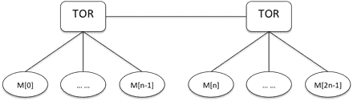

# 百度 2018 校招 AI 异构计算工程师笔试题（第三批）

## 1

【多选】关于线程与进程的区别，下列说法正确的是

正确答案: A B   你的答案: 空 (错误)

```cpp
线程会与同进程的其他线程共享数据，使用公共变量和内存时需要使用同步机制
```

```cpp
子进程可获得父进程的所有堆与栈的数据，因此不利于资源管理和保护
```

```cpp
与线程相比，进程更适合在单 SMP 上运行，而线程可以跨机器迁移
```

```cpp
因多线程里，每个子进程有自己的地址空间，因此相互之间通信时，线程不如进程灵活和方便
```

本题知识点

算法工程师 百度 2018

讨论

[我想静静 1852](https://www.nowcoder.com/profile/691512315)

*   线程在执行过程中与同进程的其他线程共享进程的资源 。A 对；

*   子进程（线程）可获得父进程的所有堆与栈的数据。 B 对；

*   与进程相比，线程更适合在单 SMP 上运行，而进程可以快机器迁移。 C 错；

*   在多线程中，每个子进程没有自己的地址空间。D 错；

编辑于 2019-03-25 15:26:17

* * *

## 2

【单选】下列叙述中错误的是（ ）

正确答案: B   你的答案: 空 (错误)

```cpp
二叉链表是二叉树的存储结构
```

```cpp
循环链表是循环队列的存储结构
```

```cpp
栈是线性结构
```

```cpp
循环队列是队列的存储结构
```

本题知识点

算法工程师 百度 2018

讨论

[我想静静 1852](https://www.nowcoder.com/profile/691512315)

*   A 选项：正确，树的二叉链表表现方式（孩子兄弟表示法）；
*   B 选项：错误，循环链表就是尾指针指向头结点的链表，不是循环队列的存储结构
*   C 选项：正确，栈是线性结构
*   D 选项：正确，循环队列依旧为队列，区别是循环队列空了一个空间，判满条件和队列也不一致。

发表于 2019-03-25 15:47:26

* * *

## 3

【单选】如下描述错误的是：

正确答案: C   你的答案: 空 (错误)

```cpp
常量内存能带来性能提升的原因是，对常量内存的单次读操作可以广播到其他的“邻近”线程。
```

```cpp
纹理缓存是专门为那些在内存访问模式中存在大量空间局部性(Spatial Locality)的图形应用程序而设计的。
```

```cpp
cuda 编程中，__constant__ 关键字在声明后不可更改。
```

```cpp
在性能要求很高的代码中，避免分配或释放全局内存是一个比较好的做法。
```

本题知识点

算法工程师 百度 2018

讨论

[我想静静 1852](https://www.nowcoder.com/profile/691512315)

- C 选项：错误，“___constant_”声明一个常量内存变量

发表于 2019-03-25 15:55:42

* * *

## 4

【单选】设栈的顺序存储空间为 S(1:m) ，初始状态为 top=m+1 。现经过一系列正常的入栈与退栈操作后， top=0 ，则栈中的元素个数为（ ）

正确答案: A   你的答案: 空 (错误)

```cpp
不可能
```

```cpp
m+1
```

```cpp
1
```

```cpp
m
```

本题知识点

算法工程师 百度 2018

讨论

[我想静静 1852](https://www.nowcoder.com/profile/691512315)

初始状态为 top=m+1,存储空间为 S（1：m），则说明 m 为栈底，1 为栈顶，当 top=0 时候，栈已经**溢出**,出现错误，所以答案为不可能。

发表于 2019-03-25 16:11:26

* * *

## 5

【单选】下面叙述不正确的是（）

正确答案: D   你的答案: 空 (错误)

```cpp
派生类一般都用公有派生
```

```cpp
对基类成员的访问必须是无二义性的
```

```cpp
赋值兼容规则也适用于多重继承的组合
```

```cpp
父类的公有成员在派生类中仍然是公有的
```

本题知识点

算法工程师 百度 2018

讨论

[我想静静 1852](https://www.nowcoder.com/profile/691512315)

*   D 选项要看继承方式，公有继承到派生类中仍然是公有的，私有继承到派生类中是私有的，保护继承在派生类中是保护的。

发表于 2019-03-25 17:00:02

* * *

## 6

【单选】有 m 个进程共享同一临界资源，若使用信号量机制实现 q 对一临界资源的互斥访问，则信号量的变化范围是（ ）。

正确答案: A   你的答案: 空 (错误)

```cpp
1 至 –(m-1)
```

```cpp
1 至 m-1
```

```cpp
1 至–m
```

```cpp
1 至 m
```

本题知识点

算法工程师 百度 2018

讨论

[一叶舟 troy](https://www.nowcoder.com/profile/795673)

实现互斥访问，变成互斥所，最多 1 个，排查 B D.信号量 小于代表 等待。信号量的初始值为 1，有 m 个进程，最极端的情况就是如果有一个进程正在访问临界资源，其他 m-1 个进程都在等待，此时信号量为 0- (m-1) = -m + 1

发表于 2020-03-25 14:52:44

* * *

## 7

【单选】某 CPU 主频为 1.03 GHz，采用 4 级指令流水线，每个流水段的执行需要 1 个时钟周期。假定 CPU 执行了 100 条指令，在其执行过程中，没有发生任何流水线阻塞，此时流水线的吞吐率为（ ）。

正确答案: C   你的答案: 空 (错误)

```cpp
0.25×10⁹ 条指令/秒
```

```cpp
0.97×10⁹ 条指令/秒
```

```cpp
1.0×10⁹ 条指令/秒
```

```cpp
1.03 ×10⁹ 条指令/秒
```

本题知识点

算法工程师 百度 2018

## 8

【单选】关于 DMA 的说法，哪些是错误的？

正确答案: D   你的答案: 空 (错误)

```cpp
DMA，Direct Memory Acess 直接存储器访问，使得不同速度的硬件设备可以直接通信，不通过 CPU 干预；
```

```cpp
DMA 访问的时候需要从 CPU 那里夺得总线控制权
```

```cpp
DMA 速度快；
```

```cpp
DMA 不需要中断控制
```

本题知识点

算法工程师 百度 2018

讨论

[左神的小幺](https://www.nowcoder.com/profile/5777693)

DMA 的工作流程如下：（1）CPU 需要访问外存时便发送。一条访问命令给 DMA 的命令寄存器 CR、一个内存地址码给 DMA 的内存地址寄存器 MAR、本次要传送的字节数给 DMA 的数据计数器 DC、外存地址给 DMA 的 I/O 控制逻辑。（2）CPU 启动 DMA 控制器后转向其他处理。（3）DMA 控制器负责控制数据在内存与外设之间传送。每传送一个字节就需挪用一个内存周期，按 MAR 从内存读出或写入内存一个字节，修改 MAR 和计算器 DC。（4）当 DC 修改为 0 时，表示传送结束，由 DMA 向 CPU 发出中断请求。

发表于 2018-09-29 16:55:42

* * *

## 9

【单选】下列函数中，不能声明为虚函数的是（）？

正确答案: A   你的答案: 空 (错误)

```cpp
构造函数
```

```cpp
析构函数
```

```cpp
私有成员函数
```

```cpp
公有成员函数
```

本题知识点

算法工程师 百度 2018 C++

讨论

[杉杉来啦](https://www.nowcoder.com/profile/243827773)

为什么构造函数不能为虚函数 1，从存储空间角度

    虚函数对应一个 vtable，这大家都知道，可是这个 vtable 其实是存储在对象的内存空间的。问题出来了，如果构造函数是虚的，就需要通过 vtable 来调用，可是对象还没有实例化，也就是内存空间还没有，无法找到 vtable，所以构造函数不能是虚函数。

2，从使用角度

        虚函数主要用于在信息不全的情况下，能使重载的函数得到对应的调用。构造函数本身就是要初始化实例，那使用虚函数也没有实际意义呀。所以构造函数没有必要是虚函数。

虚函数的作用在于通过父类的指针或者引用来调用它的时候能够变成调用子类的那个成员函数。而构造函数是在创建对象时自动调用的，不可能通过父类的指针或者引用去调用，因此也就规定构造函数不能是虚函数。

3、构造函数不需要是虚函数，也不允许是虚函数，因为创建一个对象时我们总是要明确指定对象的类型，尽管我们可能通过实验室的基类的指针或引用去访问它。但析构却不一定，我们往往通过基类的指针来销毁对象。这时候如果析构函数不是虚函数，就不能正确识别对象类型从而不能正确调用析构函数。

4、从实现上看，vbtl 在构造函数调用后才建立，因而构造函数不可能成为虚函数 

  从实际含义上看，在调用构造函数时还不能确定对象的真实类型（因为子类会调父类的构造函数）；而且构造函数的作用是提供初始化，在对象生命期只执行一次，不是对象的动态行为，也没有太大的必要成为虚函数

5、当一个构造函数被调用时，它做的首要的事情之一是初始化它的 V P T R。因此，它只能知道它是“当前”类的，而完全忽视这个对象后面是否还有继承者。当编译器为这个构造函数产生代码时，它是为这个类的构造函数产生代码- -既不是为基类，也不是为它的派生类（因为类不知道谁继承它）。

        所以它使用的 V P T R 必须是对于这个类的 V TA B L E。而且，只要它是最后的构造函数调用，那么在这个对象的生命期内， V P T R 将保持被初始化为指向这个 V TA B L E, 但如果接着还有一个更晚派生的构造函数被调用，这个构造函数又将设置 V P T R 指向它的 V TA B L E，等.直到最后的构造函数结束。V P T R 的状态是由被最后调用的构造函数确定的。这就是为什么构造函数调用是从基类到更加派生 类顺序的另一个理由。

        但是，当这一系列构造函数调用正发生时，每个构造函数都已经设置 V P T R 指向它自己的 V TA B L E。如果函数调用使用虚机制，它将只产生通过它自己的 V TA B L E 的调用，而不是最后的 V TA B L E（所有构造函数被调用后才会有最后的 V TA B L E）。

发表于 2020-08-09 10:25:42

* * *

[走过的痕迹](https://www.nowcoder.com/profile/901024290)

不能被继承和不能被重载的函数不能声明为虚函数！私有成员函数可以被继承，所以可以声明为虚函数！

编辑于 2021-03-14 12:40:56

* * *

[牛客 308305120 号](https://www.nowcoder.com/profile/308305120)

不是多选题嘛

发表于 2021-12-16 21:54:22

* * *

## 10

32 位系统下，对于下面的结构体 A 和 B，sizeof（A），sizeof（B）的结果分别是（）

```cpp
#include <stdio.h>
#pragma pack(2)
struct A
{
   int a;
   char b;
   short c;
};
#pragma pack()
#pragma pack(4)
struct B
{
   char b;
   int a;
   short c;
};
#pragma pack()
int main()
{
   printf(“sizeof(A)=%d,sizeof(B)=%d\n”,sizeof(A),sizeof(B));
   return 0;
}
```

正确答案: C   你的答案: 空 (错误)

```cpp
8,8
```

```cpp
8,10
```

```cpp
8,12
```

```cpp
7,8
```

本题知识点

算法工程师 百度 2018 C 语言

讨论

[牛客 508391564 号](https://www.nowcoder.com/profile/508391564)

使用伪指令#pragma pack (n)，C 编译器将按照 n 个字节对齐。
使用伪指令#pragma pack ()，取消自定义字节对齐方式 8=4+1+补齐 1+2；12=1+补齐 3+4+2+补齐 2。现学现卖，如有错误，请指出。

发表于 2020-08-07 15:43:37

* * *

[梅有關係](https://www.nowcoder.com/profile/484857992)

#pragma pack(2) 为预指令  (2)中数字为代表默认对齐数改为 2 一般在 vs 编译器下默认对齐数设为 8 预指令进行更改如何找每一个成员体的对齐数呢 ？把相应成员体大小与默认对齐数相比 较小值为相应对齐数第一个 4+1+1(浪费的空间)+2=8 大小为占空间最大成员 4 的倍数则成立下面的#pragma pack()意思是取消上面设置的默认对齐数 2 第二个同理 1+3(浪费的空间)+4+2=10 由于 10 不是最大成员体所占空间 4 的倍数 因此要补到 12 故答案为 12

发表于 2021-10-09 15:07:28

* * *

[白客西](https://www.nowcoder.com/profile/822768425)

我的理解是，C 语言里 char 类型为 1 字节，short 类型为 2 字节，int 类型为 4 字节。

```cpp
#pragma pack(2)
struct A
{
   int a;
   char b;
   short c;
};
```

这里使用伪指令#pragma pack (2)，C 编译器将按照 2 个字节对齐。因为 int 类型的 a 为 4 字节(超了 2 字节就不管)；char 类型 b 为 1 字节，补齐为 2 字节；short 类型的 c 为 2 字节，也不用管。所以结构体 A 的长度为 4+2+2=8 字节对于结构体 B，因为使用了#pragma pack (4)，C 编译器将按照 4 个字节对齐。故结构体 B 的长度为 4(char 类型的 b 补齐 3 字节)+4+4(short 类型的 c 补齐 2 字节)=12 字节。

编辑于 2020-09-10 09:33:04

* * *

## 11

 请简述 GPU Direct 原理及系统设计时的注意点

你的答案

本题知识点

算法工程师 百度 2018

## 12

简述 x86 中 L1，L2cache 及 Cache Line 的差别及各自特性

你的答案

本题知识点

算法工程师 百度 2018

## 13

 什么是 register file、mem bank conflict、read-only cache。

你的答案

本题知识点

算法工程师 百度 2018

## 14

请分别描述一下 CPU 与 GPU 的硬件架构特点与区别

你的答案

本题知识点

算法工程师 百度 2018

## 15

 如下图，有 2n 个节点（N[0] 到 N[2n-1]），每 n 个节点连接在同一交换机上，两个交换机通过 n/4 条链路直接互联。每个节点上有一份大小为 M 的数据（别用 M[1], M[2] … M[2n-1]表示）。请设计一种通信策略，实现每个节点拥有所有节点的数据和（M[x] = M[1] + M[2] + … M[2n-1]），并给出总耗时（假设发送一份数据的时间为 t，忽略系统延时）。

你的答案

本题知识点

算法工程师 百度 2018

## 16

有一张 1024x1024 pixel 的三通道图片，需要进行 32 个不同的 3x3 三通道卷积操作。请使用你所熟悉的并行加速技术及编程语言实现，如 CPU（AVX/SSE）、GPU（CUDA/OpenCL）、ARM(NEON)等，请详述解决思路。（注：不能使用本地 IDE）

你的答案

本题知识点

算法工程师 百度 2018