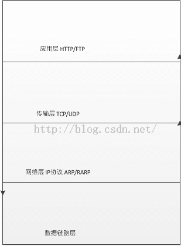
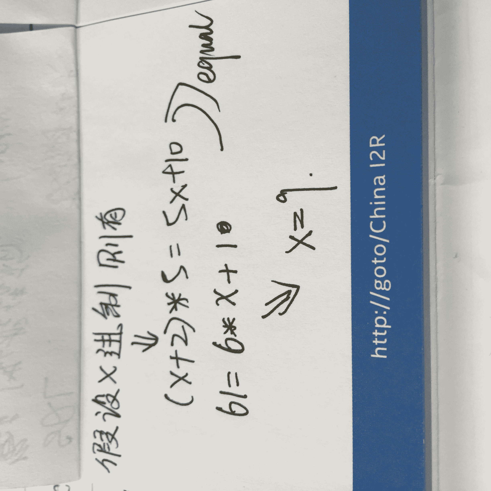

# 触宝科技 2017 秋季校招研发笔试题（第一批）

## 1

在平面上有 N 个点，他们有各自的速度向量。现在我们给出时刻 0 时他们的位置，还有各自的速度向量。在同一时刻，距离最远的一对点对称之为 special dots。现在，请你求出在哪个时刻 t(t>=0)，令当前 special dots 之间的距离最近，并输出这个距离。

本题知识点

数字认证 数理统计 C++工程师 iOS 工程师 安卓工程师 运维工程师 前端工程师 算法工程师 PHP 工程师 模拟 穷举 数学 Java 工程师 2017 触宝

## 2

兔子小白正在准备食物。它存储了一大堆大大小小的胡萝卜，以度过这个难熬的冬天。小白每天都要吃一定重量的胡萝卜来维持能量，当然它不介意某一天多吃一点。但是这些胡萝卜比较特殊，一旦被啃过了就必须今天把它吃完，否则就会坏掉。那么，小白靠这些胡萝卜最多能撑过多少天呢？ （这些胡萝卜的重量有一些神奇的规律，如果你把这些不同重量的胡萝卜排一下序，你会发现每个胡萝卜重量都会被比它轻的重量整除，例如 1,2,6,12 或者 1,5,10,20）

本题知识点

数字认证 数理统计 C++工程师 iOS 工程师 安卓工程师 运维工程师 前端工程师 算法工程师 PHP 工程师 贪心 排序 *数学 Java 工程师 2017 触宝* *## 3

以下表的设计，最合理的是

正确答案: A   你的答案: 空 (错误)

```cpp
学生{id,name,age} ,学科{id,name} 分数{学生 id,学科 id,分数}
```

```cpp
学生{id,name,age} ,分数{学生 id, 学科 id, 学科 name , 分数}
```

```cpp
分数{学生 id, 学生 name，学生 age, 学科 id，学科名称, 分数, }
```

```cpp
学科{id,name},分数{学生 id，学生姓名，学生 age，学科 id,分数}
```

本题知识点

数字认证 数理统计 C++工程师 iOS 工程师 安卓工程师 运维工程师 前端工程师 算法工程师 PHP 工程师 Java 工程师 2017 触宝

讨论

[LZX201904100856473](https://www.nowcoder.com/profile/616962648)

不太明白啊，这个题目，我怎么没看到，他让我干嘛

发表于 2019-08-19 10:49:24

* * *

## 4

根据 TCP/IP 协议栈的分层来看 HTTP 协议工作在哪一层

正确答案: D   你的答案: 空 (错误)

```cpp
数据链路层
```

```cpp
网络层
```

```cpp
传输层
```

```cpp
应用层
```

本题知识点

数字认证 数理统计 C++工程师 iOS 工程师 安卓工程师 运维工程师 前端工程师 算法工程师 PHP 工程师 C++工程师 Java 工程师 数字认证 2017 触宝

讨论

[搬砖炫富](https://www.nowcoder.com/profile/6780414)



发表于 2018-08-13 13:42:06

* * *

## 5

用容积分别为 15 升和 27 升的两个杯子向一个水桶中装水，可以精确向水桶中注入多少升水

正确答案: C   你的答案: 空 (错误)

```cpp
53
```

```cpp
25
```

```cpp
33
```

```cpp
52
```

本题知识点

数字认证 数理统计 C++工程师 iOS 工程师 安卓工程师 运维工程师 前端工程师 算法工程师 PHP 工程师 C++工程师 Java 工程师 数字认证 2017 触宝

讨论

[asdddsa](https://www.nowcoder.com/profile/5375755)

15+15+（15+15-27）= 33

发表于 2018-08-04 08:25:11

* * *

[前倾前屈](https://www.nowcoder.com/profile/382633520)

怎么弄都是三的倍数

发表于 2019-08-06 12:54:05

* * *

[work_coder](https://www.nowcoder.com/profile/6921179)

15 好 27 的组合，注意选项 D 是 52，但是 15+27 等于 42 选项 c = 用 15 升的杯子向一个水桶中装水 4 次，然后再用 27 升的杯子取出 1 次。

发表于 2019-02-28 15:30:53

* * *

## 6

一副牌 52 张(去掉大小王)，从中抽取两张牌，一红一黑的概率是多少

正确答案: A   你的答案: 空 (错误)

```cpp
26/51
```

```cpp
25/51
```

```cpp
26/52
```

```cpp
25/52
```

本题知识点

数字认证 数理统计 C++工程师 iOS 工程师 安卓工程师 运维工程师 前端工程师 算法工程师 PHP 工程师 C++工程师 Java 工程师 数字认证 2017 触宝

讨论

[住羽光士口门](https://www.nowcoder.com/profile/81650008)

把这个问题换一个说法，**有 52 个球，26 个黑，26 个红。不放回抽两次，获得不同颜色的概率为多少？**第一次抽，总会有一个颜色，假设是黑色，第二次抽，是红色的概率，就是 从剩下的 51 个球中抽取 26 个红色的概率，就是 26/51

发表于 2018-08-04 11:23:47

* * *

[新起点、新希望](https://www.nowcoder.com/profile/59249047)

我认为可以考虑分两次不放回抽取一红一黑的概率 = （1 - 两红的概率 - 两黑的概率）两红的概率 =（第一次抽到红（26/52）*第二次抽到红（25/51））
两黑的概率 = 两红的概率一红一黑的概率 = 1-2*(26/52)*(25/51) = 26/51 

发表于 2019-05-28 19:55:54

* * *

[}](https://www.nowcoder.com/profile/468731622)

（C(52,1) * C(26,1) / A(2,2)) / C(52,2)

编辑于 2019-01-19 13:01:08

* * *

## 7

字符串"//＾▽＾//\n"的长度是（）

正确答案: C   你的答案: 空 (错误)

```cpp
6
```

```cpp
7
```

```cpp
8
```

```cpp
9
```

本题知识点

C++工程师 2017 C 语言 触宝

讨论

[Bruno.Mars](https://www.nowcoder.com/profile/8934267)

\n 是转义字符，算一个。

发表于 2018-10-16 10:44:53

* * *

[牛客 670531181 号](https://www.nowcoder.com/profile/670531181)

如果 sizeof 这个字符串应该是 9，这里说的字符串长度感觉有点模糊，strlen 碰到 \0 才会停下所以会等于 8😐

发表于 2021-08-21 23:14:02

* * *

[美团内推-到家](https://www.nowcoder.com/profile/361271297)

\0 不算长度吗？

发表于 2020-09-01 14:42:12

* * *

## 8

一个查询语句执行后显示的结果为 1 班 80 2 班 75 3 班 NULL 则最有可能的查询语句是

正确答案: B   你的答案: 空 (错误)

```cpp
SELECT AVG(成绩) FROM 成绩表 WHERE class&lt;=3
```

```cpp
SELECT AVG(成绩) FROM 成绩表 WHERE class&lt;=3 GROUP BY class
```

```cpp
SELECT AVG(成绩) FROM 成绩表 WHERE class&lt;=3 order by class
```

```cpp
SELECT AVG(成绩) FROM 成绩表 HAVING class &lt;=3 GROUP BY class
```

本题知识点

数字认证 数理统计 C++工程师 iOS 工程师 安卓工程师 运维工程师 前端工程师 算法工程师 PHP 工程师 C++工程师 Java 工程师 数字认证 2017 触宝

讨论

[亲爱的暴躁的热心网友皮皮文](https://www.nowcoder.com/profile/3496468)

排除法：Ｄ肯定是错的，ＨＡＶＩＮＧ子句必须跟在ＧＲＯＵＰ　ＢＹ子句后面，ＯＲＤＥＲ　ＢＹ也不现实，毕竟默认的是顺序不是逆序，不加ＧＲＯＵＰ　ＢＹ更加不可能按班抽取数据了

发表于 2018-07-15 16:57:52

* * *

## 9

执行以下代码：

```cpp
#define SUM(x,y) x+y
int a = 3;
int b = 2;
a += a*SUM(a, b)*b;
```

a 的值为（）

正确答案: A   你的答案: 空 (错误)

```cpp
16
```

```cpp
30
```

```cpp
33
```

```cpp
39
```

本题知识点

C++工程师 2017 C 语言 触宝

讨论

[王哈哈为什么不说话](https://www.nowcoder.com/profile/289742629)

#define SUM(x,y) x+y 这是在定义宏 宏不仅替换字符串 还替换参数列表原式 a=a+a*SUM(a,b)*b=a+a*a+b*b=16

发表于 2019-04-03 11:59:24

* * *

[Goldenlike](https://www.nowcoder.com/profile/1042018)

a+=3*3+2*2;

发表于 2018-07-11 16:38:47

* * *

[kirayang](https://www.nowcoder.com/profile/747651839)

没外面的括号，所以就变成 a*a+b*b 了

发表于 2020-11-11 13:59:45

* * *

## 10

一个栈的入栈序列为 ABCDE，则栈的不可能的输出序列为

正确答案: D   你的答案: 空 (错误)

```cpp
DCBEA
```

```cpp
ACBED
```

```cpp
DCEBA
```

```cpp
DEBCA
```

本题知识点

数字认证 数理统计 C++工程师 iOS 工程师 安卓工程师 运维工程师 前端工程师 算法工程师 PHP 工程师 C++工程师 Java 工程师 数字认证 2017 触宝

讨论

[求 offer 的 Little_Bee](https://www.nowcoder.com/profile/443024911)

在 D 选项中，D 先出，说明 ABCD 是一起入栈的，D 出来以后，栈中自栈底到栈顶还剩 ABC；第二步是 E 进，E 出，栈中自栈底到栈顶还剩 ABC；因此，只可能是 C 出、B 出、A 出，不可能 B 比 C 先出。因此输出序列可能为 DECBA。

发表于 2018-10-15 21:10:34

* * *

[DaisyHYN](https://www.nowcoder.com/profile/7017283)

这题 D 选项也行啊

发表于 2018-07-15 14:09:28

* * *

[seven201811191103722](https://www.nowcoder.com/profile/49457118)

求解释 B 项是怎么做到的啊？

发表于 2019-06-13 14:34:14

* * *

## 11

下面数据结构能够支持随机的插入和删除操作、并具有较好的性能的是

正确答案: A   你的答案: 空 (错误)

```cpp
链表和哈希表
```

```cpp
数组和链表
```

```cpp
哈希表和队列
```

```cpp
堆栈和双向队列
```

本题知识点

数字认证 数理统计 C++工程师 iOS 工程师 安卓工程师 运维工程师 前端工程师 算法工程师 PHP 工程师 C++工程师 Java 工程师 数字认证 2017 触宝

讨论

[work_coder](https://www.nowcoder.com/profile/6921179)

首先要支持随机的插入，队列无法支持，因为队列是先进先出。然后具有较好的性能，数组肯定不对，随机插入之后要移动元素。

发表于 2019-02-28 14:01:10

* * *

## 12

 1 台机器对 200 个单词进行排序花了 200 秒(使用冒泡排序)，那么花费 800 秒，大概可以对多少个单词进行排序

正确答案: A   你的答案: 空 (错误)

```cpp
400
```

```cpp
500
```

```cpp
600
```

```cpp
800
```

本题知识点

数字认证 数理统计 C++工程师 iOS 工程师 安卓工程师 运维工程师 前端工程师 算法工程师 PHP 工程师 C++工程师 Java 工程师 数字认证 2017 触宝

讨论

[君无戏言 Java](https://www.nowcoder.com/profile/2292642)

冒泡排序时间复杂度平均情况为 O(n²)所以 200*200 : 200            n*n  ：800 又因为 800/200=4 所以 n 等于对 200*200*4 开根号得 400

发表于 2018-08-28 12:48:34

* * *

## 13

编译程序是一种

正确答案: A   你的答案: 空 (错误)

```cpp
翻译程序
```

```cpp
目标程序
```

```cpp
汇编程序
```

```cpp
解释程序
```

本题知识点

数字认证 数理统计 C++工程师 iOS 工程师 安卓工程师 运维工程师 前端工程师 算法工程师 PHP 工程师 C++工程师 Java 工程师 数字认证 2017 触宝

讨论

[ONEFISH51](https://www.nowcoder.com/profile/8762502)

C/C++程序编译连接过程：

源文件→预处理→编译→汇编→链接→可执行文件

发表于 2019-03-24 17:18:16

* * *

## 14

如果某系统 12*5=61 成立，则系统采用的是()进制

正确答案: C   你的答案: 空 (错误)

```cpp
7
```

```cpp
8
```

```cpp
9
```

```cpp
10
```

本题知识点

数字认证 数理统计 C++工程师 iOS 工程师 安卓工程师 运维工程师 前端工程师 算法工程师 PHP 工程师 C++工程师 Java 工程师 数字认证 2017 触宝

讨论

[亲爱的暴躁的热心网友皮皮文](https://www.nowcoder.com/profile/3496468)

治疗颈椎病

发表于 2018-07-15 16:46:08

* * *

[arisesun](https://www.nowcoder.com/profile/219169084)

将数转换为十进制之后求解：12345 的 p 进制转换为 10 进制=1*p⁴+2*p³+3*p²+4*p+5 本题（p+2）*5=6*p+1

发表于 2019-05-09 10:59:24

* * *

[君无戏言 Java](https://www.nowcoder.com/profile/2292642)

设系统采用得是 n 进制位数   8        7      6      5       4      3      2      1      0          n ⁸    n ⁷    n ⁶    n ⁵    n ⁴    n ³   n ²    n ¹   n⁰结合题得（n+2)*5 = (n*6)+1 解得        n = 9

发表于 2018-08-28 12:54:55

* * *

## 15

对于以下代码，char* p=new char[100];说法正确的是（）

正确答案: D   你的答案: 空 (错误)

```cpp
p 和 new 出来的内存都在栈上
```

```cpp
p 和 new 出来的内存都在堆上
```

```cpp
p 在堆上，new 出来的在栈上
```

```cpp
p 在栈上，new 出来的在堆上
```

本题知识点

数理统计 C++工程师 2017 C 语言 触宝 概率论与数理统计

讨论

[花开不败 lyt](https://www.nowcoder.com/profile/923988793)

new 出来的对象放在堆中，局部变量放在栈中。

发表于 2019-02-17 23:21:30

* * *

[光之所向](https://www.nowcoder.com/profile/492249963)

栈：由编译器在需要时自动分配，不需要时自动清除的变量存储区。通常存放局部变量、函数参数等。 堆：由 new 分配的内存块，由程序员释放（编译器不管），一般一个 new 与一个 delete 对应，一个 new[]与一个 delete[]对应。如果程序员没有释放掉，资源将由操作系统在程序结束后自动回收。

发表于 2022-03-09 10:01:35

* * *

[人行路平](https://www.nowcoder.com/profile/498345143)

new 出来的对象放在堆中，局部变量放在栈中

发表于 2021-10-18 09:02:04

* * *

## 16

正常建立一条 TCP 连接需要（）个步骤，正常关闭一个 TCP 连接需要（）个步骤

正确答案: B   你的答案: 空 (错误)

```cpp
3,3
```

```cpp
3,4
```

```cpp
4,4
```

```cpp
4,3
```

本题知识点

数字认证 数理统计 C++工程师 iOS 工程师 安卓工程师 运维工程师 前端工程师 算法工程师 PHP 工程师 C++工程师 Java 工程师 数字认证 2017 触宝

讨论

[Goldenlike](https://www.nowcoder.com/profile/1042018)

三次握手，四次挥手

发表于 2018-07-11 17:21:16

* * *

## 17

 以下开源软件中经常被用作消息队列的是哪个

正确答案: A   你的答案: 空 (错误)

```cpp
Kafka
```

```cpp
MongoDB
```

```cpp
Hadoop
```

```cpp
Spark
```

本题知识点

数字认证 数理统计 C++工程师 iOS 工程师 安卓工程师 运维工程师 前端工程师 算法工程师 PHP 工程师 Java 工程师 2017 触宝 概率论与数理统计

讨论

[追寻原风景](https://www.nowcoder.com/profile/860792)

卡夫卡（Kafka）常作为消息队列，MongoDB 是一种数据库，hadoop 是分布式集群，Spark 是基于 hadoop 的一种分布式计算框架。

发表于 2019-05-09 19:37:31

* * *

## 18

现有 4 个同时到达的作业 J1,J2,J3 和 J4,它们的执行时间分别是 1 小时，3 小时，5 小时，7 小时，系统按单道方式运行且采用短作业优先算法，则平均周转时间是（）小时

正确答案: D   你的答案: 空 (错误)

```cpp
4
```

```cpp
5
```

```cpp
6
```

```cpp
7.5
```

本题知识点

数字认证 数理统计 C++工程师 iOS 工程师 安卓工程师 运维工程师 前端工程师 算法工程师 PHP 工程师 Java 工程师 2017 触宝 途虎 2021 概率论与数理统计

讨论

[2022 爱学习](https://www.nowcoder.com/profile/407829190)

链接：[`www.nowcoder.com/questionTerminal/5a6a90fd3fe04efb8c053a6dcb4039e8`](https://www.nowcoder.com/questionTerminal/5a6a90fd3fe04efb8c053a6dcb4039e8)
来源：牛客网
谁短谁先执行，所以执行顺序为 J1 J2 J3 J4，J1 执行完时间为 1,轮到 J2 执行时，前面已经过了一小时，所以 J2 执行完时间为 1+3 =4，同理，平均周转时间为 （1  + （1+3）  + （1+3+5 ）+ （ 1+3+5+7））/4=7.5

发表于 2019-08-16 18:16:35

* * *

[君无戏言 Java](https://www.nowcoder.com/profile/2292642)

1 +（1+3） + （1+3+5） + （1+3+5+7） =  3030/4 = 7.5

发表于 2018-08-28 13:14:03

* * *

[牛客小丑 C](https://www.nowcoder.com/profile/410104169)

把等待时间也算到任务里面，（1+（1+3）+（1+3+5）+（1+3+5+7））/4=7.5

发表于 2022-02-12 19:37:47

* * *

## 19

在给定文件中查找与设定条件相符字符串的命令

正确答案: B   你的答案: 空 (错误)

```cpp
gzip
```

```cpp
grep
```

```cpp
ls
```

```cpp
find
```

本题知识点

数字认证 数理统计 C++工程师 iOS 工程师 安卓工程师 运维工程师 前端工程师 算法工程师 PHP 工程师 C++工程师 Java 工程师 数字认证 2017 触宝

讨论

[辣椒啊我的女神](https://www.nowcoder.com/profile/9718813)

find 为指定目录下查找文件

发表于 2018-09-22 17:07:19

* * *

## 20

Linux 文件权限一共 10 位长度，分成四段，第三段表示的内容是

正确答案: B   你的答案: 空 (错误)

```cpp
文件所有者的权限
```

```cpp
文件所有者所在组的权限
```

```cpp
其他用户的权限
```

```cpp
文件类型
```

本题知识点

数字认证 数理统计 C++工程师 iOS 工程师 安卓工程师 运维工程师 前端工程师 算法工程师 PHP 工程师 C++工程师 Java 工程师 数字认证 2017 触宝

讨论

[CSDN：百载文枢江左](https://www.nowcoder.com/profile/118920252)

linux 中的文件属性分为四段，依次表示文件类型、文件所有者的权限、文件所有者所在组的权限和其他用户的权限如 -rwzrwz---第一段 - 是指文件类型，表示这是个普通文件
-为：表示文件
d 为：表示文件夹
l 为：表示[链接文件](https://www.baidu.com/s?wd=%E9%93%BE%E6%8E%A5%E6%96%87%E4%BB%B6&tn=SE_PcZhidaonwhc_ngpagmjz&rsv_dl=gh_pc_zhidao)，可以理解为 windows 中的快捷方式（link file）
b 为：表示里面可以供存储周边设备
c 为：表示里面为一次性读取装置 第二段 rwz 是指拥有者具有可读可写可执行的权限
类似于 windows 中的所有者权限比如 administrator 对文件具有 修改、读取和执行权限 第三段 rwz 是指所属于这个组的成员对于这个文件具有，可读可写可执行的权限
类似于 windows 中的组权限比如 administrators 组，属于这个组的成员对于文件的都有 可读可写可执行权限
第四段 --- 是指其他人对于这个文件没有任何权限
类似于 windows 中的 anyone 一样就是说所有人对着个文件都会有一个怎样的权限 

发表于 2019-04-13 10:44:01

* * *

## 21

计算一个任意三角形的面积，S=√(p(p-a)(p-b)(p-c)),p=(a+b+c)/2,以下等价类测试用例中，不属于无效等价类的是

正确答案: A   你的答案: 空 (错误)

```cpp
a=5，b=3，c=6;
```

```cpp
a=2，b=3，c=5;
```

```cpp
a=7，b=3，c=3;
```

```cpp
a=2，b=6，c=3;
```

本题知识点

数字认证 数理统计 C++工程师 iOS 工程师 安卓工程师 运维工程师 前端工程师 算法工程师 PHP 工程师 C++工程师 Java 工程师 数字认证 2017 触宝

讨论

[隗@](https://www.nowcoder.com/profile/676932626)

这道题直接用两边之和大于第三边，即可选出 A。只有 A 满足

发表于 2018-09-04 22:42:32

* * *

## 22

在黑盒测试方法中，设计测试用例的主要根据是

正确答案: B   你的答案: 空 (错误)

```cpp
程序内部逻辑
```

```cpp
程序外部功能
```

```cpp
程序数据结构
```

```cpp
程序流程图
```

本题知识点

数字认证 数理统计 C++工程师 iOS 工程师 安卓工程师 运维工程师 前端工程师 算法工程师 PHP 工程师 C++工程师 Java 工程师 数字认证 2017 触宝

讨论

[privilege...](https://www.nowcoder.com/profile/705973)

黑盒测试也称功能测试，它是通过测试来检测每个功能是否都能正常使用。只检查程序功能是否按照需求规格说明书的规定正常使用，程序是否能适当地接收输入数据而产生正确的输出信息。黑盒测试着眼于程序外部结构，不考虑内部逻辑结构，主要针对软件界面和软件功能进行测试。

发表于 2019-05-22 23:51:27

* * *

## 23

移动端开发中常用的数据库是

正确答案: C   你的答案: 空 (错误)

```cpp
MySQL
```

```cpp
Oracle
```

```cpp
SQLite
```

```cpp
MongoDB
```

本题知识点

数字认证 数理统计 C++工程师 iOS 工程师 安卓工程师 运维工程师 前端工程师 算法工程师 PHP 工程师 Java 工程师 2017 触宝 概率论与数理统计

讨论

[~~Smile](https://www.nowcoder.com/profile/3486232)

SQLite，是一款轻型的数据库，是遵守[ACID](https://baike.baidu.com/item/ACID/10738)的关系型[数据库管理系统](https://baike.baidu.com/item/%E6%95%B0%E6%8D%AE%E5%BA%93%E7%AE%A1%E7%90%86%E7%B3%BB%E7%BB%9F)，它包含在一个相对小的 C 库中。它是 D.RichardHipp 建立的公有领域项目。它的设计目标是[嵌入式](https://baike.baidu.com/item/%E5%B5%8C%E5%85%A5%E5%BC%8F/575465)的，而且目前已经在很多[嵌入式产品](https://baike.baidu.com/item/%E5%B5%8C%E5%85%A5%E5%BC%8F%E4%BA%A7%E5%93%81/9245765)中使用了它，它占用资源非常的低，在[嵌入式设备](https://baike.baidu.com/item/%E5%B5%8C%E5%85%A5%E5%BC%8F%E8%AE%BE%E5%A4%87/10055189)中，可能只需要几百 K 的内存就够了。它能够支持 Windows/Linux/Unix 等等主流的[操作系统](https://baike.baidu.com/item/%E6%93%8D%E4%BD%9C%E7%B3%BB%E7%BB%9F/192)，同时能够跟很多程序语言相结合，比如 Tcl、C#、PHP、Java 等，还有 ODBC 接口，同样比起 Mysql、PostgreSQL 这两款开源的世界著名[数据库管理系统](https://baike.baidu.com/item/%E6%95%B0%E6%8D%AE%E5%BA%93%E7%AE%A1%E7%90%86%E7%B3%BB%E7%BB%9F/1239101)来讲，它的处理速度比他们都快。SQLite 第一个[Alpha 版本](https://baike.baidu.com/item/Alpha%E7%89%88%E6%9C%AC)诞生于 2000 年 5 月。 至 2015 年已经有 15 个年头，SQLite 也迎来了一个版本 SQLite 3 已经发布。

发表于 2018-08-11 14:06:47

* * *

## 24

目前移动设备主流的屏幕帧率是每秒()帧

正确答案: C   你的答案: 空 (错误)

```cpp
24
```

```cpp
30
```

```cpp
60
```

```cpp
120
```

本题知识点

数字认证 数理统计 C++工程师 iOS 工程师 安卓工程师 运维工程师 前端工程师 算法工程师 PHP 工程师 Java 工程师 2017 触宝 概率论与数理统计

讨论

[牛客 Shirley](https://www.nowcoder.com/profile/444966050)

这跟数理统计有什么关系

发表于 2020-08-27 21:49:01

* * *

[青椒肉丝](https://www.nowcoder.com/profile/563912)

此处艾特卢伟冰，没有高刷(120hz)你跟我谈旗舰？

发表于 2020-04-24 21:21:40

* * *

[Alex_ching](https://www.nowcoder.com/profile/537095956)

时代变化的这么快了吗？我一直以为是 30 帧。

发表于 2020-07-22 21:41:08

* * *

## 25

在移动设备息屏时，以下哪种情况不一定导致大量耗电

正确答案: D   你的答案: 空 (错误)

```cpp
使用 gps 导航
```

```cpp
信号特别弱
```

```cpp
电话通话中
```

```cpp
打开过大量应用
```

本题知识点

数字认证 数理统计 C++工程师 iOS 工程师 安卓工程师 运维工程师 前端工程师 算法工程师 PHP 工程师 Java 工程师 2017 触宝 概率论与数理统计

讨论

[从那天开始](https://www.nowcoder.com/profile/156203566)

打开过，说明进程已经被 kill 了

发表于 2020-05-01 01:58:51

* * *

[rookie_peng](https://www.nowcoder.com/profile/508307741)

为啥会放到这个技能下面

发表于 2020-07-02 20:15:15

* * *

[🐅🐒201907091137659](https://www.nowcoder.com/profile/653961074)

敲黑板！注意了！送分题！

发表于 2019-07-10 11:52:26

* * *

## 26

从 sd 卡加载一张图片为 bitmap 并显示到屏幕上的一个 view，该 view 占用的内存主要和什么因素有关 

正确答案: D   你的答案: 空 (错误)

```cpp
图片文件大小及压缩格式
```

```cpp
图片原始分辨率
```

```cpp
view 的尺寸
```

```cpp
bitmap 分辨率和颜色位数
```

本题知识点

数字认证 数理统计 C++工程师 iOS 工程师 安卓工程师 运维工程师 前端工程师 算法工程师 PHP 工程师 C++工程师 Java 工程师 数字认证 2017 触宝

讨论

[Jean_V925](https://www.nowcoder.com/profile/226656436)

图片对内存的占用是一个叠加的过程，也就是说图片资源不是及时释放的，使用过的图片在回收过程中可能会有一定程度的延迟。 Android 中图片加载到内存中的内存占用跟图片的实际大小没有直接的关系，甚至于图片的实际像素尺寸也没有直接的关系。内存占用：表示加载的图片以 bitmap 的形式在内存中的实际占用。

发表于 2018-11-04 16:26:21

* * *

## 27

这是第 25 道选择题，也是最后一道选择题。请估算一下，包括本题在内，这 25 道选择题题干及选项总共大约有多少个字符？

正确答案: C   你的答案: 空 (错误)

```cpp
500
```

```cpp
1000
```

```cpp
2000
```

```cpp
4000
```

本题知识点

数字认证 数理统计 C++工程师 iOS 工程师 安卓工程师 运维工程师 前端工程师 算法工程师 PHP 工程师 C++工程师 Java 工程师 数字认证 2017 触宝

讨论

[码农自留地](https://www.nowcoder.com/profile/215129)

题干 56 字符选项 15 字符估算(56+15)*25=1775 ~=2000

发表于 2019-03-19 21:27:46

* * **