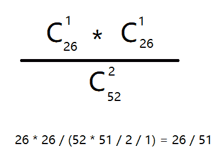

# 触宝科技 2017 秋季校招笔试研发题（第三批）

## 1

下面的排序算法中，初始数据集的排列顺序对算法的性能影响最小的是

正确答案: B   你的答案: 空 (错误)

```cpp
插入排序
```

```cpp
堆排序
```

```cpp
冒泡排序
```

```cpp
快速排序
```

本题知识点

数字认证 数理统计 C++工程师 iOS 工程师 安卓工程师 运维工程师 前端工程师 算法工程师 PHP 工程师 C++工程师 Java 工程师 数字认证 2017 触宝

讨论

[恨自己不够强](https://www.nowcoder.com/profile/635587634)


发表于 2019-03-11 19:27:42

* * *

## 2

在平面上有 N 个点，他们有各自的速度向量。现在我们给出时刻 0 时他们的位置，还有各自的速度向量。在同一时刻，距离最远的一对点对称之为 special dots。现在，请你求出在哪个时刻 t(t>=0)，令当前 special dots 之间的距离最近，并输出这个距离。

本题知识点

数字认证 数理统计 C++工程师 iOS 工程师 安卓工程师 运维工程师 前端工程师 算法工程师 PHP 工程师 模拟 穷举 数学 Java 工程师 2017 触宝

## 3

判断一个 string 是否是另一个 string 的子串是一个普遍且重要的问题。现在你也要来解决一个关于子串的小问题。我们现在有一个数量不是很大的 string 库(0<n>本题知识点数字认证 数理统计 C++工程师 iOS 工程师 安卓工程师 运维工程师 前端工程师 算法工程师 PHP 工程师 字符串 *穷举 模拟 Java 工程师 2017 触宝* *讨论

[百度今天开奖开到我了吗](https://www.nowcoder.com/profile/5599123)

```cpp
//使用 kmp 算法暴力求解
#include <bits/stdc++.h>
using namespace std;
void Next(const string &key, vector<int> &next)
{
    next[0] = -1;
    int i = 0, j = -1;
    while (i != key.size()-1)
    {
        if (j == -1 || key[i] == key[j])
        {
            next[++i] = ++j;
        }
        else
        {
            j = next[j];
        }
    }
}
int KMP(const string &word, const string &key)
{
    vector<int> next(key.size(), 0);
    Next(key, next);
    int i = 0, j = 0;
    while (i != word.size() && j != key.size())
    {
        if (j == -1 || word[i] == key[j])
        {
            ++i;
            ++j;
        }
        else
        {
            j = next[j];
        }
    }
    return j == key.size() ? i - j : -1;
}
void CountPreix(const vector<string> &words, const vector<string> &keys, vector<int> &counts)
{
    for (int i = 0; i < keys.size(); ++i)
    {
        for (int j = 0; j < words.size(); ++j)
        {
            if (KMP(words[j], keys[i]) != -1)
            {
                counts[i]++;
            }
        }
    }
}
int main()
{
    int n = 0;
    while (cin >> n)
    {
        vector<string> words(n);
        for (int i = 0; i < n; ++i)
        {
            cin >> words[i];
        }
        int m = 0;
        cin >> m;
        vector<string> keys(m);
        for (int i = 0; i < m; ++i)
        {
            cin >> keys[i];
        }
        vector<int> counts(m, 0);
        CountPreix(words, keys, counts);
        for (int count : counts)
        {
            cout << count << endl;
        }
    }

    return 0;
}

```

发表于 2018-07-11 15:19:37

* * *

[尘世 0 残破](https://www.nowcoder.com/profile/812443852)

```cpp
while True:
    try:
        num = int(input())
        List = []
        for i in range(num):
            List.append(input())
        M = int(input())
        for i in range(M):
            string = input()
            res = 0
            for j in List:
                if string in j:
                    res += 1
            print(res)
    except:
        break
```

发表于 2019-10-16 13:59:09

* * *

[我要从南走到北～](https://www.nowcoder.com/profile/102608364)

/*利用 string 的 find 函数*/#include<iostream>#include<stdlib.h>#include<string>#include<vector>usingnamespacestd;intmain(){    intn;    while(cin>>n) {        vector<string> lib(n);        for(inti=0;i<n;i++)            cin >> lib[i];        intm;        cin >>m;        vector<string> query(m);        vector<int> num(m);        for(inti=0;i<m;i++) {            cin >> query[i];            num[i]=0;            for(intj=0;j<n;j++) {                if(lib[j].find(query[i])!=string::npos) num[i]++;            }        }        for(inti=0;i<m;i++) {            cout << num[i] <<endl;        }    }    return0;}

发表于 2019-08-05 16:55:10

* * *

## 4

以下表的设计，最合理的是

正确答案: A   你的答案: 空 (错误)

```cpp
学生{id,name,age} ,学科{id,name} 分数{学生 id,学科 id,分数}
```

```cpp
学生{id,name,age} ,分数{学生 id, 学科 id, 学科 name , 分数}
```

```cpp
分数{学生 id, 学生 name，学生 age, 学科 id，学科名称, 分数, }
```

```cpp
学科{id,name},分数{学生 id，学生姓名，学生 age，学科 id,分数}
```

本题知识点

数字认证 数理统计 C++工程师 iOS 工程师 安卓工程师 运维工程师 前端工程师 算法工程师 PHP 工程师 C++工程师 Java 工程师 数字认证 2017 触宝

讨论

[邱诺狼](https://www.nowcoder.com/profile/1610404)

我对数据库不是精通，但是凭感觉，把学生、学科、分数分别构造表可以达到低耦合（特征少，不好谈高内聚）

发表于 2018-08-02 11:17:33

* * *

## 5

现在有一个 tcp 服务端监听了 80 端口，问最多同时能建立多少连接

正确答案: D   你的答案: 空 (错误)

```cpp
1023
```

```cpp
65534
```

```cpp
64511
```

```cpp
非常多基本和内存大小相关
```

本题知识点

数字认证 数理统计 C++工程师 iOS 工程师 安卓工程师 运维工程师 前端工程师 算法工程师 PHP 工程师 Java 工程师 2017 触宝 概率论与数理统计

讨论

[-淺梦╮](https://www.nowcoder.com/profile/547818)

一个 Tcp 链接包括 4 部分：服务器 IP、服务器端口、客户端 IP、客户端端口。其中，IP 是 32 位，端口是 16 位。当服务端 IP 和端口固定，最大连接数为 2^（32+16）个，只要数据包没问题，就可以一直创建连接，直到内存溢出。

发表于 2021-08-16 20:18:49

* * *

## 6

根据 TCP/IP 协议栈的分层来看 HTTP 协议工作在哪一层

正确答案: D   你的答案: 空 (错误)

```cpp
数据链路层
```

```cpp
网络层
```

```cpp
传输层
```

```cpp
应用层
```

本题知识点

数字认证 数理统计 C++工程师 iOS 工程师 安卓工程师 运维工程师 前端工程师 算法工程师 PHP 工程师 C++工程师 Java 工程师 数字认证 2017 触宝

讨论

[GeekZW](https://www.nowcoder.com/profile/6420065)

① **应用层**：是网络应用程序及其应用层协议存留的层次。该层包括了所有与网络相关的高层协议，如文件传输协议（FTP）、**超文本传输协议（HTTP）**、远程终端协议（Telent)、简单邮件传送协议（SMTP)、因特网中继聊天（IRC)等。

② 传输层：使源端主机和目标端主机上的对等实体可以进行会话。该层有两种服务质量不同的协议：传输控制协议（TCP）和用户数据报协议（UDP）。

③ 网络层：通过路径选择把分组发往目标网络或主机，进行网络拥塞控制以及差错控制，是整个 TCP/IP 协议栈的核心。

④ 链路层：负责网络层和物理层之间的通信，将网络层接收到的数据分割成特定的可被物理层传输的帧，并让物理层进行实际的数据传送。

⑤ 物理层：将帧中的一个个比特从一个节点移动到下一个节点。该层的协议仍与链路相关，并进一步与链路的实际传输媒体相关。

参考网址：[`blog.csdn.net/qq_35535992/article/details/52684650`](https://blog.csdn.net/qq_35535992/article/details/52684650)

发表于 2018-08-14 14:40:53

* * *

## 7

多项式 P(X)=a+bx+cx²+dx³ ，对于任意 x ，计算 P(X) 中最少需要用到乘法操作的次数是多少

正确答案: C   你的答案: 空 (错误)

```cpp
1
```

```cpp
2
```

```cpp
3
```

```cpp
4
```

```cpp
5
```

```cpp
6
```

本题知识点

数字认证 数理统计 C++工程师 iOS 工程师 安卓工程师 运维工程师 前端工程师 算法工程师 PHP 工程师 Java 工程师 2017 触宝 统计学

讨论

[y 轴](https://www.nowcoder.com/profile/1909286)

P(x) = a + (b + (c + d * x) * x) * x，3 次

发表于 2018-08-08 11:20:59

* * *

[girl_can](https://www.nowcoder.com/profile/6206959)

 P(X)=a+(b+(c+dx)x)x

发表于 2019-03-12 16:32:12

* * *

[住羽光士口门](https://www.nowcoder.com/profile/81650008)

不一定正确，是把这个式子，变成多项式 ax(bx+c(x+d))

发表于 2018-08-04 11:28:21

* * *

## 8

用容积分别为 15 升和 27 升的两个杯子向一个水桶中装水，可以精确向水桶中注入多少升水

正确答案: C   你的答案: 空 (错误)

```cpp
53
```

```cpp
25
```

```cpp
33
```

```cpp
52
```

本题知识点

数字认证 数理统计 C++工程师 iOS 工程师 安卓工程师 运维工程师 前端工程师 算法工程师 PHP 工程师 C++工程师 Java 工程师 数字认证 2017 触宝

讨论

[〈(^.^)ノ](https://www.nowcoder.com/profile/1417053)

设容积 15 升的水桶为桶 15， 容积 27 升的水桶为桶 27。将桶 15 填满水，倒入桶 27 中，两次过后，桶 15 中剩余 3 升水。也就是说，按照上述操作可以量出三升水。所以，可以量出的水的容积为 3 的整数倍。33 满足要求。

发表于 2018-07-18 15:03:10

* * *

[arisesun](https://www.nowcoder.com/profile/219169084)

倒水问题：小的*n 与大的取差，那么该差的整倍数都是可以到达的水数量。15*2-27=3

发表于 2019-05-09 11:02:15

* * *

## 9

一副牌 52 张(去掉大小王)，从中抽取两张牌，一红一黑的概率是多少

正确答案: A   你的答案: 空 (错误)

```cpp
26/51
```

```cpp
25/51
```

```cpp
26/52
```

```cpp
25/52
```

本题知识点

数字认证 数理统计 C++工程师 iOS 工程师 安卓工程师 运维工程师 前端工程师 算法工程师 PHP 工程师 C++工程师 Java 工程师 数字认证 2017 触宝

讨论

[〈(^.^)ノ](https://www.nowcoder.com/profile/1417053)



发表于 2018-07-18 15:12:22

* * *

## 10

在一次大选中候选人 A 和 B 进行竞选。候选人 A 的抽样支持率为 60%，95%的置信区间为（50% - 70%），请问在最终大选中候选人 A 落选的概率与下列哪个最为接近

正确答案: D   你的答案: 空 (错误)

```cpp
40%
```

```cpp
60%
```

```cpp
5%
```

```cpp
2.5%
```

本题知识点

数字认证 数理统计 C++工程师 iOS 工程师 安卓工程师 运维工程师 前端工程师 算法工程师 PHP 工程师 C++工程师 Java 工程师 数字认证 2017 触宝

讨论

[deepthinkliu](https://www.nowcoder.com/profile/1961208)

95%的可能性在 50-70 之间，即 2.5%大于 70，2.5%小于 50\. 故落选接近 2.5%

发表于 2018-08-12 11:00:52

* * *

## 11

一个栈的入栈序列为 ABCDE，则栈的不可能的输出序列为

正确答案: D   你的答案: 空 (错误)

```cpp
DCBEA
```

```cpp
ACBED
```

```cpp
DCEBA
```

```cpp
DEBCA
```

本题知识点

数字认证 数理统计 C++工程师 iOS 工程师 安卓工程师 运维工程师 前端工程师 算法工程师 PHP 工程师 C++工程师 Java 工程师 数字认证 2017 触宝

讨论

[Layawake](https://www.nowcoder.com/profile/693312328)

堆栈的进出原则是：先进后出，后进先出对选项 A：ABCD 进，DCB 出，E 进，E 出，A 出对选项 B：A 进，A 出，BC 进，CB 出，DE 进，ED 出对选项 C：ABCD 进，DC 出，E 进，E 出，BA 出对选项 D：因为第一个出的是 D，第一次进的必然是到 ABCD，所以后面不可能出现 BCA 出的顺序，即 C 必然在 B 之前出才对。

发表于 2018-09-14 10:53:00

* * *

## 12

下面数据结构能够支持随机的插入和删除操作、并具有较好的性能的是

正确答案: A   你的答案: 空 (错误)

```cpp
链表和哈希表
```

```cpp
数组和链表
```

```cpp
哈希表和队列
```

```cpp
堆栈和双向队列
```

本题知识点

数字认证 数理统计 C++工程师 iOS 工程师 安卓工程师 运维工程师 前端工程师 算法工程师 PHP 工程师 C++工程师 Java 工程师 数字认证 2017 触宝

讨论

[2022 爱学习](https://www.nowcoder.com/profile/407829190)

排除数组和队列。数组的好处是随机存取，如果要是随机插入和删除的话要移动大量元素。队列的好处是在头删除、尾插入，不适于随机插入和删除。链表为什么可以呢？链表只需要把插入和删除位置附近的指针修改一下就 OK 了哈希表为什么可以呢？插入的话，直接通过哈希函数找到对应的位置，如果冲突的话，稍作处理就可以了。同样删除的话，也是找到指定元素的位置，看当前位置是否是该元素（有可能冲突）。如果是，直接删除；如果不是，根据选择的解决冲突的策略很容易找到该元素。

发表于 2019-08-16 18:03:44

* * *

[grubby0624](https://www.nowcoder.com/profile/5114306)

链表支持随机插入删除咩？

发表于 2018-08-14 19:33:27

* * *

## 13

如果某系统 12*5=61 成立，则系统采用的是()进制

正确答案: C   你的答案: 空 (错误)

```cpp
7
```

```cpp
8
```

```cpp
9
```

```cpp
10
```

本题知识点

数字认证 数理统计 C++工程师 iOS 工程师 安卓工程师 运维工程师 前端工程师 算法工程师 PHP 工程师 C++工程师 Java 工程师 数字认证 2017 触宝

讨论

[阿阿阿兵 祈祷 201807160640544](https://www.nowcoder.com/profile/169699101)

[祈祷 201807160640544](https://www.nowcoder.com/profile/617093391)设为 x 进制，列个方程：(1x + 2)*5 = 6x+1x = 9

发表于 2018-09-04 15:23:29

* * *

## 14

正常建立一条 TCP 连接需要（）个步骤，正常关闭一个 TCP 连接需要（）个步骤

正确答案: B   你的答案: 空 (错误)

```cpp
3,3
```

```cpp
3,4
```

```cpp
4,4
```

```cpp
4,3
```

本题知识点

数字认证 数理统计 C++工程师 iOS 工程师 安卓工程师 运维工程师 前端工程师 算法工程师 PHP 工程师 C++工程师 Java 工程师 数字认证 2017 触宝

讨论

[J.Fan](https://www.nowcoder.com/profile/4798818)

TCP 建立连接，“三次握手，四次挥手”

发表于 2018-07-19 16:43:08

* * *

## 15

现有 4 个同时到达的作业 J1,J2,J3 和 J4,它们的执行时间分别是 1 小时，3 小时，5 小时，7 小时，系统按单道方式运行且采用短作业优先算法，则平均周转时间是（）小时

正确答案: D   你的答案: 空 (错误)

```cpp
4
```

```cpp
5
```

```cpp
6
```

```cpp
7.5
```

本题知识点

数字认证 数理统计 C++工程师 iOS 工程师 安卓工程师 运维工程师 前端工程师 算法工程师 PHP 工程师 C++工程师 Java 工程师 数字认证 2017 触宝

讨论

[抓住草](https://www.nowcoder.com/profile/9194726)

链接：[`www.nowcoder.com/questionTerminal/5a6a90fd3fe04efb8c053a6dcb4039e8`](https://www.nowcoder.com/questionTerminal/5a6a90fd3fe04efb8c053a6dcb4039e8)
来源：牛客网
区分一下两个概念：平均等待时间：将所有作业的运行时间加起来除以总的作业数 （1+3+5+7）/4=4 平均周转时间：将所有作业运行的时间和等待的时间全部加起来除以作业数，这四个作业的等待时间分别是：0,1,4，9（1+3+5+7+0+1+4+9）/4=7.5

发表于 2018-11-15 18:04:52

* * *

[karaysn](https://www.nowcoder.com/profile/7759354)

百度知道作业周转时间=作业完成时间-作业提交时间
例如：现在有三个作业按照先到先服务调度算法
作业 1 提交时间 10.00 运行时间 2.00 开始时间 10.00 完成时间 12.00 周转时间 2.00（12-10=2）
作业 2 提交时间 10.10 运行时间 1.00 开始时间 12.00 完成时间 13.00 周转时间 2.90（13-10.1=2.9）
作业 3 提交时间 10.25 运行时间 0.25 开始时间 13.00 完成时间 13.25 周转时间 3.00（13.25-10.25=3）

发表于 2018-07-21 16:40:39

* * *

## 16

在给定文件中查找与设定条件相符字符串的命令

正确答案: B   你的答案: 空 (错误)

```cpp
gzip
```

```cpp
grep
```

```cpp
ls
```

```cpp
find
```

本题知识点

数字认证 数理统计 C++工程师 iOS 工程师 安卓工程师 运维工程师 前端工程师 算法工程师 PHP 工程师 C++工程师 Java 工程师 数字认证 2017 触宝

讨论

[karaysn](https://www.nowcoder.com/profile/7759354)

find 是找文件 grep 是找字符串吧

发表于 2018-07-21 16:39:49

* * *

## 17

Linux 文件权限一共 10 位长度，分成四段，第三段表示的内容是

正确答案: B   你的答案: 空 (错误)

```cpp
文件所有者的权限
```

```cpp
文件所有者所在组的权限
```

```cpp
其他用户的权限
```

```cpp
文件类型
```

本题知识点

数字认证 数理统计 C++工程师 iOS 工程师 安卓工程师 运维工程师 前端工程师 算法工程师 PHP 工程师 C++工程师 Java 工程师 数字认证 2017 触宝

讨论

[恨自己不够强](https://www.nowcoder.com/profile/635587634)

第一段  -  是指文件类型 第二段  拥有者具有可读可写可执行的权限 第三段  是指所属于这个组的成员对于这个文件具有可读可写可执行的权限 第四段   是指其他人对于这个文件的权限

发表于 2019-03-11 09:01:13

* * *

[苏武 jzz](https://www.nowcoder.com/profile/6629968)

第一段  -  是指文件类型 第二段  拥有者具有可读可写可执行的权限 第三段  是指所属于这个组的成员对于这个文件具有可读可写可执行的权限 第四段   是指其他人对于这个文件的权限

发表于 2018-08-30 18:32:09

* * *

## 18

在黑盒测试方法中，设计测试用例的主要根据是

正确答案: B   你的答案: 空 (错误)

```cpp
程序内部逻辑
```

```cpp
程序外部功能
```

```cpp
程序数据结构
```

```cpp
程序流程图
```

本题知识点

数字认证 数理统计 C++工程师 iOS 工程师 安卓工程师 运维工程师 前端工程师 算法工程师 PHP 工程师 C++工程师 Java 工程师 数字认证 2017 触宝

讨论

[2022 爱学习](https://www.nowcoder.com/profile/407829190)

排除法：黑盒测试是对代码不可见的，所以和代码相关的内部逻辑，数据结构，程序流程都是不能选的！
白盒测试也称为结构测试，主要用于检测软件编码过程中的错误。程序员的编程经验、对编程软件的掌握程度、工作状态等因素都会影响到编程质量，导致代码错误。黑盒测试又称为功能测试，主要检测软件的每一个功能是否能够正常使用。在测试过程中，将程序看成不能打开的黑盒子，不考虑程序内部结构和特性的基础上通过程序接口进行测试，检查程序功能是否按照设计需求以及说明书的规定能够正常打开使用。

发表于 2019-08-16 18:05:57

* * *

[Cc363](https://www.nowcoder.com/profile/3170488)

***东西

发表于 2019-02-23 16:06:38

* * **</n>