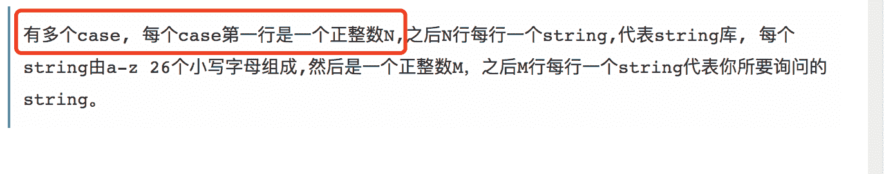

# 触宝科技 2017 秋季校招研发笔试题(第四批)

## 1

在平面上有 N 个点，他们有各自的速度向量。现在我们给出时刻 0 时他们的位置，还有各自的速度向量。在同一时刻，距离最远的一对点对称之为 special dots。现在，请你求出在哪个时刻 t(t>=0)，令当前 special dots 之间的距离最近，并输出这个距离。

本题知识点

模拟 穷举 数学 C++工程师 Java 工程师 数字认证 2017 触宝

## 2

判断一个 string 是否是另一个 string 的子串是一个普遍且重要的问题。现在你也要来解决一个关于子串的小问题。我们现在有一个数量不是很大的 string 库(0<n>本题知识点字符串 *穷举 模拟 C++工程师 Java 工程师 数字认证 2017 触宝* *讨论

[羽墨如歌](https://www.nowcoder.com/profile/7737745)

啊！！我的天，本身是道简单的题目，java 就更简单了，哇！我只想说认真独读题！！好吧！多个 case！！给代码

```cpp
package main;
import java.util.*;
public class Main {
    public static void main(String[] args) {
        Scanner input = new Scanner(System.in);
        //-------------敲重点-------------
        while(input.hasNext()){
        //-------------往上看-------------
            int N = input.nextInt();
            ArrayList<String> lib = new ArrayList<>();
            for (int i = 0; i < N; i++){
                lib.add(input.next());
            }
            int M = input.nextInt();
            ArrayList<String> res = new ArrayList<>();
            for (int i = 0; i < M; i++){
                String str = input.next();
                res.add(str);
            }
            for (int i = 0; i < res.size(); i++){
                int num = 0;
                for (int j = 0; j < lib.size(); j++){
                    if(lib.get(j).contains(res.get(i))){
                        num++;
                    }
                }
                System.out.println(num);
            }
        }
    }
}
```

发表于 2018-07-12 10:46:58

* * *

[牛客 6481049 号](https://www.nowcoder.com/profile/6481049)

```cpp
#include <string>
#include <vector>
#include <iostream>

using namespace std;

inline int getResult(const vector<string>& vec, const string& str) {
    int count = 0;
    for(const auto& it : vec) {
        if(it.find(str) != string::npos)
            ++count;
    }
    return count;
}

int main() {
    int N = 0;
    while(cin >> N) {
        vector<string> vec;
        vec.reserve(N);
        for(int i = 0; i < N; ++i) {
            string str;
            cin>>str;
            vec.push_back(str);
        }

        int M = 0;
        cin>>M;
        for(int i = 0; i < M;++i) {
            string str;
            cin>>str;
            auto res = getResult(vec,str);
            cout<<res<<endl;
        }
    }
    return 0;
}

```

发表于 2018-10-01 10:52:46

* * *

[Camlo15](https://www.nowcoder.com/profile/6383674)

出这道题的语文老师死的比较早

发表于 2018-07-17 16:38:45

* * *

## 3

以下表的设计，最合理的是

正确答案: A   你的答案: 空 (错误)

```cpp
学生{id,name,age} ,学科{id,name} 分数{学生 id,学科 id,分数}
```

```cpp
学生{id,name,age} ,分数{学生 id, 学科 id, 学科 name , 分数}
```

```cpp
分数{学生 id, 学生 name，学生 age, 学科 id，学科名称, 分数, }
```

```cpp
学科{id,name},分数{学生 id，学生姓名，学生 age，学科 id,分数}
```

本题知识点

C++工程师 Java 工程师 数字认证 2017 触宝

讨论

[xxxxxxxxxxxxxxxa](https://www.nowcoder.com/profile/4397117)

这样，会最大程度减少表记录的数量，既存储体积。通过 join 查询可以生成所有所需的信息。

发表于 2018-07-18 12:28:18

* * *

## 4

根据 TCP/IP 协议栈的分层来看 HTTP 协议工作在哪一层

正确答案: D   你的答案: 空 (错误)

```cpp
数据链路层
```

```cpp
网络层
```

```cpp
传输层
```

```cpp
应用层
```

本题知识点

C++工程师 Java 工程师 数字认证 2017 触宝

## 5

用容积分别为 15 升和 27 升的两个杯子向一个水桶中装水，可以精确向水桶中注入多少升水

正确答案: C   你的答案: 空 (错误)

```cpp
53
```

```cpp
25
```

```cpp
33
```

```cpp
52
```

本题知识点

C++工程师 Java 工程师 数字认证 2017 触宝

讨论

[不会 CRUD 的 boy(已毕业)](https://www.nowcoder.com/profile/3018058)

15*4-27=33

发表于 2019-02-21 14:05:36

* * *

## 6

一副牌 52 张(去掉大小王)，从中抽取两张牌，一红一黑的概率是多少

正确答案: A   你的答案: 空 (错误)

```cpp
26/51
```

```cpp
25/51
```

```cpp
26/52
```

```cpp
25/52
```

本题知识点

C++工程师 Java 工程师 数字认证 2017 触宝

讨论

[xxxxxxxxxxxxxxxa](https://www.nowcoder.com/profile/4397117)

一红一黑

 26/52×26/51×2=26/51

发表于 2018-07-18 12:33:09

* * *

## 7

字符串"//＾▽＾//\n"的长度是

正确答案: C   你的答案: 空 (错误)

```cpp
6
```

```cpp
7
```

```cpp
8
```

```cpp
9
```

本题知识点

C++工程师 Java 工程师 数字认证 2017 触宝

讨论

[陈伟 0813](https://www.nowcoder.com/profile/861819239)

因为//不是\\不是换行符 代表两个  \n 是换行符 代表一个  所以共有八个

发表于 2018-07-18 10:29:20

* * *

## 8

一个查询语句执行后显示的结果为 1 班 80 2 班 75 3 班 NULL 则最有可能的查询语句是

正确答案: B   你的答案: 空 (错误)

```cpp
SELECT AVG(成绩) FROM 成绩表 WHERE class&lt;=3
```

```cpp
SELECT AVG(成绩) FROM 成绩表 WHERE class&lt;=3 GROUP BY class
```

```cpp
SELECT AVG(成绩) FROM 成绩表 WHERE class&lt;=3 order by class
```

```cpp
SELECT AVG(成绩) FROM 成绩表 HAVING class &lt;=3 GROUP BY class
```

本题知识点

C++工程师 Java 工程师 数字认证 2017 触宝

讨论

[hY201909052003717](https://www.nowcoder.com/profile/554581865)

&lt; 是 “<” 的意思。因为在 html 中 “<” “>” 这些符号有特殊意义，所以用符号替代替代，shell 中也是类似。类似的还有 &gt;&eq;..

发表于 2020-04-28 13:49:28

* * *

## 9

执行以下代码#define SUM(x,y) x+yint a=3;int b=2;a+=a*SUM(a,b)*b;a 的值为

正确答案: A   你的答案: 空 (错误)

```cpp
16
```

```cpp
30
```

```cpp
33
```

```cpp
39
```

本题知识点

C++工程师 Java 工程师 数字认证 2017 C 语言 触宝

讨论

[琉璃 _123](https://www.nowcoder.com/profile/142281204)

这里主要是理解#define，算最后结果的时候实际式子是 a=a+(a*a+b*b),也就是 3+3*3+2*2=16

发表于 2019-05-04 21:04:05

* * *

[swz-study](https://www.nowcoder.com/profile/342289907)

define 直接替换 相当于 a+=(a*x+y*b)

发表于 2020-10-12 22:11:53

* * *

[牛客 143068 号](https://www.nowcoder.com/profile/143068)

#define 就是简单的替换，算最后结果的时候实际式子是 a=a+(a*a+b*b),也就是 3+3*3+2*2=16

发表于 2021-11-04 10:10:55

* * *

## 10

一个栈的入栈序列为 ABCDE，则栈的不可能的输出序列为

正确答案: D   你的答案: 空 (错误)

```cpp
DCBEA
```

```cpp
ACBED
```

```cpp
DCEBA
```

```cpp
DEBCA
```

本题知识点

C++工程师 Java 工程师 数字认证 2017 触宝

## 11

下面数据结构能够支持随机的插入和删除操作、并具有较好的性能的是

正确答案: A   你的答案: 空 (错误)

```cpp
链表和哈希表
```

```cpp
数组和链表
```

```cpp
哈希表和队列
```

```cpp
堆栈和双向队列
```

本题知识点

C++工程师 Java 工程师 数字认证 2017 触宝

## 12

 1 台机器对 200 个单词进行排序花了 200 秒(使用冒泡排序)，那么花费 800 秒，大概可以对多少个单词进行排序

正确答案: A   你的答案: 空 (错误)

```cpp
400
```

```cpp
500
```

```cpp
600
```

```cpp
800
```

本题知识点

C++工程师 Java 工程师 数字认证 2017 触宝

讨论

[陈伟 0813](https://www.nowcoder.com/profile/861819239)

```cpp
冒泡排序算法时间复杂度为 O(n²)
这里时间跟数量的关系公式可以简约的看做如下：
T  = k * n²，代入数据求 K
200 = k*200*200
得出 K=1/200
所以 800 = 1/200   *  n²
n = 400
```

发表于 2018-07-18 11:35:28

* * *

## 13

编译程序是一种

正确答案: A   你的答案: 空 (错误)

```cpp
翻译程序
```

```cpp
目标程序
```

```cpp
汇编程序
```

```cpp
解释程序
```

本题知识点

C++工程师 Java 工程师 数字认证 2017 触宝

## 14

如果某系统 12*5=61 成立，则系统采用的是()进制

正确答案: C   你的答案: 空 (错误)

```cpp
7
```

```cpp
8
```

```cpp
9
```

```cpp
10
```

本题知识点

C++工程师 Java 工程师 数字认证 2017 触宝

讨论

[陈伟 0813](https://www.nowcoder.com/profile/861819239)

假设是 X 进制 则：（x+2）*5 =6*x +1 求解得：x = 9

发表于 2018-07-18 11:45:16

* * *

## 15

对于以下代码，char* p=new char[100];正确的是

正确答案: D   你的答案: 空 (错误)

```cpp
p 和 new 出来的内存都在栈上
```

```cpp
p 和 new 出来的内存都在堆上
```

```cpp
p 在堆上，new 出来的在栈上
```

```cpp
p 在栈上，new 出来的在堆上
```

本题知识点

C++工程师 Java 工程师 数字认证 2017 C 语言 触宝

讨论

[陈伟 0813](https://www.nowcoder.com/profile/861819239)

动态分配在堆中，其它的内存分配都在栈上进行。

发表于 2018-07-18 11:47:06

* * *

## 16

正常建立一条 TCP 连接需要（）个步骤，正常关闭一个 TCP 连接需要（）个步骤

正确答案: B   你的答案: 空 (错误)

```cpp
3,3
```

```cpp
3,4
```

```cpp
4,4
```

```cpp
4,3
```

本题知识点

C++工程师 Java 工程师 数字认证 2017 触宝

## 17

 以下开源软件中经常被用作消息队列的是哪个

正确答案: A   你的答案: 空 (错误)

```cpp
Kafka
```

```cpp
MongoDB
```

```cpp
Hadoop
```

```cpp
Spark
```

本题知识点

C++工程师 Java 工程师 数字认证 2017 触宝

讨论

[陈伟 0813](https://www.nowcoder.com/profile/861819239)

Redis 和 kafka 都是常见的开源队列。

发表于 2018-07-18 11:49:03

* * *

## 18

现有 4 个同时到达的作业 J1,J2,J3 和 J4,它们的执行时间分别是 1 小时，3 小时，5 小时，7 小时，系统按单道方式运行且采用短作业优先算法，则平均周转时间是（）小时

正确答案: D   你的答案: 空 (错误)

```cpp
4
```

```cpp
5
```

```cpp
6
```

```cpp
7.5
```

本题知识点

C++工程师 Java 工程师 数字认证 2017 触宝

讨论

[迪恩亿](https://www.nowcoder.com/profile/9611411)

周转时间：执行完毕时间-作业提交时间； 平均周转就是取平均值； 所以结果就是（1+4+9+16）/4=7.5

发表于 2018-09-27 08:57:35

* * *

## 19

在给定文件中查找与设定条件相符字符串的命令

正确答案: B   你的答案: 空 (错误)

```cpp
gzip
```

```cpp
grep
```

```cpp
ls
```

```cpp
find
```

本题知识点

C++工程师 Java 工程师 数字认证 2017 触宝

## 20

Linux 文件权限一共 10 位长度，分成四段，第三段表示的内容是

正确答案: B   你的答案: 空 (错误)

```cpp
文件所有者的权限
```

```cpp
文件所有者所在组的权限
```

```cpp
其他用户的权限
```

```cpp
文件类型
```

本题知识点

C++工程师 Java 工程师 数字认证 2017 触宝

讨论

[不会 CRUD 的 boy(已毕业)](https://www.nowcoder.com/profile/3018058)

第一段  -  是指文件类型 表示这是个普通文件第二段  rwz  是指拥有者具有可读可写可执行的权限  第三段  rwz 是指所属于这个组的成员对于这个文件具有，可读可写可执行的权限      第四段  --- 是指其他人对于这个文件没有任何权限

发表于 2019-02-21 13:59:55

* * *

## 21

计算一个任意三角形的面积，S=√(p(p-a)(p-b)(p-c)),p=(a+b+c)/2,以下等价类测试用例中，不属于无效等价类的是

正确答案: A   你的答案: 空 (错误)

```cpp
a=5，b=3，c=6;
```

```cpp
a=2，b=3，c=5;
```

```cpp
a=7，b=3，c=3;
```

```cpp
a=2，b=6，c=3;
```

本题知识点

C++工程师 Java 工程师 数字认证 2017 触宝

## 22

在黑盒测试方法中，设计测试用例的主要根据是

正确答案: B   你的答案: 空 (错误)

```cpp
程序内部逻辑
```

```cpp
程序外部功能
```

```cpp
程序数据结构
```

```cpp
程序流程图
```

本题知识点

C++工程师 Java 工程师 数字认证 2017 触宝

## 23

移动端开发中常用的数据库是

正确答案: C   你的答案: 空 (错误)

```cpp
MySQL
```

```cpp
Oracle
```

```cpp
SQLite
```

```cpp
MongoDB
```

本题知识点

C++工程师 Java 工程师 数字认证 2017 触宝

## 24

目前移动设备主流的屏幕帧率是每秒()帧

正确答案: C   你的答案: 空 (错误)

```cpp
24
```

```cpp
30
```

```cpp
60
```

```cpp
120
```

本题知识点

C++工程师 Java 工程师 数字认证 2017 触宝

## 25

在移动设备息屏时，以下哪种情况不一定导致大量耗电

正确答案: D   你的答案: 空 (错误)

```cpp
使用 gps 导航
```

```cpp
信号特别弱
```

```cpp
电话通话中
```

```cpp
打开过大量应用
```

本题知识点

C++工程师 Java 工程师 数字认证 2017 触宝

## 26

从 sd 卡加载一张图片为 bitmap 并显示到屏幕上的一个 view，该 view 占用的内存主要和什么因素有关 

正确答案: D   你的答案: 空 (错误)

```cpp
图片文件大小及压缩格式
```

```cpp
图片原始分辨率
```

```cpp
view 的尺寸
```

```cpp
bitmap 分辨率和颜色位数
```

本题知识点

C++工程师 Java 工程师 数字认证 2017 触宝

## 27

这是第 25 道选择题，也是最后一道选择题。请估算一下，包括本题在内，这 25 道选择题题干及选项总共大约有多少个字符？

正确答案: C   你的答案: 空 (错误)

```cpp
500
```

```cpp
1000
```

```cpp
2000
```

```cpp
4000
```

本题知识点

C++工程师 Java 工程师 数字认证 2017 触宝*</n>